# The OSI Physical Layer

Mô hình OSI (Open Systems Interconnection) là nền tảng cốt lõi của mạng máy tính, và tầng đầu tiên mà chúng ta cần thấu hiểu chính là **Tầng Vật lý (Physical Layer - Layer 1)**. Đây là tầng thấp nhất, nơi mọi dữ liệu trừu tượng từ các ứng dụng cao cấp được "hạ cánh" xuống thế giới vật chất để truyền tải.

### 1. Bản chất của Tầng Vật lý
Tầng vật lý chịu trách nhiệm truyền tải "bits" (đơn vị nhị phân 0 và 1) qua các phương tiện truyền dẫn. Nó không quan tâm đến nội dung của dữ liệu (email, video hay văn bản), nó chỉ quan tâm đến việc: Làm sao để chuyển dòng điện, ánh sáng hoặc sóng vô tuyến từ điểm A sang điểm B một cách nguyên vẹn.

Các đặc tính vật lý và điện bao gồm:
*   **Phương tiện truyền dẫn:** Cáp đồng (Copper), cáp quang (Fiber optic), hoặc không gian tự do (sóng vô tuyến trong Wi-Fi).
*   **Tiêu chuẩn kỹ thuật:** Các chuẩn cáp như Cat 5, Cat 6 xác định tốc độ và khoảng cách truyền dẫn.
*   **Hình dạng kết nối:** Các đầu cắm vật lý như RJ45.

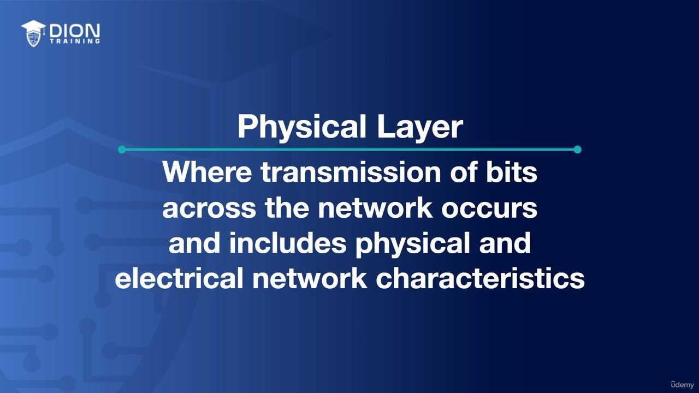

### 2. Sự chuyển đổi tín hiệu (Transition Modulation)
Dữ liệu trong máy tính là kỹ thuật số, nhưng khi truyền đi, chúng phải được chuyển đổi thành tín hiệu vật lý. Đây là cách các "0" và "1" được hiện thực hóa:

*   **Đối với cáp đồng (Điện áp):**
    Chúng ta không gửi số "1" hay "0" qua dây điện mà gửi mức điện áp. Ví dụ, mức 0V có thể đại diện cho bit "0", và mức +5V hoặc -5V đại diện cho bit "1". Việc thay đổi giữa hai trạng thái điện áp này được gọi là **Transition Modulation**. Máy thu sẽ liên tục đo điện áp trên dây để suy luận ra chuỗi bit tương ứng.
*   **Đối với cáp quang (Ánh sáng):**
    Cáp quang sử dụng xung ánh sáng để truyền dữ liệu. Đây là cơ chế đơn giản hơn về mặt logic: Ánh sáng BẬT đại diện cho bit "1", ánh sáng TẮT đại diện cho bit "0".

> **💡 Ví dụ nhớ đời:** Hãy tưởng tượng bạn đang gửi tín hiệu cho bạn mình ở tòa nhà đối diện vào ban đêm bằng một chiếc đèn pin. Việc bạn bật đèn là bit "1", tắt đèn là bit "0". Tầng vật lý chính là chiếc đèn pin và khoảng không gian giữa hai tòa nhà. Nếu bạn che đèn bằng vải đỏ, đó là đặc tính vật lý (bước sóng ánh sáng). Nếu bạn dùng mã Morse, đó là cách bạn "điều biến" (modulate) dữ liệu. Dù bạn dùng mã gì, bản chất vẫn là việc kiểm soát trạng thái BẬT/TẮT.

### 3. Thành phần vật lý: Cáp và Đầu nối (Connectors)
Một phần không thể thiếu của Tầng 1 là cơ sở hạ tầng thực tế. Khi chúng ta sử dụng cáp xoắn đôi (Twisted Pair) như Cat 5 hoặc Cat 6, các sợi dây đồng bên trong phải được sắp xếp theo một thứ tự chính xác để đảm bảo tín hiệu không bị nhiễu.

Đầu nối **RJ45** là một ví dụ điển hình của Tầng vật lý. Nó cung cấp một giao diện tiêu chuẩn hóa để kết nối thiết bị với mạng.

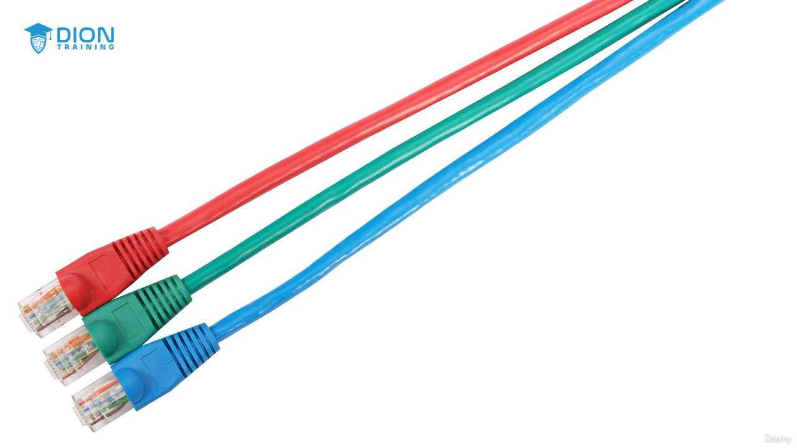

Sự quan trọng của chuẩn hóa: Nếu bạn không sử dụng đúng chuẩn bấm dây (như T568A hay T568B), các chân (pins) bên trong đầu RJ45 sẽ không khớp với thiết bị nhận (switch hoặc máy tính), dẫn đến việc tín hiệu điện không thể truyền đi hoặc bị lỗi ngay lập tức. Đây là lý do tại sao ở Tầng 1, việc hiểu rõ các tiêu chuẩn về vật lý lại quyết định khả năng kết nối của toàn bộ hệ thống.

Trong nội dung này, chúng ta tập trung vào hai trụ cột chính của lớp Vật lý (Layer 1) trong mô hình OSI: **Chuẩn đi dây (Wiring Standards)** và **Topo mạng (Network Topology)**, cùng với bài toán đồng bộ hóa dữ liệu.

### 1. Phân tích chuẩn đi dây: TIA/EIA-568A và 568B
Mạng Ethernet sử dụng cáp xoắn đôi (twisted pair) với 8 sợi đồng nhỏ bên trong. Để các thiết bị hiểu được nhau, cần có quy chuẩn về việc sợi nào nối vào chân (pin) nào trong đầu nối RJ-45. Hiệp hội Công nghiệp Viễn thông (TIA) và Liên minh Công nghiệp Điện tử (EIA) đã đưa ra hai chuẩn chính: 568A và 568B.

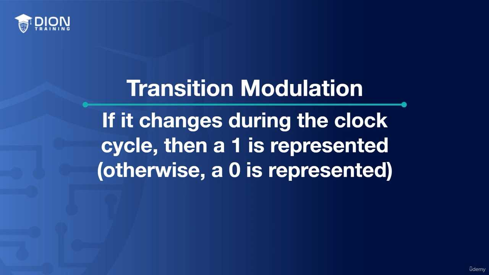

*   **Cáp thẳng (Straight-through cable):** Đây là loại cáp phổ biến nhất. Ở cả hai đầu sợi cáp, thứ tự màu sắc của các sợi đồng được bấm theo cùng một chuẩn (thường là chuẩn B ở cả hai đầu). Nó dùng để kết nối các thiết bị không cùng tầng (ví dụ: PC nối vào Switch).
*   **Cáp chéo (Crossover cable):** Đây là "phép thuật" thay đổi luồng dữ liệu. Bằng cách bấm một đầu theo chuẩn A và đầu kia theo chuẩn B, chúng ta thực hiện việc đảo chéo các chân truyền (Transmit - Tx) thành chân nhận (Receive - Rx) và ngược lại. Điều này cho phép hai thiết bị cùng loại (như hai Switch hoặc hai PC) có thể "nói chuyện" trực tiếp với nhau mà không cần thiết bị trung gian.

> **💡 Ví dụ nhớ đời:** Hãy tưởng tượng cáp thẳng giống như việc bạn và bạn của bạn cùng nói tiếng Việt (cùng quy ước). Còn cáp chéo giống như một bộ chuyển đổi ngôn ngữ cực kỳ đặc biệt: nó tự động hoán đổi vị trí của "người nói" và "người nghe" ngay trong đường dây, để lời nói của người này chắc chắn lọt vào tai người kia mà không bị va chạm tín hiệu.

Việc nắm vững kỹ thuật này không chỉ là kiến thức lý thuyết, mà là yêu cầu thực hành bắt buộc cho các kỳ thi chứng chỉ mạng. Bạn có thể sẽ phải thực hiện thao tác kéo-thả (drag-and-drop) để gán đúng màu cho đúng chân cắm trong các bài thi mô phỏng. Nếu sai màu, mạch sẽ không thông, tín hiệu sẽ mất.

### 2. Định nghĩa Topo mạng tại Layer 1
Topo mạng (Network Topology) đơn giản là "bản đồ kiến trúc" của hệ thống. Tại lớp vật lý, chúng ta không quan tâm đến phần mềm hay địa chỉ IP, chúng ta chỉ quan tâm đến: **Dây chạy đi đâu và kết nối như thế nào?**

*   **Bus:** Tất cả các thiết bị cùng nằm trên một sợi cáp chính duy nhất (kiểu nối tiếp).
*   **Ring:** Dây cáp nối các thiết bị tạo thành một vòng tròn khép kín.
*   **Star (Hình sao):** Đây là kiến trúc phổ biến nhất hiện nay, nơi tất cả các máy trạm đều nối về một trung tâm (như Switch hoặc Hub).
*   **Mesh (Lưới):** Các thiết bị được kết nối chằng chịt với nhau, cung cấp khả năng dự phòng cực cao (Full mesh là mọi thiết bị nối với mọi thiết bị còn lại).

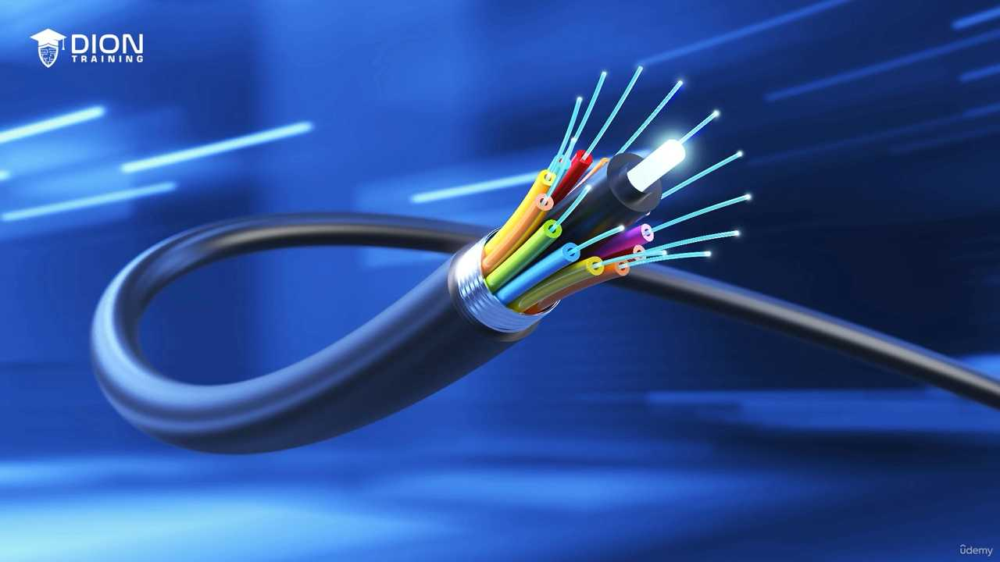

Cách xác định topo cực kỳ đơn giản: Nếu bạn vẽ sơ đồ kết nối cáp ra giấy, hình dáng của các đường kẻ đó chính là Topo vật lý của bạn. Việc hiểu rõ Topo giúp bạn chẩn đoán sự cố: Nếu cáp chính bị đứt trong topo Bus, toàn bộ mạng sẽ "chết", trong khi ở topo Star, chỉ có thiết bị nối vào sợi cáp đó bị ảnh hưởng.

### 3. Bài toán đồng bộ hóa (Synchronization)
Khi chúng ta đã có cáp, đã có chuẩn bấm dây, và đã có sơ đồ Topo, câu hỏi cuối cùng tại Layer 1 là: **Làm sao để bên nhận biết khi nào dữ liệu bắt đầu đến?**

Trong truyền thông máy tính, đây là một thách thức lớn về thời gian. Dữ liệu chạy qua dây dưới dạng các xung điện (ones và zeros). Nếu máy nhận không "lắng nghe" đúng lúc máy phát "nói", nó sẽ bỏ lỡ toàn bộ thông điệp hoặc hiểu sai hoàn toàn các bit dữ liệu. 

Máy tính cần một nhịp đập chung (clock signal) hoặc các kỹ thuật tiền đề (preamble) để báo hiệu cho bên nhận rằng: "Chuẩn bị nhé, dữ liệu bắt đầu truyền đây!". Nếu không có sự đồng bộ này, việc gửi 1 tỷ bit mỗi giây sẽ trở nên vô nghĩa vì máy nhận không thể phân biệt được đâu là bit dữ liệu, đâu là nhiễu điện từ. Đây chính là ranh giới giữa việc truyền tải thành công và một kết nối bị lỗi tín hiệu (signal corruption).

Trong kỹ thuật mạng, việc hiểu cách dữ liệu di chuyển từ điểm A đến điểm B là nền tảng cốt lõi. Đoạn transcript này tập trung vào hai trục kiến thức chính: phương thức truyền tải (Asynchronous vs. Synchronous) và cách quản lý băng thông (Broadband vs. Baseband).

### 1. Phân biệt Truyền tải Không đồng bộ (Asynchronous) và Đồng bộ (Synchronous)

Đây là hai phương pháp cơ bản để thiết lập nhịp điệu cho việc trao đổi dữ liệu giữa các thiết bị.

#### A. Truyền tải không đồng bộ (Asynchronous)
Đặc trưng của phương pháp này là tính chất "rời rạc về thời gian". Dữ liệu không nhất thiết phải được gửi theo một khung thời gian cố định. Để đảm bảo phía nhận biết khi nào thông tin bắt đầu và khi nào kết thúc, hệ thống sử dụng các tín hiệu điều khiển.

*   **Cơ chế:** Sử dụng "Start bit" (bit bắt đầu) để báo hiệu cho máy thu rằng một gói tin sắp đến, và "Stop bit" (bit dừng) để xác nhận dữ liệu đã được truyền xong.
*   **Tương tự thực tế:** Hãy tưởng tượng việc gửi thư hoặc tin nhắn thoại. Bạn không cần người nhận phải ngồi chờ sẵn bên máy điện thoại. Bạn để lại tin nhắn, hệ thống lưu trữ nó, và người nhận sẽ truy cập vào thời điểm họ muốn.

> **💡 Ví dụ nhớ đời:** Hãy coi Asynchronous giống như việc bạn gửi một bức thư chuyển phát nhanh. Bạn dán tem (Start bit) để đánh dấu điểm bắt đầu hành trình, và ký tên xác nhận đã gửi xong. Người nhận không cần đứng đợi ở bưu điện; họ sẽ ra lấy thư khi nào họ tiện.

#### B. Truyền tải đồng bộ (Synchronous)
Phương pháp này đòi hỏi sự "kết nối thời gian thực". Cả bên gửi và bên nhận phải hoạt động trên cùng một nhịp đập.

*   **Cơ chế:** Thay vì dùng các bit báo hiệu đầu-cuối như trên, người ta sử dụng một nguồn đồng hồ chung (common time source). Hãy tưởng tượng như một dàn nhạc giao hưởng chơi theo nhịp của người chỉ huy; mỗi người chơi đều biết chính xác khi nào phải đánh nốt nhạc dựa trên nhịp đập.
*   **Lợi ích:** Tốc độ truyền tải nhanh hơn và hiệu quả hơn vì không cần các bit dư thừa (Start/Stop) đính kèm trong mỗi byte dữ liệu.

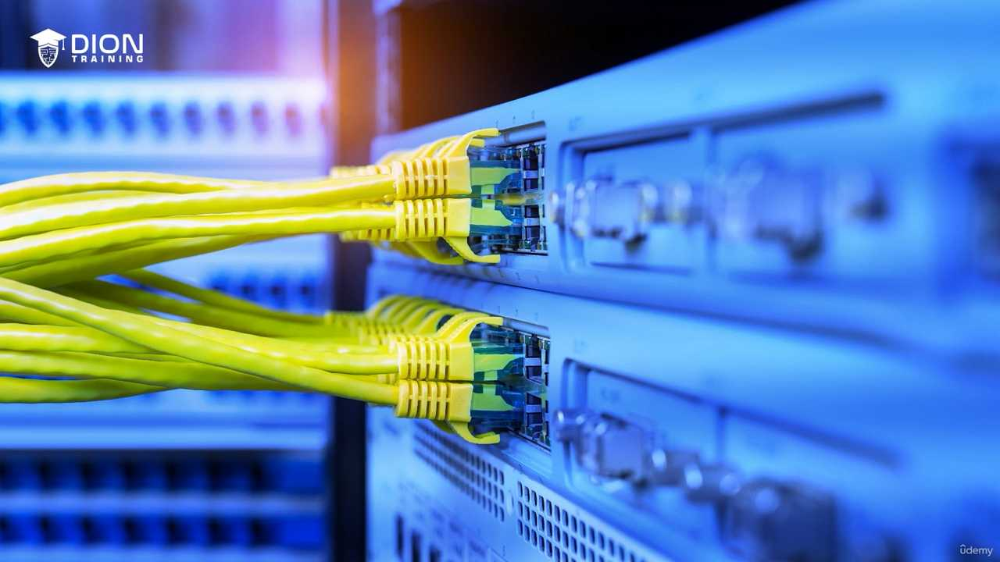 (Sơ đồ so sánh: Dòng dữ liệu rời rạc có Start/Stop bit của Asynchronous đặt cạnh dòng dữ liệu liên tục, nhịp nhàng theo xung nhịp của Synchronous).

> **💡 Ví dụ nhớ đời:** Nếu Asynchronous là tin nhắn thoại, thì Synchronous chính là cuộc gọi video trực tuyến (như Zoom hay Skype). Nếu một trong hai bên dừng lại hoặc mất kết nối về thời gian, cuộc hội thoại ngay lập tức bị gãy khúc vì cả hai không còn "nhịp nhàng" với nhau nữa.

---

### 2. Quản lý băng thông: Broadband vs. Baseband

Sau khi xác định cách truyền, chúng ta phải giải quyết bài toán: Làm thế nào để "nhồi" dữ liệu vào sợi cáp vật lý?

#### A. Broadband (Băng thông rộng)
Broadband hoạt động dựa trên nguyên lý **phân chia tài nguyên**. Băng thông của sợi cáp được chia nhỏ thành nhiều kênh (channel) riêng biệt bằng cách sử dụng các tần số khác nhau. 

*   **Đặc điểm:** Cho phép nhiều tín hiệu (video, thoại, internet) cùng tồn tại trên một đường truyền vật lý nhưng ở các dải tần số khác nhau. Giống như việc bạn có một đường ống nước lớn, bên trong chia thành nhiều ống nhỏ để dẫn các loại nước khác nhau (nước nóng, nước lạnh, nước lọc).
*   **Ứng dụng:** Hệ thống truyền hình cáp tại gia. Sợi cáp đồng trục đi vào nhà bạn là một nhưng có thể truyền tải hàng trăm kênh truyền hình. TV của bạn đóng vai trò là bộ lọc (tuner) để chọn đúng tần số của kênh bạn muốn xem.

#### B. Baseband (Băng thông cơ sở)
Baseband ngược lại hoàn toàn với Broadband. Nó sử dụng toàn bộ băng thông của sợi cáp cho duy nhất một tín hiệu tại một thời điểm.

*   **Đặc điểm:** Không phân chia kênh. Nếu bạn đang truyền dữ liệu, toàn bộ tài nguyên của cáp đó bị chiếm dụng. Mọi thiết bị trên đường truyền phải đợi hoặc chia sẻ theo thời gian.
*   **Ứng dụng:** Điện thoại truyền thống hoặc mạng Ethernet đời đầu. Nó đơn giản, rẻ tiền nhưng giới hạn khả năng đa nhiệm trên cùng một hạ tầng dây dẫn.

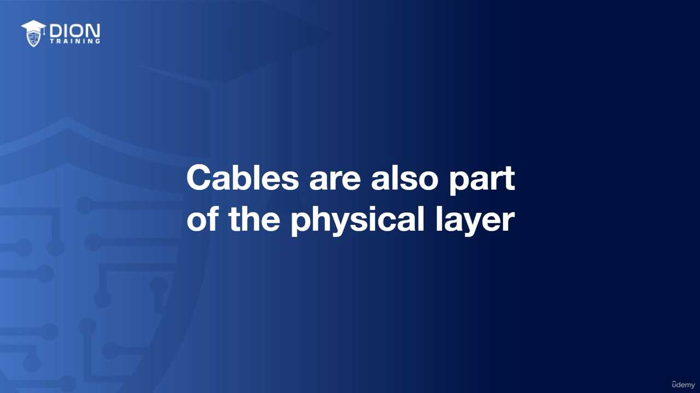 (Biểu đồ cột: Bên trái là Broadband với nhiều dải màu sắc khác nhau đại diện cho các kênh trên một sợi cáp; bên phải là Baseband với một dải màu duy nhất chiếm trọn không gian cáp).

> **💡 Ví dụ nhớ đời:** Broadband giống như một tòa nhà chung cư có nhiều căn hộ (mỗi kênh là một căn hộ riêng biệt, dù chung tòa nhà). Baseband giống như một căn nhà cấp 4 – dù to hay nhỏ, bạn chỉ có thể ở một mình hoặc phải chia sẻ không gian chung với người khác cùng thời điểm mà không có vách ngăn.

Để hiểu rõ cách thức truyền tải dữ liệu, chúng ta cần phân biệt rạch ròi giữa cách thức chiếm dụng băng thông (bandwidth) của tín hiệu điện thoại truyền thống và tín hiệu truyền hình cáp.

### Sự khác biệt giữa Baseband (Băng cơ sở) và Broadband (Băng thông rộng)

Khi bạn nhấc điện thoại lên để thực hiện một cuộc gọi (theo kiểu hạ tầng cũ), toàn bộ băng thông được cấp phát cho đường dây đó đã bị "khóa". Đó là lý do tại sao bạn không thể thực hiện hai cuộc gọi cùng lúc trên một đường dây điện thoại đơn lẻ – nó là môi trường độc chiếm. Ngược lại, truyền hình cáp vận hành theo nguyên lý Broadband, nơi hàng trăm kênh cùng tồn tại trên một sợi cáp, nhưng mỗi kênh chỉ chiếm một phần nhỏ băng thông. Chúng ta chỉ "trích xuất" (tune) tín hiệu của kênh mình muốn xem ra khỏi dải tần số chung đó.

Khái niệm **Baseband** mà văn bản đề cập hoạt động theo cách khác: nó sử dụng toàn bộ băng thông của cáp để truyền tín hiệu. Để đảm bảo phía gửi và phía nhận hiểu nhau, nó sử dụng một "reference clock" (xung nhịp tham chiếu). Đây là chìa khóa của **giao tiếp đồng bộ (synchronous communication)**. Hãy tưởng tượng như một dàn nhạc, tất cả các nhạc công phải nhìn vào tay chỉ huy (đồng hồ tham chiếu) để đảm bảo mọi nốt nhạc rơi đúng thời điểm. 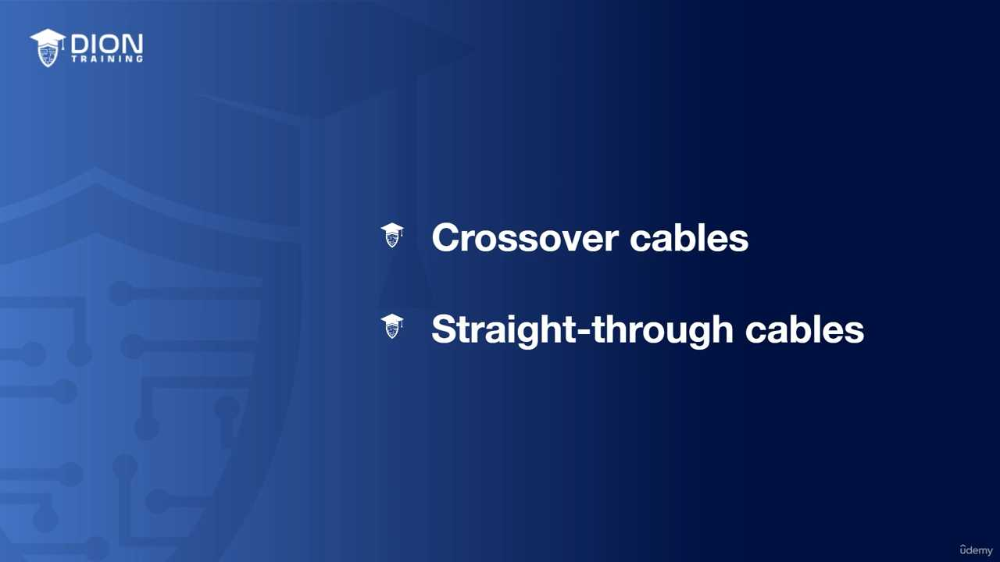

> **💡 Ví dụ nhớ đời:** Hãy coi Baseband giống như một con đường cao tốc chỉ có một làn xe duy nhất. Nếu có một chiếc xe tải khổng lồ đang chạy, nó chiếm toàn bộ mặt đường. Mọi phương tiện khác muốn đi qua đều phải đợi chiếc xe đó đi hết hoặc phải chia sẻ thời gian sử dụng làn đường đó một cách cực kỳ khéo léo. Ethernet trong nhà chính là ví dụ điển hình của Baseband: nó tận dụng tối đa tần số trên cáp để tối ưu hóa tốc độ truyền dữ liệu.

### Giải pháp tối ưu hóa băng thông: Multiplexing (Ghép kênh)

Vì Baseband chiếm toàn bộ băng thông, chúng ta gặp bài toán: Làm sao để nhiều luồng dữ liệu cùng sử dụng một đường truyền đơn lẻ? Câu trả lời là kỹ thuật Multiplexing.

#### 1. Time-Division Multiplexing (TDM - Ghép kênh phân chia theo thời gian)
Trong kỹ thuật này, mỗi phiên làm việc được cấp một "thời gian biểu" cố định. Giống như việc chia ca làm việc, mỗi người có 15 phút để sử dụng toàn bộ băng thông, bất kể họ có thực sự cần nó hay không. Nếu phiên của bạn đến mà bạn không có dữ liệu để truyền, "cửa sổ thời gian" đó sẽ bị bỏ phí.

> **💡 Ví dụ nhớ đời:** Hãy tưởng tượng một gia đình có 4 người nhưng chỉ có 1 chiếc TV. Cha, mẹ, con trai, con gái mỗi người được chia "đặc quyền" 30 phút. Nếu đến lượt con trai nhưng cậu ấy không muốn xem, chiếc TV phải để trống hoặc chiếu màn hình đen. Đây là sự lãng phí tài nguyên điển hình của TDM.

#### 2. Statistical Time-Division Multiplexing (StatTDM - TDM thống kê)
Đây là phiên bản nâng cấp và thông minh hơn của TDM. Thay vì chia thời gian cố định, StatTDM cấp phát băng thông dựa trên **nhu cầu thực tế**. Nó giống như một hệ thống đặt chỗ linh hoạt: ai cần thì dùng, không cần thì nhường cho người khác. Hệ thống này kiểm tra liên tục xem "khe cắm" nào đang trống và lấp đầy nó bằng dữ liệu đang chờ xử lý.

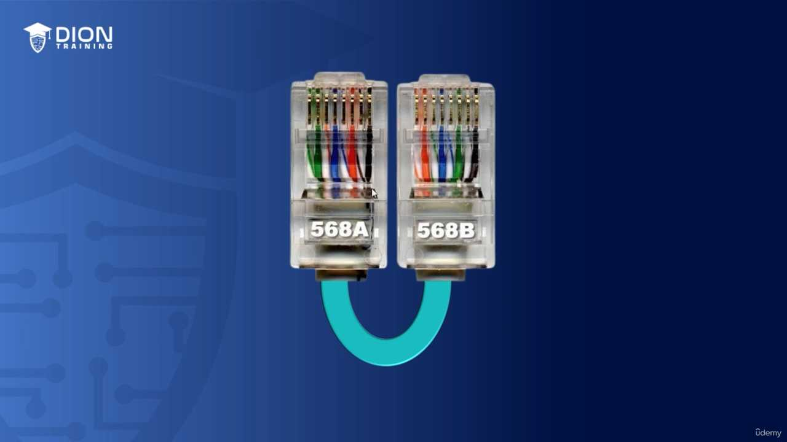

Sự khác biệt cốt lõi nằm ở tính **năng động (dynamically allocate)**. Trong khi TDM cứng nhắc như một thời khóa biểu ở trường học, thì StatTDM lại giống như một quán ăn tự phục vụ: người nào vào trước, cần phục vụ trước thì được ngồi vào bàn, không quan trọng đó là giờ giấc nào. Điều này giúp tận dụng tối đa hiệu suất của băng thông, tránh tình trạng "rảnh rỗi" của các khe thời gian khi không có dữ liệu thực sự được truyền tải.

Tiếp nối việc thảo luận về các kỹ thuật đa truy nhập (Multiplexing), diễn giả bắt đầu bằng việc làm rõ sự linh hoạt của các phương thức cấp phát tài nguyên, trước khi chuyển sang khái niệm cốt lõi về lớp Vật lý (Layer 1) trong mô hình OSI.

### 1. Phân tích Frequency-Division Multiplexing (FDM)
Trong đoạn trước, chúng ta đã thấy TDM (Time-Division Multiplexing) chia tài nguyên theo "thời gian". Ngược lại, **FDM (Ghép kênh phân chia theo tần số)** hoạt động bằng cách chia "dải tần số" của một môi trường truyền dẫn duy nhất thành nhiều kênh nhỏ hơn.

Hãy tưởng tượng một sợi cáp vật lý như một con đường cao tốc. Nếu TDM là việc cho phép mỗi xe chạy theo các khung giờ khác nhau, thì FDM giống như chia con đường đó thành các làn đường riêng biệt. Mỗi "làn" (kênh tần số) này cho phép dữ liệu truyền đi đồng thời mà không bị chồng lấn lên nhau.

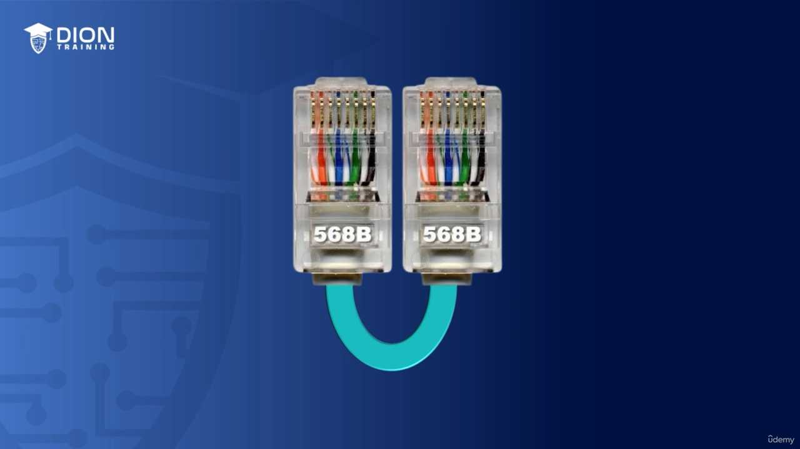 (Sơ đồ mô tả một dải tần rộng được cắt ra thành các dải nhỏ f1, f2, f3...)

> **💡 Ví dụ nhớ đời:** Hãy nghĩ về trạm phát thanh. Dải tần số FM mà bạn thu sóng trên radio là một ví dụ hoàn hảo của FDM. Cùng một không gian (môi trường truyền dẫn là không khí), nhưng đài A phát ở 99.9 MHz, đài B phát ở 102.7 MHz. Bạn không cần phải đợi đài A nói xong mới được nghe đài B, vì họ đang truyền trên các "tần số làn đường" khác nhau cùng một lúc.

### 2. Ý nghĩa thực dụng cho kỳ thi và thực tế
Diễn giả đưa ra lời khuyên chiến lược cho người học: Đừng quá sa đà vào việc học thuộc lòng sự khác biệt kỹ thuật của TDM, StatTDM hay FDM cho kỳ thi Network+. Thay vào đó, hãy nắm vững "Triết lý của Multiplexing": **Tối ưu hóa tài nguyên hữu hạn.**
*   **Triết lý:** Băng thông là đắt đỏ. Multiplexing là nghệ thuật "nhồi nhét" nhiều luồng dữ liệu nhất có thể vào một sợi cáp duy nhất mà vẫn đảm bảo tính toàn vẹn.
*   **Thực tế:** Trong công việc của một kỹ sư mạng, bạn sẽ gặp những thuật ngữ này thường xuyên (đặc biệt là trong hạ tầng viễn thông/ISP), nhưng trên bài thi, hãy nhớ từ khóa: "Nhiều người dùng, cùng một môi trường truyền dẫn (baseband), cùng lúc."

### 3. Thiết bị lớp Vật lý (Layer 1)
Bước sang phần thứ hai, bài học chuyển trọng tâm sang **Lớp 1 (Physical Layer) của mô hình OSI**. Lớp này là nền tảng "hữu hình" nhất của mạng máy tính.

**Định nghĩa về môi trường truyền dẫn (Media):**
Các loại cáp như cáp quang (fiber optic), cáp đồng (ethernet), hay cáp đồng trục (coaxial) đều được xếp vào Layer 1. Tại sao? Vì tính chất của chúng là "truyền dẫn thô".
*   Diễn giả nhấn mạnh: **"Cái gì vào thì cái đó ra"**.
*   Đây là nguyên tắc bất biến của vật lý: Nếu bạn đẩy ánh sáng vào một đầu cáp quang, ánh sáng sẽ ra ở đầu kia. Nếu bạn đưa xung điện vào một đầu cáp đồng, xung điện sẽ ra ở đầu kia. Hệ thống không hề "hiểu" dữ liệu đó là gì (không quan tâm đó là ảnh, email hay video), nó chỉ đơn thuần là vật trung gian vận chuyển các tín hiệu điện hoặc quang.

### 4. Truyền dẫn không dây và Thiết bị hạ tầng
Lớp Vật lý không chỉ giới hạn ở dây dẫn. Nó bao gồm mọi phương thức truyền tín hiệu cơ bản:
*   **Wireless (Bluetooth, Wi-Fi, NFC):** Tương tự như cáp, môi trường ở đây là sóng vô tuyến (radio frequencies). Khi bạn gửi một tệp qua Bluetooth, ở mức Layer 1, các thiết bị chỉ đơn thuần chuyển đổi dữ liệu thành các sóng vô tuyến trong không khí.
*   **Thiết bị hạ tầng (Hubs, Access Points, Media Converters):** Đây là những "công nhân" của tầng vật lý. Chúng được gọi là các thiết bị hoạt động tại **"bit layer"**.

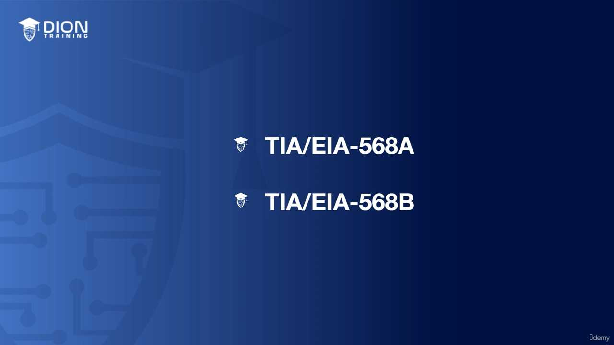 (Sơ đồ một Hub nhận tín hiệu và nhân bản ra tất cả các cổng còn lại)

Đặc điểm của các thiết bị này (đặc biệt là Hub) là tính chất **"Repeat" (Lặp lại)**:
*   Chúng không có "bộ não" để suy nghĩ hay phân tích địa chỉ IP/MAC.
*   Nếu Hub nhận được một tín hiệu điện từ cổng 1, nó sẽ ngay lập tức "bắn" tín hiệu đó ra tất cả các cổng còn lại (cổng 2, 3, 4). Nó giống như một người đưa tin mù chữ, nhận được thư là hô to nội dung đó cho tất cả mọi người trong phòng cùng nghe, bất kể thư đó gửi cho ai. Điều này khác biệt hoàn toàn với Switch (hoạt động ở Layer 2), vốn có khả năng "đọc" địa chỉ để chuyển tin đến đúng người nhận.

Trong đoạn transcript này, chúng ta đang tập trung vào thiết bị chuyển đổi môi trường (media converter) – một ví dụ điển hình của các thiết bị hoạt động tại tầng 1 (Physical Layer) trong mô hình OSI.

**Phân tích khái niệm Media Converter**
Thiết bị chuyển đổi môi trường là một phần cứng mạng cho phép kết nối hai loại phương tiện truyền dẫn khác nhau. Trong ví dụ cụ thể này, tác giả đề cập đến việc chuyển đổi từ cáp đồng trục (coaxial) sang cáp quang (fiber optic). Quá trình này không thay đổi dữ liệu mà chỉ thay đổi dạng tín hiệu vật lý: từ các xung điện (trên cáp đồng) sang xung ánh sáng (trên cáp quang). 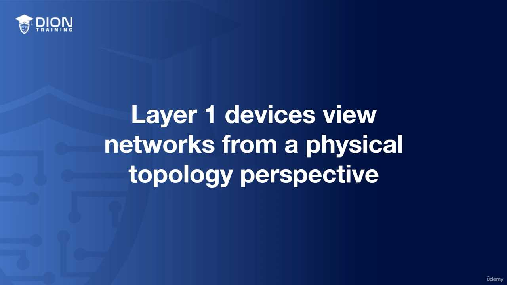

**Bản chất của Layer 1: Tính "thông minh" bằng không**
Khi nói thiết bị ở tầng 1 là "dumb" (ngu ngốc), tác giả muốn nhấn mạnh vào sự thiếu vắng logic xử lý dữ liệu. Một thiết bị tầng 1 không hiểu nội dung của gói tin (frame hay packet) là gì, không biết địa chỉ MAC là ai, và không biết IP đích ở đâu. Nó chỉ đơn thuần nhận tín hiệu từ một cổng và "đẩy" nó ra cổng kia. 

> **💡 Ví dụ nhớ đời:** Hãy tưởng tượng thiết bị tầng 1 giống như một chiếc gương phản chiếu. Nếu bạn đưa một tấm ảnh chân dung hay một tờ giấy trắng trước gương, nó sẽ phản chiếu lại y hệt hình ảnh đó. Cái gương không quan tâm đó là ảnh của ai hay nội dung tờ giấy viết gì; nó chỉ đơn thuần làm nhiệm vụ "phát lại" (repeat) hình ảnh đó ra phía trước.

**Cơ chế hoạt động: Repeater (Bộ lặp)**
Khái niệm "repeater" ở đây được hiểu là khả năng khôi phục và tái tạo tín hiệu. Khi tín hiệu đi qua cáp, nó bị suy hao (attenuation). Thiết bị tầng 1 tiếp nhận tín hiệu đã yếu, làm sạch và tăng cường nó, rồi truyền tiếp đi. Nó không thực hiện bất kỳ quy trình kiểm tra lỗi (error checking) hay lọc gói tin (filtering) nào. Mọi bit dữ liệu, dù là dữ liệu lỗi hay dữ liệu rác, đều được thiết bị này chuyển tiếp một cách mù quáng.

**Sự khác biệt với các tầng cao hơn**
Tác giả nhắc đến việc "chúng ta sẽ nói về các thiết bị hạ tầng khác khi tiến vào tầng 2, 3 và 4". Đây là sự chuẩn bị cho tư duy phân tầng mạng:
- **Tầng 1 (Physical):** Chỉ quan tâm đến bit (0 và 1), cáp, điện áp, ánh sáng.
- **Tầng 2 (Data Link):** Bắt đầu hiểu về địa chỉ MAC (Switch).
- **Tầng 3 (Network):** Bắt đầu hiểu về địa chỉ IP và định tuyến (Router).
- **Tầng 4 (Transport):** Bắt đầu hiểu về các giao thức như TCP/UDP.

Việc phân biệt rõ ràng tầng 1 là "dumb devices" giúp kỹ sư mạng hiểu rằng nếu có sự cố xảy ra ở tầng này, vấn đề thường nằm ở hạ tầng vật lý (đứt cáp, cổng hỏng, nhiễu điện) chứ không phải do cấu hình logic hay phần mềm.

**Thông điệp về sự kiên trì trong học tập**
Đoạn cuối của transcript chuyển hướng sang lời khuyên về thói quen học tập. Việc "làm mỗi ngày một ít" (learning a little each day) cực kỳ quan trọng trong lĩnh vực công nghệ thông tin – nơi kiến thức thay đổi và chồng chất rất nhanh. Giống như cách dữ liệu đi qua tầng 1, sự tích lũy kiến thức nhỏ lẻ mỗi ngày (từng bit một) cuối cùng sẽ tạo nên một luồng thông tin (bandwidth) khổng lồ và sâu sắc cho tư duy của người kỹ sư.

### Hình ảnh minh họa thêm:

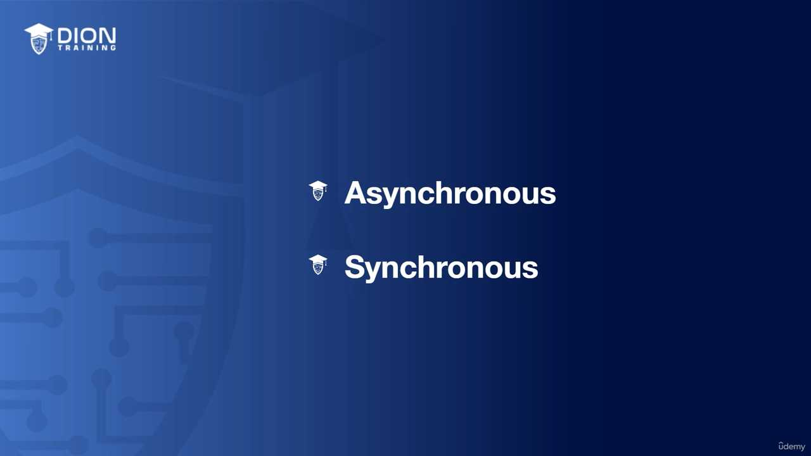
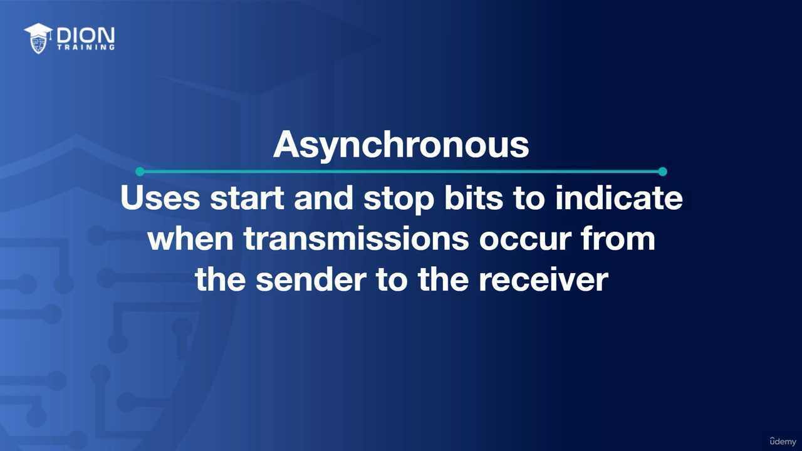
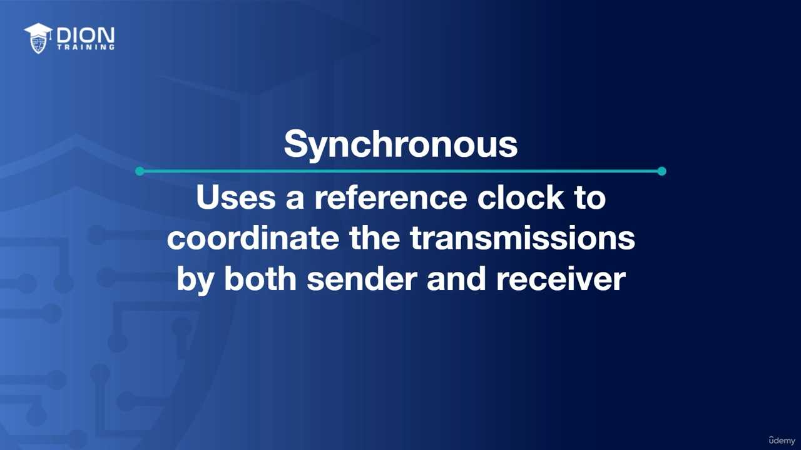
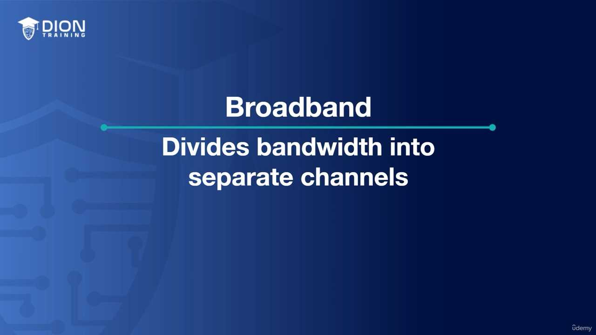
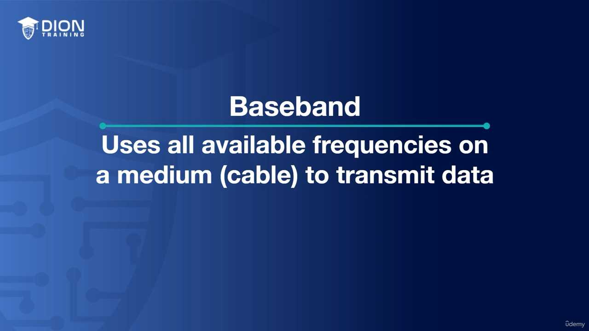
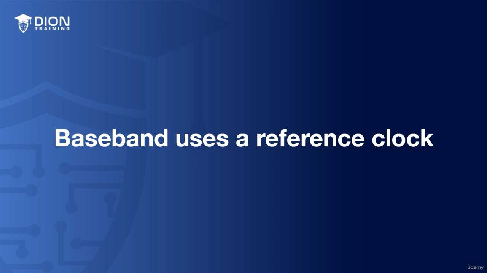
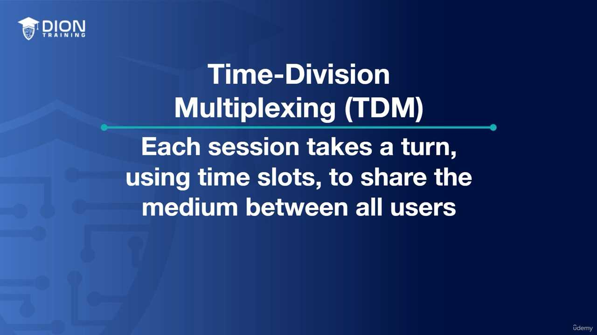
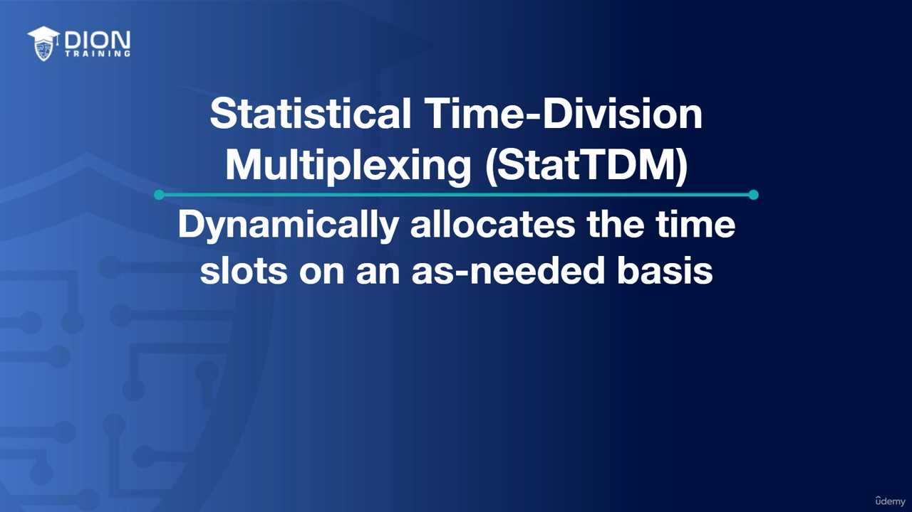
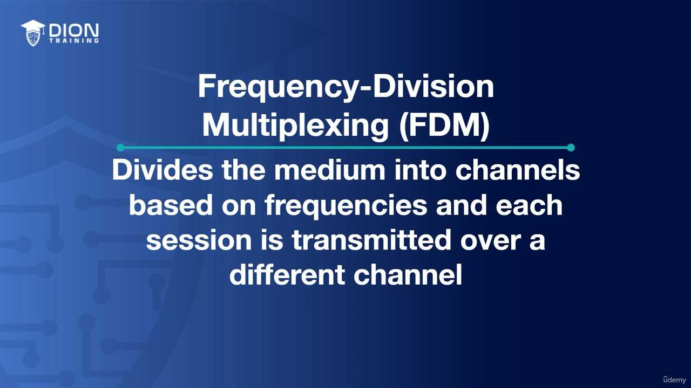
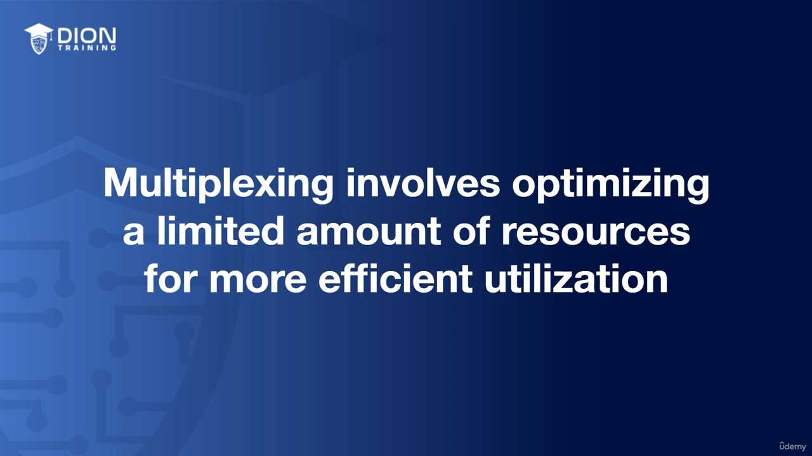
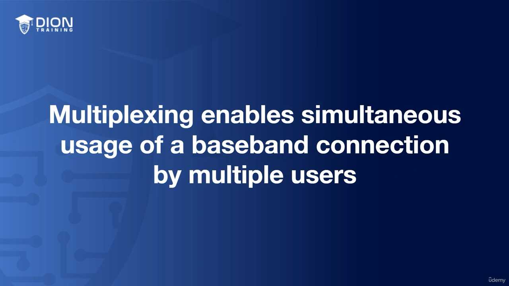

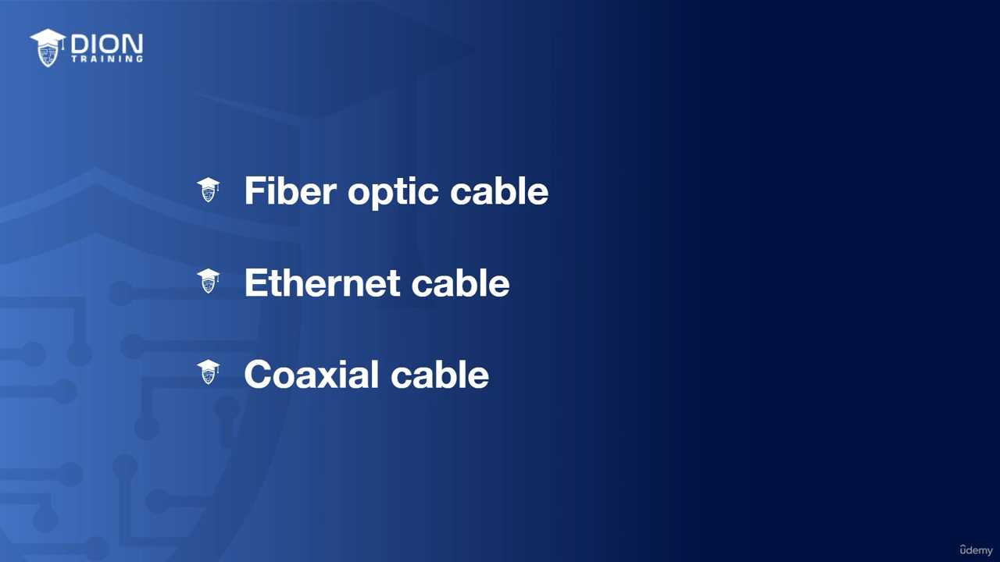
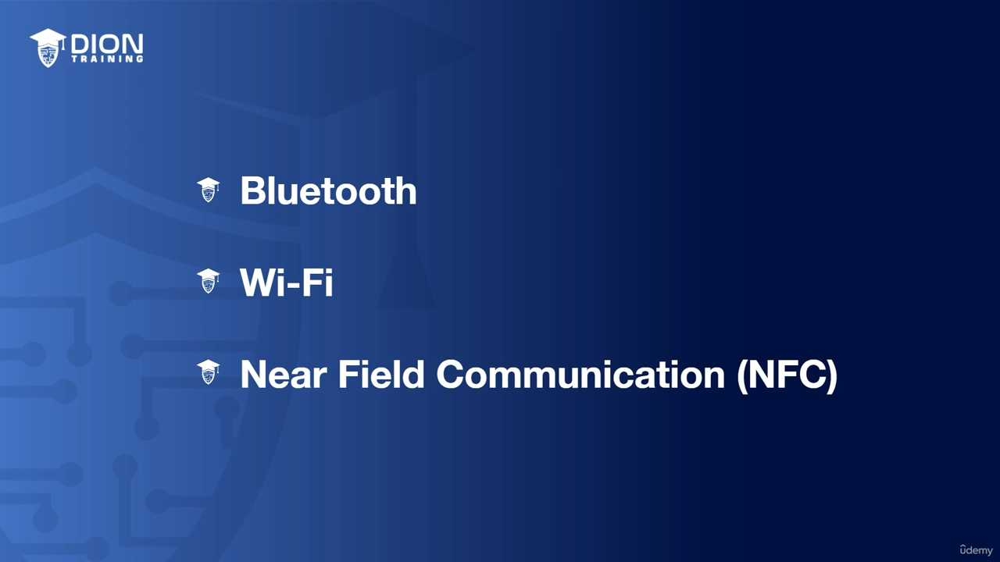
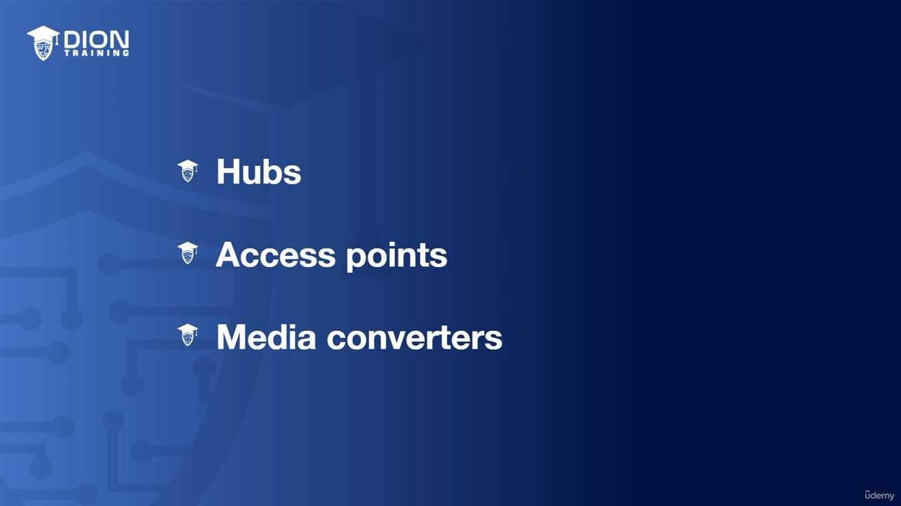
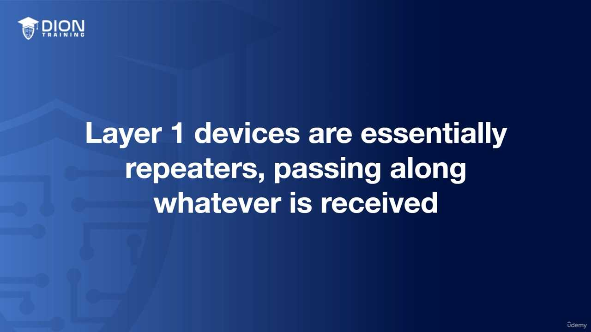

---
*Ghi chú: 28 hình ảnh minh họa (.jpg) đã được tải về và lưu tự động vào thư mục con `image/` cùng cấp với file này. Để ảnh hiển thị tự động, hãy đảm bảo bạn sao chép cả thư mục `image/` nếu bạn muốn di chuyển file markdown sang nơi khác!*
