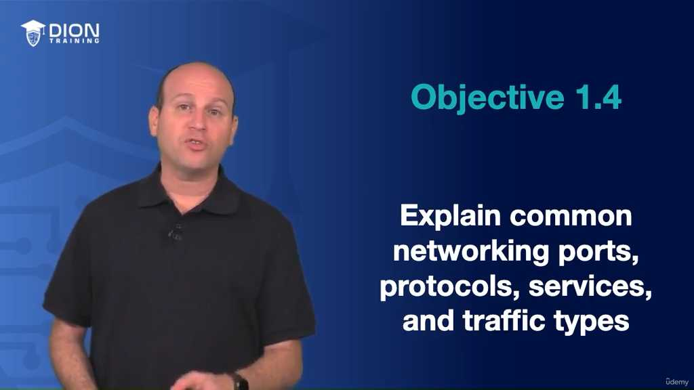
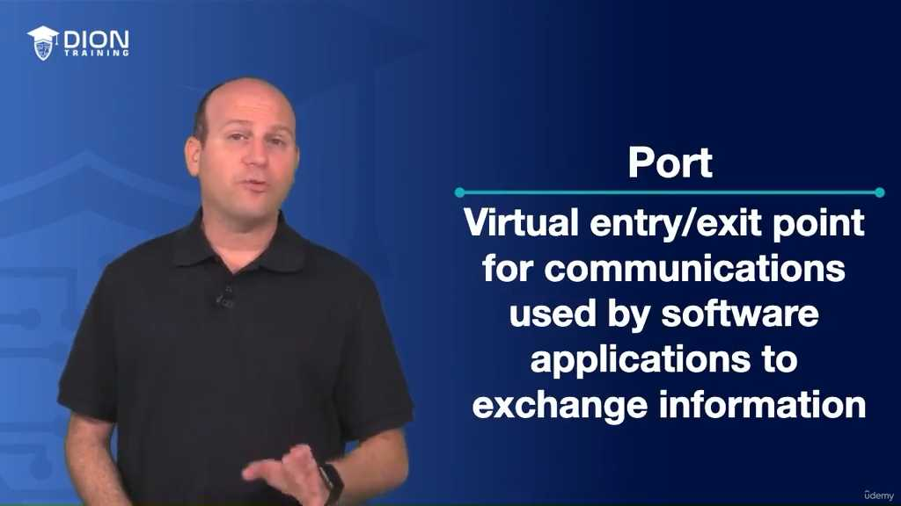
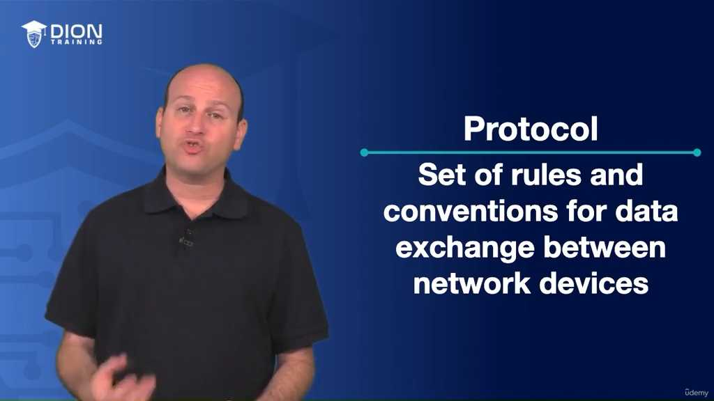
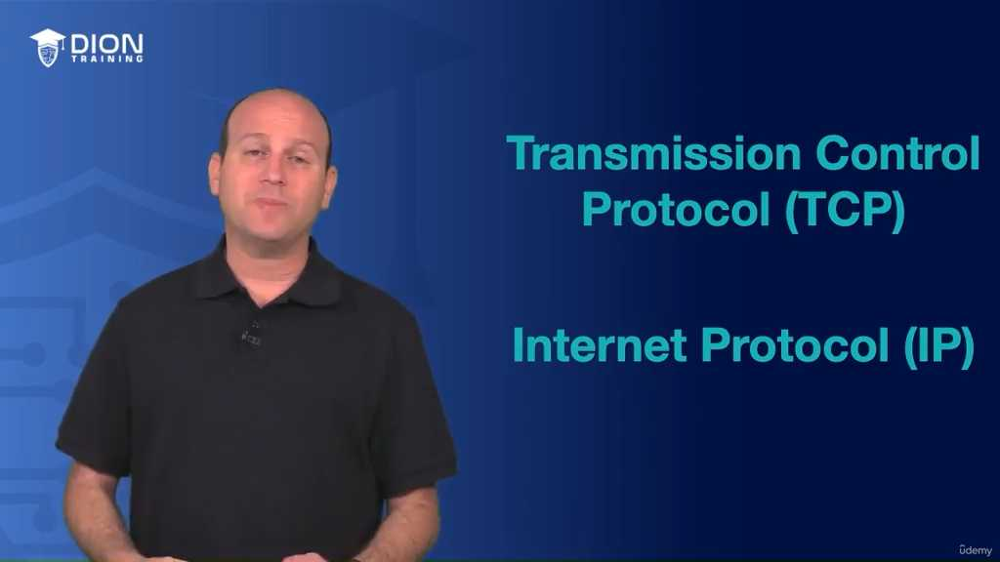
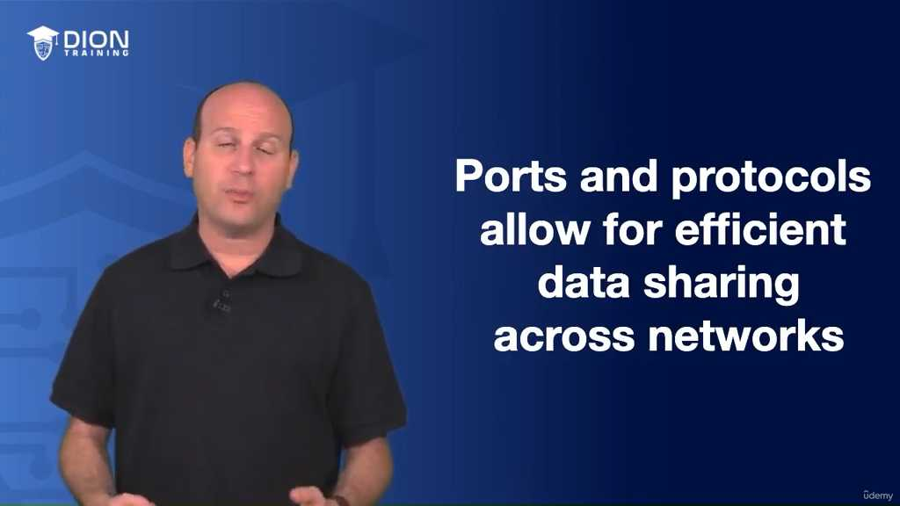
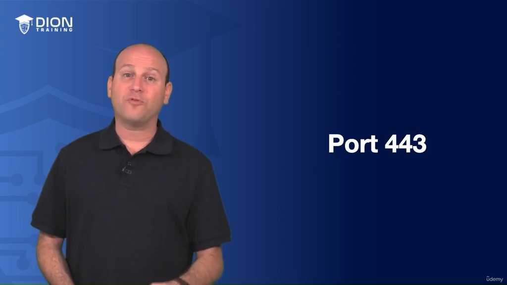
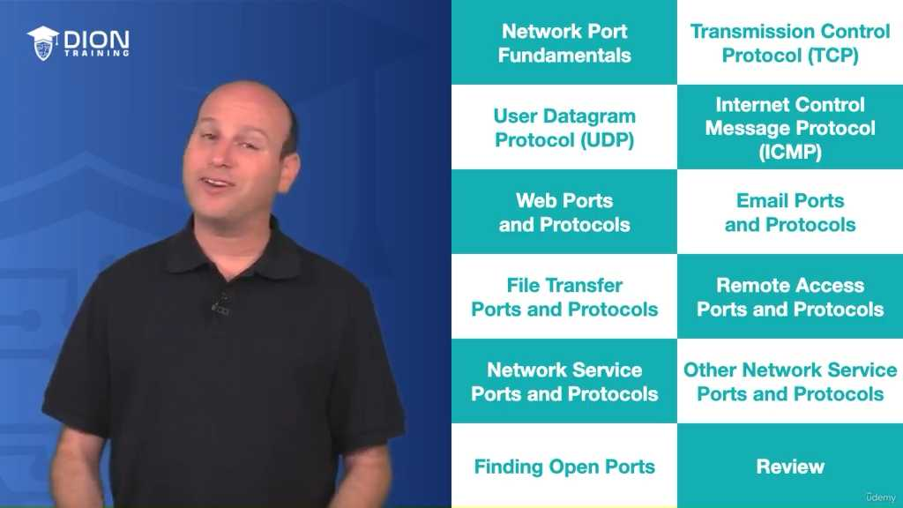

# Ports and Protocols

### Phân tích sâu về Cổng (Ports) và Giao thức (Protocols)

#### 1. Bản chất của Cổng (Port)
Trong mạng máy tính, **Port (Cổng)** không phải là một thiết bị vật lý mà là một "điểm kết nối ảo". Hãy tưởng tượng máy tính của bạn là một tòa nhà lớn với hàng ngàn cánh cửa. Mỗi cánh cửa được đánh số và dẫn đến một bộ phận cụ thể bên trong tòa nhà đó.
*   **Chức năng:** Nó cho phép các phần mềm ứng dụng khác nhau trên cùng một máy tính có thể giao tiếp với mạng mà không bị chồng chéo dữ liệu. Khi dữ liệu đến máy tính, số hiệu cổng sẽ chỉ dẫn dữ liệu đó phải đi đến đâu (ví dụ: trình duyệt web, phần mềm email, hay ứng dụng tải file).

*   **Well-known Ports:** Đây là các cổng tiêu chuẩn quốc tế được quy định sẵn (từ 0 đến 1023). Ví dụ, Port 443 là dành riêng cho lưu lượng web mã hóa (HTTPS). Việc sử dụng chuẩn này giúp các thiết bị trên toàn cầu hiểu được "ngôn ngữ" của nhau mà không cần cài đặt phức tạp.

> **💡 Ví dụ nhớ đời:** Hãy coi máy tính của bạn là một khách sạn. IP Address là địa chỉ của khách sạn đó, còn Port giống như số phòng. Nếu bạn là một nhân viên giao hàng (gói tin dữ liệu), bạn chỉ có thể đưa hàng vào đúng phòng (ứng dụng) nếu bạn biết số phòng đó. Nếu bạn mang đồ ăn (gói tin HTTP) đến phòng làm việc, nhưng nhân viên ở đó lại không nhận đồ ăn (không mở port 80/443), bạn sẽ bị từ chối ngay lập tức.

#### 2. Định nghĩa và Vai trò của Giao thức (Protocol)
Nếu Port là "điểm đến", thì **Protocol (Giao thức)** chính là "ngôn ngữ và quy tắc ứng xử" trong cuộc giao tiếp đó. Một giao thức định nghĩa cách dữ liệu được gói gọn, truyền đi và xử lý.

*   **TCP (Transmission Control Protocol):** Được ví như một dịch vụ chuyển phát nhanh có đảm bảo. Nó thiết lập một kết nối tin cậy, kiểm tra xem dữ liệu có đến đủ không, có bị lỗi không. Nếu thiếu gói tin, nó sẽ yêu cầu gửi lại.
*   **IP (Internet Protocol):** Giống như hệ thống bản đồ và địa chỉ. Nó cung cấp cho mỗi thiết bị một địa chỉ (IP Address) để định vị. Nếu không có IP, gói tin sẽ giống như một lá thư không có địa chỉ người nhận – nó sẽ lạc lối giữa không gian mạng rộng lớn.

> **💡 Ví dụ nhớ đời:** Hãy tưởng tượng bạn đang chơi điện thoại với bạn mình. Giao thức là luật chơi: "Người nói phải đợi người nghe xong mới được nói", "Nếu không nghe rõ thì phải yêu cầu nhắc lại". Nếu hai người nói hai ngôn ngữ khác nhau hoặc không tuân theo luật chơi (ngắt lời nhau liên tục), cuộc hội thoại sẽ hoàn toàn đổ vỡ. TCP chính là việc bạn luôn hỏi lại "Cậu đã hiểu ý tớ chưa?" để chắc chắn thông tin được truyền đạt chính xác.

#### 3. Phân loại các dải Cổng (Port Ranges)
Hệ thống mạng chia các cổng thành ba nhóm chính để quản lý tài nguyên hiệu quả:

1.  **Well-known Ports (0 - 1023):** Các cổng "huyền thoại" dành cho các dịch vụ cốt lõi mà bất kỳ ai cũng cần dùng (Web, Email, FTP...).
2.  **Registered Ports (1024 - 49,151):** Các cổng dành cho các phần mềm phổ biến của các nhà phát triển phần mềm (như cơ sở dữ liệu, các phần mềm quản trị hệ thống). Chúng được đăng ký để tránh xung đột.
3.  **Dynamic/Private Ports (49,152 - 65,535):** Đây là các cổng "tự do". Khi máy tính của bạn khởi tạo một kết nối tạm thời ra bên ngoài, hệ điều hành sẽ chọn ngẫu nhiên một cổng trong dải này để làm cổng nguồn. Sau khi kết nối xong, cổng này sẽ được giải phóng.

#### 4. Các Giao thức quan trọng trong mạng
*   **UDP (User Datagram Protocol):** Một giao thức "tốc độ cao". Khác với TCP, nó không kiểm tra độ tin cậy. Nó gửi đi và không quan tâm người nhận có nhận được không. Thường dùng trong streaming video hoặc game online, nơi tốc độ quan trọng hơn việc mất một vài khung hình nhỏ.
*   **ICMP (Internet Control Message Protocol):** Đây là công cụ "chẩn đoán". Nó dùng để gửi thông báo lỗi hoặc kiểm tra xem một máy chủ có đang "sống" hay không (lệnh Ping chính là sử dụng giao thức này).
*   **HTTP (Port 80) & HTTPS (Port 443):** Nền tảng của World Wide Web. HTTP là phiên bản thô, không bảo mật; còn HTTPS là phiên bản hiện đại, sử dụng mã hóa để bảo vệ dữ liệu người dùng khỏi sự đánh cắp trên đường truyền.

*   **Email Protocols:**
    *   **SMTP (Simple Mail Transfer Protocol - Port 25):** Đây là "người đưa thư" chuyên dụng để gửi email đi từ máy bạn đến máy chủ thư điện tử.
    *   **POP3 & IMAP:** Đây là các giao thức dùng để nhận thư. Sự khác biệt nằm ở chỗ POP3 thường tải hết về máy cục bộ, còn IMAP đồng bộ trực tiếp trên máy chủ, giúp bạn xem email trên nhiều thiết bị cùng lúc. SMTPS (bản mã hóa của SMTP) là lớp bảo mật bắt buộc để ngăn chặn việc đọc trộm email trong quá trình vận chuyển.

### 1. Giao thức Truyền tải Tệp tin (File Transfer Protocols)

**FTP (File Transfer Protocol - Cổng 20 & 21):**
Đây là giao thức cơ bản nhất để truyền tệp giữa client và server. FTP sử dụng hai kênh riêng biệt: Cổng 20 dành cho dữ liệu (Data) và Cổng 21 dành cho các lệnh điều khiển (Control). Cách tiếp cận này giúp việc truyền tải trở nên có tổ chức, nhưng điểm yếu chết người là dữ liệu được truyền đi dưới dạng văn bản thuần (plain text), dễ bị kẻ xấu "đánh hơi" (sniffing).

> **💡 Ví dụ nhớ đời:** Hãy tưởng tượng FTP giống như việc bạn gửi một bức thư quan trọng mà không bỏ vào phong bì kín. Người đưa thư hay bất kỳ ai đi ngang qua cũng có thể mở ra đọc nội dung bên trong mà không cần chìa khóa.

**SFTP (Secure File Transfer Protocol - Cổng 22):**
Khác với FTP, SFTP chạy trên nền giao thức SSH, tạo ra một đường hầm bảo mật. Mọi dữ liệu trước khi truyền đi đều được mã hóa. Nếu FTP là gửi thư không phong bì, thì SFTP là gửi thư trong một két sắt thép được khóa chặt, chỉ người nhận có chìa khóa mới mở được.

**TFTP (Trivial File Transfer Protocol - Cổng 69):**
Đúng như cái tên "Trivial" (tầm thường/đơn giản), giao thức này cực kỳ nhẹ, không yêu cầu xác thực người dùng và không có các tính năng bảo mật. Nó thường được dùng trong các môi trường nội bộ hạn chế, như nạp cấu hình cho thiết bị mạng (Router/Switch) khi khởi động.

### 2. Giao thức Truy cập Từ xa (Remote Access Protocols)

**SSH (Secure Shell - Cổng 22):**
Đây là chuẩn vàng để quản trị từ xa. Nó thay thế hoàn toàn các giao thức cũ không bảo mật. SSH cung cấp kênh giao tiếp an toàn, mã hóa toàn bộ phiên làm việc giữa máy trạm và server.

**Telnet (Cổng 23):**
Là ông tổ của truy cập từ xa. Telnet cho phép bạn kết nối và điều khiển máy tính khác từ xa, nhưng nó truyền tải thông tin (kể cả mật khẩu) dưới dạng văn bản thô. Trong môi trường hiện đại, Telnet gần như đã bị "khai tử" vì nguy cơ bảo mật cực cao.

**RDP (Remote Desktop Protocol - Cổng 3389):**
Do Microsoft phát triển, RDP không chỉ gửi các lệnh văn bản mà còn truyền tải giao diện đồ họa. Nó cho phép bạn nhìn thấy và thao tác trên màn hình máy tính từ xa y như đang ngồi trước máy.

### 3. Dịch vụ Mạng (Networking Service Ports)

**DNS (Domain Name System - Cổng 53):**
DNS giống như danh bạ điện thoại của Internet. Thay vì nhớ địa chỉ IP 142.250.190.46, bạn chỉ cần gõ "google.com". Cổng 53 là nơi tiếp nhận yêu cầu "dịch" tên miền sang địa chỉ IP để trình duyệt biết phải kết nối đến đâu.

**DHCP (Dynamic Host Control Protocol - Cổng 67 & 68):**
Đây là "người quản gia" tự động cấp phát địa chỉ IP cho thiết bị khi bạn vừa kết nối vào mạng. Cổng 67 dùng cho Server nhận yêu cầu, Cổng 68 dùng cho Client nhận phản hồi. Nhờ nó, bạn không cần phải cài đặt IP tĩnh thủ công cho hàng trăm thiết bị.

**SQL (Structured Query Language - Cổng 1433):**
Cổng 1433 là cửa ngõ chuyên biệt để các ứng dụng gửi truy vấn tới cơ sở dữ liệu Microsoft SQL Server. Mọi thao tác lấy dữ liệu, xóa, cập nhật đều đi qua "cánh cửa" này.

**SNMP (Simple Network Management Protocol - Cổng 161 & 162):**
Công cụ để các quản trị viên mạng theo dõi sức khỏe của thiết bị (Router, Server, Máy in). Cổng 161 để truy vấn trạng thái, 162 để nhận thông báo cảnh báo (Traps).

**Syslog (Cổng 514):**
Là hệ thống ghi nhật ký (log) tập trung. Mọi lỗi hoặc sự kiện xảy ra trên thiết bị mạng đều được đẩy về một máy chủ trung tâm qua cổng 514 để lưu trữ và phân tích.

### 4. Các dịch vụ mạng khác (Other Network Services)

**NTP (Network Time Protocol - Cổng 123):**
Giúp đồng bộ thời gian trên tất cả các thiết bị trong hệ thống. Trong bảo mật, đồng bộ thời gian cực kỳ quan trọng vì nếu đồng hồ sai lệch, các chứng chỉ bảo mật sẽ bị vô hiệu hóa hoặc việc đối chiếu log sẽ trở nên vô nghĩa.

**SIP (Session Initiation Protocol - Cổng 5060 & 5061):**
Nền tảng của công nghệ VoIP (thoại qua Internet). SIP chịu trách nhiệm thiết lập, duy trì và chấm dứt các cuộc gọi video hoặc âm thanh. Cổng 5060 là bản thường, 5061 là phiên bản được mã hóa (TLS).

**LDAP (Lightweight Directory Access Protocol - Cổng 389 & 636):**
LDAP là giao thức dùng để truy vấn cơ sở dữ liệu người dùng (ví dụ: Active Directory trong doanh nghiệp). Khi bạn đăng nhập vào máy tính công ty, hệ thống sẽ dùng LDAP để kiểm tra xem mật khẩu của bạn có đúng hay không. Cổng 389 là giao thức thường, còn 636 là LDAPS (LDAP over SSL) – phiên bản bảo mật hơn.

> **💡 Ví dụ nhớ đời:** Hãy coi LDAP giống như một "Lễ tân" của tòa nhà. Khi bạn (User) muốn vào, lễ tân sẽ tra cứu trong sổ danh bạ xem bạn có tên trong danh sách khách mời không. Cổng 636 giống như việc lễ tân đeo mặt nạ chống nhìn trộm để không ai khác biết bạn là ai hoặc bạn đang tìm kiếm thông tin gì.

### 5. Công cụ và Đánh giá
Sau khi đã hiểu các "cửa ngõ" này, công cụ **Nmap** (Network Mapper) đóng vai trò như một chiếc đèn pin soi đường. Nó sẽ quét các địa chỉ IP để tìm xem cổng nào đang mở (Open), cổng nào đang đóng (Closed). Việc nắm vững các thông số này không chỉ giúp bạn cấu hình hệ thống tối ưu mà còn là kỹ năng then chốt để phát hiện các lỗ hổng mà tin tặc có thể khai thác.

---

## 🎯 Bí Kíp Ôn Thi Tốc Độ: Ports & Protocols

### 1. Khái niệm cốt lõi
*   **Port (Cổng):** Điểm vào/ra ảo cho dữ liệu ứng dụng.
*   **Protocol (Giao thức):** Bộ quy tắc truyền tải dữ liệu chuẩn hóa.

### 2. Phân loại dải Port
*   **Well-known:** 0 – 1023
*   **Registered:** 1024 – 49,151
*   **Dynamic/Private:** 49,152 – 65,535

### 3. Tổng hợp Port & Protocol trọng tâm
#### Nhóm Web & Email
*   **HTTP:** 80
*   **HTTPS:** 443 (Bảo mật)
*   **SMTP:** 25 (Gửi mail) | **SMTPS:** 587 (Gửi bảo mật)
*   **POP3:** 110 (Nhận mail)
*   **IMAP:** 143 (Nhận mail)

#### Nhóm Truyền file & Truy cập từ xa
*   **FTP:** 20, 21
*   **SFTP:** 22 (Bảo mật)
*   **TFTP:** 69 (Trivial - Không bảo mật)
*   **SSH:** 22 (Remote shell)
*   **Telnet:** 23 (Remote, không bảo mật)
*   **RDP:** 3389 (Remote Desktop)

#### Nhóm Dịch vụ mạng & Hệ thống
*   **DNS:** 53 (Phân giải tên miền)
*   **DHCP:** 67, 68 (Cấp IP tự động)
*   **SQL:** 1433 (Truy vấn CSDL)
*   **SNMP:** 161, 162 (Quản lý mạng)
*   **Syslog:** 514 (Ghi nhật ký)
*   **NTP:** 123 (Đồng bộ thời gian)
*   **LDAP:** 389 | **LDAPS:** 636 (Tra cứu thư mục)
*   **SIP:** 5060, 5061 (VoIP/Session)

### 4. Công cụ cần nhớ
*   **Nmap:** Công cụ quét mạng để tìm các **Open Ports** và **Protocols**.

### 5. Giao thức nền tảng
*   **TCP:** Đảm bảo kết nối tin cậy (Reliable).
*   **IP:** Cung cấp địa chỉ (Addressing) để định tuyến dữ liệu.

---
*Ghi chú: 7 hình ảnh minh họa (.jpg) đã được tải về và lưu tự động vào thư mục con `image/` cùng cấp với file này. Để ảnh hiển thị tự động, hãy đảm bảo bạn sao chép cả thư mục `image/` nếu bạn muốn di chuyển file markdown sang nơi khác!*
