# Network Port Fundamentals

### Phân tích chuyên sâu về Nền tảng Network Ports (Phần 1/3)

#### 1. Bản chất của Network Ports: Sự kết nối giữa Hạ tầng và Dịch vụ
Trong mạng máy tính, việc truyền tải dữ liệu là một quá trình phân cấp. IP Address (Địa chỉ IP) đóng vai trò là "địa chỉ bưu điện" để đưa gói tin đến đúng thiết bị (hệ thống) trong mạng lưới toàn cầu. Tuy nhiên, một thiết bị hiện đại không chỉ chạy một chương trình duy nhất. Nó chạy trình duyệt, ứng dụng email, phần mềm diệt virus, dịch vụ cập nhật hệ thống, v.v. Làm sao để gói tin biết nó cần được gửi đến "cánh cửa" của ứng dụng nào? Đây là lúc khái niệm **Port (Cổng kết nối)** xuất hiện. Port là một "cánh cửa logic" (không phải phần cứng vật lý) trên máy tính, nơi các dịch vụ lắng nghe (listen) và chờ đợi lưu lượng dữ liệu đến.

> **💡 Ví dụ nhớ đời:** Hãy tưởng tượng địa chỉ IP là địa chỉ của một tòa nhà văn phòng cao tầng. Nếu bạn chỉ gửi thư đến địa chỉ tòa nhà, người đưa thư chỉ có thể để lại thư ở quầy lễ tân. Để thư đến được đúng tay một nhân viên kế toán (ứng dụng), bạn cần ghi thêm số phòng của người đó. Số phòng đó chính là Port. Nếu không có số phòng, dữ liệu sẽ bị "lạc" trong hệ thống vì máy tính không biết nên chuyển gói tin đó cho ứng dụng nào đang hoạt động.

#### 2. Cấu trúc đánh số và Giới hạn logic
Hệ thống mạng hiện đại quy định dải số Port từ **0 đến 65,535**. Tại sao lại là con số này? Nó xuất phát từ việc sử dụng 16 bit trong trường port của giao thức TCP và UDP ($2^{16} = 65,536$ giá trị, từ 0 đến 65,535). Điều này cho phép một máy tính duy nhất, chỉ với một địa chỉ IP, có thể đồng thời duy trì hơn 65.000 kết nối độc lập với thế giới bên ngoài. Đây là nền tảng của sự đa nhiệm trong mạng máy tính; bạn có thể vừa tải file, vừa duyệt web, vừa chơi game mà không bị xung đột dữ liệu.

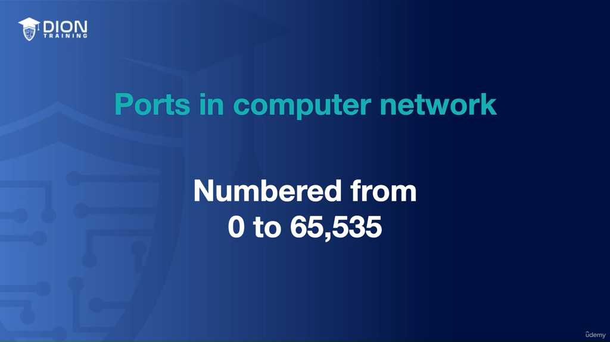

#### 3. Phân loại Ports: Quy tắc ngầm của Internet
Để tránh sự hỗn loạn (ví dụ: hai ứng dụng cùng tranh giành một cổng), các cổng được chia thành ba nhóm chính dựa trên mục đích và sự quản lý:

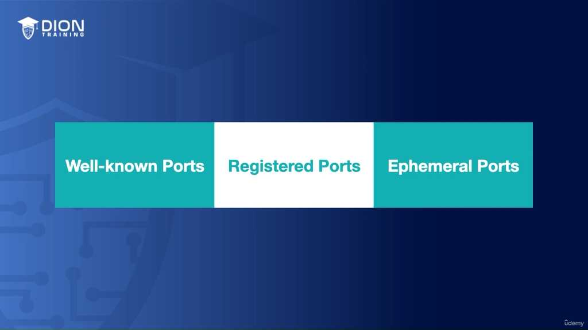

**A. Well-Known Ports (Cổng phổ biến - Từ 0 đến 1,023):**

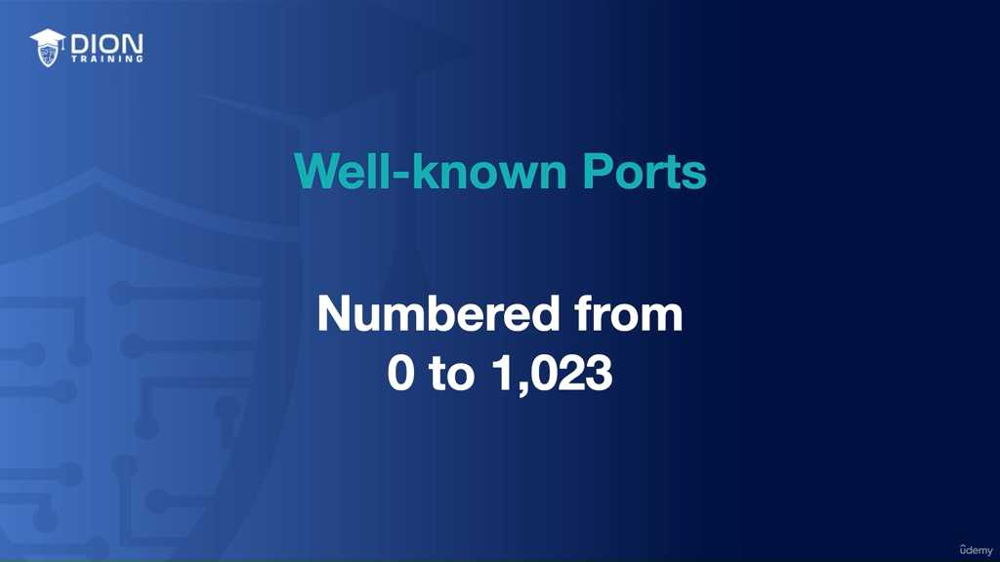

Đây là những "bến cảng" quan trọng nhất, được quy định sẵn cho các dịch vụ cốt lõi của Internet. Vì các dịch vụ này mang tính toàn cầu và bắt buộc phải nhất quán, số hiệu của chúng không được thay đổi tùy tiện.
*   **Port 20 & 21 (FTP - File Transfer Protocol):** Dùng để truyền tải file.
*   **Port 25 (SMTP - Simple Mail Transfer Protocol):** Dùng để gửi email.
*   **Port 80 (HTTP):** Dùng cho truyền tải web không mã hóa.
*   **Port 443 (HTTPS):** Dùng cho truyền tải web an toàn (đã mã hóa).
Sự thống nhất này giúp trình duyệt của bạn luôn biết rằng khi bạn gõ một trang web, nó phải tìm đến cổng 443 để thiết lập kết nối bảo mật.

**B. Registered Ports (Cổng đăng ký - Từ 1,024 đến 49,151):**

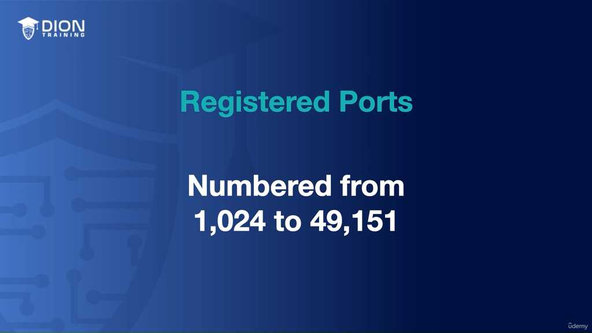

Đây là dải cổng dành cho các nhà phát triển phần mềm, công ty công nghệ hoặc các nhà cung cấp dịch vụ muốn sử dụng cho các ứng dụng riêng biệt của họ. Khác với Well-Known Ports đã được "ấn định" bởi lịch sử, các cổng trong dải này cần được đăng ký.

#### 4. Vai trò của IANA (Internet Assigned Numbers Authority)
Tất cả các dải cổng từ 0 đến 49,151 đều được giám sát và quản lý bởi một tổ chức có tên là **IANA** (đọc là "iyana"). IANA đóng vai trò như một "cơ quan đăng ký tên miền và số hiệu" toàn cầu. 

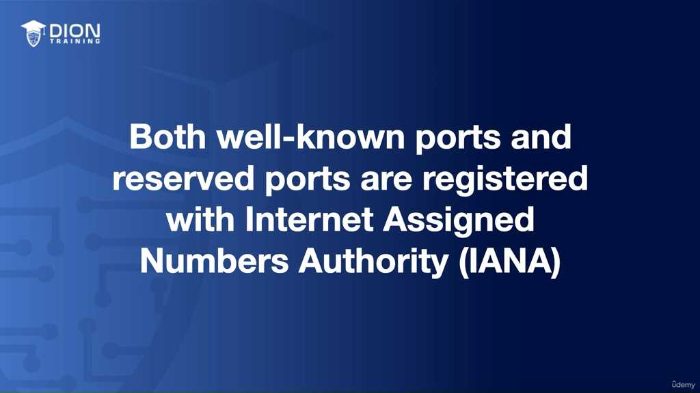

Tại sao phải đăng ký? Nếu bạn tạo ra một trò chơi trực tuyến mới và muốn sử dụng cổng 33,333 để máy chủ trò chơi giao tiếp với người chơi, bạn nên đăng ký với IANA. Việc này giúp tránh xung đột: giả sử một phần mềm độc hại hoặc một ứng dụng khác cũng dùng cổng 33,333, hệ thống sẽ bị tê liệt hoặc dữ liệu sẽ bị ghi đè. Việc đăng ký giúp xác nhận rằng: "Trong hệ sinh thái toàn cầu, số 33,333 là danh tính riêng của ứng dụng X". Điều này đảm bảo tính ổn định và bảo mật cho toàn bộ mạng lưới Internet.

### Phân tích chuyên sâu về Ephemeral Ports (Cổng tạm thời)

#### 1. Định nghĩa về Ephemeral Ports

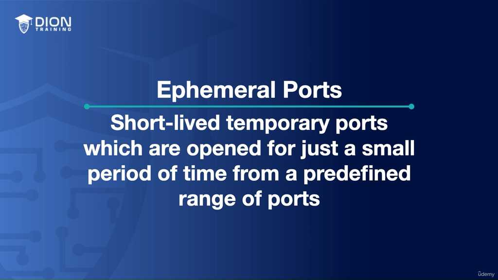

Ephemeral ports (cổng tạm thời) là những cổng kết nối có "tuổi thọ" ngắn, được hệ điều hành tự động cấp phát để phục vụ các phiên giao tiếp ngắn hạn. Khác với Well-known ports (0-1023) hay Registered ports (1024-49151) thường được gán cố định cho các dịch vụ cụ thể (như 80 cho HTTP, 443 cho HTTPS), các cổng ephemeral không cần đăng ký hay cấp phép. Chúng là nguồn tài nguyên "tự do", bất kỳ ứng dụng nào cũng có thể chiếm quyền sử dụng khi cần thiết và giải phóng chúng ngay khi tác vụ hoàn thành.

Dải giá trị của ephemeral ports được quy định chuẩn hóa từ **49,152 đến 65,535**. Hệ thống sẽ chọn ngẫu nhiên một số trong dải này mỗi khi một tiến trình cần giao tiếp với bên ngoài.

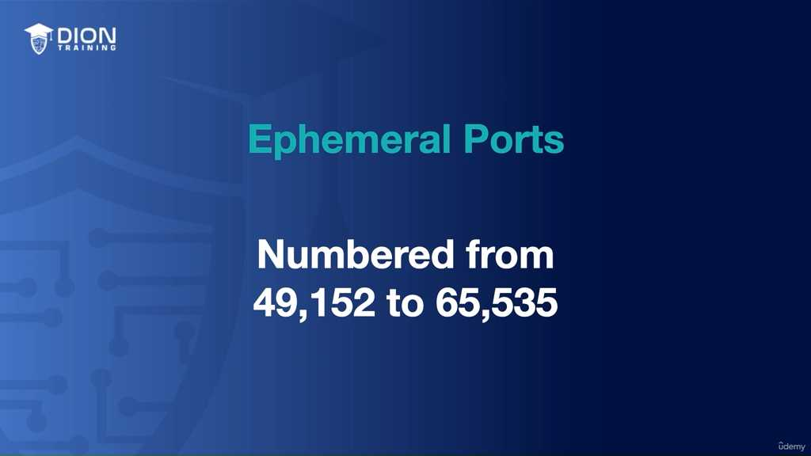

> **💡 Ví dụ nhớ đời:** Hãy tưởng tượng Ephemeral Ports giống như việc bạn đi thuê một chiếc ghế trong một hội trường lớn. Các vị trí cố định (Well-known ports) giống như hàng ghế đầu dành riêng cho diễn giả. Nhưng hàng trăm chiếc ghế phía sau (Ephemeral ports) là ghế tự do; khi bạn đến, bạn cứ tự nhiên ngồi vào bất kỳ chiếc ghế trống nào. Khi hội thảo kết thúc, bạn đứng dậy đi về, chiếc ghế đó lại trở thành "ghế trống" chờ người khác đến sử dụng. Bạn không cần đăng ký tên mình lên ghế, chỉ cần ngồi vào là dùng được.

#### 2. Cơ chế hoạt động: Từ thiết bị ghi âm đến trình duyệt web
Đoạn transcript đưa ra ví dụ về việc tải tệp tin từ thiết bị ghi âm. Ở đây, thiết bị đóng vai trò là một máy chủ tệp (file server). Khi cần trao đổi dữ liệu, nó "bắt" lấy một cổng bất kỳ (ví dụ: cổng 60,000). 

Quá trình diễn ra như sau:
*   **Mở cổng:** Khi bạn truy cập vào thiết bị từ trình duyệt, hệ thống cấp phát cổng 60,000 cho phiên làm việc đó.
*   **Truyền dữ liệu:** Trình duyệt của bạn sẽ gửi yêu cầu tới địa chỉ IP của thiết bị, kèm theo số cổng 60,000 đã được chỉ định.
*   **Đóng cổng:** Sau khi tệp tin được tải xuống hoàn tất, tiến trình kết nối kết thúc, cổng 60,000 được giải phóng. Nó sẽ không còn mở để chờ kết nối mới, giúp bảo mật thiết bị tốt hơn (giảm bề mặt tấn công).

#### 3. Bản chất của truyền thông mạng: IP và Port
Mọi hành động truyền tin trên mạng đều cần hai thành phần không thể tách rời:
*   **Địa chỉ IP (IP Address):** Giống như địa chỉ nhà, cho biết dữ liệu cần đi đến "ngôi nhà" nào (hệ thống/máy tính nào).
*   **Số cổng (Port Number):** Giống như số phòng hoặc tên người nhận trong ngôi nhà đó, cho biết dữ liệu cần được đưa tới "ứng dụng" nào (web server, email server, hay database).

Nếu thiếu một trong hai, dữ liệu sẽ bị thất lạc hoặc không biết phải gửi tới dịch vụ nào trên máy chủ đích.

#### 4. Phân tích mô hình thực tế: Client và Web Server
Transcript mô tả quá trình truy cập website từ Client (192.168.1.24) đến Web Server (64.82.46.21):

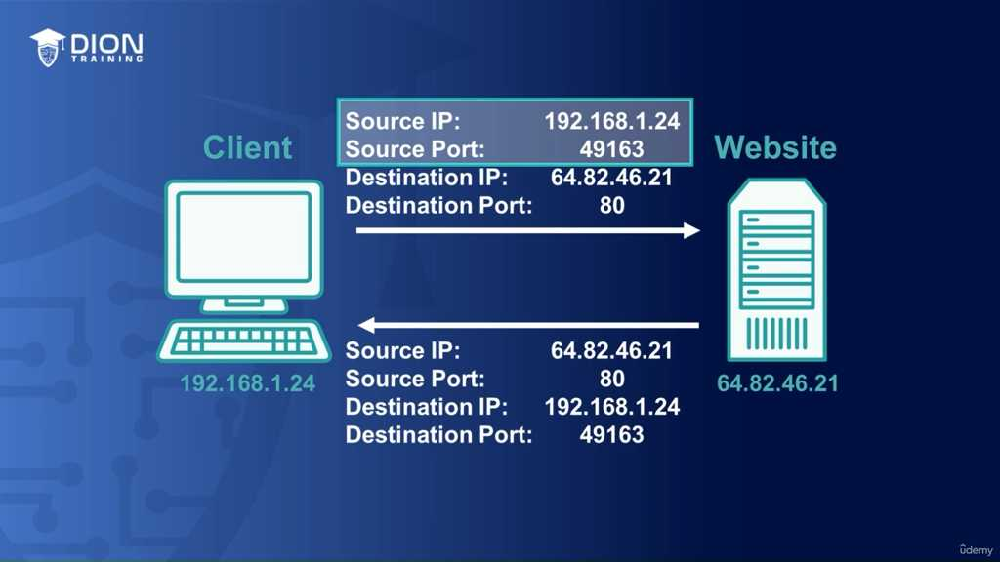

*   **Tại phía Client (Nguồn):** Hệ thống của bạn cần gửi yêu cầu. Nó cần một "cửa ra". Nó chọn ngẫu nhiên một cổng trong dải Ephemeral, ví dụ là **49,163**. Số cổng này không quan trọng với server, nó chỉ đóng vai trò "địa chỉ phản hồi" để server biết cần gửi dữ liệu trả về cho ai.
*   **Tại phía Server (Đích):** Server cần biết bạn muốn gì. Nếu bạn truy cập một website thông thường, trình duyệt sẽ tự động mặc định gửi yêu cầu tới **Port 80**. 

**Tại sao lại là Port 80?**
Đây là giao thức chuẩn cho HTTP (web không mã hóa). Khi gói tin tới đích, máy chủ web nhìn vào số cổng đích là 80, nó lập tức hiểu: "À, người này đang muốn truy cập website, hãy chuyển gói tin này cho phần mềm Web Server (như Apache hay Nginx) đang lắng nghe ở cổng 80".

> **💡 Ví dụ nhớ đời:** Hãy hình dung việc gửi thư tới một tòa nhà cao tầng.
> - **Địa chỉ IP:** Là địa chỉ của tòa nhà đó.
> - **Port 80:** Là văn phòng "Tiếp tân" (nơi ai đến cũng có thể giao tiếp).
> - **Ephemeral Port (49,163):** Là số phòng của bạn ở căn hộ nơi bạn xuất phát. Khi bạn gửi thư đi, bạn ghi địa chỉ hồi đáp là "Phòng 49,163". Khi tòa nhà nhận được thư, nhân viên tiếp tân sẽ gửi phản hồi về đúng "Phòng 49,163" cho bạn. Dù hôm sau bạn có thể đổi sang "Phòng 50,000", miễn là lúc đó bạn thông báo đúng, thư sẽ luôn tới đúng tay bạn.

### Phân tích chi tiết quy trình truyền tải dữ liệu và khái niệm Port trong mạng máy tính

**Quy trình phản hồi của Web Server (Reverse Process)**
Khi một Web Server nhận được yêu cầu (request) từ client, nó thực hiện quá trình ngược lại so với lúc khởi tạo. Dữ liệu được gửi đi từ IP nguồn của server (ví dụ: 64.x.x.x) thông qua cổng dịch vụ cố định là Port 80. Điểm đích của gói tin này chính là địa chỉ IP của máy khách (client) – nơi có cấu trúc 192.x.x.x – và quan trọng nhất, nó phải nhắm đúng vào con số cổng tạm thời (ephemeral port) mà client đã tạo ra lúc đầu (ở đây là 49,163). Đây là cách hệ thống mạng đảm bảo rằng dữ liệu trả về đúng "cửa" của ứng dụng đã gửi yêu cầu.

> **💡 Ví dụ nhớ đời:** Hãy tưởng tượng bạn là khách hàng tại một ngân hàng (Web Server) đang mở nhiều quầy giao dịch (các Port). Bạn là người đứng xếp hàng (Client). Khi bạn bước tới quầy số 80 (cổng dịch vụ), bạn không đưa thẻ cho toàn bộ tòa nhà, mà bạn đưa cho nhân viên tại quầy đó. Khi nhân viên xử lý xong, họ không quăng giấy tờ ra ngoài cửa chính, mà họ đưa chính xác vào tay bạn – người đang đứng chờ ở quầy giao dịch của bạn.

**Cơ chế thiết lập và kết thúc phiên làm việc (Session Management)**
Sau khi trao đổi dữ liệu, một phiên làm việc hai chiều được thiết lập giữa Port 80 của Server và Port 49,163 của Client. Điểm mấu chốt ở đây là tính chất tạm thời: ngay khi quá trình truyền tải hoàn tất, phiên làm việc sẽ được "xé bỏ" (torn down) và cổng ephemeral (49,163) sẽ bị đóng lại. Việc này nhằm giải phóng tài nguyên hệ thống, cho phép máy tính tái sử dụng các cổng này cho những kết nối mới trong tương lai.

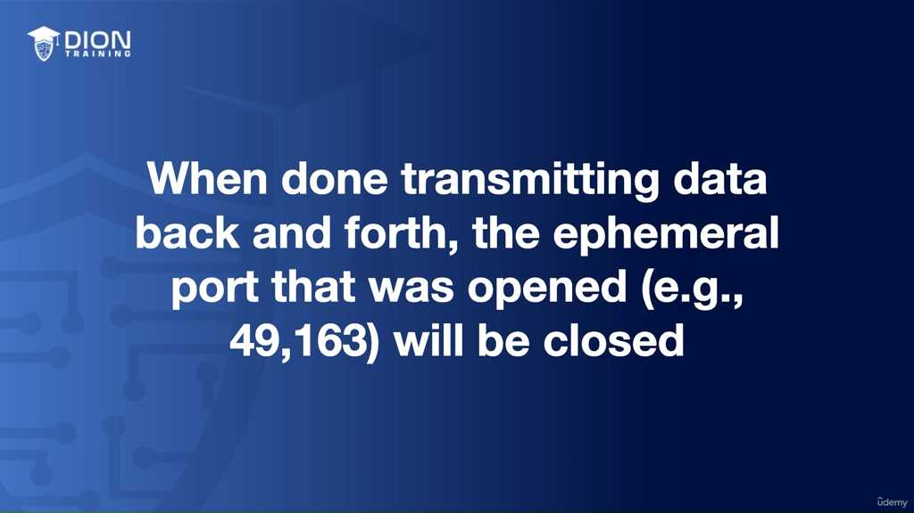

**Tính chất của Ephemeral Port trong các lần kết nối tiếp theo**
Mỗi khi client muốn gửi yêu cầu mới tới Web Server, quy tắc duy nhất không đổi là Server luôn lắng nghe ở Port 80 (well-known port). Tuy nhiên, Client sẽ không bao giờ sử dụng lại số cổng 49,163 cũ. Thay vào đó, nó sẽ tự động chọn ngẫu nhiên một con số mới trong dải cổng ephemeral. Điều này tạo ra một lớp bảo mật và quản lý phiên làm việc tách biệt, giúp máy tính phân biệt được đâu là dữ liệu của phiên trước, đâu là dữ liệu của phiên hiện tại.

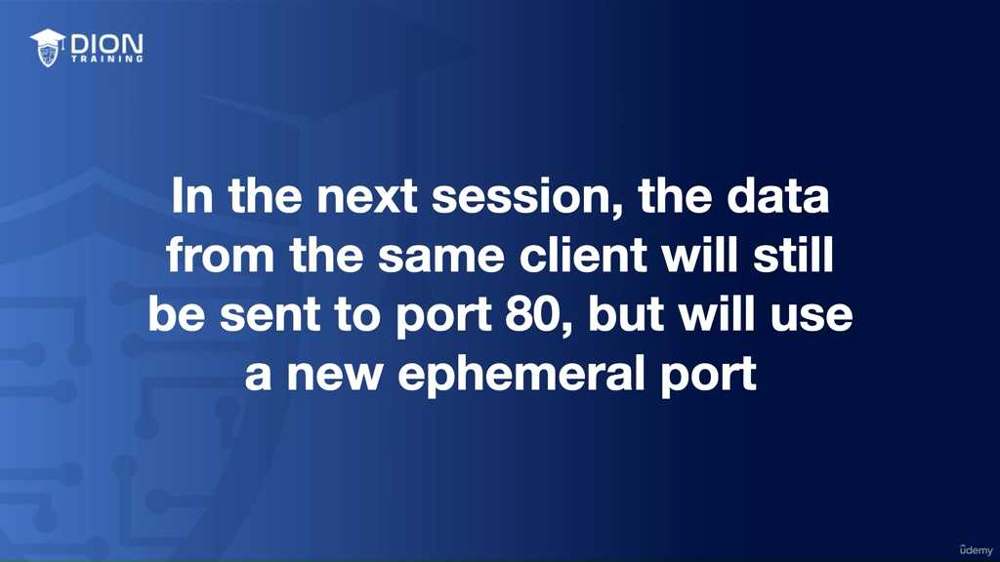

**Định nghĩa logic về Port (Cổng kết nối)**
Về mặt kỹ thuật, "Port" không phải là một thiết bị vật lý, mà là một "lỗ hổng logic" (logical opening) trong hệ điều hành. Nó đóng vai trò là điểm cuối (endpoint) để các phần mềm hoặc dịch vụ "lắng nghe" và chờ đợi tín hiệu. Nếu không có Port, dữ liệu gửi đến máy tính sẽ giống như một lá thư gửi đến một tòa nhà chung cư mà không ghi số phòng – bức thư sẽ nằm ở sảnh chờ và không ai biết nó dành cho ai.

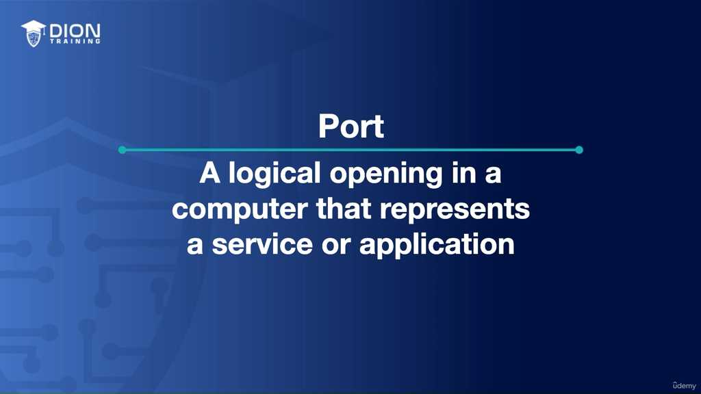

> **💡 Ví dụ nhớ đời:** Hãy hình dung IP Address là địa chỉ của một tòa nhà văn phòng cao tầng. Nếu bạn chỉ gửi thư đến địa chỉ tòa nhà, người bảo vệ sẽ không biết phải chuyển cho ai. Port chính là số phòng của từng bộ phận: Phòng Kế toán (Port 80), Phòng Nhân sự (Port 443), Phòng IT (Port 22). IP giúp bạn đến đúng tòa nhà, còn Port giúp bạn gõ đúng cửa phòng làm việc của dịch vụ mà bạn đang tìm kiếm.

**Tổng kết về sự phân cấp giữa IP và Port**
Sự kết hợp giữa IP và Port tạo nên một hệ thống định danh hoàn hảo:
1. **IP Address:** Xác định thực thể (tòa nhà) – Cho biết thiết bị nào đang tham gia vào cuộc đối thoại.
2. **Port Number:** Xác định mục đích (số phòng) – Cho biết phần mềm nào bên trong thiết bị đó đang thực hiện việc trao đổi dữ liệu.

Khi bạn nắm vững khái niệm này, bạn sẽ hiểu tại sao máy tính có thể chạy đồng thời hàng chục tab trình duyệt, ứng dụng chat và trò chơi online mà không bị nhầm lẫn dữ liệu – mỗi ứng dụng đều đang "đứng" tại những cánh cửa (cổng) khác nhau để đón nhận luồng thông tin riêng biệt.

---

## 🎯 Bí Kíp Ôn Thi Tốc Độ: Network Ports

### 1. Bản chất khái niệm
*   **IP Address:** Địa chỉ tòa nhà (máy tính).
*   **Port:** Số phòng cụ thể (dịch vụ/ứng dụng) bên trong tòa nhà đó.
*   **Cơ chế:** Port là một "lỗ hổng logic" để giao tiếp, xác định chính xác ứng dụng đang chờ nhận dữ liệu.
*   **Tổng số cổng:** 0 – 65,535.

### 2. Phân loại Cổng (3 nhóm cần nhớ)
| Loại cổng | Dải số | Đặc điểm |
| :--- | :--- | :--- |
| **Well-known** | 0 – 1,023 | Dịch vụ cố định (HTTP: 80, HTTPS: 443, FTP: 20/21, SMTP: 25) |
| **Registered** | 1,024 – 49,151 | Dịch vụ đăng ký với IANA cho mục đích cụ thể |
| **Ephemeral** | 49,152 – 65,535 | Cổng tạm thời (Dynamic/Private), dùng xong tự đóng |

### 3. Quy tắc giao tiếp (Client - Server)
*   **Server:** Luôn lắng nghe trên **Well-known port** (ví dụ: Port 80).
*   **Client:** Tự tạo/chọn ngẫu nhiên một **Ephemeral port** để khởi tạo kết nối.
*   **Kết nối:** Server phản hồi từ **Well-known port** (80) về đúng **Ephemeral port** mà Client đã chọn ban đầu.
*   **Kết thúc:** Sau khi truyền xong, phiên làm việc đóng lại, **Ephemeral port** biến mất (giải phóng tài nguyên).

### 4. Mẹo nhớ nhanh
*   **Công thức:** `IP + Port = Truyền thông thành công`.
*   **Tư duy:** IP tìm đến nhà, Port tìm đến ứng dụng cần gặp.
*   **Key takeaway:** Chỉ có **Well-known** và **Registered** là cần đăng ký với **IANA**, còn **Ephemeral** là "hàng xóm tự do" dùng tạm rồi bỏ.

---
*Ghi chú: 12 hình ảnh minh họa (.jpg) đã được tải về và lưu tự động vào thư mục con `image/` cùng cấp với file này. Để ảnh hiển thị tự động, hãy đảm bảo bạn sao chép cả thư mục `image/` nếu bạn muốn di chuyển file markdown sang nơi khác!*
