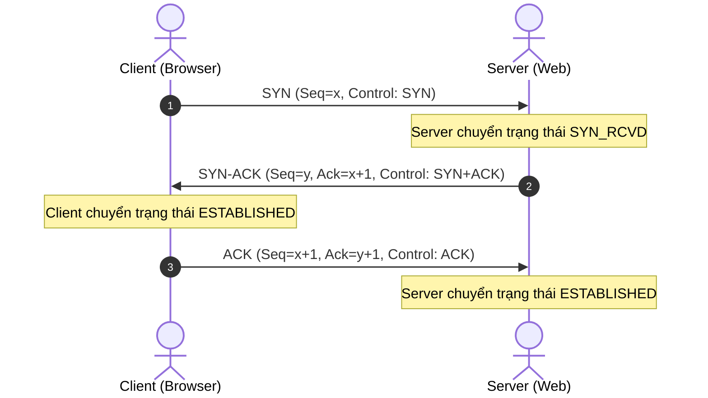

# 🌐 Giao Thức L4 & L3 Cốt Lõi: TCP 3-Way Handshake, UDP & ICMP - Chuyên Sâu Mạng Máy Tính Cho DevOps

> 💡 **Bản chất 1 câu**: Phân tích chuyên sâu cơ chế bắt tay 3 bước (3-Way Handshake) của TCP, giao thức truyền tin cậy vs UDP không hướng kết nối và ICMP.  
> 🎯 **Trọng tâm thực chiến DevOps**: Nắm vững SYN, SYN-ACK, ACK, FIN, RST flags của TCP, cơ chế Windowing, UDP datagram và ứng dụng ICMP (Ping/Traceroute).

---

## 1. 🧠 Hình Hình Dung Nhanh (Intuitive Mindset)

TCP như cuộc gọi điện thoại xác nhận: Alo bạn nghe rõ không? (SYN) -> Nghe rõ, bạn nghe tôi không? (SYN-ACK) -> Nghe rõ, bắt đầu nói chuyện (ACK). UDP như ném thư qua cửa sổ: Ném liên tục không cần biết người trong nhà có nhặt được không.

---

## 2. 📚 Lý Thuyết Chuyên Sâu & Bản Chất Mạng (Under The Hood Architecture)

### 2.1 Chi Tiết Bắt Tay 3 Bước (TCP 3-Way Handshake)



1. **Các Cờ Điều Khiển TCP (TCP Control Flags)**:
   - **SYN (Synchronize)**: Yêu cầu khởi tạo kết nối.
   - **ACK (Acknowledge)**: Xác nhận đã nhận dữ liệu thành công.
   - **FIN (Finish)**: Yêu cầu đóng kết nối êm đẹp (4-way teardown).
   - **RST (Reset)**: Ép ngắt kết nối lập tức do lỗi hoặc Port đóng.
   - **PSH (Push)**: Ép ứng dụng đẩy dữ liệu từ bộ đệm ra ngay.
2. **So Sánh TCP vs UDP**:

| Tiêu chí | TCP (Transmission Control Protocol) | UDP (User Datagram Protocol) |
| :--- | :--- | :--- |
| **Bản chất** | Connection-oriented (Có kết nối) | Connectionless (Không kết nối) |
| **Độ tin cậy** | Đảm bảo 100% không mất gói (Retransmission) | Không đảm bảo (Có thể mất gói) |
| **Tốc độ & Overhead** | Chậm hơn, Header lớn (20-60 bytes) | Cực nhanh, Header siêu nhẹ (8 bytes) |
| **Ứng dụng** | Web (HTTP/HTTPS), SSH, Database, Email | Live Video Streaming, DNS Query, VOIP, Gaming |

3. **Giao Thức Điều Khiển ICMP (Internet Control Message Protocol - Layer 3)**:
   - Dùng để truyền thông báo lỗi và chẩn đoán mạng (không dùng Port!).
   - `Type 8 / Code 0`: Echo Request (Ping phát đi).
   - `Type 0 / Code 0`: Echo Reply (Ping trả về).
   - `Type 11 / Code 0`: Time Exceeded (Dùng cho lệnh Traceroute).


---

## 3. ⚡ Bảng Tra Cứu Câu Lệnh & Khái Niệm Thực Hành (Reference Table)

| Công cụ / Lệnh / Khái niệm | Tham số / Flag / Protocol | Giải thích ý nghĩa chi tiết | Ứng dụng thực tế trong DevOps / Network |
| :--- | :--- | :--- | :--- |
| **`TCP SYN`** | `Flag SYN=1` | Gửi yêu cầu mở kết nối TCP | `Khởi tạo kết nối HTTP/SSH` |
| **`TCP ESTABLISHED`** | `State` | Trạng thái kết nối TCP đã sẵn sàng truyền data | `Client và Server bắt tay thành công` |
| **`UDP`** | `Layer 4` | Giao thức truyền dữ liệu siêu tốc không bắt tay | `DNS Query UDP Port 53, Streaming` |
| **`ICMP Type 8/0`** | `Layer 3` | Ping Echo Request / Reply | `Kiểm tra thông mạng với lệnh ping` |


---

## 4. 🛠 Thao Tác Thực Chiến & Kịch Bản DevOps (Real-World Scenarios)

### 🛠 Các lệnh thực hành gõ là ăn ngay:
```bash
# 1. Xem trạng thái các kết nối TCP thời gian thực:
ss -t -a

# 2. Bắt gói tin TCP 3-Way Handshake bằng tcpdump:
sudo tcpdump -i eth0 'tcp[tcpflags] & (tcp-syn|tcp-ack) != 0'
```

### 🚀 Kịch bản xử lý sự cố thực tế khi đi làm:
Sự cố Server bị tấn công SYN Flood DoS (kẻ gian gửi hàng triệu gói SYN giả mạo làm bão hòa bộ đệm backlog):
# Tối ưu Kernel параметр phòng chống SYN Flood:
sudo sysctl -w net.ipv4.tcp_syncookies=1
sudo sysctl -w net.ipv4.tcp_max_syn_backlog=4096

---

## 5. 🚀 Bộ Câu Hỏi Phỏng Vấn DevOps & Network Thực Tế (Interview Q&A)

> **Q: Mô tả 3 bước của quá trình TCP 3-Way Handshake?**  
> **A**: Bước 1: Client gửi `SYN`. Bước 2: Server trả lời `SYN-ACK`. Bước 3: Client trả lời `ACK`. Cả hai chuyển sang trạng thái ESTABLISHED.

> **Q: Tại sao DNS Query lại chọn dùng UDP thay vì TCP?**  
> **A**: Vì gói tin DNS Query rất nhỏ, dùng UDP có header nhẹ 8 bytes không cần bắt tay giúp tiết kiệm băng thông và trả kết quả cực nhanh.


---

## 6. 📝 Cheat Sheet & Ghi Nhớ Nhanh (Summary)

- [x] TCP: Có kết nối, tin cậy, Header 20B
- [x] UDP: Không kết nối, siêu tốc, Header 8B
- [x] SYN -> SYN-ACK -> ACK: Bắt tay 3 bước TCP
- [x] ICMP: Giao thức L3 cho Ping & Traceroute

