# Understanding TCP Protocol

### Phân tích chi tiết về Giao thức Điều khiển Truyền vận (TCP)

#### 1. Định nghĩa và Bản chất của TCP
TCP (Transmission Control Protocol) là trụ cột trong bộ giao thức Internet (Internet Protocol Suite). Hãy hình dung Internet giống như một hệ thống giao thông khổng lồ, và TCP chính là bộ luật giao thông cấp cao nhất đảm bảo hàng hóa được vận chuyển an toàn. Nó không chỉ đơn thuần là gửi dữ liệu, mà là thiết lập những quy tắc cứng rắn để điều phối việc trao đổi thông tin giữa các thực thể trên mạng.

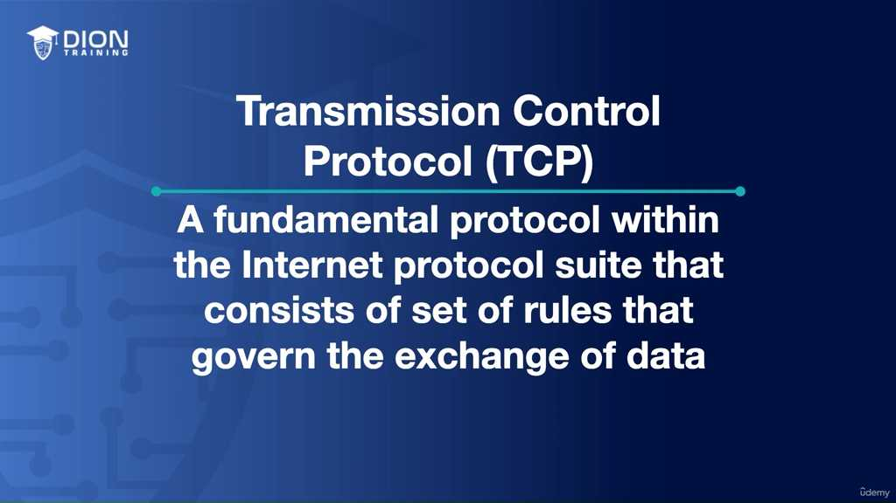

#### 2. Tại sao TCP lại "Đáng tin cậy"?
Điểm cốt lõi của TCP là sự "đáng tin cậy" (reliability). Trong môi trường mạng Internet hỗn loạn, các gói tin có thể bị mất, bị lỗi hoặc đến nơi không đúng thứ tự. TCP giải quyết điều này bằng ba trụ cột:
*   **Error Checking (Kiểm tra lỗi):** Đảm bảo dữ liệu không bị thay đổi trong quá trình di chuyển.
*   **Data Sequencing (Tuần tự hóa dữ liệu):** Đánh số thứ tự các gói tin để máy nhận biết được đâu là mảnh đầu, mảnh giữa và mảnh cuối.
*   **Acknowledgement (Xác nhận):** Máy nhận phải báo cho máy gửi biết: "Tôi đã nhận được món hàng này".

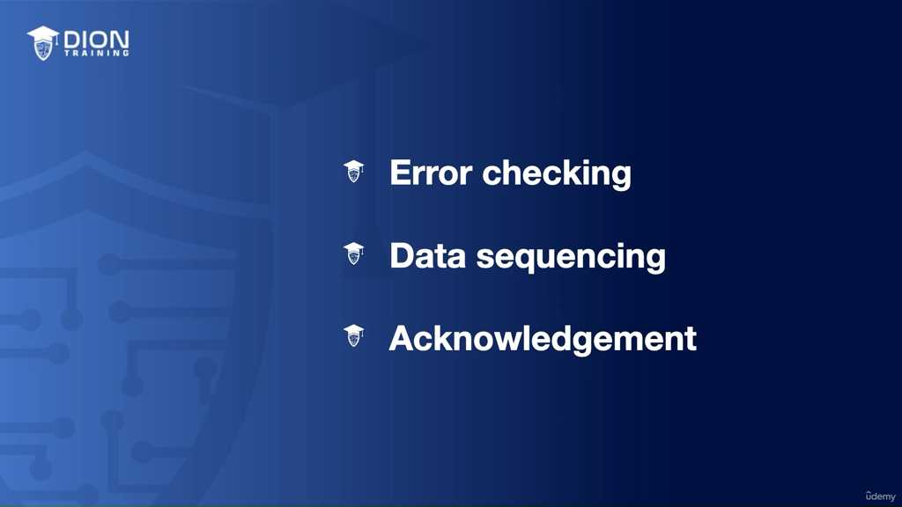

> **💡 Ví dụ nhớ đời:** Hãy tưởng tượng bạn gửi một cuốn tiểu thuyết 100 trang qua đường bưu điện cho một người bạn. Bạn sợ bưu điện làm thất lạc hoặc làm rách giấy, nên bạn đánh số từng trang từ 1 đến 100. Mỗi khi bạn gửi 10 trang, bạn yêu cầu người bạn kia viết thư phản hồi lại rằng "Tôi đã nhận được các trang từ X đến Y". Nếu sau 3 ngày bạn không thấy hồi âm, bạn hiểu rằng thư đã bị thất lạc và bạn tự giác gửi lại đúng những trang đó. Đó chính là cách TCP vận hành.

#### 3. TCP trong mô hình OSI
TCP hoạt động ở **Lớp Vận chuyển (Transport Layer - Lớp 4)** của mô hình OSI (Open Systems Interconnection). Mô hình này chia quá trình truyền tin thành 7 tầng trừu tượng. Ở lớp vận chuyển, TCP đóng vai trò là "người quản lý vận tải", đảm bảo dữ liệu được chuyển giao từ ứng dụng này sang ứng dụng khác một cách toàn vẹn, bất kể cơ sở hạ tầng mạng bên dưới (các lớp 1, 2, 3) có phức tạp hay không ổn định thế nào.

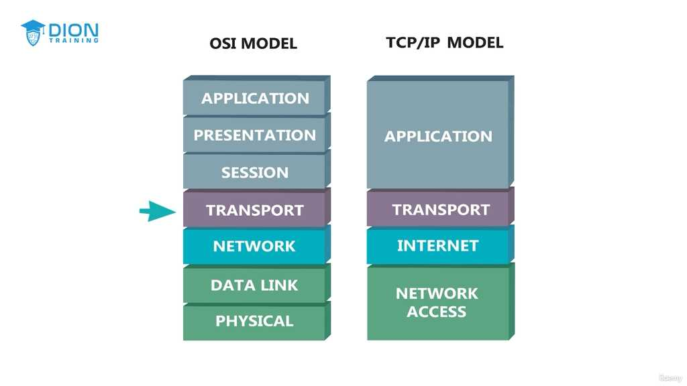

#### 4. Kỹ thuật chia nhỏ dữ liệu (Packetization)
Việc truyền một tệp tin lớn (như một video hay một tài liệu nặng) qua mạng là bất khả thi nếu gửi nguyên khối. TCP thực hiện quá trình "Packetization": chia nhỏ thông điệp thành các gói tin (packets) có kích thước quản lý được. Điều này giúp:
*   Tối ưu hóa băng thông.
*   Nếu một gói tin bị lỗi, ta chỉ cần gửi lại gói tin đó thay vì toàn bộ tệp tin.
*   Dễ dàng reassemble (tái lắp ráp) tại đích đến nhờ vào số thứ tự (sequence number).

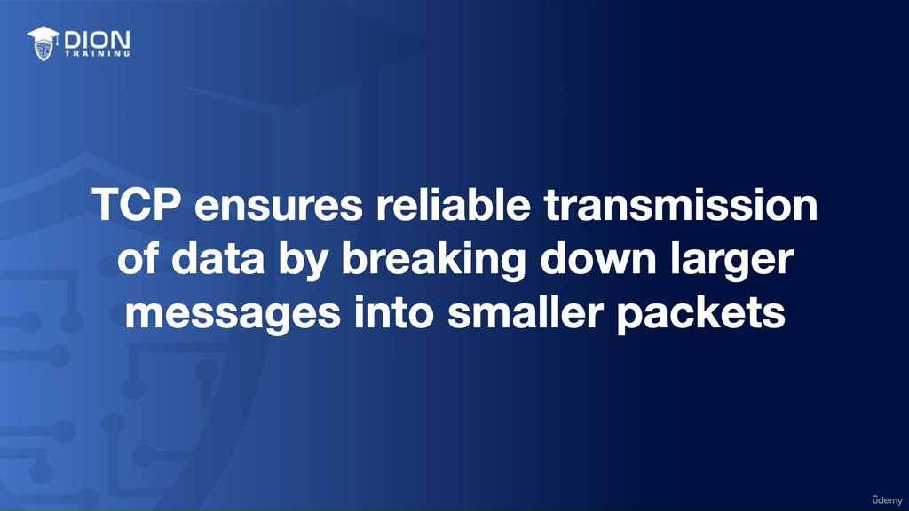

#### 5. "Cái bắt tay ba bước" (Three-way Handshake)
Đây là quy trình bắt buộc trước khi bất kỳ dữ liệu nào được truyền đi. Nó là thủ tục "làm quen" để hai bên máy tính tin tưởng lẫn nhau.

1.  **SYN (Synchronize):** Client gửi yêu cầu: "Chào Server, tôi muốn bắt đầu một phiên truyền tin với bạn".
2.  **SYN-ACK (Synchronize-Acknowledge):** Server phản hồi: "Chào Client, tôi nhận được yêu cầu của bạn, tôi sẵn sàng kết nối, bạn có sẵn sàng không?".
3.  **ACK (Acknowledge):** Client chốt lại: "Đã rõ, tôi sẵn sàng. Kết nối chính thức được thiết lập".

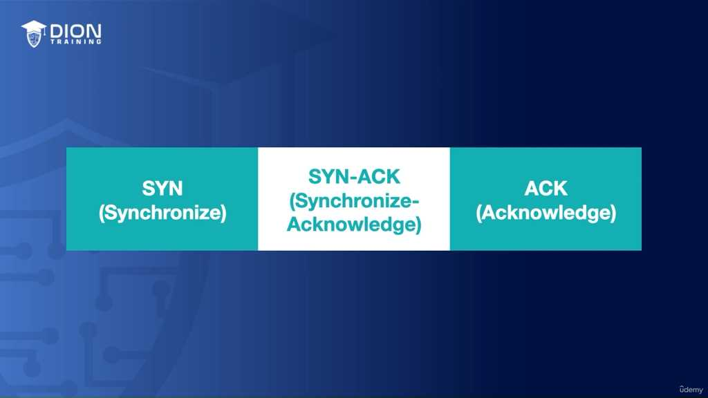

> **💡 Ví dụ nhớ đời:** Quy trình này giống như một cuộc điện thoại. Bạn gọi cho một người bạn:
> - Bạn: "Alo, nghe rõ không?" (SYN)
> - Người bạn: "Alo, nghe rõ rồi, bạn khỏe không?" (SYN-ACK)
> - Bạn: "Tôi khỏe, bắt đầu kể chuyện nhé!" (ACK)
> Chỉ khi nghe thấy tiếng "Alo" của nhau, hai bên mới bắt đầu nói chuyện chính thức.

#### 6. Cơ chế kiểm soát luồng và sửa lỗi
TCP không bao giờ giả định rằng mạng là hoàn hảo. Nếu trong quá trình truyền dẫn, một gói tin bị mất hoặc bị biến dạng (corrupted), giao thức sẽ lập tức phát hiện thông qua các Sequence Number và Acknowledgement messages. Ngay khi phát hiện sai sót, TCP sẽ kích hoạt cơ chế yêu cầu gửi lại (retransmission). Nó giữ cho toàn bộ tiến trình nằm trong sự kiểm soát chặt chẽ, đảm bảo tính nguyên vẹn của dữ liệu từ đầu tới cuối.

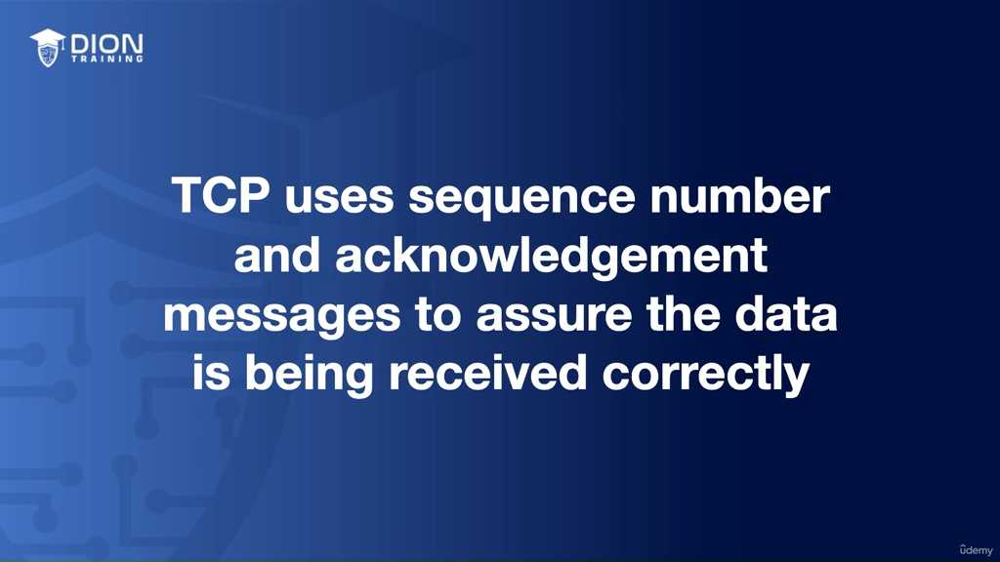

Đoạn transcript tiếp tục đi sâu vào các cơ chế tinh vi của giao thức TCP, cụ thể là kiểm soát luồng, định danh dịch vụ và vai trò cốt lõi của nó trong mô hình OSI.

### 1. Cơ chế kiểm soát luồng (Flow Control) và Windowing
TCP không chỉ đơn thuần là gửi dữ liệu; nó là một "người quản lý" thông minh. Một vấn đề kinh điển trong truyền tin là bên gửi (sender) có tốc độ xử lý nhanh hơn bên nhận (receiver). Nếu bên gửi cứ "xả" dữ liệu liên tục, bộ đệm (buffer) của bên nhận sẽ bị tràn, dẫn đến mất mát dữ liệu. Để giải quyết, TCP sử dụng cơ chế **Windowing**.

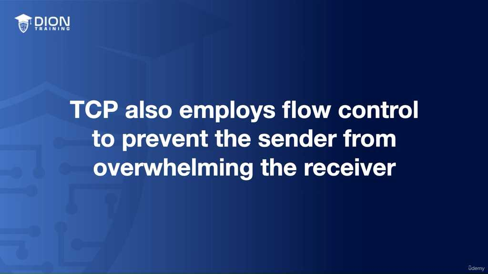

Windowing là một "cửa sổ" linh hoạt xác định lượng dữ liệu tối đa mà bên nhận có thể xử lý tại một thời điểm trước khi cần gửi phản hồi xác nhận (ACK). Cửa sổ này không cố định: nếu mạng ổn định và máy nhận rảnh rỗi, kích thước cửa sổ sẽ được mở rộng (widened) để tăng tốc độ truyền. Ngược lại, nếu mạng tắc nghẽn hoặc máy nhận quá tải, cửa sổ sẽ thu hẹp lại (narrowed) để giảm tải.

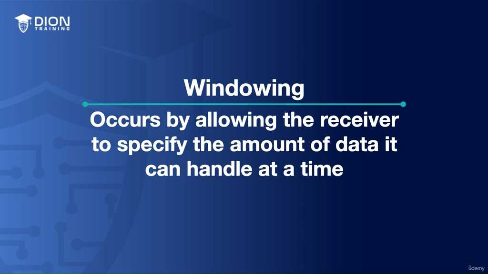

> **💡 Ví dụ nhớ đời:** Hãy tưởng tượng bạn đang tiếp nhận hàng hóa từ một băng chuyền. "Windowing" giống như sức chứa của kho hàng của bạn. Nếu kho rộng (cửa sổ lớn), bạn bảo bên gửi cứ chuyển thật nhiều hàng vào cùng lúc. Nhưng nếu kho của bạn bắt đầu đầy, bạn sẽ ra hiệu cho bên gửi: "Chỉ gửi 5 kiện một lần thôi". Nếu kho đầy ứ, bạn bắt họ dừng lại hoặc gửi nhỏ giọt cho đến khi bạn kịp dọn bớt hàng đi.

### 2. Định danh dịch vụ bằng Cổng (Ports)
Khi dữ liệu đi vào một máy tính, làm sao hệ điều hành biết gói tin đó dành cho trình duyệt web, phần mềm email hay ứng dụng chat? Câu trả lời chính là **Port (Cổng)**. Một Port là một định danh số học giúp phân biệt giữa các dịch vụ đang chạy đồng thời trên cùng một địa chỉ IP.

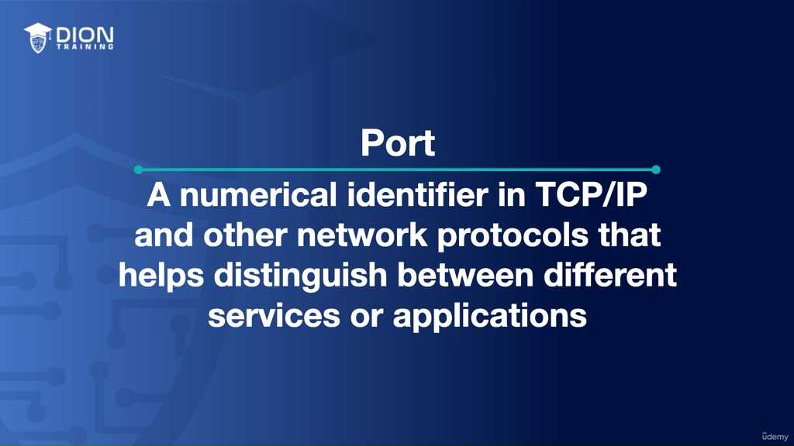

Một kết nối TCP hoàn chỉnh được xác định bởi 4 thành phần (Socket Pair):
*   **IP nguồn và IP đích:** Xác định hai máy tính đang nói chuyện.
*   **Port nguồn và Port đích:** Xác định hai ứng dụng cụ thể đang giao tiếp.

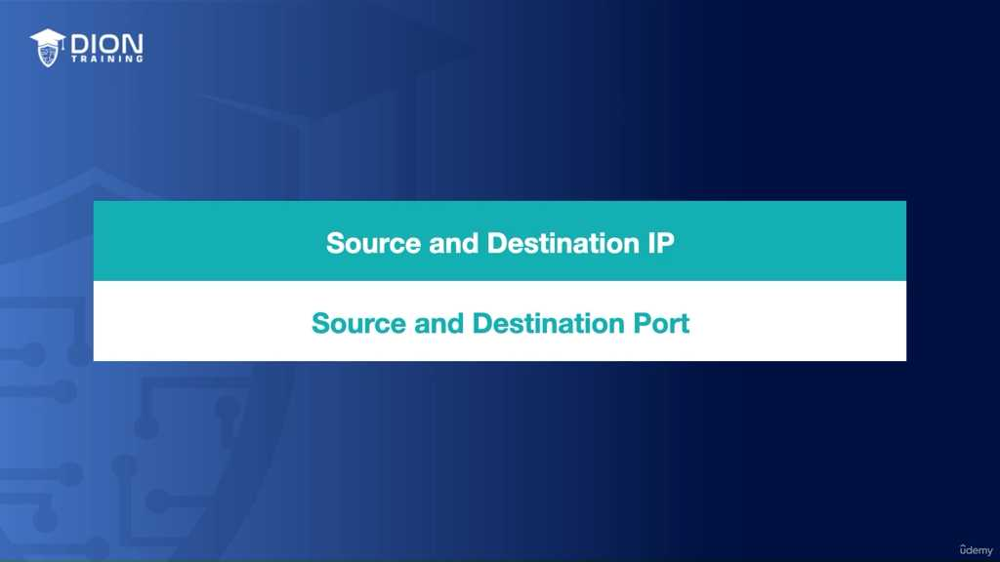

Ví dụ kinh điển được nhắc đến là **Port 443**. Khi bạn truy cập một website bảo mật (HTTPS), trình duyệt của bạn không gửi dữ liệu "bừa bãi" mà gửi trực tiếp đến Port 443 của server. Tại đây, giao thức SSL/TLS sẽ được kích hoạt để mã hóa dữ liệu. Nếu không có Port, dữ liệu sẽ đến đúng "nhà" (IP máy chủ) nhưng không biết phải vào "phòng" nào (ứng dụng nào), gây ra sự hỗn loạn trong truyền thông.

### 3. Tầm quan trọng của Port trong đa nhiệm (Multitasking)
Ports chính là chìa khóa cho phép một máy chủ vật lý duy nhất cung cấp hàng nghìn dịch vụ cùng lúc. Mỗi ứng dụng được gán một số hiệu cổng độc nhất. Điều này tạo ra sự phân tách logic: trên cùng một phần cứng, hệ điều hành có thể tách biệt lưu lượng truy cập của web server (Port 80/443), mail server (Port 25/110) và database server (Port 3306) mà không hề xảy ra xung đột.

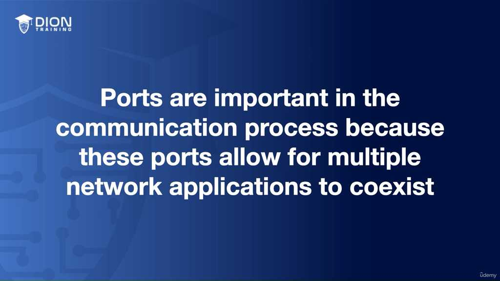

### 4. Tổng kết về TCP và Mô hình OSI
TCP được định nghĩa là "trái tim" của giao tiếp internet vì nó đảm bảo tính toàn vẹn (integrity) và thứ tự (ordering). Những điểm cốt lõi cần ghi nhớ:
*   **Vị trí:** TCP nằm ở tầng Transport (Tầng 4) của mô hình OSI.

*   **Kỹ thuật cốt lõi:**
    *   **Packetization:** Chia nhỏ dữ liệu thành các gói tin.
    *   **Acknowledgement:** Cơ chế phản hồi để xác nhận bên kia đã nhận được.
    *   **Error checking:** Kiểm tra xem dữ liệu có bị hỏng trong quá trình truyền hay không.
*   **Ba bước bắt tay (Three-way handshake):** Là điều kiện bắt buộc để thiết lập một kết nối tin cậy trước khi dữ liệu thực sự bắt đầu "lên đường". 

> **💡 Ví dụ nhớ đời:** Hãy coi Three-way handshake giống như một cuộc điện thoại truyền thống:
> 1. Bạn gọi: "Alo, bạn có nghe rõ không?" (SYN)
> 2. Người kia đáp: "Tôi nghe rõ đây, còn bạn nghe tôi rõ không?" (SYN-ACK)
> 3. Bạn chốt: "Tôi nghe rõ, bắt đầu nói chuyện nhé." (ACK)
> Chỉ sau ba bước xác nhận này, cuộc trò chuyện (truyền dữ liệu) mới được coi là ổn định và bắt đầu diễn ra. Nếu thiếu một trong ba bước, kết nối không bao giờ được thiết lập thành công.

---

## 🎯 Bí Kíp Ôn Thi Tốc Độ: Transmission Control Protocol (TCP)

**1. Bản chất & Vị trí**
*   **TCP (Transmission Control Protocol):** Giao thức truyền tin **tin cậy (reliable)**, đảm bảo dữ liệu đến nơi không lỗi, đúng thứ tự.
*   **OSI Model:** Nằm tại **Transport Layer (Lớp 4)**.
*   **Cơ chế cốt lõi:** Chia nhỏ dữ liệu (**Packetization**) $\rightarrow$ Gửi đi $\rightarrow$ Tái lắp ráp tại đích.

**2. Quy trình thiết lập: Three-way Handshake**
*   **Bước 1: SYN** (Client gửi yêu cầu kết nối).
*   **Bước 2: SYN-ACK** (Server xác nhận & đồng ý).
*   **Bước 3: ACK** (Client xác nhận lại lần cuối).
*   *Mục đích:* Đồng bộ hóa, đảm bảo cả hai sẵn sàng truyền tin.

**3. Đảm bảo độ tin cậy (Integrity & Flow)**
*   **Cơ chế:** Dùng **Sequence Number** (thứ tự) & **Acknowledgement** (xác nhận đã nhận).
*   **Xử lý lỗi:** Nếu mất/lỗi gói tin $\rightarrow$ Tự động **Retransmit** (gửi lại).
*   **Flow Control:** Dùng kỹ thuật **Windowing** (điều chỉnh lượng dữ liệu gửi dựa trên khả năng tiếp nhận của Receiver).

**4. Địa chỉ hóa (Communication Process)**
*   **Port (Cổng):** Định danh dịch vụ/ứng dụng trên máy tính.
*   **Socket:** Cặp đôi **[IP Address + Port Number]**.
*   **Ví dụ:** HTTPS dùng **Port 443** (kèm mã hóa SSL/TLS).
*   *Lợi ích:* Cho phép nhiều dịch vụ chạy đồng thời trên 1 máy vật lý.

**5. Từ khóa "Vàng" để làm bài:**
*   **Reliability** (Tin cậy)
*   **Three-way Handshake** (SYN, SYN-ACK, ACK)
*   **Transport Layer**
*   **Packetization** (Chia gói)
*   **Windowing** (Flow control)
*   **Port** (Định danh dịch vụ)

---
*Ghi chú: 12 hình ảnh minh họa (.jpg) đã được tải về và lưu tự động vào thư mục con `image/` cùng cấp với file này. Để ảnh hiển thị tự động, hãy đảm bảo bạn sao chép cả thư mục `image/` nếu bạn muốn di chuyển file markdown sang nơi khác!*
