# Understanding UDP Protocol

### Phân tích chi tiết: Giao thức UDP (User Datagram Protocol)

**1. Bản chất của UDP và các ứng dụng thực tế**
UDP (User Datagram Protocol) là một giao thức truyền tải tầng giao vận (Transport Layer) nằm trong mô hình OSI. Khác với TCP, UDP được thiết kế để ưu tiên tốc độ truyền tải thay vì độ tin cậy tuyệt đối. 

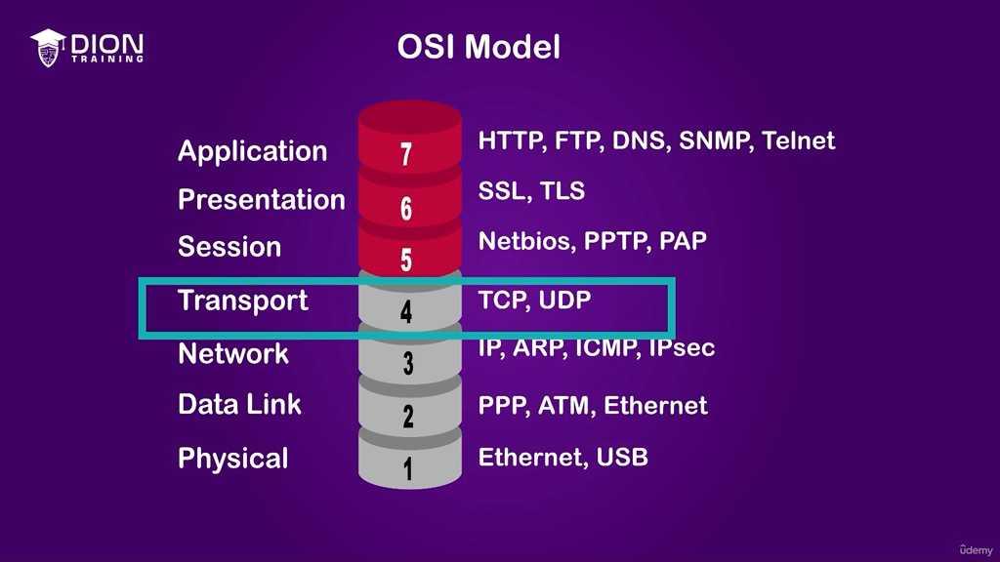

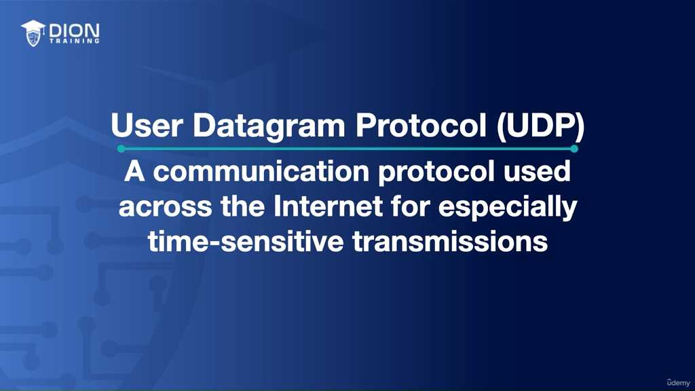

Tại sao UDP lại quan trọng? Bởi vì có những loại dữ liệu mà sự "tức thời" (time-sensitive) quan trọng hơn việc "chính xác từng bit". Khi bạn đang xem một đoạn video trực tuyến hoặc thực hiện tra cứu DNS (hệ thống tên miền), việc mất đi một vài miligiây hoặc một vài gói tin bị hỏng không làm hỏng toàn bộ trải nghiệm của bạn. Nếu bạn đang xem một trận bóng đá trực tiếp, bạn thà chấp nhận mất một vài khung hình bị mờ (nhưng hình ảnh vẫn trôi chảy) còn hơn là video dừng lại hẳn để chờ hệ thống sửa lỗi hoặc yêu cầu gửi lại gói tin cũ đã bị trễ.

> **💡 Ví dụ nhớ đời:** Hãy tưởng tượng bạn đang nói chuyện qua bộ đàm với một người ở đầu dây bên kia. UDP giống như việc bạn cứ nói liên tục. Nếu một từ bị nhiễu do sóng yếu, người nghe có thể đoán được từ đó dựa trên ngữ cảnh và câu chuyện vẫn tiếp diễn. Ngược lại, TCP giống như việc bạn phải gửi thư tay: bạn viết, gửi đi, chờ người kia xác nhận đã nhận, rồi mới viết tiếp. Cách này đảm bảo không mất chữ nào, nhưng cuộc đối thoại sẽ chậm đến mức không thể gọi là "trò chuyện trực tiếp" được.

**2. Sự đánh đổi: Tốc độ vs. Độ tin cậy**
UDP sở hữu "độ trễ thấp" (low latency) và "chi phí xử lý thấp" (reduced processing overhead). Điều này đạt được bằng cách loại bỏ các cơ chế kiểm tra lỗi và phục hồi dữ liệu phức tạp. 

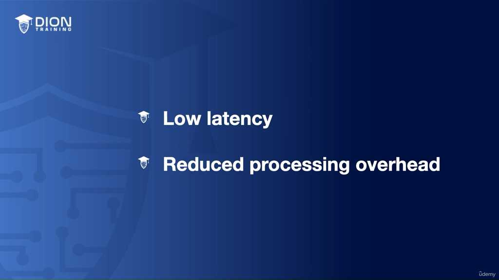

- **Tại lớp ứng dụng:** Vì UDP không sửa lỗi, các lập trình viên có thể chọn cách tự xử lý lỗi ngay tại phần mềm ứng dụng (Application Layer) nếu cần, hoặc đơn giản là chấp nhận rằng dữ liệu đó không quan trọng đến mức phải khôi phục.
- **Tính phi kết nối (Connectionless):** Đây là đặc điểm then chốt. UDP không thiết lập "kênh truyền đặc biệt" hay "lối đi riêng" trước khi gửi. Nó không có khái niệm "làm quen" trước khi "trao đổi".

**3. So sánh UDP với TCP: "Thủ tục" và "Hiệu quả"**
Để hiểu tại sao UDP nhanh, hãy nhìn vào quy trình của TCP:
- **TCP:** Phải trải qua "bắt tay ba bước" (three-way handshake) để thiết lập kết nối, sau đó thực hiện "cửa sổ trượt" (windowing) để kiểm soát lưu lượng và độ tin cậy. Đây giống như một thủ tục hành chính cồng kềnh trước khi bắt đầu công việc.
- **UDP:** Không có bắt tay, không có điều tiết lưu lượng. Nó giống như việc một người đưa thư chạy thẳng đến hòm thư, ném kiện hàng vào và rời đi ngay lập tức mà không cần biết người nhận đã mở cửa chưa.

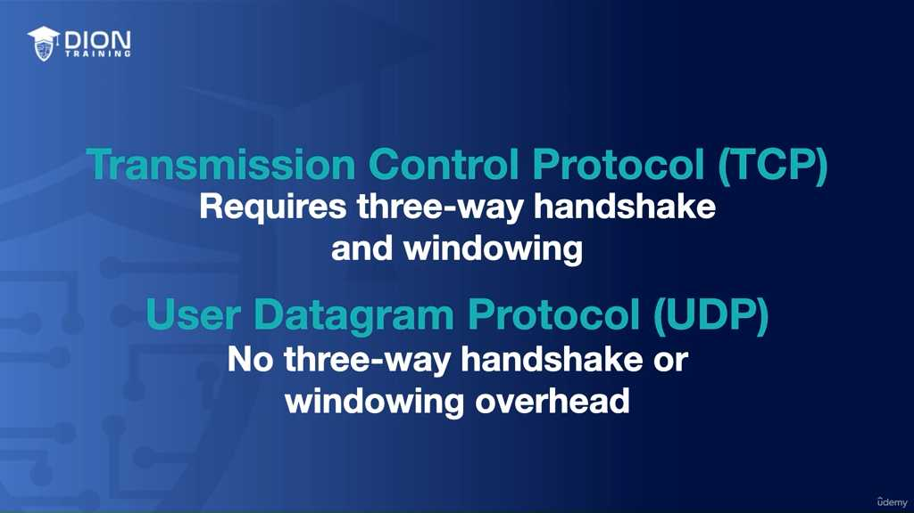

**4. Cấu trúc gói tin: Nhỏ gọn và hiệu quả**
Sự khác biệt về hiệu năng còn nằm ở kích thước Header (phần tiêu đề) của gói tin:

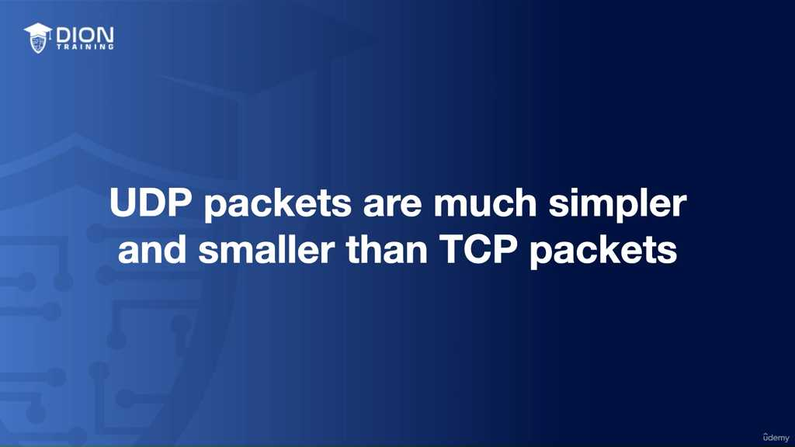

- **UDP Header:** Chỉ có 8 bytes. Nó rất đơn giản, chỉ bao gồm:
    - *Source port:* Cổng nguồn.
    - *Destination port:* Cổng đích.
    - *Length:* Độ dài gói tin.
    - *Checksum:* Kiểm tra tính toàn vẹn cơ bản.

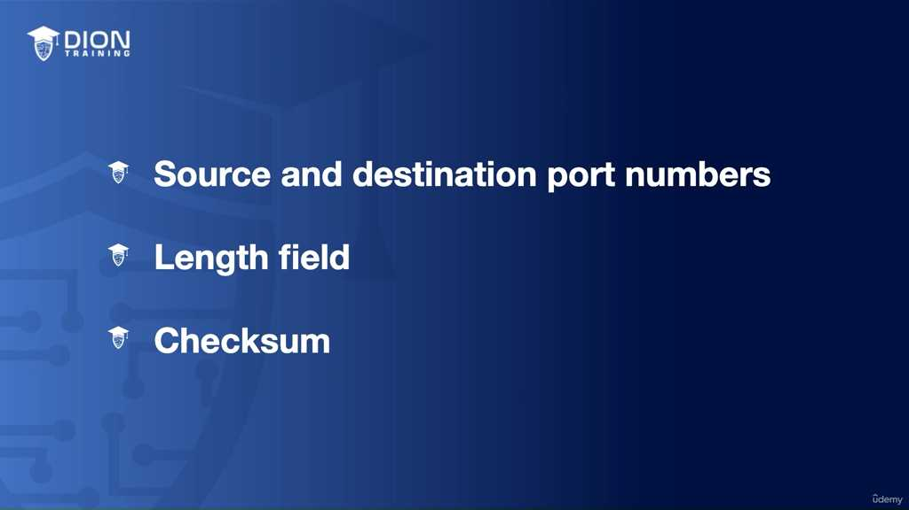

- **TCP Header:** Từ 20 đến 60 bytes. Sự chênh lệch này là rất lớn trong truyền thông mạng. Với header lớn, TCP phải tiêu tốn nhiều tài nguyên hơn để đóng gói và xử lý mỗi gói tin. 

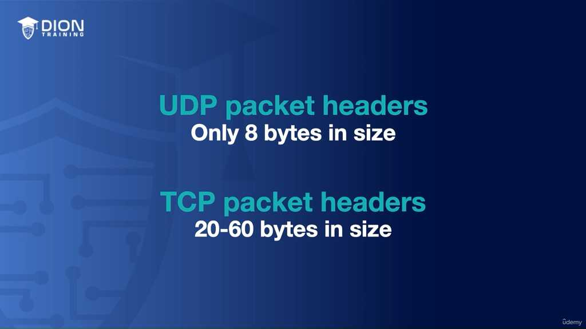

Do không gian trong header của UDP quá hạn hẹp (chỉ 8 bytes), nó hoàn toàn không thể chứa các "công cụ" kiểm soát lỗi tinh vi vốn cần rất nhiều không gian lưu trữ thông tin trạng thái. Đó là lý do tại sao nó chỉ có thể là một giao thức "vô tư" và "nhẹ nhàng".

**5. Bản chất "Stateless" và triết lý "Fire-and-forget"**
UDP là một giao thức "không trạng thái" (stateless). Điều này có nghĩa là hệ thống mạng không cần lưu trữ thông tin về phiên kết nối, không cần nhớ đã gửi bao nhiêu gói, gói nào đến, gói nào mất. 

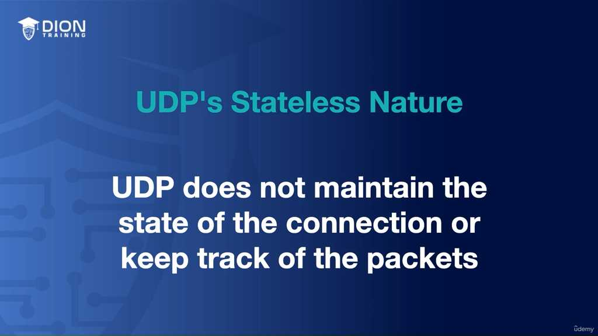

Triết lý "Fire-and-forget" (bắn và quên) mô tả chính xác cách vận hành của nó: Khi một ứng dụng đã phát đi gói tin (datagram), giao thức UDP không quan tâm đến "số phận" của gói tin đó nữa. Nó không lưu bản sao để gửi lại, không chờ đợi phản hồi xác nhận (ACK). Sau khi nhấn nút "bắn", nó hoàn toàn rũ bỏ trách nhiệm với gói tin đó để tập trung nguồn lực cho gói tin tiếp theo. Chính sự "vô tâm" này lại là chìa khóa tạo nên tốc độ kinh ngạc cho UDP.

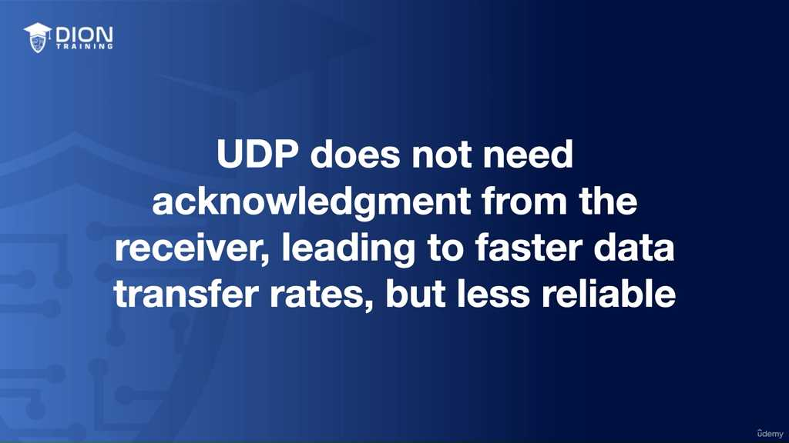

Cơ chế hoạt động của UDP được gói gọn trong khái niệm "fire-and-forget" (bắn và quên). Điều này có nghĩa là khi dữ liệu được đẩy vào đường truyền, giao thức không hề thực hiện bước kiểm tra xem người nhận đã thực sự nhận được nó một cách toàn vẹn hay chưa. Vì người gửi không cần phải dừng lại để chờ bất kỳ tín hiệu xác nhận (acknowledgement) nào, tốc độ truyền tải được đẩy lên mức tối đa. Tuy nhiên, cái giá phải trả là sự bất ổn: các gói tin có thể đến không đúng thứ tự, xuất hiện bản sao trùng lặp, hoặc tồi tệ hơn là biến mất hoàn toàn trên đường đi.

> **💡 Ví dụ nhớ đời:** Hãy tưởng tượng bạn đang hét vào một sân vận động đầy ắp người để truyền tin. UDP giống như việc bạn cứ liên tục hét thông tin quan trọng mà không cần quan tâm người nghe có nghe rõ hay không. Nếu họ nghe sót một vài từ, họ vẫn có thể đoán được nội dung từ ngữ cảnh chung. Nó hiệu quả vì tiết kiệm thời gian, thay vì phải hỏi "Bạn nghe rõ chưa?" sau mỗi từ, làm gián đoạn dòng chảy thông tin.

Việc sử dụng UDP trở nên hợp lý trong các kịch bản ưu tiên "tốc độ hơn độ chính xác". Các ứng dụng như phát trực tiếp (live broadcast), chơi game online, hay gọi điện qua IP (VoIP) là những môi trường mà độ trễ (delay) – thứ nảy sinh từ việc cố gắng gửi lại (retransmission) các gói tin bị mất – lại gây hại cho trải nghiệm người dùng nhiều hơn là việc chấp nhận mất một vài mẩu dữ liệu nhỏ.

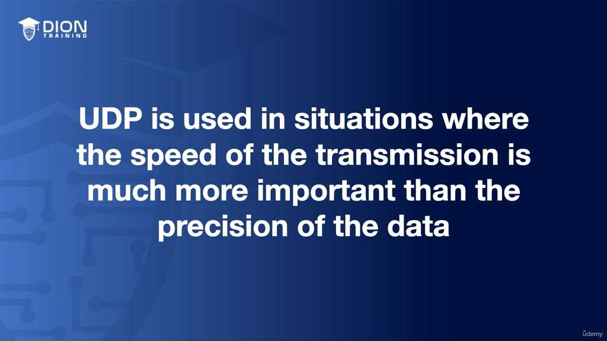

Trong quá trình bạn xem một đoạn video trực tuyến, hệ thống của bạn thực tế đang đánh rơi rất nhiều gói tin do sử dụng UDP. Nhưng vì tệp video có dung lượng khổng lồ và chứa hàng ngàn, hàng vạn gói tin, việc mất đi một vài phần tử nhỏ rải rác ở đây hoặc kia là hoàn toàn không đáng kể. Mắt người dùng sẽ không thể nhận ra sự gián đoạn trong một dòng chảy hình ảnh liên tục như vậy. Ngược lại, nếu chúng ta bắt hệ thống dừng lại để yêu cầu gửi lại những gói tin bị mất đó, người xem sẽ phải đối mặt với hiện tượng "giật lag" hoặc dừng hình khó chịu, làm hỏng hoàn toàn trải nghiệm thời gian thực.

Một ứng dụng điển hình khác là mô hình giao tiếp yêu cầu-phản hồi (request-response) đơn giản, chẳng hạn như truy vấn DNS. Trong trường hợp này, máy trạm gửi một yêu cầu duy nhất và chờ đợi một phản hồi duy nhất. Sự đơn giản của UDP giúp quá trình này diễn ra tức thì mà không cần thủ tục thiết lập kết nối phức tạp.

Để đảm bảo dữ liệu được dẫn đến đúng "cửa" của ứng dụng trên máy chủ (ví dụ: máy tính của bạn vừa mở web, vừa mở ứng dụng gọi điện cùng lúc), UDP vẫn sử dụng các cổng (ports). Mỗi datagram (đơn vị dữ liệu của UDP) luôn mang theo thông tin cổng nguồn và cổng đích trong phần tiêu đề (header). Đây là chìa khóa để hệ thống chuyển tiếp gói tin tới đúng tiến trình ứng dụng đang chờ đợi nó.

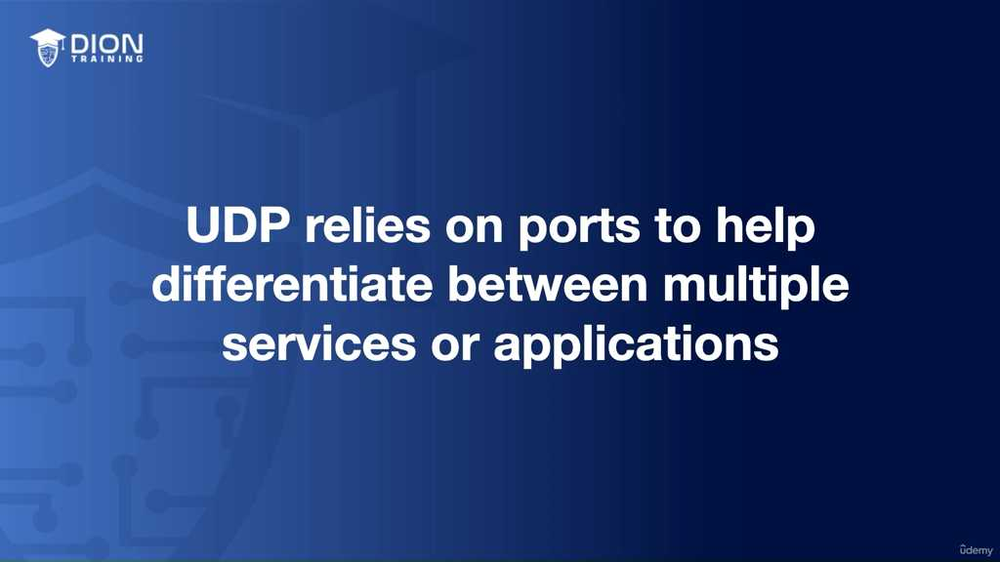

Mặc dù UDP không cung cấp sự đảm bảo về việc giao hàng, nó vẫn được trang bị một cơ chế phòng vệ cơ bản: "checksum" (mã kiểm tra lỗi) nằm ngay trong header. Checksum giúp hệ thống phát hiện xem gói tin có bị hỏng hóc hay biến dạng về mặt bit dữ liệu trong quá trình di chuyển hay không. Tuy nhiên, cần hiểu rõ đây chỉ là lớp bảo vệ tối thiểu. Nó chỉ cho phép chúng ta biết dữ liệu đã bị lỗi để loại bỏ, chứ không có năng lực sửa lỗi hay yêu cầu gửi lại như cách TCP (Transmission Control Protocol) thực hiện. Do đó, UDP vẫn mãi là một giao thức "không đáng tin cậy" về mặt đảm bảo truyền tải, nhưng lại là "ông vua" về hiệu suất trong những môi trường yêu cầu tốc độ phản hồi cực nhanh.

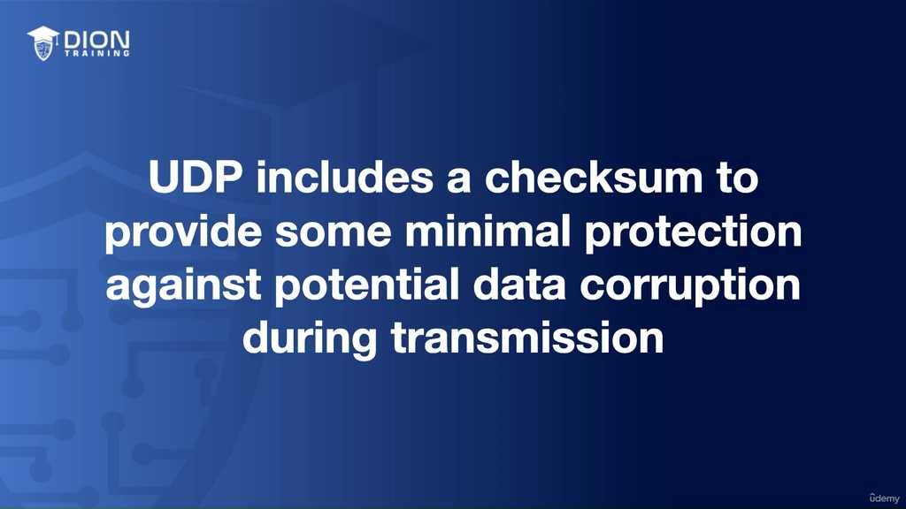

Đoạn transcript này đóng vai trò như một bản tóm lược đúc kết các thuộc tính cốt lõi của giao thức UDP. Thay vì đi sâu vào cơ chế vận hành như phần trước, phần này nhấn mạnh vào bản chất "không trạng thái" và vai trò điều hướng của các cổng (ports).

**1. Khẳng định lại bản chất của UDP**
Tác giả nhắc lại UDP là một giao thức "connectionless" (phi kết nối). Điểm cần làm rõ ở đây là tại sao sự kết nối lại là thứ yếu. Trong các hệ thống mạng, việc thiết lập kết nối (như bắt tay 3 bước của TCP) tốn thời gian và tài nguyên để duy trì trạng thái của hai đầu mút. UDP loại bỏ hoàn toàn gánh nặng này, cho phép dữ liệu được "phóng" đi ngay lập tức. Đây chính là chìa khóa để đạt được hiệu suất tối ưu cho các ứng dụng đòi hỏi độ trễ cực thấp (speed-sensitive).

**2. Khái niệm "Stateless" (Không trạng thái) - Phân tích sâu**
Transcript xác định UDP là một giao thức "stateless". Đây là khái niệm then chốt:

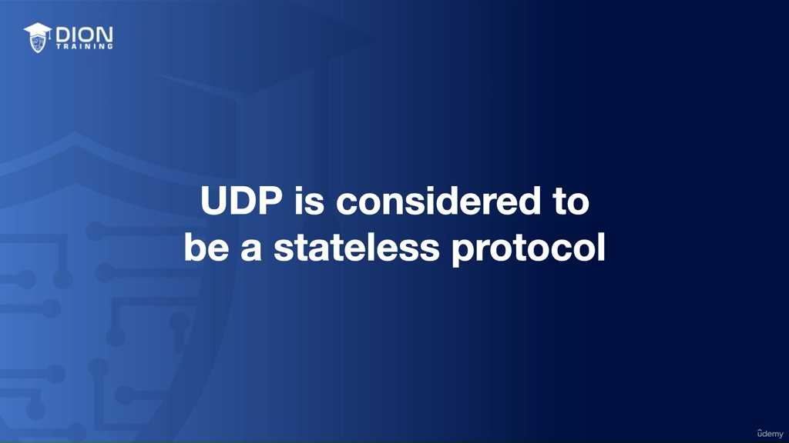

*   Trong thế giới "stateful" (có trạng thái), giao thức phải ghi nhớ thông tin về phiên làm việc: gói tin nào đã gửi, gói nào đã nhận, gói nào bị mất để chờ gửi lại.
*   Với UDP, vì không có "trạng thái" nào được lưu giữ, mỗi gói tin được coi là một thực thể độc lập. Gói tin này không hề biết sự tồn tại của gói tin đi trước hay đi sau nó. Chính vì không cần lưu trữ "trạng thái" của phiên làm việc, thiết bị mạng không phải tiêu tốn tài nguyên bộ nhớ (RAM) để quản lý hàng nghìn phiên kết nối cùng lúc, giúp tăng khả năng xử lý của các hệ thống máy chủ lớn.

> **💡 Ví dụ nhớ đời:** Hãy tưởng tượng bạn là một người phát tờ rơi quảng cáo ở ngã tư. Cách gửi của TCP giống như bạn đưa từng tờ rơi tận tay người đi đường, đợi họ gật đầu xác nhận đã cầm, nếu họ không cầm thì bạn phải đưa lại. Cách gửi của UDP giống như việc bạn đứng trên một tòa nhà cao tầng và thả hàng ngàn tờ rơi xuống phố. Bạn không quan tâm ai nhặt được, ai làm mất, hay tờ nào rơi trước tờ nào. Bạn chỉ cần thả thật nhanh để tờ rơi phủ kín khu vực. Mục tiêu của bạn là sự nhanh chóng, không phải là sự đảm bảo từng tờ rơi đến đúng tay người nhận.

**3. Cơ chế định hướng của Ports**
Mặc dù UDP không đảm bảo độ tin cậy, nhưng nó vẫn cần sự chính xác trong việc chọn "đích đến". Transcript nhấn mạnh vai trò của **Ports** (cổng) để điều hướng dữ liệu đến đúng ứng dụng (process) trên thiết bị.

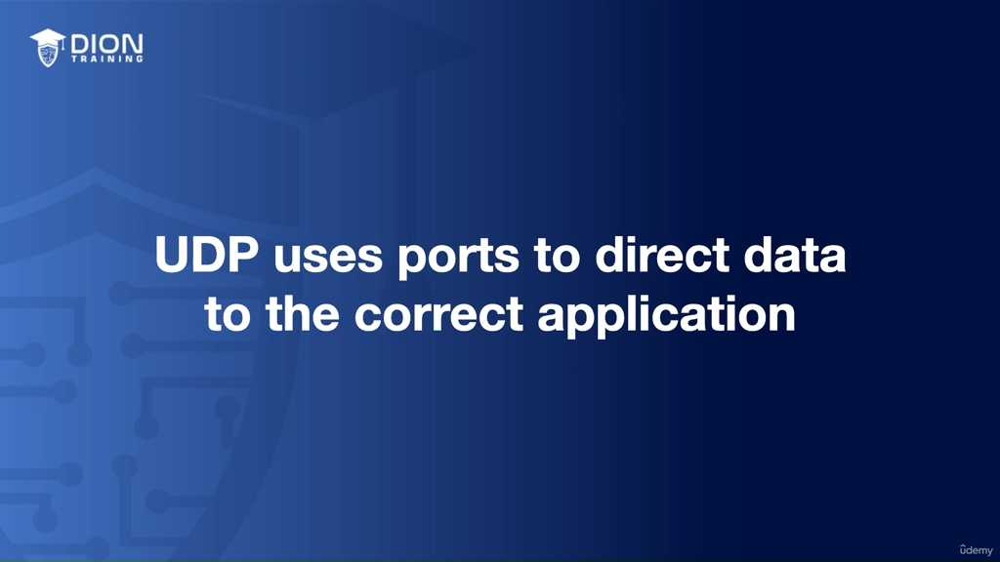

*   Hãy hình dung mỗi máy tính/server là một tòa nhà văn phòng khổng lồ (địa chỉ IP).
*   Các ứng dụng (như trình duyệt, game, phần mềm VOIP) là các phòng ban khác nhau trong tòa nhà đó.
*   Số hiệu cổng (Port number) chính là số phòng. UDP đóng vai trò như người đưa thư, dù không cần ký nhận (vì là giao thức không tin cậy), nhưng nó phải ghi rõ "Số phòng 80" hay "Số phòng 443" trên phong bì để dữ liệu không bị gửi nhầm từ ứng dụng này sang ứng dụng khác.

**4. Mối liên hệ mật thiết giữa UDP và thời gian thực**
Cụm từ "time-sensitive manner" (xử lý theo thời gian thực) là điểm đắt giá nhất. Nếu một gói dữ liệu âm thanh trong cuộc gọi VOIP đến muộn (do cơ chế gửi lại của các giao thức đáng tin cậy), âm thanh đó sẽ trở nên vô nghĩa vì cuộc trò chuyện đã trôi qua rồi. Việc UDP truyền tải dữ liệu một cách đơn giản, không kiểm tra, không chờ đợi giúp các ứng dụng này duy trì được "dòng chảy" liên tục. Dữ liệu đến chậm hoặc mất mát một phần nhỏ không gây "chết" ứng dụng, mà chỉ gây ra sự sụt giảm chất lượng tạm thời – một sự đánh đổi hoàn toàn xứng đáng trong thế giới của truyền tải dữ liệu trực tiếp.

---

## 🎯 Bí Kíp Ôn Thi Tốc Độ: User Datagram Protocol (UDP)

*   **Bản chất:** Giao thức **Connectionless** (không kết nối) & **Stateless** (không lưu trạng thái).
*   **Triết lý:** "Fire-and-forget" (Gửi rồi quên) – Không bắt tay (handshake), không phản hồi (ACK).
*   **Ưu điểm:** 
    *   **Low latency** (độ trễ thấp).
    *   **Tốc độ cao**, tiết kiệm tài nguyên xử lý.
    *   **Header nhỏ gọn:** Chỉ **8 bytes** (cấu trúc đơn giản: Port nguồn, Port đích, Độ dài, Checksum).
*   **Nhược điểm:** 
    *   **Không tin cậy:** Không bảo đảm dữ liệu đến đích, không thứ tự, không khôi phục lỗi.
    *   **Mất mát:** Gói tin có thể bị mất, trùng lặp hoặc đến sai thứ tự.
*   **Ứng dụng (Ưu tiên Tốc độ > Độ chính xác):**
    *   **Live streaming** (Video trực tuyến).
    *   **VoIP** (Gọi điện thoại qua internet).
    *   **Online Gaming**.
    *   **DNS Lookups** (Truy vấn đơn giản).
*   **Tầng OSI:** **Transport Layer** (tầng Giao vận) - cùng tầng với TCP.
*   **Cơ chế định tuyến:** Sử dụng **Ports** (cổng) để phân phối dữ liệu đến đúng ứng dụng.
*   **So sánh nhanh với TCP:**
    *   **TCP:** Tin cậy, có kiểm soát lỗi, header lớn (20-60 bytes), kết nối 3 bước (handshake).
    *   **UDP:** Nhanh, đơn giản, header tối giản (8 bytes), không kiểm soát.

💡 **Mẹo ghi nhớ:** UDP = **U**nreliable (Không tin cậy) + **D**atagram (Gói tin) + **P**eppy (Nhanh nhẹn/Tốc độ).

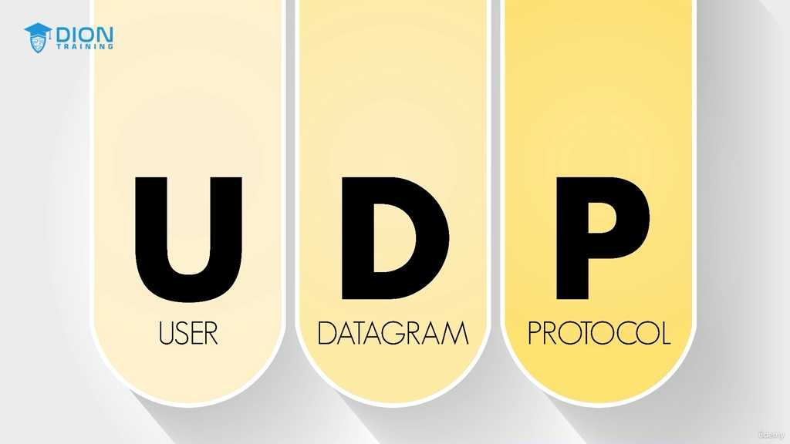

---
*Ghi chú: 15 hình ảnh minh họa (.jpg) đã được tải về và lưu tự động vào thư mục con `image/` cùng cấp với file này. Để ảnh hiển thị tự động, hãy đảm bảo bạn sao chép cả thư mục `image/` nếu bạn muốn di chuyển file markdown sang nơi khác!*
