# Understanding ICMP Protocol

### Phân tích chi tiết về Giao thức ICMP (Internet Control Message Protocol)

**1. Bản chất của ICMP trong Bộ giao thức Internet**
ICMP, viết tắt của Internet Control Message Protocol, không phải là một giao thức truyền tải dữ liệu người dùng như các giao thức tầng giao vận mà chúng ta thường nghe tới. Nó là một phần "tích hợp" (integral part) của Bộ giao thức Internet (Internet Protocol Suite). Để hiểu đơn giản, nếu TCP/UDP là những "xe tải" chở hàng hóa (dữ liệu) giữa các hệ thống, thì ICMP giống như "đội ngũ kỹ sư kiểm tra đường cao tốc". Nó không chở hàng, nó phục vụ mục đích bảo trì và giám sát sự thông suốt của mạng lưới.

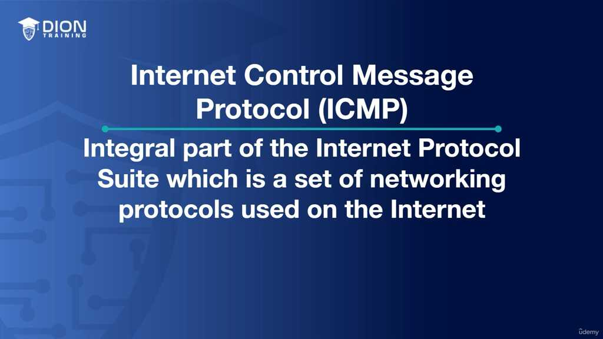

**2. Sự khác biệt cốt lõi với TCP và UDP**
Đoạn transcript nhấn mạnh một điểm rất quan trọng: ICMP không dùng để gửi dữ liệu giữa các ứng dụng. 
*   **TCP/UDP:** Tập trung vào việc truyền tải dữ liệu (Payload) từ Điểm A đến Điểm B một cách tin cậy hoặc nhanh chóng.

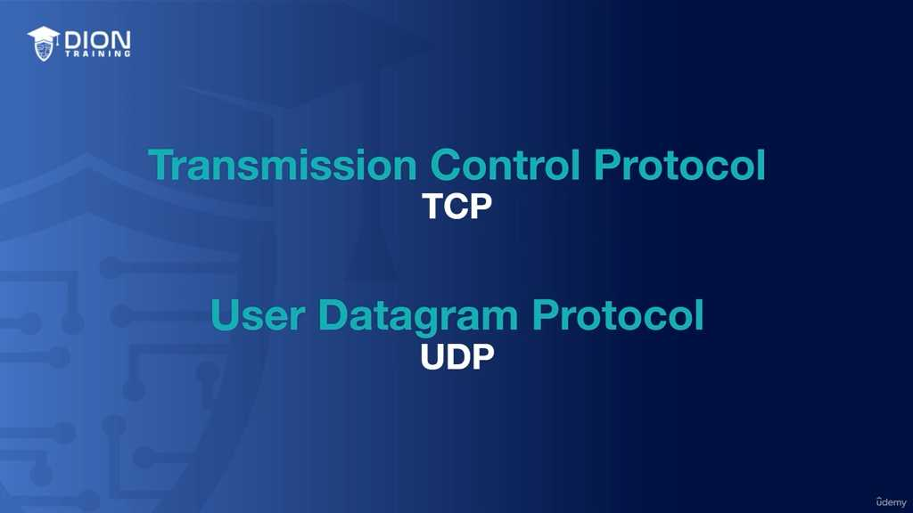

*   **ICMP:** Hoạt động tại tầng mạng (Network Layer) của mô hình OSI. Nó đóng gói (encapsulation) nội dung của mình bên trong chính gói tin IP. Điều này có nghĩa là ICMP "nương nhờ" vào hạ tầng IP để di chuyển khắp internet, thực hiện nhiệm vụ chẩn đoán lỗi và báo cáo tình trạng mạng.

> **💡 Ví dụ nhớ đời:** Hãy tưởng tượng bạn đang gửi thư qua bưu điện. TCP/UDP là những kiện hàng quà tặng bạn gửi cho bạn bè. Còn ICMP giống như những tấm thẻ "Bưu điện thông báo": nó không mang quà, nó chỉ mang thông báo kiểu: "Địa chỉ này không tồn tại", "Thư bị trả lại do quá tải" hoặc "Đang trên đường đi". Bạn không dùng ICMP để gửi quà, bạn dùng nó để biết tại sao quà của bạn chưa tới nơi.

**3. Chức năng báo lỗi và kiểm soát lưu lượng**
ICMP đóng vai trò như một "nhân viên phản hồi" trong hệ thống mạng. Nó được kích hoạt khi:
*   **Host hoặc dịch vụ không thể truy cập (Unreachable):** Khi một gói tin cố gắng kết nối tới một máy chủ nhưng đường truyền bị đứt.
*   **Hết thời gian sống (TTL - Time to Live expired):** Mỗi gói tin có một "hạn sử dụng" (số bước nhảy qua các router). Khi hết hạn mà chưa tới đích, ICMP sẽ lên tiếng để ngăn chặn gói tin chạy lòng vòng mãi mãi trong mạng.
*   **Tắc nghẽn mạng:** Khi bộ đệm (buffer) của router bị đầy và không thể tiếp nhận thêm dữ liệu, nó sẽ dùng ICMP để báo cho nguồn gửi rằng: "Hãy chậm lại, tôi không thể xử lý kịp nữa!".

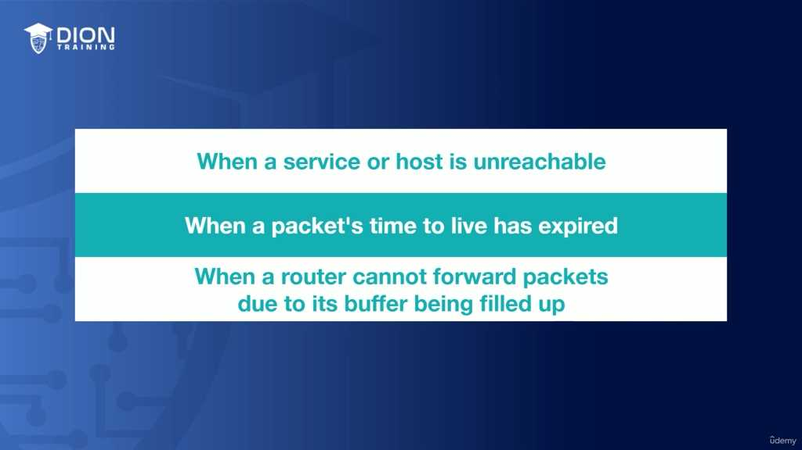

**4. Cơ chế hoạt động của tiện ích PING**
Tiện ích PING là ví dụ kinh điển nhất về ICMP. Quy trình diễn ra như sau:
*   Máy tính A gửi một thông điệp **ICMP Echo Request** (Yêu cầu hồi đáp).
*   Nếu máy tính B hoạt động tốt và cho phép, nó trả lời bằng một **ICMP Echo Reply** (Hồi đáp).
*   **Độ trễ (Latency):** Thời gian tính từ khi gửi Request đến khi nhận được Reply được gọi là RTT (Round-Trip Time). Đây là chỉ số sống còn để kiểm tra chất lượng kết nối mạng mà chúng ta thường thấy khi chơi game hoặc làm việc trực tuyến.

**5. Cấu trúc của một thông điệp ICMP**
Một gói tin ICMP được thiết kế rất tối giản để đảm bảo tốc độ xử lý nhanh chóng, bao gồm 3 trường thông tin chính trong phần đầu (header):
*   **Type (1 byte):** Định danh loại thông điệp (ví dụ: yêu cầu hay hồi đáp, lỗi hay thông báo).
*   **Code (1 byte):** Cung cấp ngữ cảnh chi tiết hơn cho Type. Ví dụ, nếu Type là "Unreachable" (Không thể truy cập), thì Code sẽ giải thích rõ hơn: do không tìm thấy mạng, hay không tìm thấy máy chủ, hay do cổng (port) bị đóng.
*   **Checksum (2 bytes):** Đây là "công cụ kiểm toán". Nó tính toán dữ liệu của header và nội dung để đảm bảo thông tin không bị biến dạng trong quá trình truyền tải. Nếu tổng kiểm tra không khớp, gói tin sẽ bị coi là lỗi và bị hủy bỏ.

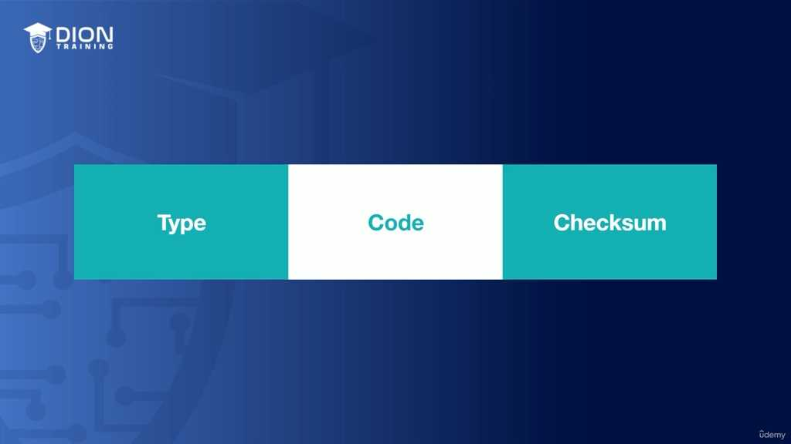

**6. Phần dữ liệu (Data Payload)**
Sau phần header, ICMP chứa dữ liệu bổ sung tùy thuộc vào loại thông điệp. Trong trường hợp PING (Echo), phần dữ liệu này chứa:
*   **Identifier & Sequence Number:** Các con số này giúp máy gửi nhận diện đúng gói tin hồi đáp tương ứng với gói tin đã gửi đi, tránh tình trạng "râu ông nọ cắm cằm bà kia" khi gửi nhiều gói tin cùng lúc.
*   **Optional Data:** Dữ liệu bổ sung tùy chọn giúp cho việc kiểm tra chất lượng đường truyền trở nên chính xác hơn. 

Cần lưu ý rằng, vì tính chất là công cụ chẩn đoán, ICMP không có các cơ chế phức tạp về điều khiển luồng hay bắt tay ba bước như TCP, mục tiêu tối thượng của nó chỉ là: **Đơn giản - Nhanh chóng - Thông tin chính xác.**

### Phân tích bản chất bảo mật và các rủi ro từ ICMP

Khác với TCP vốn chú trọng vào sự tin cậy, ICMP được thiết kế tối giản để tối ưu tốc độ. Sự đánh đổi này dẫn đến việc ICMP hoàn toàn không có cơ chế đảm bảo tính toàn vẹn dữ liệu hay xác thực. Chính sự "cởi mở" này là con dao hai lưỡi, khiến nó trở thành công cụ đắc lực cho những kẻ tấn công mạng.

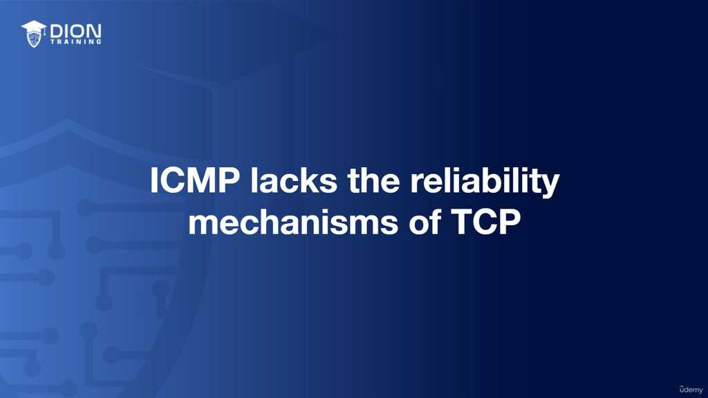

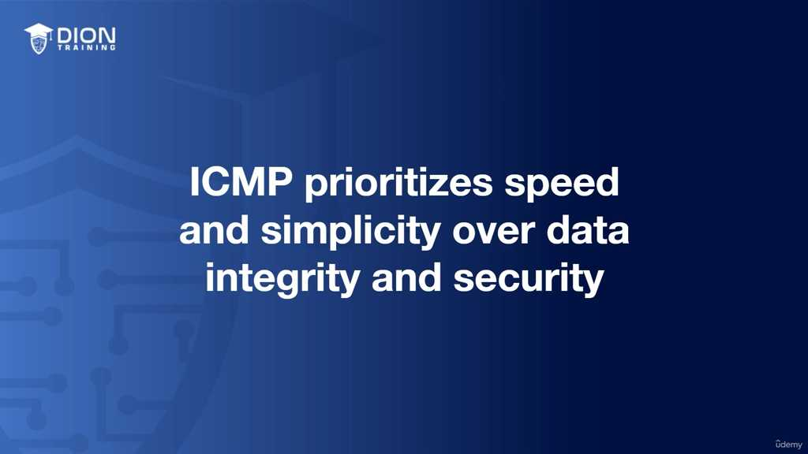

#### 1. Cơ chế của ICMP Flood Attack (Tấn công làm tràn ICMP)

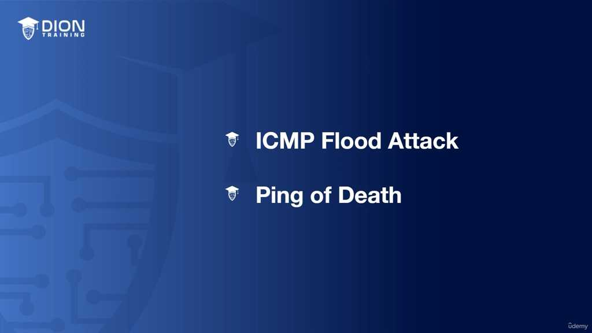

Trong các cuộc tấn công này, hacker sử dụng hàng loạt gói tin "Echo Request" (Ping) gửi đến mục tiêu với cường độ cao và liên tục. 
*   **Mục đích:** Kẻ tấn công không chờ đợi hồi đáp từ phía nạn nhân. Chúng cố tình "bơm" lượng lớn dữ liệu rác để ép hệ thống mục tiêu phải tiêu tốn tài nguyên (CPU, RAM và băng thông) nhằm xử lý các yêu cầu Ping đó.

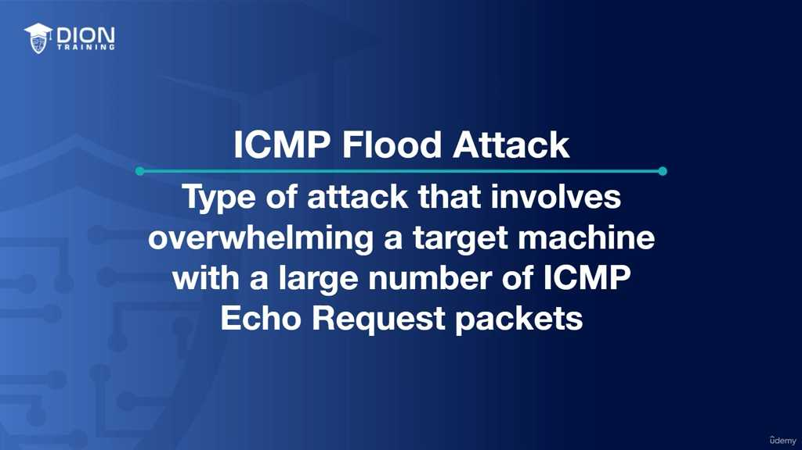

*   **Kết quả:** Khi tài nguyên cạn kiệt, hệ thống sẽ rơi vào trạng thái Denial of Service (DoS) – từ chối phục vụ. Lúc này, dù người dùng hợp lệ có gửi yêu cầu kết nối, máy chủ cũng không còn khả năng xử lý vì đang bận "chống đỡ" cơn lũ ICMP.

> **💡 Ví dụ nhớ đời:** Hãy tưởng tượng một quầy lễ tân khách sạn. Thay vì có khách thật đến check-in, một nhóm người giả danh liên tục chạy vào hỏi: "Anh có phòng không?" ngay khi vừa hỏi xong họ lại tiếp tục hỏi câu đó mà không chờ câu trả lời. Nhân viên lễ tân quá bận rộn trả lời những kẻ phá rối này nên khách hàng thực sự đứng ngoài cửa không thể tiếp cận để đăng ký phòng được nữa. Đó chính là sự quá tải dẫn đến từ chối dịch vụ.

#### 2. Nâng cấp lên quy mô Distributed Denial of Service (DDoS)
Một cuộc tấn công DoS từ một nguồn đơn lẻ rất dễ bị chặn bằng cách lọc địa chỉ IP của kẻ tấn công. Tuy nhiên, hacker đã tinh vi hơn khi sử dụng **botnets** – một mạng lưới các máy tính bị nhiễm mã độc (máy tính "zombie") rải rác trên toàn thế giới.

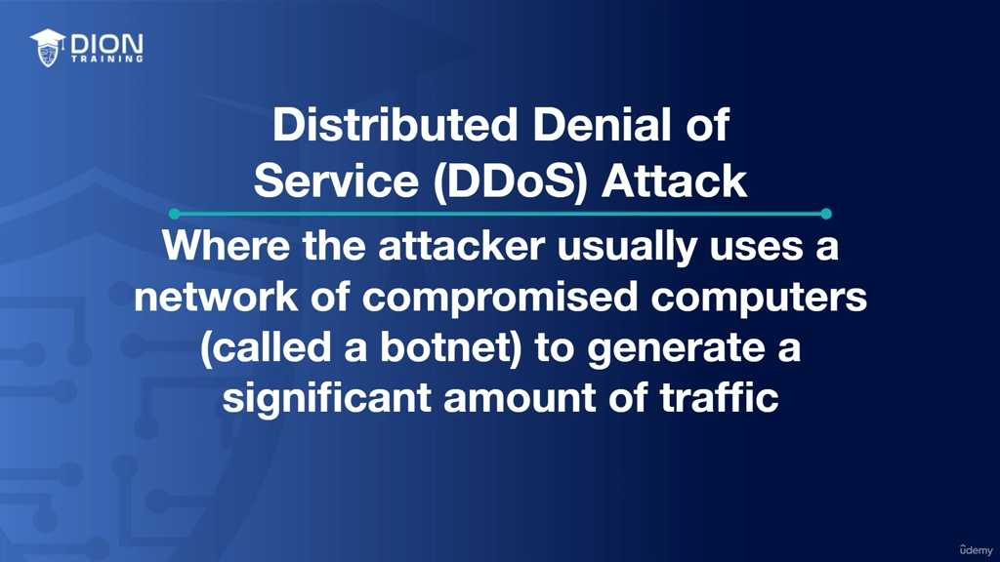

*   **Tại sao lại nguy hiểm:**
    *   **Tính khuếch đại:** Hàng ngàn máy tính cùng lúc tấn công khiến lưu lượng truy cập tăng đột biến, vượt xa ngưỡng chịu đựng của bất kỳ tường lửa hay băng thông thông thường nào.
    *   **Khó truy vết:** Do nguồn tấn công đến từ rất nhiều địa chỉ IP khác nhau và nằm ở nhiều quốc gia, việc cô lập và chặn đứng các nguồn này trở nên cực kỳ phức tạp và mất thời gian.

#### 3. Ping of Death (Cú Ping định mệnh)

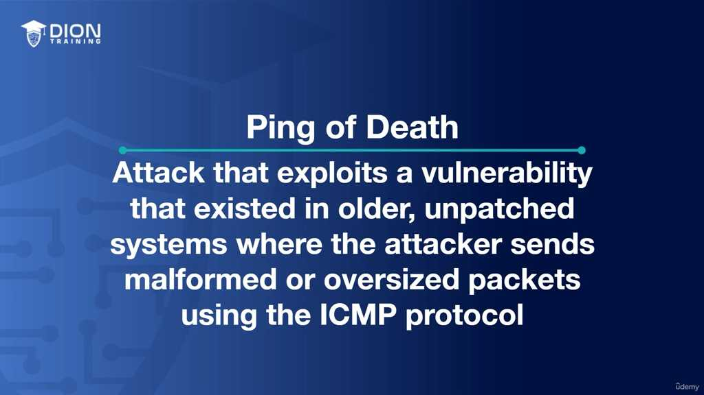

Đây là một kỹ thuật tấn công dựa trên sự khiếm khuyết của các hệ thống cũ. Bản chất của nó nằm ở việc khai thác cách xử lý các gói tin bị phân mảnh (fragmented packets).
*   **Cơ chế:** Giao thức IP có quy định giới hạn kích thước tối đa cho một gói tin (thường là 65,535 bytes). Kẻ tấn công cố tình tạo ra một gói tin ICMP có kích thước vượt quá giới hạn này.

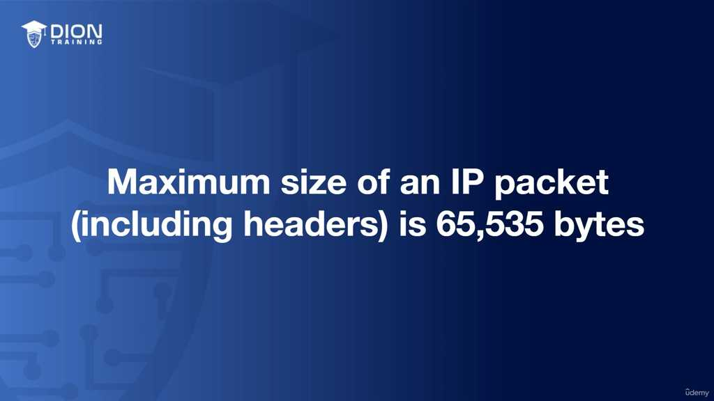

*   **Hậu quả:** Khi hệ thống đời cũ nhận được gói tin "quá khổ" này, nó không biết cách xử lý bộ đệm (buffer) bị tràn hoặc gây ra lỗi logic trong quá trình lắp ghép lại các mảnh gói tin, dẫn đến việc hệ thống bị treo, crash (sập) hoặc khởi động lại. Mặc dù ngày nay hầu hết các hệ điều hành đã được vá lỗi để chống lại kiểu tấn công này, nhưng nó vẫn là bài học kinh điển về việc kiểm tra dữ liệu đầu vào trong mạng máy tính.

#### 4. Sự khác biệt về mục tiêu
*   **ICMP Flood:** Tấn công dựa trên **số lượng** (làm cạn kiệt tài nguyên hệ thống bằng sự quá tải).
*   **Ping of Death:** Tấn công dựa trên **cấu trúc** (gửi gói tin sai quy chuẩn để gây lỗi phần mềm hệ thống).

Cả hai kỹ thuật này đều minh chứng cho thấy: vì ICMP được thiết kế cho mục đích chẩn đoán (diagnostics) chứ không phải để truyền tải dữ liệu người dùng hay xác thực, nên nó thiếu hoàn toàn các hàng rào bảo mật cần thiết. Việc sử dụng nó cho các mục đích sai lệch là một trong những minh chứng rõ nét nhất về lỗ hổng bảo mật trong thiết kế giao thức mạng nguyên bản.

Cơ chế hoạt động cụ thể của **Ping of Death** nằm ở sự bất đối xứng giữa kích thước packet thực tế và giới hạn xử lý của hệ thống cũ. Theo tiêu chuẩn IP, kích thước tối đa của một gói tin là 65.535 bytes. Khi kẻ tấn công cố tình tạo ra một gói tin ICMP vượt quá con số này, hệ thống nạn nhân – trong quá trình cố gắng thực hiện phân mảnh (fragmentation) và lắp ghép lại các mảnh gói tin đó – sẽ gặp phải lỗi tràn bộ đệm (buffer overflow). Hiện tượng này giống như việc bạn cố nhồi nhét một khối lượng hành lý khổng lồ vào một chiếc vali nhỏ; chiếc vali không chỉ không đóng được mà còn bị bung khóa hoặc rách toạc. Sự quá tải này dẫn đến việc hệ thống bị treo, crash hoặc hành xử không thể kiểm soát, gây ra tình trạng Denial of Service (DoS).

Mặc dù Ping of Death là một kỹ thuật cũ, nhưng nó đóng vai trò quan trọng trong lịch sử bảo mật mạng. Tin tốt là các hệ điều hành hiện đại và thiết bị mạng ngày nay đã được vá lỗi và nâng cấp để tự động loại bỏ hoặc từ chối các gói tin có kích thước bất thường ngay từ tầng nhận. Vì vậy, khả năng bị tấn công bởi phương thức này trên hạ tầng hiện đại gần như bằng không, nhưng việc hiểu rõ nó giúp người làm kỹ thuật nhận diện được lỗ hổng logic mà các cuộc tấn công dựa trên giao thức ICMP có thể khai thác.

Hệ quả từ việc ICMP thường xuyên bị lạm dụng đã dẫn đến một thực trạng phổ biến trong quản trị mạng: **Chặn ICMP tại tường lửa (Firewall) và Router**. Các quản trị viên chọn cách "hardened" (củng cố) mạng bằng việc thiết lập quy tắc Drop toàn bộ traffic ICMP đi qua biên giới mạng.

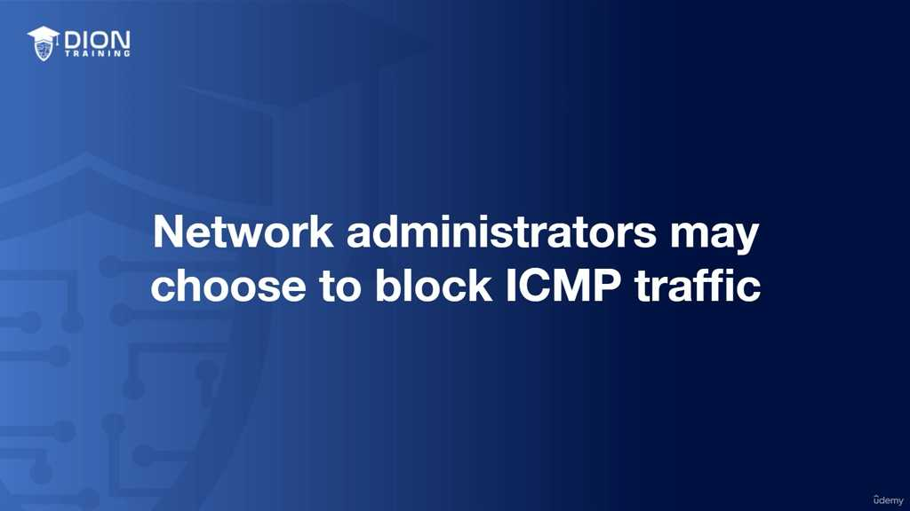

> **💡 Ví dụ nhớ đời:** Hãy tưởng tượng ICMP giống như một chiếc "đèn hiệu báo lỗi" trên bảng điều khiển xe ô tô. Nó giúp bạn biết động cơ có vấn đề hay dầu cạn. Việc chặn ICMP cũng giống như việc bạn dán băng dính đen che kín đèn báo lỗi đó để không bị làm phiền. Mạng có thể trông rất sạch sẽ và bảo mật, nhưng khi xe thực sự hỏng (mạng mất kết nối), bạn sẽ không thể biết được nó hỏng ở đâu, hỏng như thế nào vì tín hiệu cảnh báo đã bị bạn chủ động cắt đứt.

Việc chặn ICMP mang lại hai mặt đối lập:
1. **Ưu điểm:** Giảm thiểu sự lộ diện của mạng trước các công cụ dò quét (reconnaissance) của kẻ tấn công, khiến chúng khó xác định cấu trúc mạng hoặc vị trí thiết bị.
2. **Nhược điểm (Đánh đổi):** Khả năng chẩn đoán lỗi bị tê liệt. Các lệnh như `ping` (để kiểm tra xem máy chủ còn sống hay không) và `traceroute` (để theo dõi đường đi của gói tin) sẽ trở nên vô dụng. Khi bạn thực hiện `ping` đến một host, thay vì nhận được phản hồi ICMP Echo Reply, tường lửa sẽ trả về thông báo lỗi hoặc đơn giản là "im lặng" (drop), dẫn đến kết quả trả về là "Host Unreachable" ngay cả khi host đó vẫn đang hoạt động hoàn hảo.

Cuối cùng, đoạn transcript nhấn mạnh lại bản chất cốt lõi của **Internet Control Message Protocol (ICMP)**:
- **Nó không phải là giao thức truyền tải (Transport Protocol):** Nó không có tính năng đảm bảo phân phối như TCP hay tốc độ tối ưu hóa như UDP. 
- **Nó là công cụ hỗ trợ:** ICMP đóng vai trò là "cảnh sát giao thông" và "đội ngũ sửa chữa", chuyên cung cấp các thông tin chẩn đoán (diagnostic) và báo cáo lỗi.
- **Tính đóng gói:** ICMP không đứng độc lập mà nằm bên trong các gói tin IP (encapsulated).

Tóm lại, mặc dù ICMP là "cánh tay phải" trong công tác vận hành và xử lý sự cố mạng, nhưng do các điểm yếu cố hữu (không xác thực, không bảo mật), nó đã trở thành công cụ đắc lực cho những kẻ tấn công (thông qua ICMP Flood hoặc Ping of Death). Việc giữ cân bằng giữa khả năng chẩn đoán sự cố và bảo mật mạng là một bài toán cân não mà mọi quản trị viên phải đối mặt khi quyết định có cho phép lưu thông ICMP hay không.

---

## 🎯 Bí Kíp Ôn Thi Tốc Độ: ICMP (Internet Control Message Protocol)

**1. Bản chất & Vị trí**
*   **Vai trò:** Chẩn đoán lỗi, báo cáo trạng thái mạng, kiểm tra kết nối.
*   **KHÔNG** dùng truyền tải dữ liệu người dùng (khác với TCP/UDP).
*   **Tầng OSI:** Network Layer (Tầng mạng).
*   **Đóng gói:** Nằm trong gói tin IP.
*   **Tính chất:** Tốc độ cao, đơn giản, **không** đảm bảo độ tin cậy (no error correction, no ordering).

**2. Cấu trúc Header (Gồm 3 phần)**
*   **Type (1 byte):** Loại thông báo.
*   **Code (1 byte):** Chi tiết ngữ cảnh của Type.
*   **Checksum (2 byte):** Kiểm tra lỗi header và dữ liệu.

**3. Tiện ích thực tế**
*   **PING:** Dùng *Echo Request* (gửi đi) và *Echo Reply* (nhận lại).
*   **Chức năng:** Kiểm tra reachability (khả năng kết nối) và Latency (độ trễ).
*   **Công cụ khác:** *Traceroute*.

**4. Các loại tấn công (Vulnerability)**
*   **ICMP Flood Attack:** Gửi ồ ạt Echo Request làm cạn kiệt tài nguyên -> **DoS/DDoS**.
*   **Ping of Death:** Gửi gói tin vượt kích thước cho phép (65,535 bytes) gây tràn bộ đệm, crash hệ thống.
*   **Lưu ý:** Hiện nay đa số hệ thống hiện đại đã "miễn nhiễm" với Ping of Death.

**5. Mẹo ghi nhớ cho Admin**
*   **Chặn ICMP:** Tăng cường bảo mật (tránh tấn công) nhưng **gây khó khăn** khi troubleshooting (ping/traceroute không phản hồi).
*   **Nguyên tắc vàng:** ICMP = **Diagnostic/Reporting Tool**, không phải Transport Protocol.

---
**💡 Cần nhớ nhanh:**
*   ICMP = **Bác sĩ của mạng** (chẩn đoán).
*   TCP/UDP = **Người vận chuyển hàng** (truyền dữ liệu).
*   Đừng nhầm lẫn: ICMP nằm **TRONG** IP packet.

---
*Ghi chú: 12 hình ảnh minh họa (.jpg) đã được tải về và lưu tự động vào thư mục con `image/` cùng cấp với file này. Để ảnh hiển thị tự động, hãy đảm bảo bạn sao chép cả thư mục `image/` nếu bạn muốn di chuyển file markdown sang nơi khác!*
