# Web Ports and Protocols

### Phân tích chuyên sâu về Cổng (Ports) và Giao thức (Protocols) trong Web

#### 1. Định nghĩa nền tảng: Cổng và Giao thức là gì?
Transcript bắt đầu bằng việc xác định **cổng (ports)** và **giao thức (protocols)** như là những "quy tắc tiêu chuẩn" và "cổng vào số hóa". Để hiểu điều này, hãy tưởng tượng Internet là một tòa nhà chọc trời khổng lồ chứa hàng tỷ văn phòng (máy chủ).
*   **Giao thức:** Là ngôn ngữ mà người gửi và người nhận đồng ý sử dụng để hiểu nhau (ví dụ: tiếng Anh, tiếng Việt, mã Morse). Nếu không có giao thức, dữ liệu gửi đi chỉ là một mớ hỗn độn không có ý nghĩa.
*   **Cổng (Port):** Là các "cửa số" trên máy chủ. Mỗi cổng được đánh số (từ 0 đến 65535). Khi dữ liệu đến một máy chủ, máy tính cần biết dữ liệu đó thuộc về dịch vụ nào (web, email, truyền file). Cổng đóng vai trò là bảng chỉ dẫn để đưa dữ liệu đúng đến dịch vụ đó.

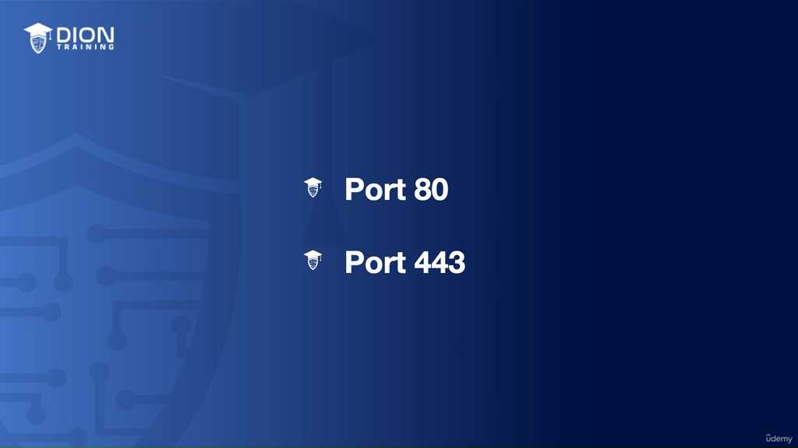

> **💡 Ví dụ nhớ đời:** Hãy hình dung máy chủ là một khách sạn lớn. "Địa chỉ IP" là số nhà của khách sạn, còn "Số cổng (Port)" là số phòng cụ thể. Khi bạn đặt đồ ăn, người giao hàng (gói tin dữ liệu) cần biết số phòng (Port) để đưa đúng món đến tay khách, thay vì ném vào sảnh chung.

#### 2. Vai trò của Cổng 80 và 443
Đoạn transcript nhấn mạnh vào hai "cánh cửa" quan trọng nhất của thế giới web: Cổng 80 và Cổng 443. Đây là những "đường cao tốc" chính nơi phần lớn lưu lượng truy cập web diễn ra. Sự phân biệt giữa hai cổng này không chỉ nằm ở con số, mà ở bản chất của "luật lệ giao thông" (giao thức) đi qua chúng.

#### 3. Phân tích chuyên sâu về HTTP và Cổng 80

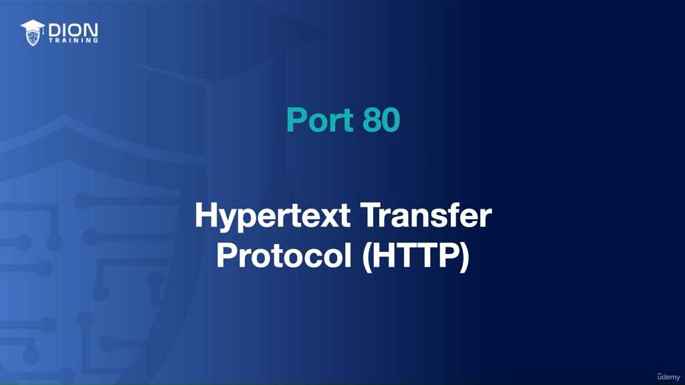

**HTTP (Hypertext Transfer Protocol)** là nền tảng của World Wide Web. Nó hoạt động theo mô hình **Client-Server (Máy khách - Máy chủ)**:
*   **Client (Trình duyệt):** Gửi yêu cầu (Request) dưới dạng văn bản thuần túy.
*   **Server (Máy chủ):** Nhận yêu cầu và phản hồi (Response) cũng bằng văn bản thuần túy, bao gồm mã HTML, hình ảnh hoặc các tài nguyên media.

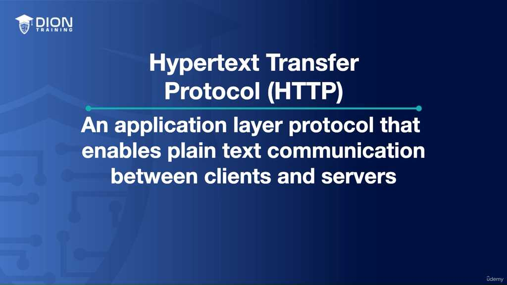

Khi bạn nhập `diontraining.com` mà không chỉ định cổng, trình duyệt tự động gán cổng 80. Đây là mặc định kỹ thuật giúp người dùng không cần phải ghi nhớ các con số phức tạp.

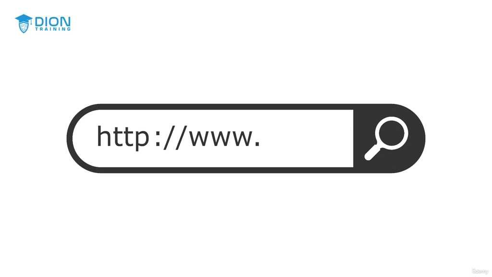

> **💡 Ví dụ nhớ đời:** HTTP giống như việc bạn gửi một tấm bưu thiếp qua bưu điện. Bạn viết nội dung lên mặt sau tấm thiếp và bất kỳ ai (nhân viên bưu điện, người phát thư) cũng có thể đọc được nội dung đó. Không có phong bì, không có sự bảo mật, mọi thông tin đều "phơi bày" ra ngoài.

#### 4. "Gót chân Achilles" của HTTP: Thiếu tính bảo mật
Đoạn transcript chỉ ra một lỗ hổng nghiêm trọng của HTTP trên cổng 80: **Dữ liệu được gửi ở dạng văn bản thuần túy (Plain text) và không được mã hóa.**

Trong môi trường mạng, dữ liệu không đi thẳng từ máy bạn đến máy chủ mà phải qua rất nhiều "trạm trung chuyển" (router, switch, mạng Wi-Fi công cộng). Nếu dữ liệu không được mã hóa, bất kỳ ai có ý đồ xấu ngồi trên cùng mạng lưới đều có thể thực hiện:
*   **Eavesdropping (Nghe lén):** "Nhìn trộm" gói tin khi nó đi ngang qua.
*   **On-path attack (Tấn công trung gian):** Kẻ tấn công đứng giữa luồng truyền tin để đọc hoặc thậm chí thay đổi nội dung dữ liệu trước khi nó đến đích.

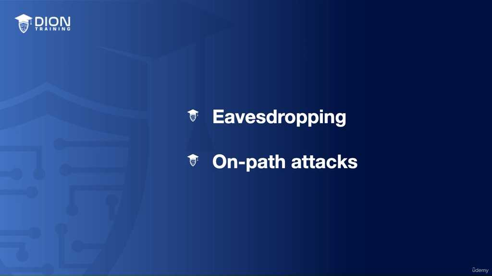

Điều này tạo ra rủi ro cực lớn đối với các dữ liệu nhạy cảm như mật khẩu, thông tin thẻ tín dụng, hoặc dữ liệu cá nhân. Khi bạn nhập thông tin này trên một trang web HTTP, nó cũng giống như việc bạn viết mật khẩu ngân hàng lên một tờ giấy trắng và nhờ người lạ chuyển hộ qua đám đông.

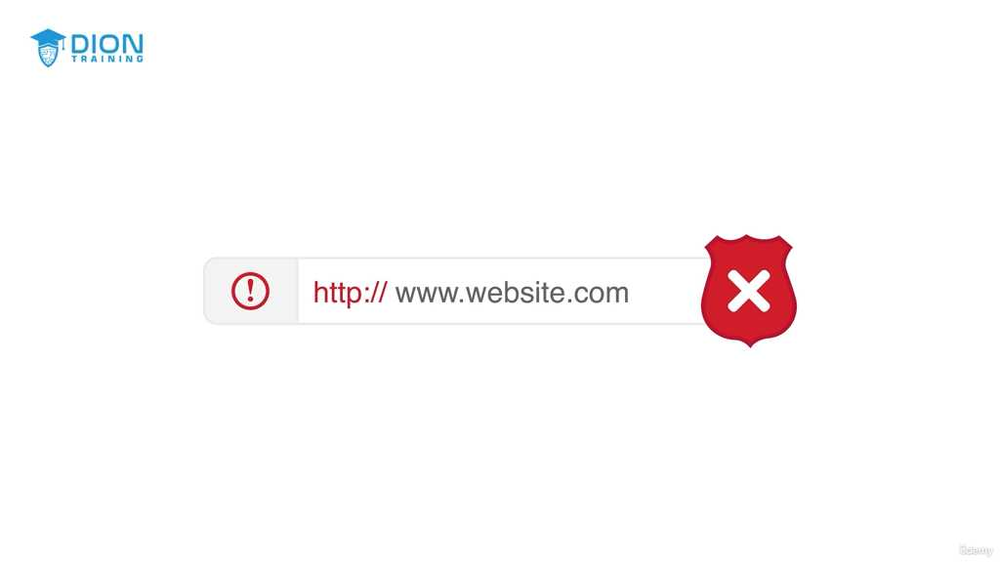

#### 5. Kết luận phần 1
Đoạn transcript kết thúc bằng lời cảnh báo đanh thép: "Bạn không bao giờ nên nhập thông tin nhạy cảm trên HTTP". Đây là bài học vỡ lòng trong an toàn thông tin: Cổng 80/HTTP chỉ dành cho việc đọc nội dung công khai (như báo chí, tin tức), còn đối với bất cứ thứ gì yêu cầu sự riêng tư, chúng ta cần một giải pháp khác – đó chính là "người anh em" bảo mật hơn của HTTP, sẽ được thảo luận ở phần tiếp theo.

Cơ chế bảo mật trên web xoay quanh việc nâng cấp từ giao thức HTTP (cổng 80) sang HTTPS (cổng 443). Đây là sự chuyển dịch từ môi trường "mở" sang môi trường "được mã hóa".

**1. Bản chất của HTTPS và Cổng 443**
HTTPS (Hypertext Transfer Protocol Secure) không phải là một giao thức hoàn toàn mới tách biệt với HTTP. Thực chất, nó là HTTP nhưng được bọc thêm một lớp vỏ bảo vệ. Nếu HTTP là việc gửi thư bằng phong bì trong suốt, thì HTTPS là việc cho phong bì đó vào một két sắt kiên cố trước khi chuyển đi. Cổng 443 chính là "cửa ngõ" dành riêng cho loại dữ liệu đã được đóng gói an toàn này.

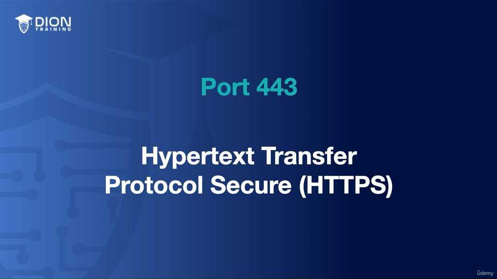

**2. Vai trò của SSL và TLS (Đường hầm mã hóa)**
Để biến dữ liệu từ dạng văn bản thuần (plain text) thành dạng không thể đọc được bởi kẻ tấn công, HTTPS sử dụng các "đường hầm":
*   **SSL (Secure Sockets Layer):** Công nghệ tiền thân, thiết lập nền móng cho việc mã hóa dữ liệu giữa trình duyệt và máy chủ.
*   **TLS (Transport Layer Security):** Đây là phiên bản kế thừa, hiện đại và mạnh mẽ hơn của SSL.

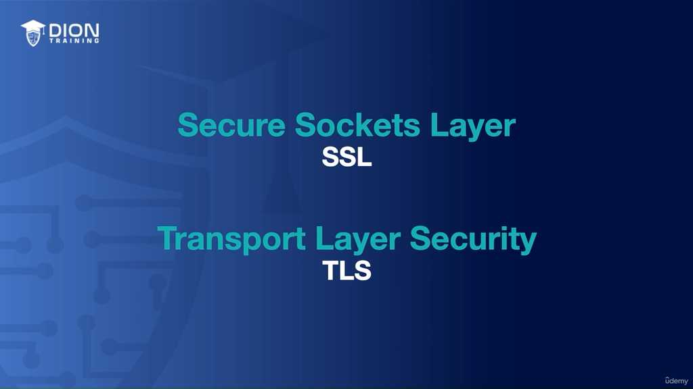

Cả hai đóng vai trò như một đường hầm riêng tư: dữ liệu được mã hóa tại điểm gửi (trình duyệt) và chỉ có thể được giải mã (đọc được) khi nó đến đúng đích (máy chủ). Điều này ngăn chặn hoàn toàn việc "nghe lén" hay can thiệp nội dung trên đường truyền.

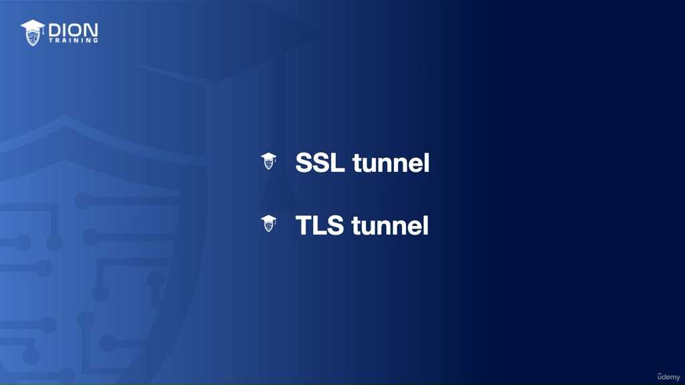

> **💡 Ví dụ nhớ đời:** Hãy tưởng tượng bạn đang gửi một bức thư tình (dữ liệu). Với HTTP, bạn viết trực tiếp lên tấm bảng và giơ lên cao cho cả phố xem. Với HTTPS, bạn đưa bức thư vào một chiếc hộp khóa bằng mật mã (TLS/SSL). Những người đứng dọc đường (hacker) chỉ nhìn thấy chiếc hộp sắt, họ không thể biết bên trong viết gì, và chỉ người nhận có chìa khóa mới mở được.

**3. Dấu hiệu nhận biết sự an toàn**
Trình duyệt đóng vai trò là "người bảo vệ" thông báo cho bạn tình trạng bảo mật thông qua:
*   **URL:** Tiền tố `https://` thay vì `http://`.
*   **Biểu tượng ổ khóa:** Thông báo trực quan rằng kết nối đang sử dụng cổng 443 và đã được xác thực mã hóa. Khi bạn nhìn thấy những dấu hiệu này, trình duyệt đang đảm bảo rằng luồng dữ liệu của bạn không bị sửa đổi hay đánh cắp bởi bất kỳ bên thứ ba nào.

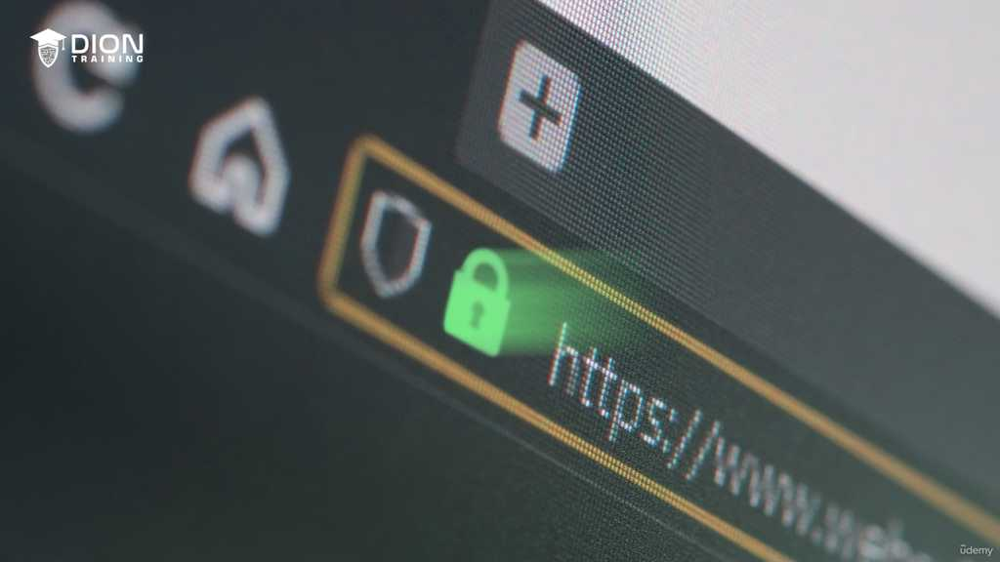

**4. Tại sao HTTPS là bắt buộc đối với dữ liệu nhạy cảm?**
Đối với các lĩnh vực như ngân hàng, thương mại điện tử hoặc bất kỳ trang web nào yêu cầu đăng nhập, việc sử dụng HTTPS không còn là tùy chọn mà là tiêu chuẩn đạo đức và kỹ thuật tối thiểu. Nếu không có HTTPS, mỗi lần bạn gõ mật khẩu, thông tin đó sẽ bay trên không trung dưới dạng chữ thô, cho phép bất kỳ ai kết nối chung mạng Wi-Fi cũng có thể nhìn thấy tài khoản của bạn.

**5. Cơ chế "Tự động chuyển hướng" (Automatic Redirection)**
Đây là giải pháp thông minh của quản trị viên web để bảo vệ người dùng thiếu kinh nghiệm. Thay vì để người dùng vô tình truy cập qua cổng 80 (kênh không an toàn), máy chủ sẽ thực hiện một "lệnh điều hướng":

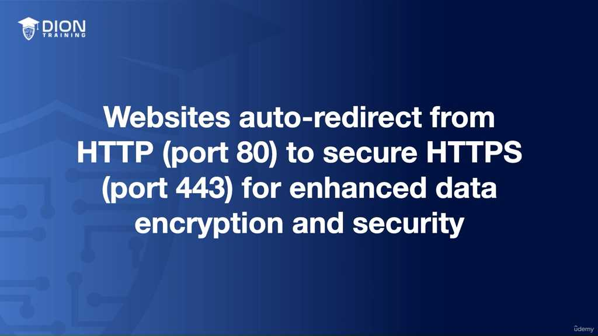

*   Khi bạn gõ `http://diontraining.com`, máy chủ không từ chối phục vụ ngay lập tức.
*   Nó sẽ trả về một thông báo yêu cầu trình duyệt của bạn: "Bạn cần chuyển hướng ngay sang cổng 443 (phiên bản HTTPS)".
*   Trình duyệt tự động mở lại kết nối tới cổng 443.

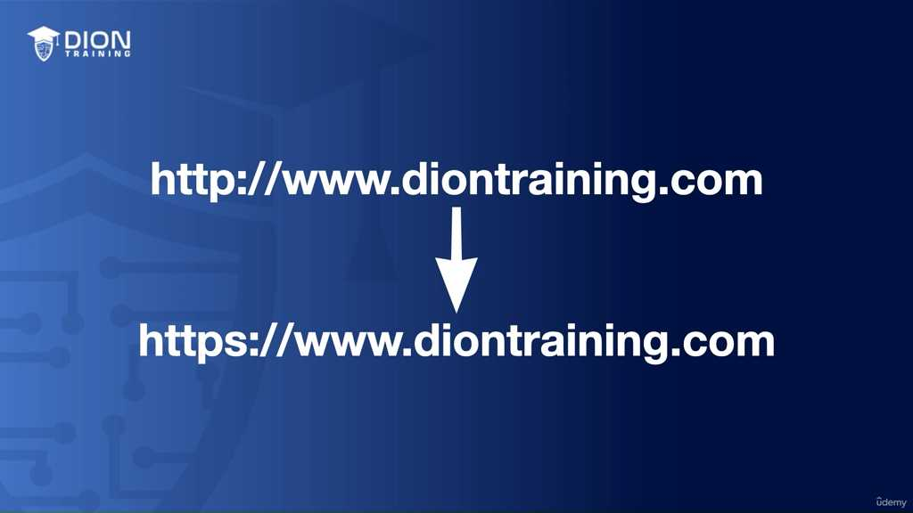

Điều này tạo ra một "tấm lưới an toàn", đảm bảo rằng dù người dùng có chủ quan hay không biết về bảo mật, họ vẫn luôn được đưa vào môi trường được mã hóa nếu trang web đó có chứa các thông tin cá nhân hoặc form đăng nhập.

Đi sâu vào sự khác biệt chiến lược giữa giao thức HTTP (cổng 80) và HTTPS (cổng 443), chúng ta cần phân tích qua ba trụ cột then chốt: Bảo mật, Sự chuyển dịch lịch sử trong cách dùng, và tầm ảnh hưởng đến SEO cũng như niềm tin của người dùng.

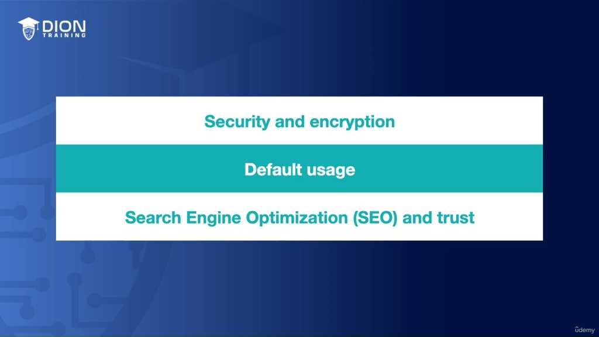

### 1. Phân tích Security & Encryption (Bảo mật & Mã hóa)
Trong khi phần trước đã định nghĩa HTTPS sử dụng SSL/TLS, phần này nhấn mạnh vào bản chất của "lỗ hổng" trên cổng 80: **Dữ liệu thuần văn bản (plain text)**.

*   **Bản chất của cổng 80:** Mọi luồng dữ liệu (traffic) di chuyển qua cổng 80 không hề có lớp bảo vệ. Nếu một kẻ tấn công thực hiện kỹ thuật "eavesdropping" (nghe lén), chúng không cần giải mã gì cả vì thông tin bạn gửi đi (mật khẩu, thông tin cá nhân) giống như một bức thư gửi bằng phong bì trong suốt.
*   **Sự khác biệt của cổng 443:** Cổng 443 đóng vai trò là "kênh đào" an toàn. Khi dữ liệu đi qua đây, nó được bọc trong một lớp giáp mã hóa SSL/TLS. Ngay cả khi bị chặn đứng giữa chừng, kẻ tấn công cũng chỉ nhận được một chuỗi ký tự hỗn loạn không có ý nghĩa, thay vì thông tin nhạy cảm của bạn.

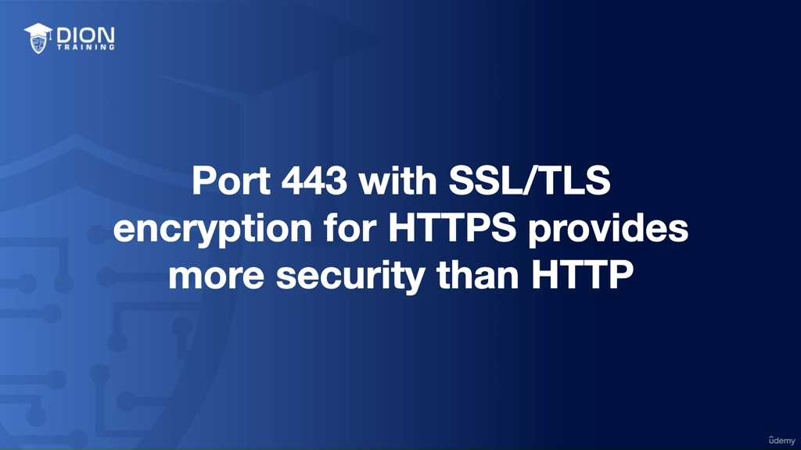

> **💡 Ví dụ nhớ đời:** Hãy tưởng tượng HTTP (cổng 80) là việc bạn gửi một tấm bưu thiếp qua đường bưu điện mà bất cứ ai từ người giao thư đến người hàng xóm đều có thể đọc được nội dung. Còn HTTPS (cổng 443) chính là việc bạn đặt lá thư đó vào một chiếc két sắt có mã khóa, chỉ có người nhận cuối cùng mới có chìa để mở ra.

### 2. Sự chuyển dịch trong Default Usage (Cách sử dụng mặc định)
Lịch sử phát triển của web cho thấy một sự thay đổi tư duy mạnh mẽ từ việc ưu tiên tốc độ (khi web mới sơ khai) sang ưu tiên sự an toàn:

*   **Thời kỳ sơ khai (1991):** Cổng 80 là chuẩn mực duy nhất. Vào thời điểm đó, internet chủ yếu là để đọc dữ liệu tĩnh, ít tương tác cá nhân, nên việc không mã hóa không phải là mối nguy quá lớn.
*   **Sự trỗi dậy của cổng 443 (1994 - nay):** Dù ra đời từ 1994, phải mất gần 30 năm để cổng 443 trở thành "mặc định thực tế". Ngày nay, hơn 95% lưu lượng truy cập web đã chuyển sang HTTPS. Đây không còn là một lựa chọn "có thì tốt" mà là một tiêu chuẩn bắt buộc của các trình duyệt hiện đại. Nếu bạn cố truy cập một trang web không có HTTPS, trình duyệt thậm chí sẽ hiển thị cảnh báo đỏ rực để chặn người dùng lại.

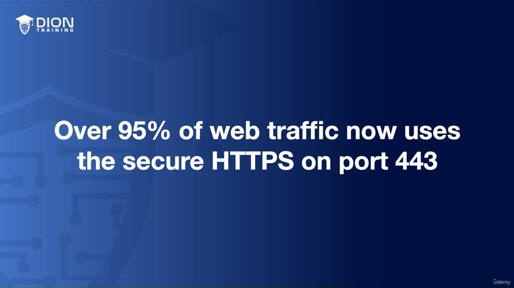

### 3. Tác động đến SEO và lòng tin (Trust)
Đây là khía cạnh ít người để ý nhưng lại có tính thương mại cao nhất: **Thuật toán của các công cụ tìm kiếm (như Google).**

*   **SEO (Search Engine Optimization):** Công cụ tìm kiếm coi sự an toàn của người dùng là ưu tiên hàng đầu. Nếu website của bạn chạy trên cổng 443, thuật toán sẽ "ưu ái" xếp hạng trang của bạn cao hơn trong kết quả tìm kiếm. Điều này tạo ra một vòng lặp tích cực: HTTPS → được Google ưu tiên → thứ hạng cao hơn → nhiều người dùng hơn → người dùng tin tưởng hơn → thuật toán lại tiếp tục ưu tiên.
*   **Tâm lý khách hàng:** Sự xuất hiện của HTTPS tạo ra "lòng tin vô hình". Một website sử dụng cổng 443 không chỉ bảo vệ dữ liệu mà còn phát tín hiệu với người dùng rằng: "Chúng tôi là một tổ chức chuyên nghiệp, quan tâm đến an toàn của bạn". Ngược lại, nếu một trang web thiếu HTTPS, nó sẽ bị gắn nhãn "Not Secure", khiến tỷ lệ người dùng rời bỏ (bounce rate) tăng vọt.

**Tổng kết sự khác biệt kỹ thuật:**
*   **Cổng 80 (HTTP):** Truyền tải dữ liệu dạng thô, dễ bị can thiệp, không được công cụ tìm kiếm ưu tiên, phù hợp với các trang web nội dung tĩnh không có thông tin người dùng.
*   **Cổng 443 (HTTPS):** Truyền tải dữ liệu được mã hóa, bảo mật cao, là "tiêu chuẩn vàng" cho mọi trang web hiện đại, được các thuật toán tìm kiếm xếp hạng cao hơn và là yếu tố sống còn để xây dựng uy tín cho bất kỳ nền tảng thương mại trực tuyến nào.

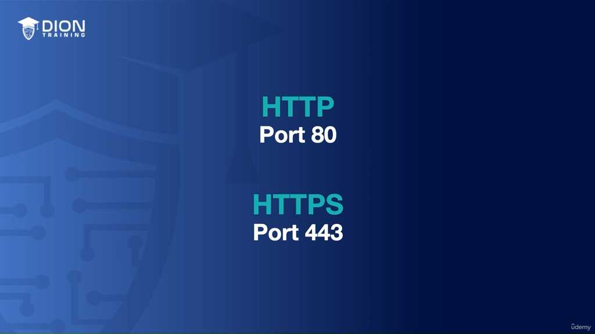

Dựa trên nội dung còn lại của đoạn transcript: "...its data before it's being transmitted between the server and the client."

### Phân tích cơ chế "Mã hóa trước khi truyền tải"

Trong phần cuối này, bài học chốt lại bản chất cốt lõi của HTTPS bằng cách nhấn mạnh vào thời điểm dữ liệu được xử lý. Cụm từ *"before it's being transmitted"* chính là chìa khóa vàng trong bảo mật mạng.

Việc mã hóa không phải là một quá trình xảy ra ngẫu nhiên hay xảy ra tại đích đến, mà nó là một **bước tiền xử lý bắt buộc**. Khi bạn nhấn nút "Gửi" hoặc thực hiện một yêu cầu truy cập, trình duyệt (client) sẽ không gửi ngay dữ liệu thô đi qua môi trường mạng đầy rẫy rủi ro. Thay vào đó, nó thực hiện một thao tác trung gian: đóng gói và biến đổi thông tin bằng các thuật toán SSL/TLS ngay tại thiết bị của bạn.

> **💡 Ví dụ nhớ đời:** Hãy tưởng tượng bạn muốn gửi một lá thư chứa thông tin bí mật qua đường bưu điện (môi trường mạng). Nếu bạn gửi lá thư đó mà không bỏ vào phong bì (HTTP), bất kỳ ai từ nhân viên phân loại đến người giao hàng đều có thể đọc được nội dung. HTTPS giống như việc bạn đặt lá thư đó vào một chiếc két sắt mã hóa ngay tại nhà trước khi đưa cho nhân viên bưu điện. Ngay cả khi chiếc két sắt bị đánh cắp trên đường đi (bị chặn dữ liệu), kẻ gian cũng không thể mở được vì chúng không có chìa khóa giải mã – chìa khóa đó chỉ tồn tại ở phía người nhận (server).

### Tại sao thời điểm "trước khi truyền tải" lại quan trọng?

Dữ liệu khi di chuyển giữa Client (trình duyệt của bạn) và Server (máy chủ lưu trữ) phải đi qua rất nhiều "trạm trung chuyển" như bộ định tuyến (router) của quán cà phê, ISP (nhà cung cấp dịch vụ Internet), và các nút mạng quốc tế. 

Nếu quá trình mã hóa không diễn ra **trước** khi dữ liệu rời khỏi thiết bị, các "kẻ nghe lén" trên đường truyền sẽ có cơ hội bắt lấy các gói tin ở dạng văn bản thuần (plain text). 

1. **Tính vẹn toàn của dữ liệu:** Khi dữ liệu được mã hóa trước khi truyền, nếu một kẻ tấn công cố gắng thay đổi nội dung gói tin trên đường đi, phía Server sẽ phát hiện ra ngay lập tức vì cấu trúc mã hóa đã bị xáo trộn và không khớp với thông tin ban đầu.
2. **Loại bỏ rủi ro "Man-in-the-Middle" (Người đứng giữa):** Bằng việc nhấn mạnh vào việc mã hóa *trước* khi truyền, bài học khẳng định rằng môi trường mạng công cộng là một môi trường không đáng tin cậy. Dữ liệu phải được biến đổi thành dạng "vô nghĩa" đối với mọi thực thể trung gian, chỉ có Server mới là đối tượng duy nhất có khả năng dịch ngược lại thành thông tin có nghĩa (dữ liệu ban đầu).

Tóm lại, chuỗi hành động được mô tả trong đoạn cuối này là lời giải thích hoàn hảo cho câu hỏi tại sao HTTPS lại an toàn hơn: Đó là vì nó thiết lập một "bức màn bí mật" ngay từ điểm khởi đầu của hành trình dữ liệu, đảm bảo rằng thông tin chỉ tồn tại ở dạng mã hóa trong suốt quá trình di chuyển trên mạng.

---

## 🎯 Bí Kíp Ôn Thi Tốc Độ

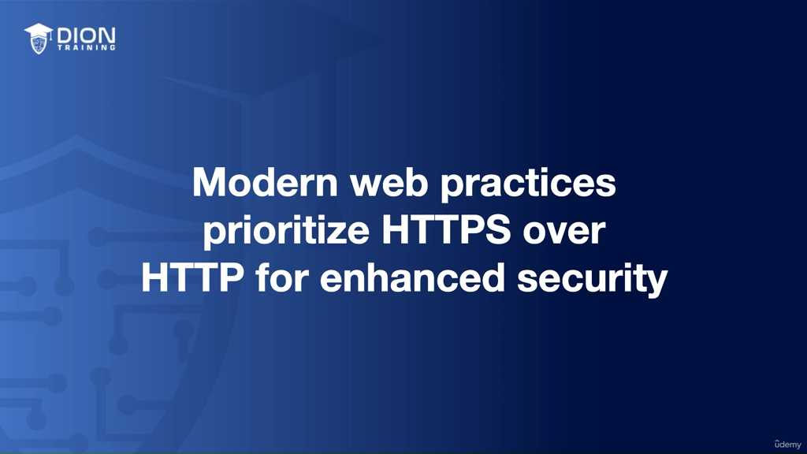

**1. Khái niệm cốt lõi:**
*   **Port (Cổng):** Cổng giao tiếp số giúp phân loại luồng dữ liệu và dịch vụ trên mạng.
*   **Giao thức:** Bộ quy tắc chuẩn hóa truyền tải dữ liệu trên Web.

**2. Bảng so sánh nhanh:**

| Đặc điểm | Port 80 | Port 443 |
| :--- | :--- | :--- |
| **Giao thức** | **HTTP** (Hypertext Transfer Protocol) | **HTTPS** (HTTP Secure) |
| **Bảo mật** | **Không** (Plain text) | **Có** (Mã hóa) |
| **Công nghệ** | N/A | **SSL / TLS** (Tạo đường hầm bảo mật) |
| **Độ tin cậy** | Thấp | **Cao** |
| **SEO/Xếp hạng** | Thấp | **Cao** |

**3. Kiến thức trọng tâm cần nhớ:**
*   **HTTP (Port 80):**
    *   Dữ liệu truyền dạng văn bản thuần (**Plain text**).
    *   Dễ bị tấn công (**Eavesdropping/On-path attack**).
    *   **Cảnh báo:** Tuyệt đối không nhập thông tin nhạy cảm (mật khẩu, thẻ tín dụng) trên kết nối HTTP.
*   **HTTPS (Port 443):**
    *   Sử dụng **SSL/TLS** để mã hóa dữ liệu.
    *   Nhận diện qua: URL có `https://` hoặc biểu tượng **ổ khóa xanh**.
    *   Cơ chế: Tự động chuyển hướng (Redirect) từ HTTP sang HTTPS.
    *   **Ứng dụng:** Thương mại điện tử, ngân hàng, trang đăng nhập.

**4. Mẹo ghi nhớ nhanh:**
*   **80 = Plain = Không bảo mật.**
*   **443 = Secure (S) = HTTPS = Mã hóa.**
*   **HTTPS** tốt cho cả **Người dùng** (an toàn) và **SEO** (được ưu tiên thứ hạng).

---
*Ghi chú: 17 hình ảnh minh họa (.jpg) đã được tải về và lưu tự động vào thư mục con `image/` cùng cấp với file này. Để ảnh hiển thị tự động, hãy đảm bảo bạn sao chép cả thư mục `image/` nếu bạn muốn di chuyển file markdown sang nơi khác!*
