# Email Protocols and Ports

### 1. Định nghĩa về Email Ports và Protocols
Email không tự nhiên xuất hiện trong hộp thư đến của bạn; nó tuân theo các quy tắc khắt khe. "Protocols" (giao thức) đóng vai trò như một bộ ngôn ngữ chung (ví dụ: tiếng Anh chuẩn quốc tế), còn "Ports" (cổng) giống như các số hiệu cửa phòng trong một tòa nhà khổng lồ. Nếu bạn muốn gửi thư (tài liệu), bạn phải đưa nó qua đúng "cửa" (port) mà người nhận đang chờ đợi. Nếu không có các cổng và giao thức này, việc trao đổi email toàn cầu sẽ trở thành một đống hỗn độn, không có quy trình và không có định hướng.

### 2. Ba trụ cột của Email: SMTP, POP3 và IMAP
Đây là "bộ ba quyền lực" điều hành hạ tầng email:

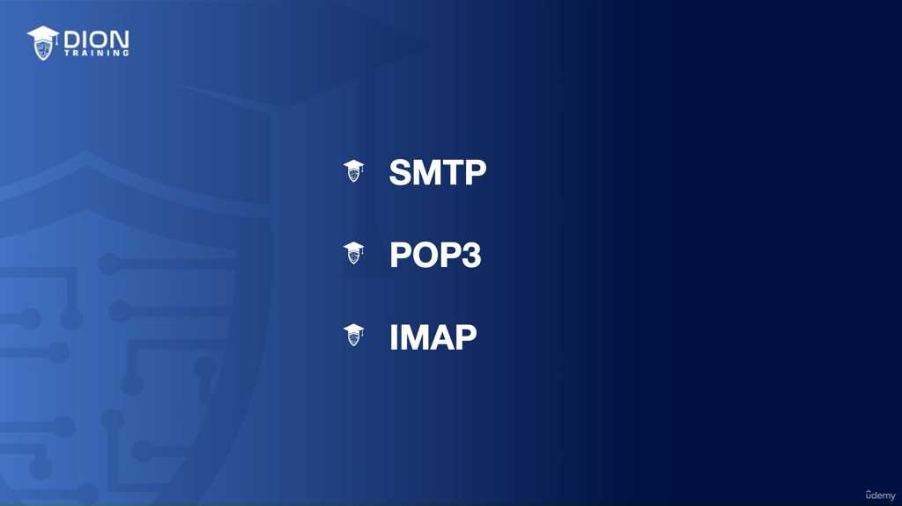

*   **SMTP:** Đảm nhận vai trò "Người gửi" (người chuyển phát nhanh).
*   **POP3 & IMAP:** Đảm nhận vai trò "Người nhận" (người phân loại và lấy thư).
Mỗi giao thức vận hành trên những "cổng" riêng biệt, chuyên trách một khâu cụ thể trong quy trình phân phối.

### 3. SMTP (Simple Mail Transfer Protocol) - "Người đưa thư chuyên nghiệp"
SMTP là tiêu chuẩn vàng để gửi email. Hãy hiểu đơn giản: Khi bạn nhấn nút "Send", phần mềm của bạn không gửi trực tiếp đến máy tính người nhận mà nó đẩy thư lên máy chủ (mail server) của bạn. Sau đó, máy chủ của bạn sử dụng SMTP để "nói chuyện" với máy chủ người nhận.

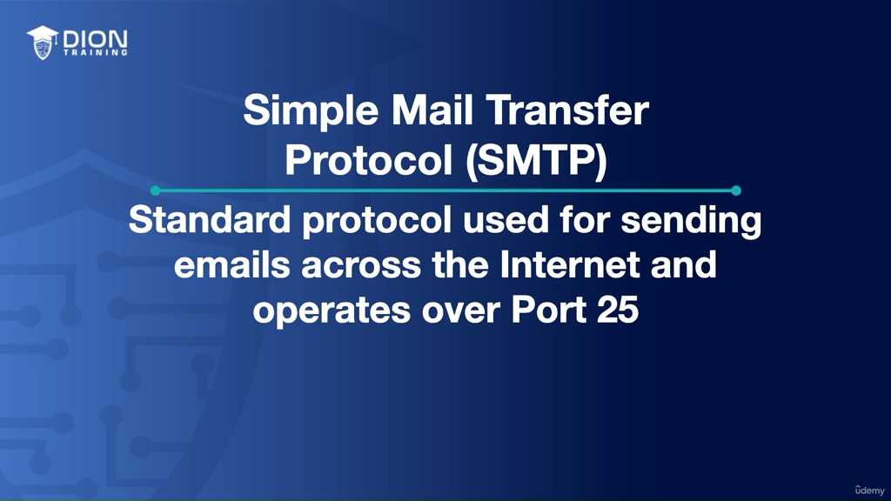

*   **Port 25:** Đây là "cửa ngõ" truyền thống, mặc định của SMTP. Nó là kênh liên lạc giữa hai máy chủ email để chuyển tiếp thư đi.
*   **Hạn chế của SMTP:** Nó chỉ biết gửi, không biết nhận. Nó giống như một người đưa thư chỉ có nhiệm vụ phát đi chứ không có chức năng giữ thư lại cho bạn đọc.

> **💡 Ví dụ nhớ đời:** Hãy tưởng tượng SMTP giống như một nhân viên bưu điện chỉ chuyên việc nhận thư từ tay bạn và quẳng nó vào thùng thư chung của bưu điện trung tâm. Anh ta không hề có chìa khóa để mở thùng thư đó lấy thư ra cho bạn xem. Anh ta chỉ là cầu nối để chuyển thư từ điểm A đến điểm B.

### 4. Vấn đề bảo mật: Từ SMTP đến SMTPS
SMTP thuần túy truyền tải dữ liệu ở dạng "plain text" (văn bản thô). Điều này có nghĩa là nếu một hacker đứng giữa đường truyền (giống như việc nghe lén cuộc gọi), họ có thể dễ dàng đọc được nội dung email của bạn. Đó là lý do **SMTPS** ra đời.

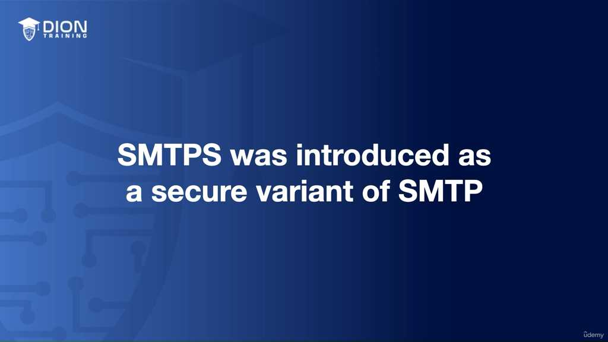

*   **Cơ chế hoạt động:** SMTPS không phải là một giao thức mới hoàn toàn, mà là "chiếc áo giáp" bọc ngoài SMTP bằng SSL (Secure Sockets Layer) hoặc TLS (Transport Layer Security).
*   **Cổng 465 hoặc 587:** Thay vì dùng cổng 25 thiếu an toàn, SMTPS sử dụng cổng 465 hoặc 587 để tạo ra một "đường hầm mã hóa" (encrypted tunnel). Mọi thông tin đi qua đường hầm này đều được xáo trộn; nếu kẻ xấu lấy được gói tin, chúng cũng chỉ nhận được những ký tự vô nghĩa.

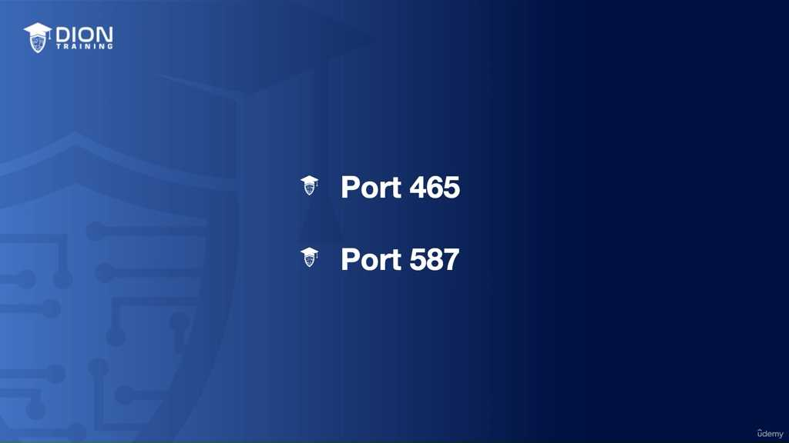

### 5. POP3 (Post Office Protocol Version 3) - "Lối tư duy cũ"
POP3 là giao thức được thiết kế để "rút" email từ máy chủ về máy cục bộ. 

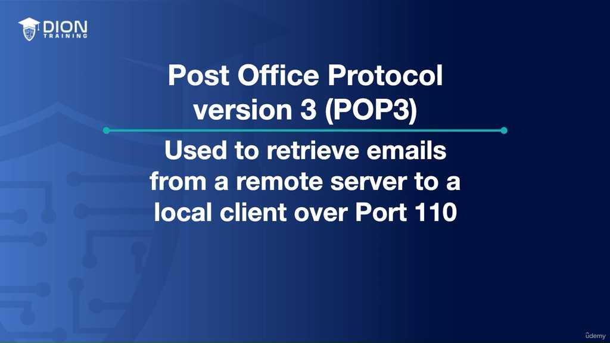

*   **Cơ chế "Download and Delete":** Điểm đặc trưng nhất của POP3 là nó tải thư về máy tính cá nhân của bạn, sau đó xóa sạch dấu vết trên máy chủ.
*   **Port 110:** Đây là "cổng" mà ứng dụng email dùng để kết nối với máy chủ POP3 và lấy thư về.

**Tại sao POP3 từng là "ông vua" của những năm 90-2000?**
Thời đó, dung lượng lưu trữ trên các máy chủ email cực kỳ đắt đỏ và hạn chế. Hơn nữa, con người thường chỉ dùng cố định một chiếc máy tính bàn tại văn phòng. Việc tải thư về máy cá nhân giúp giải phóng không gian trên máy chủ và cho phép người dùng đọc thư ngay cả khi không có kết nối internet (vì thư đã nằm trên ổ cứng máy tính rồi).

> **💡 Ví dụ nhớ đời:** POP3 giống như việc bạn đến ngân hàng, yêu cầu họ đưa hết toàn bộ thư trong hòm thư của bạn ra và mang về nhà cất. Khi bạn về đến nhà, trong hòm thư tại ngân hàng sẽ hoàn toàn trống rỗng. Nếu ngày mai bạn đổi máy tính khác hoặc đi du lịch, bạn sẽ không bao giờ tìm thấy những lá thư đó trên máy chủ ngân hàng nữa, vì bạn đã "tải và xóa" chúng mất rồi. Điều này cực kỳ bất tiện nếu bạn dùng nhiều thiết bị như điện thoại, laptop và máy tính bảng cùng lúc.

Sự hạn chế của mô hình POP3 truyền thống nằm ở cách nó "di chuyển" dữ liệu thay vì "đồng bộ" dữ liệu. Khi bạn tải email về máy cục bộ, chúng trở thành tài sản riêng biệt của thiết bị đó. Nếu bạn kiểm tra email trên máy tính bàn tại văn phòng và xóa nó đi, thì khi bạn mở laptop ở nhà, email đó đã biến mất hoàn toàn khỏi server, khiến việc truy cập từ nhiều thiết bị trở nên bất khả thi.

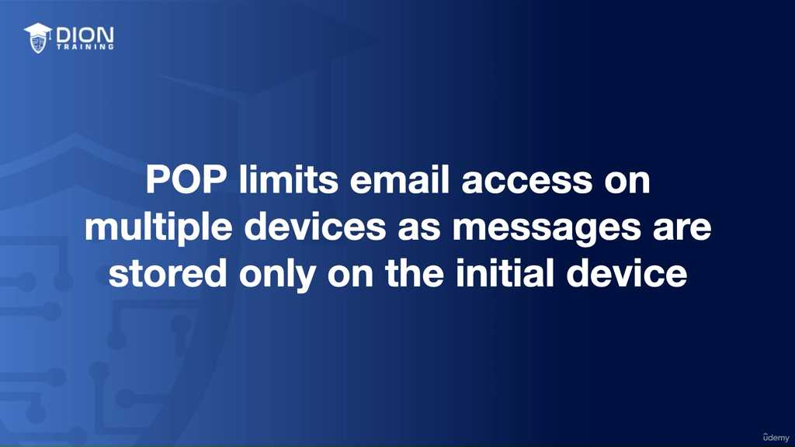

Dù các bản cập nhật sau này cho phép tùy chọn "giữ bản sao trên server", nhưng POP3 vẫn mắc kẹt ở "trạng thái mù". Nghĩa là, hành động đọc hoặc xóa một email trên máy tính này không được phản hồi lại server. Kết quả là trên điện thoại, bạn vẫn thấy email đó ở trạng thái "chưa đọc", gây ra sự chồng chéo và lãng phí thời gian quản lý.

> **💡 Ví dụ nhớ đời:** Hãy tưởng tượng POP3 giống như việc bạn đi rút tiền tại một cây ATM cũ kỹ: Khi bạn rút hết tiền trong tài khoản ra bỏ vào ví (tải về máy cục bộ), số dư tại ngân hàng (server) về 0. Dù sau này ngân hàng cho phép bạn "để lại một ít tiền trong tài khoản", nhưng nếu bạn đánh dấu tờ tiền nào đã tiêu (đã đọc) trong ví, thì nhân viên ngân hàng vẫn không hề biết tờ tiền đó đã tiêu hay chưa. Bạn vẫn phải tự tay đánh dấu lại từng tờ tiền ở mọi ví khác mà bạn có.

Để khắc phục sự thiếu an toàn vốn có khi truyền tải dữ liệu dạng văn bản thuần (plain text) của POP3, giao thức POP3S (POP3 Secure) đã ra đời. POP3S chuyển dịch toàn bộ dữ liệu qua cổng 995, tận dụng cơ chế đường hầm SSL/TLS. Bạn có thể hiểu đây là một chiếc xe bọc thép bảo vệ dữ liệu khi đi từ server đến máy khách, đảm bảo không ai có thể "đánh tráo" hoặc "xem trộm" nội dung email của bạn trên đường đi.

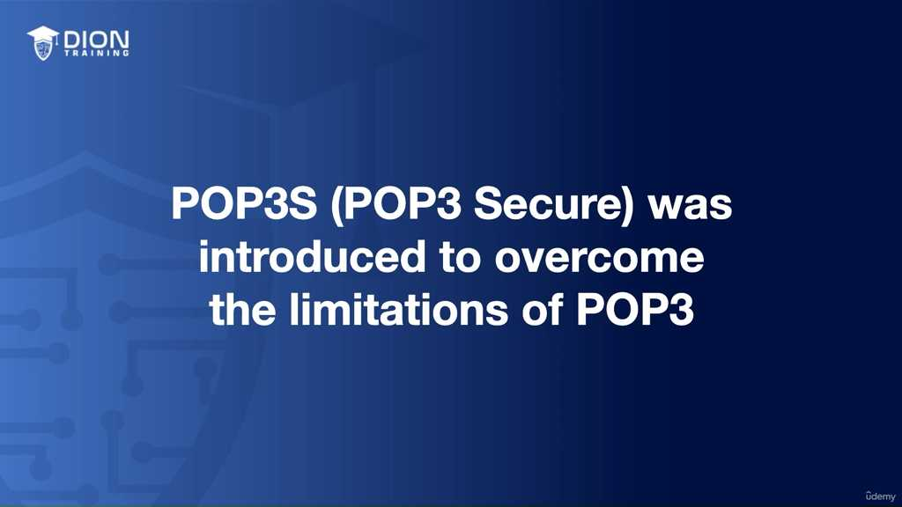

Bước sang IMAP (Internet Message Access Protocol), chúng ta thấy một tư duy quản lý hoàn toàn khác biệt. Trong khi POP3 là "kẻ thu gom", thì IMAP là "kẻ quản lý từ xa". Vận hành qua cổng 143, IMAP không tải email về để xóa, mà nó thiết lập một cầu nối trực tiếp để bạn thao tác ngay trên server.

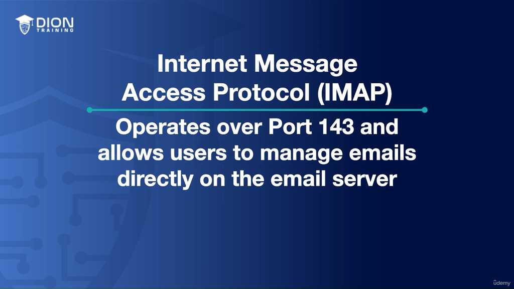

> **💡 Ví dụ nhớ đời:** Nếu POP3 là việc bạn tải phim về máy tính để xem (tốn dung lượng, khó di chuyển), thì IMAP giống như việc bạn sử dụng dịch vụ Netflix. Bạn không sở hữu file phim, bạn chỉ đang tương tác với nội dung trên server. Dù bạn đăng nhập từ tivi, laptop hay điện thoại, Netflix vẫn biết bạn đang xem dở đến đoạn nào (đồng bộ trạng thái).

Sức mạnh thực sự của IMAP nằm ở tính đồng bộ thời gian thực:
*   **Tính nhất quán:** Bất kỳ thay đổi nào (đọc, xóa, đánh dấu cờ, thư mục) đều được phản chiếu tức thì trên mọi thiết bị.
*   **Phù hợp với thời đại "always-on":** IMAP được thiết kế cho thế giới di động, nơi bạn kiểm tra email mọi lúc mọi nơi. Nó đảm bảo hộp thư của bạn là một thực thể duy nhất, thống nhất dù bạn dùng bao nhiêu thiết bị đi chăng nữa.

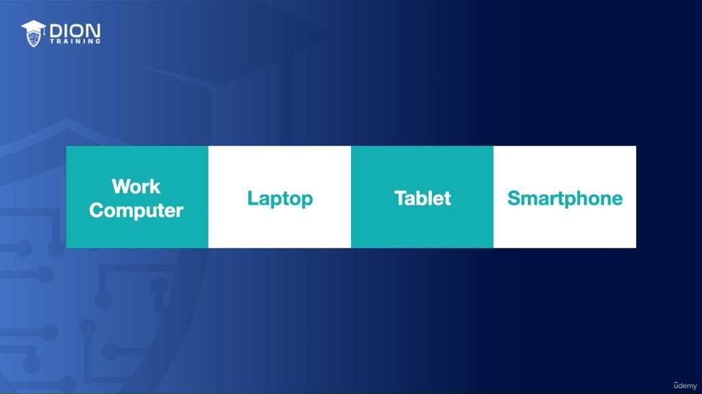

Tuy nhiên, cần lưu ý một điểm yếu cốt tử: IMAP mặc định cũng sử dụng văn bản thuần không mã hóa. Vì vậy, trong thực tế triển khai, việc sử dụng IMAPS (IMAP Secure) là yêu cầu bắt buộc để thay thế cho giao thức IMAP cơ bản, nhằm tạo ra lớp bảo vệ mã hóa tương tự như cách chúng ta đã bảo mật cho POP3 hay SMTP.

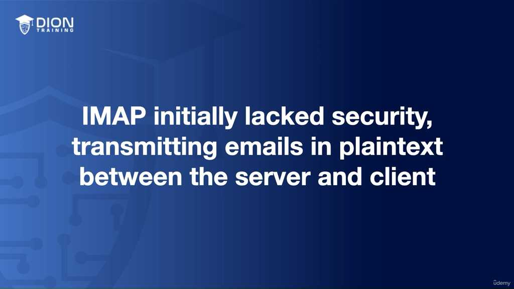

Tiếp nối phần giải thích về sự khác biệt giữa POP3 và IMAP, đoạn cuối này đi sâu vào cơ chế vận hành của các giao thức bảo mật và tổng kết chiến lược quản trị email an toàn.

### Cơ chế hoạt động của IMAP Secure (IMAPS)
Đoạn transcript làm rõ cách IMAPS (hoạt động trên cổng 993) xử lý vấn đề bảo mật. Thay vì thay đổi bản chất của giao thức IMAP, IMAPS tạo ra một "đường hầm" (tunnel) trung gian. Dữ liệu được mã hóa bằng SSL hoặc TLS trước khi "chui" qua đường hầm này. Khi đã nằm trong sự bảo vệ của đường hầm, dữ liệu mới được truyền tải theo chuẩn IMAP thông thường. Điều này có nghĩa là bản thân giao thức IMAP không thay đổi, nhưng môi trường mà nó vận hành đã trở nên bất khả xâm phạm đối với các tác nhân bên ngoài.

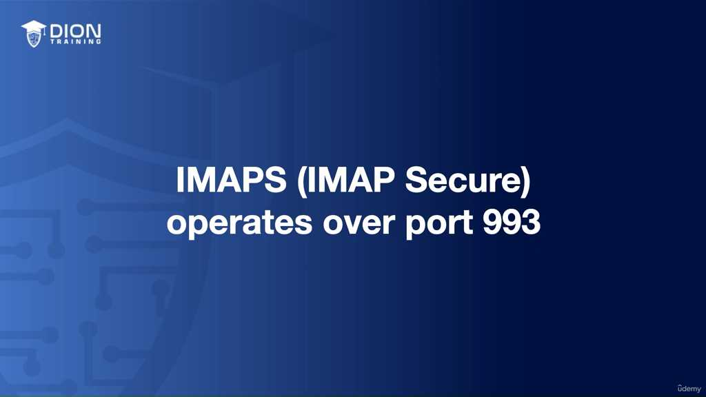

> **💡 Ví dụ nhớ đời:** Hãy tưởng tượng IMAP là việc bạn gửi một bức thư tay không phong bì qua đường bưu điện (bất kỳ ai cũng có thể đọc được). IMAPS giống như việc bạn đặt bức thư đó vào một chiếc hộp thép được khóa mã số (SSL/TLS tunnel) rồi mới gửi đi. Bưu tá vẫn dùng hệ thống phân loại cũ để vận chuyển chiếc hộp, nhưng nội dung bên trong thì an toàn tuyệt đối vì nằm trong "pháo đài" thép đó.

### Tổng hợp hệ sinh thái giao thức Email
Bài học đưa ra một bảng phân loại chức năng rõ ràng để người quản trị dễ dàng ghi nhớ và áp dụng:

1.  **Nhóm gửi email (Outgoing):** Sử dụng **SMTP** (Simple Mail Transfer Protocol). Để đảm bảo an toàn, cần ưu tiên **SMTPS** – cung cấp một lộ trình truyền tải đã được mã hóa ngay từ đầu.
2.  **Nhóm nhận email (Incoming):** Gồm **POP3** (tải về và xóa/lưu cục bộ) và **IMAP** (quản lý trực tiếp trên server). 

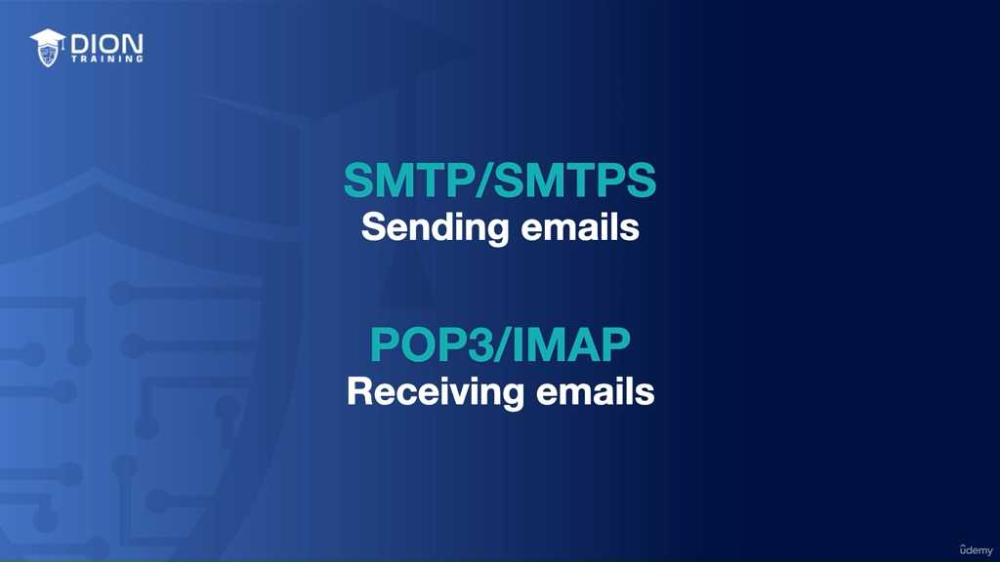

    *   Điểm nhấn mới: Dù POP3 có thể được cấu hình để giữ bản sao trên server, IMAP vẫn vượt trội hơn hẳn nhờ khả năng đồng bộ hóa trạng thái (đã đọc, đã xóa, đã gửi) xuyên suốt mọi thiết bị. Đây là tiêu chuẩn vàng cho phong cách làm việc hiện đại: di động và đa thiết bị.

### Tối ưu hóa an ninh hệ thống: Sự chuyển dịch sang các biến thể "S"
Thông điệp then chốt của đoạn này là quy tắc "S": Bất cứ khi nào cấu hình hệ thống email, việc lựa chọn các biến thể có chữ "S" ở cuối (**SMTPS, POP3S, IMAPS**) là bắt buộc. 

*   **Tại sao cần làm vậy?** Để ngăn chặn hai mối đe dọa nguy hiểm nhất trong truyền tin:
    *   **Eavesdropping (Nghe lén):** Kẻ tấn công đứng giữa đường truyền và "lắng nghe" toàn bộ nội dung email của bạn dưới dạng văn bản thuần (plain text).
    *   **On-path attack (Tấn công trung gian):** Kẻ tấn công không chỉ nghe lén mà còn có thể can thiệp, chỉnh sửa nội dung email trước khi nó đến tay người nhận.

Việc hiểu rõ các cổng (Port 993 cho IMAPS, 995 cho POP3S, v.v.) không chỉ là bài tập kỹ thuật, mà là tư duy phòng vệ. Khi bạn cấu hình đúng các giao thức bảo mật này, bạn đang xây dựng một lớp lá chắn vững chắc để đảm bảo rằng các thông điệp quan trọng được truyền tải không chỉ hiệu quả (nhờ khả năng đồng bộ của IMAP) mà còn nguyên vẹn và bí mật (nhờ các đường hầm SSL/TLS). Điều này biến môi trường mạng công cộng hoặc thiếu bảo mật thành một kênh liên lạc an toàn cho tổ chức.

---

## 🎯 Bí Kíp Ôn Thi Tốc Độ

### 1. Phân loại Protocol
*   **Gửi email (Outbound):** Chỉ dùng **SMTP**.
*   **Nhận email (Inbound):** Dùng **POP3** hoặc **IMAP**.

### 2. Các Protocol & Cổng (Port) chi tiết

| Protocol | Chức năng | Port thường | Port bảo mật (Secure) |
| :--- | :--- | :--- | :--- |
| **SMTP** | Gửi email | 25 | 465 / 587 |
| **POP3** | Tải về & Xóa | 110 | 995 |
| **IMAP** | Đồng bộ hóa | 143 | 993 |

### 3. Đặc điểm cốt lõi (Ghi nhớ nhanh)
*   **SMTP:** "Người đưa thư", chuyên gửi từ Server đi. Không dùng để nhận.
*   **POP3:** "Tải & Xóa". Phù hợp dùng 1 thiết bị duy nhất. Không đồng bộ trạng thái (đọc/xóa) giữa các máy.
*   **IMAP:** "Đồng bộ hóa". Lưu trữ trên Server. **Tốt nhất cho đa thiết bị** (điện thoại, laptop, PC đều thấy giống nhau).
*   **Bảo mật:** Các bản không có chữ "S" (SMTP, POP3, IMAP) truyền dữ liệu **Plain text** (kém an toàn). Luôn ưu tiên dùng bản có "S" (**SMTPS, POP3S, IMAPS**) để mã hóa qua **SSL/TLS**.

### 4. Mẹo ghi nhớ:
*   **SMTP = Send** (Cùng chữ S).
*   **POP3 = Pull** (Tải về máy rồi xóa ở server).
*   **IMAP = Instant/Interactive** (Đồng bộ tức thời trên mọi thiết bị).
*   **Nguyên tắc vàng:** Muốn an toàn -> Chọn cổng có số lớn hơn (thường là 4xx, 5xx, 9xx).

---
*Ghi chú: 12 hình ảnh minh họa (.jpg) đã được tải về và lưu tự động vào thư mục con `image/` cùng cấp với file này. Để ảnh hiển thị tự động, hãy đảm bảo bạn sao chép cả thư mục `image/` nếu bạn muốn di chuyển file markdown sang nơi khác!*
