# File Transfer Protocols

### Tổng quan về Giao thức Truyền tải File

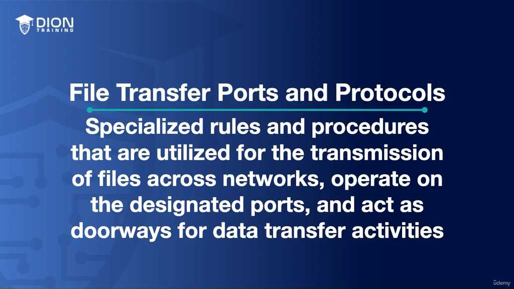

Trong thế giới mạng, "giao thức" (protocol) được hiểu đơn giản là một bộ quy tắc ứng xử giữa các thiết bị, đảm bảo rằng dữ liệu được gửi đi từ điểm A sẽ được hiểu chính xác bởi điểm B. Các giao thức truyền file không chỉ là phương thức vận chuyển dữ liệu mà còn được gắn liền với các "cổng" (ports). Hãy hình dung cổng như những cánh cửa trong một tòa nhà: mỗi cánh cửa dẫn đến một dịch vụ riêng biệt. Nếu bạn gõ cửa sai, dữ liệu của bạn sẽ bị từ chối hoặc không tìm thấy nơi để xử lý.

### 1. FTP (File Transfer Protocol)

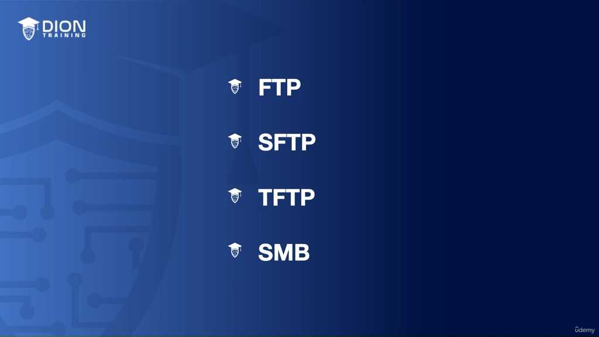

FTP là "ông tổ" của các phương thức truyền file, được thiết kế từ thời kỳ sơ khai của Internet. Điểm đặc biệt nhất của FTP là nó chia tách việc điều khiển và việc truyền tải dữ liệu vào hai luồng riêng biệt, tương ứng với hai cổng khác nhau:

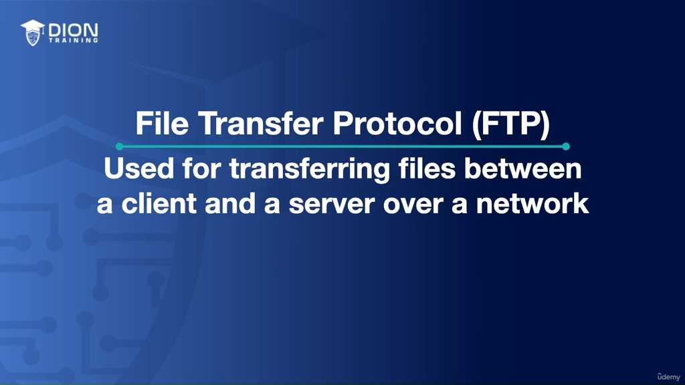

*   **Cổng 21 (Control Port):** Đây là "bộ não" của phiên làm việc. Khi bạn muốn ra lệnh "tải lên", "tải xuống", hoặc "xóa file", bạn đang gửi thông tin qua cổng 21. Nó xử lý việc xác thực (đăng nhập) và quản lý lệnh điều khiển.

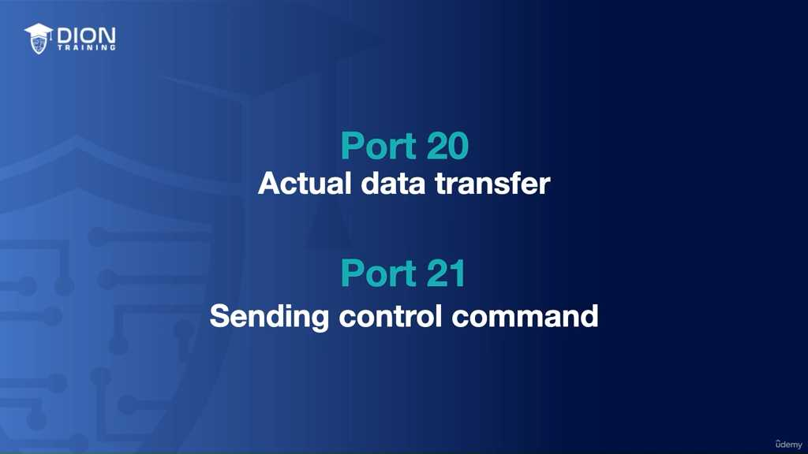

*   **Cổng 20 (Data Port):** Sau khi cổng 21 đã thiết lập xong các điều khoản, cổng 20 mới thực sự bắt tay vào công việc "vận chuyển" khối lượng dữ liệu thực tế (file của bạn).

> **💡 Ví dụ nhớ đời:** Hãy tưởng tượng FTP giống như việc gửi một bức thư quan trọng qua bưu điện. Cổng 21 giống như việc bạn gọi điện cho nhân viên bưu điện để yêu cầu: "Tôi muốn gửi kiện hàng này đến địa chỉ X". Sau khi nhân viên đồng ý và làm thủ tục (xác thực), cổng 20 chính là chiếc xe tải thực sự chở kiện hàng đó đến đích.

**Hạn chế chí mạng của FTP:** FTP được thiết kế trong thời đại mà an ninh mạng không phải là mối quan tâm hàng đầu. Toàn bộ dữ liệu – bao gồm cả tên đăng nhập, mật khẩu và nội dung file – đều được truyền đi dưới dạng **Plain Text (văn bản thuần túy)**. Điều này đồng nghĩa với việc bất kỳ ai "nghe lén" được trên đường truyền đều có thể dễ dàng đọc được thông tin của bạn.

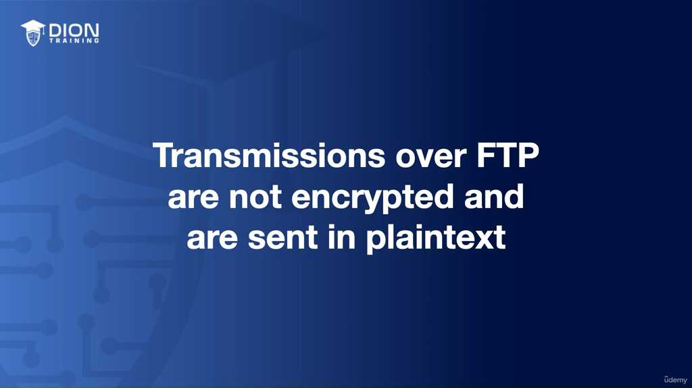

### 2. SFTP (SSH File Transfer Protocol)

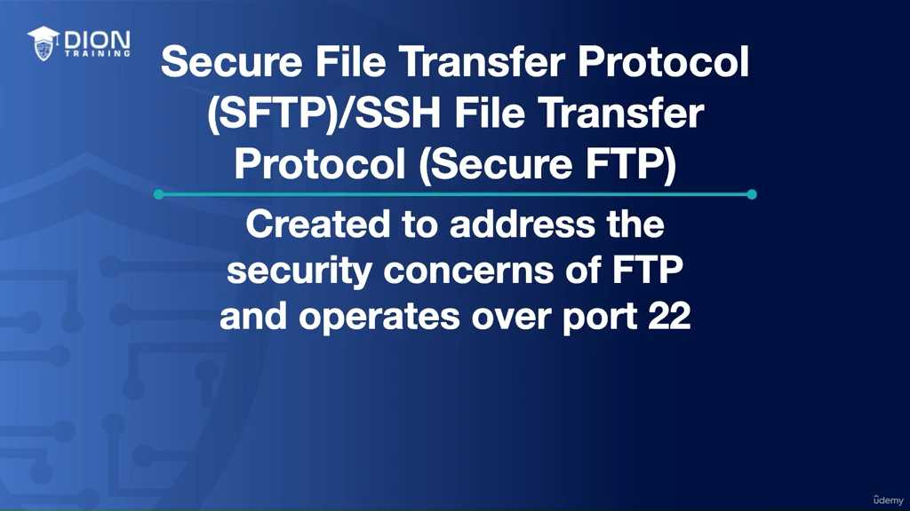

Để khắc phục điểm yếu "phơi bày" của FTP, người ta đã tạo ra SFTP. Điều quan trọng cần lưu ý là SFTP không phải là FTP được thêm một lớp bảo mật đơn thuần, mà nó là một giao thức hoàn toàn khác được xây dựng dựa trên nền tảng của SSH (Secure Shell).

*   **Cổng 22:** Đây là cổng tiêu chuẩn của SSH. SFTP tận dụng sức mạnh của SSH để tạo ra một "đường hầm" (tunneling) bảo mật.

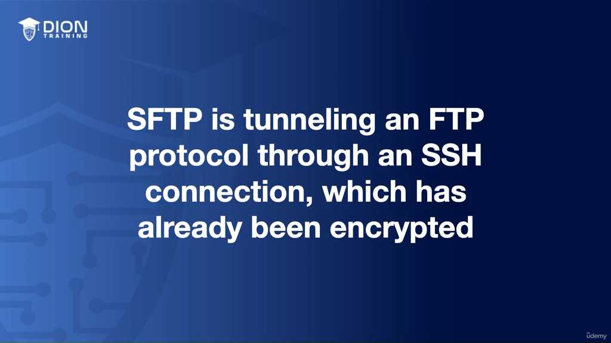

*   **Cơ chế hoạt động:** Thay vì truyền dữ liệu trực tiếp ra môi trường mạng như FTP, SFTP mã hóa toàn bộ dữ liệu trước khi nó rời khỏi máy tính của bạn. Dữ liệu này được đẩy qua "đường hầm" SSH đã được mã hóa. Ngay cả khi tin tặc chặn được gói tin trên đường đi, chúng cũng chỉ nhìn thấy những ký tự mã hóa hỗn độn không có nghĩa, thay vì mật khẩu hay tài liệu quan trọng của bạn.

> **💡 Ví dụ nhớ đời:** Nếu FTP là việc bạn gửi một tấm bưu thiếp ghi rõ nội dung cho bất kỳ ai cũng có thể đọc được trên đường đi, thì SFTP giống như việc bạn đặt tấm bưu thiếp đó vào trong một chiếc két sắt bọc thép, khóa lại bằng mật mã chỉ người nhận mới mở được, sau đó mới gửi đi qua đường bưu điện. Dù chiếc két có bị rơi dọc đường, kẻ xấu cũng không thể biết bên trong chứa gì.

**Sự khác biệt cốt lõi:** Việc sử dụng cổng 22 cho SFTP không chỉ mang lại sự an toàn mà còn giúp quản trị viên mạng dễ dàng kiểm soát hơn trong việc cấu hình tường lửa (firewall), vì bạn chỉ cần mở một cổng duy nhất cho mọi hoạt động thay vì hai cổng riêng biệt như FTP (cổng 20 và 21). Đây chính là bước tiến hóa tất yếu để bảo vệ dữ liệu trong môi trường mạng hiện đại đầy rẫy rủi ro.

### Phân tích chuyên sâu về TFTP và SMB

Tiếp nối các giao thức bảo mật và phổ thông đã nêu, chúng ta tiến tới những giao thức đặc thù: TFTP (Trivial File Transfer Protocol) và SMB (Server Message Block). Đây là hai mảnh ghép quan trọng trong quản trị mạng, phục vụ các mục tiêu hoàn toàn khác biệt so với FTP hay SFTP.

#### 1. Giao thức TFTP (Trivial File Transfer Protocol) - "Sự tối giản hóa"

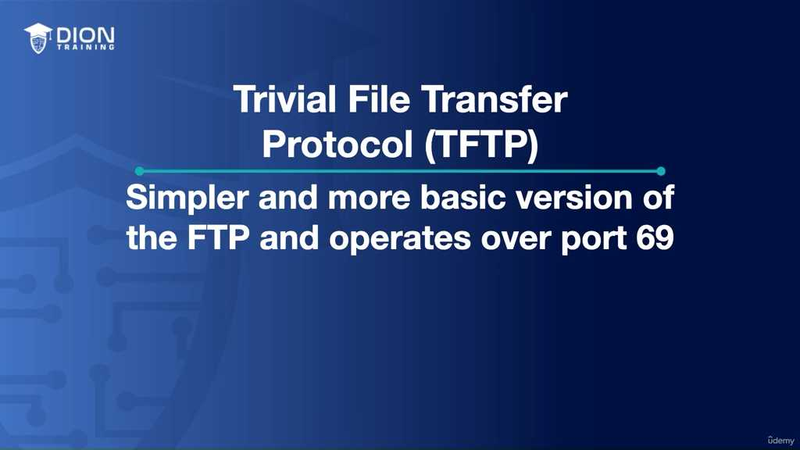

TFTP, hoạt động trên **cổng 69**, được mệnh danh là "phiên bản rút gọn" của FTP. Nếu FTP là một chiếc xe tải chở hàng đầy đủ tiện nghi, thì TFTP là một chiếc xe kéo thô sơ chỉ tập trung vào việc đưa vật phẩm từ điểm A đến điểm B nhanh nhất mà không cần các thủ tục hành chính rườm rà.

*   **Đặc điểm loại bỏ:** TFTP cố tình lược bỏ các tính năng như xác thực người dùng (username/password) và khả năng duyệt thư mục (directory browsing). Điều này khiến nó không an toàn, nhưng lại cực kỳ hiệu quả trong môi trường mạng nội bộ cô lập.

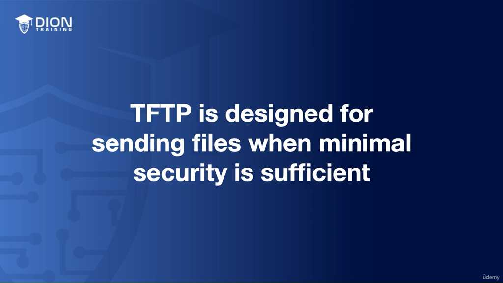

*   **Ứng dụng cốt lõi:** TFTP được dùng trong các tình huống mà thiết bị chưa có hệ điều hành hoàn chỉnh hoặc đang trong quá trình khởi động. Ví dụ như các máy tính không ổ cứng (diskless workstation) cần tải file khởi động từ server, hoặc các thiết bị mạng (Router/Switch) và điện thoại VoIP cần lấy cấu hình ban đầu.

> **💡 Ví dụ nhớ đời:** Hãy tưởng tượng bạn đang ở trong một khách sạn 5 sao. FTP là việc bạn phải xuất trình hộ chiếu, điền form, ký tên mới được nhận thẻ phòng. Còn TFTP giống như việc nhân viên khách sạn ném chiếc chìa khóa vào hộp thư tại quầy lễ tân để bạn tự nhặt lấy mà không cần hỏi danh tính. Nó không an toàn, nhưng trong không gian đóng kín của khách sạn, nó giúp bạn vào phòng ngay lập tức khi bạn là người duy nhất ở đó.

#### 2. Giao thức SMB (Server Message Block) - "Giao tiếp nội bộ Windows"

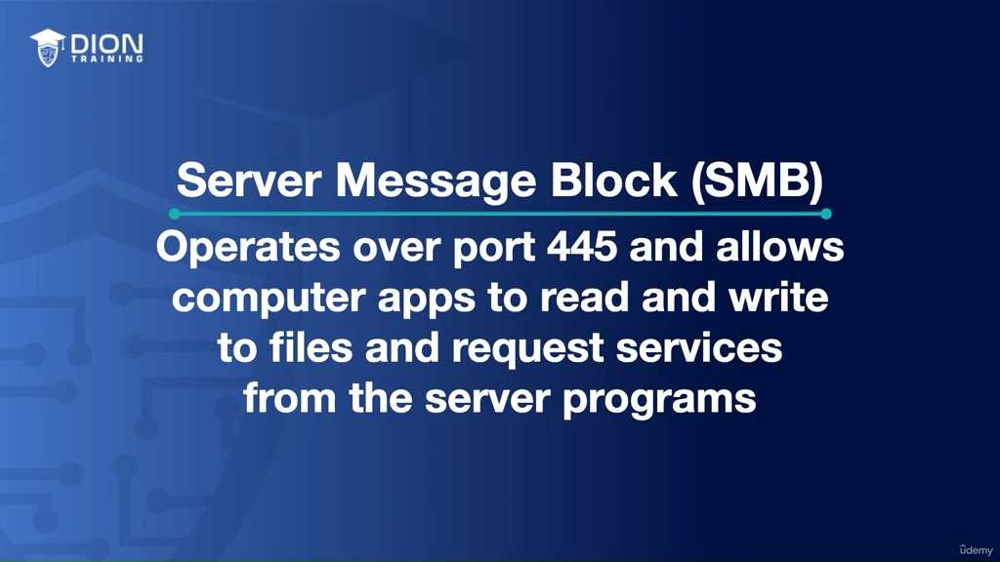

Khác với các giao thức truyền tải file thông qua internet, SMB (hoạt động trên **cổng 445**) là "ngôn ngữ" dùng để các máy tính trong cùng một tòa nhà hoặc một phòng ban "nói chuyện" với nhau.

*   **Cơ chế hoạt động:** SMB cho phép các ứng dụng trên một máy tính không chỉ đọc/ghi file trên server từ xa mà còn có thể yêu cầu các dịch vụ hệ thống khác. Nó tạo ra một "hệ sinh thái dùng chung", nơi các tài nguyên được chia sẻ như thể chúng đang nằm trên chính ổ cứng cục bộ của bạn.
*   **Từ Windows tới Cross-platform:** Mặc dù SMB sinh ra để phục vụ hệ điều hành Windows, nhưng sự xuất hiện của **Samba** đã mở rộng khả năng này sang môi trường Linux/Unix, biến nó thành tiêu chuẩn cho việc chia sẻ file giữa các hệ điều hành khác nhau.
*   **Giới hạn địa lý:** Một lưu ý sống còn trong thiết kế mạng là **SMB không dành cho internet**. Việc mở cổng 445 ra internet là một "án tử" về bảo mật, vì giao thức này dễ bị khai thác bởi các phần mềm độc hại. Nó là giao thức "nội bộ" (LAN), chỉ nên tồn tại trong tường lửa của tổ chức.

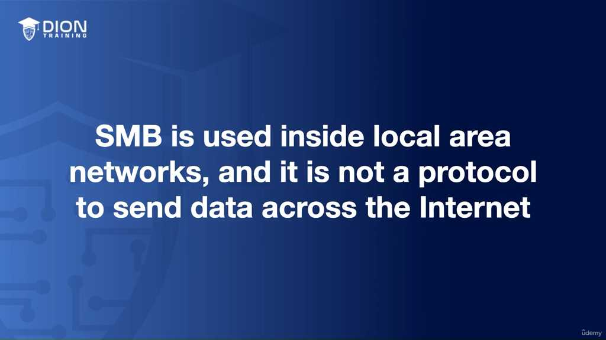

> **💡 Ví dụ nhớ đời:** Hãy coi SMB như một "đường ống nội bộ" trong một gia đình. Bạn có thể dễ dàng chạy sang phòng hàng xóm (nếu ở chung cư) để mượn cái búa, cái kìm qua đường ống này. Nhưng bạn tuyệt đối không được nối đường ống đó ra ngoài vỉa hè, vì bất cứ ai qua đường cũng có thể thò tay vào nhà bạn lấy đồ. FTP/SFTP là dịch vụ chuyển phát nhanh quốc tế, còn SMB là việc chia sẻ đồ dùng với người thân trong nhà.

#### 3. Tổng kết bảng tra cứu giao thức và cổng

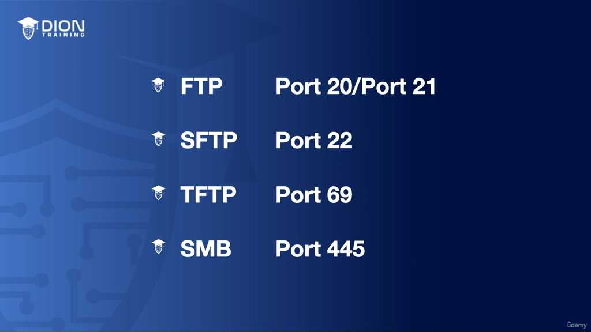

Để nắm vững kiến thức này, bạn cần ghi nhớ "thẻ căn cước" của từng giao thức:

| Giao thức | Cổng (Port) | Vai trò chính | Đặc tính bảo mật |
| :--- | :--- | :--- | :--- |
| **FTP** | 20 (Data), 21 (Control) | Truyền file cơ bản | Kém (Plain text) |
| **SFTP** | 22 | Truyền file an toàn | Cao (Sử dụng SSH) |
| **TFTP** | 69 | Khởi động thiết bị, cấu hình | Không có (Tối giản) |
| **SMB** | 445 | Chia sẻ file nội bộ (Windows) | Chỉ dùng cho LAN |

Việc lựa chọn đúng giao thức chính là chìa khóa của một hạ tầng mạng khỏe mạnh. Khi bạn cần sự bảo mật, hãy chọn SFTP. Khi bạn cần sự đơn giản để khởi động thiết bị, hãy chọn TFTP. Khi bạn muốn làm việc nhóm trong một văn phòng, SMB là lựa chọn mặc định. Nếu bạn sử dụng sai mục đích, bạn hoặc là làm chậm hệ thống, hoặc là mở cửa cho các rủi ro bảo mật không đáng có.

Khi nói đến việc lựa chọn giao thức truyền tải tệp tin (file transfer protocol), điểm mấu chốt không nằm ở việc chọn giao thức "tốt nhất" theo nghĩa tuyệt đối, mà là chọn giao thức "phù hợp nhất". Sự kết nối giữa các thành phần trong hệ thống đòi hỏi một tư duy chiến lược dựa trên ba trụ cột chính:

**1. Căn chỉnh yêu cầu bảo mật (Security Requirements)**
Mỗi giao thức mang trong mình một cấu hình bảo mật khác nhau. Khi bạn chọn một giao thức, bạn đang chọn mức độ rủi ro mà tổ chức chấp nhận.
*   Nếu dữ liệu của bạn có tính nhạy cảm cao, việc lựa chọn các giao thức không mã hóa (như TFTP) là một sai lầm về mặt kiến trúc.
*   Ngược lại, nếu bạn đang thực hiện các tác vụ khởi động hệ thống trong một môi trường được kiểm soát chặt chẽ (như mạng nội bộ cô lập), việc chọn SFTP có thể trở thành một sự lãng phí tài nguyên xử lý (overhead) do quá trình mã hóa SSH phức tạp không cần thiết.

**2. Căn chỉnh môi trường mạng (Network Environment)**
Môi trường mạng quyết định "sân chơi" của giao thức.
*   Bạn cần cân nhắc xem tệp tin sẽ di chuyển qua đâu: mạng nội bộ (LAN) hay môi trường mở (Internet). 
*   Ví dụ, SMB được tối ưu hóa cho LAN với độ trễ thấp và tính năng chia sẻ tệp tin phức tạp, nhưng nó sẽ trở nên cực kỳ yếu ớt và dễ bị tấn công nếu bị "phơi bày" trực tiếp ra Internet. Việc thấu hiểu địa hình mạng giúp bạn tránh được việc triển khai các giao thức không tương thích với hạ tầng hiện có, chẳng hạn như tránh dùng SMB qua các kết nối WAN không an toàn mà không có VPN bảo vệ.

**3. Căn chỉnh chức năng cần thiết (Functionality Needed)**
Đây là bài toán về tối ưu hóa công năng. Bạn không nên "dùng dao mổ trâu để giết gà".
*   Nếu mục tiêu chỉ là đẩy một file cấu hình nhỏ cho thiết bị mạng (như switch, router), TFTP là công cụ hoàn hảo vì sự tối giản.
*   Nếu mục tiêu là cho phép người dùng cộng tác trên các tệp tài liệu văn phòng, SMB/Samba là lựa chọn số một vì nó hỗ trợ các thao tác "đọc-ghi" trực tiếp mà không cần tải về rồi tải lên lại như FTP truyền thống.

> **💡 Ví dụ nhớ đời:** Hãy tưởng tượng việc chọn giao thức cũng giống như việc chọn phương tiện di chuyển. 
> - **TFTP** giống như việc đi bộ ra đầu ngõ lấy tờ báo: nhanh, không cần thủ tục, nhưng bạn không thể mang đồ đạc quý giá vì chẳng có khóa bảo vệ. 
> - **SFTP** giống như xe bọc thép chở tiền: cực kỳ an toàn, có khóa bảo vệ nghiêm ngặt, phù hợp để di chuyển dữ liệu quan trọng qua những cung đường nguy hiểm. 
> - **SMB** giống như thang máy trong tòa nhà văn phòng: rất thuận tiện để di chuyển giữa các tầng trong cùng một tòa nhà (mạng LAN), nhưng bạn không thể lái thang máy đó chạy ra ngoài đường phố để đi xuyên thành phố được. 
> Lựa chọn sai phương tiện không chỉ làm chậm công việc mà còn khiến tài sản (dữ liệu) của bạn gặp nguy hiểm không đáng có.

**Tóm lược tư duy lựa chọn:**
Việc đưa ra quyết định cuối cùng chính là một phép tính cân bằng:
*   **Chi phí vận hành:** (Tài nguyên CPU cho việc mã hóa/giải mã).
*   **Độ phức tạp:** (Cấu hình xác thực người dùng).
*   **Hiệu quả:** (Khả năng tương tác với hệ điều hành và thiết bị).

Cuối cùng, hãy nhớ rằng không có một giao thức "toàn năng". Một chuyên gia mạng giỏi là người biết phối hợp nhiều giao thức khác nhau trong cùng một hệ thống: dùng SFTP để gửi dữ liệu nhạy cảm ra ngoài, dùng TFTP để quản trị thiết bị nội bộ, và dùng SMB để người dùng làm việc hàng ngày. Sự hiểu biết sâu sắc về "cái gì, khi nào và tại sao" chính là tấm khiên bảo vệ cho sự an toàn và hiệu năng của toàn bộ hạ tầng mạng.

---

## 🎯 Bí Kíp Ôn Thi Tốc Độ

**1. FTP (File Transfer Protocol)**
*   **Cổng:** **20** (Data) & **21** (Control).
*   **Đặc điểm:** Cũ, phổ biến, truyền dữ liệu **không mã hóa** (plain text).
*   **Rủi ro:** Dễ bị đánh cắp thông tin đăng nhập.

**2. SFTP (SSH File Transfer Protocol)**
*   **Cổng:** **22**.
*   **Đặc điểm:** Kết hợp FTP với **SSH (Secure Shell)**.
*   **Ưu điểm:** **Bảo mật cao**, dữ liệu được mã hóa hoàn toàn trước khi truyền.

**3. TFTP (Trivial File Transfer Protocol)**
*   **Cổng:** **69**.
*   **Đặc điểm:** "Tối giản" (không xác thực, không duyệt thư mục).
*   **Ứng dụng:** Boot máy trạm không ổ đĩa, thiết bị mạng, điện thoại VoIP.

**4. SMB (Server Message Block)**
*   **Cổng:** **445**.
*   **Đặc điểm:** Dùng chủ yếu cho **Windows**, chia sẻ tài nguyên/file trong mạng nội bộ (**LAN**).
*   **Lưu ý:** Có bản **Samba** cho phép dùng trên Linux (cross-platform). Không dùng qua Internet.

---

### 💡 Bảng Tóm Tắt Nhanh

| Giao thức | Cổng | Đặc tính chính |
| :--- | :--- | :--- |
| **FTP** | 20, 21 | Cũ, không bảo mật |
| **SFTP** | 22 | Bảo mật (qua SSH) |
| **TFTP** | 69 | Đơn giản, không xác thực |
| **SMB** | 445 | LAN, Windows (chia sẻ file) |

---
**Mẹo ghi nhớ:**
*   **20/21** = FTP (Cặp đôi truyền tải).
*   **22** = **S**FTP (S trong **S**ecure/SSH).
*   **69** = TFTP (Trivial = Tối giản/Dễ ợt).
*   **445** = SMB (Windows/Local).

---
*Ghi chú: 12 hình ảnh minh họa (.jpg) đã được tải về và lưu tự động vào thư mục con `image/` cùng cấp với file này. Để ảnh hiển thị tự động, hãy đảm bảo bạn sao chép cả thư mục `image/` nếu bạn muốn di chuyển file markdown sang nơi khác!*
