# Remote Access Protocols

### 1. Bản chất và Mục tiêu của Remote Access (Truy cập từ xa)

Đoạn transcript mở đầu bằng việc xác định mục tiêu cốt lõi của "Remote access ports and protocols" (các cổng và giao thức truy cập từ xa). Về cơ bản, công nghệ này giải quyết bài toán về khoảng cách địa lý trong quản trị hệ thống. Thay vì phải ngồi trực tiếp trước máy chủ (console), người quản trị có thể thực thi các lệnh, chỉnh sửa tệp tin, và kiểm soát toàn bộ hạ tầng mạng từ bất kỳ đâu trên thế giới thông qua một kết nối mạng. Đây là xương sống của hạ tầng IT hiện đại, giúp tiết kiệm thời gian và tăng khả năng phản ứng nhanh với các sự cố.

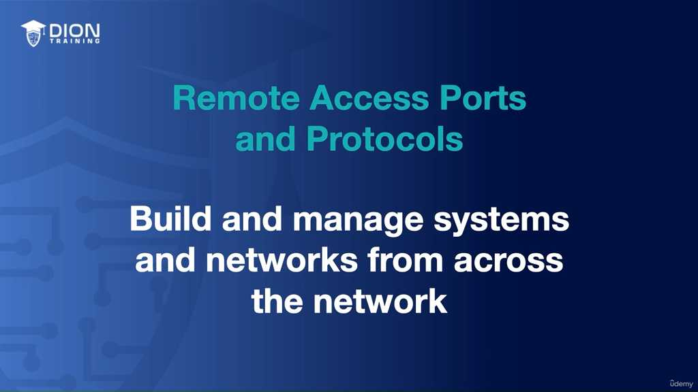

### 2. SSH (Secure Shell) – Tiêu chuẩn vàng của kết nối an toàn

SSH là giao thức chủ đạo được giới thiệu đầu tiên. Để hiểu sâu về SSH, cần nắm vững 3 trụ cột:

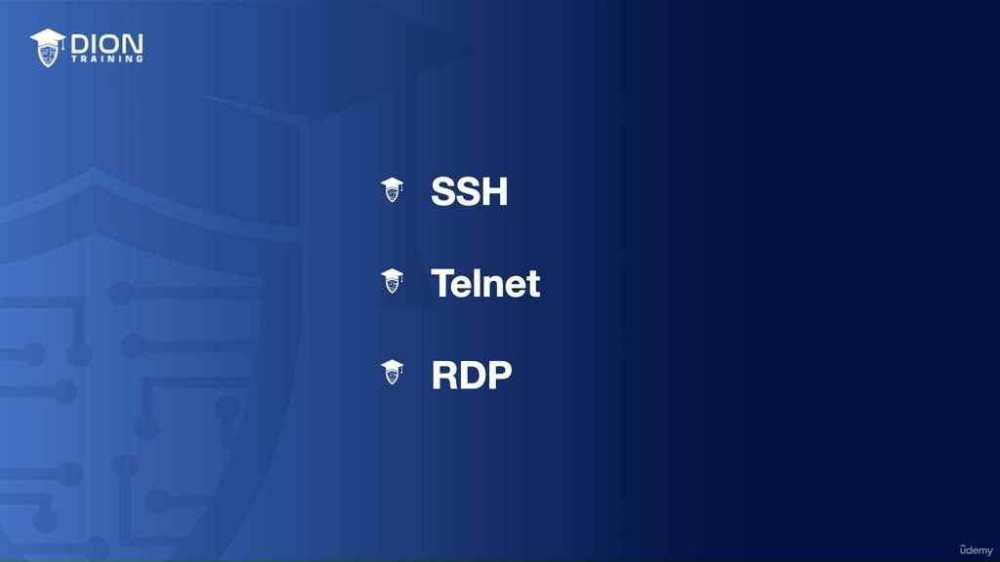

*   **Chức năng:** Tạo ra một "đường hầm" (tunnel) mã hóa, cho phép các dịch vụ mạng chạy trên môi trường không an toàn (như Internet công cộng) mà không bị lộ dữ liệu.

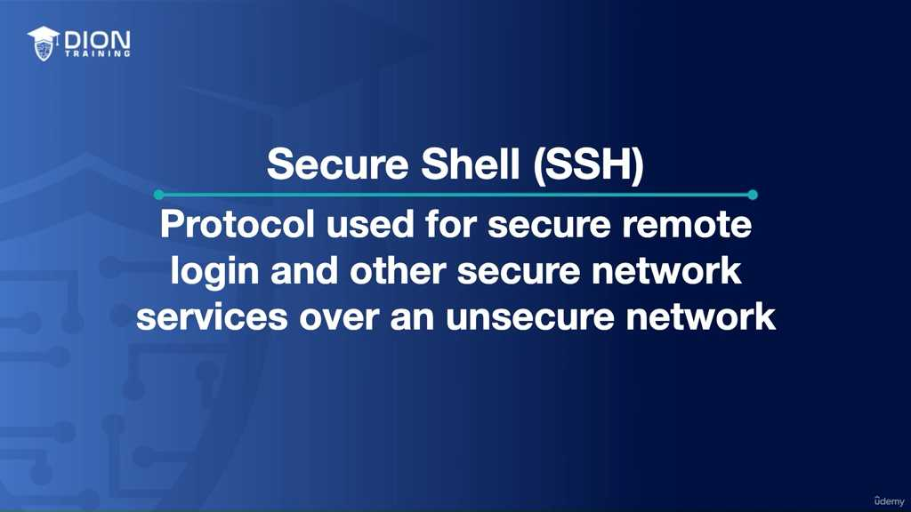

*   **Port:** SSH vận hành mặc định trên **cổng 22**.

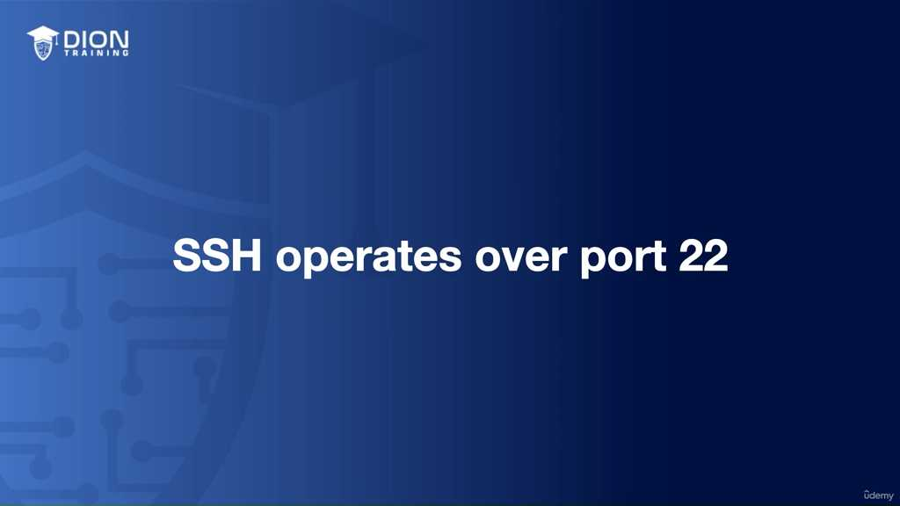

*   **Cơ chế:** Hoạt động theo mô hình Client-Server. Client yêu cầu kết nối, xác thực mạnh (thường bằng mật khẩu hoặc khóa công khai - public key), và toàn bộ nội dung sau đó được mã hóa.

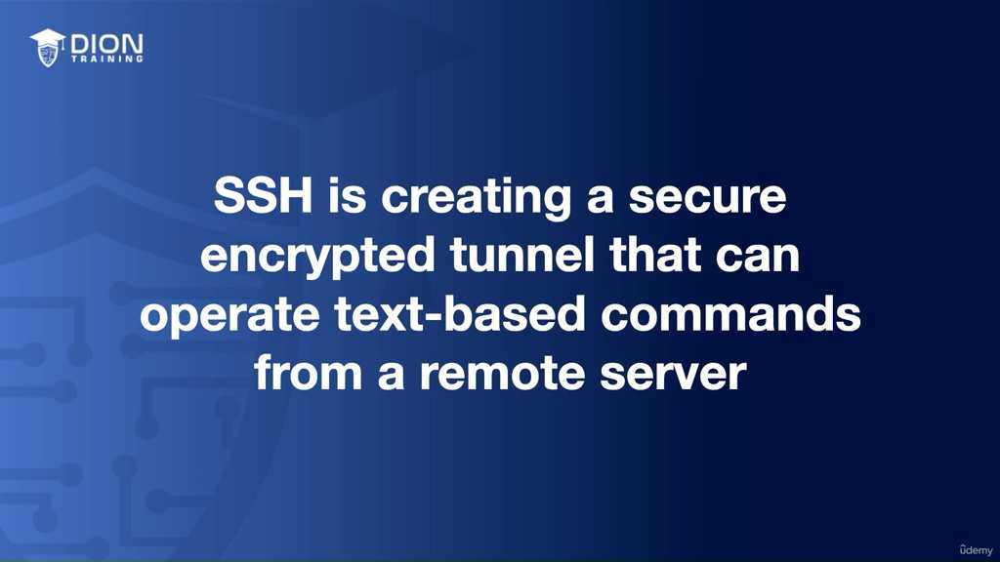

> **💡 Ví dụ nhớ đời:** Hãy tưởng tượng SSH giống như việc bạn gửi một bức thư quan trọng bên trong một chiếc két sắt kiên cố thay vì gửi bằng phong bì giấy thông thường. Mặc dù chiếc két sắt đó được vận chuyển bằng một chiếc xe tải đi qua khu phố đầy kẻ trộm (mạng không an toàn), nhưng những kẻ đó chỉ thấy một khối kim loại mà chúng không thể mở được. Nội dung bên trong (lệnh của bạn) vẫn an toàn tuyệt đối.

Việc SSH mã hóa dữ liệu là chìa khóa để chống lại các cuộc tấn công dạng "Man-in-the-Middle" (kẻ đứng giữa nghe lén), đảm bảo tính toàn vẹn và bảo mật của dữ liệu truyền tải.

### 3. Telnet – "Di sản" cũ và rủi ro tiềm ẩn

Ngược lại với SSH, Telnet (vận hành trên **cổng 23**) là một giao thức sơ khai.

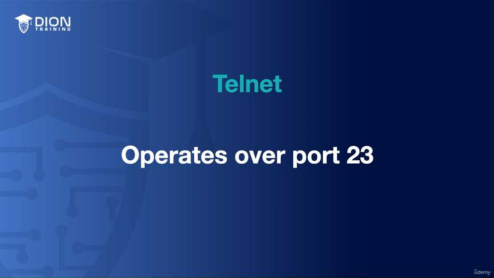

*   **Lịch sử:** Nó được thiết kế cho các mạng nội bộ (LAN) thời kỳ đầu khi mà sự tin tưởng giữa các thiết bị trong mạng là rất cao.

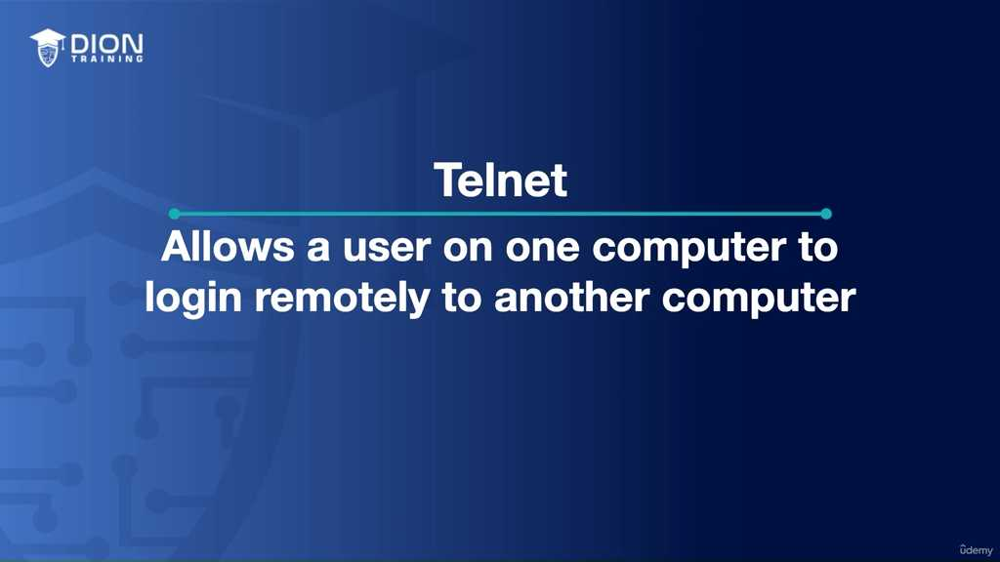

*   **Điểm yếu chết người:** Telnet truyền dữ liệu dưới dạng **văn bản thuần túy (plain text)**. Điều này có nghĩa là từ tên đăng nhập, mật khẩu, đến các lệnh cấu hình bạn gõ đều được gửi "trần trụi" trên dây dẫn.

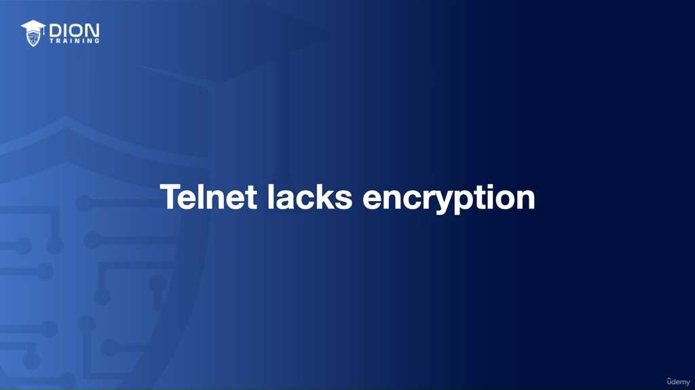

> **💡 Ví dụ nhớ đời:** Sử dụng Telnet giống như việc bạn đứng giữa một căn phòng đông người và hét to mật khẩu ngân hàng của mình cho một người ở góc phòng. Bất kỳ ai đi ngang qua hoặc đứng gần đó đều có thể nghe thấy rõ ràng. Trong thế giới mạng, những "kẻ đi ngang qua" này chính là các phần mềm gián điệp hoặc tin tặc đang thực hiện các cuộc tấn công nghe lén (eavesdropping) trên cùng phân đoạn mạng.

Vì lý do bảo mật này, Telnet đã bị coi là lỗi thời trong môi trường mạng hiện đại. Sự tồn tại của Telnet chủ yếu mang tính lịch sử hoặc phục vụ các thiết bị cũ (legacy systems) không hỗ trợ giao thức mã hóa.

### 4. Bảng so sánh nhanh các giao thức

| Đặc điểm | SSH (Secure Shell) | Telnet |
| :--- | :--- | :--- |
| **Port mặc định** | 22 | 23 |
| **Bảo mật** | Cao (mã hóa toàn bộ nội dung) | Thấp (không có mã hóa) |
| **Dạng truyền tải** | Mã hóa (Encrypted) | Văn bản thuần (Plain text) |
| **Khả năng bị nghe lén** | Gần như bằng 0 | Rất cao |
| **Mục đích hiện nay** | Quản trị từ xa an toàn | Chỉ dùng cho thiết bị cổ hoặc lab kiểm thử |

### 5. Tại sao SSH thay thế Telnet?
Đoạn transcript kết thúc với tiền đề về sự ra đời của SSH. SSH không chỉ đơn thuần là một giao thức quản trị, nó là câu trả lời cho sự thiếu hụt bảo mật trầm trọng của Telnet. Khi mạng lưới thế giới trở nên rộng lớn và Internet phát triển, việc truyền dữ liệu quản trị mà không có lớp bảo vệ là một "tự sát kỹ thuật". SSH được xây dựng để cung cấp mọi tính năng mà Telnet có, nhưng cộng thêm lớp "khiên bảo mật" cần thiết, biến nó thành lựa chọn duy nhất cho quản trị hệ thống chuyên nghiệp ngày nay.

Việc so sánh SSH và Telnet trong bối cảnh hiện đại cho thấy sự phân cấp rõ rệt về bảo mật. Dù Telnet có thể thực hiện các thao tác lệnh tương tự như SSH, nhưng toàn bộ luồng dữ liệu của Telnet đều ở dạng "trần" (plain text). Khi bạn sử dụng SSH, một "đường ống bảo mật" được thiết lập; mọi lệnh bạn gõ và mọi phản hồi từ máy chủ đều được bọc trong lớp mã hóa. Đây là lý do tại sao Telnet hiện nay chỉ nên tồn tại trong các bảo tàng công nghệ hoặc dùng để tương tác với các thiết bị mạng lỗi thời (legacy equipment) từ 20-30 năm trước – những thiết bị mà phần cứng của chúng quá yếu hoặc phần mềm quá cũ để hiểu được các thuật toán mã hóa của SSH.

> **💡 Ví dụ nhớ đời:** Hãy tưởng tượng việc gửi một bức thư. Telnet giống như việc bạn gửi một tấm bưu thiếp hở, nơi bất kỳ ai đi ngang qua (tấn công trung gian) đều có thể đọc được nội dung. SSH giống như việc bạn đặt bức thư đó vào một két sắt kiên cố, khóa lại bằng mật mã mà chỉ người nhận mới có chìa khóa. Ngay cả khi két sắt bị lấy cắp trên đường vận chuyển, kẻ trộm cũng không thể biết bên trong chứa gì.

Chuyển sang RDP (Remote Desktop Protocol), chúng ta bước vào một phạm trù khác biệt hoàn toàn: Giao diện đồ họa. Trong khi SSH và Telnet tập trung vào dòng lệnh (CLI - Command Line Interface), RDP là một giao thức độc quyền của Microsoft cho phép truyền tải hình ảnh màn hình thời gian thực. Điều này biến việc quản lý máy tính từ xa trở nên trực quan như thể bạn đang ngồi ngay trước màn hình máy đó. RDP hoạt động dựa trên cổng 3389 và được thiết kế linh hoạt để tương thích với nhiều cấu trúc mạng cũng như các giao thức LAN khác nhau.

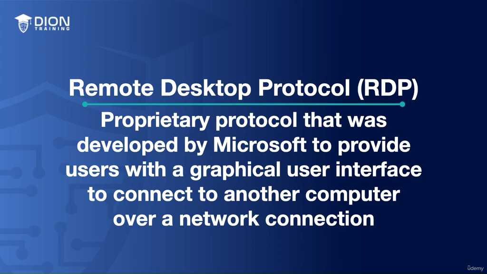

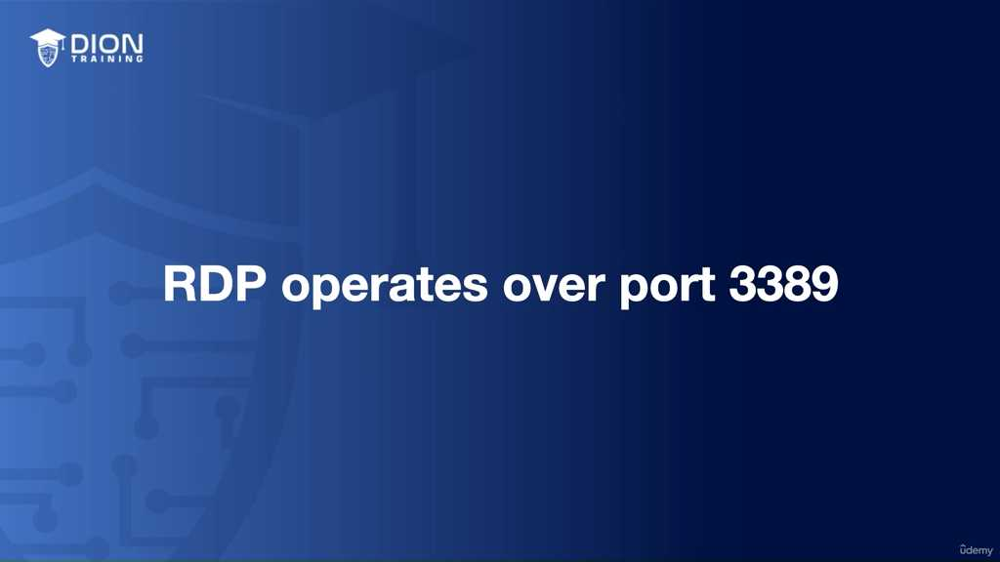

Điểm mạnh của RDP không chỉ dừng lại ở tính năng hiển thị đồ họa. Nó còn tích hợp các cơ chế bảo mật và tối ưu hóa chuyên sâu:
* **Mã hóa dữ liệu:** Giúp bảo vệ luồng hình ảnh và thông tin điều khiển khỏi sự dòm ngó.
* **Xác thực bằng thẻ thông minh (Smart card):** Tăng cường lớp bảo mật định danh, đảm bảo chỉ những người có thiết bị vật lý phù hợp mới có thể truy cập hệ thống.
* **Cơ chế giảm băng thông (Bandwidth reduction):** Đây là kỹ thuật cốt lõi giúp RDP hoạt động mượt mà ngay cả khi đường truyền internet của bạn không ổn định hoặc có tốc độ chậm, bằng cách tối ưu hóa các thay đổi trên màn hình thay vì gửi lại toàn bộ khung hình liên tục.

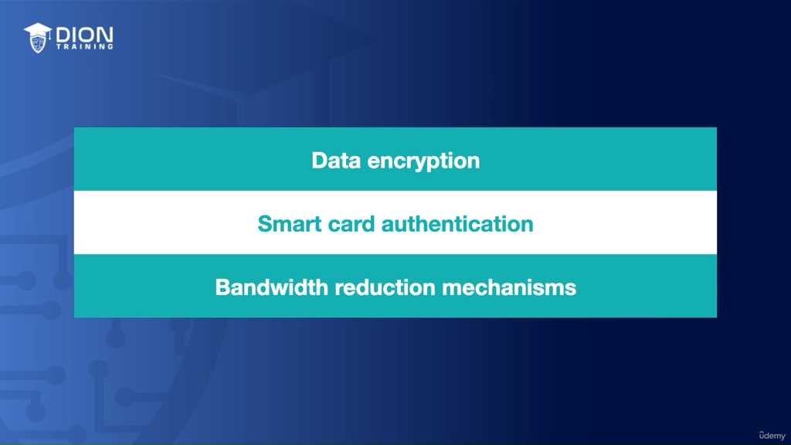

Trong kỷ nguyên điện toán đám mây, nơi các máy chủ thường đặt tại các trung tâm dữ liệu cách xa hàng nghìn cây số, việc hiểu rõ bộ ba SSH, Telnet và RDP là bắt buộc. Chúng là "cánh tay nối dài" cho các quản trị viên hệ thống:

* **SSH (Cổng 22):** Là lựa chọn tiêu chuẩn vàng cho quản lý dòng lệnh an toàn, giúp cấu hình hệ điều hành và phần mềm mà không để lộ thông tin xác thực.
* **Telnet (Cổng 23):** Một di sản cần được loại bỏ trừ khi không còn giải pháp thay thế, vì sự thiếu hụt mã hóa biến nó thành rủi ro bảo mật lớn nhất trong ba giao thức.
* **RDP (Cổng 3389):** Là công cụ không thể thiếu khi cần thao tác trên môi trường Desktop Windows hoặc các ứng dụng phụ thuộc vào giao diện người dùng.

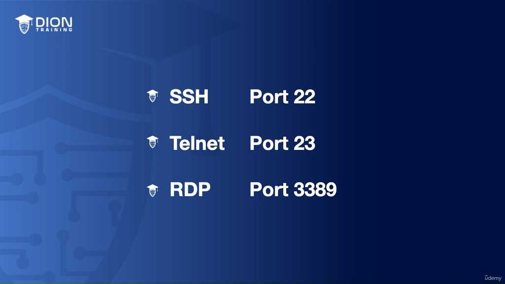

Tóm lại, việc lựa chọn giữa các giao thức này phải dựa trên hai yếu tố: yêu cầu bảo mật của hạ tầng (bạn có chấp nhận dữ liệu bị lộ không?) và yêu cầu thao tác (bạn cần gõ lệnh hay cần nhìn màn hình?). Một quản trị viên giỏi luôn biết cách chọn đúng "công cụ" cho đúng "công việc" để đảm bảo hệ thống vừa vận hành trơn tru, vừa được bảo vệ an toàn trước các mối đe dọa từ mạng internet công cộng.

Trong bối cảnh môi trường làm việc từ xa (remote working) và quản trị từ xa (remote management) đang trở thành tiêu chuẩn vận hành toàn cầu, việc thành thạo các giao thức truy cập không chỉ là một kỹ năng bổ trợ, mà đã trở thành năng lực cốt lõi đối với các chuyên gia IT và quản trị viên mạng.

Dưới đây là phân tích chi tiết về tầm quan trọng mang tính chiến lược của các giao thức này trong bối cảnh hiện đại:

### 1. Sự chuyển dịch tư duy trong quản trị hệ thống
Câu nói "As we continue to embrace remote working and management" phản ánh một sự thay đổi sâu sắc về tư duy. Trước đây, việc tiếp cận vật lý (physical access) với server được coi là tiêu chuẩn vàng về bảo mật và kiểm soát. Tuy nhiên, khi các doanh nghiệp chuyển dịch lên đám mây (cloud) hoặc mô hình làm việc phân tán, "địa điểm" của người quản trị trở nên không quan trọng bằng "cách thức" họ kết nối. Việc nắm vững SSH, Telnet, và RDP không chỉ đơn thuần là biết cách gõ lệnh, mà là biết cách bảo vệ "xương sống" của doanh nghiệp khi nó nằm ngoài tầm với vật lý của bạn.

> **💡 Ví dụ nhớ đời:** Hãy tưởng tượng bạn là một vị tướng cầm quân. Ngày xưa, bạn phải đứng trên đài chỉ huy (truy cập vật lý) để quan sát chiến trường. Ngày nay, bạn chỉ huy cả một sư đoàn từ một căn cứ hầm ngầm thông qua màn hình máy tính. Nếu đường truyền (giao thức) của bạn bị rò rỉ, đối phương sẽ biết toàn bộ kế hoạch tác chiến. Việc chọn giao thức an toàn (như SSH thay vì Telnet) cũng giống như việc sử dụng bộ đàm được mã hóa thay vì hét lớn ngoài sân, nơi bất kỳ ai cũng có thể nghe thấy mệnh lệnh của bạn.

### 2. Giao thức - "Vũ khí" sắc bén của người làm IT
Tác giả nhấn mạnh rằng các giao thức này "quan trọng hơn bao giờ hết". Điều này xuất phát từ thực tế là bề mặt tấn công (attack surface) của hệ thống đã mở rộng đáng kể. Khi bạn quản trị từ xa, bạn đang mở một "cánh cửa" từ internet vào hệ thống nội bộ. Nếu cánh cửa đó (giao thức) không được bảo mật (như việc vẫn dùng Telnet), bạn đang vô tình tạo điều kiện cho kẻ xấu thâm nhập mà không để lại dấu vết.

Trong tư duy của một IT chuyên nghiệp:
*   **SSH (Port 22):** Được coi là "pháo đài di động" cho mọi nhu cầu quản trị dựa trên dòng lệnh, đảm bảo tính toàn vẹn của dữ liệu truyền tải.
*   **RDP (Port 3389):** Là "kính hiển vi" cho phép bạn nhìn thấy và thao tác trên giao diện đồ họa, biến khoảng cách địa lý trở nên vô nghĩa.

### 3. Tầm quan trọng của sự bền bỉ trong việc học tập
Phần cuối của transcript nhắc nhở về một triết lý quan trọng trong ngành CNTT: "Learning a little each day adds up." Kiến thức về mạng máy tính không phải là thứ có thể học nhồi nhét một lúc là xong. Các giao thức, cổng (ports), và tiêu chuẩn bảo mật thường xuyên thay đổi hoặc bị thay thế bởi các tiêu chuẩn an toàn hơn. 

Đối với một quản trị viên mạng, sự khác biệt giữa một người "có thể kết nối" và một người "có thể kết nối an toàn" nằm ở chỗ họ hiểu sâu đến đâu về giao thức họ đang sử dụng. Việc dành thời gian mỗi ngày để cập nhật các phương thức xác thực, mã hóa và tối ưu hóa băng thông cho các giao thức này chính là cách duy nhất để duy trì năng lực cạnh tranh trong thị trường lao động công nghệ cao hiện nay.

Tóm lại, thông điệp xuyên suốt ở đây là: **Công cụ thì có sẵn, nhưng cách bạn sử dụng công cụ đó để bảo vệ tài sản số của doanh nghiệp mới là giá trị tạo nên sự khác biệt giữa một người thợ sửa máy và một kiến trúc sư hệ thống mạng thực thụ.**

---

## 🎯 Bí Kíp Ôn Thi Tốc Độ

**Mục tiêu:** Quản trị hệ thống/mạng từ xa (Remote Access).

### 1. SSH (Secure Shell)
*   **Port:** **22**
*   **Đặc điểm:** Bảo mật cao, mã hóa dữ liệu (encrypted tunnel).
*   **Giao diện:** Chỉ **dòng lệnh (text-based)**.
*   **Công dụng:** Thay thế Telnet, dùng để điều khiển server an toàn qua internet.

### 2. Telnet
*   **Port:** **23**
*   **Đặc điểm:** **Lỗi thời (legacy)**, truyền dữ liệu dạng **plain text** (không mã hóa).
*   **Rủi ro:** Dễ bị tấn công nghe lén (eavesdropping).
*   **Lời khuyên:** **KHÔNG NÊN DÙNG**, chỉ dùng cho thiết bị cũ không hỗ trợ SSH.

### 3. RDP (Remote Desktop Protocol)
*   **Port:** **3389**
*   **Nhà phát triển:** **Microsoft**.
*   **Giao diện:** **Đồ họa (GUI)** – nhìn thấy màn hình như đang ngồi trực tiếp.
*   **Tính năng:** Hỗ trợ mã hóa, xác thực smart card, quản lý Windows từ xa.

---
### 💡 Bảng So Sánh Nhanh

| Protocol | Port | Giao diện | Bảo mật |
| :--- | :--- | :--- | :--- |
| **SSH** | 22 | Dòng lệnh | Cao (Mã hóa) |
| **Telnet** | 23 | Dòng lệnh | Thấp (Plain text) |
| **RDP** | 3389 | Đồ họa (GUI) | Có hỗ trợ |

**Mẹo ghi nhớ:**
*   **SSH (22):** "Secure" = An toàn (Luôn chọn SSH).
*   **Telnet (23):** "Tệ" = Không dùng.
*   **RDP (3389):** "Remote Desktop" = Nhìn thấy màn hình (Đồ họa).

---
*Ghi chú: 12 hình ảnh minh họa (.jpg) đã được tải về và lưu tự động vào thư mục con `image/` cùng cấp với file này. Để ảnh hiển thị tự động, hãy đảm bảo bạn sao chép cả thư mục `image/` nếu bạn muốn di chuyển file markdown sang nơi khác!*
