# Network Ports and Protocols

### 1. Tổng quan về Network Service Ports và Protocols

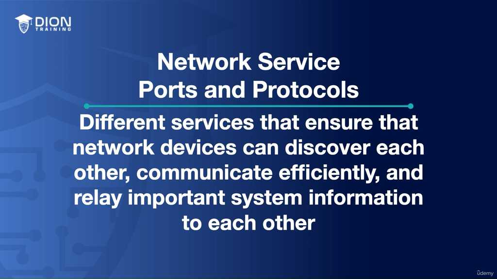

Các giao thức (protocols) và cổng dịch vụ (service ports) đóng vai trò như ngôn ngữ và địa chỉ nhà của các thiết bị mạng. Nếu ví mạng máy tính là một hệ thống giao thông khổng lồ, thì **giao thức** là luật lệ giao thông (quy định cách xe chạy, dừng, rẽ), còn **cổng dịch vụ** là các "cửa ngõ" cụ thể để các dịch vụ khác nhau tiếp nhận dữ liệu. Nếu không có sự phân loại qua các cổng này, máy tính sẽ rơi vào tình trạng "loạn thông tin" vì không biết gói tin nào dành cho duyệt web, gói tin nào dành cho gửi email hay quản lý hệ thống.

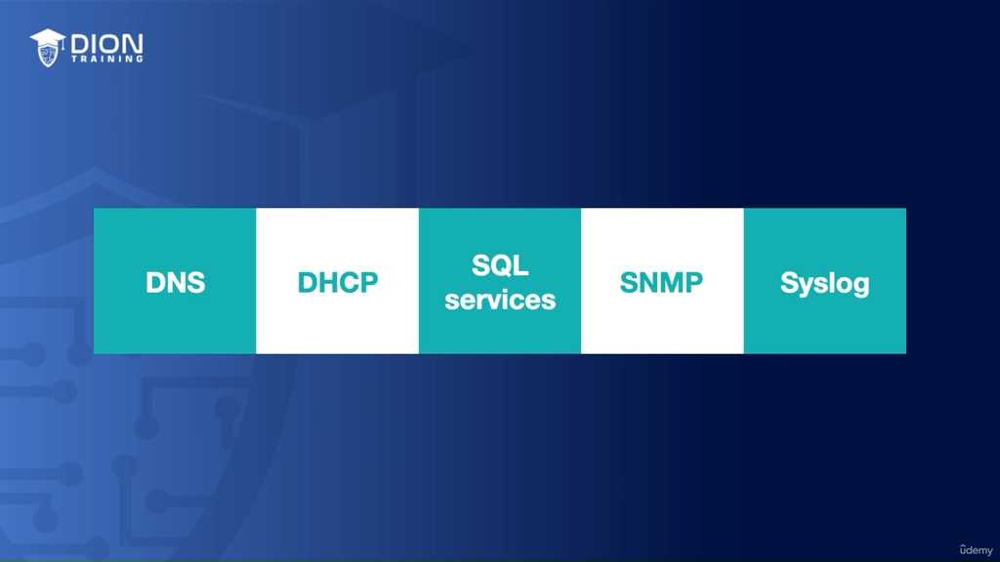

### 2. Hệ thống tên miền (DNS - Domain Name System)

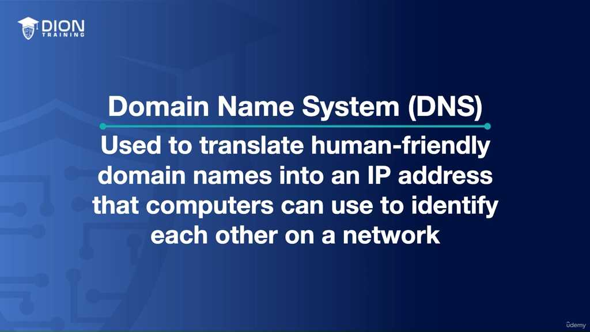

DNS được ví như "Danh bạ điện thoại của Internet". Con người sử dụng các tên miền (ví dụ: `diontraining.com`) để dễ ghi nhớ, nhưng máy tính lại giao tiếp với nhau bằng địa chỉ IP (dãy số như 192.168.1.1).

*   **Cơ chế hoạt động:** Khi bạn gõ một địa chỉ website, trình duyệt sẽ gửi yêu cầu tới máy chủ DNS. Máy chủ này đóng vai trò tra cứu tên miền đó ứng với địa chỉ IP nào và trả kết quả về cho máy tính của bạn.

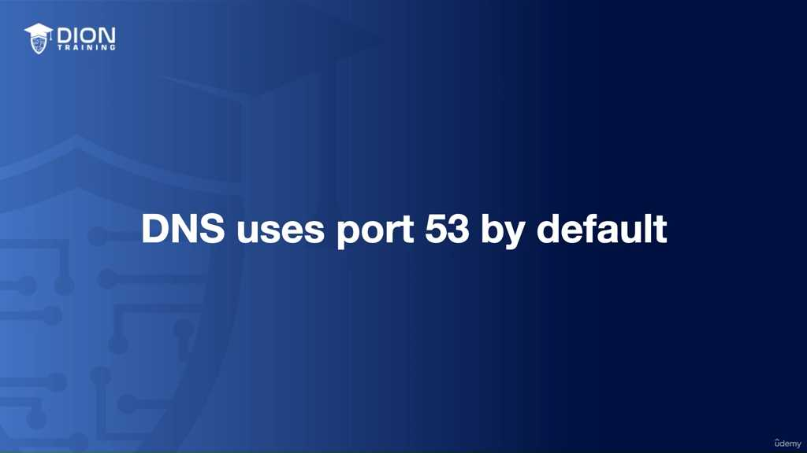

*   **Cổng 53:** Đây là "địa chỉ nhà" cố định mà mọi máy chủ DNS đều lắng nghe.
*   **Tính lưỡng tính của DNS (TCP & UDP):** Đây là điểm khác biệt thú vị.

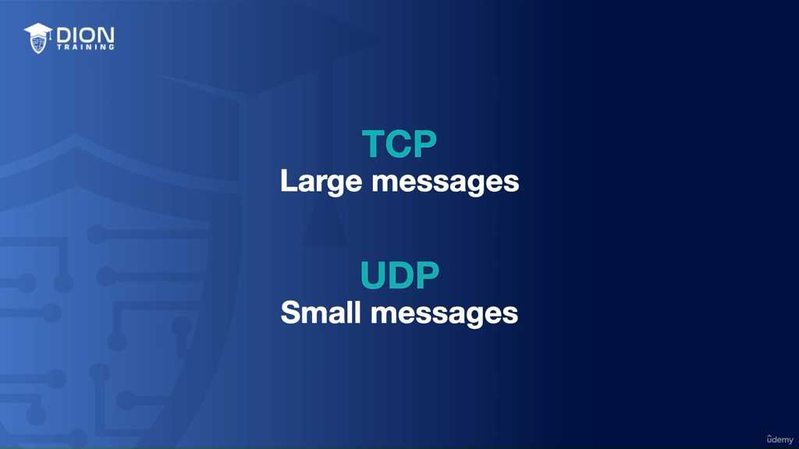

    *   **UDP:** Được dùng cho các truy vấn thông thường vì tính chất nhanh, không yêu cầu độ trễ cao (gửi đi và nhận lại là xong).
    *   **TCP:** Được dùng khi dữ liệu vượt quá kích thước một gói tin (packet), ví dụ như khi các máy chủ DNS cần đồng bộ hóa dữ liệu với nhau (zone transfer), đảm bảo tính toàn vẹn và chắc chắn của dữ liệu.

> **💡 Ví dụ nhớ đời:** Hãy tưởng tượng bạn muốn hỏi địa chỉ của một người bạn. Nếu bạn chỉ hỏi "Nhà anh A ở đâu?" (truy vấn ngắn), bạn dùng **UDP** cho nhanh. Nhưng nếu bạn yêu cầu "Hãy gửi cho tôi danh sách toàn bộ cư dân trong khu phố này để tôi lưu vào sổ" (dữ liệu lớn), bạn cần một cuộc hội thoại xác nhận rõ ràng, lúc này **TCP** giống như việc gửi một lá thư có ký nhận, đảm bảo không có bất kỳ cái tên nào bị bỏ sót.

### 3. Giao thức cấu hình máy chủ động (DHCP - Dynamic Host Configuration Protocol)

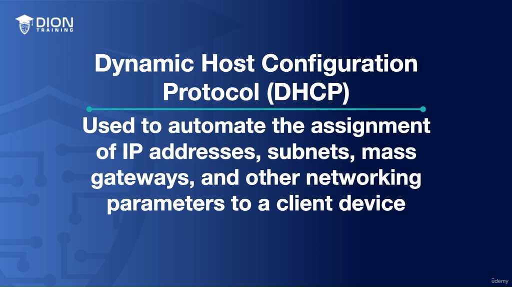

Việc cấu hình địa chỉ IP thủ công cho hàng trăm thiết bị trong một văn phòng là "cơn ác mộng" của quản trị viên. DHCP ra đời để tự động hóa việc gán địa chỉ IP, subnet mask, gateway... cho thiết bị ngay khi chúng kết nối vào mạng.

*   **Luồng dữ liệu (Port 67 và 68):**

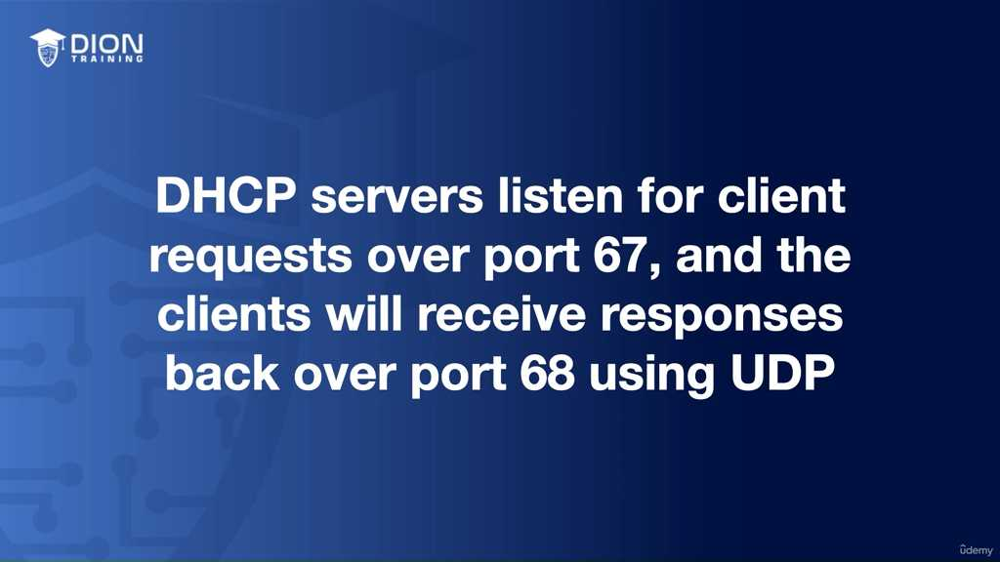

    *   **Máy chủ (Server):** Luôn "lắng nghe" ở cổng **67** để chờ các yêu cầu xin cấp IP từ thiết bị mới.
    *   **Máy trạm (Client):** Gửi yêu cầu và nhận thông tin cấu hình từ máy chủ thông qua cổng **68**.
*   **Giao thức vận chuyển:** Cả hai đều sử dụng **UDP**. Lý do là vì khi thiết bị chưa có IP, nó cần một phương thức liên lạc cực kỳ nhẹ nhàng và không cần thiết lập kết nối phức tạp (handshake) như TCP.

### 4. Dịch vụ SQL (Database Services)

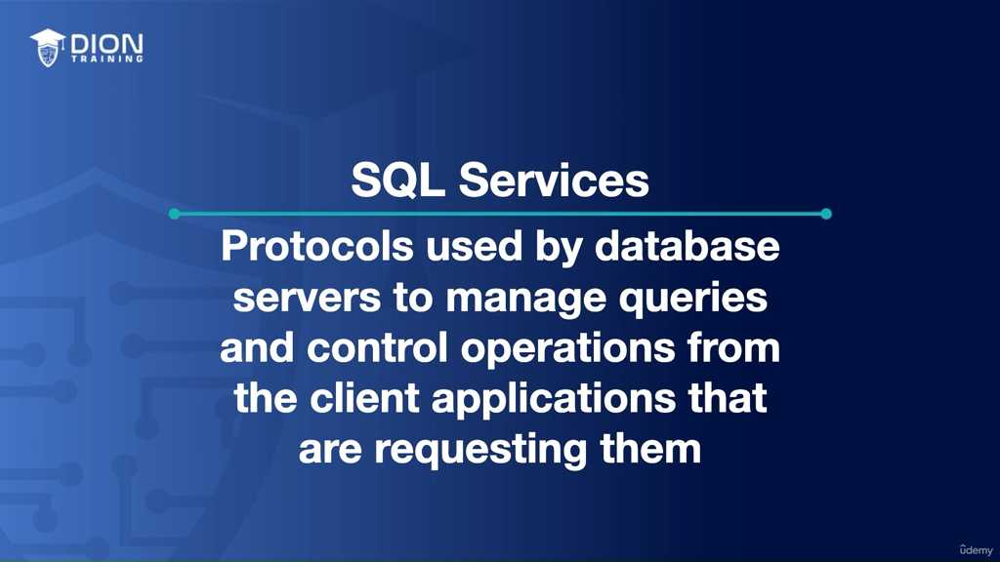

Dịch vụ SQL là trung tâm điều khiển nơi lưu trữ dữ liệu của các ứng dụng. Khác với DNS hay DHCP có cổng mặc định chung cho toàn thế giới, các dịch vụ SQL (như Microsoft SQL Server, MySQL, Oracle, PostgreSQL) thường sử dụng các cổng khác nhau tùy vào cấu hình và nhà sản xuất. Điều này được thực hiện vì mục đích bảo mật (thay đổi cổng để tránh các cuộc tấn công tự động nhắm vào cổng mặc định) hoặc để tránh xung đột trên cùng một máy chủ.

*   **Microsoft SQL Server:** Thường sử dụng cổng 1433 theo mặc định.

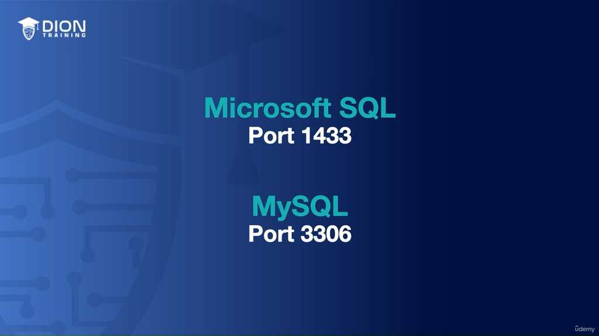

*   **MySQL:** Thường sử dụng cổng 3306.

> **💡 Ví dụ nhớ đời:** Hãy coi SQL là một thư viện lớn. Bạn là người đọc (Client), muốn tìm tài liệu trong đó. Mỗi thư viện (hãng SQL) có thể chọn cửa vào khác nhau: Thư viện Microsoft có cửa chính ở cổng 1433, thư viện MySQL lại có cửa chính ở cổng 3306. Việc biết được "số cửa" này là chìa khóa để ứng dụng của bạn có thể "gõ cửa" và truy xuất được thông tin cần thiết từ kho dữ liệu khổng lồ đó. Nếu bạn gõ sai cổng, hệ thống sẽ coi như bạn đang đứng ngoài đường và không có kết nối nào được thiết lập.

Tiếp nối phần trước, chúng ta đi sâu vào các giao thức quản trị và ghi nhật ký hệ thống:

### 1. Microsoft SQL Server (Port 1433) và MySQL (Port 3306)
Trong phần trước, chúng ta đã nhắc đến SQL services như một hệ thống quản trị cơ sở dữ liệu. Cụ thể, **Microsoft SQL Server** mặc định lắng nghe các yêu cầu kết nối từ ứng dụng trên **cổng 1433**. Trong khi đó, **MySQL** – một hệ thống quản trị cơ sở dữ liệu mã nguồn mở phổ biến – lại chọn **cổng 3306**.

Các cổng này không chỉ đóng vai trò là "cửa ngõ" để người dùng truy vấn dữ liệu, mà còn là nơi quản trị viên thực hiện các thao tác quản trị hệ thống từ xa. Việc phân tách cổng giữa các nhà cung cấp khác nhau giúp các ứng dụng trên cùng một máy chủ có thể biết chính xác cần "gõ cửa" vào dịch vụ nào.

### 2. Giao thức quản trị mạng SNMP (Simple Network Management Protocol)

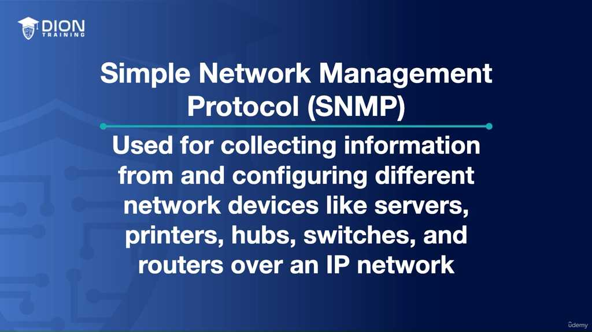

SNMP là "bộ não" giúp quản trị viên giám sát tình trạng sức khỏe của cả một hệ thống mạng. Nó được thiết kế để thu thập thông tin và cấu hình cho các thiết bị mạng đa dạng như máy chủ, máy in, hub, switch và router.

Điểm đặc biệt của SNMP là sử dụng hai cổng khác nhau dựa trên giao thức truyền tải UDP (User Datagram Protocol):

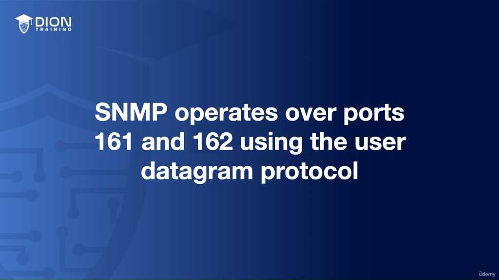

*   **Cổng 161 (SNMP Managers - Polling):** Đây là cổng để quản trị viên chủ động "hỏi" thiết bị. SNMP Manager sẽ gửi yêu cầu tới các SNMP Agent trên thiết bị đích để lấy thông tin trạng thái. Hành động này gọi là *polling* (thăm dò).

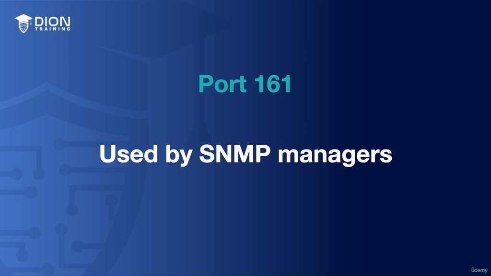

*   **Cổng 162 (SNMP Agents - Traps):** Đây là cơ chế phản hồi bị động. Khi thiết bị gặp sự cố hoặc xảy ra một sự kiện bất thường (ví dụ: nhiệt độ máy chủ quá cao hoặc một cổng switch bị sập), thiết bị sẽ tự động gửi một thông điệp "cảnh báo" (gọi là *trap*) về phía quản trị viên mà không cần chờ được hỏi.

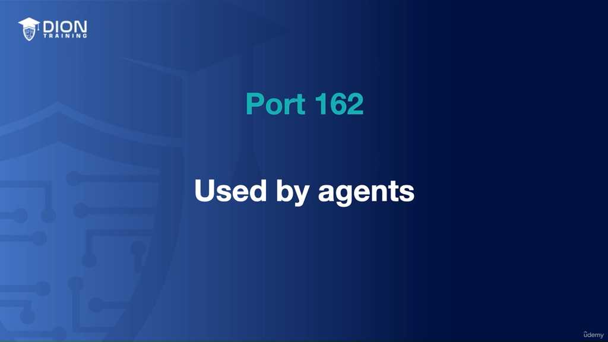

> **💡 Ví dụ nhớ đời:** Hãy tưởng tượng SNMP giống như việc quản lý một tòa nhà cao tầng. **Cổng 161** giống như việc bảo vệ đi từng phòng kiểm tra xem mọi thứ ổn không (chủ động). Còn **cổng 162** giống như việc lắp một thiết bị báo cháy; khi có khói, thiết bị đó tự động hú vang lên báo cho trung tâm điều khiển biết ngay lập tức (bị động).

SNMP cực kỳ quan trọng đối với các kỹ sư mạng để thực hiện chẩn đoán lỗi và giám sát hiệu năng theo thời gian thực.

### 3. Giao thức nhật ký hệ thống Syslog (Port 514)

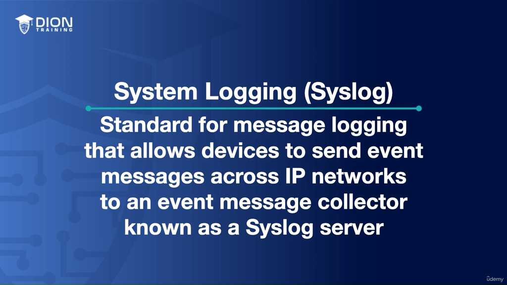

Syslog là tiêu chuẩn công nghiệp cho việc ghi lại mọi sự kiện diễn ra trong hệ thống. Nếu bạn muốn biết ai đã đăng nhập, tiến trình nào bị lỗi, hay cấu hình nào vừa bị thay đổi, Syslog chính là nơi lưu giữ toàn bộ lịch sử đó.

Các thiết bị sẽ gửi thông tin về một máy chủ trung tâm gọi là **Syslog Server**. Tại đây, các dòng log sẽ được lưu trữ, xử lý hoặc chuyển tiếp theo quy định bảo mật của công ty.

*   **Tính linh hoạt của Syslog:**

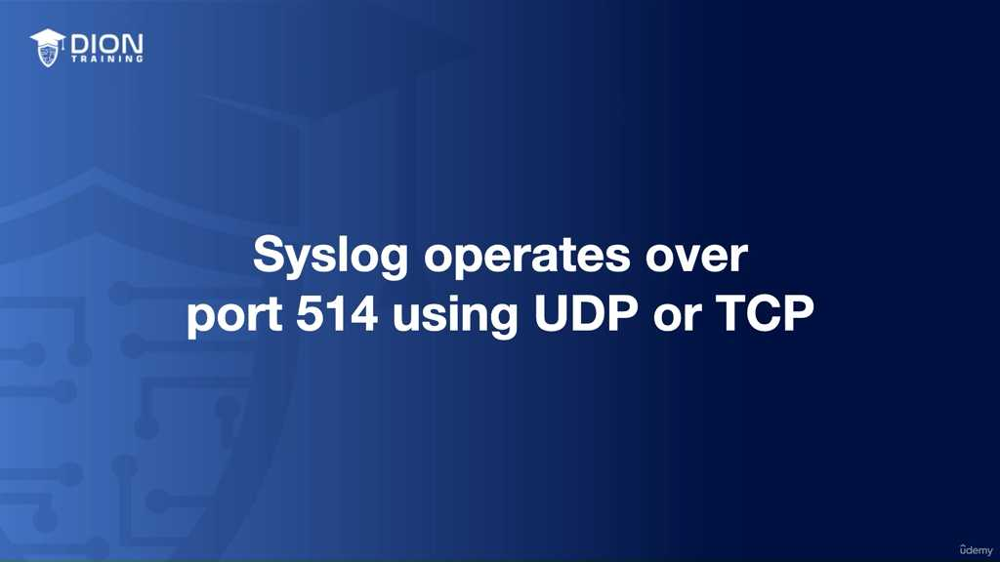

    *   Mặc định, Syslog sử dụng **UDP** trên **cổng 514**. Ưu điểm của UDP là tốc độ cực nhanh, phù hợp cho việc truyền tải thông tin log thông thường mà không cần xác nhận quá khắt khe.
    *   Tuy nhiên, nếu môi trường đòi hỏi độ tin cậy tuyệt đối (không được mất bất kỳ dòng log nào), quản trị viên có thể chuyển sang dùng **TCP** trên cùng cổng 514. Việc dùng TCP sẽ yêu cầu bắt tay ba bước (3-way handshake), đảm bảo dữ liệu chắc chắn đã đến đích.

### 4. Tổng kết các dịch vụ mạng trọng yếu
Để hệ thống hoạt động trơn tru, bạn cần ghi nhớ "danh mục" các giao thức cốt lõi sau:
*   **DNS (Port 53):** Cuốn danh bạ khổng lồ, chuyển đổi tên miền sang IP.
*   **DHCP (Ports 67, 68):** Nhân viên hành chính tự động cấp phát địa chỉ IP cho mọi thiết bị trong mạng.
*   **SQL (Ports 1433, 3306):** Thủ kho dữ liệu, nơi lưu giữ thông tin của ứng dụng.
*   **SNMP (Ports 161, 162):** Đội ngũ giám sát sức khỏe thiết bị 24/7.
*   **Syslog (Port 514):** Cuốn nhật ký ghi lại mọi dấu vết trong hệ thống.

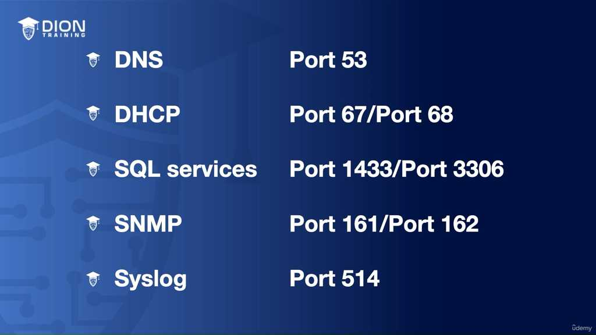

Việc nắm vững các cổng và giao thức này không chỉ là kiến thức lý thuyết, mà là "bản đồ sinh tồn" để bạn có thể định vị, xử lý sự cố và vận hành bất kỳ hạ tầng mạng chuyên nghiệp nào.

Tiếp nối nội dung về các dịch vụ mạng, đoạn transcript này hệ thống hóa lại các giá trị port tiêu chuẩn và nhấn mạnh vào tính linh hoạt của giao thức truyền tải trong các tình huống thực tế.

### 1. Tổng kết các cổng dịch vụ cơ sở dữ liệu (SQL Services)
Đoạn trích nhắc lại hai cột trụ chính trong quản trị dữ liệu: **Microsoft SQL Server (Port 1433)** và **MySQL Server (Port 3306)**. Mặc dù đây là các cổng mặc định, trong môi trường quản trị mạng thực tế, việc nhớ các con số này không chỉ để kiểm tra lý thuyết, mà là để cấu hình các thiết bị bảo mật (như Firewall).

> **💡 Ví dụ nhớ đời:** Hãy tưởng tượng các Port giống như "số phòng" trong một khách sạn lớn (Server). Nếu bạn muốn gửi tài liệu cho bộ phận Kế toán (MySQL), bạn phải gõ đúng cửa phòng 3306. Nếu bạn gõ nhầm sang phòng 1433 (MS SQL), bạn sẽ không nhận được bất kỳ phản hồi nào, hoặc tệ hơn là gửi nhầm dữ liệu vào hệ thống không hiểu ngôn ngữ của bạn. Việc nắm vững số phòng giúp bạn định hướng đúng luồng lưu thông dữ liệu giữa các ứng dụng và máy chủ.

### 2. Chi tiết chuyên sâu về SNMP (Simple Network Management Protocol)
Dù định nghĩa đã được làm rõ ở phần trước, đoạn này nhấn mạnh vào sự phân tách chức năng giữa hai cổng 161 và 162. Đây là một cơ chế "hỏi - đáp" thông minh:
*   **Port 161 (Polling - Chủ động):** Đây là quá trình quản trị viên "chủ động" hỏi thiết bị: "Tình trạng CPU của bạn thế nào?". Quá trình này được gọi là thăm dò (polling).
*   **Port 162 (Trap - Bị động/Khẩn cấp):** Đây là cơ chế "báo động". Thiết bị không đợi hỏi mà tự động gửi cảnh báo nếu xảy ra lỗi (ví dụ: nhiệt độ quá cao, giao diện mạng bị ngắt).

### 3. Syslog: Sự linh hoạt giữa UDP và TCP
Điểm then chốt ở đây là sự lựa chọn giao thức truyền tải dựa trên độ ưu tiên giữa **Tốc độ** và **Độ tin cậy**:
*   **Mặc định qua UDP (Port 514):** UDP là giao thức "best-effort" (cố gắng hết sức). Nó cực kỳ nhanh vì không cần thiết lập kết nối trước (handshake). Trong môi trường mạng lớn với hàng nghìn thiết bị gửi log mỗi giây, việc sử dụng UDP giúp giảm thiểu tắc nghẽn đáng kể.
*   **Sử dụng TCP như một giải pháp dự phòng:** Khi tính toàn vẹn của dữ liệu quan trọng hơn tốc độ (ví dụ: log của các máy chủ tài chính hoặc an ninh cần phải đảm bảo không thiếu sót một dòng nào), chúng ta chuyển sang TCP. TCP đảm bảo rằng gói tin log đã được Syslog server nhận thành công nhờ cơ chế xác nhận (acknowledgment).

> **💡 Ví dụ nhớ đời:** Hãy coi việc gửi log qua UDP giống như gửi một tờ rơi quảng cáo trên phố: nhanh, số lượng lớn, nhưng bạn không biết chắc người nhận có cầm được tờ rơi đó hay không. Trong khi đó, gửi log qua TCP giống như gửi một lá thư bảo đảm qua bưu điện: bạn mất thời gian hơn để điền đơn và chờ đợi, nhưng bạn nhận được xác nhận rằng lá thư chắc chắn đã đến tay người nhận. Nếu log đó là thông tin về một vụ đột nhập mạng, bạn chắc chắn muốn chọn phương thức "thư bảo đảm" (TCP).

### 4. Tầm quan trọng của danh mục Port trong vận hành
Cuối đoạn trích nhấn mạnh rằng việc ghi nhớ các cổng (như DNS 53, DHCP 67/68, SQL 1433/3306) không chỉ là học vẹt. Đối với một kỹ thuật viên mạng, đây là "bản đồ địa chỉ". Khi hệ thống gặp sự cố, việc xác định đúng dịch vụ đang bị nghẽn thông qua port giúp rút ngắn thời gian xử lý sự cố (troubleshooting) từ hàng giờ xuống còn vài phút. Bạn cần hiểu rõ mục đích của từng port để đảm bảo chúng được mở trên tường lửa đúng lúc, đúng chỗ và đảm bảo tính bảo mật tối đa cho hạ tầng mạng.

---

## 🎯 Bí Kíp Ôn Thi Tốc Độ

**1. DNS (Domain Name System) – "Danh bạ Internet"**
*   **Chức năng:** Phân giải tên miền (domain) sang địa chỉ IP.
*   **Port:** 53.
*   **Giao thức:** UDP (truy vấn nhanh), TCP (truy vấn lớn/zone transfer).

**2. DHCP (Dynamic Host Configuration Protocol) – "Tự động cấu hình"**
*   **Chức năng:** Cấp phát IP, subnet mask, gateway tự động.
*   **Port:** 67 (Server nhận), 68 (Client nhận).
*   **Giao thức:** UDP.

**3. SQL Services – "Truy vấn dữ liệu"**
*   **Microsoft SQL Server:** Port 1433.
*   **MySQL:** Port 3306.

**4. SNMP (Simple Network Management Protocol) – "Giám sát thiết bị"**
*   **Chức năng:** Quản lý, cấu hình và thu thập trạng thái (switch, router, printer).
*   **Port 161:** Polling (Quản lý hỏi thiết bị).
*   **Port 162:** Traps (Thiết bị chủ động báo lỗi/cảnh báo).
*   **Giao thức:** UDP.

**5. Syslog (System Logging) – "Nhật ký hệ thống"**
*   **Chức năng:** Gửi log sự kiện về server trung tâm.
*   **Port:** 514.
*   **Giao thức:** UDP (Mặc định) hoặc TCP (Khi cần độ tin cậy cao).

---
**💡 Bảng tra cứu nhanh:**

| Dịch vụ | Port | Giao thức | Công dụng |
| :--- | :--- | :--- | :--- |
| **DNS** | 53 | UDP/TCP | Tên miền -> IP |
| **DHCP** | 67/68 | UDP | Cấp phát IP tự động |
| **MS SQL** | 1433 | TCP | Database MS |
| **MySQL** | 3306 | TCP | Database MySQL |
| **SNMP** | 161/162 | UDP | Quản lý/Giám sát |
| **Syslog** | 514 | UDP/TCP | Lưu nhật ký hệ thống |

---
*Ghi chú: 17 hình ảnh minh họa (.jpg) đã được tải về và lưu tự động vào thư mục con `image/` cùng cấp với file này. Để ảnh hiển thị tự động, hãy đảm bảo bạn sao chép cả thư mục `image/` nếu bạn muốn di chuyển file markdown sang nơi khác!*
