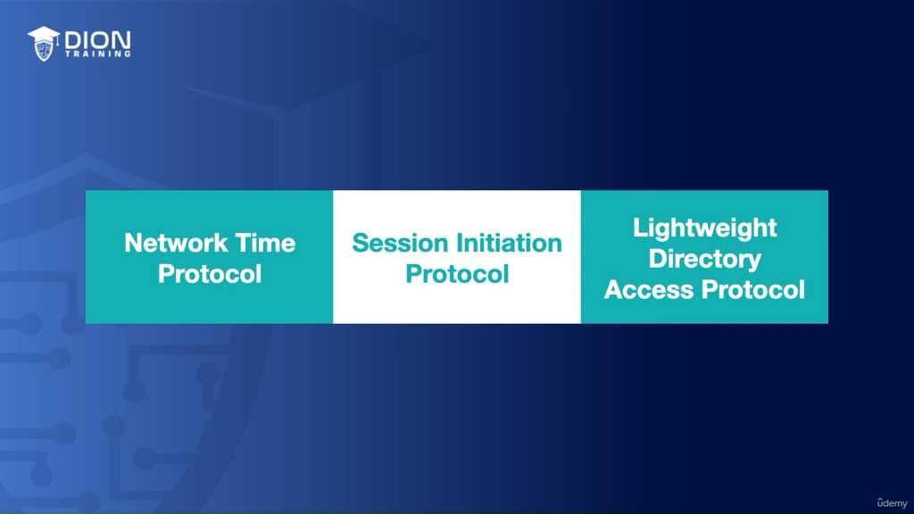
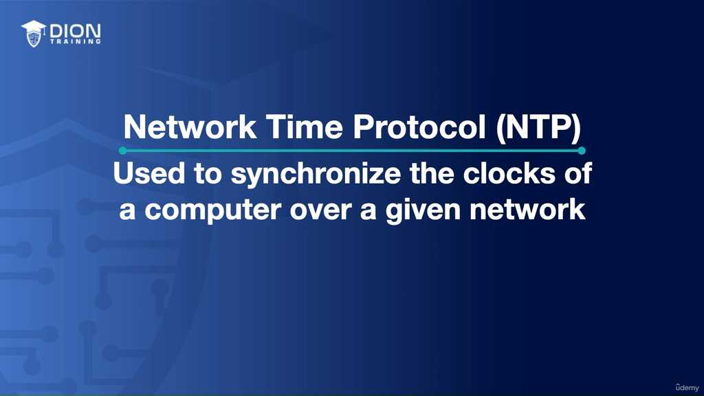
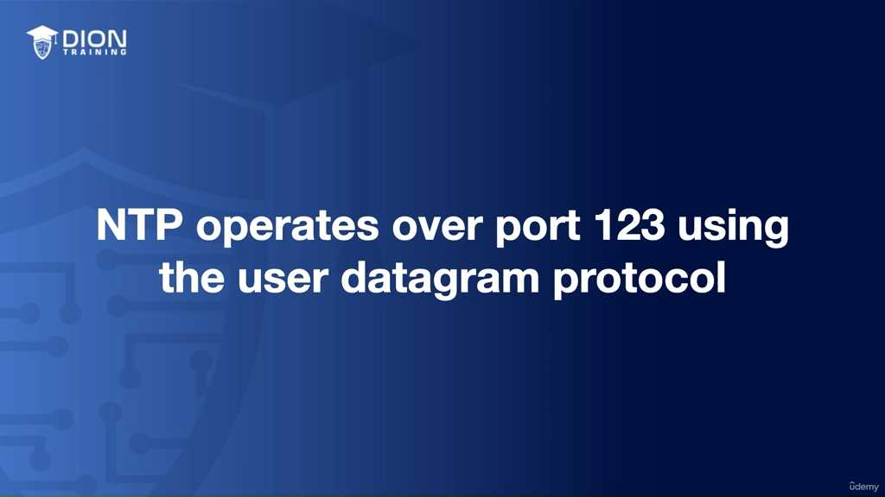
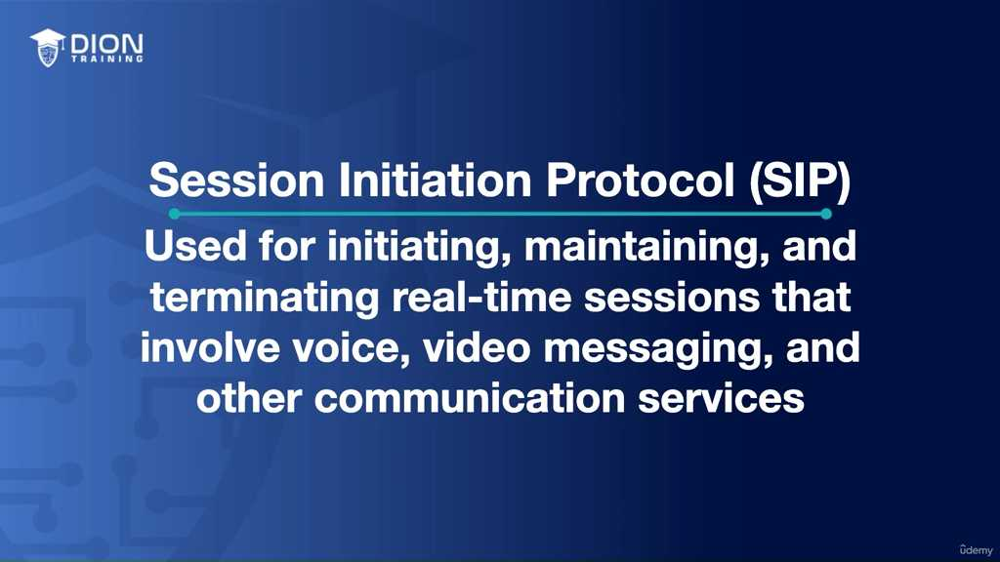
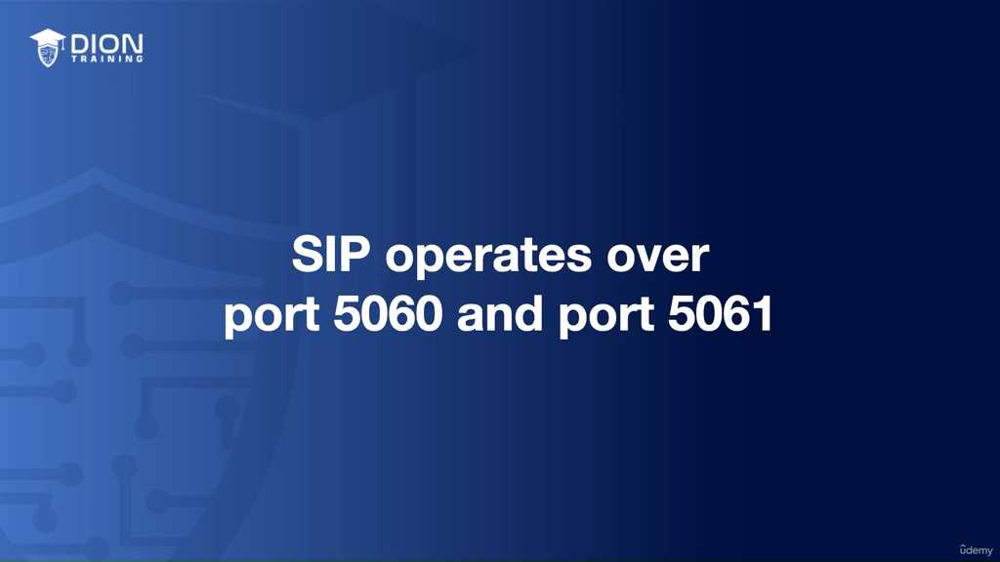
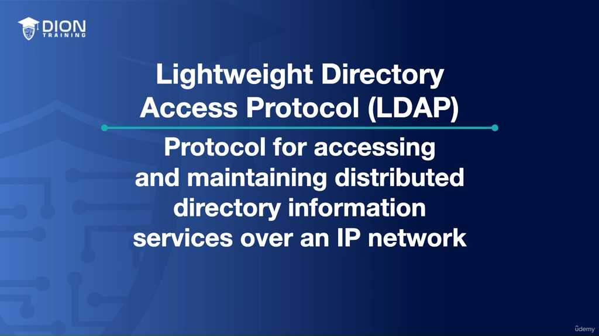
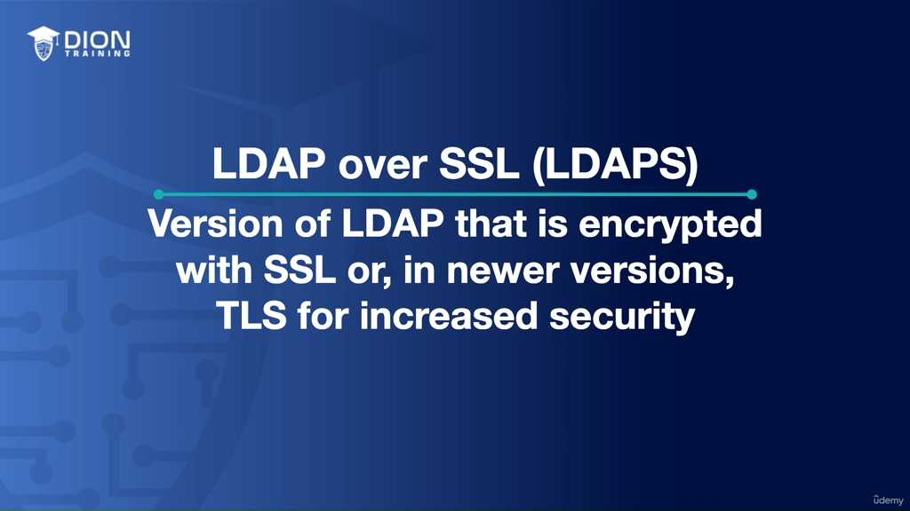
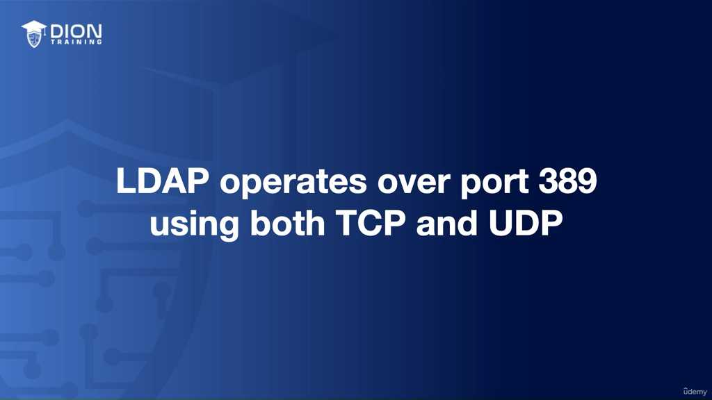
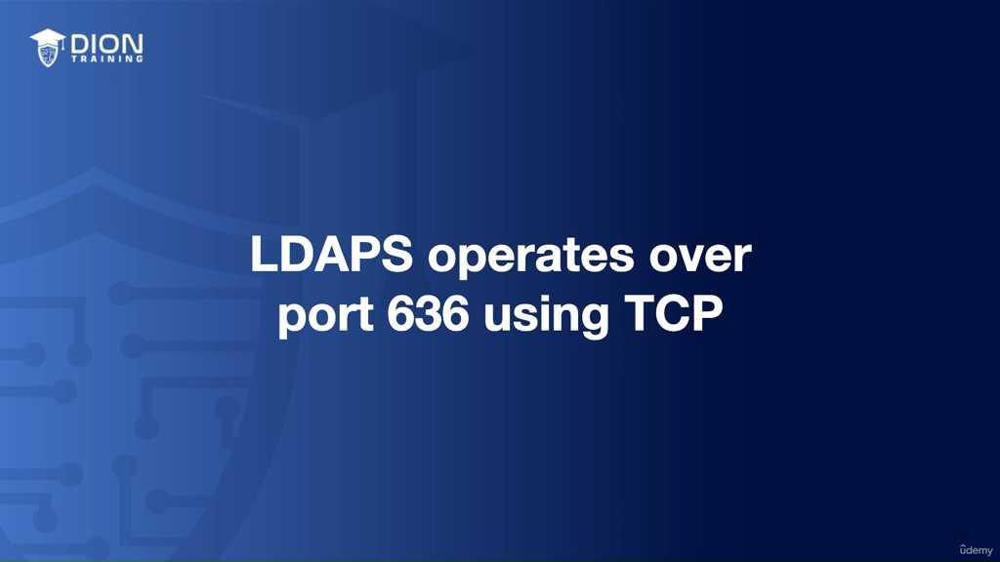
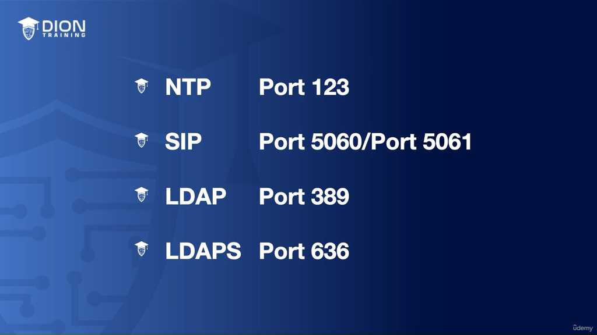

# Network Services and Protocols

### Phân tích chuyên sâu về các giao thức dịch vụ mạng cốt lõi

Bài học này tập trung vào bộ ba giao thức nền tảng giúp duy trì tính nhất quán, khả năng kết nối và quản trị thông tin trong một hạ tầng mạng phân tán.

#### 1. Network Time Protocol (NTP) - "Nhịp đập" của mạng

NTP không chỉ đơn thuần là việc hiển thị giờ trên màn hình máy tính. Trong môi trường mạng, thời gian là thước đo chuẩn xác để đánh giá tính hợp lệ của mọi sự kiện.

*   **Cơ chế hoạt động:** NTP vận hành trên **Cổng 123** và sử dụng **UDP (User Datagram Protocol)**. Việc sử dụng UDP thay vì TCP là một lựa chọn chiến lược vì NTP cần tốc độ phản hồi nhanh, không yêu cầu độ trễ do quá trình bắt tay (handshake) như TCP.

*   **Tại sao đồng bộ thời gian lại sống còn?** Các hệ thống hiện đại dựa vào "Timestamp" (dấu thời gian) để đánh giá thứ tự các gói tin. Nếu thời gian giữa máy khách (client) và máy chủ (server) lệch nhau quá nhiều, các cơ chế bảo mật (như chứng chỉ số, Kerberos trong Active Directory) sẽ thất bại ngay lập tức vì hệ thống coi đó là hành vi tấn công giả mạo (replay attack).

> **💡 Ví dụ nhớ đời:** Hãy tưởng tượng bạn và bạn của bạn đang dàn dựng một vở kịch hoành tráng ở hai sân khấu cách xa nhau hàng ngàn dặm. Nếu đồng hồ của hai người lệch nhau chỉ vài phút, bạn sẽ mở màn trong khi bạn mình vẫn đang thay đồ. Trong thế giới mạng, nếu máy chủ nghĩ rằng sự kiện xảy ra vào lúc 10:00 nhưng máy khách lại báo cáo là 10:05, toàn bộ các quy trình bảo mật sẽ coi đây là một sự xung đột dữ liệu và "đóng cửa" không cho bạn truy cập. NTP chính là chiếc đồng hồ nguyên tử giúp tất cả mọi người trên sân khấu toàn cầu cùng "bật đèn" vào một giây duy nhất.

#### 2. Session Initiation Protocol (SIP) - "Người điều phối" giao tiếp

SIP là kiến trúc sư đằng sau các ứng dụng thời gian thực. Nó không mang dữ liệu âm thanh/video đi trực tiếp, mà nó đóng vai trò thiết lập "cuộc gọi".

*   **Phân tầng cổng kết nối:**
    *   **Cổng 5060 (UDP/TCP):** Dành cho tín hiệu không mã hóa (unencrypted). Đây là trạng thái mặc định cho các kết nối nội bộ hoặc nơi chưa yêu cầu bảo mật cao.
    *   **Cổng 5061 (TCP):** Dành cho tín hiệu đã mã hóa thông qua **TLS (Transport Layer Security)**. Đây là tiêu chuẩn vàng để bảo vệ nội dung cuộc gọi khỏi việc bị nghe lén (eavesdropping).

*   **Chức năng:** SIP quản lý vòng đời của một phiên giao tiếp: từ lúc bắt đầu (initiate), duy trì (maintain) và kết thúc (terminate). Nếu không có SIP, các ứng dụng VoIP (như Zoom, Microsoft Teams, hay tổng đài IP) sẽ không biết làm thế nào để tìm thấy đối phương trong mạng lưới rộng lớn.

> **💡 Ví dụ nhớ đời:** Hãy nghĩ về SIP như một "tổng đài viên" thời xưa. Khi bạn muốn gọi cho ai đó, tổng đài viên sẽ kết nối đường dây, kiểm tra xem người kia có máy không, và khi bạn kết thúc, họ sẽ rút phích cắm để trả lại đường truyền. SIP thực hiện đúng nhiệm vụ đó trong thế giới số: nó không phải là giọng nói của bạn, nó là người kết nối bạn với đối phương trước khi cuộc trò chuyện thực sự bắt đầu.

#### 3. Lightweight Directory Access Protocol (LDAP) - "Thư mục vàng" của doanh nghiệp

LDAP đóng vai trò là giao thức truy vấn các cơ sở dữ liệu phân tán, nơi chứa thông tin người dùng, máy tính, và quyền truy cập.

*   **Bản chất:** LDAP được thiết kế để "nhẹ" (Lightweight) so với các giao thức truy cập thư mục truyền thống (như X.500), giúp việc tìm kiếm thông tin trở nên cực nhanh.
*   **Mục đích:** Nó cho phép các quản trị viên quản lý hàng triệu tài khoản người dùng một cách tập trung. Khi bạn đăng nhập vào máy tính công ty, máy tính đó không kiểm tra mật khẩu trong máy cục bộ, mà nó gửi một truy vấn LDAP đến máy chủ trung tâm (Domain Controller) để hỏi: "Người dùng này có đúng mật khẩu không và họ có quyền gì?".

> **💡 Ví dụ nhớ đời:** LDAP giống như một "Danh bạ điện thoại khổng lồ" của một tập đoàn đa quốc gia. Thay vì bạn phải tự tìm kiếm thông tin của hàng nghìn nhân viên trên từng mảnh giấy rời rạc, bạn chỉ cần gọi tên và vị trí (truy vấn LDAP), thư mục sẽ ngay lập tức trả về số điện thoại, email và chức vụ của người đó. Đó là trung tâm dữ liệu định danh giúp doanh nghiệp vận hành trơn tru mà không bị rối loạn về quyền truy cập.

Trong đoạn transcript này, trọng tâm chuyển dịch từ định nghĩa sang việc phân tích sâu về tính bảo mật của LDAP và cách thức vận hành chi tiết của các giao thức NTP, SIP, LDAP trong thực tế quản trị hệ thống.

### 1. Phân tích chi tiết LDAP và sự tiến hóa sang LDAPS

Mặc dù đã định nghĩa LDAP là giao thức truy xuất thư mục, phần này nhấn mạnh vào một lỗ hổng cốt lõi: **LDAP truyền tải dữ liệu dưới dạng văn bản thuần (plain text)**. Điều này có nghĩa là bất kỳ ai nằm trong mạng nội bộ (kẻ tấn công hoặc phần mềm nghe lén) đều có thể chặn bắt các gói tin và đọc được thông tin nhạy cảm của người dùng như số điện thoại, phòng ban hoặc thông tin cá nhân mà không cần giải mã.

Để giải quyết vấn đề này, **LDAPS (LDAP over SSL/TLS)** đã ra đời. Bản chất của LDAPS không phải là một giao thức hoàn toàn mới, mà là "đường hầm" bảo mật cho LDAP. Bằng cách sử dụng chứng chỉ số (SSL/TLS), LDAPS mã hóa toàn bộ phiên truyền tin trước khi nó rời khỏi máy chủ.

> **💡 Ví dụ nhớ đời:** Hãy tưởng tượng LDAP giống như việc bạn gửi một tấm bưu thiếp qua đường bưu điện mà không cần phong bì; bất kỳ nhân viên bưu cục nào cũng có thể đọc được nội dung trên đó. LDAPS giống như việc bạn bỏ tấm bưu thiếp đó vào một chiếc két sắt kiên cố, khóa chặt bằng mật mã (mã hóa SSL/TLS) trước khi gửi đi. Người nhận phải có chìa khóa tương ứng mới mở được két để xem nội dung bên trong.

*   **Sự khác biệt về kỹ thuật:** 
    *   **LDAP:** Hoạt động trên **Port 389** (sử dụng cả TCP và UDP).

    *   **LDAPS:** Hoạt động trên **Port 636** (chỉ sử dụng TCP). Việc chỉ dùng TCP ở LDAPS là bắt buộc vì quá trình bắt tay (handshake) SSL/TLS yêu cầu tính tin cậy và thứ tự của gói tin mà TCP cung cấp, điều mà UDP không thể đảm bảo.

### 2. Tổng kết tính thiết yếu của NTP trong mạng diện rộng

NTP được nhấn mạnh là "xương sống" cho sự vận hành ổn định của hệ thống mạng hiện đại. Mặc dù đã nhắc đến chức năng đồng bộ hóa, đoạn này làm rõ hơn tầm quan trọng của nó trong việc đối chiếu giữa máy chủ (server) và máy khách (client).

*   **Cơ chế cổng:** NTP hoạt động trên **Port 123**.
*   **Tại sao lại quan trọng:** Khi sai lệch thời gian xảy ra, không chỉ việc log (ghi nhật ký) bị lỗi mà còn làm hỏng các cơ chế xác thực như Kerberos (thường dùng trong domain controller). Nếu thời gian của máy trạm và máy chủ lệch nhau vượt quá ngưỡng cho phép, máy trạm sẽ bị từ chối truy cập vì hệ thống coi đó là một dấu hiệu bất thường hoặc một cuộc tấn công "replay" (tấn công phát lại).

### 3. Hệ thống hóa SIP (Session Initiation Protocol)

Phần này chốt lại sự phân mảnh của các cổng kết nối trong SIP, giúp người quản trị hệ thống nắm bắt rõ ràng cách phân loại lưu lượng:

*   **Port 5060:** Sử dụng cho các phiên truyền tin không mã hóa (unencrypted). Đây thường là cấu hình mặc định cho các cuộc gọi nội bộ trong môi trường an toàn.
*   **Port 5061:** Sử dụng cho các phiên truyền tin có mã hóa TLS. Đây là tiêu chuẩn bắt buộc cho các doanh nghiệp khi thực hiện truyền tải thoại hoặc hình ảnh qua môi trường Internet công cộng, nhằm ngăn chặn việc nghe lén cuộc gọi hoặc đánh cắp thông tin cuộc hội thoại.

### 4. Tóm tắt bảng tra cứu cổng (Ports Reference)

Để ghi nhớ các dịch vụ này trong các bài thi chứng chỉ hoặc thực tế vận hành, cần ghi nhớ sơ đồ cổng sau:

| Giao thức | Cổng (Port) | Giao thức truyền tải | Đặc điểm chính |
| :--- | :--- | :--- | :--- |
| **NTP** | 123 | UDP | Đồng bộ thời gian, tránh lỗi xác thực domain. |
| **SIP (Thường)** | 5060 | TCP/UDP | Thiết lập, duy trì và kết thúc cuộc gọi/video. |
| **SIP (Bảo mật)**| 5061 | TCP | Phiên truyền tin đã được mã hóa TLS. |
| **LDAP** | 389 | TCP/UDP | Truy vấn thư mục (không bảo mật). |
| **LDAPS** | 636 | TCP | Truy vấn thư mục có mã hóa SSL/TLS. |

Việc nắm vững các cổng này giúp người kỹ sư mạng không chỉ thiết lập cấu hình tường lửa (firewall) một cách chính xác (ví dụ: mở cổng 636 thay vì 389 để tăng cường bảo mật) mà còn giúp chẩn đoán nhanh các sự cố khi dịch vụ không thể kết nối hoặc dữ liệu truyền đi bị từ chối do chính sách bảo mật của hệ thống.

---

## 🎯 Bí Kíp Ôn Thi Tốc Độ

### 1. NTP (Network Time Protocol) - Đồng bộ thời gian
*   **Chức năng:** Đồng bộ hóa đồng hồ hệ thống trên mạng (tránh lỗi log-in, lỗi mã hóa).
*   **Port:** **123** (UDP).

### 2. SIP (Session Initiation Protocol) - Quản lý phiên truyền thông
*   **Chức năng:** Thiết lập, duy trì, kết thúc phiên thoại/video (VoIP).
*   **Port 5060:** Unencrypted (UDP/TCP).
*   **Port 5061:** Encrypted với **TLS** (TCP).

### 3. LDAP / LDAPS - Dịch vụ thư mục (Directory Services)
*   **Chức năng:** Truy xuất thông tin người dùng (email, sđt, phòng ban) từ server.
*   **LDAP (Insecure):** Port **389** (TCP/UDP) - Truyền tin dạng văn bản thô (plain text).
*   **LDAPS (Secure):** Port **636** (TCP) - Truyền tin qua **SSL/TLS** (mã hóa).

---
### 💡 Bảng tổng hợp nhanh (Cheat Sheet)

| Giao thức | Tên gọi | Port | Giao thức truyền tải | Đặc điểm |
| :--- | :--- | :--- | :--- | :--- |
| **NTP** | Thời gian | 123 | UDP | Đồng bộ đồng hồ |
| **SIP** | Truyền thông | 5060 | UDP/TCP | Voice/Video (Thường) |
| **SIP** | Truyền thông | 5061 | TCP | Voice/Video (TLS) |
| **LDAP** | Thư mục | 389 | TCP/UDP | Không bảo mật |
| **LDAPS** | Thư mục | 636 | TCP | Bảo mật (SSL/TLS) |

---
**Mẹo ghi nhớ:**
*   **NTP (123):** "1-2-3, thời gian đồng bộ đi!"
*   **SIP (60/61):** Số thứ tự 60 là thường, 61 là "bảo mật" (thêm 1 lớp SSL).
*   **LDAP (389) vs LDAPS (636):** LDAP là gốc, S là Secure. 389 (lẻ) không an toàn bằng 636 (chẵn/SSL).

---
*Ghi chú: 10 hình ảnh minh họa (.jpg) đã được tải về và lưu tự động vào thư mục con `image/` cùng cấp với file này. Để ảnh hiển thị tự động, hãy đảm bảo bạn sao chép cả thư mục `image/` nếu bạn muốn di chuyển file markdown sang nơi khác!*
