# Network Port Scanning

### Phân tích chi tiết: Kỹ thuật quét mạng và xác định cổng dịch vụ với Nmap

**1. Mục tiêu của việc quét hệ thống từ xa**
Nội dung bài học mở đầu bằng việc xác định mục tiêu: thăm dò một máy chủ từ xa để kiểm tra các cổng (ports) và giao thức (protocols) đang hoạt động. Trong thế giới mạng, một máy chủ giống như một ngôi nhà có nhiều cánh cửa. Mỗi "cổng" (port) là một lối đi vào, và mỗi "dịch vụ" là một căn phòng bên trong ngôi nhà đó. Việc quét mạng giúp ta biết cửa nào đang mở, cửa nào đang khóa, và đằng sau cánh cửa đó là dịch vụ gì đang vận hành (ví dụ: FTP, HTTP, SSH).

**2. Khái niệm về Cổng (Port) và Dịch vụ (Service)**
Tác giả lấy ví dụ về **Port 21**. Trong chuẩn mạng, Port 21 luôn gắn liền với giao thức FTP (File Transfer Protocol). Khi ta quét thấy Port 21 mở, đồng nghĩa với việc có một phần mềm FTP Server đang chạy và chờ đợi kết nối từ người dùng để truyền tải tệp tin. 
> **💡 Ví dụ nhớ đời:** Hãy tưởng tượng mỗi máy chủ là một khách sạn cao cấp. Số phòng của khách sạn chính là các "cổng" (từ 0 đến 65535). Nếu bạn gõ cửa phòng 21, một nhân viên lễ tân (dịch vụ FTP) sẽ mở cửa ra để nhận hành lý. Nếu bạn gõ phòng 80, một đầu bếp (dịch vụ HTTP) sẽ mang thực đơn ra cho bạn. Việc quét mạng là hành động đi dọc hành lang, lắng nghe xem phòng nào đang có tiếng người nói chuyện bên trong.

**3. Công cụ Nmap (Network Mapper)**
Nmap được giới thiệu là "con dao đa năng" của giới quản trị mạng và bảo mật. Nó không chỉ là công cụ để xem port nào mở, mà còn có khả năng thực hiện:
* **Ping sweeps:** Kiểm tra xem máy đó có đang "sống" hay không.
* **Service detection:** Xác định dịch vụ cụ thể đang chạy.
* **OS Fingerprinting:** Đoán xem máy đó đang chạy hệ điều hành gì (Windows, Linux, v.v.).
Nmap quan trọng đến mức nó là kiến thức nền tảng trong các chứng chỉ quốc tế như CompTIA Security+, CySA+, và PenTest+.

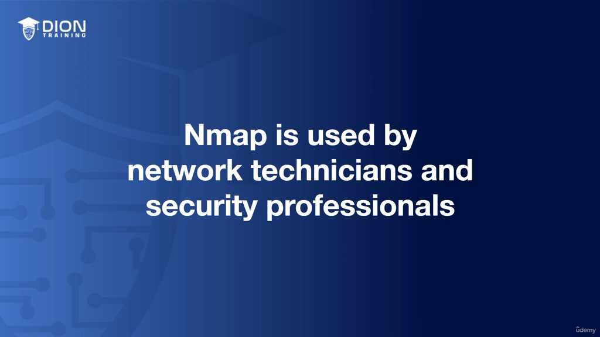

**4. Giải mã cú pháp lệnh Nmap trong Kali Linux**
Tác giả thực thi câu lệnh: `nmap -sS -O 10.0.2.6 | more`

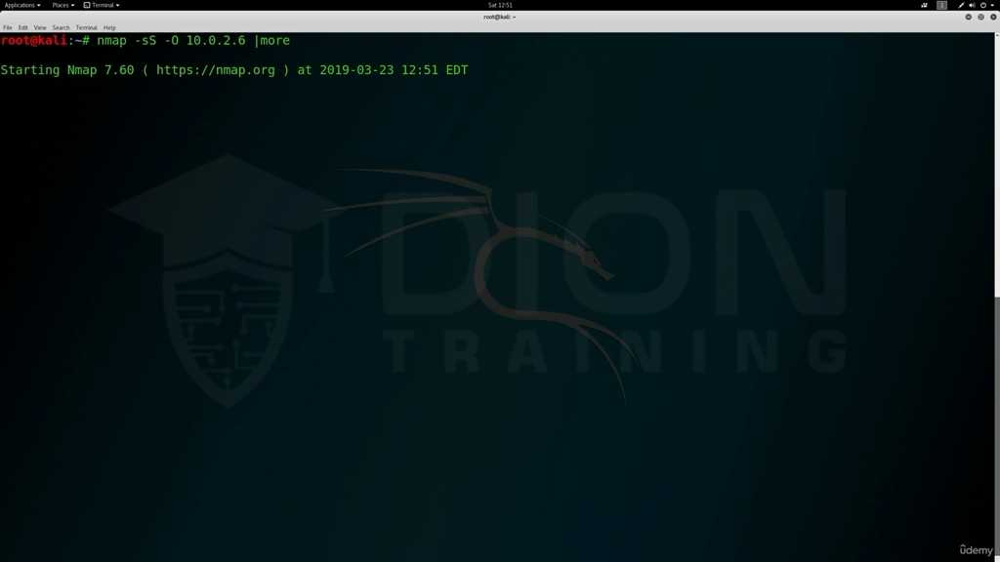

* **Nmap:** Chương trình chính.
* **-sS (SYN Scan):** Đây là kỹ thuật "quét nửa mở" (half-open scan). Thay vì hoàn tất quy trình bắt tay 3 bước (3-way handshake) gây ồn ào và dễ bị lưu nhật ký (log), Nmap chỉ gửi gói tin SYN, đợi nhận lại SYN/ACK, rồi ngắt kết nối. Nó giống như việc bạn gọi điện cho ai đó, nghe tiếng "A lô" rồi cúp máy ngay lập tức trước khi họ kịp hỏi tên bạn. Cách này nhanh và ít bị phát hiện hơn.
* **-O (Operating System detection):** Sử dụng các gói tin đặc biệt để quan sát cách máy chủ phản hồi, từ đó suy luận ra hệ điều hành dựa trên các đặc tính phản hồi TCP/IP.
* **10.0.2.6:** Địa chỉ IP mục tiêu trong mạng nội bộ.
* **| more:** Một lệnh lọc trong Linux để phân trang kết quả. Nếu kết quả quét quá dài, màn hình sẽ dừng lại để người dùng đọc từng phần thay vì trôi tuột mất.

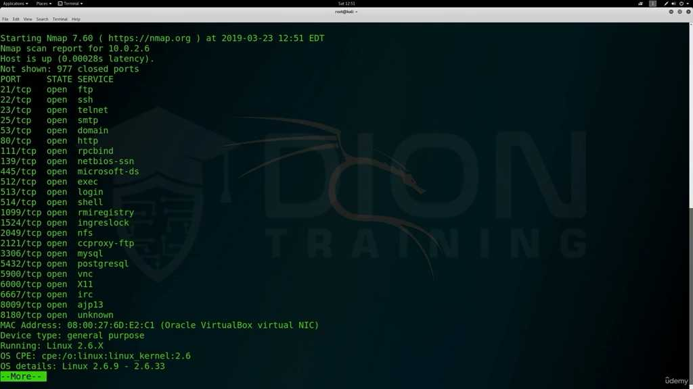

**5. Ý nghĩa của dữ liệu đầu ra**
Khi kết quả trả về là "23 open ports" trên tổng số 1000 cổng được quét, tác giả nhấn mạnh đây là một **vấn đề an ninh**. 

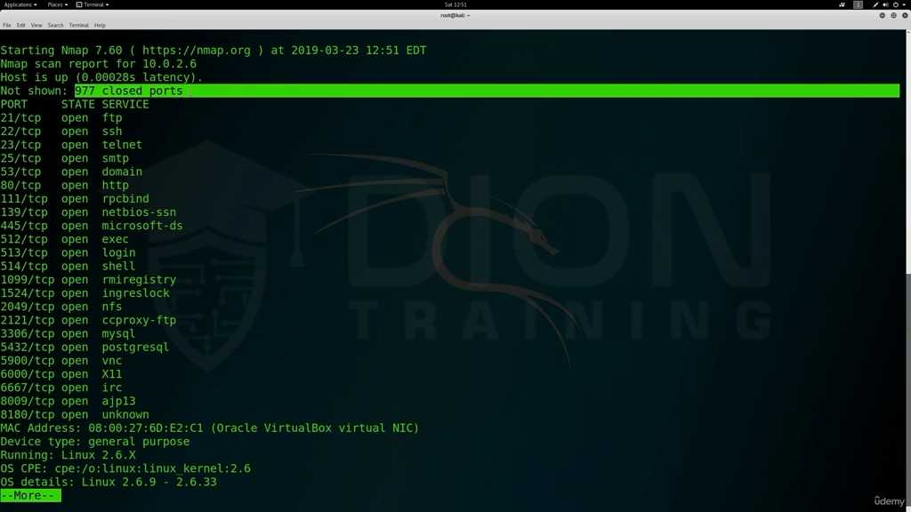

Mỗi cổng mở là một bề mặt tấn công (attack surface). Nếu bạn không cần dịch vụ đó, việc để nó mở là một lỗ hổng vì kẻ tấn công có thể lợi dụng những dịch vụ này để thâm nhập. 
> **💡 Ví dụ nhớ đời:** Bạn có một chiếc xe hơi với 23 cái cửa sổ đang mở toang. Dù bạn chỉ dùng một cái để lấy không khí, nhưng 22 cái còn lại là nơi kẻ trộm có thể leo vào. Trong an ninh mạng, nguyên tắc tối thượng là "tối thiểu hóa quyền hạn và dịch vụ" – chỉ mở những gì thực sự cần thiết để giảm thiểu tối đa rủi ro.

**6. Kết luận về tính ứng dụng**
Công cụ này được dùng trong hai bối cảnh đối lập nhưng cùng một kỹ thuật: 
* **Quản trị viên mạng:** Dùng để khắc phục sự cố (troubleshooting), kiểm tra xem các dịch vụ cần thiết đã được bật chưa.
* **Chuyên gia bảo mật:** Dùng để tìm kiếm sơ hở (vulnerability assessment) trước khi kẻ tấn công kịp phát hiện ra chúng.

### Nguyên tắc tối giản hóa dịch vụ (Minimize Attack Surface)
Trong quản trị hệ thống, nguyên tắc "tối thiểu hóa" là chìa khóa của an toàn thông tin. Việc một máy chủ mở quá nhiều cổng (ports) tương đương với việc một ngôi nhà có quá nhiều cửa sổ và cửa chính không khóa. Mỗi cổng đang ở trạng thái "open" là một điểm vào tiềm năng mà kẻ tấn công có thể khai thác. Chuyên gia trong bài giảng nhấn mạnh rằng, chúng ta chỉ nên duy trì trạng thái "open" cho những dịch vụ thực sự cần thiết cho chức năng cốt lõi của server đó (như cổng 80 cho web server hay 21 cho FTP).

> **💡 Ví dụ nhớ đời:** Hãy tưởng tượng bạn sở hữu một cửa hàng. Nếu bạn cần bán hàng, bạn chỉ cần mở cửa chính. Nếu bạn mở thêm cả cửa hậu, cửa sổ trên mái, và cửa thông gió chỉ để "tiện cho việc vận chuyển", bạn vô tình tạo ra 10 lối vào cho kẻ trộm thay vì chỉ có 1 cửa chính dễ quản lý. Việc tắt các dịch vụ không cần thiết chính là việc "khóa chặt các cánh cửa thừa".

### Phân tích các giao thức và rủi ro bảo mật
Đoạn transcript liệt kê một loạt các cổng tiêu chuẩn, mỗi cổng đại diện cho một "dịch vụ" đang chờ đợi tín hiệu kết nối:
*   **SSH (Port 22):** Được sử dụng cho quản trị từ xa an toàn.

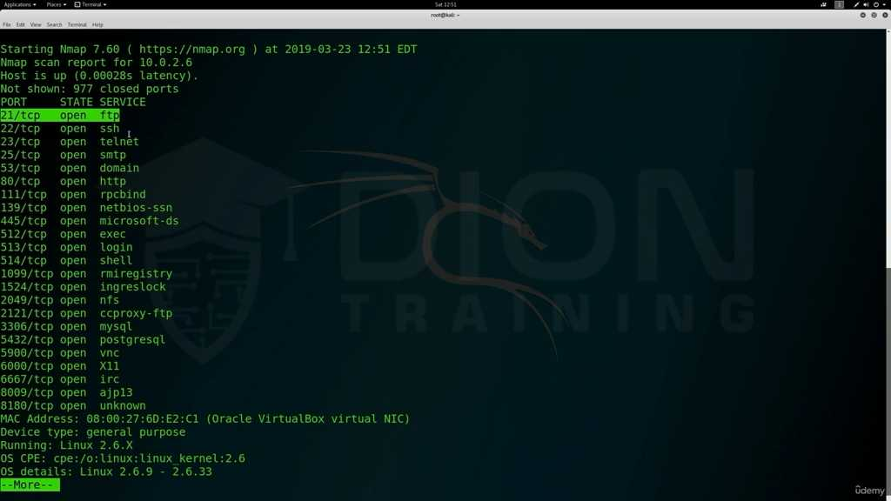

*   **Telnet (Port 23):** Một giao thức cổ điển. Điểm mấu chốt ở đây là sự "không an toàn" (insecure). Dữ liệu truyền qua Telnet không được mã hóa, đồng nghĩa với việc mật khẩu và thông tin nhạy cảm có thể bị kẻ tấn công "đánh hơi" (sniffing) trên đường truyền. Do đó, việc vô hiệu hóa hoàn toàn Telnet là quy tắc vàng trong bảo mật.

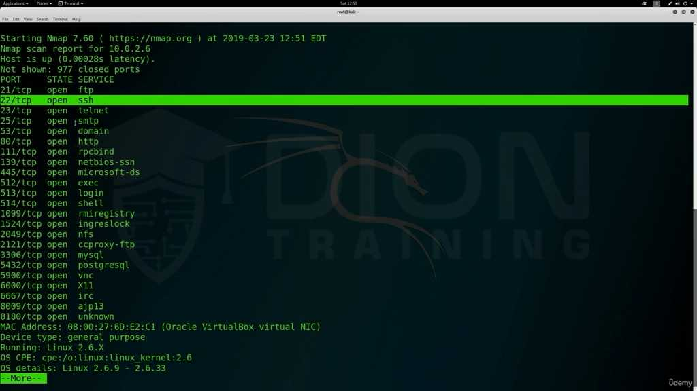

*   **SMTP (Port 25):** Giao thức truyền tải thư tín điện tử.

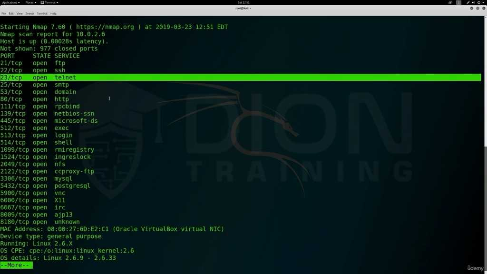

*   **DNS (Port 53):** Giao thức phân giải tên miền.

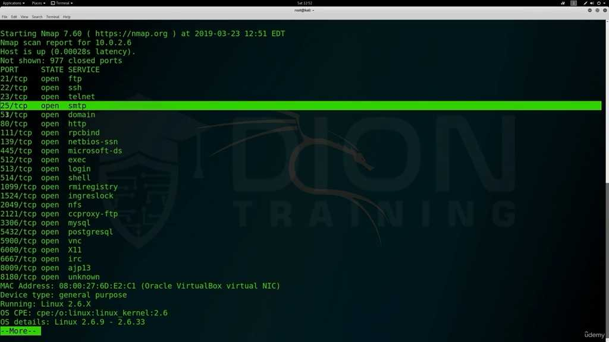

Khi quét thấy một danh sách dài các cổng đang mở, đó là một tín hiệu cảnh báo đỏ (red flag). Trong môi trường lab (như của người giảng dạy), việc mở nhiều cổng là để phục vụ cho mục đích nghiên cứu, học tập về các kỹ thuật tấn công (pen testing), nhưng trong môi trường thực tế, đây là một lỗ hổng bảo mật nghiêm trọng.

### Kỹ thuật xác định hệ điều hành (OS Fingerprinting)
Việc sử dụng tham số `-O` trong Nmap cho phép thực hiện kỹ thuật "OS Detection". Hệ thống sẽ gửi các gói tin đặc thù đến mục tiêu và phân tích cách nó phản hồi. Dựa trên những phản hồi này, Nmap so sánh với cơ sở dữ liệu để đưa ra dự đoán về hệ điều hành (trong ví dụ này là Linux 2.6.x). 

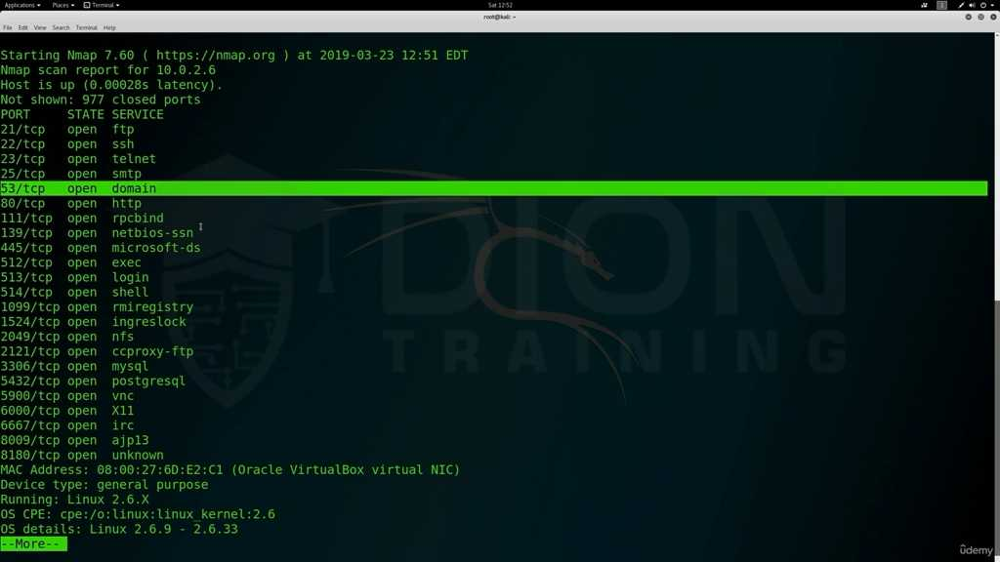

*   **Lưu ý quan trọng:** Hệ điều hành được hiển thị ở đây **không phải** là của máy tính mà người hướng dẫn đang dùng (Kali Linux), mà là của **mục tiêu bị quét** (server 10.0.2.6). Điều này rất quan trọng trong giai đoạn "Reconnaissance" (do thám) của một cuộc tấn công, vì kẻ tấn công cần biết hệ điều hành mục tiêu để chọn đúng các công cụ khai thác (exploit) phù hợp.

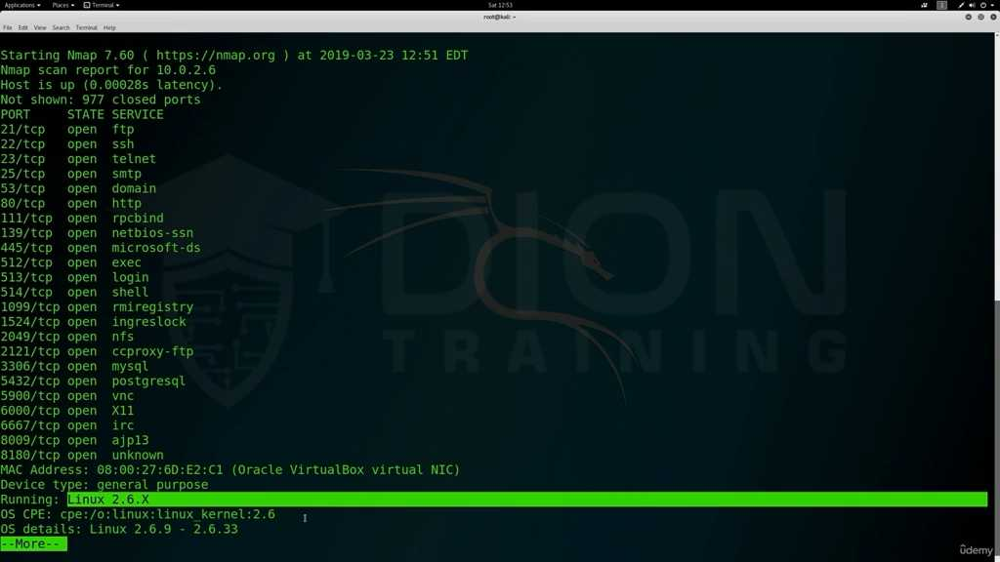

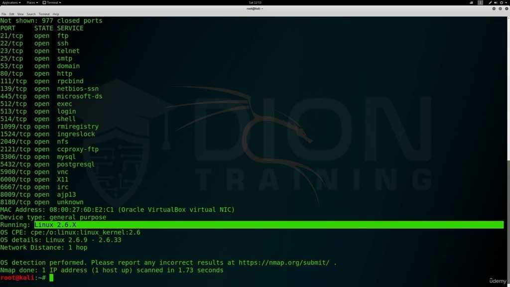

### Chuyển đổi từ Dòng lệnh (CLI) sang Giao diện đồ họa (GUI)
Nmap là một công cụ mạnh mẽ nhưng đòi hỏi người dùng phải ghi nhớ các tham số. Để tối ưu hóa quy trình làm việc, người dùng có thể sử dụng **Zenmap**.
*   **Zenmap là gì?** Đây là giao diện đồ họa (GUI) cho Nmap. Thay vì gõ các câu lệnh phức tạp, người dùng có thể chọn các "profile" (cấu hình quét) có sẵn.

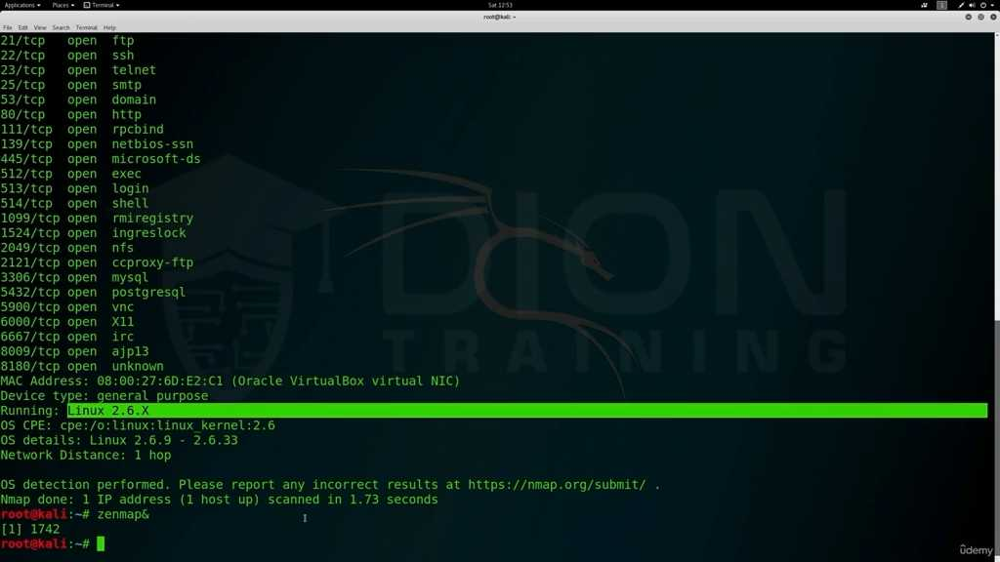

*   **Giá trị mang lại:** Zenmap không làm thay đổi bản chất của Nmap; nó chỉ đơn giản là "tự động hóa" việc soạn thảo câu lệnh. Khi bạn chọn một profile (ví dụ: "Intense scan"), Zenmap sẽ tự động điền các tham số cần thiết vào dòng lệnh của Nmap. Điều này giúp giảm thiểu sai sót do gõ nhầm lệnh và cung cấp cái nhìn trực quan hơn về kết quả quét thông qua các biểu đồ hoặc bảng biểu.

Tổng kết lại, từ dòng lệnh `-ss -O` đến việc sử dụng GUI như Zenmap, mục tiêu cuối cùng vẫn là: hiểu rõ bề mặt tấn công của hệ thống mục tiêu, từ đó đưa ra các biện pháp thắt chặt bảo mật hiệu quả.

Việc so sánh giữa "Quick Scan" (quét nhanh) và "Intense Scan" (quét chuyên sâu) thông qua giao diện đồ họa Zenmap cho thấy sự khác biệt về chiều sâu thông tin mà một kỹ thuật viên có thể khai thác.

### Phân tích sự khác biệt giữa các cấp độ quét

Khi thực hiện "Quick Scan" trong Zenmap, hệ thống chỉ thực hiện các thao tác kiểm tra cơ bản. Kết quả trả về rất nhanh (khoảng 0,2 giây trong ví dụ), nhưng thông tin thu được chỉ dừng lại ở mức "bề nổi": xác định các cổng (ports) đang mở và giao thức (protocols) đi kèm. Mặc dù Zenmap hiển thị kết quả dưới dạng đồ thị topology (cấu trúc mạng) giúp trực quan hóa mối quan hệ giữa các máy chủ, nhưng điểm yếu của việc quét nhanh là sự thiếu hụt chi tiết về hệ điều hành và cấu hình phần mềm cụ thể.

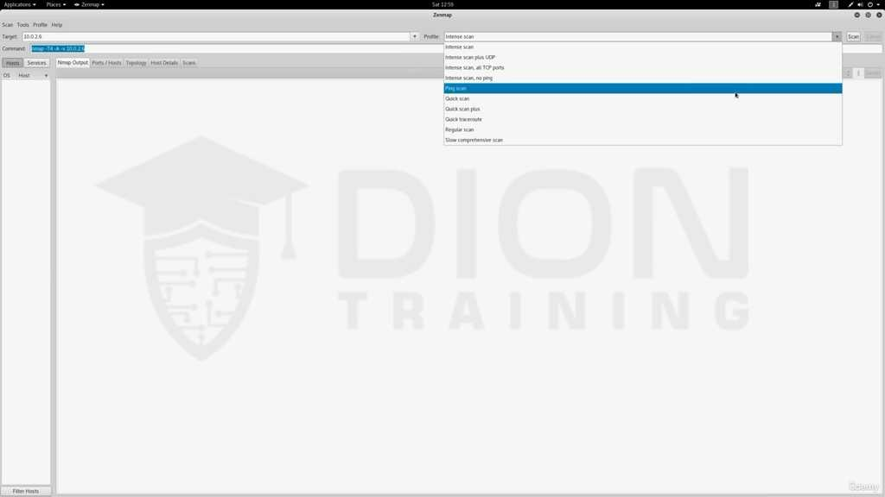

Trái lại, "Intense Scan" là một quá trình tốn thời gian hơn (đòi hỏi sự kiên nhẫn của người quản trị mạng) vì nó thực hiện các kỹ thuật thăm dò sâu hơn để "vắt kiệt" thông tin từ máy đích.

> **💡 Ví dụ nhớ đời:** Hãy tưởng tượng việc quét một máy chủ giống như việc bạn đứng từ ngoài nhìn vào một ngôi nhà. "Quick Scan" giống như việc bạn đếm số cửa sổ và cửa chính đang mở. Bạn biết ngôi nhà đó có bao nhiêu lối vào, nhưng bạn không biết bên trong có bao nhiêu người và họ đang làm gì. "Intense Scan" giống như việc bạn bước vào bên trong, kiểm tra từng nhãn hiệu thiết bị, từng loại ổ khóa và thậm chí là đọc lịch trình làm việc của người bên trong.

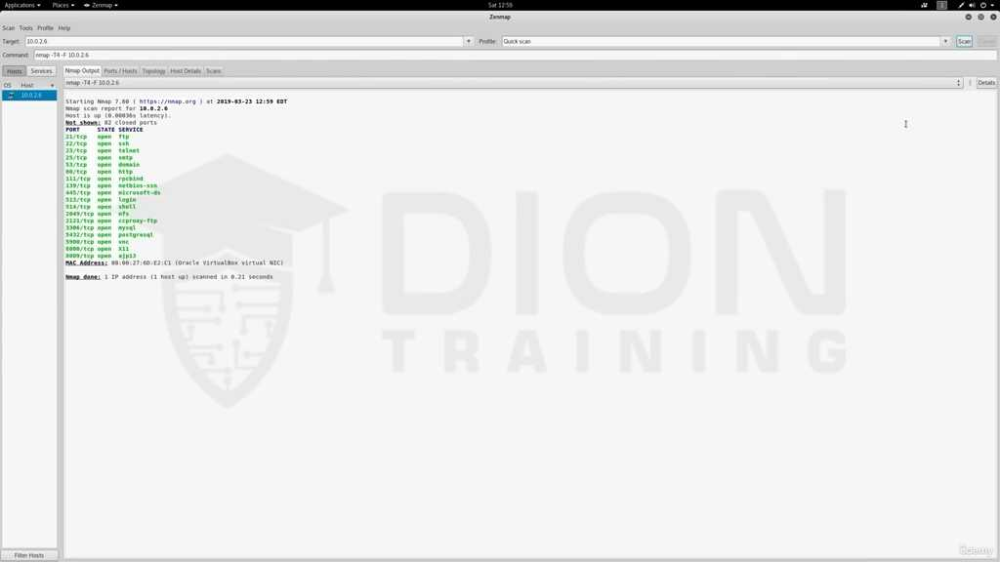

### Ý nghĩa của việc nhận diện phiên bản ứng dụng (Service Versioning)

Bước nhảy vọt về giá trị thông tin của "Intense Scan" nằm ở khả năng nhận diện phiên bản ứng dụng. Trong ví dụ, công cụ không chỉ dừng lại ở việc báo cáo "có cổng FTP đang chạy", mà còn xác định chính xác đây là phần mềm `VSFTP` phiên bản `2.3.4`. 

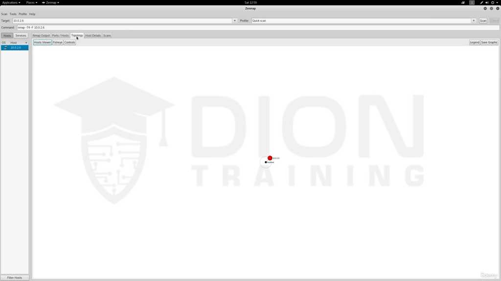

Tại sao chi tiết này lại thay đổi cuộc chơi? Đối với một kỹ thuật viên mạng thông thường, thông tin này có vẻ thừa thãi vì họ chỉ quan tâm đến việc "dịch vụ có đang chạy hay không". Tuy nhiên, dưới góc độ bảo mật, đây chính là "chìa khóa vàng":

1.  **Lỗ hổng (Vulnerabilities):** Mỗi phần mềm ở một phiên bản cụ thể thường đi kèm với danh sách các lỗ hổng đã được công bố (CVE). Ví dụ, phiên bản `VSFTP 2.3.4` nổi tiếng với một "backdoor" (cửa sau) cho phép kẻ tấn công thực thi lệnh từ xa. Nếu bạn không quét ra được phiên bản, bạn sẽ không bao giờ biết hệ thống của mình có nguy cơ bị khai thác hay không.
2.  **Phương pháp tấn công (Attack Methods):** Khi kẻ tấn công biết được số hiệu phiên bản, chúng không cần "thử sai" mù quáng nữa. Chúng sẽ tra cứu các "exploit" (mã khai thác) đã được viết sẵn cho đúng phiên bản đó.

### Tầm quan trọng đối với các chứng chỉ bảo mật

Đoạn transcript nhấn mạnh việc nắm vững các chi tiết này là nền tảng cốt lõi cho các lộ trình chuyên nghiệp như Security+, CySA+, và PenTest+. Trong thế giới thực tế của an toàn thông tin:
*   **Security+:** Tập trung vào việc hiểu rằng thông tin càng chi tiết thì bề mặt tấn công càng rõ ràng.
*   **CySA+ (Cybersecurity Analyst):** Sử dụng các chi tiết về phiên bản để phân tích xem các cảnh báo từ hệ thống giám sát có thực sự là nguy hiểm hay chỉ là nhiễu, từ đó đưa ra quyết định phòng thủ.
*   **PenTest+:** Đây là giai đoạn "Enumeration" (Liệt kê) trong quy trình tấn công. Việc xác định chính xác phiên bản phần mềm là bước tiền đề để chọn công cụ tấn công hiệu quả nhất.

Tóm lại, sự khác biệt giữa một người vận hành mạng đơn thuần và một chuyên gia bảo mật nằm ở việc hiểu rõ: **Tại sao một thông tin nhỏ (như số hiệu phiên bản) lại có khả năng làm sụp đổ cả một hệ thống nếu không được kiểm soát chặt chẽ.**

Sau khi thực hiện tiến trình "Intense Scan" (quét chuyên sâu), kết quả trả về trong phần "Host Details" cung cấp một cái nhìn sâu sắc hơn về hạ tầng mục tiêu, cụ thể là việc nhận diện hệ điều hành.

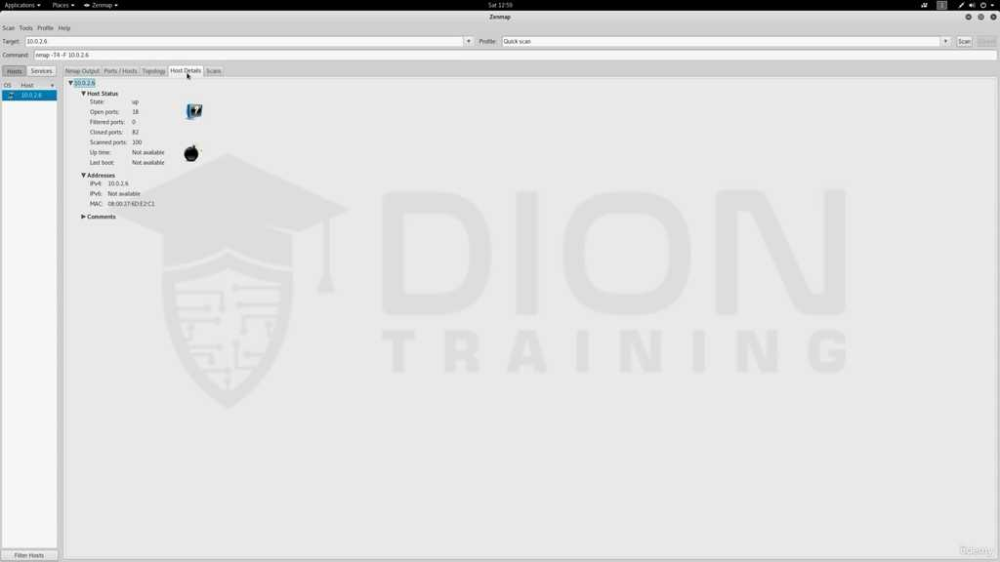

### Phân tích chi tiết "Host Details" và OS Fingerprinting
Trong transcript, giảng viên nhấn mạnh việc tìm thấy thông tin hệ điều hành: "Linux version 2.6.9 through 2.6.33". Đây là kỹ thuật **OS Fingerprinting** (nhận diện dấu vân tay hệ điều hành). Nmap không chỉ đơn thuần nhìn vào các cổng đang mở, mà nó phân tích các gói tin phản hồi (TCP/IP stack fingerprinting). Mỗi hệ điều hành (Linux, Windows, BSD,...) có cách xử lý các gói tin TCP/IP hơi khác nhau một chút. Bằng cách gửi các gói tin "đặc biệt" và đo đạc phản hồi, Nmap có thể suy luận ra phiên bản nhân (kernel) của hệ điều hành đó.

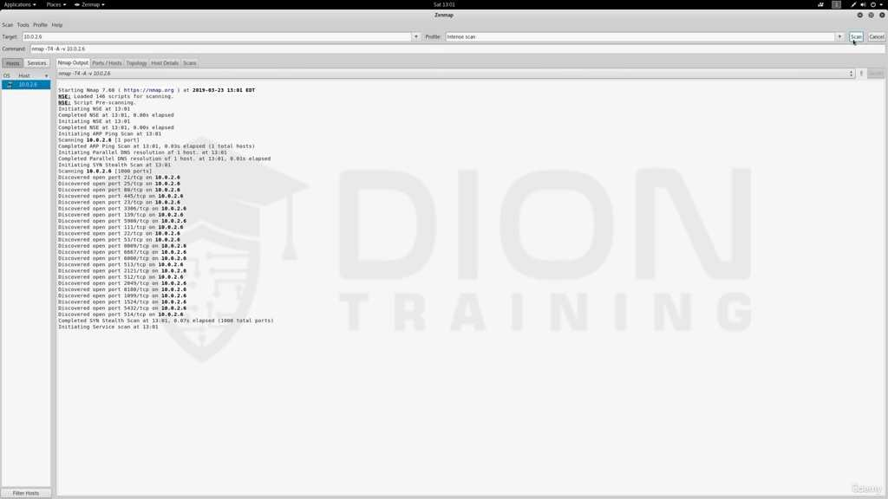

> **💡 Ví dụ nhớ đời:** Hãy tưởng tượng bạn là một thám tử đứng sau bức tường. Bạn không thể nhìn thấy người đứng bên kia, nhưng bạn có thể nghe cách họ bước đi. Người đi giày da sẽ phát ra âm thanh "cộp cộp" trên sàn gỗ, trong khi người đi dép lê sẽ phát ra tiếng "lẹt xẹt". OS Fingerprinting cũng vậy, mỗi hệ điều hành "bước đi" trên mạng với những đặc trưng riêng biệt mà công cụ quét có thể nghe thấy.

### Zenmap: Giao diện đồ họa cho sức mạnh dòng lệnh
Giảng viên làm rõ mối quan hệ giữa Nmap và Zenmap. Zenmap không phải là một công cụ riêng biệt thay thế Nmap, mà là một **GUI (Graphical User Interface - Giao diện đồ họa người dùng)** bao bọc lấy công cụ dòng lệnh (CLI) Nmap.
*   Mọi thao tác bạn thực hiện trên Zenmap đều được chuyển đổi thành các dòng lệnh Nmap tương ứng trong nền.
*   Việc sử dụng Zenmap giúp những người mới bắt đầu dễ dàng hình dung hóa (visualize) kết quả, đặc biệt là các cấu trúc mạng phức tạp mà nếu chỉ nhìn vào văn bản thuần (plain text) sẽ rất khó nắm bắt.

### Định hướng nghề nghiệp và "Bộ công cụ" (Toolbox)
Đoạn transcript nhấn mạnh tầm quan trọng của việc tích lũy công cụ qua các giai đoạn sự nghiệp:
1.  **Technician/Administrator:** Cần Nmap để kiểm kê mạng, xác định các thiết bị lạ, kiểm tra xem cổng dịch vụ có mở đúng theo chính sách bảo mật hay không.
2.  **Security/Penetration Tester:** Cần các chi tiết chuyên sâu như phiên bản ứng dụng (VSFTP 2.3.4) hoặc phiên bản OS để đối chiếu với các cơ sở dữ liệu lỗ hổng (CVE - Common Vulnerabilities and Exposures).

### Lời khuyên thực hành an toàn
Giảng viên gợi ý sử dụng **scanme.org**. Đây là một dịch vụ do chính đội ngũ phát triển Nmap vận hành, cho phép bạn thực hiện các bài tập quét mà không lo ngại về vấn đề pháp lý hoặc đạo đức.

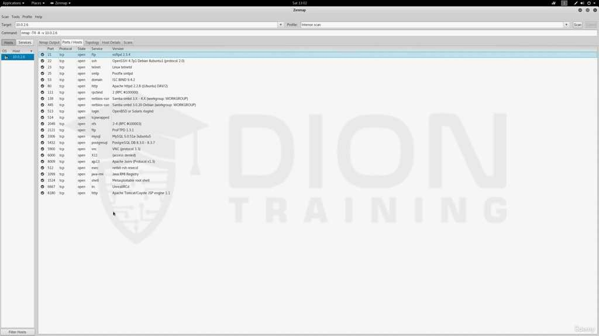

*   **Tại sao cần thực hành?** Vì sự khác biệt giữa lý thuyết và thực tế nằm ở cách bạn xử lý kết quả quét. Một kỹ sư giỏi không chỉ biết quét, mà còn biết "đọc" kết quả đó để trả lời câu hỏi: "Nếu phiên bản kernel này đã cũ, mình cần cấu hình firewall thế nào để bảo vệ nó?"

### Giá trị đối với các chứng chỉ chuyên nghiệp
Mặc dù Nmap không phải là tâm điểm kỹ thuật chuyên sâu của chứng chỉ Network+, nhưng việc nắm vững cách sử dụng nó là một "kỹ năng bổ trợ" (soft skill kỹ thuật) cực kỳ giá trị. Khi bạn tiến xa hơn đến các chứng chỉ như Security+, CySA+ hay PenTest+, khả năng thu thập thông tin (Reconnaissance) bằng các công cụ như Nmap sẽ là nền tảng cốt lõi để bạn thực hiện các bước tấn công giả định hoặc đánh giá rủi ro hệ thống một cách hiệu quả.

Tóm lại, thông điệp ở đây là: Hãy biến Nmap/Zenmap thành một "phản xạ" trong công việc. Đừng đợi đến khi cần mới học, hãy bắt đầu bằng việc thử nghiệm trên các môi trường an toàn, quan sát cách các thiết bị phản hồi, và dần dần phát triển khả năng phân tích sâu (deep analysis) từ những dữ liệu thô mà công cụ cung cấp.

---

## 🎯 Bí Kíp Ôn Thi Tốc Độ

### 1. Công cụ chủ đạo
*   **Nmap (Network Mapper):** Công cụ dòng lệnh dùng để quét mạng, kiểm tra các cổng (port) đang mở, xác định dịch vụ và hệ điều hành (OS) của mục tiêu.
*   **Zenmap:** Phiên bản **GUI (Giao diện đồ họa)** của Nmap, hỗ trợ xem cấu trúc mạng (Topology) và chi tiết dịch vụ/phiên bản (Version) trực quan hơn.

### 2. Lệnh Nmap cốt lõi (Syntax)
*   **Cấu trúc:** `nmap [flag] [Target IP]`
*   **`-sS` (SYN Scan):** Quét kiểu "bắt tay" nửa chừng (đảm bảo nhanh và kín đáo).
*   **`-O` (OS Detection):** Xác định **hệ điều hành** của máy chủ đích.
*   **`| more`:** Lệnh pipe để đọc kết quả từng màn hình (tránh tràn dữ liệu).

### 3. Cổng dịch vụ (Ports) cần ghi nhớ
*   **21:** **FTP** (File Transfer Protocol).
*   **22:** **SSH** (Secure Shell - Điều khiển từ xa).
*   **23:** **Telnet** (Kém bảo mật, nên vô hiệu hóa).
*   **25:** **SMTP** (Simple Mail Transfer Protocol - Gửi mail).
*   **80:** **HTTP** (Web Server).
*   **53:** **DNS** (Domain Name Service).

### 4. Kiến thức trọng tâm (Security Mindset)
*   **Tối thiểu hóa:** Chỉ nên mở những **cổng cần thiết** (ví dụ: web server chỉ mở cổng 80).
*   **Dấu vết tấn công:** Cổng mở càng nhiều = rủi ro bảo mật càng cao.
*   **Phân tích phiên bản:** Biết chính xác phiên bản dịch vụ (ví dụ: VSFTP 2.3.4) giúp đối chiếu với các **lỗ hổng bảo mật (vulnerabilities)** đã biết.
*   **Phạm vi:** Nmap không chỉ dùng cho quản trị mạng mà là "vũ khí" quan trọng trong **Security+, CySA+ và PenTest+**.

### 5. Mẹo thực hành
*   **Thực hành:** Sử dụng `scanme.org` để luyện tập quét mà không vi phạm pháp luật.
*   **Đa nền tảng:** Zenmap cài đặt được trên cả **Windows, Linux, Mac**.
*   **Tư duy thi cử:** Nếu câu hỏi hỏi về cách tìm lỗ hổng nhanh nhất bằng giao diện đồ họa -> **Zenmap**. Nếu hỏi về lệnh quét OS -> **Nmap -O**.

### Hình ảnh minh họa thêm:

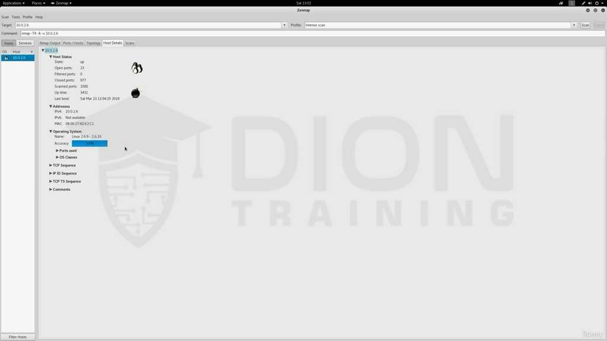
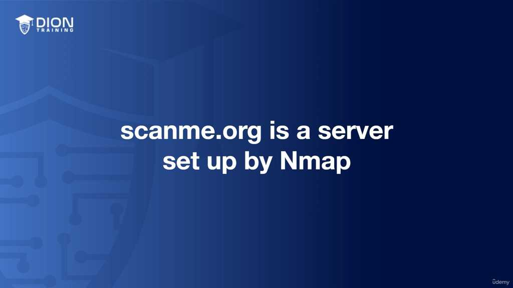

---
*Ghi chú: 21 hình ảnh minh họa (.jpg) đã được tải về và lưu tự động vào thư mục con `image/` cùng cấp với file này. Để ảnh hiển thị tự động, hãy đảm bảo bạn sao chép cả thư mục `image/` nếu bạn muốn di chuyển file markdown sang nơi khác!*
