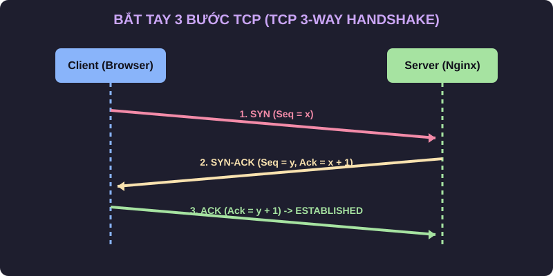
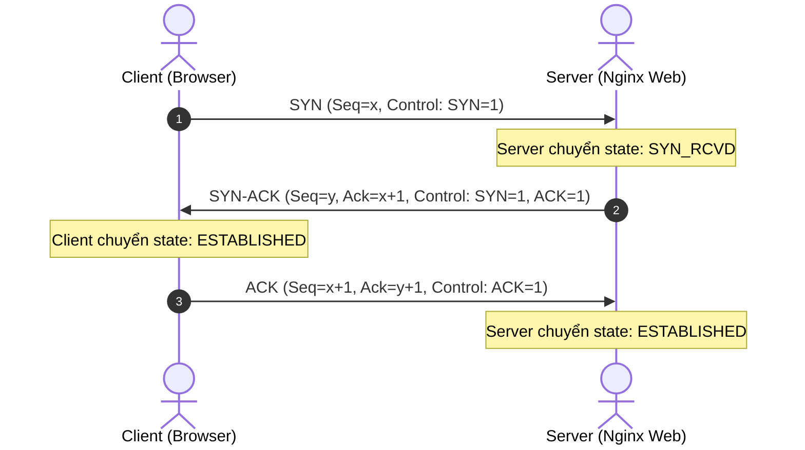

# 🌐 Module 03: Các Cổng Mạng & Giao Thức L4/L3 (Ports & Protocols)

> 💡 **Bản chất 1 câu**: Port là số định danh logic (0-65535) tại Layer 4 giúp Hệ điều hành phân phối dữ liệu từ cạc mạng vào đúng ứng dụng đang chờ trên RAM (Web, SSH, Database).  
> 🎯 **Trọng tâm thực chiến DevOps**: Thuộc lòng 30+ Ports tiêu chuẩn, phân biệt TCP (bắt tay 3 bước, tin cậy) vs UDP (siêu tốc, không kết nối), ICMP và thành thạo kỹ năng quét port với `nmap`, `ss`, `lsof`.

---

## 1. 🧠 Hình Hình Dung Nhanh Cho Người Mới (Intuitive Mindset)

Hãy tưởng tượng **Số Địa Chỉ IP** giống như **Địa chỉ của một Tòa nhà chung cư**:
- Tòa nhà có địa chỉ IP là `10.0.0.1`.
- **Số Port (Port Number)** giống như **Số căn hộ phòng trong tòa nhà**:
  - Căn hộ **22** là phòng quản trị **SSH**.
  - Căn hộ **80 / 443** là nhà hàng **HTTP / HTTPS**.
  - Căn hộ **3306** là kho dữ liệu **MySQL**.
  - Căn hộ **6443** là văn phòng ban quản lý **Kubernetes API**.
- Khi gói tin đến địa chỉ IP tòa nhà `10.0.0.1`, cạc mạng nhìn vào số Port để biết gõ cửa giao hàng cho đúng căn hộ ứng dụng!

---

## 2. 📚 Lý Thuyết Chuyên Sâu & Bản Chất Hệ Thống (Under The Hood Architecture)

### 2.1 Bắt Tay 3 Bước TCP


 (TCP 3-Way Handshake - OBJ 1.4)



1. **Các Cờ Điều Khiển TCP Flags**:
   - **SYN (Synchronize)**: Yêu cầu khởi tạo kết nối.
   - **ACK (Acknowledge)**: Xác nhận đã nhận dữ liệu thành công.
   - **FIN (Finish)**: Yêu cầu đóng kết nối êm đẹp.
   - **RST (Reset)**: Ngắt kết nối khẩn cấp do lỗi hoặc Port bị đóng.
2. **So Sánh TCP vs UDP**:

| Tiêu chí | TCP (Transmission Control Protocol) | UDP (User Datagram Protocol) |
| :--- | :--- | :--- |
| **Bản chất** | Connection-oriented (Có bắt tay kết nối) | Connectionless (Không bắt tay) |
| **Độ tin cậy** | 100% không mất gói (Có Retransmission) | Không đảm bảo (Có thể rớt gói) |
| **Header Overhead**| Lớn: **20 đến 60 bytes** | Siêu nhẹ: **Chỉ 8 bytes** |
| **Ứng dụng** | Web (HTTP/HTTPS), SSH, Database, Email | Live Video Streaming, DNS Query, VoIP, Gaming |

---

### 2.2 Bảng 30+ Ports Tiêu Chuẩn Bắt Buộc Thuộc Cho DevOps

| Port Number | Protocol | Tên Dịch Vụ | Ý nghĩa & Ứng dụng thực tế DevOps |
| :--- | :--- | :--- | :--- |
| **20 / 21** | TCP | **FTP** | Truyền file truyền thống (21 Command, 20 Data) |
| **22** | TCP | **SSH / SFTP** | Quản trị Linux Server mã hóa bảo mật |
| **23** | TCP | **Telnet** | Quản trị từ xa văn bản rõ (Đã lỗi thời, rủi ro) |
| **25** | TCP | **SMTP** | Máy chủ gửi thư Mail Transfer Agent (Postfix) |
| **53** | TCP/UDP | **DNS** | Phân giải tên miền (UDP cho Query, TCP cho Zone Transfer) |
| **67 / 68** | UDP | **DHCP** | Cấp IP tự động (Server Port 67, Client Port 68) |
| **80** | TCP | **HTTP** | Dịch vụ Web không mã hóa |
| **123** | UDP | **NTP** | Đồng bộ thời gian chính xác hệ thống |
| **161 / 162** | UDP | **SNMP** | Giám sát thiết bị mạng (161 Query, 162 Trap) |
| **389 / 636** | TCP | **LDAP / LDAPS**| Dịch vụ thư mục xác thực người dùng |
| **443** | TCP | **HTTPS** | Dịch vụ Web bảo mật mã hóa SSL/TLS |
| **445** | TCP | **SMB / CIFS** | Chia sẻ file mạng giữa Windows và Linux (Samba) |
| **1433** | TCP | **MS SQL** | Cơ sở dữ liệu Microsoft SQL Server |
| **1521** | TCP | **Oracle DB** | Cơ sở dữ liệu Oracle |
| **3306** | TCP | **MySQL** | Cơ sở dữ liệu MySQL / MariaDB |
| **3389** | TCP | **RDP** | Remote Desktop Windows |
| **5432** | TCP | **PostgreSQL**| Cơ sở dữ liệu PostgreSQL |
| **6379** | TCP | **Redis** | In-memory Caching Data Store |
| **6443** | TCP | **Kubernetes API**| Master Node API Server trong K8s Cluster |
| **8080 / 8443**| TCP | **Alt Web / Proxy**| Cổng Web phụ (Tomcat, Jenkins, Node.js) |
| **9090** | TCP | **Prometheus** | Hệ thống thu thập metric giám sát |

---


### 2.4 Cơ Chế Hoạt Động Bên Dưới Kernel & Kiến Trúc Hệ Thống Chi Tiết (Deep Under The Hood Architecture)
- **Tầng Giao Tiếp Mạng & Bắt Gói Tin**: Mọi gói tin đi qua Network Interface Card (NIC) đều trải qua quá trình xử lý Ring Buffer, ngắt phần cứng (Hardware Interrupts), Ring Buffer DMA và chồng giao thức Socket Buffers (`sk_buff`) trong Linux Kernel.
- **Tối Ưu Hóa & Cấu Trúc Dữ Liệu**: Hệ thống duy trì các bảng băm dữ liệu (Routing Table, ARP Cache Table, Connection Tracking Table `conntrack`, Socket Inode Tables) giúp chuyển tiếp gói tin ở tốc độ dây (Line-rate processing).
- **Phân Lập An Ninh & Phân Vùng**: Sử dụng cơ chế Linux Network Namespaces (`ip netns`), iptables/nftables hooks và mã hóa phần cứng để cách ly lưu lượng mạng tuyệt đối.

---

## 3. ⚡ Bảng Tra Cứu Câu Lệnh Quét Port (Reference Table)

| Lệnh / Flag | Chức năng chi tiết | Ví dụ lệnh thực hành |
| :--- | :--- | :--- |
| **`ss -tulpn`** | Xem tất cả các Port TCP/UDP đang LISTEN trên máy local | `sudo ss -tulpn` |
| **`lsof -i :PORT`** | Tìm chính xác PID tiến trình nào đang chiếm giữ số Port | `sudo lsof -i :8080` |
| **`nmap -sS`** | Quét Port kiểu SYN Stealth nhanh & ẩn danh | `nmap -sS 192.168.1.100` |
| **`nmap -sV`** | Quét phát hiện Tên và Version phiên bản ứng dụng | `nmap -sV -p 1-1024 10.0.0.10` |
| **`nc -zvw3`** | Test kết nối thấu Port TCP từ xa xem có bị Firewall chặn | `nc -zvw3 10.0.0.10 3306` |

---

## 4. 🛠 Thao Tác Thực Chiến & Kịch Bản DevOps

### 🛠 Thực hành kiểm tra và quét Port:
```bash
# 1. Tìm tiến trình đang chiếm Port 8080 gây lỗi "Address already in use":
sudo lsof -i :8080

# 2. Diệt tiến trình đó:
sudo kill -9 <PID>

# 3. Quét kiểm tra các Port dịch vụ đang mở trên Server mục tiêu:
nmap -sV -p 22,80,443,3306,6443 192.168.1.50
```

---


### 4.2 Chi Tiết Các Lỗi Thường Gặp & Kịch Bản Khắc Phục Lỗi (Troubleshooting Deep-Dive)
1. **Sự cố 1: Lỗi Mất Gói Tin & Mất Kết Nối Cổng Mạng (Packet Loss & Port Unreachable)**:
   - **Triệu chứng**: Gửi HTTP Request bị Timeout, SSH không kết nối được hoặc gói tin bị nảy rải rác.
   - **Các bước xử lý khẩn cấp**:
     ```bash
     # 1. Kiểm tra trạng thái cổng mạng TCP/UDP đang lắng nghe:
     sudo ss -tulpn | grep :80
     
     # 2. Bắt gói tin trực tiếp trên Interface để kiểm tra bắt tay 3 bước TCP:
     sudo tcpdump -i eth0 port 80 -nn -vv
     
     # 3. Phân tích đường đi của gói tin tìm điểm đứt gãy bằng MTR:
     mtr -n --report --report-cycles=10 8.8.8.8
     
     # 4. Kiểm tra xem gói tin có bị Firewall Drop không:
     sudo iptables -L -n -v | grep DROP
     ```

2. **Sự cố 2: Lỗi Sai Cấu Hình DNS & Chuyển Tiếp IP (DNS Resolution & IP Routing Error)**:
   - **Triệu chứng**: Ping IP thành công nhưng ping Domain Name báo `Could not resolve host`.
   - **Các bước xử lý khẩn cấp**:
     ```bash
     # 1. Tra cứu thử nghiệm phân giải DNS qua server cụ thể:
     dig @8.8.8.8 company.com +trace
     
     # 2. Kiểm tra file cấu hình DNS resolver địa phương:
     cat /etc/resolv.conf
     
     # 3. Kiểm tra bảng định tuyến Kernel IP Routing Table:
     ip route show default
     ```

---

## 5. 🚀 Bộ Câu Hỏi Phỏng Vấn DevOps & Network Thực Tế (Interview Q&A)

> **Q: Mô tả các bước của quá trình TCP 3-Way Handshake?**  
> **A**: Bước 1: Client gửi gói `SYN` với Sequence Number khởi tạo. Bước 2: Server phản hồi lại gói `SYN-ACK` xác nhận. Bước 3: Client phản hồi gói `ACK`. Cả hai chuyển sang trạng thái `ESTABLISHED` và bắt đầu truyền dữ liệu.

> **Q: Tại sao dịch vụ DNS lại sử dụng cả 2 giao thức UDP Port 53 và TCP Port 53?**  
> **A**: UDP 53 được sử dụng cho các truy vấn DNS Query tiêu chuẩn của Client (vì gói tin nhỏ < 512 bytes, cần tốc độ cực nhanh). TCP 53 được sử dụng cho việc đồng bộ dữ liệu giữa các máy chủ DNS (Zone Transfer AXFR) hoặc khi câu trả lời DNS vượt quá 512 bytes.


> **Q: Làm thế nào để điều tra và dập tắt sự cố một Server bị tấn công làm tràn bộ đệm kết nối TCP SYN Flood DoS?**  
> **A**:  
> 1. **Nhận biết**: Lệnh `ss -ant | grep SYN_RECV | wc -l` trả về hàng ngàn kết nối ở trạng thái `SYN_RECV`.  
> 2. **Xử lý khẩn cấp**: Bật ngay cơ chế **SYN Cookies** của Linux Kernel bằng lệnh `sudo sysctl -w net.ipv4.tcp_syncookies=1`. Kích hoạt bộ lọc Firewall drop các gói tin SYN có tần suất bất thường: `sudo iptables -A INPUT -p tcp --syn -m limit --limit 1/s --limit-burst 3 -j ACCEPT`.

> **Q: Sự khác biệt về mặt bản chất giữa Stateful Firewall và Stateless Firewall là gì?**  
> **A**: Stateless Firewall chỉ kiểm tra từng gói tin riêng rẻ dựa trên IP nguồn/đích và Port mà KHÔNG nhớ ngữ cảnh. Stateful Firewall duy trì một bảng theo dõi trạng thái kết nối (**Connection Tracking Table `conntrack`**), tự động nhận diện gói tin thuộc về một kết nối hợp lệ đã được chấp nhận trước đó (như trạng thái `ESTABLISHED,RELATED`), giúp bảo mật và tối ưu hiệu năng vượt trội.

---

## 6. 📝 Cheat Sheet Ghi Nhớ Nhanh (Summary)

- [x] **Well-known Ports**: 0 - 1023 (Cần quyền root).
- [x] **SSH**: Port 22 TCP.
- [x] **DNS**: Port 53 UDP/TCP.
- [x] **HTTP/HTTPS**: Port 80 / 443 TCP.
- [x] **MySQL/Postgres**: Port 3306 / 5432 TCP.
- [x] **K8s API**: Port 6443 TCP.
- [x] **ss -tulpn**: Xem Port listening local.
- [x] **nmap -sS**: SYN Stealth scan nhanh không bị ứng dụng ghi log.
