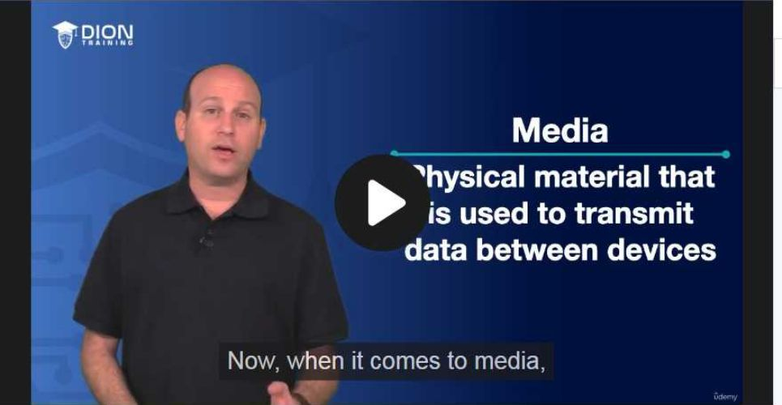
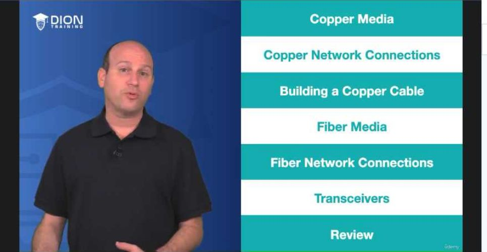
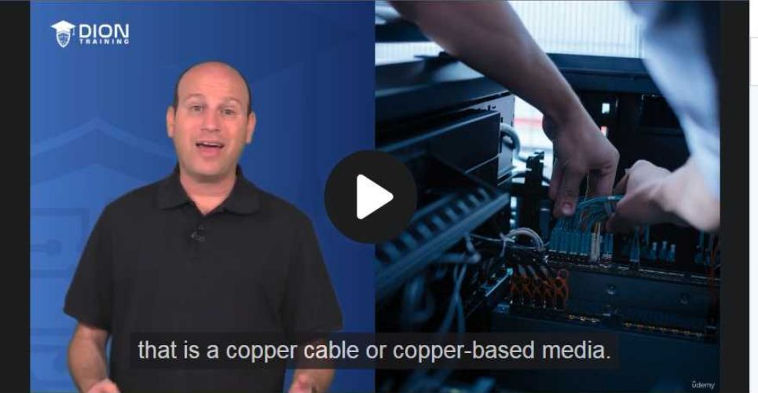
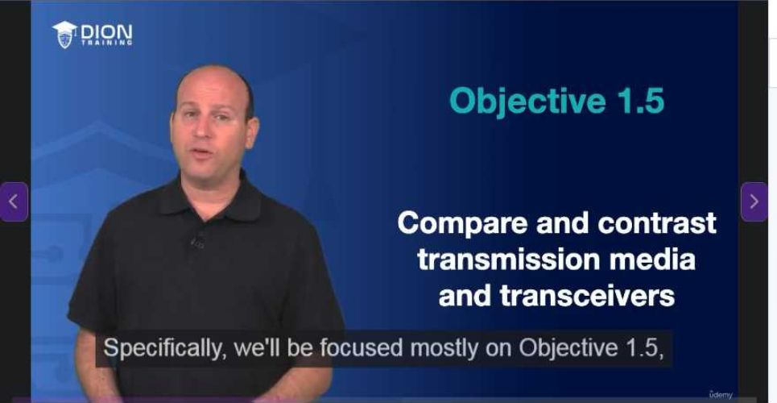
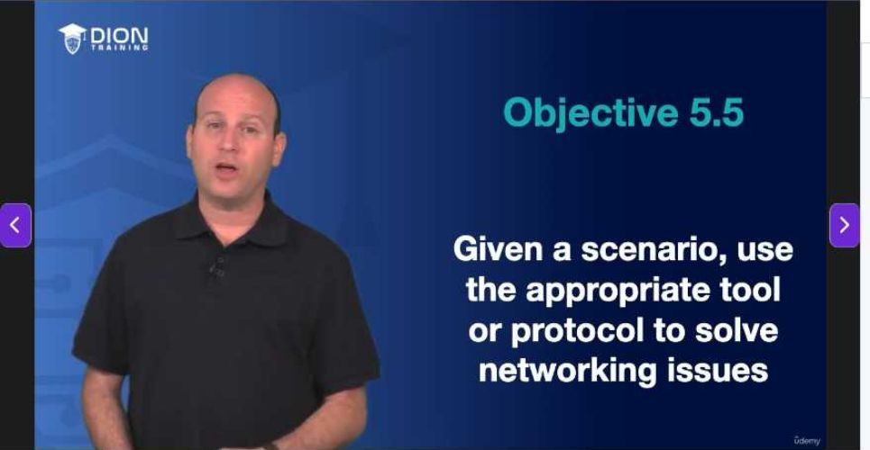

# Network Media and Cabling

### Khái niệm "Media" (Môi trường truyền dẫn) trong Networking
Trong ngữ cảnh mạng máy tính, thuật ngữ "media" không liên quan đến nội dung giải trí (video/audio) mà bạn thường thấy trên mạng xã hội. Ở đây, "media" được hiểu là **môi trường truyền dẫn vật lý** – những "tuyến đường" hữu hình hoặc vô hình cho phép dữ liệu (các bit 1 và 0) được chuyển giao từ thiết bị này sang thiết bị khác. Đây chính là nền tảng hạ tầng thấp nhất (Lớp 1 - Physical Layer trong mô hình OSI) mà mọi kết nối mạng phải dựa vào.

### Ba loại hình môi trường truyền dẫn phổ biến
Người giảng viên đã phân loại media thành ba nhóm chính dựa trên bản chất vật lý của tín hiệu:

1.  **Copper (Đồng):** Sử dụng các xung điện để truyền tải dữ liệu qua dây dẫn kim loại. Đây là loại phổ biến nhất trong các văn phòng và hộ gia đình. Ví dụ: Dây cáp mạng Cat6A nối từ PC vào Switch.

2.  **Fiber (Cáp quang):** Sử dụng các xung ánh sáng để truyền tải dữ liệu qua sợi thủy tinh hoặc nhựa tinh khiết. Ưu điểm của nó là tốc độ cực cao và khả năng chống nhiễu tuyệt đối.
3.  **Radio Frequency (RF - Sóng vô tuyến):** Sử dụng sóng điện từ trong không gian. Đây là môi trường không dây (Wireless). Mặc dù chúng ta không nhìn thấy sợi dây nào, nhưng các sóng vô tuyến chính là "vật mang" các bit dữ liệu từ thiết bị di động (smartphone) đến điểm truy cập (Access Point).

> **💡 Ví dụ nhớ đời:** Hãy tưởng tượng bạn muốn gửi một bức thư cho người bạn ở xa. "Media" chính là phương tiện vận chuyển bức thư đó. Cáp đồng giống như chiếc **xe tải** (chạy trên đường, đôi khi gặp ổ gà - nhiễu điện), cáp quang giống như một **đường ống chân không siêu tốc** (siêu nhanh, sạch sẽ), và sóng vô tuyến (Wi-Fi) giống như một **đội chim bồ câu đưa thư** (tự do, linh hoạt nhưng dễ bị tác động bởi thời tiết/vật cản).

### Định hướng đào tạo và mục tiêu học tập (Domain & Objective)
Bài học này được thiết kế để chuẩn bị cho kỳ thi chứng chỉ mạng (thường là CompTIA Network+), tập trung vào:
*   **Domain 1 (Networking Concepts):** Hiểu rõ bản chất vật lý của các loại cáp và cách chúng vận hành.
*   **Domain 5 (Network Troubleshooting):** Khả năng chẩn đoán lỗi khi mạng gặp sự cố liên quan đến kết nối vật lý (ví dụ: dây đứt, đầu nối lỏng).
*   **Mục tiêu 1.5:** Tập trung vào kỹ năng so sánh (Compare and Contrast) giữa các phương tiện truyền dẫn và các bộ thu phát (transceivers).

*   **Mục tiêu 5.5:** Kỹ năng thực chiến, sử dụng công cụ để sửa lỗi mạng (ví dụ: dùng máy test cáp để kiểm tra xem cáp có bị hở mạch hay không).

### Chuyên sâu về Copper Media (Cáp đồng)
Phần đào tạo về đồng sẽ đi sâu vào:
*   **Thông số kỹ thuật:** Mỗi loại cáp đồng có giới hạn riêng về "bandwidth" (băng thông - lượng dữ liệu tối đa truyền trong một đơn vị thời gian) và "distance" (khoảng cách tối đa mà tín hiệu có thể truyền trước khi bị suy hao, cần thiết bị khuếch đại).
*   **Đầu nối (Connectors):** Đây là những "cổng giao tiếp" vật lý.
    *   **RJ45:** Chuẩn phổ biến cho cáp Ethernet (máy tính).
    *   **RJ11:** Chuẩn nhỏ hơn, thường dùng cho điện thoại bàn (ADSL).
    *   **F-Type:** Đầu nối dạng xoắn, thường thấy ở cáp truyền hình cáp (coaxial).
    *   **BNC:** Loại đầu nối dạng khóa xoay, thường dùng trong thiết bị video chuyên dụng hoặc mạng cũ.

### Kỹ năng thực hành: "Self-made Patch Cable"
Người dạy nhấn mạnh vào việc tự chế tạo (crimping) cáp mạng. Đây là kỹ năng sinh tồn của một kỹ thuật viên mạng:
*   **Cable Stripper (Dụng cụ tuốt vỏ):** Loại bỏ lớp vỏ bảo vệ bên ngoài mà không làm đứt lõi đồng bên trong.
*   **Cable Crimper (Kìm bấm mạng):** Dụng cụ then chốt để cố định đầu nối (RJ45) vào cáp, đảm bảo các chân đồng tiếp xúc chặt chẽ với lõi cáp.
*   **Cable Tester (Máy test cáp):** Thiết bị quan trọng nhất để kiểm chứng sự thành công. Nếu bạn bấm cáp xong mà không test, bạn sẽ không bao giờ biết được mình đã bấm đúng chuẩn (TIA/EIA-568B) hay chưa cho đến khi cắm vào thiết bị.

### Chuyên sâu về Fiber Media (Cáp quang)
Khác với cáp đồng truyền điện, cáp quang truyền ánh sáng qua sợi thủy tinh:
*   **Single-mode (Đơn mốt):** Lõi sợi rất nhỏ, ánh sáng đi thẳng, dùng cho khoảng cách cực xa (tính bằng km).
*   **Multi-mode (Đa mốt):** Lõi sợi lớn hơn, ánh sáng đi theo nhiều tia phản xạ, thường dùng trong khoảng cách ngắn hơn (trong tòa nhà hoặc trung tâm dữ liệu).
*   **Các loại đầu nối quang chuyên dụng:** Sẽ bao gồm các chuẩn như **SC, ST, LC, MTRJ, MTP**. Mỗi loại đầu nối được thiết kế riêng cho các ứng dụng khác nhau tùy vào độ bền và không gian lắp đặt (ví dụ: LC là đầu nối nhỏ gọn, rất phổ biến trong các thiết bị mạng hiện đại mật độ cao).

Trong đoạn tiếp nối này, nội dung chuyển trọng tâm từ việc định nghĩa các loại môi trường truyền dẫn (media) sang thiết bị giữ vai trò kết nối và chuyển đổi giữa chúng. Dưới đây là phân tích chi tiết:

### 1. Vai trò cầu nối của Transceiver (Bộ thu phát)

Transcript đề cập đến **Transceiver** như một thiết bị kết hợp cả chức năng truyền (transmitter) và nhận (receiver) vào trong một đơn vị duy nhất. Trong hạ tầng mạng hiện đại, đây là "bộ thông dịch" vật lý.

Tại sao chúng ta cần chúng? Hãy tưởng tượng mạng lưới của bạn là một quốc gia sử dụng tiếng Anh (tín hiệu điện trên dây đồng) và một quốc gia khác sử dụng tiếng Nhật (tín hiệu ánh sáng trên sợi quang). Để hai bên giao tiếp được với nhau, bạn không thể chỉ nối dây trực tiếp. Bạn cần một thiết bị có khả năng hiểu cả hai ngôn ngữ đó và chuyển đổi qua lại. Transceiver chính là thiết bị đảm nhận vai trò này.

> **💡 Ví dụ nhớ đời:** Hãy coi Transceiver giống như một "nhân viên hải quan" tại cửa khẩu giữa hai vùng lãnh thổ khác nhau. Nếu bạn mang một thùng hàng là "điện" (dây đồng) đến cửa khẩu để chuyển sang vùng "ánh sáng" (cáp quang), nhân viên hải quan này sẽ nhận lấy luồng dữ liệu điện, giải mã nó và đóng gói lại thành các xung ánh sáng để thiết bị phía bên kia có thể đọc được. Nếu không có "cửa khẩu" này, hai loại môi trường truyền dẫn sẽ hoàn toàn biệt lập.

### 2. Khả năng chuyển đổi media (Media Conversion)

Điểm then chốt trong đoạn này là khả năng **convert** (chuyển đổi) giữa các media khác nhau. Trong thực tế triển khai mạng doanh nghiệp:
*   **Khoảng cách:** Cáp đồng có giới hạn khoảng cách vật lý rất ngắn (thường là 100 mét). Khi cần truyền dữ liệu đi xa hơn giữa các tòa nhà, chúng ta buộc phải chuyển sang cáp quang.
*   **Sự kết hợp:** Các switch mạng hiện nay thường có các cổng trống (thường gọi là cổng SFP/SFP+). Transceiver được cắm vào các cổng này để bạn có thể linh hoạt chọn lựa: "Hôm nay tôi muốn dùng dây đồng, ngày mai tôi muốn dùng cáp quang chỉ bằng cách thay thế module Transceiver".

Việc sử dụng Transceiver giúp hệ thống mạng trở nên **Module hóa (Modular)**. Thay vì phải mua một thiết bị cố định chỉ chạy được một loại cáp, bạn mua một thiết bị đa năng và "trang bị thêm" loại cáp tương ứng thông qua Transceiver.

### 3. Phương pháp đánh giá kiến thức (Kiểm tra và Phân tích)

Phần cuối của đoạn transcript nhấn mạnh vào quy trình học tập chủ động thông qua việc làm bài kiểm tra (quiz). Đây không chỉ là việc chọn đáp án A, B, C, mà là quá trình **tư duy ngược**:

*   **Tại sao đáp án đúng là đúng:** Đây là bước củng cố lại lý thuyết vững chắc. Bạn không chỉ học thuộc lòng, mà phải hiểu được nguyên lý vật lý (ví dụ: tại sao chọn cáp quang thay vì cáp đồng trong môi trường nhiều nhiễu điện từ).
*   **Tại sao đáp án sai là sai:** Đây là bước quan trọng nhất để tránh các lỗi kỹ thuật trong tương lai. Ví dụ, nếu bạn chọn sai loại đầu nối cho một loại cáp nhất định, hệ thống sẽ không có tín hiệu (link light). Hiểu được cái sai giúp bạn chẩn đoán sự cố (Troubleshooting) - vốn là mục tiêu của Objective 5.5 được đề cập trong phần trước đó.

Việc đánh giá này đảm bảo rằng người học chuyển đổi từ trạng thái "biết lý thuyết" sang trạng thái "có khả năng suy luận kỹ thuật". Trong ngành quản trị mạng, khả năng giải thích lý do tại sao một cấu hình thất bại thường quan trọng hơn nhiều so với việc chỉ biết cấu hình đó hoạt động như thế nào.

---

## 🎯 Bí Kíp Ôn Thi Tốc Độ

**1. Khái niệm cốt lõi:**
*   **Media (Networking):** Vật liệu vật lý truyền dẫn dữ liệu (không phải âm thanh/video).
*   **3 loại Media chính:**
    *   **Copper (Đồng):** Cat6A, truyền dẫn điện.
    *   **Fiber (Cáp quang):** Truyền dẫn ánh sáng.
    *   **Radio Frequency (Sóng vô tuyến):** Wi-Fi, sóng không dây.

**2. Mục tiêu trọng tâm (Exam Objectives):**
*   **Domain 1 (Objective 1.5):** So sánh, đối chiếu **Transmission Media** và **Transceivers**.
*   **Domain 5 (Objective 5.5):** Xử lý sự cố (**Troubleshooting**) bằng công cụ/giao thức phù hợp.

**3. Copper Media (Cáp đồng):**
*   **Cần nhớ:** Băng thông và giới hạn khoảng cách (Distance limitations).
*   **Kết nối (Connectors):** RJ45, RJ11, F-Type, BNC.
*   **Bộ công cụ:** Cable Stripper (tuốt dây), Cable Crimper (bấm đầu), Cable Tester (kiểm tra thông mạch).

**4. Fiber Media (Cáp quang):**
*   **Phân loại:** **Single-mode** (đơn mode) vs **Multi-mode** (đa mode).
*   **Kết nối (Connectors):** SC, ST, LC, MTRJ, MTP.

**5. Transceivers (Thiết bị thu phát):**
*   **Chức năng:** Kết hợp thu (receive) và phát (transmit) trong một thiết bị.
*   **Công dụng:** Chuyển đổi giữa các môi trường truyền dẫn khác nhau (ví dụ: đổi từ cáp đồng sang cáp quang).

**6. Mẹo ghi nhớ nhanh:**
*   **Copper** = Điện/Cáp xoắn.
*   **Fiber** = Ánh sáng/Tốc độ cao.
*   **Transceiver** = "Cầu nối" (Translator giữa các loại media).
*   **Troubleshooting** = Luôn kiểm tra tool/giao thức trước khi thay thế phần cứng.

---
*Ghi chú: 5 hình ảnh minh họa (.jpg) đã được tải về và lưu tự động vào thư mục con `image/` cùng cấp với file này. Để ảnh hiển thị tự động, hãy đảm bảo bạn sao chép cả thư mục `image/` nếu bạn muốn di chuyển file markdown sang nơi khác!*
