# Copper Media Fundamentals

### Phân tích chi tiết: Copper Media và Tiêu chuẩn IEEE 802.3

**1. Vai trò lịch sử của Copper Media (Cáp đồng)**
Dù hiện nay cáp quang (fiber optic) đang chiếm lĩnh các đường truyền tốc độ cao, nhưng cáp đồng vẫn là "xương sống" không thể thay thế trong cơ sở hạ tầng mạng nội bộ trong nhiều thập kỷ qua. Lý do không chỉ nằm ở giá thành, mà là sự phổ biến và khả năng tương thích ngược. Nó đóng vai trò là cầu nối vật lý trực tiếp giữa các thiết bị cuối (PC, điện thoại IP, máy in) với các thiết bị mạng trung tâm (switch, router).

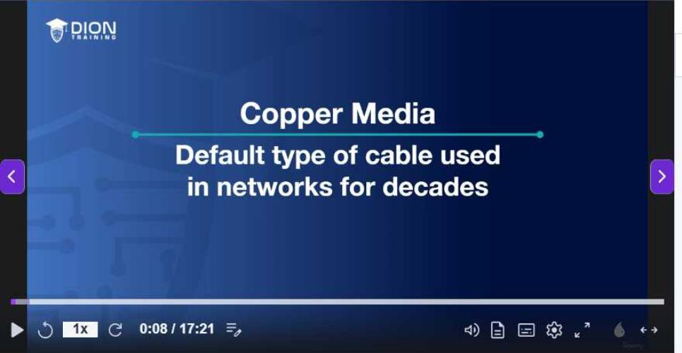

**2. Tiêu chuẩn IEEE 802.3: Bộ luật của mạng có dây**
IEEE 802.3 là một bộ tiêu chuẩn kỹ thuật thiết lập các quy tắc "chơi" cho mạng Ethernet. Về mặt kỹ thuật, nó định nghĩa hai tầng đầu tiên trong mô hình OSI:

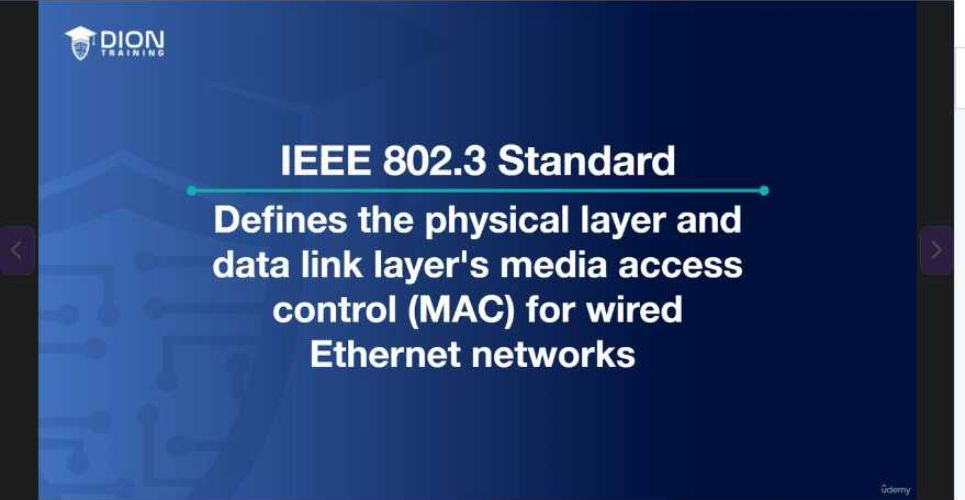

*   **Physical Layer (Tầng vật lý):** Định nghĩa cách các tín hiệu điện được truyền tải qua dây đồng hoặc ánh sáng qua sợi quang.
*   **Data Link Layer - Media Access Control (MAC):** Quy định cách các thiết bị trên cùng một mạng chia sẻ đường truyền để tránh va chạm dữ liệu.
Nếu không có 802.3, các thiết bị từ các nhà sản xuất khác nhau sẽ không thể "nói chuyện" được với nhau vì chúng không cùng sử dụng một ngôn ngữ truyền dẫn vật lý.

> **💡 Ví dụ nhớ đời:** Hãy tưởng tượng IEEE 802.3 giống như "Luật giao thông" dành cho người đi bộ và đi xe đạp. Dù bạn đi xe đạp địa hình (cáp quang) hay xe đạp thường (cáp đồng), tất cả đều phải đi đúng làn đường, dừng đèn đỏ (quy tắc MAC) và tuân thủ các quy định về tốc độ để đảm bảo giao thông không bị tắc nghẽn.

**3. Phân loại cáp theo chuẩn IEEE 802.3**
Tiêu chuẩn này không chỉ dừng lại ở cáp đồng mà còn bao quát nhiều môi trường truyền dẫn khác nhau:

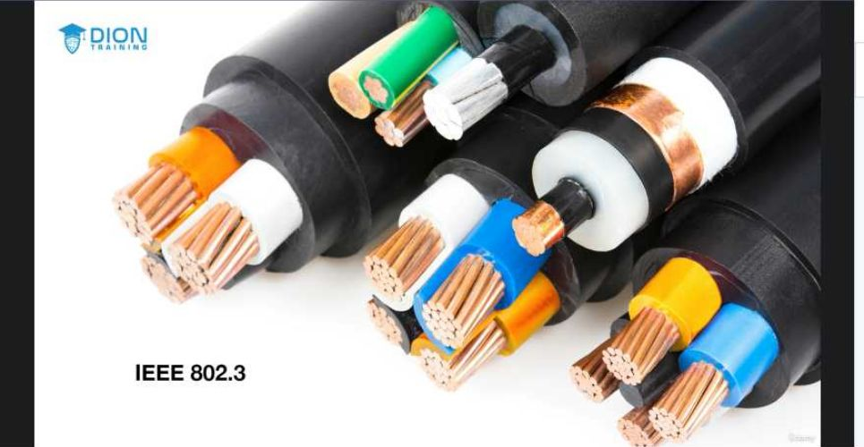

*   **Twisted Pair (Cáp xoắn đôi):** Phổ biến nhất trong văn phòng.
*   **Coaxial Cables (Cáp đồng trục):** Từng thống trị trong các mạng cũ, nay chủ yếu dùng cho truyền hình cáp.
*   **Twinaxial & Direct Attach Copper (DAC):** Thường được sử dụng trong các trung tâm dữ liệu (Data Center) để kết nối các thiết bị ở khoảng cách rất ngắn (rack-to-rack) với tốc độ cực cao.

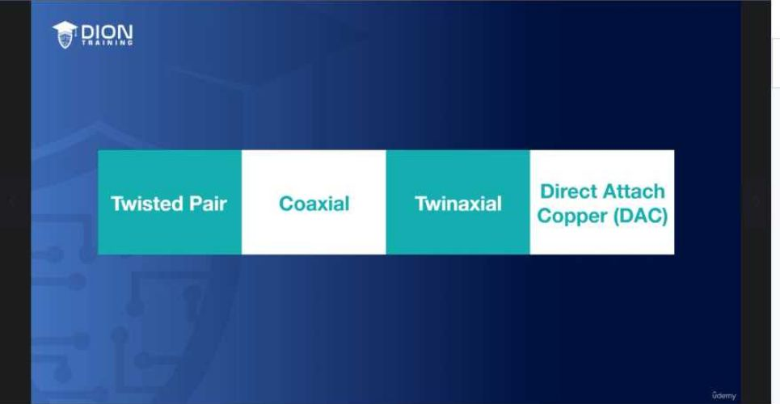

**4. Cơ chế chống nhiễu của cáp xoắn đôi (Twisted Pair)**

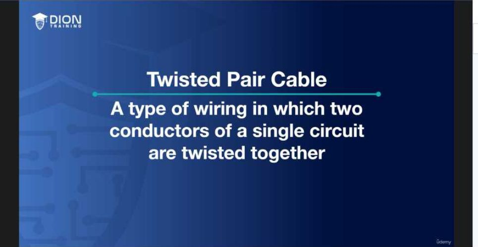

Đây là một khái niệm vật lý thú vị. Tại sao lại phải xoắn các sợi dây đồng lại với nhau?
*   **Electromagnetic Interference (EMI):** Các thiết bị điện tử, bóng đèn, hay đường dây điện đi gần đó đều phát ra sóng điện từ. Khi dây dẫn chạy thẳng, sóng này sẽ tạo ra dòng điện cảm ứng làm méo tín hiệu dữ liệu.
*   **Crosstalk (Nhiễu chéo):** Là hiện tượng tín hiệu từ sợi dây này "rò rỉ" sang sợi dây bên cạnh trong cùng một bó cáp.
*   **Nguyên lý triệt tiêu:** Khi hai dây được xoắn lại, sóng nhiễu bên ngoài tác động vào cả hai sợi dây với cường độ gần như nhau. Khi tín hiệu được thu nhận ở đầu kia (bộ thu dùng kỹ thuật vi sai - differential signaling), nó sẽ trừ giá trị của hai dây cho nhau. Vì nhiễu giống nhau nên nó tự triệt tiêu, chỉ để lại tín hiệu dữ liệu gốc.

> **💡 Ví dụ nhớ đời:** Hãy hình dung hai người đang nói chuyện trong một căn phòng ồn ào (nhiễu EMI). Nếu họ đứng xa nhau, tiếng ồn sẽ lấn át giọng nói. Nhưng nếu họ xoắn tay nhau và nói vào tai nhau theo cặp, các tạp âm (nhiễu) sẽ lọt vào cả hai tai cùng lúc. Bộ não (thiết bị nhận) sẽ tự động lọc bỏ âm thanh nền chung đó và chỉ tập trung vào sự khác biệt giữa hai luồng âm thanh, từ đó nghe rõ thông điệp chính.

**5. So sánh UTP và STP**

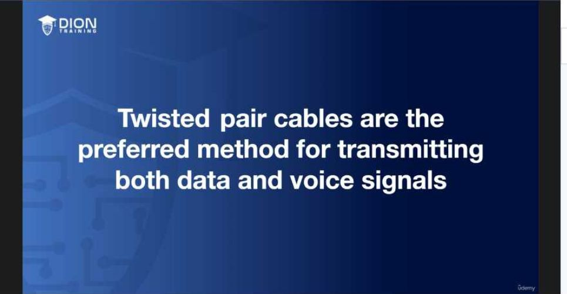

*   **Unshielded Twisted Pair (UTP):** Không có lớp bọc kim loại. Nó dựa hoàn toàn vào kỹ thuật xoắn cặp để chống nhiễu. Đây là lựa chọn số 1 vì tính kinh tế, nhẹ và độ linh hoạt (dễ dàng luồn lách trong các ống gen kỹ thuật hẹp).
*   **Shielded Twisted Pair (STP):** Có thêm một lớp bọc bạc hoặc lưới kim loại bên dưới vỏ nhựa để ngăn chặn nhiễu từ bên ngoài xâm nhập. Thường dùng trong môi trường công nghiệp có máy móc hạng nặng gây nhiễu điện từ cực mạnh.

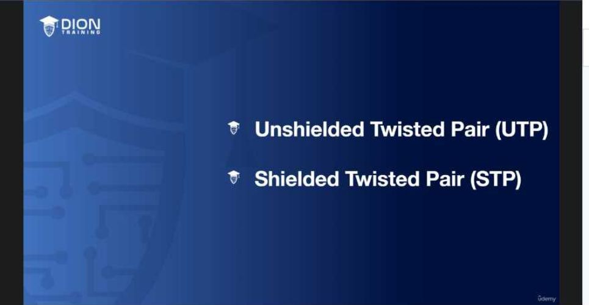

**6. Tại sao UTP là tiêu chuẩn vàng cho mạng LAN?**
UTP là sự cân bằng hoàn hảo giữa hiệu năng và chi phí. Việc không có lớp bọc giáp (shielding) làm cho cáp trở nên nhẹ và cực kỳ linh hoạt (flexible). Điều này cho phép các kỹ sư mạng dễ dàng lắp đặt hàng trăm mét cáp trong các tòa nhà mà không lo sợ cáp quá nặng hay quá cứng, làm hỏng cấu trúc hạ tầng hoặc gây khó khăn cho việc thi công. Mặc dù nhạy cảm hơn với nhiễu so với STP, nhưng trong môi trường văn phòng tiêu chuẩn, UTP là quá đủ để truyền tải dữ liệu ở tốc độ cao (Gigabit Ethernet hoặc hơn).

Tiếp nối định nghĩa về cơ chế chống nhiễu cơ bản của dây cáp xoắn đôi, phần này đi sâu vào sự so sánh thực tế giữa hai biến thể quan trọng nhất: UTP (Unshielded Twisted Pair) và STP (Shielded Twisted Pair), cũng như giới thiệu về các tiêu chuẩn phân loại cáp (Category).

### 1. Phân tích chuyên sâu: UTP vs. STP

**Ưu điểm và nhược điểm của UTP (Cáp xoắn đôi không bọc giáp):**

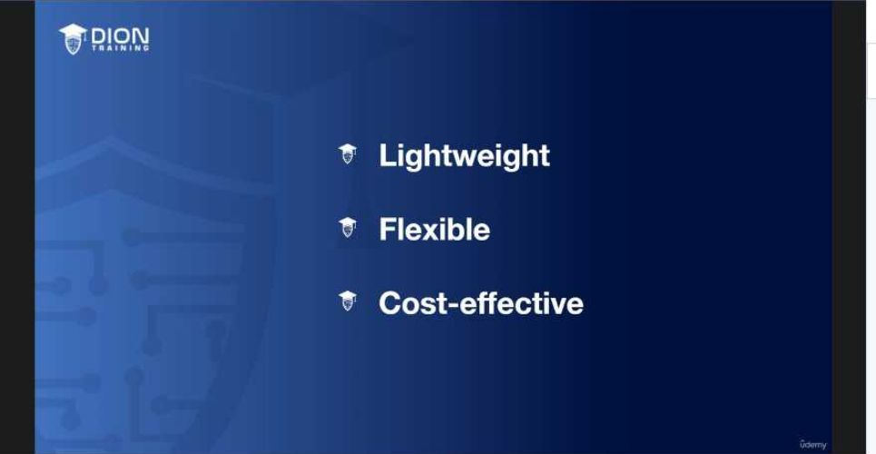

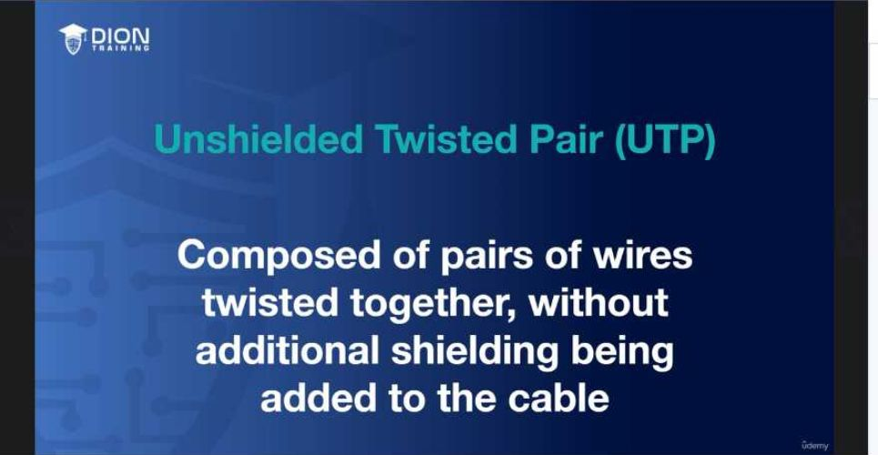

UTP là lựa chọn "quốc dân" trong các mạng nội bộ (LAN) nhờ vào thiết kế tinh giản. Việc loại bỏ lớp bọc chống nhiễu (shielding) không chỉ giúp cáp nhỏ gọn hơn, linh hoạt hơn trong quá trình luồn lách qua các máng cáp hay ống gen, mà còn giảm đáng kể chi phí sản xuất và thi công.

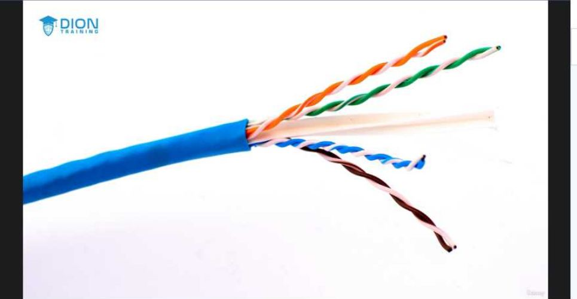

> **💡 Ví dụ nhớ đời:** Hãy tưởng tượng UTP giống như một chiếc áo thun mỏng nhẹ. Bạn có thể dễ dàng gấp gọn nó vào vali, di chuyển linh hoạt và chi phí để sở hữu nó rất rẻ. Tuy nhiên, nếu bạn đi vào vùng thời tiết khắc nghiệt (nhiễu điện từ cao), chiếc áo thun đó không thể bảo vệ bạn khỏi cái lạnh.

**Cấu tạo và cơ chế hoạt động của STP (Cáp xoắn đôi bọc giáp):**

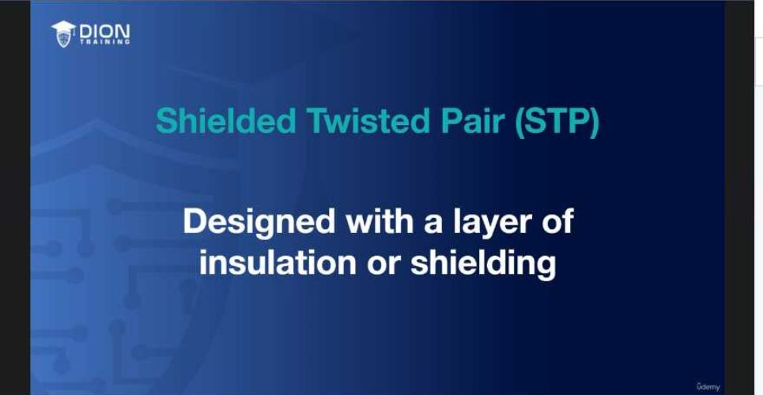

Trái ngược với UTP, STP được gia cố bằng một lớp bảo vệ (shielding) làm từ băng đồng, polymer dẫn điện hoặc lưới bện kim loại. Lớp này đóng vai trò như một "chiếc lồng Faraday", bao bọc lấy các cặp dây xoắn bên trong để phản xạ hoặc triệt tiêu các xung nhiễu điện từ (EMI) trước khi chúng kịp tác động đến tín hiệu truyền dẫn.

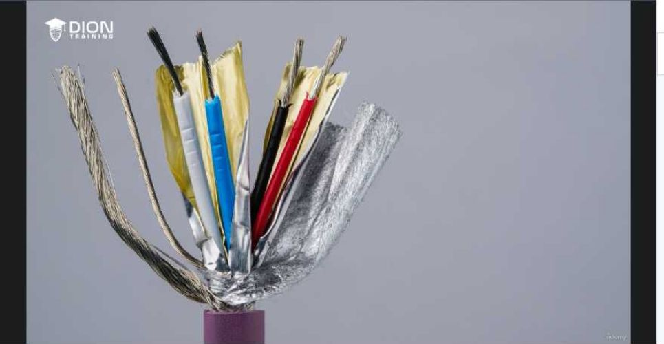

**Khi nào cần sử dụng STP thay vì UTP?**

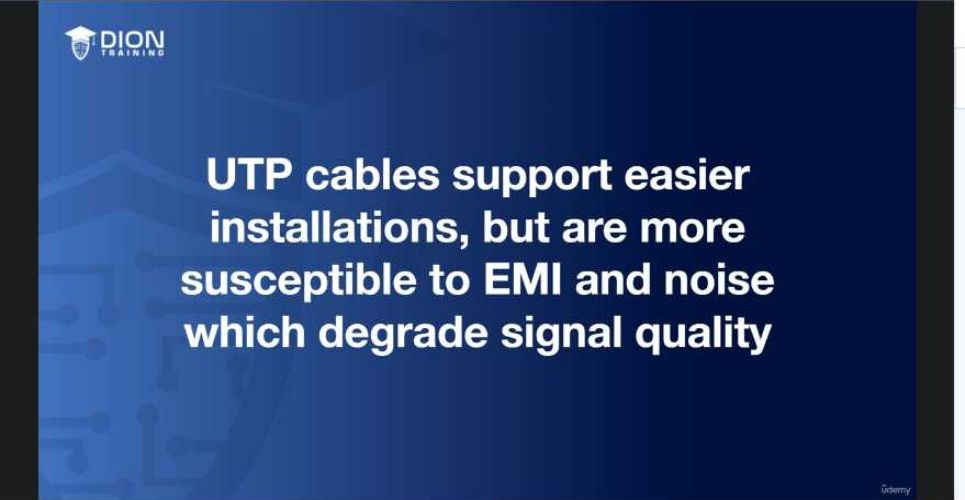

Việc lựa chọn không dựa trên sở thích mà dựa trên môi trường vật lý:
*   **Môi trường "sạch":** Nếu văn phòng của bạn chỉ có máy tính và các thiết bị văn phòng thông thường, UTP là quá đủ. 
*   **Môi trường "nhiễu":** Nếu bạn triển khai cáp trong nhà máy có nhiều động cơ điện công nghiệp, hệ thống đèn huỳnh quang công suất lớn, hoặc chạy song song với đường dây điện cao áp, EMI sẽ trở thành "kẻ thù" phá hủy dữ liệu. Lúc này, STP trở thành giải pháp bắt buộc để duy trì tính toàn vẹn của tín hiệu, giảm thiểu lỗi bit và duy trì tốc độ truyền dẫn cao ở khoảng cách xa hơn.

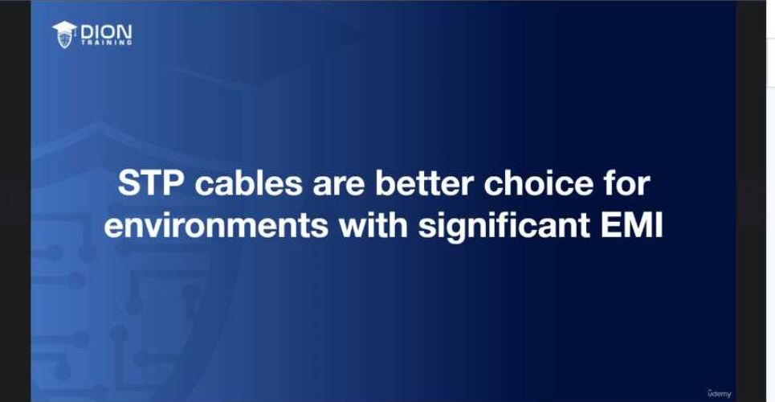

**Đánh đổi của STP:**

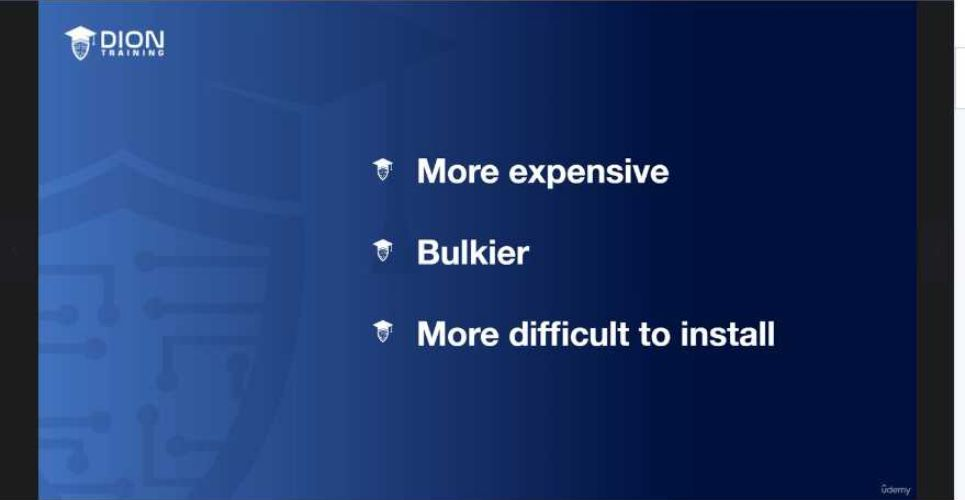

Sự an toàn luôn đi kèm với cái giá phải trả. STP dày hơn (bulkier), cứng hơn, khiến việc uốn cong và bấm đầu nối trở nên khó khăn hơn nhiều. Ngoài ra, chi phí vật tư và nhân công lắp đặt STP cao hơn hẳn, đòi hỏi kỹ thuật tiếp địa (grounding) chính xác để lớp bọc phát huy đúng tác dụng.

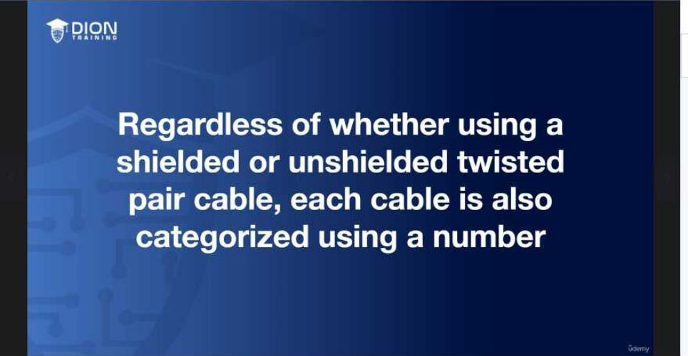

### 2. Phân loại cáp theo tiêu chuẩn (Categories)

Để chuẩn hóa khả năng truyền dẫn (tốc độ và khoảng cách), ngành công nghiệp mạng sử dụng hệ thống phân loại từ CAT 5 đến CAT 8. Mỗi "CAT" (Category) đại diện cho một bước tiến kỹ thuật trong việc kiểm soát độ xoắn của cặp dây và chất lượng vật liệu cách điện.

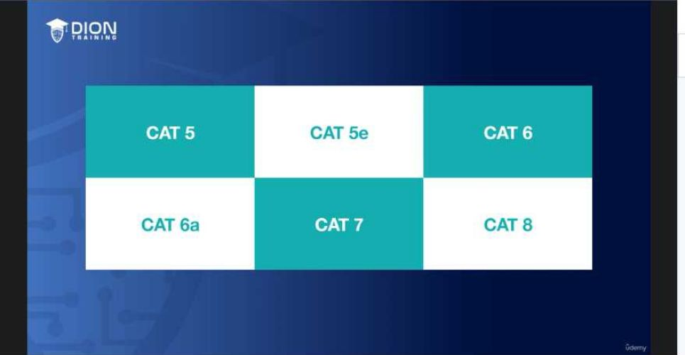

**Phân tích CAT 5 - "Người tiền nhiệm" trong bảo tàng công nghệ:**

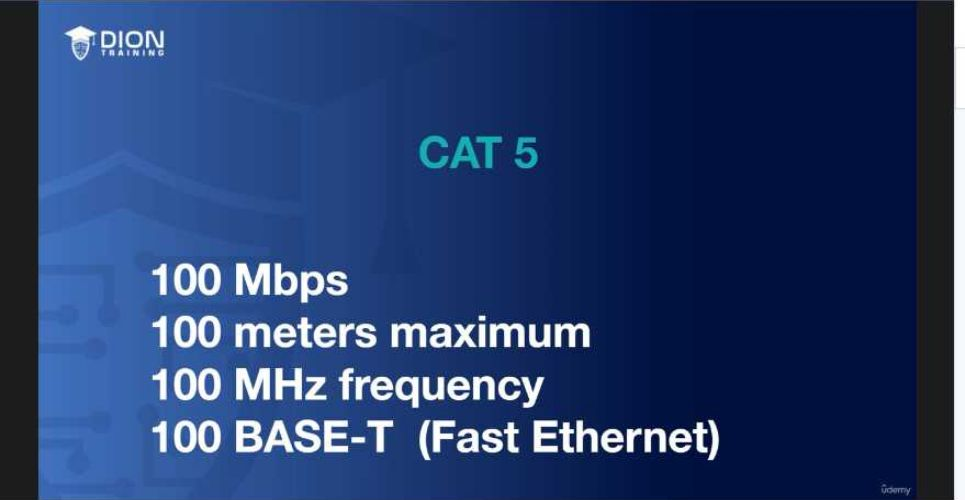

*   **Vị thế:** Đây là thế hệ cũ nhất mà bạn còn có khả năng bắt gặp trong các hệ thống mạng cũ hoặc các tòa nhà đã lâu chưa nâng cấp.
*   **Giới hạn:** CAT 5 chỉ hỗ trợ tốc độ truyền tải tối đa là 100 Mbps (Fast Ethernet). Trong kỷ nguyên của video 4K và truyền tải dữ liệu dung lượng lớn, con số 100 Mbps này đã trở nên lạc hậu.
*   **Khoảng cách:** Giới hạn vật lý của cáp CAT 5 là 100 mét. Nếu vượt quá khoảng cách này, suy hao tín hiệu sẽ khiến tốc độ sụt giảm nghiêm trọng hoặc mất kết nối hoàn toàn.

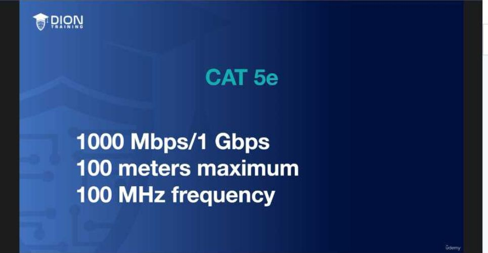

**Tóm lược bảng so sánh:**

| Đặc điểm | UTP | STP |
| :--- | :--- | :--- |
| **Khả năng chống nhiễu** | Thấp (Dựa vào độ xoắn) | Cao (Lớp bọc + độ xoắn) |
| **Chi phí** | Rẻ | Đắt |
| **Độ linh hoạt** | Cao (Mềm, dễ đi dây) | Thấp (Cứng, khó thi công) |
| **Ứng dụng** | Văn phòng, gia đình | Nhà máy, môi trường nhiễu cao |

Việc nắm rõ sự khác biệt này giúp người quản trị mạng tối ưu hóa chi phí đầu tư (CAPEX) mà không làm ảnh hưởng đến hiệu suất hệ thống (Performance). Chúng ta sẽ tiếp tục phân tích các tiêu chuẩn cao hơn như CAT 6, 7, 8 ở các phần kế tiếp để thấy được sự tiến hóa vượt bậc về tốc độ truyền dẫn.

Chúng ta tiếp tục đi sâu vào các tiêu chuẩn phân loại cáp Ethernet, bắt đầu từ sự chuyển giao giữa các thế hệ.

### 1. Sự tiến hóa từ CAT 5 lên CAT 5e

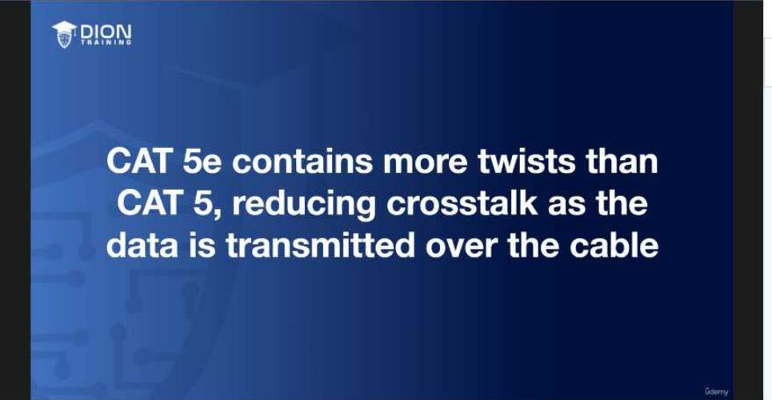

CAT 5 là tiêu chuẩn nền tảng, nhưng khi nhu cầu băng thông tăng lên, "CAT 5e" (Category 5 Enhanced) đã ra đời như một bản nâng cấp thiết yếu. Điểm mấu chốt kỹ thuật ở đây không nằm ở hình dáng bên ngoài mà nằm ở cấu trúc vật lý: **số vòng xoắn**.

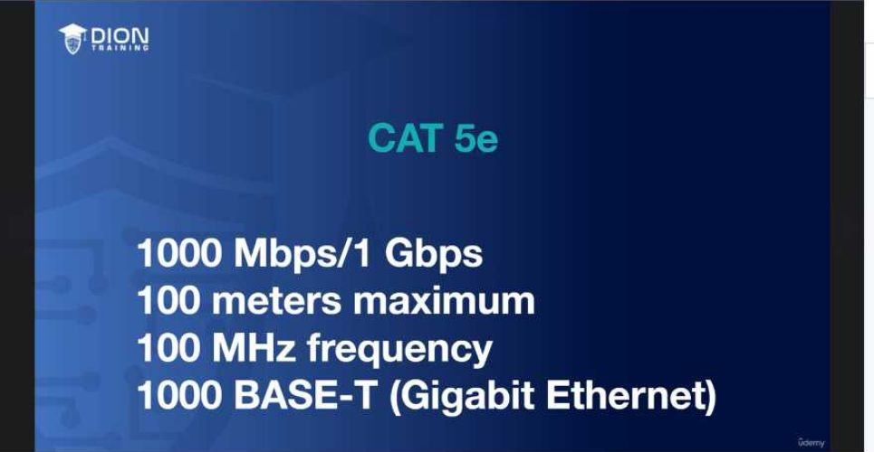

*   **Cơ chế giảm nhiễu:** CAT 5e có mật độ xoắn các cặp dây đồng cao hơn so với CAT 5. Trong truyền dẫn tín hiệu, hiện tượng "crosstalk" (nhiễu chéo) xảy ra khi tín hiệu từ dây này rò rỉ sang dây khác, gây suy giảm dữ liệu. Việc tăng độ xoắn giúp triệt tiêu nhiễu này hiệu quả hơn, đảm bảo tính toàn vẹn của tín hiệu (signal integrity).

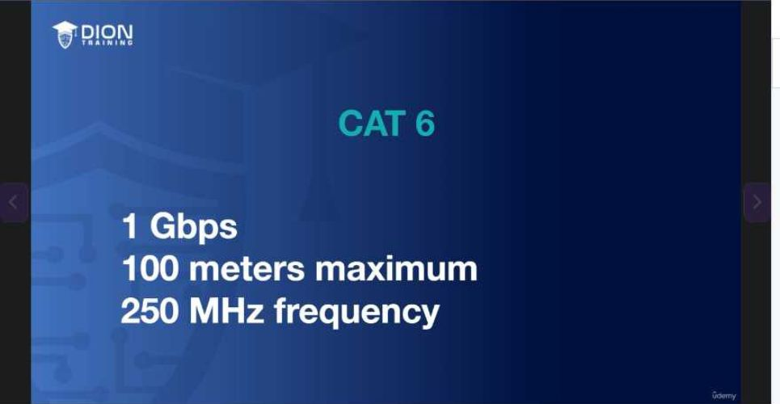

*   **Hiệu suất:** Nhờ cấu trúc này, CAT 5e có thể đẩy tốc độ truyền tải lên gấp 10 lần (từ 100 Mbps lên 1 Gbps) dù vẫn duy trì băng tần 100 MHz. Điều này biến nó thành tiêu chuẩn "Gigabit Ethernet" (1000 BASE-T) phổ biến nhất trong nhiều năm.

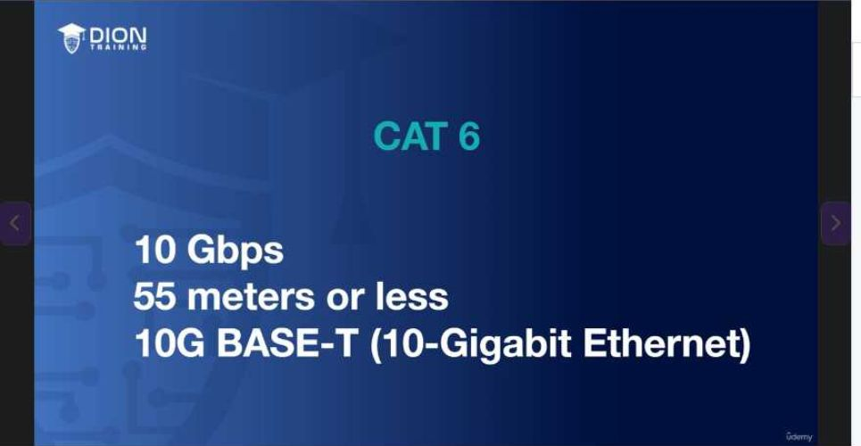

> **💡 Ví dụ nhớ đời:** Hãy hình dung việc truyền tín hiệu qua dây đồng giống như việc nói chuyện trong một căn phòng. CAT 5 giống như việc bạn cố nói giữa một căn phòng ồn ào; nếu nói quá nhanh, mọi người sẽ nghe nhầm. CAT 5e giống như việc chúng ta yêu cầu mọi người giữ trật tự và ngồi cách xa nhau hơn một chút (tăng độ xoắn), nhờ đó bạn có thể nói nhanh hơn gấp 10 lần mà thông điệp vẫn rõ ràng, không bị chồng chéo.

### 2. CAT 6: Sự phân nhánh về hiệu suất theo khoảng cách
CAT 6 giới thiệu một cách tiếp cận linh hoạt hơn dựa trên chiều dài cáp:

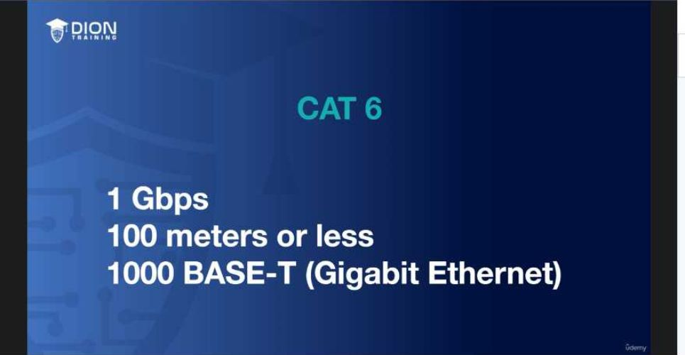

*   **Băng thông:** Tăng lên 250 MHz, cho phép xử lý dữ liệu phức tạp hơn so với CAT 5e.
*   **Quy tắc kép về tốc độ:** 
    *   Ở khoảng cách tiêu chuẩn 100 mét: Nó hoạt động tương tự CAT 5e (1 Gbps).

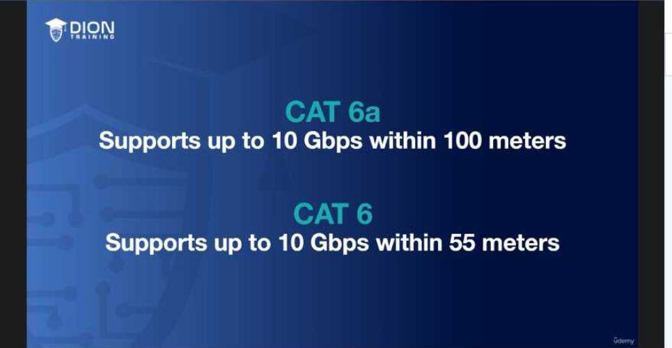

    *   Ở khoảng cách rút ngắn dưới 55 mét: Nó có khả năng hỗ trợ lên đến 10 Gbps.

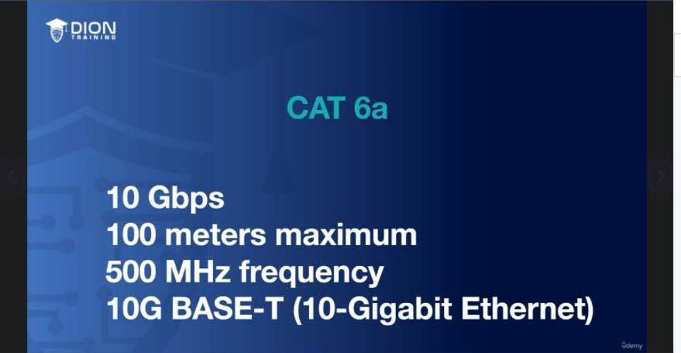

*   **Ứng dụng:** Đây là lựa chọn chiến lược trong các văn phòng nơi khoảng cách giữa các switch và thiết bị đầu cuối không quá xa, cho phép đạt được tốc độ 10 Gigabit Ethernet (10G BASE-T) mà không cần đầu tư vào các loại cáp đắt tiền hơn.

### 3. CAT 6a (Augmented): Chinh phục giới hạn 10 Gbps

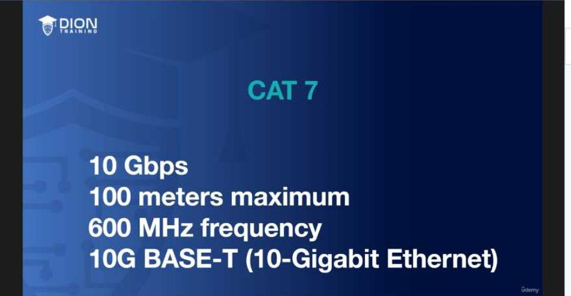

Nếu CAT 6 là sự linh hoạt, thì CAT 6a (Category 6 Augmented) là sự tối ưu hóa tuyệt đối cho tốc độ 10 Gbps.

*   **Đột phá về chống nhiễu:** Để đạt được tốc độ 10 Gbps trên toàn bộ chiều dài 100 mét, CAT 6a được thiết kế với lớp bảo vệ (shielding) và cấu trúc xoắn tinh vi hơn nhiều so với CAT 6. Sự cải tiến này giúp giảm thiểu triệt để nhiễu chéo vốn là rào cản ngăn cản CAT 6 đạt tốc độ cao ở khoảng cách xa.

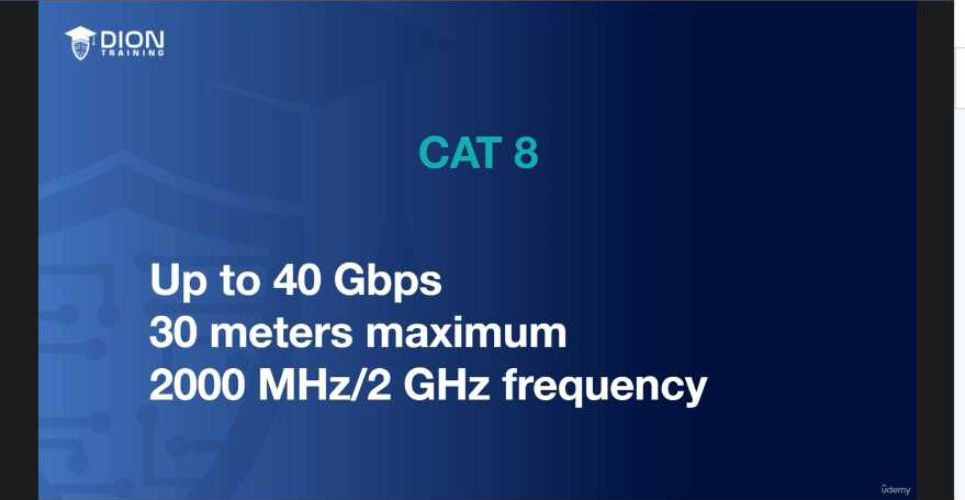

*   **Thông số kỹ thuật:** Hoạt động ở tần số lên tới 500 MHz, gấp đôi CAT 6, đảm bảo sự ổn định cho các hệ thống mạng doanh nghiệp hiện đại yêu cầu băng thông cực lớn.

### Tổng hợp so sánh các tiêu chuẩn truyền dẫn

| Loại cáp | Băng thông (MHz) | Tốc độ tối đa | Khoảng cách tối đa cho tốc độ cao nhất |
| :--- | :--- | :--- | :--- |
| **CAT 5e** | 100 MHz | 1 Gbps | 100 mét |
| **CAT 6** | 250 MHz | 10 Gbps | 55 mét |
| **CAT 6a** | 500 MHz | 10 Gbps | 100 mét |

Sự khác biệt giữa các danh mục này chính là bài toán cân não giữa **chi phí** và **hiệu năng**:
*   Nếu bạn cần hệ thống 1 Gbps tiết kiệm cho khoảng cách xa: CAT 5e vẫn là lựa chọn kinh tế.
*   Nếu bạn cần 10 Gbps trong không gian nhỏ (dưới 55m): CAT 6 giúp tiết kiệm chi phí so với việc dùng CAT 6a.
*   Nếu bạn cần 10 Gbps ổn định trên toàn bộ cấu trúc tòa nhà (100m): CAT 6a là sự lựa chọn bắt buộc để đảm bảo tín hiệu không bị suy hao.

Đoạn transcript kết thúc với việc nhắc đến CAT 7, mở ra một phân khúc cao cấp hơn nữa, nơi mà các tiêu chuẩn vật lý được đẩy lên những giới hạn mới để phục vụ các hệ thống mạng chuyên dụng.

### Phân tích chuyên sâu về các tiêu chuẩn cáp mạng cao cấp và cáp đồng trục (Coaxial)

#### 1. CAT 7: Bước tiến về băng thông tần số

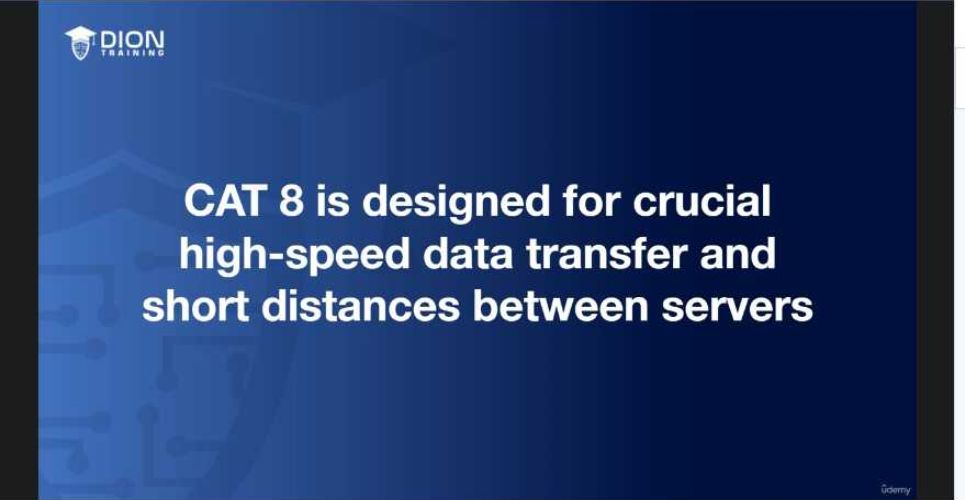

Mặc dù CAT 7 không được TIA/EIA công nhận là một tiêu chuẩn chính thức, nhưng nó vẫn tồn tại rộng rãi trên thị trường. Điểm cải tiến cốt lõi của CAT 7 so với CAT 6a không nằm ở tốc độ truyền tải tối đa (vẫn là 10 Gbps) hay khoảng cách vật lý (vẫn là 100m), mà nằm ở **tần số hoạt động**.

*   **Tần số 600 MHz:** Việc tăng từ 500 MHz (của CAT 6a) lên 600 MHz giúp tín hiệu ổn định hơn và ít bị suy hao hơn khi truyền tải dữ liệu nặng.
*   **Ứng dụng:** CAT 7 thường được triển khai trong các môi trường yêu cầu sự ổn định cao của mạng 10GBASE-T, nơi mà việc quản lý nhiễu điện từ là ưu tiên hàng đầu.

#### 2. CAT 8: Đỉnh cao của cáp đồng hiện đại

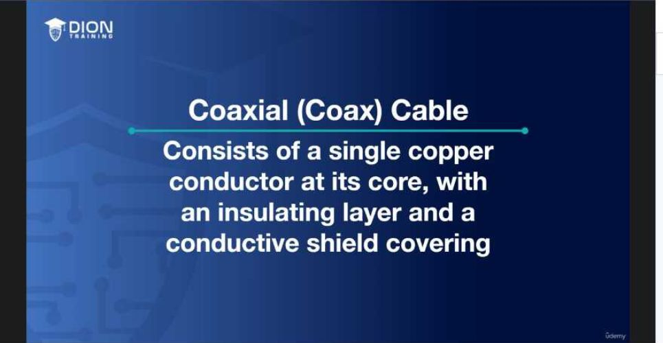

CAT 8 đại diện cho một sự thay đổi tư duy thiết kế hoàn toàn khác biệt so với các thế hệ tiền nhiệm. 

*   **Hiệu năng vượt trội:** Với tốc độ lên đến 40 Gbps, CAT 8 là bước nhảy vọt về tốc độ, nhưng cái giá phải trả là **khoảng cách truyền tải**. Do tần số hoạt động cực cao (2000 MHz hay 2 GHz), tín hiệu rất dễ bị suy giảm nếu đường truyền quá dài. Vì vậy, giới hạn khoảng cách chỉ còn 30m.
*   **Môi trường sử dụng:** CAT 8 không dành cho việc đi dây văn phòng hay gia đình. Nó là "vũ khí" của các trung tâm dữ liệu (Data Center). Nó được dùng để thay thế cáp quang trong các khoảng cách ngắn (đấu nối giữa các server trong cùng một rack hoặc giữa các tủ rack kề nhau).

> **💡 Ví dụ nhớ đời:** Hãy tưởng tượng CAT 8 giống như một chiếc xe đua F1. Nó có thể chạy với tốc độ kinh hoàng (40 Gbps) trên đường thẳng ngắn (30m), nhưng nó không được thiết kế để chạy đường trường (100m) như các dòng xe sedan bền bỉ (CAT 6a). Nếu bạn cố tình lái chiếc xe đua này đi đường dài, động cơ sẽ quá nhiệt (tín hiệu suy hao), đó là lý do tại sao nó chỉ dùng trong phạm vi hẹp của trung tâm dữ liệu.

#### 3. Cáp đồng trục (Coaxial Cable): Cấu trúc và sự chuyển mình

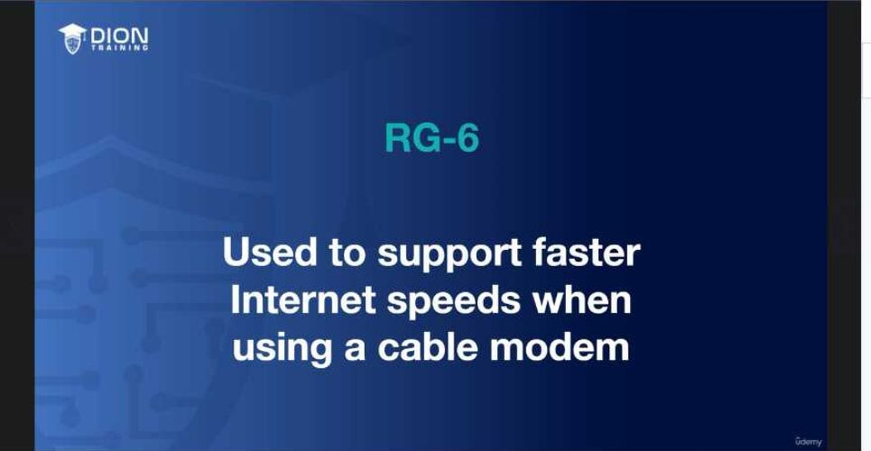

Khác với cáp xoắn đôi (Twisted Pair) dùng trong Ethernet, cáp đồng trục có cấu trúc hình trụ độc đáo: một lõi đồng đơn ở trung tâm, bao quanh bởi lớp cách điện và một lớp vỏ bọc dẫn điện (chống nhiễu).

*   **Di sản của truyền hình:** Ban đầu, Coax thống trị lĩnh vực phát sóng nhờ khả năng truyền tải dải tần rộng, cho phép gộp hàng chục kênh truyền hình vào một đường dây duy nhất mà không bị lẫn lộn tín hiệu.
*   **Sự thích nghi trong kỷ nguyên Internet:** Ngày nay, Coax không chỉ để xem tivi mà là hạ tầng quan trọng cho băng thông rộng. Các nhà cung cấp dịch vụ Internet sử dụng cáp modem để đẩy dữ liệu tốc độ cao vào nhà người dùng.

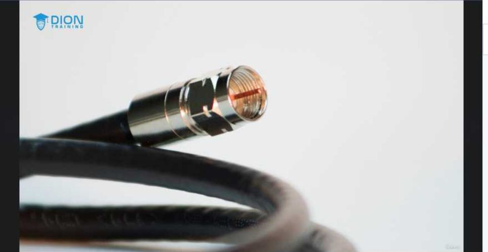

#### 4. So sánh RG-6 và RG-59: Sự tiến hóa của lõi đồng

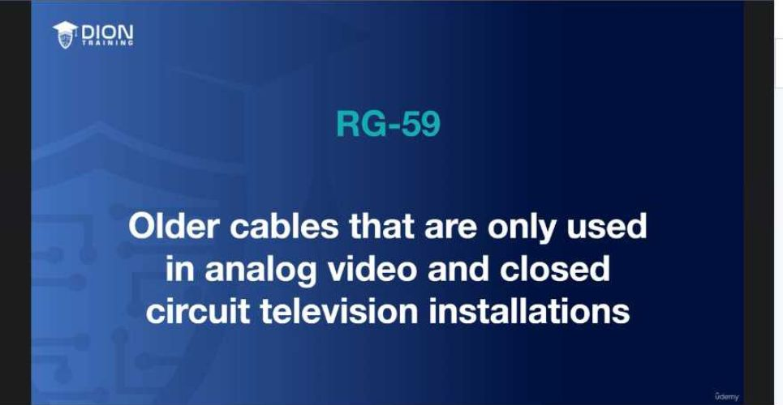

Trong thế giới cáp đồng trục, sự khác biệt giữa RG-6 và RG-59 nằm ở "trọng lượng" và kích thước của lõi.

*   **RG-6 (Tiêu chuẩn hiện đại):** Với lõi đồng trung tâm dày hơn, RG-6 là lựa chọn tối ưu cho băng thông rộng và các ứng dụng video kỹ thuật số. Độ dày này cho phép truyền tải tần số cao mà không bị mất dữ liệu đáng kể trên khoảng cách dài.

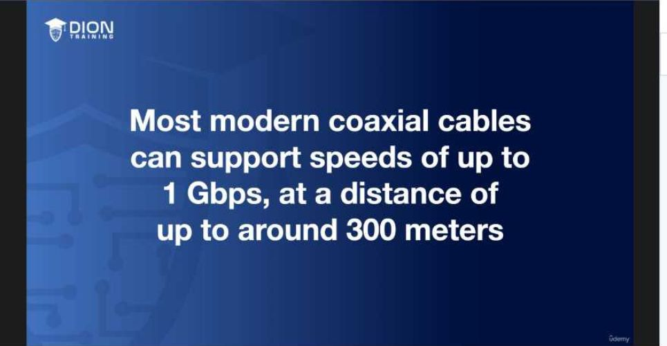

*   **RG-59 (Tiêu chuẩn lỗi thời):** Lõi đồng của RG-59 rất mỏng, khiến nó không thể tải được lưu lượng dữ liệu lớn hoặc tần số cao của Internet hiện đại. Nó hiện chỉ còn giới hạn trong các ứng dụng analog cũ hoặc hệ thống camera quan sát (CCTV) đơn giản, nơi không yêu cầu băng thông lớn hay độ phân giải cao.

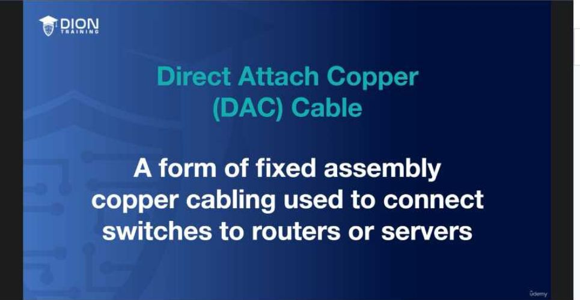

> **💡 Ví dụ nhớ đời:** Coi RG-6 là một "đường ống nước đường kính lớn", còn RG-59 là một "đường ống nước đường kính nhỏ". Khi bạn cần bơm lượng nước lớn (dữ liệu Internet 4K/tốc độ cao) vào nhà, đường ống nhỏ (RG-59) sẽ bị tắc nghẽn và áp lực giảm mạnh (suy hao tín hiệu), trong khi đường ống lớn (RG-6) sẽ vận chuyển lưu lượng mượt mà, không gặp trở ngại.

Trong phần này, chúng ta sẽ tập trung vào phân khúc cáp đồng chuyên dụng cho hạ tầng mạng tốc độ cao trong trung tâm dữ liệu, bao gồm cáp **Direct Attach Copper (DAC)** và **Twinaxial**.

### 1. Phân tích RG-6 trong mạng dữ liệu hiện đại
Trong khi phần trước đã đề cập RG-6 chủ yếu cho truyền hình và internet gia đình, thì ở đây, bài học làm rõ khả năng truyền tải dữ liệu thực tế của nó trong môi trường mạng:
*   **Hiệu suất:** Với hầu hết các loại cáp RG-6 hiện đại, chúng ta có thể đạt ngưỡng **1 Gigabit/giây (1 Gbps)** với khoảng cách tối đa là **300 mét**. Đây là một khoảng cách rất ấn tượng so với các loại cáp xoắn đôi (twisted pair) như CAT 6a hay CAT 8 (vốn bị giới hạn ở 100m hoặc 30m).

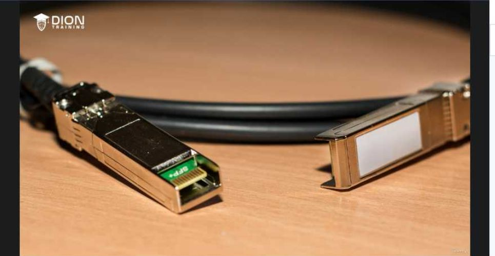

### 2. Direct Attach Copper (DAC) - Giải pháp tối ưu cho Data Center

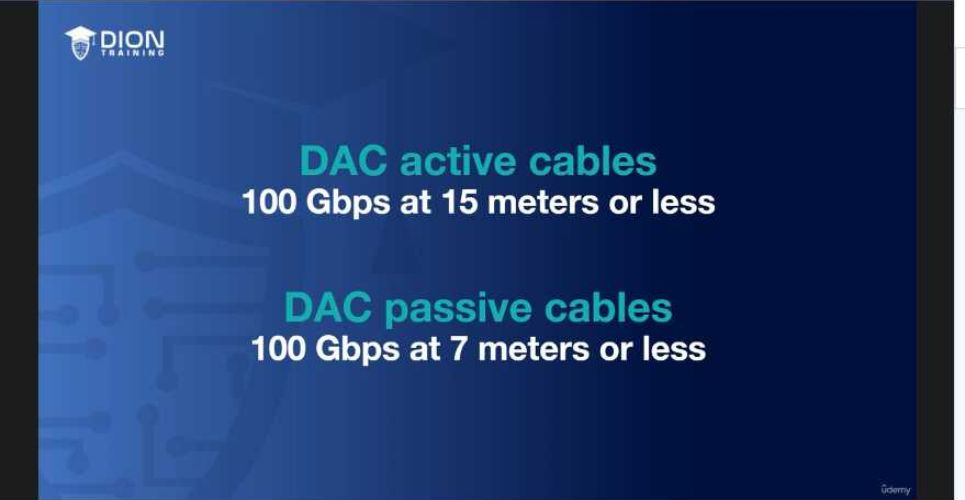

DAC là một dạng lắp ráp cáp đồng cố định (fixed assembly). Điểm mấu chốt ở đây là "cố định" – nghĩa là bạn không mua dây rời và đầu nối rời; tất cả đã được nhà sản xuất hàn gắn sẵn tại xưởng.
*   **Vị trí ứng dụng:** Được thiết kế riêng cho không gian hẹp (server racks), kết nối giữa các thiết bị hạ tầng như switch, router, firewall và server.
*   **Lợi thế cạnh tranh:** Tại sao không dùng cáp quang cho mọi thứ? DAC được ưu tiên vì **chi phí thấp** và **tiêu thụ điện năng cực thấp** so với cáp quang khi kết nối ở khoảng cách ngắn.

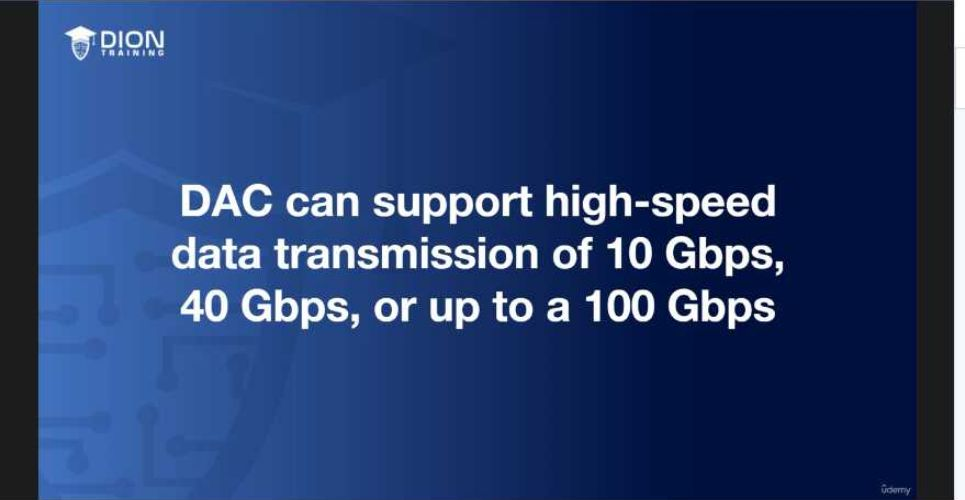

> **💡 Ví dụ nhớ đời:** Hãy tưởng tượng cáp quang là một chiếc xe đua F1: cực nhanh, chạy đường dài rất tốt nhưng chi phí bảo dưỡng đắt đỏ và "ngốn" nhiên liệu khủng khiếp. Còn cáp DAC giống như một chiếc xe điện đô thị nhỏ gọn: nó không chạy xuyên lục địa được, nhưng trong phạm vi một tòa nhà, nó di chuyển cực nhanh, chi phí vận hành rẻ hơn nhiều và không đòi hỏi hệ thống làm mát phức tạp.

*   **Phân loại DAC:**
    *   **Active Cable (Cáp chủ động):** Có tích hợp chip xử lý tín hiệu bên trong đầu nối, cho phép đạt tốc độ **100 Gbps** ở khoảng cách tối đa **15 mét**.

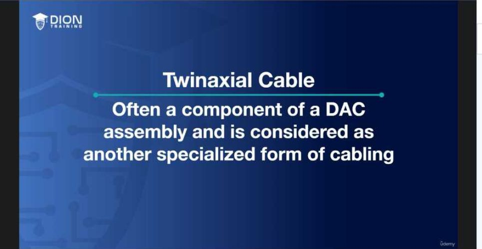

    *   **Passive Cable (Cáp thụ động):** Không có chip xử lý (chỉ truyền tín hiệu điện trực tiếp), do đó khoảng cách bị thu hẹp lại, chỉ còn **100 Gbps** ở khoảng cách tối đa **7 mét**.

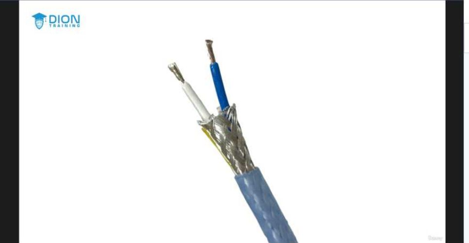

### 3. Twinaxial (Twinax) - Kiến trúc chuyên biệt

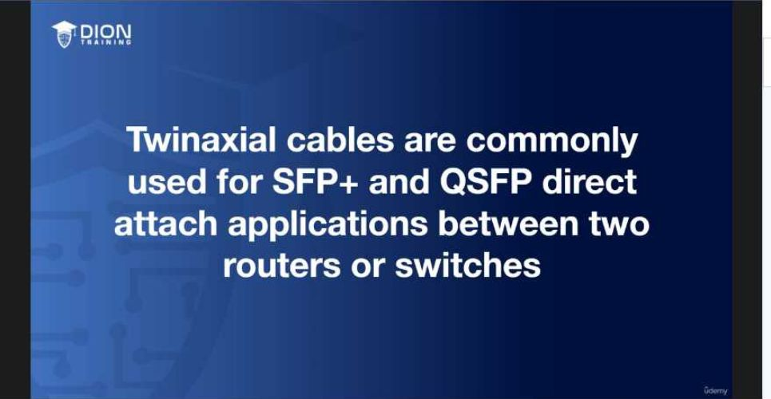

Twinaxial là một dạng nâng cấp cao cấp hơn của cáp đồng đồng trục truyền thống, thường đóng vai trò là "linh hồn" bên trong các cụm cáp DAC.
*   **Cấu trúc khác biệt:** Nếu cáp đồng trục (coax) truyền thống chỉ có 1 lõi đồng trung tâm, thì Twinaxial chứa **hai lõi đồng song song** được cách điện hoàn toàn trong cùng một lớp vỏ bọc.

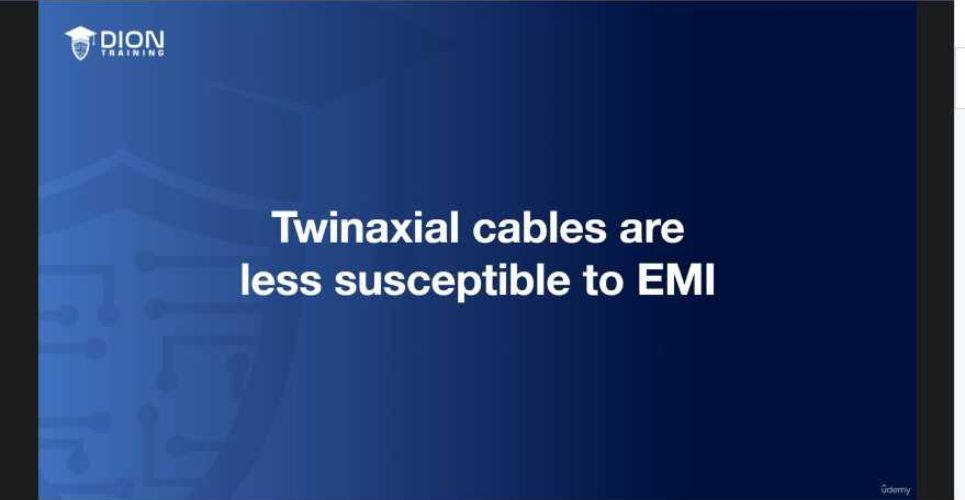

*   **Tại sao cần thiết kế này?** Thiết kế này được tối ưu hóa cho **tín hiệu vi sai (differential signaling)** ở tốc độ cao. Trong truyền dẫn vi sai, người ta gửi tín hiệu trên hai dây ngược pha nhau; khi nhiễu tác động lên cả hai dây, bên nhận sẽ triệt tiêu nhiễu bằng cách lấy hiệu số điện thế giữa hai dây đó. Điều này giúp tín hiệu cực kỳ "sạch" và ổn định.
*   **Các chuẩn giao tiếp thường dùng:** Bạn sẽ thường thấy Twinax đi kèm với các chuẩn cắm như **SFP+** (Small Form-factor Pluggable) hoặc **QSFP** (Quad Small Form-factor Pluggable) trên các thiết bị chuyển mạch (switch) hiện đại.

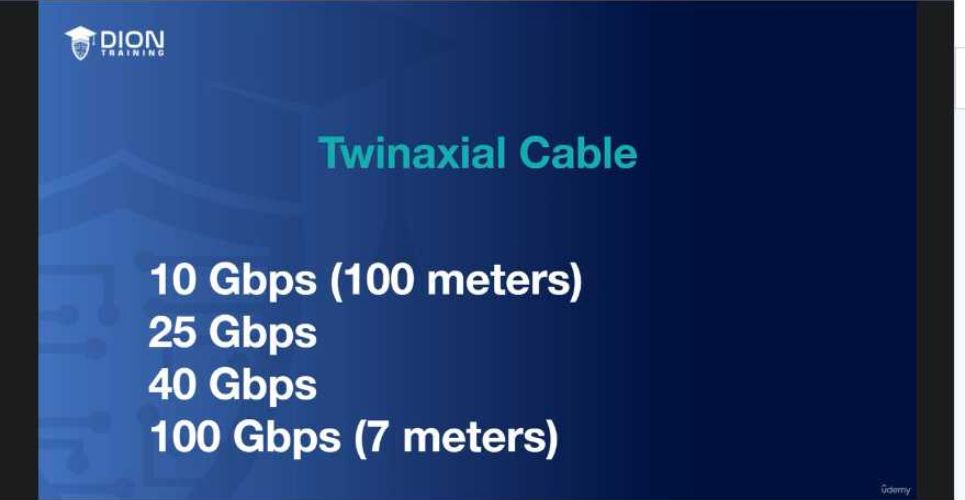

*   **Tính ưu việt:** Twinaxial cung cấp sự toàn vẹn tín hiệu (signal integrity) vượt trội so với cáp không có vỏ bọc (unshielded) truyền thống. Khi hoạt động ở tần số cao, cáp Twinax ít bị nhiễu điện từ hơn đáng kể, đảm bảo dữ liệu không bị sai lệch trong các đường truyền tốc độ từ 10Gbps đến 100Gbps.

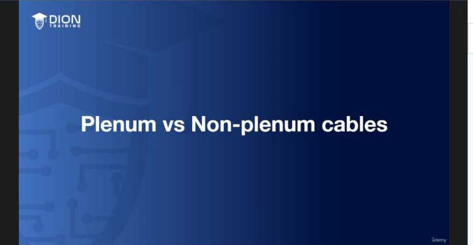

Tóm lại, nếu nhu cầu của bạn là kết nối các thiết bị trong cùng một giá đỡ server (rack) với khoảng cách rất ngắn nhưng yêu cầu băng thông cực lớn, DAC và Twinaxial chính là "câu trả lời" về mặt kỹ thuật và kinh tế so với cáp quang hoặc cáp mạng xoắn đôi truyền thống.

Tiếp nối việc khẳng định ưu thế về khả năng chống nhiễu điện từ (EMI) vượt trội, các loại cáp twinaxial (twinax) được triển khai trong môi trường trung tâm dữ liệu không chỉ mang lại sự ổn định cho tín hiệu mà còn cung cấp băng thông cực kỳ ấn tượng. Các tùy chọn tốc độ từ 10 Gbps, 25 Gbps, 40 Gbps cho đến 100 Gbps cho thấy tính linh hoạt của loại cáp này. Tuy nhiên, cần lưu ý sự đánh đổi giữa hiệu suất và khoảng cách vật lý: trong khi cáp 10 Gbps có thể truyền tải ổn định ở khoảng cách lên tới 100 mét, thì ở tốc độ 100 Gbps, chiều dài cáp bị rút ngắn đáng kể, chỉ còn 7 mét. Điều này nhấn mạnh bản chất của vật liệu đồng: tốc độ dữ liệu càng cao, hiện tượng suy hao tín hiệu càng lớn, đòi hỏi khoảng cách truyền dẫn phải ngắn lại để đảm bảo tính toàn vẹn của dữ liệu.

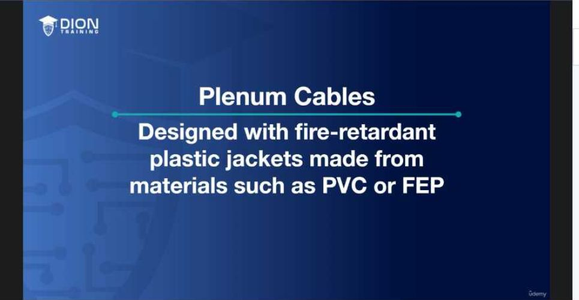

Chuyển sang khía cạnh an toàn cháy nổ, bài học tập trung vào sự khác biệt giữa cáp "plenum" và "non-plenum" – một yếu tố then chốt trong thiết kế hạ tầng mạng bền vững.

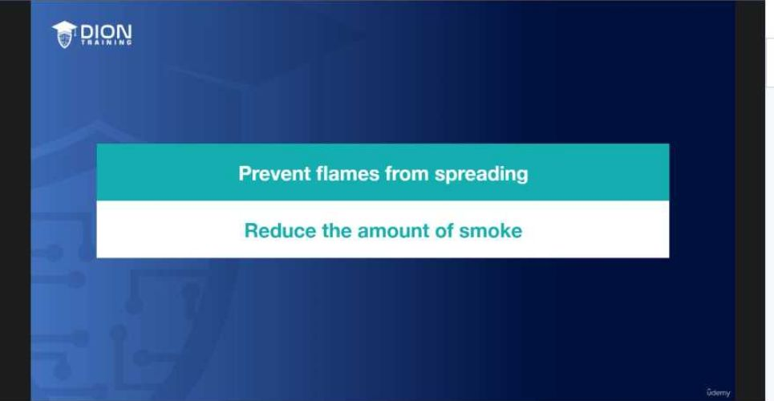

Cáp Plenum (Plenum-rated) được chế tạo đặc biệt với lớp vỏ ngoài làm từ nhựa chống cháy, tiêu biểu là PVC (Poly Vinyl Chloride) hoặc FEP (Fluorinated Ethylene Propylene). Điểm khác biệt cốt lõi không nằm ở hiệu năng truyền dẫn, mà nằm ở phản ứng hóa học khi có hỏa hoạn. Các vật liệu này có khả năng tự dập tắt ngọn lửa, ngăn chặn sự lan truyền của lửa dọc theo thân cáp và quan trọng nhất là hạn chế tối đa lượng khói độc sinh ra.

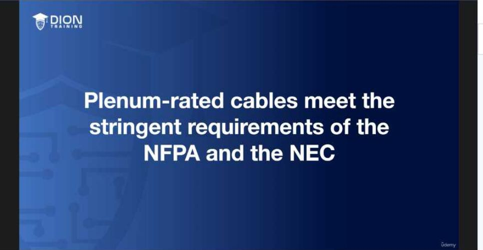

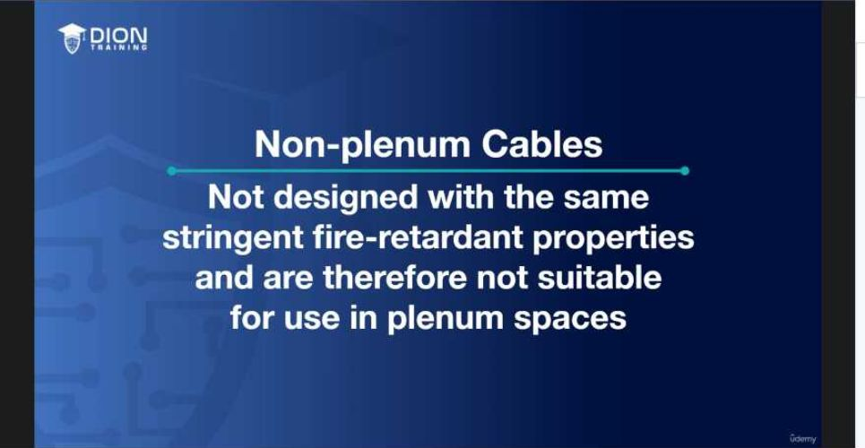

> **💡 Ví dụ nhớ đời:** Hãy tưởng tượng không gian "plenum" (khoảng trống trên trần giả hoặc dưới sàn nâng dùng để luân chuyển điều hòa) giống như những "đường ống dẫn dưỡng khí" cho tòa nhà. Nếu bạn dùng một loại cáp kém chất lượng (non-plenum) chạy qua đây, khi một sự cố chập điện xảy ra, lớp vỏ nhựa thường sẽ cháy rực và bốc khói độc. Hệ thống điều hòa trung tâm sẽ vô tình trở thành "chiếc quạt thổi khói" khổng lồ, luân chuyển khí độc đi khắp các văn phòng trong tòa nhà chỉ trong vài phút. Cáp plenum chính là "tấm khiên" ngăn chặn thảm họa đó xảy ra.

Vì những không gian plenum có lưu lượng oxy dồi dào – một yếu tố "tiếp tay" cho hỏa hoạn, việc lắp đặt cáp tại đây bắt buộc phải tuân thủ nghiêm ngặt các tiêu chuẩn từ NFPA (National Fire Protection Association) và NEC (National Electrical Code). Mặc dù chi phí đầu tư cho loại cáp này cao hơn đáng kể, nhưng đây là khoản chi phí bắt buộc để bảo vệ tính mạng con người và tài sản trong môi trường hạ tầng kín.

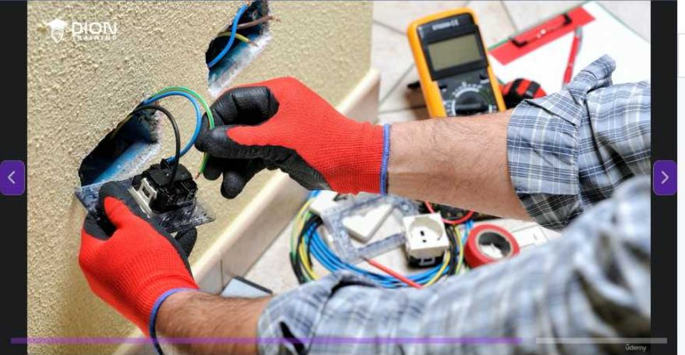

Ngược lại, cáp Non-plenum là lựa chọn phổ biến cho các mạng gia đình hoặc văn phòng nhỏ. Vì không được tích hợp các hóa chất chống cháy chuyên dụng, giá thành của chúng thấp hơn nhiều. Cáp non-plenum hoàn toàn phù hợp để sử dụng trong các khu vực không có sự lưu thông không khí trực tiếp như bên trong tường hoặc trong các ống dẫn (conduit) kín. Tại những vị trí này, nếu có cháy, ngọn lửa bị cô lập và không có đủ oxy hay đường thông gió để lan truyền nhanh chóng. Tuy nhiên, cần ghi nhớ rằng tuyệt đối không bao giờ được đưa cáp non-plenum vào không gian plenum, bởi khi tiếp xúc với ngọn lửa, chúng sẽ giải phóng một lượng lớn khói độc và các khí nguy hiểm, gây rủi ro cực lớn cho hệ thống an toàn của tòa nhà.

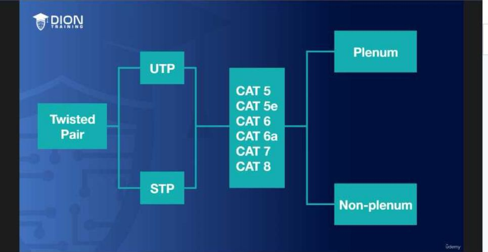

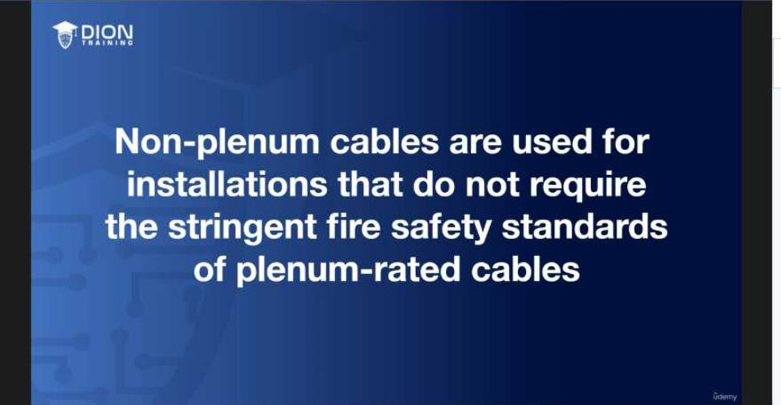

Để tối ưu hóa việc quản lý hệ thống mạng, việc phân loại cáp đồng dựa trên cấu trúc vật lý và tiêu chuẩn kỹ thuật là vô cùng quan trọng. Chúng ta có thể hệ thống hóa các loại cáp theo một trình tự tư duy logic như sau:

### 1. Hệ thống phân loại cáp đồng (Copper Media)
Việc phân loại cáp không chỉ dừng lại ở tên gọi mà là sự kết hợp của nhiều tiêu chí để xác định khả năng chịu tải và môi trường ứng dụng:

*   **Phân loại theo cấu trúc lõi:** Đầu tiên, cáp được chia thành hai nhóm chính là **Twisted Pair (Cáp xoắn đôi)** – phổ biến trong mạng LAN nội bộ, và **Coaxial (Cáp đồng trục)** – thường dùng cho truyền hình cáp hoặc kết nối băng thông rộng.

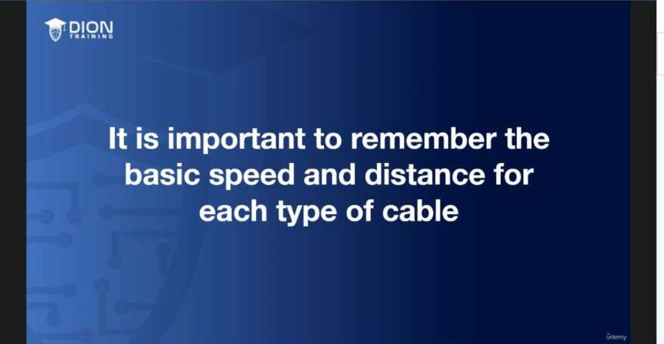

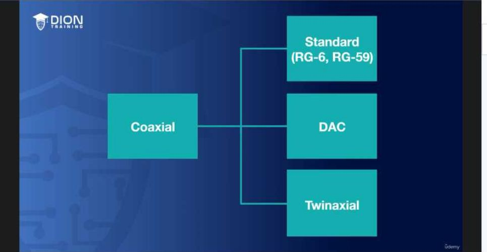

*   **Phân loại chuyên sâu cho Twisted Pair:** Nếu là cáp xoắn đôi, chúng ta xét tiếp đến khả năng chống nhiễu (Shielded - có giáp chống nhiễu, hoặc Unshielded - không giáp) và các chuẩn CAT (Category). Các chỉ số từ CAT 5 đến CAT 8 đại diện cho bước tiến về công nghệ truyền dẫn, băng thông và khả năng chống nhiễu tần số cao.
*   **Phân loại theo môi trường lắp đặt:** Đây là tiêu chí cuối cùng nhưng mang tính bắt buộc về pháp lý, đó là phân loại **Plenum** (chịu lửa, dùng trong ống thông gió) và **Non-plenum** (thông dụng, không dùng trong không gian chứa khí lưu thông).

> **💡 Ví dụ nhớ đời:** Hãy tưởng tượng cáp mạng như hệ thống giao thông. **Twisted Pair** giống như các con đường bộ nối giữa các căn phòng trong tòa nhà (kết nối máy tính), còn **Coaxial** giống như các đường cao tốc vận tải chính (kết nối tín hiệu từ nhà cung cấp dịch vụ vào tòa nhà). Mỗi loại cáp đều có một "giấy phép thông hành" riêng (chuẩn CAT) quy định nó được phép chạy với tốc độ tối đa bao nhiêu và trên quãng đường bao xa.

### 2. Bảng đối chiếu tốc độ và khoảng cách (The Performance Matrix)
Việc ghi nhớ các thông số của cáp đồng là kỹ năng sống còn của kỹ thuật viên mạng. Chúng ta có quy tắc "tăng dần đều" để dễ nắm bắt:

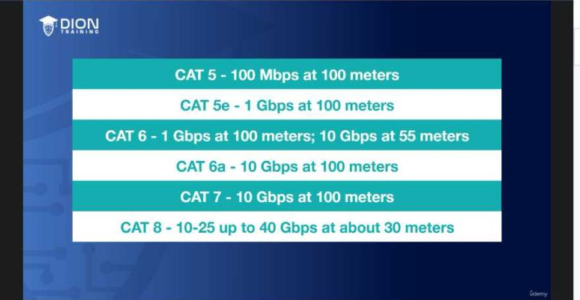

*   **CAT 5:** Tốc độ 100 Mbps ở khoảng cách tối đa 100 mét (Đây là chuẩn cũ, hiện nay ít sử dụng).

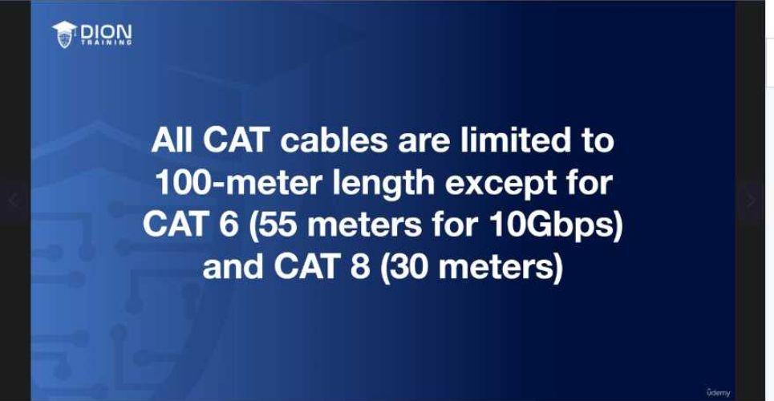

*   **CAT 5e:** Bước nhảy vọt lên 1 Gbps (1000 Mbps) trong giới hạn 100 mét.
*   **CAT 6:** Đa năng. Nó hỗ trợ 1 Gbps ở 100 mét, nhưng có khả năng đẩy lên 10 Gbps nếu rút ngắn khoảng cách xuống còn 55 mét.
*   **CAT 6a (Augmented):** Tối ưu hóa cho 10 Gbps ở phạm vi 100 mét trọn vẹn, không cần rút ngắn khoảng cách.
*   **CAT 7:** Giữ vững phong độ 10 Gbps ở 100 mét nhưng với khả năng chống nhiễu tốt hơn hẳn nhờ cấu trúc bọc giáp nghiêm ngặt.
*   **CAT 8:** "Quái vật" tốc độ, đạt từ 25 đến 40 Gbps, nhưng đánh đổi bằng khoảng cách cực ngắn – tối đa 30 mét.

### 3. Quy luật lũy tiến của tốc độ mạng
Điểm mấu chốt để ghi nhớ bảng thông số này là nhận diện quy luật **"Nhân hệ số 10"**. 

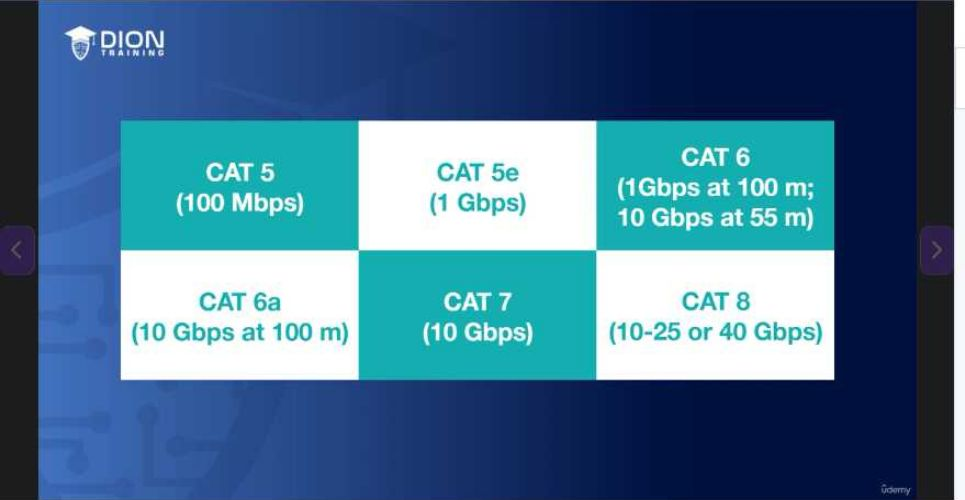

*   Từ CAT 5 (100 Mbps) lên CAT 5e (1 Gbps) là nhân 10.
*   Từ CAT 5e/CAT 6 (1 Gbps) lên 10 Gbps (trên CAT 6a) cũng là nhân 10.

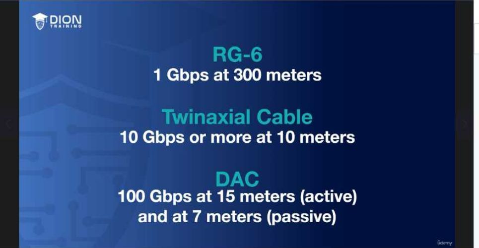

**Các lưu ý đặc biệt về giới hạn vật lý:**
*   **Giới hạn 100 mét:** Hầu hết các loại cáp CAT (5, 5e, 6a, 7) đều tuân thủ giới hạn 100 mét để đảm bảo tín hiệu không bị suy hao quá mức.

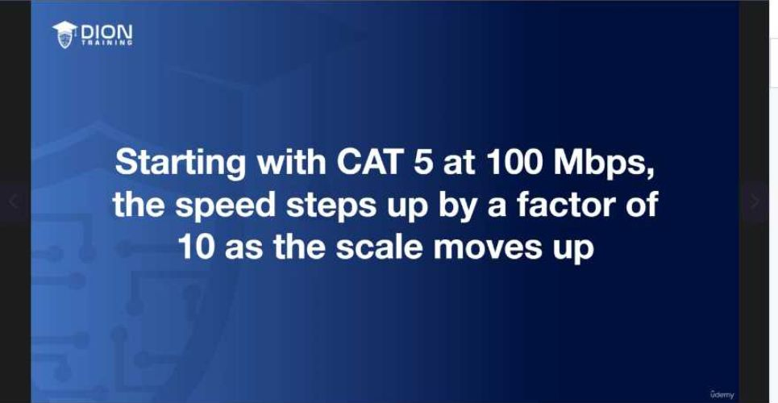

*   **Ngoại lệ:** 
    *   **CAT 6:** Để đạt tốc độ 10 Gbps, bạn buộc phải cắt giảm chiều dài cáp xuống còn 55 mét. Nếu vượt quá, tốc độ sẽ tụt về mức 1 Gbps.
    *   **CAT 8:** Vì nhắm tới mục tiêu hiệu năng siêu cao, nó bị giới hạn rất nghiêm ngặt ở mức 30 mét. Đây không phải là cáp để đi dây mạng văn phòng thông thường mà thường dùng trong các tủ rack, kết nối thiết bị khoảng cách gần với băng thông cực lớn.

Việc nắm vững các chỉ số này cho phép bạn thiết kế hệ thống vừa đảm bảo chi phí (không dùng cáp quá cao cấp cho nhu cầu thấp) vừa đảm bảo hiệu năng (không dùng cáp quá chậm cho các thiết bị cần dữ liệu lớn).

Tiếp nối phân tích về các tiêu chuẩn cáp xoắn đôi (Twisted Pair), phần này đi sâu vào các thông số kỹ thuật của các biến thể cáp đồng khác, bao gồm cáp đồng trục (Coaxial), cáp Twinaxial và cáp Direct Attach (DAC), đồng thời làm rõ lý do tại sao cáp đồng vẫn giữ vị thế quan trọng trong hạ tầng mạng hiện đại.

### 1. Mở rộng thông số cho CAT 8
Đoạn transcript chốt lại các tiêu chuẩn cáp xoắn đôi bằng việc bổ sung chi tiết: CAT 8 có khả năng đạt tốc độ từ 25 đến 40 Gigabits/giây. Điểm then chốt ở đây là khoảng cách truyền dẫn; nó không cố định mà phụ thuộc trực tiếp vào độ dài vật lý của sợi cáp. Điều này cho thấy CAT 8 là lựa chọn cao cấp nhất trong dòng xoắn đôi, được tối ưu cho các trung tâm dữ liệu (Data Center) nơi cần băng thông cực lớn trong khoảng cách ngắn (phòng máy).

### 2. Phân tích các loại cáp đồng trục và chuyên dụng
Khi chuyển từ cáp xoắn đôi sang nhóm cáp đồng trục và các biến thể hiện đại, các đặc tính kỹ thuật thay đổi đáng kể:

*   **RG-6 (Cáp đồng trục truyền thống):** Đây là tiêu chuẩn phổ biến trong truyền hình cáp và kết nối băng thông rộng. Với khoảng cách 300 mét, nó duy trì tốc độ 1 Gigabit/giây. Độ bền và khả năng chống nhiễu của cấu trúc đồng trục cho phép nó duy trì khoảng cách xa vượt trội so với cáp xoắn đôi (vốn thường giới hạn ở 100 mét).
*   **Twinaxial (Twinax):** Loại cáp này sử dụng cấu trúc tương tự đồng trục nhưng có hai dây dẫn bên trong. Nó được thiết kế cho khoảng cách rất ngắn (chỉ khoảng 10 mét) nhưng có khả năng hỗ trợ tốc độ cao từ 10 Gigabits/giây trở lên. Đây là giải pháp "tốc độ cao - khoảng cách ngắn" lý tưởng cho việc kết nối giữa các thiết bị trong cùng một tủ rack.
*   **Direct Attach Cables (DAC):** Đây là công nghệ cáp đồng hiện đại nhất. DAC được chia thành hai loại:
    *   **Active (Chủ động):** Tích hợp mạch điện tử trong đầu nối để khuếch đại tín hiệu, cho phép truyền dữ liệu ở tốc độ 100 Gigabits/giây ở khoảng cách tối đa 15 mét.
    *   **Passive (Thụ động):** Không có mạch khuếch đại, chỉ là dây dẫn đồng trực tiếp. Do đó, khoảng cách bị giới hạn xuống còn 7 mét để đảm bảo độ toàn vẹn của tín hiệu ở tốc độ 100 Gigabits/giây.

> **💡 Ví dụ nhớ đời:** Hãy hình dung việc truyền dữ liệu giống như việc chuyển hàng giữa các kho. **Cáp RG-6** giống như một đoàn tàu chạy đường dài (300m) với tốc độ ổn định. **Cáp Twinax** giống như một chiếc xe nâng chuyên dụng chạy trong một nhà kho nhỏ (10m) nhưng chở được khối lượng hàng cực lớn. Còn **DAC** giống như những đường ống khí nén siêu tốc trong các trung tâm hậu cần (Data Center), nơi khoảng cách rất ngắn nhưng lưu lượng hàng hóa phải chảy với vận tốc "tên lửa".

### 3. Tầm quan trọng của việc học thuộc thông số
Giảng viên nhấn mạnh việc ghi nhớ các con số này không phải là học vẹt, mà là kỹ năng sinh tồn của kỹ thuật viên mạng. Khi thực hiện xử lý sự cố (troubleshooting) hoặc thiết kế mạng mới:
*   Nếu bạn chọn cáp sai tiêu chuẩn cho khoảng cách quá dài, dữ liệu sẽ bị suy hao hoặc mất gói tin hoàn toàn.
*   Việc hiểu rõ giới hạn (như 7 mét đối với DAC passive) giúp bạn tránh được những lỗi thiết kế "chết người" khiến hệ thống không bao giờ đạt được băng thông như kỳ vọng.

### 4. Tại sao cáp đồng vẫn "sống khỏe" dù có cáp quang?
Dù cáp quang (Fiber) là xu hướng tất yếu của tương lai, cáp đồng vẫn chiếm ưu thế trong nhiều phân khúc nhờ vào ba trụ cột:
*   **Tính linh hoạt (Versatility):** Dễ dàng lắp đặt, bấm đầu cáp, đi dây trong các không gian nhỏ hẹp mà không sợ bị gãy hay vỡ lõi như thủy tinh của cáp quang.
*   **Sự mạnh mẽ (Robustness):** Cáp đồng chịu được tác động vật lý (uốn cong, va chạm) tốt hơn nhiều so với cáp quang.
*   **Hiệu quả kinh tế (Price & Maintenance):** Chi phí thiết bị đầu cuối (như các cổng RJ45 so với các bộ thu phát quang SFP) rẻ hơn đáng kể, và kỹ thuật bảo trì, kiểm tra cáp đồng đơn giản hơn, không yêu cầu các thiết bị hàn quang hay làm sạch đầu nối phức tạp.

Tóm lại, cáp đồng không phải là một công nghệ lỗi thời, mà là một công cụ đặc thù vẫn cực kỳ hiệu quả cho các kết nối cục bộ, khoảng cách ngắn và các môi trường làm việc yêu cầu sự bền bỉ.

---

## 🎯 Bí Kíp Ôn Thi Tốc Độ

### 1. Phân loại Cáp đồng (IEEE 802.3)
*   **Twisted Pair (Cáp xoắn đôi):** Giảm **EMI** (nhiễu điện từ) và **crosstalk** (nhiễu chéo).
    *   **UTP (Unshielded):** Rẻ, nhẹ, dễ lắp đặt. Phổ biến nhất.
    *   **STP (Shielded):** Có lớp bọc chống nhiễu, tốt cho môi trường nhiều EMI, đắt và khó lắp hơn.
*   **Coaxial (Cáp đồng trục):** 
    *   **RG-6:** Dùng cho truyền hình, internet tốc độ cao (cáp modem).
    *   **RG-59 (Cũ):** Chỉ dùng cho CCTV/Analog, băng thông thấp.
*   **DAC (Direct Attach Copper):** Cáp lắp sẵn đầu nối, dùng trong Data Center (tủ Rack), tốc độ cực cao (đến 100Gbps).
*   **Twinaxial:** Dạng chuyên dụng của Coax, dùng cho kết nối SFP+/QSFP, giảm nhiễu tốt ở khoảng cách ngắn.

### 2. Tiêu chuẩn Plenum vs. Non-Plenum
*   **Plenum:** Vật liệu chống cháy (PVC/FEP), ít khói độc. Bắt buộc lắp ở **không gian thông gió (Plenum spaces)**.
*   **Non-Plenum:** Dùng cho môi trường thường (tường, ống dẫn), dễ cháy và tạo khói độc hơn.

### 3. Bảng tra cứu CAT (Tốc độ & Khoảng cách)
| Loại | Tốc độ | Khoảng cách tối đa | Tần số |
| :--- | :--- | :--- | :--- |
| **CAT 5** | 100 Mbps | 100m | 100 MHz |
| **CAT 5e** | 1 Gbps | 100m | 100 MHz |
| **CAT 6** | 1 Gbps (10 Gbps nếu <55m) | 100m | 250 MHz |
| **CAT 6a** | 10 Gbps | 100m | 500 MHz |
| **CAT 7** | 10 Gbps | 100m | 600 MHz |
| **CAT 8** | 25 - 40 Gbps | 30m | 2000 MHz |

### 4. Mẹo nhớ nhanh
*   **Giới hạn khoảng cách:** Đa số là **100m** (ngoại trừ CAT 6: 55m ở 10Gbps; CAT 8: 30m).
*   **Quy luật tăng tiến:** Tốc độ tăng theo hệ số 10 khi nâng cấp CAT (5->5e->6a).
*   **DAC Active/Passive:**
    *   **Active:** 100Gbps @ 15m.
    *   **Passive:** 100Gbps @ 7m.
*   **Coaxial thường:** 1 Gbps @ 300m.

### 5. Từ khóa "Vàng" để thi
*   **802.3:** Tiêu chuẩn Ethernet (Physical & Data Link layer).
*   **Crosstalk:** Nhiễu giữa các dây bên cạnh (khắc phục bằng cách xoắn).
*   **EMI:** Nhiễu điện từ (khắc phục bằng cách bọc shield).
*   **Fire-retardant:** Đặc tính bắt buộc của cáp Plenum.

---
*Ghi chú: 59 hình ảnh minh họa (.jpg) đã được tải về và lưu tự động vào thư mục con `image/` cùng cấp với file này. Để ảnh hiển thị tự động, hãy đảm bảo bạn sao chép cả thư mục `image/` nếu bạn muốn di chuyển file markdown sang nơi khác!*
