# Copper Network Connectors

Trong hạ tầng mạng doanh nghiệp, khái niệm kết nối vật lý bằng cáp đồng là nền tảng cốt lõi. Điểm mấu chốt đầu tiên mà bài học nhấn mạnh là sự tách biệt giữa **phương tiện truyền dẫn** (cáp) và **giao diện kết nối** (đầu nối/connector). Mặc dù bản thân sợi cáp đồng đóng vai trò là "đường ống" dẫn tín hiệu điện, nhưng việc dữ liệu đó được "diễn giải" như thế nào cho điện thoại hay máy tính lại phụ thuộc hoàn toàn vào đầu nối ở hai đầu sợi cáp. Một sợi cáp Cat 5e có thể truyền tải cả tín hiệu thoại lẫn dữ liệu mạng, sự khác biệt nằm ở cách chúng ta bấm đầu (termination).

> **💡 Ví dụ nhớ đời:** Hãy tưởng tượng sợi cáp đồng giống như một đường ống dẫn nước trong nhà bạn. Đường ống đó (cáp) là như nhau, nhưng nếu bạn gắn một đầu vòi phun hoa sen (RJ-11), bạn sẽ có "tín hiệu" để tắm (thoại). Nếu bạn tháo vòi đó ra và lắp một vòi chữa cháy chuyên dụng (RJ-45) vào cùng cái ống đó, bạn sẽ có khả năng dập lửa (truyền dữ liệu tốc độ cao). Bản chất đường ống không đổi, chính đầu nối mới là thứ định hình "công năng" của thiết bị cuối.

Tiếp theo, chúng ta đi sâu vào phân loại **RJ (Registered Jack)**. Thuật ngữ này ám chỉ các chuẩn giao diện viễn thông đã được đăng ký, nhằm đảm bảo tính đồng bộ toàn cầu giữa thiết bị của người dùng và hạ tầng của nhà cung cấp dịch vụ (ISP hoặc nhà mạng viễn thông). "X" trong RJ-X chỉ là một biến số để gọi tên các chuẩn cụ thể. 

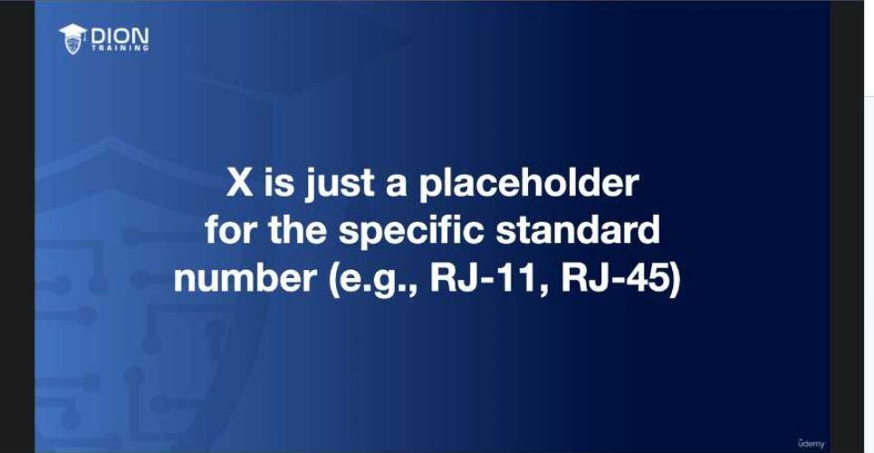

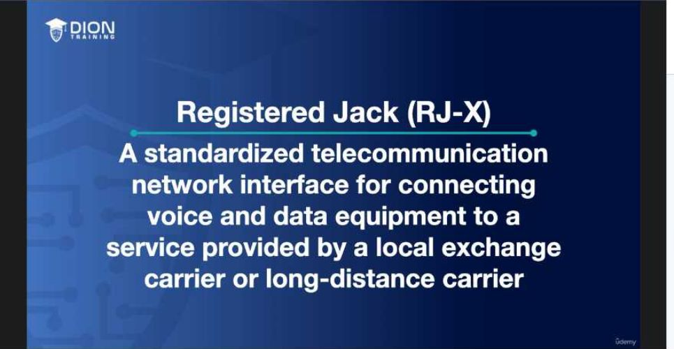

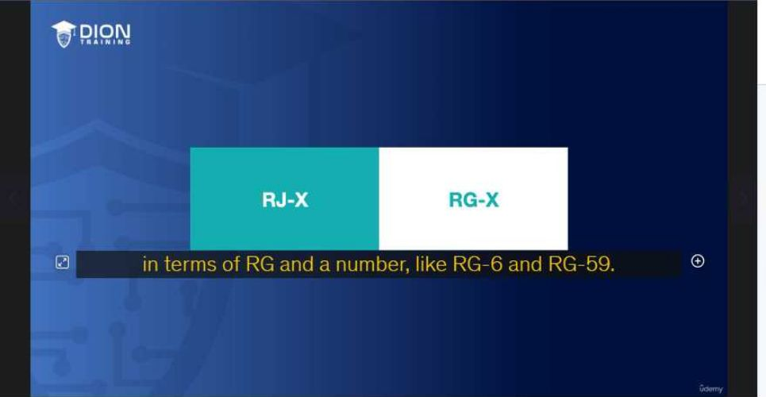

- **RJ-11:** Đây là chuẩn kết nối kinh điển cho các hệ thống thoại (điện thoại cố định). Nó có kích thước nhỏ gọn, thường sử dụng cho các ứng dụng băng thông thấp. 

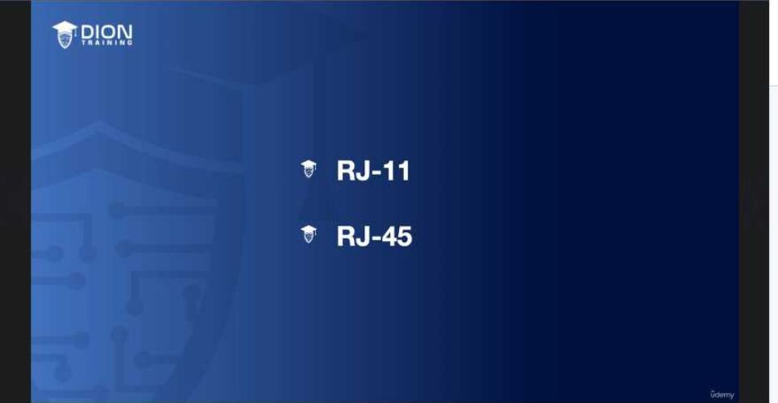

- **RJ-45:** Đây là chuẩn "xương sống" của mạng LAN hiện đại. Với cấu trúc 8 chân (8P8C), nó cho phép truyền dữ liệu tốc độ cao qua các cặp xoắn (twisted pair) trong cáp mạng. 

Việc phân biệt RJ-11 và RJ-45 là kỹ năng "sống còn" đối với một kỹ thuật viên mạng, vì nếu bạn cố gắng cắm nhầm hoặc bấm sai chuẩn, thiết bị sẽ không nhận diện được tín hiệu hoặc tệ hơn là gây hư hỏng cổng kết nối trên thiết bị mạng (switch/router).

Chuyển sang nhóm thứ hai, chúng ta gặp khái niệm **RG (Radio Guide)**. Khác với RJ phục vụ cho cáp xoắn (twisted pair), RG là hệ thống phân loại dành riêng cho cáp đồng trục (coaxial cable). Nếu RJ là "ngôn ngữ" của các thiết bị mạng IT, thì RG là "ngôn ngữ" của tín hiệu RF (Radio Frequency - tần số vô tuyến).

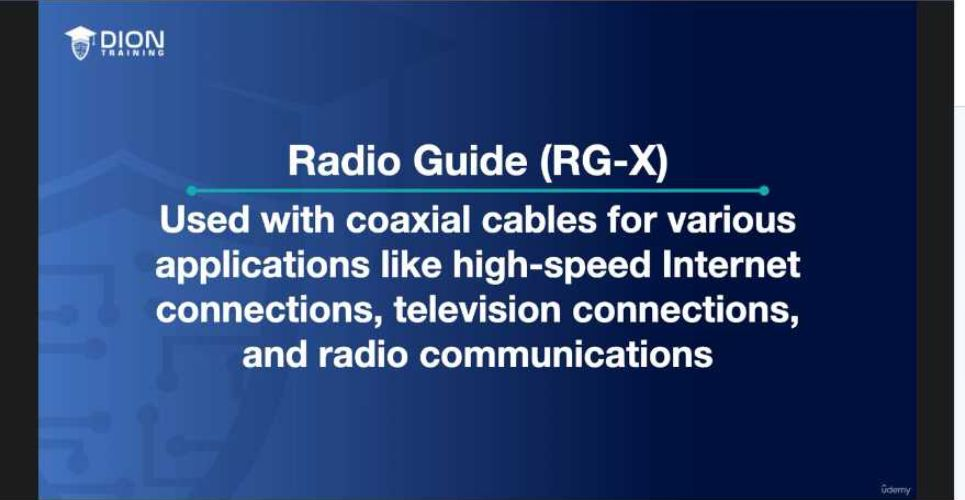

Hai chuẩn RG quan trọng nhất mà kỹ thuật viên cần ghi nhớ:

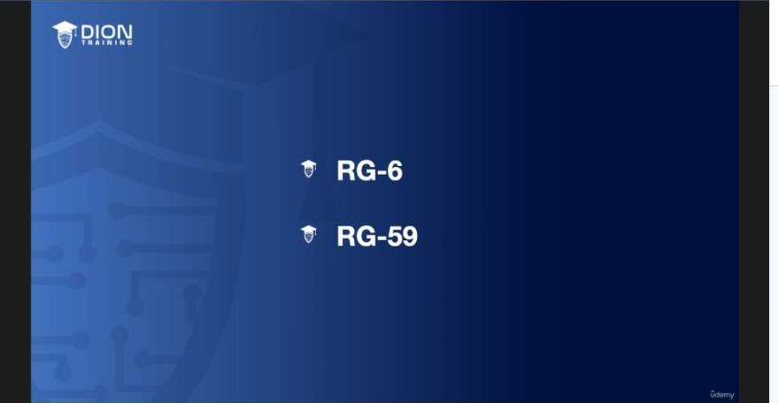

- **RG-6:** Đây là "tiêu chuẩn vàng" cho các dịch vụ truyền hình cáp và internet băng thông rộng hiện đại. Nó có lớp vỏ bảo vệ dày hơn và lõi dẫn điện lớn hơn, giúp giảm thiểu hiện tượng nhiễu tín hiệu và suy hao trên quãng đường dài.
- **RG-59:** Là một thế hệ cũ hơn, mỏng hơn và linh hoạt hơn, thường được dùng cho các hệ thống camera an ninh (CCTV) analog hoặc các kết nối tín hiệu video ngắn. 

Sự khác biệt giữa RG-6 và RG-59 nằm ở khả năng chống nhiễu và độ suy hao tín hiệu theo khoảng cách. Trong môi trường doanh nghiệp hoặc hộ gia đình hiện đại, RG-6 thường được ưu tiên để đảm bảo chất lượng truyền tải tốc độ cao cho các dịch vụ internet băng thông rộng (broadband), trong khi RG-59 thường chỉ còn xuất hiện trong các hệ thống cũ hoặc những khoảng cách kết nối rất ngắn trong nội bộ.

Tóm lại, toàn bộ hạ tầng mạng đồng được gói gọn trong sự phân biệt giữa: 
1. **Registered Jack (RJ):** Giao diện cho cáp xoắn (Voice/Data).
2. **Radio Guide (RG):** Giao diện cho cáp đồng trục (Broadband/Video).

Việc hiểu đúng bản chất này giúp kỹ thuật viên không chỉ chọn đúng vật tư khi thi công mà còn chẩn đoán chính xác lỗi khi hệ thống gặp sự cố mất kết nối, tránh việc thay thế nhầm lẫn giữa các chuẩn kết nối vật lý không tương thích.

### Phân tích chi tiết các loại kết nối cáp đồng phổ biến

Trong phần này, chúng ta sẽ đi sâu vào các "gương mặt đại diện" trong thế giới kết nối vật lý, nơi mà mỗi thiết kế đầu nối được tối ưu hóa cho một mục đích truyền dẫn cụ thể.

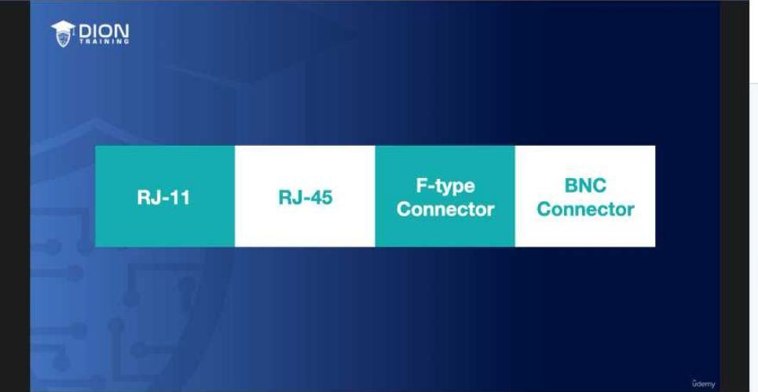

#### 1. Đầu nối RJ-11 (6P2C)

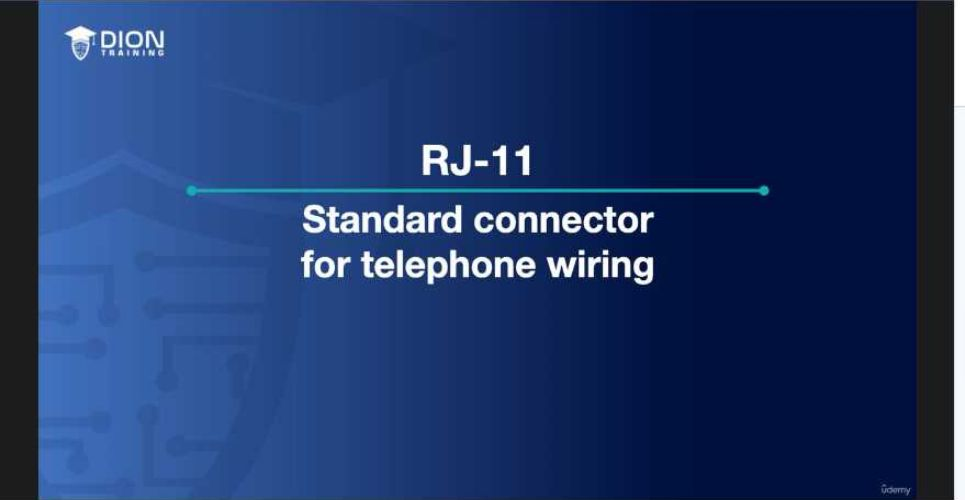

Đầu nối RJ-11 là tiêu chuẩn "cổ điển" trong hệ thống điện thoại cố định. Đặc điểm kỹ thuật đáng chú ý nhất ở đây là cấu hình **6P2C (6-Position, 2-Conductor)**:
*   **6 vị trí (Positions):** Vỏ nhựa của đầu nối có sẵn 6 khe cắm kim loại.
*   **2 dây dẫn (Conductors):** Chỉ có 2 khe được trang bị chân đồng để truyền tín hiệu.
*   **Hạn chế kỹ thuật:** Mặc dù RJ-11 cực kỳ nhỏ gọn, phù hợp với các thiết bị thoại, nhưng nó không thể đáp ứng nhu cầu truyền dữ liệu tốc độ cao. Nguyên nhân nằm ở số lượng dây dẫn hạn chế (không sử dụng hết các cặp xoắn bên trong dây cáp), dẫn đến tình trạng "thắt nút cổ chai" nếu cố gắng ép chạy dữ liệu mạng hiện đại.

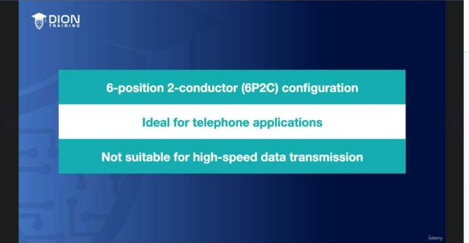

> **💡 Ví dụ nhớ đời:** Hãy tưởng tượng RJ-11 giống như một chiếc xe máy phân khối nhỏ. Nó rất linh hoạt, dễ dàng luồn lách trong các "ngõ hẻm" của hệ thống dây điện thoại gia đình để truyền tín hiệu âm thanh đơn giản. Nhưng nếu bạn cố gắng bắt nó chạy đua tốc độ cao (như truyền tải data Gigabit), nó sẽ ngay lập tức lộ rõ sự yếu kém về thiết kế và không thể đạt được hiệu năng yêu cầu.

#### 2. Đầu nối RJ-45 (8P8C) - "Xương sống" của mạng Ethernet

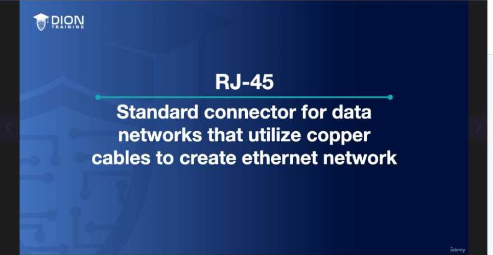

Khi chuyển sang nhu cầu truyền tải dữ liệu tốc độ cao, RJ-45 trở thành chuẩn mực bắt buộc. Cấu hình **8P8C (8-Position, 8-Conductor)** giúp nó trở nên vượt trội:
*   **Toàn diện:** Với 8 vị trí và cả 8 vị trí đều có chân dẫn điện, RJ-45 tận dụng tối đa các cặp xoắn bên trong cáp mạng, đảm bảo băng thông rộng cho các thiết bị như máy tính, switch và router trong mạng LAN.

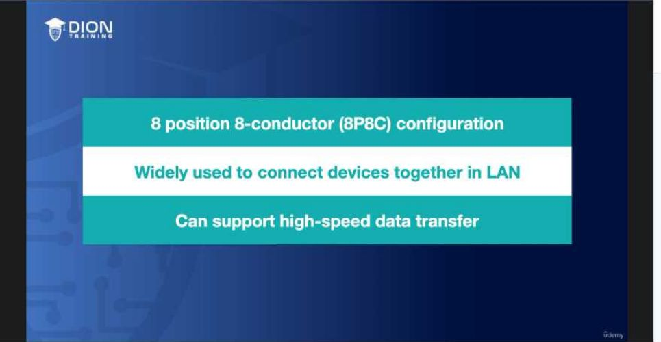

*   **Khả năng tương thích:** Đây là điểm mấu chốt. RJ-45 gắn liền với hệ sinh thái cáp từ Cat 5 lên đến Cat 8.
*   **Quy luật tiến hóa:** Chỉ số "Cat" (Category) càng cao thì đầu nối và cáp đi kèm càng được thiết kế để chống nhiễu tốt hơn, từ đó đạt được tốc độ và băng thông vượt bậc. Nếu bạn dùng cáp Cat 8 mà bấm đầu RJ-45 loại "cùi", toàn bộ hệ thống sẽ bị kéo tụt xuống theo tiêu chuẩn của đầu nối yếu nhất.

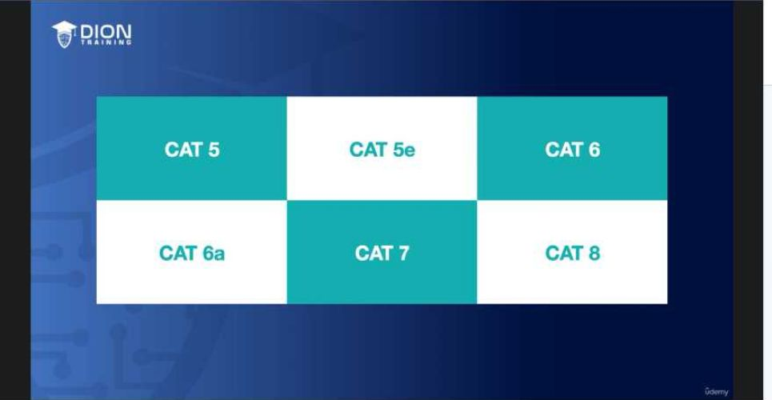

> **💡 Ví dụ nhớ đời:** Nếu RJ-11 là chiếc xe máy, thì RJ-45 chính là chiếc xe tải hạng nặng 8 bánh. Nó được thiết kế để chở khối lượng dữ liệu khổng lồ cùng lúc thông qua 8 đường dẫn riêng biệt. Khi bạn nâng cấp từ Cat 5 lên Cat 6a, nó giống như việc bạn thay động cơ mạnh hơn cho chiếc xe tải đó để nó chạy nhanh hơn mà không bị quá tải hay "đổ bệnh" giữa đường.

#### 3. Đầu nối F-type - Chuyên gia truyền tải tín hiệu RF

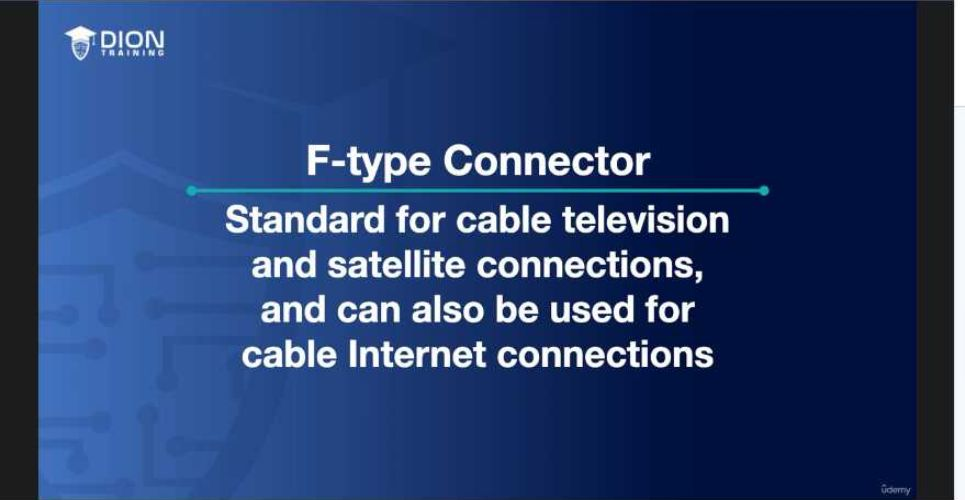

Khác với RJ-11 và RJ-45 là các chuẩn "Registered Jack" dùng cho mạng dữ liệu/thoại, F-type thuộc một đẳng cấp khác, thường dùng cho cáp đồng trục (coaxial) như RG-6 và RG-59.

*   **Cơ chế vật lý:** F-type sử dụng cơ chế vặn ren (screw-on). Điều này không chỉ giúp giữ đầu nối chắc chắn mà còn tạo ra kết nối vật lý cực kỳ ổn định, ngăn chặn hiện tượng lỏng lẻo gây nhiễu tín hiệu tần số vô tuyến (RF).
*   **Ứng dụng thực tế:** Đây là tiêu chuẩn vàng cho truyền hình cáp, vệ tinh và đường truyền internet cáp đồng trục (cable internet) mà nhà cung cấp dịch vụ Internet (ISP) thường kéo đến tận nhà bạn.
*   **Vai trò của RG-6:** RG-6 là chuẩn cáp đồng trục phổ biến nhất trong hạ tầng hiện đại, được thiết kế để truyền tải các dải tần số cao cho cả TV và dữ liệu Internet, nơi mà khả năng chống nhiễu từ lớp bọc kim loại bên trong cáp là yếu tố sống còn để duy trì tín hiệu sạch.

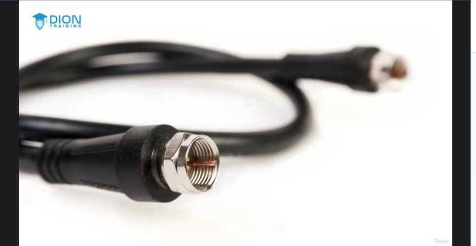

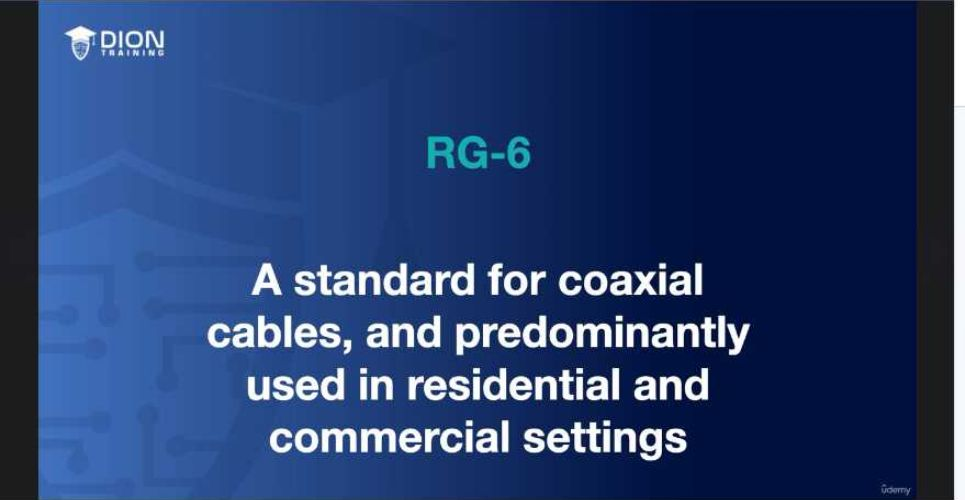

> **💡 Ví dụ nhớ đời:** Coi F-type như một "chốt khóa an toàn" trong ngành ống nước cao áp. Bạn không thể chỉ cắm nhẹ là xong như RJ-45; bạn phải vặn ren để đảm bảo tín hiệu (nước) không bị rò rỉ ra ngoài và tạp âm bên ngoài không lọt vào trong. Nếu không vặn chặt, tín hiệu hình ảnh trên TV của bạn sẽ bị "muỗi" hoặc mất kết nối mạng internet ngay lập tức.

Tiếp nối các chuẩn kết nối mạng đã thảo luận, chúng ta đi sâu vào sự khác biệt kỹ thuật giữa các loại cáp đồng trục (coaxial cable) và cơ chế vận hành của đầu nối BNC.

### Phân tích chuyên sâu về Cáp đồng trục: RG-6 và RG-59

Cáp đồng trục không chỉ là một sợi dây đơn thuần; hiệu suất của chúng phụ thuộc vào cấu tạo vật lý.

*   **RG-6 (Chuẩn hiện đại):** Đây là tiêu chuẩn vàng cho các ứng dụng băng thông rộng ngày nay. Thiết kế của nó bao gồm lõi đồng đơn (solid copper core), lớp cách điện, lớp lá chắn kim loại (shielding) và vỏ bọc ngoài cùng. Chính cấu trúc "dày dặn" này cho phép RG-6 xử lý tần số cao hơn và truyền tín hiệu đi xa hơn mà không bị suy hao (signal loss). Trong hạ tầng viễn thông hiện đại, nó là lựa chọn bắt buộc cho truyền hình số và internet tốc độ cao từ các nhà cung cấp cáp quang/cáp đồng trục.
*   **RG-59 (Chuẩn cũ):** Là thế hệ tiền nhiệm, RG-59 có lõi nhỏ hơn và khả năng chống nhiễu kém hơn. Trong thế giới mạng hiện đại, nó đã trở thành "di sản" lỗi thời. Tuy nhiên, bạn vẫn có thể bắt gặp nó trong các hệ thống CCTV (camera giám sát) cũ.

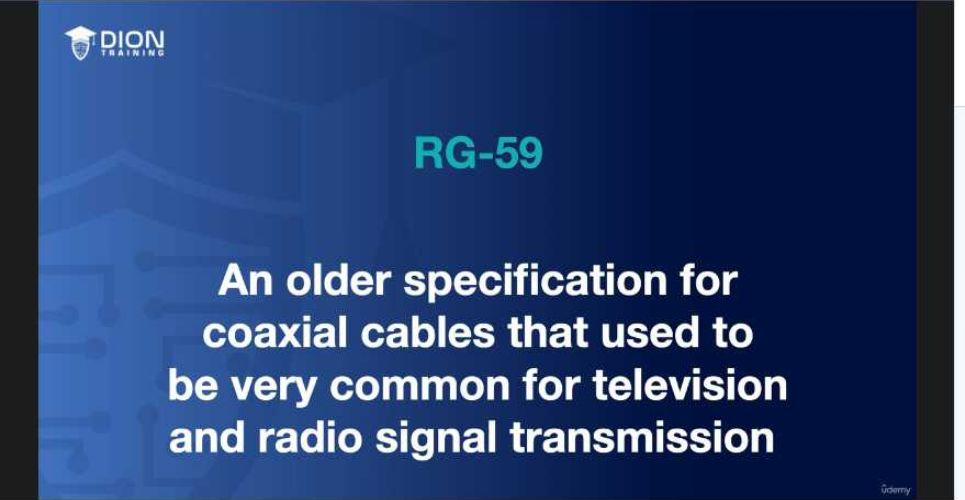

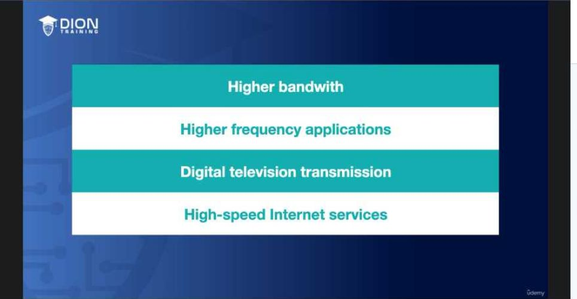

> **💡 Ví dụ nhớ đời:** Hãy tưởng tượng RG-6 là một "đường cao tốc 8 làn xe" với lớp rào chắn bê tông dày đặc ngăn chặn mọi sự nhiễu loạn từ bên ngoài, cho phép các gói tin (xe cộ) chạy ở vận tốc cao nhất. Còn RG-59 giống như một "con đường làng 1 làn xe" với rào chắn sơ sài; nó vẫn cho phép xe chạy, nhưng nếu bạn bắt nó chạy với tốc độ của đường cao tốc, bạn sẽ gặp tắc nghẽn và tai nạn (mất tín hiệu) ngay lập tức.

### Nguyên tắc vàng khi triển khai mạng
Do RG-59 bị giới hạn về băng thông và khoảng cách, việc sử dụng nó cho các ứng dụng yêu cầu độ phân giải cao hoặc dữ liệu tốc độ cao (như truyền dẫn HD) sẽ dẫn đến thất bại về mặt kỹ thuật. Đối với bất kỳ hạ tầng mới nào, RG-6 luôn là mặc định thay thế hoàn hảo cho RG-59.

### Tìm hiểu sâu về đầu nối BNC (Bayonet Neill-Concelment)

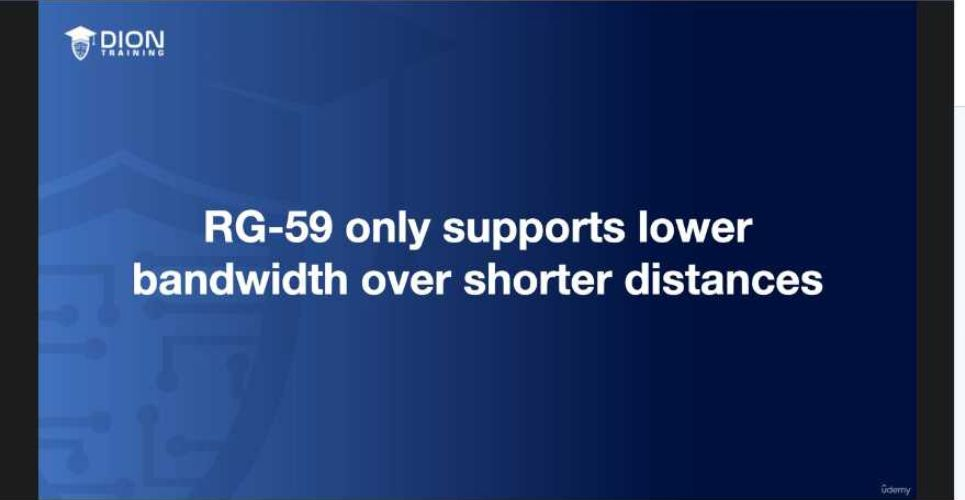

Nếu F-type là loại đầu nối "vặn ren" (screw-on) chậm rãi nhưng chắc chắn, thì BNC là một bước tiến về sự tiện lợi trong thao tác vật lý mà vẫn đảm bảo tính an toàn cao.

*   **Cơ chế khóa Bayonet:** Thay vì dùng ren xoắn để ép chặt, BNC sử dụng cơ chế "ấn và xoay" (push and twist). Điều này cực kỳ hữu ích trong các môi trường cần thao tác nhanh nhưng vẫn yêu cầu sự ổn định tuyệt đối, không bị lỏng lẻo do rung chấn.
*   **Cấu tạo đặc trưng:** Đầu nối này có hai vấu khóa (bayonet lugs) trên đầu nối cái (female). Khi lắp đặt, bạn chỉ cần cắm vào và xoay khoảng một phần tư vòng (90 độ) để khóa chặt.

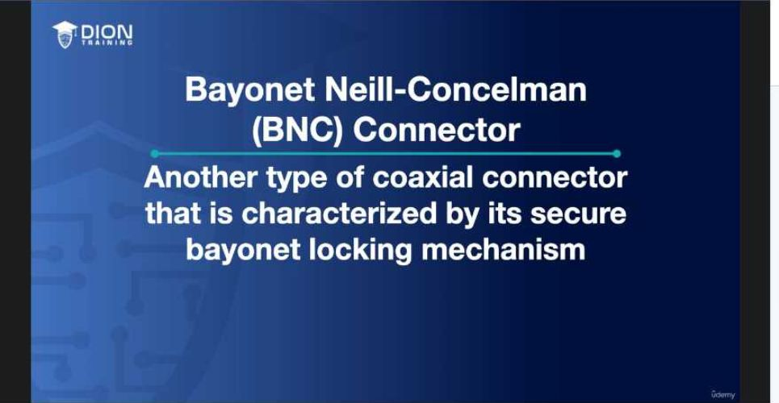

*   **Tính tương thích:** Một điểm quan trọng cần lưu ý: Đầu nối BNC không thay thế cho loại cáp bạn dùng, nó chỉ thay thế cho "cách kết nối". Bạn vẫn có thể sử dụng BNC trên chính loại cáp RG-6 hoặc RG-59 mà chúng ta đã đề cập ở trên, tùy thuộc vào thiết bị đầu cuối mà bạn đang đấu nối.

> **💡 Ví dụ nhớ đời:** Hãy coi đầu nối F-type giống như một chiếc đinh vít gỗ – bạn phải xoay nhiều vòng mới cố định được nó, tốn thời gian nhưng rất chắc chắn. Trong khi đó, đầu nối BNC giống như "khớp nối của ống nước cứu hỏa chuyên dụng" – chỉ cần một cái đẩy nhẹ và xoay chốt, khớp nối đã được khóa chặt ngay lập tức, đảm bảo luồng "nước" (dữ liệu) không bị rò rỉ ra ngoài.

Tóm lại, trong khi F-type chiếm ưu thế trong các ứng dụng giải trí gia đình (TV, cáp internet), thì BNC lại thường xuất hiện trong các hệ thống chuyên dụng hơn nhờ thao tác khóa nhanh và cơ chế chống bung vượt trội. Việc lựa chọn loại cáp (RG-6/RG-59) và loại đầu nối (F-type/BNC) phù hợp chính là chìa khóa để đảm bảo sự ổn định của hệ thống mạng vật lý.

Cấu tạo kỹ thuật của đầu nối BNC dựa trên việc sử dụng dây dẫn ngoài (outer conductor) có các khe rãnh (slots) kết hợp với lớp điện môi (dielectric) bằng nhựa nằm bên trong đầu nối. Sự kết hợp này không chỉ đơn thuần là tạo tiếp xúc cơ học, mà là thiết kế có chủ đích để đảm bảo trở kháng đặc tính của hệ thống truyền dẫn không bị thay đổi tại điểm kết nối, giúp duy trì chất lượng tín hiệu ổn định giữa hai thiết bị. Khi cắm vào, các khe rãnh này giúp đầu nối khít chặt vào cổng tiếp nhận, đảm bảo dẫn truyền tín hiệu liên tục mà không bị nhiễu do lỏng lẻo.

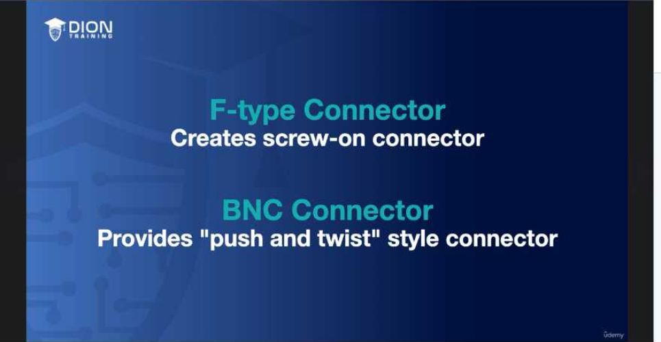

Về ứng dụng thực tế, BNC chiếm ưu thế tuyệt đối trong môi trường chuyên nghiệp như đài truyền hình, studio sản xuất nội dung, hệ thống giám sát an ninh (CCTV) cao cấp và các thiết bị tần số vô tuyến (RF). Điểm mấu chốt khiến BNC được ưa chuộng là cơ chế "push and twist" (đẩy và xoay). Trong khi đầu nối F-type cần thao tác xoay vít vất vả và có nguy cơ làm hỏng chân ren nếu vặn không khớp, thì BNC cung cấp tốc độ kết nối nhanh chóng mà vẫn đảm bảo độ bảo mật, tránh việc dây cáp bị tuột ra ngoài do rung chấn hoặc vô tình va chạm.

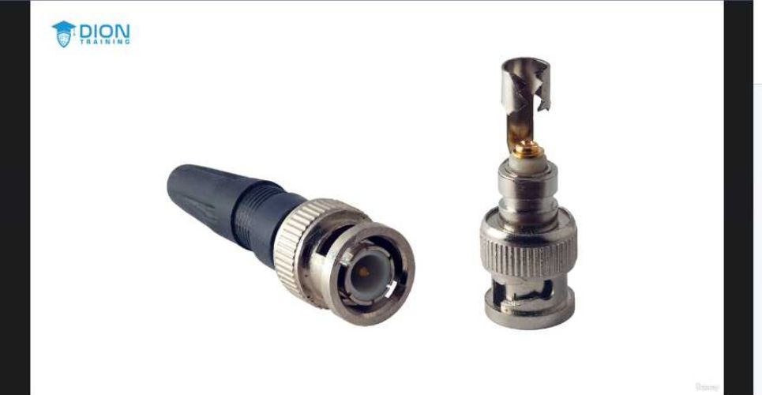

> **💡 Ví dụ nhớ đời:** Hãy tưởng tượng đầu nối F-type giống như việc bạn vặn một chiếc nắp chai bằng ren, bạn cần chính xác từng vòng xoắn, nếu vội vàng sẽ bị "chờn ren". Ngược lại, đầu nối BNC giống như cơ chế khóa của nắp bình chữa cháy hoặc chốt cửa lò xo: bạn chỉ cần ấn vào và xoay nhẹ một góc 90 độ là hệ thống tự động khóa cứng, đảm bảo sự an toàn tuyệt đối trong những tình huống khẩn cấp hoặc cần thao tác nhanh.

Liên quan đến tên gọi BNC, đoạn transcript làm rõ một hiểu lầm phổ biến trong giới kỹ thuật. Nhiều người thường gọi nó là "British Naval Connector" (Đầu nối Hải quân Anh), một cách gọi tên mang tính "dân gian hóa" dựa trên lịch sử ra đời của nó vào những năm 1940 trong quân đội Anh. Tuy nhiên, tên gọi chính xác theo kỹ thuật là "Bayonet Neill-Concelman" (tên của hai nhà phát minh ra nó). Đây là minh chứng cho việc trong kỹ thuật, dù bạn gọi bằng tên "truyền miệng" hay tên chính thức, điều quan trọng nhất là bạn hiểu được nguyên lý hoạt động của nó để áp dụng đúng trong công việc.

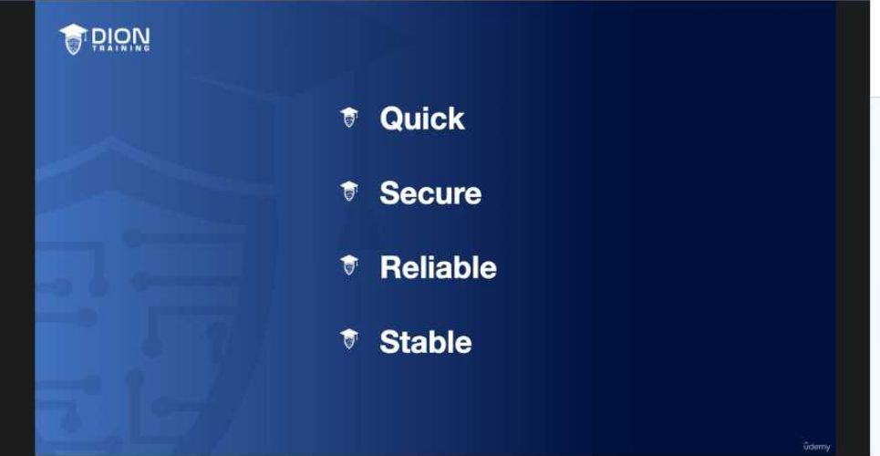

Để tổng kết lại hệ sinh thái các loại đầu nối mà một kỹ thuật viên mạng cần thuộc nằm lòng, chúng ta phân loại dựa trên mục đích sử dụng như sau:

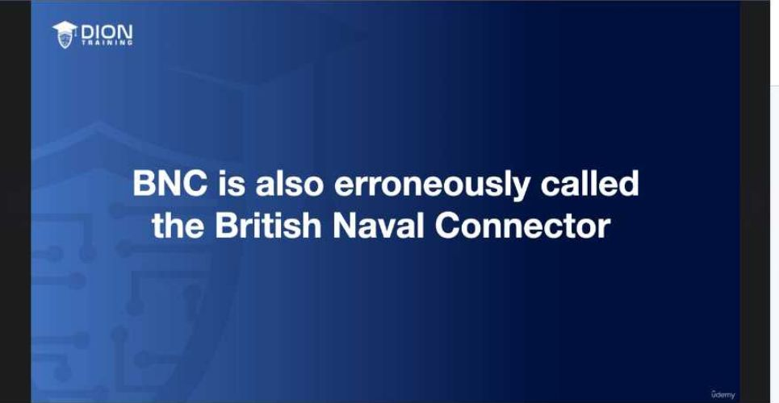

*   **RJ-11:** Đóng vai trò là "ngôn ngữ" cho các hệ thống mạng thoại truyền thống (điện thoại cố định).
*   **RJ-45:** Là "xương sống" cho toàn bộ hạ tầng dữ liệu hiện đại, từ máy tính, máy in cho đến các thiết bị mạng trung gian như switch và router.
*   **F-type:** Là "cửa ngõ" giữa hạ tầng nhà cung cấp dịch vụ và thiết bị đầu cuối của người dùng (như modem cáp), ưu tiên sự chắc chắn, cố định.
*   **BNC:** Là "chuyên gia" về tín hiệu hình ảnh và RF, nơi mà tốc độ tháo lắp và độ tin cậy trong môi trường chuyên nghiệp được đặt lên hàng đầu.

Sự khác biệt cốt lõi ở đây chính là cơ chế khóa: F-type dựa trên ren xoắn (screw-type) phù hợp với những kết nối ít khi phải tháo lắp, trong khi BNC dựa trên cơ chế khóa lưỡi lê (bayonet) phù hợp với môi trường làm việc yêu cầu sự linh hoạt, thao tác nhanh mà không hy sinh tính ổn định của đường truyền.

---

## 🎯 Bí Kíp Ôn Thi Tốc Độ

### 1. Phân loại chuẩn (Naming Convention)
*   **RJ (Registered Jack):** Dùng cho **Twisted Pair** (Cáp xoắn đôi).
*   **RG (Radio Guide):** Dùng cho **Coaxial** (Cáp đồng trục).

### 2. Các loại Connector cho Twisted Pair
*   **RJ-11:**
    *   Cấu hình: **6P2C** (6 vị trí, 2 lõi).
    *   Ứng dụng: **Điện thoại** (Voice), kích thước nhỏ.

    *   Lưu ý: Không dùng cho truyền tải dữ liệu tốc độ cao.
*   **RJ-45:**
    *   Cấu hình: **8P8C** (8 vị trí, 8 lõi).
    *   Ứng dụng: **Data networks (Ethernet)**, thiết bị mạng (PC, Switch, Router).

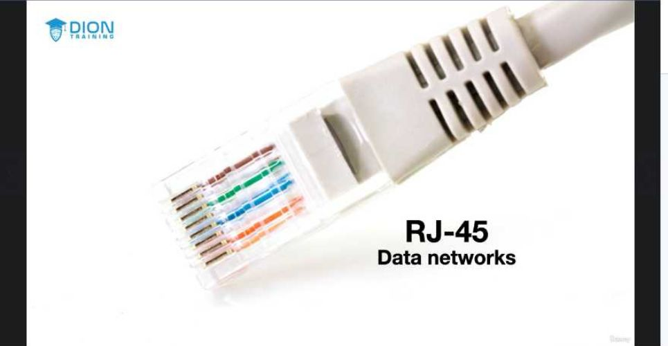

    *   Khả năng: Hỗ trợ tốc độ cao (Cat 5 đến Cat 8).

### 3. Các loại Connector cho Coaxial (Cáp đồng trục)
*   **F-type:**
    *   Cơ chế: **Screw-on** (Vặn ren).
    *   Ứng dụng: **Truyền hình cáp**, Modem internet (RG-6/RG-59).
*   **BNC (Bayonet Neill-Concealment):**

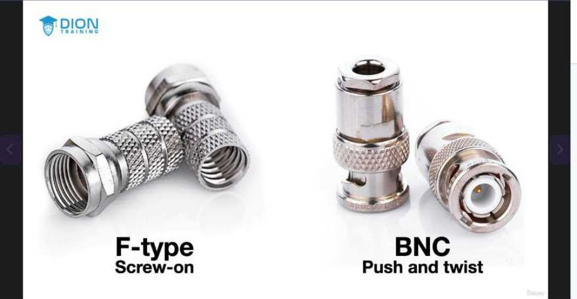

    *   Cơ chế: **Push and twist** (Ấn và xoay, khóa bayonet).
    *   Ứng dụng: **Video chuyên nghiệp**, CCTV, radio frequency.
    *   Mẹo nhớ: Thường bị gọi nhầm là "British Naval Connector".

### 4. Phân biệt các loại cáp (RG-X)
*   **RG-6:** 
    *   Đặc điểm: Lõi dày, lớp bảo vệ (shielding) tốt hơn.
    *   Ứng dụng: Tiêu chuẩn hiện đại cho **internet tốc độ cao, truyền hình số**.
*   **RG-59:**
    *   Đặc điểm: Cũ, băng thông thấp, khoảng cách ngắn.
    *   Ứng dụng: Chỉ dùng cho **CCTV** đời cũ, tránh dùng cho dữ liệu cao cấp.

### 💡 Bảng tóm tắt nhanh
| Connector | Loại cáp | Ứng dụng chính |
| :--- | :--- | :--- |
| **RJ-11** | Twisted Pair | Điện thoại |
| **RJ-45** | Twisted Pair | Ethernet / Dữ liệu |
| **F-type** | Coaxial | TV / Internet (Vặn ren) |

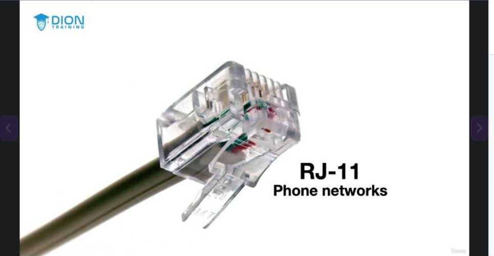

| **BNC** | Coaxial | Video chuyên nghiệp (Xoay) |

---
*Ghi chú: 28 hình ảnh minh họa (.jpg) đã được tải về và lưu tự động vào thư mục con `image/` cùng cấp với file này. Để ảnh hiển thị tự động, hãy đảm bảo bạn sao chép cả thư mục `image/` nếu bạn muốn di chuyển file markdown sang nơi khác!*
