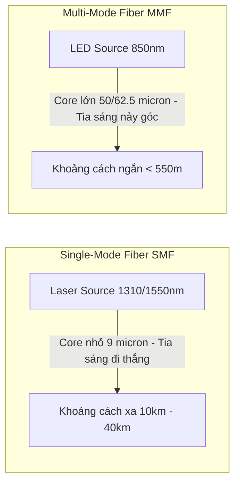

# 🌐 Truyền Dẫn Cáp Quang & Transceivers (Single-Mode, Multi-Mode, SFP+) - Chuyên Sâu Mạng Máy Tính Cho DevOps

> 💡 **Bản chất 1 câu**: Phân biệt Cáp quang Single-Mode (SMF) vs Multi-Mode (MMF), các chuẩn đầu nối quang (LC, SC, ST) và mô-đun Transceivers (SFP, SFP+, QSFP).  
> 🎯 **Trọng tâm thực chiến DevOps**: Nắm vững Single-Mode (đi xa hàng chục km, Laser, tia sáng thẳng) vs Multi-Mode (đi ngắn < 550m, LED, tia sáng phản xạ), đầu nối LC/SC và mô-đun SFP+ 10G / QSFP+ 40G.

---

## 1. 🧠 Hình Hình Dung Nhanh (Intuitive Mindset)

Cáp quang Single-Mode như đường hầm siêu tốc chạy 1 làn duy nhất: Tia Laser bắn thẳng tắp xuyên suốt hàng chục km mà không bị suy hao. Multi-Mode như đường hầm nhiều làn: Tia sáng LED đập nảy vào thành ống nên chỉ đi được khoảng cách ngắn trong Datacenter.

---

## 2. 📚 Lý Thuyết Chuyên Sâu & Bản Chất Mạng (Under The Hood Architecture)

### 2.1 So Sánh Cáp Quang Single-Mode (SMF) vs Multi-Mode (MMF)



| Tiêu chí | Single-Mode Fiber (SMF) | Multi-Mode Fiber (MMF) |
| :--- | :--- | :--- |
| **Đường kính lõi (Core)** | Siêu nhỏ: **9 microns** | Lớn hơn: **50 hoặc 62.5 microns** |
| **Nguồn phát sáng** | Tia **Laser** (Bước sóng 1310nm / 1550nm) | Đèn **LED** (Bước sóng 850nm) |
| **Khoảng cách truyền** | **Rất xa**: từ 10 km đến **40 km - 80 km** | **Ngắn**: Tối đa **300m - 550m** |
| **Màu vỏ cáp chuẩn** | **Màu Vàng (Yellow)** | **Màu Xanh Ngọc (Aqua - OM3/OM4)** |
| **Ứng dụng** | Kết nối WAN, ISP, giữa các thành phố | Nội bộ Datacenter, nối Switch sang Switch |

---

### 2.2 Các Loại Đầu Nối Quang & Transceiver Modules
1. **Các Loại Đầu Nối Cáp Quang (Fiber Connectors)**:
   - **LC (Lucent Connector)**: Đầu nối nhỏ vuông Push-Pull (Phổ biến nhất trong Datacenter).
   - **SC (Subscriber Connector)**: Đầu nối vuông lớn hơn.
   - **ST (Straight Tip)**: Đầu nối tròn xoay BNC-style legacy.
2. **Mô-đun Chuyển Đổi Transceiver Modules (SFP)**:
   - **SFP (Small Form-factor Pluggable)**: 1 Gbps.
   - **SFP+**: 10 Gbps.
   - **SFP28**: 25 Gbps.
   - **QSFP+ (Quad SFP+)**: 40 Gbps.
   - **QSFP28**: 100 Gbps.


---

## 3. ⚡ Bảng Tra Cứu Câu Lệnh & Khái Niệm Thực Hành (Reference Table)

| Công cụ / Lệnh / Khái niệm | Tham số / Flag / Protocol | Giải thích ý nghĩa chi tiết | Ứng dụng thực tế trong DevOps / Network |
| :--- | :--- | :--- | :--- |
| **`SMF`** | `Single-Mode Fiber` | Cáp quang lõi nhỏ 9um đi xa 10-80km màu vàng | `Đường truyền cáp quang ISP WAN` |
| **`MMF`** | `Multi-Mode Fiber` | Cáp quang lõi lớn đi ngắn <550m màu xanh Aqua | `Kết nối các Switch trong Datacenter` |
| **`LC Connector`** | `Fiber Connector` | Đầu nối cáp quang nhỏ vuông phổ biến | `Cắm vào module SFP+ trên Switch` |
| **`SFP+`** | `Transceiver` | Mô-đun quang cắm nóng tốc độ 10Gbps | `Cắm card quang Server 10G` |


---

## 4. 🛠 Thao Tác Thực Chiến & Kịch Bản DevOps (Real-World Scenarios)

### 🛠 Các lệnh thực hành gõ là ăn ngay:
```bash
# Tra cứu thông tin module quang SFP+ cắm trên cạc mạng Linux bằng ethtool:
sudo ethtool -m eth1
```

### 🚀 Kịch bản xử lý sự cố thực tế khi đi làm:
Sự cố suy hao tín hiệu cáp quang (Optical Attenuation / DB loss) khiến liên kết 10G bị rớt chập chờn:
# Dùng máy đo công suất quang Optical Power Meter đo mức suy hao dBm hoặc kiểm tra chỉ số DDM của SFP+ module.

---

## 5. 🚀 Bộ Câu Hỏi Phỏng Vấn DevOps & Network Thực Tế (Interview Q&A)

> **Q: Cáp quang Single-Mode (SMF) sử dụng nguồn phát sáng gì và có ưu điểm gì vượt trội hơn Multi-Mode?**  
> **A**: SMF sử dụng nguồn tia Laser (lõi 9um), cho phép truyền dữ liệu đi xa hàng chục km (10-80km) với độ suy hao tín hiệu cực thấp.

> **Q: Mô-đun quang cắm nóng SFP+ hỗ trợ tốc độ truyền tải tối đa bao nhiêu?**  
> **A**: SFP+ hỗ trợ tốc độ **10 Gbps** (SFP28 hỗ trợ 25Gbps, QSFP+ hỗ trợ 40Gbps).


---

## 6. 📝 Cheat Sheet & Ghi Nhớ Nhanh (Summary)

- [x] Single-Mode (Vàng): Lõi 9um, Laser, đi xa >10km
- [x] Multi-Mode (Aqua): Lõi 50um, LED, đi ngắn <550m
- [x] LC Connector: Đầu nối quang vuông nhỏ phổ biến
- [x] SFP+: Transceiver Module 10Gbps

