# Ethernet Cable Wiring

Để đi sâu vào kỹ thuật đấu nối cáp mạng, chúng ta cần phân tích cấu trúc vật lý và logic của các loại dây cáp thông dụng nhất trong hạ tầng mạng hiện nay.

### 1. Bản chất của việc đấu nối cáp (Wiring and Pinouts)
Việc "wiring" (đấu nối) cáp vào các đầu kết nối (thường là đầu RJ-45) không đơn thuần là cắm các sợi dây vào cho xong, mà là việc tuân thủ một "ngôn ngữ" về thứ tự chân (pinout). Nếu bạn sai một chân, dữ liệu sẽ không thể truyền tải, hoặc tệ hơn là gây nhiễu, khiến thiết bị không nhận diện được tín hiệu. Đề thi không chỉ yêu cầu lý thuyết, mà bắt buộc bạn phải biết cách sử dụng các công cụ vật lý:
*   **Cable stripper:** Dụng cụ tuốt vỏ cáp để lộ các cặp dây xoắn bên trong mà không làm đứt lõi đồng.
*   **Cable crimper:** Kìm bấm mạng, dùng để ép chân tiếp xúc của đầu RJ-45 xuyên qua lớp vỏ nhựa của dây đồng, tạo kết nối vật lý vững chắc.
*   **Cable tester:** Công cụ kiểm tra thông mạch, đảm bảo từ chân 1 đến chân 8 của đầu này khớp hoàn hảo với chân 1 đến chân 8 ở đầu kia.

### 2. Khái niệm Straight-through Cable (Cáp thẳng)

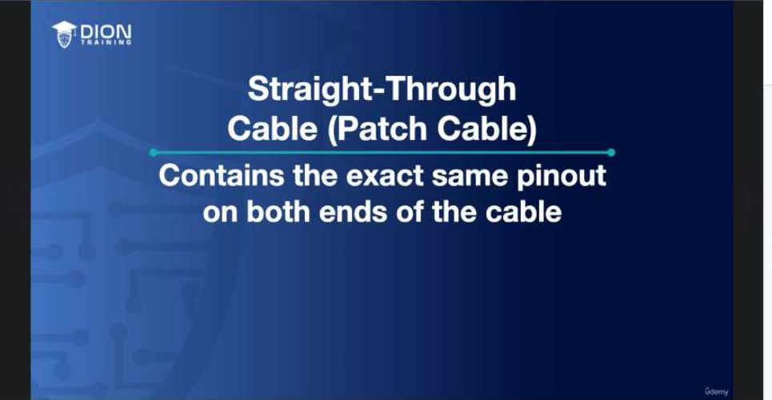

Cáp thẳng (Straight-through), hay còn gọi là **patch cable**, là loại cáp phổ biến nhất trong hệ thống mạng LAN. "Thẳng" ở đây có nghĩa là sơ đồ chân ở đầu A và đầu B là như nhau (Pin 1 ở đầu này sẽ kết nối trực tiếp với Pin 1 ở đầu kia).

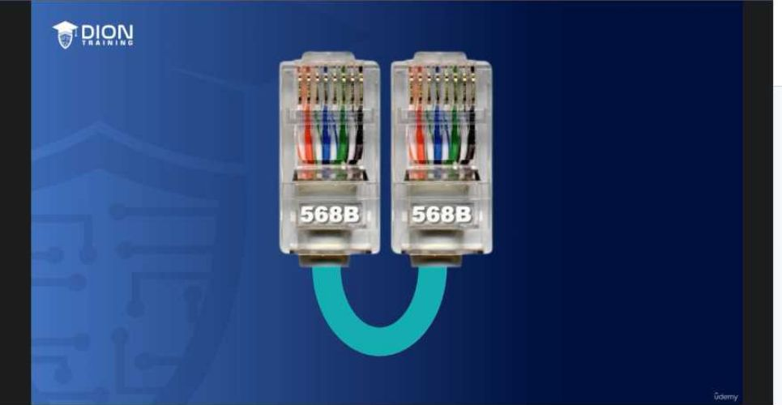

> **💡 Ví dụ nhớ đời:** Hãy tưởng tượng cáp thẳng giống như một chiếc cầu vượt dành cho người đi bộ nối hai tòa nhà. Cửa ra của tòa nhà A (Pin 1) sẽ dẫn thẳng tới cửa vào của tòa nhà B (Pin 1). Người đi từ tầng 1 của tòa A sẽ tới đúng tầng 1 của tòa B. Mọi thứ đều song song và đồng nhất.

### 3. Tiêu chuẩn 568A và 568B
Để thế giới thống nhất một ngôn ngữ, Hiệp hội Công nghiệp Viễn thông (TIA/EIA) đã đưa ra hai chuẩn đấu nối là T568A và T568B.
*   **T568B:** Đây là chuẩn phổ biến nhất, được ưu tiên cho các công trình hạ tầng đi dây âm tường. Trong chuẩn này, thứ tự màu sắc từ chân 1 đến chân 8 là: **Trắng cam, Cam, Trắng xanh lá, Xanh dương, Trắng xanh dương, Xanh lá, Trắng nâu, Nâu.**
*   Khi bạn tạo một sợi cáp thẳng theo chuẩn 568B, cả hai đầu của sợi cáp đều phải tuân thủ đúng thứ tự màu sắc này. Nếu một đầu bạn bấm chuẩn A và đầu kia bấm chuẩn B, bạn đã vô tình tạo ra một sợi "Crossover cable" (cáp chéo) – một loại cáp khác biệt hoàn toàn về công năng.

### 4. Phân loại thiết bị: DTE và DCE
Để hiểu tại sao lại cần cáp thẳng, chúng ta cần nắm vững sự khác biệt giữa hai loại thiết bị trong hệ thống mạng:

*   **DTE (Data Terminal Equipment - Thiết bị đầu cuối):** Là những thiết bị "tạo ra" hoặc "tiêu thụ" dữ liệu. Ví dụ điển hình là máy tính (laptop/desktop), máy chủ (servers) và router. Đây là các thiết bị ở "đầu nguồn" hoặc "cuối nguồn".

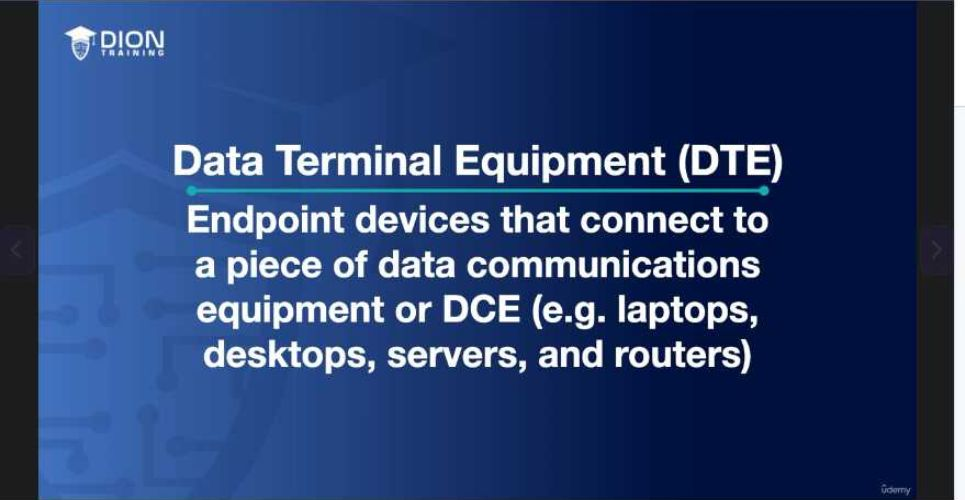

*   **DCE (Data Communications Equipment - Thiết bị truyền thông):** Là các thiết bị trung gian đóng vai trò điều hướng hoặc kết nối dữ liệu. Ví dụ: Switch, Hub, Modem, Bridge.

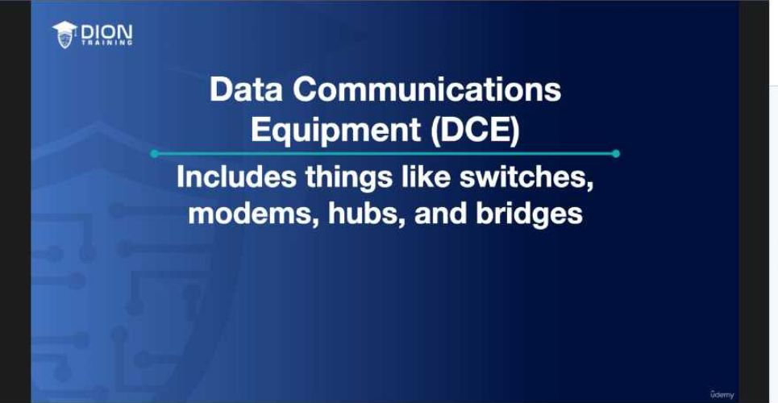

**Nguyên lý kết nối:**
Quy tắc vàng ở đây là: **Khác loại thì dùng cáp thẳng.**
Khi bạn kết nối một thiết bị đầu cuối (DTE) với một thiết bị trung gian (DCE), bạn luôn sử dụng cáp thẳng (Straight-through). Đó là lý do tại sao máy tính (DTE) cắm vào Switch (DCE) lại dùng cáp thẳng. Trong cấu trúc này, tín hiệu được truyền đi một cách logic từ "đầu cuối" qua "trung gian" mà không cần phải đảo chéo các sợi dây bên trong.

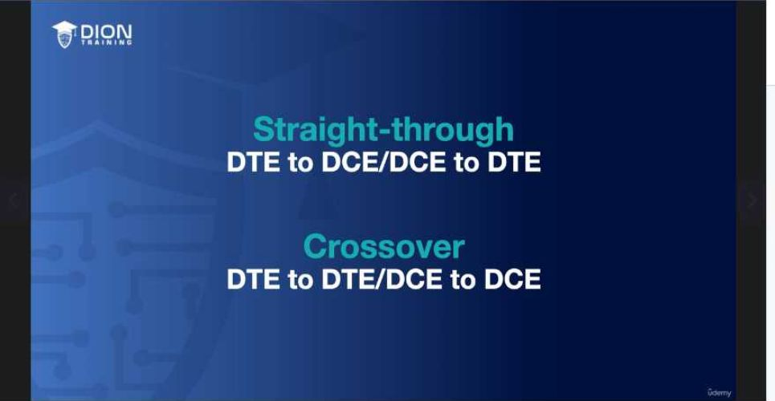

Việc nắm vững các khái niệm này là bước đệm quan trọng để bạn không chỉ vượt qua kỳ thi mà còn có khả năng xử lý sự cố thực tế. Nếu một mạng không hoạt động, việc kiểm tra xem đó là kết nối DTE-DCE hay DTE-DTE sẽ giúp bạn xác định ngay lập tức mình cần dùng cáp thẳng hay cáp chéo.

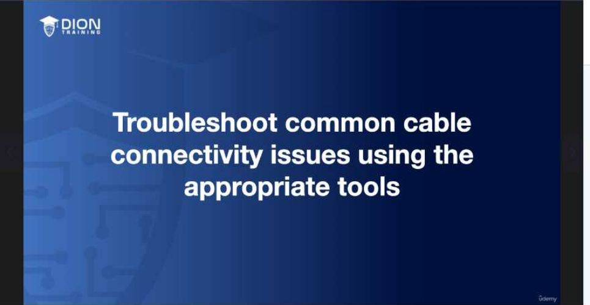

Khi bạn cần kết nối hai thiết bị thuộc cùng một phân loại, cụ thể là kết nối từ Switch sang Switch (DCE sang DCE) hoặc Workstation sang Workstation (DTE sang DTE), chúng ta không thể sử dụng cáp "thẳng" (straight-through) thông thường. Lý do là vì ở cả hai đầu của các thiết bị này, các chân (pins) truyền dữ liệu đều nằm ở cùng một vị trí. Nếu bạn dùng cáp thẳng, chân truyền của thiết bị A sẽ nối thẳng vào chân truyền của thiết bị B, dẫn đến tình trạng "ông nói gà bà nói vịt" – không có dữ liệu nào được tiếp nhận.

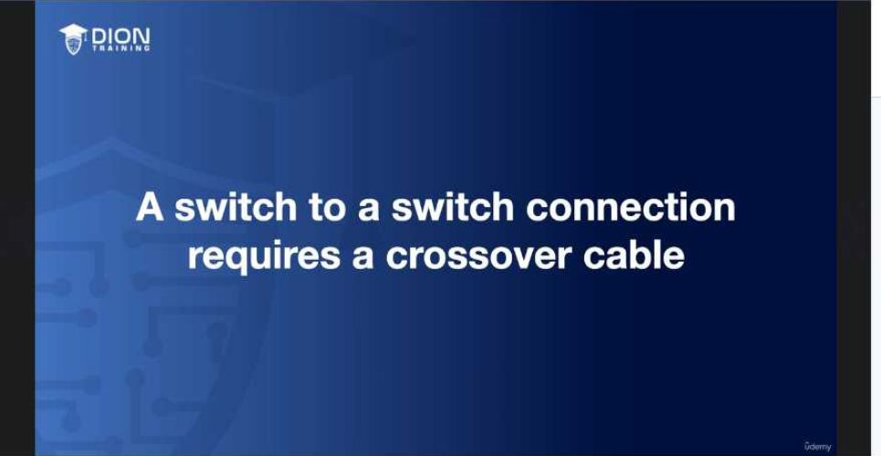

Để giải quyết vấn đề này, chúng ta cần dùng **Crossover cable** (cáp chéo). Cấu tạo đặc biệt của cáp này nằm ở việc đảo ngược các cặp dây truyền và nhận giữa hai đầu connector. Cụ thể, một đầu cáp sẽ được bấm theo chuẩn **568B** và đầu còn lại bấm theo chuẩn **568A**. Sự thay đổi trong thứ tự bấm dây này giúp "bắt cầu" tín hiệu từ chân gửi (Transmit) của thiết bị này sang chân nhận (Receive) của thiết bị kia.

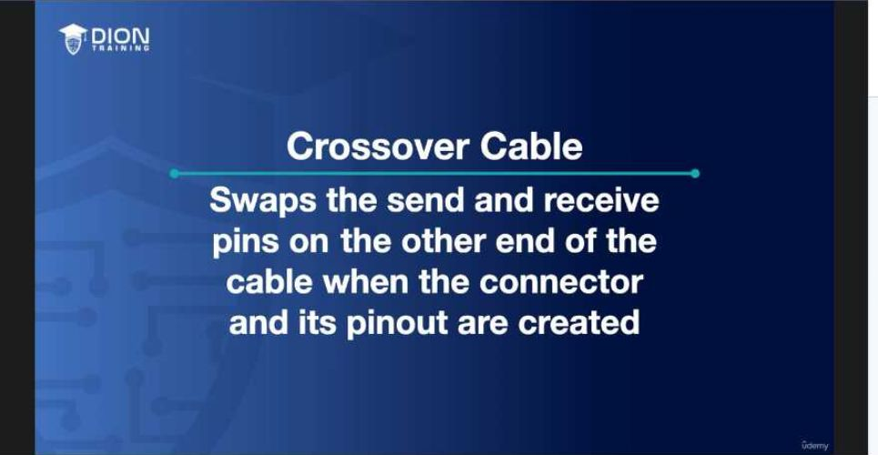

> **💡 Ví dụ nhớ đời:** Hãy tưởng tượng bạn đang cố gắng nói chuyện với một người khác. Cáp thẳng giống như việc cả hai cùng hét vào micro cùng một lúc, sóng âm va chạm nhau nên chẳng ai nghe thấy gì. Cáp chéo (crossover) giống như việc bạn đổi vị trí: bạn nói vào micro của người kia và người kia nói vào micro của bạn. Nhờ sự hoán đổi này, âm thanh (dữ liệu) mới được truyền đi thông suốt.

Mặc dù việc sử dụng cáp chéo là nguyên tắc bắt buộc trong lý thuyết mạng truyền thống để kết nối các thiết bị đồng loại, nhưng thực tế hiện nay đã thay đổi nhờ công nghệ **MDIX** (Medium Dependent Interface Crossover).

### MDIX: "Phù thủy" tự động hóa trong các Switch hiện đại
MDIX là một tính năng thông minh được tích hợp bên trong các Switch hiện đại. Thay vì bắt buộc người kỹ thuật viên phải bấm đúng loại cáp chéo, Switch có hỗ trợ MDIX có khả năng:

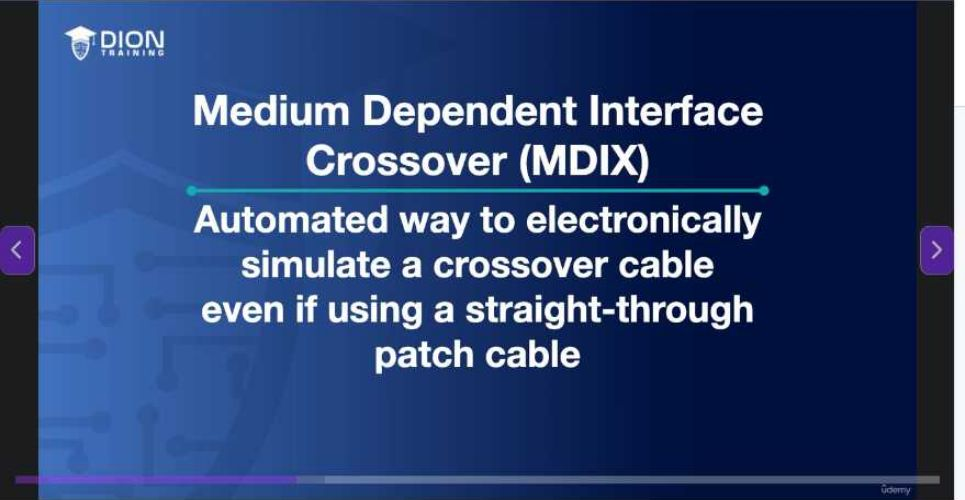

1. Tự động phát hiện loại cáp đang được cắm vào.
2. Nếu nó nhận diện được đầu kia là một thiết bị đồng loại đang sử dụng cáp thẳng, nó sẽ tự động "đảo mạch" điện tử bên trong cổng kết nối (port).
3. Về bản chất, nó thực hiện việc chéo chân tín hiệu bằng phần cứng thay vì bằng cách sắp xếp dây vật lý.

Tuy nhiên, có một sự khác biệt cực kỳ quan trọng giữa **Kiến thức thực tế** và **Kiến thức thi cử**:

*   **Trên đề thi:** Bạn phải luôn giả định Switch là thiết bị cũ, "cứng nhắc" và **không hỗ trợ MDIX**. Nếu đề bài đưa ra tình huống kết nối hai Switch, bạn luôn phải chọn "Crossover cable" là đáp án đúng, trừ khi đề bài ghi rõ "Switch hỗ trợ MDIX". Đừng để sự tiện lợi của công nghệ hiện đại đánh lừa khả năng tư duy logic theo tiêu chuẩn của kỳ thi.

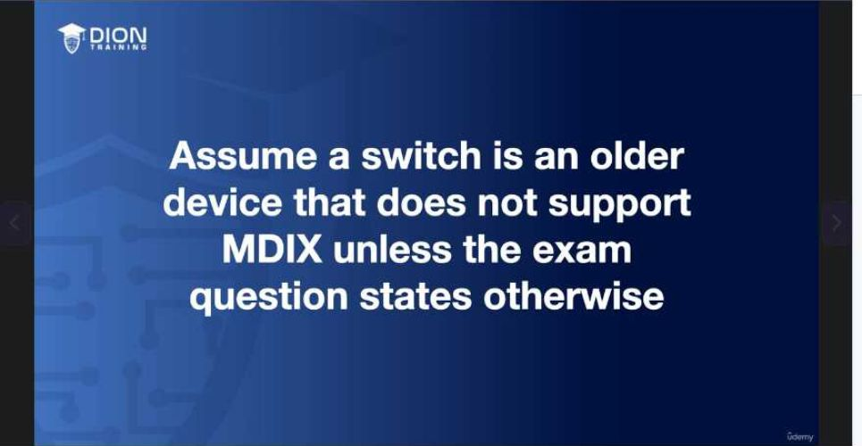

*   **Trong thực tế:** Đây là chìa khóa vàng khi xử lý sự cố (troubleshooting). Khi bạn kết nối hai thiết bị mà chúng không thể bắt tay (handshake) hoặc không có đèn tín hiệu sáng, hãy kiểm tra lại loại cáp. Nếu bạn đang dùng cáp thẳng cho hai thiết bị cùng loại mà chúng không tự động nhận nhau, rất có thể bạn đang làm việc với một thiết bị Switch đời cũ không hỗ trợ MDIX. Việc thay thế bằng một sợi cáp chéo ngay lúc đó sẽ giải quyết vấn đề một cách triệt để.

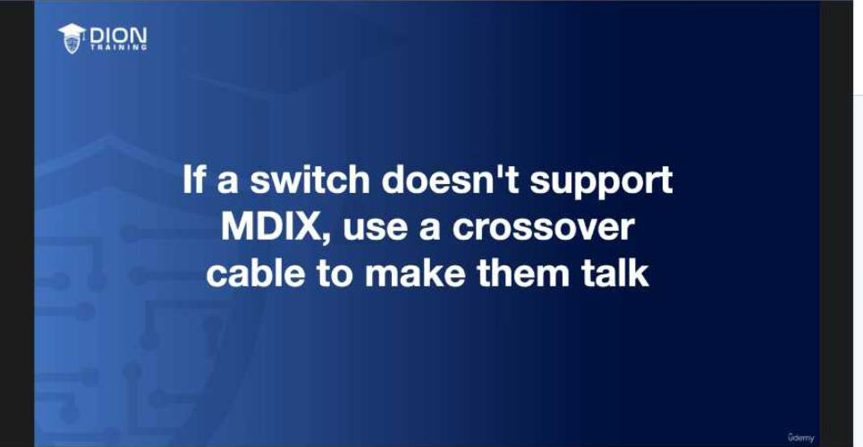

Tóm lại, hãy luôn ghi nhớ: MDIX là một tính năng hỗ trợ, không phải là một tiêu chuẩn mặc định. Luôn làm chủ kỹ năng bấm cáp chéo để đảm bảo tính tương thích cao nhất cho mọi tình huống mạng, từ thiết bị hiện đại cho đến những hạ tầng cũ kỹ nhất mà bạn có thể gặp phải trong quá trình đi làm thực tế.

### Phân tích chi tiết tiêu chuẩn đấu nối TIA/EIA-568A và 568B

Để hiểu cách tạo ra một sợi cáp mạng, chúng ta cần đi sâu vào "bản đồ" chân cắm (pinout). Trong ngành mạng, 568B là tiêu chuẩn mặc định được sử dụng phổ biến nhất cho hệ thống đi dây trong tòa nhà (nội bộ) và các cổng cắm trên tường (wall jack).

*   **Quy tắc đấu nối:**
    *   **Cáp thẳng (Straight-through):** Cả hai đầu cáp đều sử dụng cùng một chuẩn (thường là 568B cho cả hai đầu).

    *   **Cáp chéo (Crossover):** Một đầu là 568B, đầu còn lại là 568A.

Khi thực hiện cáp chéo, mục tiêu kỹ thuật là thay đổi vị trí các cặp dây truyền (transmit) và nhận (receive). Cụ thể, các chân 1, 2, 3 và 6 được tráo đổi. Trong thực tế, điều này đồng nghĩa với việc cặp dây màu cam và màu xanh lá cây sẽ hoán đổi vị trí cho nhau giữa hai đầu cáp.

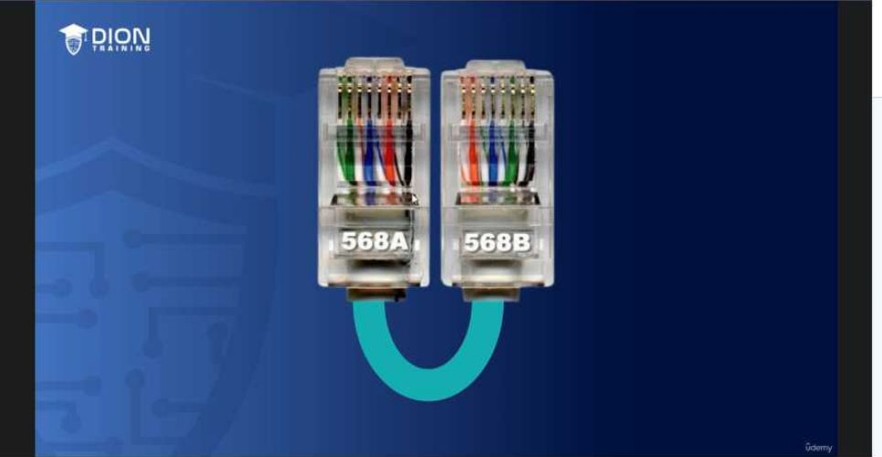

> **💡 Ví dụ nhớ đời:** Hãy tưởng tượng việc đấu nối cáp mạng giống như việc viết thư tay. Chuẩn 568B quy định "người gửi" ở tay phải và "người nhận" ở tay trái. Khi bạn muốn hai thiết bị "nói chuyện" trực tiếp với nhau mà không qua trạm trung chuyển, bạn phải bắt chéo tay (cáp chéo) để tay phải của người này chạm vào tay trái của người kia, nếu không thì thư gửi đi sẽ luôn bị đưa vào túi quần của chính mình thay vì gửi tới tay đối phương.

### Tầm quan trọng của việc học thuộc lòng cho kỳ thi
Dù trong thực tế, kỹ thuật viên có thể dễ dàng tra cứu sơ đồ màu qua smartphone hoặc thẻ nhớ mang theo, nhưng đối với các kỳ thi chứng chỉ, việc thuộc lòng sơ đồ chân (pinout) là bắt buộc. Hệ thống thi thường yêu cầu các bài tập mô phỏng dạng "kéo-thả" (drag-and-drop), nơi bạn phải chỉ định đúng màu sắc dây cho từng chân từ 1 đến 8 trên đầu nối RJ45. Nếu không nắm vững thứ tự màu sắc, bạn sẽ thất bại ngay tại các câu hỏi thực hành này.

### Bộ công cụ hỗ trợ bấm cáp mạng
Để biến lý thuyết thành sản phẩm thực tế, bạn cần một bộ kit cơ bản (thường có chi phí rất thấp, khoảng 10 USD). Các thành phần thiết yếu bao gồm:

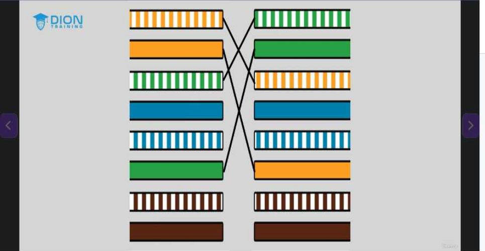

1.  **Đầu nối RJ45 (RJ45 Connectors):** Đây là các đầu cắm nhựa trong suốt được gắn vào hai đầu cáp mạng để cắm vào máy tính, switch hoặc patch panel. Bạn cần chuẩn bị số lượng lớn vì sai sót trong quá trình bấm cáp là rất khó tránh khỏi đối với người mới bắt đầu.
2.  **Kìm tuốt dây (Wire stripper):** Công cụ này được thiết kế với kích thước chuẩn để cắt bỏ lớp vỏ bảo vệ bên ngoài (outer sheath) của cáp xoắn đôi mà không làm hư hại hay trầy xước lớp cách điện của 8 sợi dây đồng nhỏ bên trong. Việc tuốt vỏ vừa đủ là kỹ năng then chốt để đảm bảo các sợi dây đồng tiếp xúc hoàn hảo với chân kim loại trong đầu RJ45.
3.  **Kìm bấm mạng (RJ45 Crimper):** Đây là thiết bị quan trọng nhất, đảm nhận hai nhiệm vụ:
    *   **Cắt:** Phần lưỡi ở đáy kìm giúp cắt bằng đầu dây cáp, đảm bảo các sợi đồng có độ dài đồng nhất trước khi đưa vào đầu nối.
    *   **Bấm (Crimp):** Khi đặt đầu nối RJ45 vào vị trí và ép kìm, các chân kim loại bên trong đầu nối sẽ xuyên qua lớp cách điện của 8 sợi dây đồng nhỏ, tạo ra kết nối vật lý vững chắc và đảm bảo tín hiệu điện được truyền dẫn thông suốt.

### Phân loại đầu nối (Connector)
Trong hệ thống mạng và viễn thông, kích thước của các đầu nối (connector) là yếu tố quyết định khả năng tương thích của thiết bị. Diễn giả liệt kê ba loại phổ biến:
*   **RJ45 (8P8C):** Loại 8 chân, tiêu chuẩn vàng cho các kết nối mạng Ethernet. Việc gọi là "8P" (8-position) nhấn mạnh vào không gian chứa 8 sợi dây dẫn bên trong.
*   **RJ11 (6P):** Loại 6 chân, thường dùng cho hệ thống điện thoại truyền thống. Mặc dù có 6 vị trí, nhưng thực tế nhiều cáp điện thoại chỉ sử dụng 2 hoặc 4 dây ở giữa.
*   **Loại 4 chân:** Dùng cho các ứng dụng kết nối chuyên biệt hoặc "lạ" (như một số dòng điện thoại bàn cũ hoặc thiết bị chuyên dụng không phổ biến trong hạ tầng mạng hiện đại).

### Công cụ kiểm tra cáp (Cable Tester)
Khi đã tự bấm cáp, bước quan trọng nhất là kiểm tra (testing). Thiết bị kiểm tra cáp hoạt động theo cơ chế "gửi và nhận" tín hiệu:
*   **Nguyên lý:** Một đầu (sender) phát tín hiệu điện qua từng pin (từ 1 đến 8), đầu kia (receiver) nhận và hiển thị trạng thái.

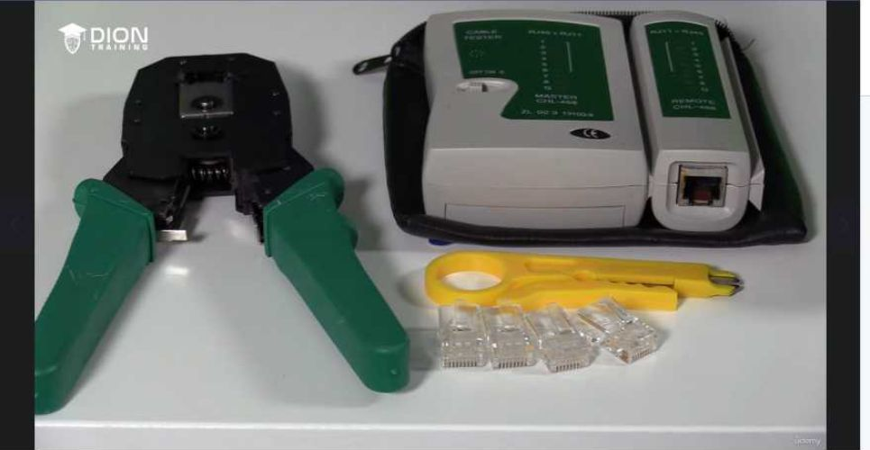

*   **Kiểm tra Straight-through:** Nếu cáp chuẩn, đèn tín hiệu trên cả hai thiết bị phải sáng tuần tự từ 1 đến 8 đồng bộ. Nếu đèn lệch hoặc không sáng, tức là cáp bị lỗi bấm hoặc đứt mạch.
*   **Kiểm tra Crossover:** Vì thứ tự chân (pinout) khác biệt (như đã phân tích ở phần trước với việc hoán đổi cặp cam/xanh lá), người dùng cần ghi nhớ rằng kết quả trên máy test sẽ không "thẳng hàng" như cáp thường. Đây là lúc kiến thức về sơ đồ chân trở nên sống còn để xác định cáp có được bấm đúng chuẩn crossover hay không.

> **💡 Ví dụ nhớ đời:** Hãy coi chiếc máy kiểm tra cáp như một người "đưa thư". Đối với cáp straight-through, người đưa thư đi từ cửa số 1 đến cửa số 8 ở cả hai tòa nhà. Nhưng với cáp crossover, người đưa thư được yêu cầu phải mang bức thư từ cửa số 1 (tòa nhà A) đến thẳng cửa số 3 (tòa nhà B). Nếu bạn là nhân viên bưu điện mà không nắm rõ "bản đồ" (sơ đồ pinout), bạn sẽ tưởng là mình làm sai, nhưng thực tế đó chính là quy tắc vận hành của một mạng lưới "đảo chiều" dữ liệu.

### Quy trình kỹ thuật: Chuẩn bị dây dẫn
Quá trình xử lý sợi cáp bulk (cáp cuộn) được thực hiện qua các bước thực hành chuyên nghiệp:
1.  **Tuốt vỏ ngoài (Stripping):** Sử dụng kìm tuốt dây (wire stripper) bằng cách xoay vòng quanh thân cáp. Mục tiêu là cắt lớp vỏ nhựa (sheathing) mà không làm tổn hại đến lớp cách điện mỏng manh của 8 sợi dây đồng bên trong.

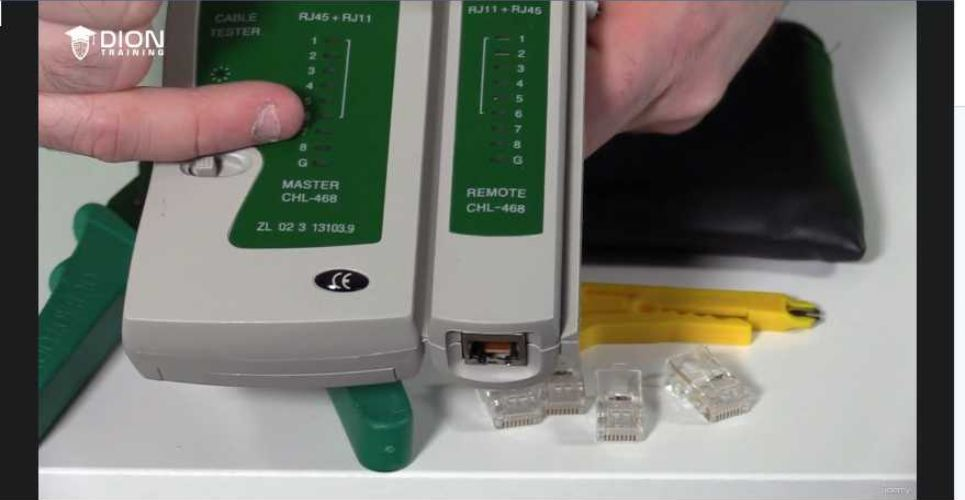

2.  **Xử lý "Twisted Pair":** Tên gọi "cáp xoắn đôi" xuất phát từ cấu trúc vật lý của nó. Các cặp dây (cam, xanh lá, xanh dương, nâu) được xoắn lại với nhau nhằm giảm thiểu nhiễu xuyên âm (crosstalk). Việc tháo xoắn (untwisting) phải được thực hiện khéo léo để đảm bảo dây đủ thẳng khi đưa vào đầu nối, nhưng không nên tháo quá dài vì sẽ làm giảm khả năng chống nhiễu của cáp.

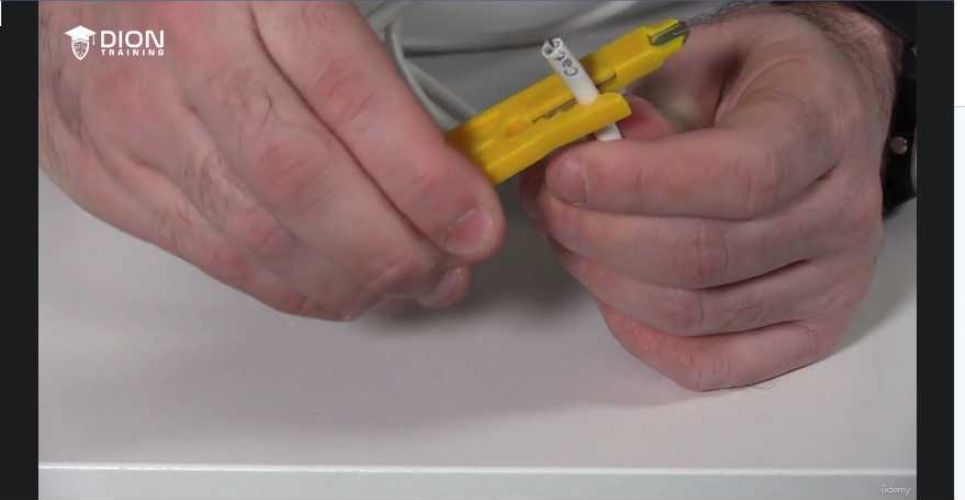

3.  **Cắt bằng (Trimming):** Sau khi đã sắp xếp thứ tự màu sắc theo chuẩn 568A hoặc 568B, kỹ thuật viên cần dùng kìm bấm (crimper) để cắt phẳng đầu các sợi dây.
    *   **Tại sao phải cắt bằng?** Nếu các sợi dây không có độ dài bằng nhau, một số chân có thể không tiếp xúc được với lá đồng (pin) bên trong đầu RJ45, dẫn đến tình trạng cáp chập chờn hoặc không nhận tín hiệu.

Việc dùng kìm crimper không chỉ để bấm đầu nối, mà còn là công cụ cắt tỉa chính xác để đảm bảo các sợi dây đồng đồng nhất về chiều dài, tạo sự tiếp xúc hoàn hảo nhất với các chân kim loại của connector trước khi thực hiện bước ép (crimp) cuối cùng.

Sau khi đã chuẩn bị xong các đầu dây với độ dài phù hợp và đã sắp xếp đúng thứ tự màu, công đoạn tiếp theo là hoàn thiện vật lý cho đầu nối (connector).

**Quy trình lắp đặt và bấm cáp (Crimping)**

Việc đưa các sợi dây vào đầu nối đòi hỏi sự chính xác tuyệt đối. Bạn cần luồn các sợi dây đã sắp xếp vào khe của đầu nối RJ45. Lưu ý rằng mỗi sợi dây phải nằm gọn trong rãnh dẫn hướng của nó, tương ứng với các chân (pins) bằng đồng bên trong đầu nối. Khi bạn đẩy dây vào, hãy đảm bảo tất cả các sợi đồng chạm tới "đích" – tức là tiếp xúc chặt với phần đầu kim loại của các chân pin.

Tiếp theo, bạn sử dụng kìm bấm (crimper). Đây là bước quyết định "độ bền" của cáp. Khi đặt đầu nối vào kìm và nhấn mạnh, cơ chế của kìm sẽ thực hiện hai việc đồng thời:

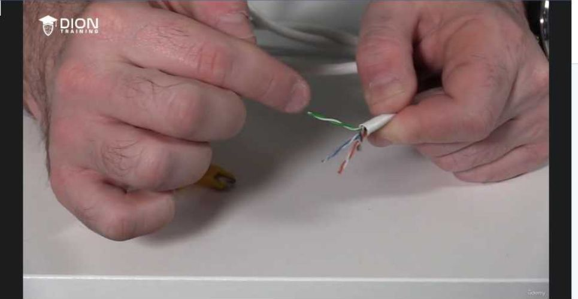

1. Đẩy các chân kim loại xuyên qua lớp vỏ cách điện của sợi dây đồng để thiết lập kết nối điện tử.
2. Ép phần kẹp nhựa của đầu nối vào lớp vỏ ngoài (sheathing) của sợi cáp để cố định, đảm bảo dây không bị tuột ra ngoài khi có lực kéo. Một đầu cáp đạt chuẩn là khi bạn cảm thấy nó "đặc" và chắc chắn.

> **💡 Ví dụ nhớ đời:** Hãy coi việc bấm cáp giống như việc đóng một chiếc đinh vào tường. Nếu bạn đóng không đủ lực, đinh sẽ lỏng lẻo (mạng chập chờn). Nếu bạn đóng lệch, đinh sẽ làm hỏng tường (đầu nối bị hỏng). Kìm bấm chính là "búa", và việc đưa dây vào đúng rãnh chính là đặt đinh đúng vị trí.

**Kiểm tra cáp bằng thiết bị chuyên dụng (Cable Tester)**

Sau khi hoàn thành hai đầu cáp, việc kiểm tra là bắt buộc để xác nhận thông mạch. Thiết bị kiểm tra cáp (cable tester) hoạt động dựa trên nguyên lý gửi tín hiệu điện qua từng sợi dây.

*   **Với cáp thẳng (Straight-through):** Tín hiệu phải đi từ chân số 1 sang chân số 1, chân số 2 sang chân số 2, v.v. Nếu tester hiển thị đèn sáng đồng bộ theo thứ tự 1-1, 2-2, 3-3, 4-4, 5-5, 6-6, 7-7, 8-8, nghĩa là cáp của bạn hoàn hảo.
*   **Với cáp chéo (Crossover):** Các chân sẽ không chạy thẳng mà được đảo vị trí (thường là cặp 1-2 và 3-6). Thiết bị tester sẽ cho thấy các pin này được kết nối chéo với nhau theo đúng sơ đồ chuẩn.

Nếu tester báo lỗi hoặc đèn không sáng, điều đó đồng nghĩa với việc có một (hoặc nhiều) sợi dây không tiếp xúc tốt với chân đồng, hoặc thứ tự dây bị nhầm lẫn.

**Ứng dụng trong kỳ thi và thực tế**

Trong môi trường thi chứng chỉ (như Network+), vì đây là bài thi trên máy tính, bạn sẽ không được thực hành cầm kìm bấm thật. Thay vào đó, bạn sẽ đối mặt với các dạng bài mô phỏng (simulation). Kỹ năng cốt lõi ở đây không phải là cơ bắp, mà là **trí nhớ**. Bạn bắt buộc phải thuộc lòng chuẩn màu (thường là chuẩn T568B hoặc T568A). Bài thi sẽ yêu cầu bạn kéo thả các sợi dây vào đúng 8 vị trí chân cắm. Nếu bạn không thuộc lòng, bạn không thể vượt qua bài mô phỏng này.

Về mặt lịch sử ngành mạng, việc tự làm cáp là một kỹ năng sinh tồn. Cách đây 20 năm, cáp pre-made (cáp làm sẵn) có giá thành rất đắt đỏ. Các kỹ sư mạng thời đó thường mua các cuộn cáp rời (bulk cable) dài hàng nghìn feet, tự cắt và tự bấm để tiết kiệm chi phí tối đa cho doanh nghiệp. Ngày nay, dù chi phí cáp làm sẵn đã rẻ hơn nhiều, kỹ năng này vẫn cực kỳ quan trọng để xử lý các tình huống khẩn cấp, tùy biến độ dài dây trong các rack server chật hẹp, hoặc khi bạn cần sửa chữa nhanh một đường truyền bị đứt mà không có sẵn cáp thay thế.

Trong bối cảnh thực tế công việc kỹ thuật mạng, tư duy về chi phí và hiệu quả là yếu tố then chốt. Người hướng dẫn chia sẻ rằng mặc dù trước đây việc tự bấm cáp là cách kiếm tiền tối ưu (tính phí khách hàng theo từng foot), nhưng hiện nay thị trường đã thay đổi hoàn toàn.

**Tư duy tối ưu hóa chi phí (Cost-Benefit Analysis):**
Việc cân nhắc giữa "tự làm" và "mua sẵn" là bài toán kinh tế mà một kỹ sư mạng cần thuộc lòng. Khi giá thành cáp làm sẵn (ready-made cables) đã xuống thấp (khoảng 10 cents cho một sợi patch cable 6 inch), thời gian bỏ ra để cắt, tuốt vỏ, sắp xếp dây và bấm đầu (mất khoảng 30-60 giây) trở nên đắt đỏ hơn giá trị của chính sợi cáp đó. Do đó, quy tắc chung là: chỉ tự làm cáp khi không thể mua được các kích thước tiêu chuẩn, ví dụ như những khoảng cách đặc biệt (như 57 feet) mà các nhà sản xuất không cung cấp sẵn.

**Giới hạn vật lý của cáp Cat 5:**
Một kiến thức cực kỳ quan trọng cho kỳ thi và cả thực tế thi công là giới hạn truyền dẫn. Cáp Cat 5 chỉ duy trì được độ ổn định của tín hiệu trong phạm vi tối đa là 100 mét. Nếu vượt quá con số này, hiện tượng suy hao tín hiệu (signal loss) sẽ xảy ra, dẫn đến mất gói tin hoặc kết nối không ổn định. 

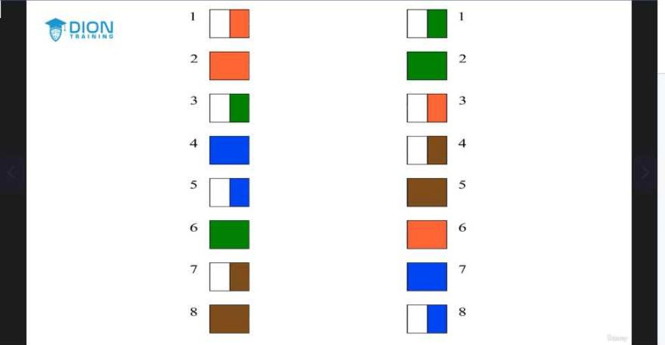

> **💡 Ví dụ nhớ đời:** Hãy tưởng tượng bạn đang dùng một chiếc vòi tưới cây nối dài. Ở 100 mét đầu tiên, áp lực nước vẫn đủ mạnh để phun xa. Nhưng nếu bạn nối quá dài, áp lực sẽ yếu dần và đến cuối vòi, nước chỉ còn nhỏ giọt. Tín hiệu điện trong cáp cũng vậy, nó cần một khoảng cách đủ ngắn để giữ được "áp lực" (cường độ) trước khi đến được đích.

**Chiến lược an toàn (Leeway - Biên độ an toàn):**
Dù thông số kỹ thuật cho phép 100 mét, nhưng trong môi trường thực tế, người hướng dẫn khuyên chỉ nên đi dây trong phạm vi dưới 90 mét. Việc để dành ra 10 mét "biên độ an toàn" này giúp bạn tránh được các vấn đề rủi ro do độ cong của dây, các mối nối trung gian hoặc các yếu tố nhiễu điện từ không lường trước được tại công trình.

**Lời khuyên về thực hành cho kỳ thi:**
Đối với những người mới bắt đầu hoặc muốn ôn tập cho kỳ thi, việc tự trang bị một bộ kit là khoản đầu tư thông minh. Với khoảng 10 USD trên Amazon, bạn sẽ sở hữu đủ bộ công cụ "tác chiến":
1. **Cable tester:** Dùng để xác định dây có thông mạch hay không và kiểm tra đúng chuẩn (thẳng hay chéo).
2. **Crimper (Kìm bấm):** Dụng cụ ép đầu nối vào dây cáp.
3. **Stripper (Kìm tuốt):** Dụng cụ bóc lớp vỏ nhựa ngoài của cáp.
4. **End pieces (Đầu RJ45):** Các linh kiện tiêu hao để bạn thực hành bấm đầu cho đến khi thành thạo.

Việc làm quen với các công cụ này không chỉ giúp bạn tự tin trong các câu hỏi dạng "kéo và thả" (drag and drop) mô phỏng sơ đồ chân (pinout) trong bài thi, mà còn giúp bạn nắm vững kiến thức về sự khác biệt giữa chuẩn đấu nối thẳng (straight-through) và chuẩn chéo (crossover), từ đó giải quyết các bài toán về cấu trúc mạng một cách logic và chuyên nghiệp.

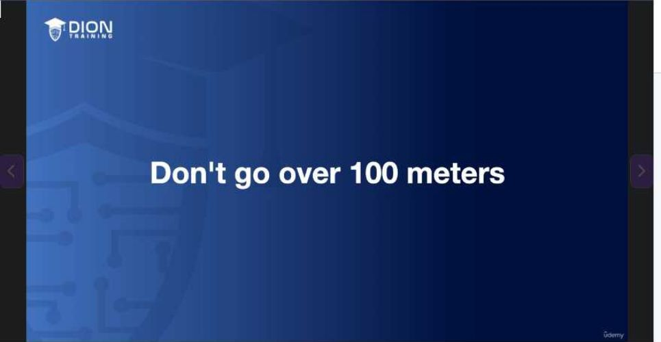

---

## 🎯 Bí Kíp Ôn Thi Tốc Độ

### 1. Phân loại cáp (Cấu tạo)
*   **Straight-through (Cáp thẳng/Patch cable):** 2 đầu **giống hệt nhau** (Chuẩn 568B - 568B).
*   **Crossover (Cáp chéo):** 2 đầu **khác chuẩn** (Một đầu 568B - một đầu 568A).
*   **MDIX:** Công nghệ switch tự động đảo chân tín hiệu (có thể dùng cáp thẳng thay cho cáp chéo). **Lưu ý:** Thi cử luôn coi switch là thiết bị cũ (không có MDIX) trừ khi đề bài ghi rõ.

### 2. Quy tắc kết nối
*   **Straight-through (DTE ↔ DCE):** Thiết bị khác loại (VD: PC ↔ Switch, Router ↔ Hub).
*   **Crossover (DTE ↔ DTE hoặc DCE ↔ DCE):** Thiết bị cùng loại (VD: Switch ↔ Switch, PC ↔ PC).

### 3. Chuẩn màu dây (568B) - Phải thuộc lòng

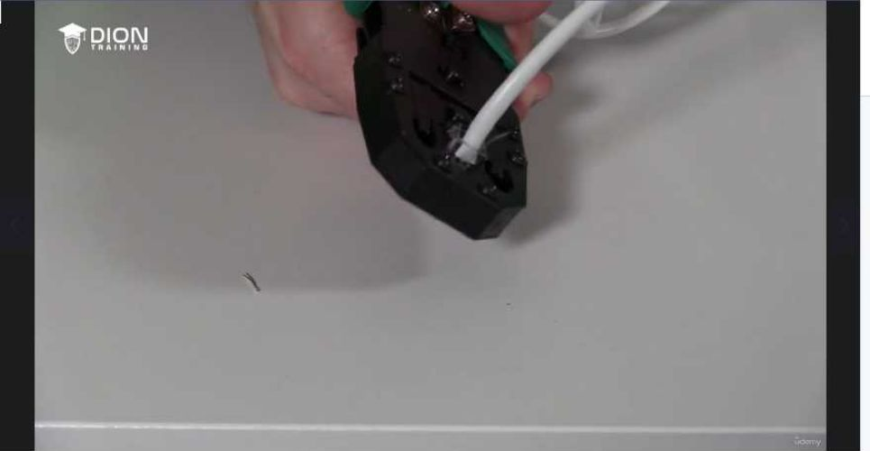

*Thứ tự Pin 1-8:*
1. **Trắng Cam**
2. **Cam**
3. **Trắng Xanh lá**
4. **Xanh dương**
5. **Trắng Xanh dương**
6. **Xanh lá**
7. **Trắng Nâu**
8. **Nâu**
*Mẹo Crossover:* Đổi vị trí cặp **Cam** và **Xanh lá** (giữa 568B và 568A).

### 4. Công cụ & Kỹ thuật
*   **Bộ dụng cụ:**
    *   **Cable Stripper:** Tuốt vỏ ngoài.
    *   **Cable Crimper:** Bấm đầu RJ45 (8P).
    *   **Cable Tester:** Kiểm tra thông mạch (đảm bảo pin 1 nối 1, 2 nối 2...).
*   **Giới hạn vật lý:** Chiều dài tối đa **100 mét** (Khuyên dùng < 90m để tránh mất tín hiệu).

### 5. Lưu ý cho bài thi
*   **Dạng bài thực hành:** Drag & Drop sơ đồ màu dây (568A/568B) vào RJ45.
*   **Tư duy:** Nếu đề hỏi tại sao 2 Switch không thông nhau → Khả năng cao do sai loại cáp (dùng cáp thẳng thay vì chéo).

### Hình ảnh minh họa thêm:

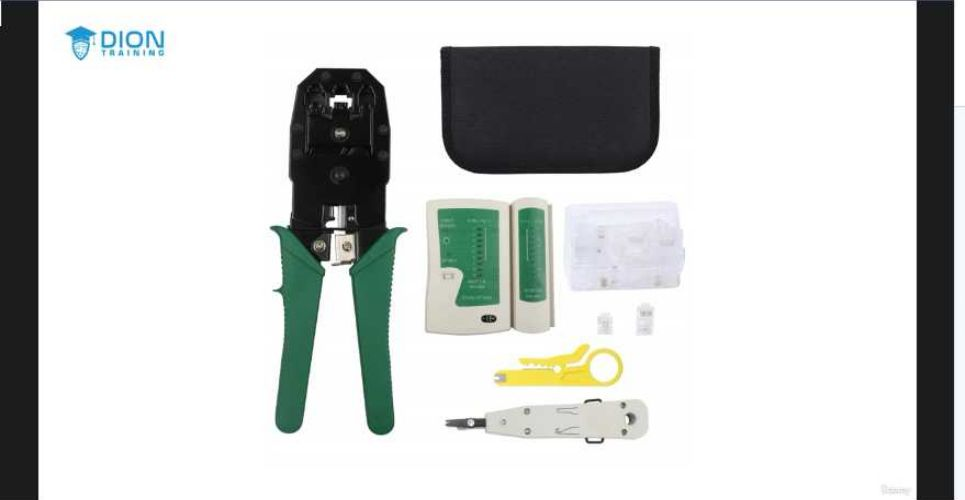

---
*Ghi chú: 23 hình ảnh minh họa (.jpg) đã được tải về và lưu tự động vào thư mục con `image/` cùng cấp với file này. Để ảnh hiển thị tự động, hãy đảm bảo bạn sao chép cả thư mục `image/` nếu bạn muốn di chuyển file markdown sang nơi khác!*
