# Fiber Optic Fundamentals

### Khái niệm cơ bản về Fiber Media (Cáp quang)

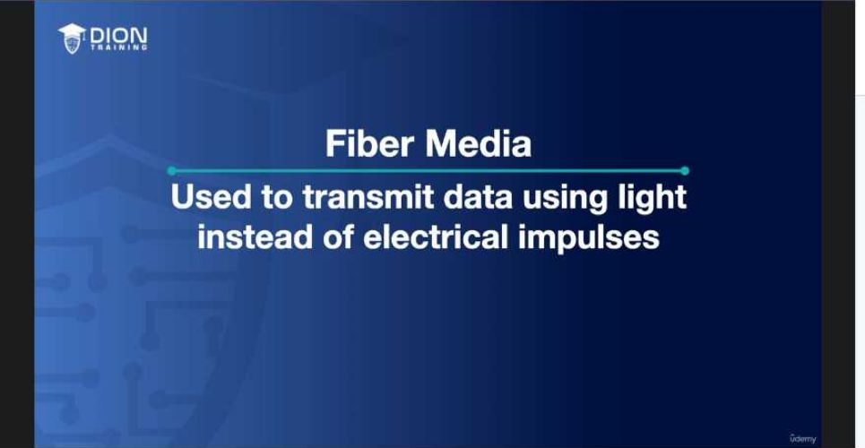

Trong mạng máy tính, phương thức truyền dẫn là "xương sống" quyết định hiệu suất toàn hệ thống. Nếu các phương thức truyền dẫn truyền thống dựa trên dòng điện chạy qua kim loại (đồng), thì Fiber Media (cáp quang) tạo ra một cuộc cách mạng bằng cách sử dụng **ánh sáng**. Bằng cách chuyển đổi dữ liệu từ các xung điện sang các xung ánh sáng (photon), công nghệ này cho phép truyền tải thông tin với tốc độ và khoảng cách mà dây đồng không thể mơ tới.

### Cơ chế truyền dẫn: Ánh sáng và Sợi quang
Fiber optic sử dụng các nguồn sáng như **LED (Light Emitting Diode)** hoặc **Laser** để bắn các tia sáng vào lõi cáp. Cấu trúc của cáp quang không phải là kim loại dẫn điện, mà là các sợi thủy tinh siêu tinh khiết hoặc nhựa đặc biệt. Ánh sáng di chuyển bên trong các sợi này thông qua hiện tượng phản xạ toàn phần, giúp dữ liệu được truyền đi mà không bị thất thoát đáng kể năng lượng dọc đường.

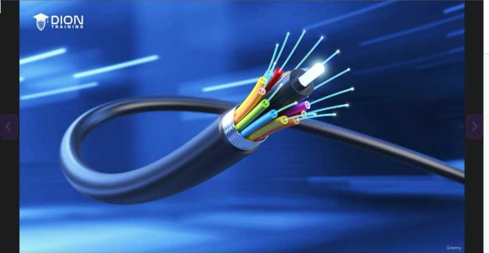

### Ưu thế vượt trội của cáp quang so với cáp đồng

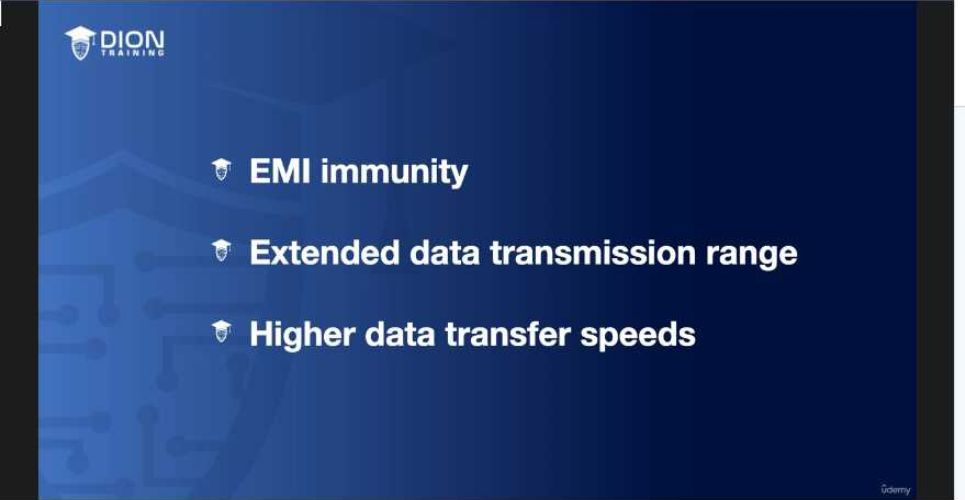

#### 1. Miễn nhiễm với nhiễu điện từ (EMI)
Đây là lợi thế mang tính quyết định. Cáp đồng truyền dẫn bằng electron (điện), vốn rất nhạy cảm với các trường điện từ xung quanh. Bất kỳ động cơ, đường dây điện cao thế hay sóng vô tuyến nào gần đó cũng có thể tạo ra nhiễu (EMI), làm méo dạng tín hiệu. 

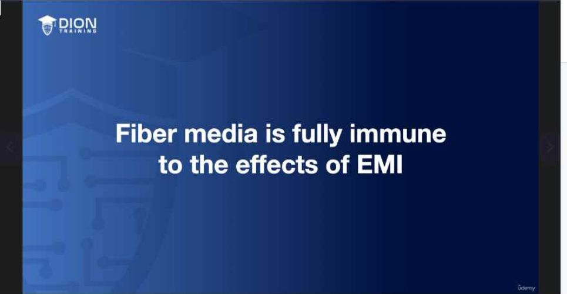

> **💡 Ví dụ nhớ đời:** Hãy tưởng tượng cáp đồng giống như việc bạn cố nói chuyện trong một buổi hòa nhạc rock ồn ào; tiếng ồn (EMI) sẽ làm người nghe khó hiểu được bạn. Ngược lại, cáp quang giống như việc bạn dùng một chiếc đèn pin chiếu vào không gian tĩnh lặng, hoàn toàn tách biệt với âm thanh ồn ào bên ngoài. Ánh sáng không bị ảnh hưởng bởi từ trường, do đó dữ liệu luôn "trong vắt" ngay cả trong môi trường nhiều máy móc điện tử.

Vì không bị ảnh hưởng bởi EMI, cáp quang không cần các lớp bọc chống nhiễu (shielding) dày cộm hay các kỹ thuật xoắn cặp (twisted pair) phức tạp như cáp đồng.

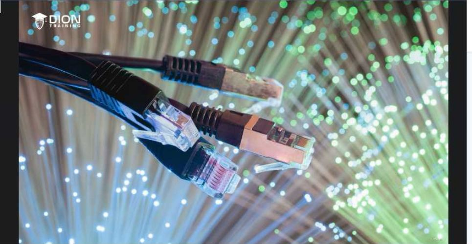

#### 2. Khoảng cách truyền dẫn "không tưởng"

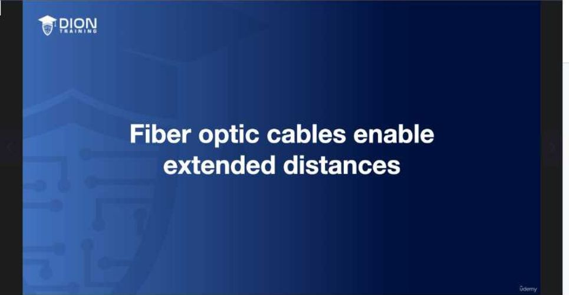

Sự hạn chế của cáp đồng nằm ở tính chất vật lý: điện trở. Khi dòng điện chạy qua dây đồng, nó bị hao hụt năng lượng dưới dạng nhiệt. 
*   **Twisted pair (Cáp xoắn đôi):** Bị giới hạn ở khoảng 100 mét. Vượt quá ngưỡng này, tín hiệu suy hao (degradation) mạnh đến mức thiết bị đầu cuối không thể đọc được dữ liệu.
*   **Coaxial (Cáp đồng trục):** Nhỉnh hơn, đạt khoảng 300 mét.
*   **Fiber Optic:** Có khả năng truyền tải dữ liệu trên quãng đường lên tới hàng trăm kilomet mà không cần thiết bị khuếch đại tín hiệu (repeater) quá thường xuyên. Điều này biến nó thành lựa chọn số một cho các tuyến cáp quang xuyên đại dương, kết nối internet giữa các lục địa.

#### 3. Tốc độ truyền tải siêu việt

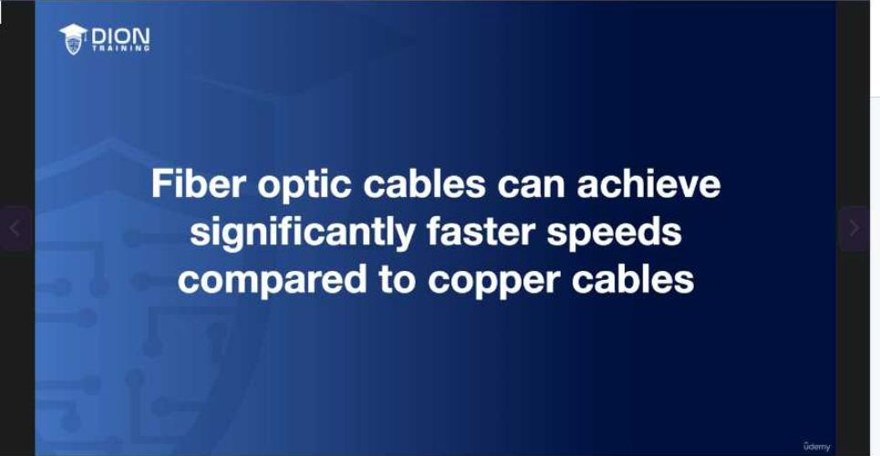

Trong khi cáp đồng hiện nay chủ yếu dừng lại ở tốc độ khoảng 10 Gbps (Gigabit mỗi giây) và chỉ ở khoảng cách ngắn, cáp quang gần như không có giới hạn lý thuyết về tốc độ trong thực tế ứng dụng hiện tại.

*   **Đỉnh cao công nghệ:** Việc công ty viễn thông Nhật Bản NTT đạt được tốc độ **1 Petabit/giây** (1 Petabit = 1.000 Terabit = 1.000.000 Gigabit) vào năm 2012 là một cột mốc lịch sử. Để dễ hình dung, tốc độ này có thể tải toàn bộ thư viện dữ liệu khổng lồ của một quốc gia chỉ trong vài giây.

### Tại sao Fiber thay thế toàn diện?
Sự chuyển dịch từ đồng sang quang không chỉ là nâng cấp thiết bị, mà là chuyển dịch bản chất vật lý của truyền tin:
1.  **Độ ổn định:** Không nhiễu, không cần bọc chống nhiễu đắt tiền.
2.  **Độ bao phủ:** Kết nối từ một phòng làm việc nhỏ đến các hệ thống hạ tầng xuyên quốc gia.
3.  **Khả năng mở rộng:** Với cùng một sợi cáp, bằng cách sử dụng các bước sóng ánh sáng khác nhau (WDM - Wavelength Division Multiplexing), chúng ta có thể truyền nhiều luồng dữ liệu cùng lúc, nhân tốc độ lên hàng ngàn lần.

Tóm lại, Fiber Media không đơn thuần là một loại cáp, nó là nền tảng cho phép kỷ nguyên Internet tốc độ cao hiện nay tồn tại và phát triển.

Mặc dù cáp quang có tiềm năng kỹ thuật vô hạn, thực tế triển khai mạng lại bị chi phối bởi các yếu tố phi kỹ thuật. Dưới đây là phân tích chuyên sâu về sự chuyển dịch từ "giới hạn vật lý" sang "giới hạn hệ thống" và các rào cản thực tế khi triển khai cáp quang.

### 1. Sự dịch chuyển nút thắt cổ chai: Từ dây dẫn đến thiết bị
Trong các mạng tốc độ cực cao, vấn đề không còn nằm ở môi trường truyền dẫn (cáp quang) mà nằm ở các thiết bị phần cứng xử lý tín hiệu. 

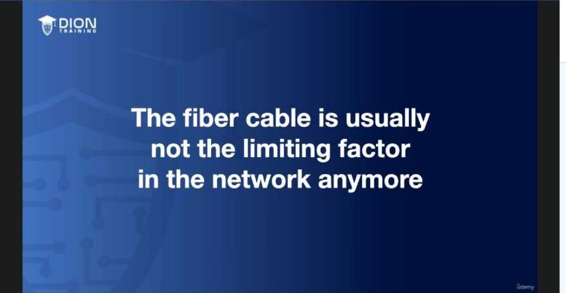

*   **Bản chất vấn đề:** Cáp quang có băng thông gần như "vô tận" so với nhu cầu hiện tại. Tuy nhiên, các thiết bị chuyển mạch (switch), bộ định tuyến (router) và thiết bị đầu cuối (end-user devices) mới là những thực thể phải "đọc", "phân tích" và "chuyển tiếp" dữ liệu. Khi các thiết bị này không xử lý kịp tốc độ ánh sáng mà sợi quang cung cấp, chúng trở thành "nút thắt cổ chai" (bottleneck).

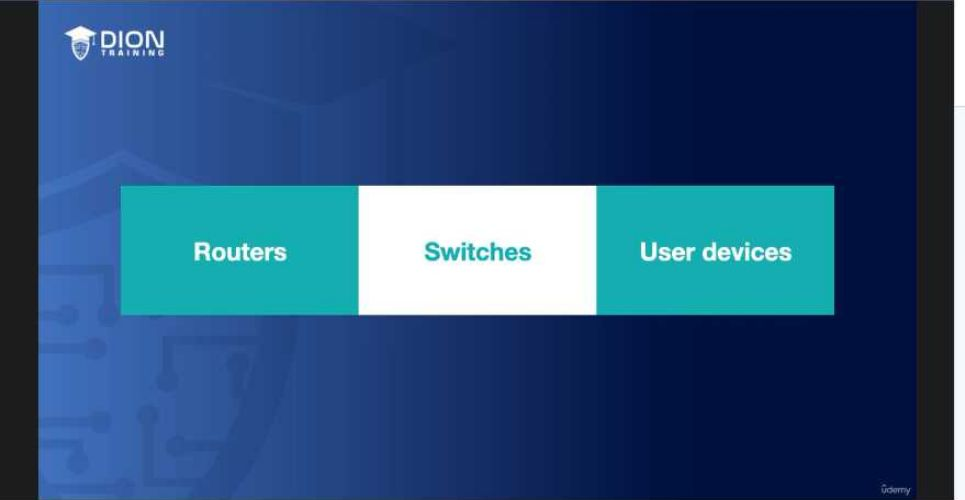

*   **Quyết định dựa trên chi phí (Cost-benefit decision):** Các doanh nghiệp thường dừng lại ở mức 10 Gbps hoặc 100 Gbps không phải vì sợi quang không thể chạy nhanh hơn, mà vì việc nâng cấp phần cứng lên mức cao hơn đòi hỏi chi phí đầu tư hạ tầng mạng cực kỳ đắt đỏ, trong khi hiệu quả mang lại có thể chưa tương xứng với ngân sách bỏ ra.

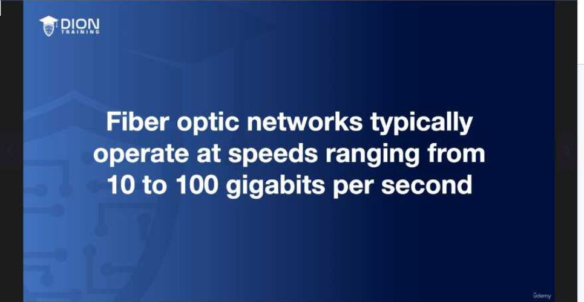

> **💡 Ví dụ nhớ đời:** Hãy tưởng tượng cáp quang giống như một đường cao tốc 100 làn xe có thể cho phép xe chạy với tốc độ không giới hạn. Nhưng nếu các trạm thu phí (thiết bị mạng) ở đầu và cuối đường chỉ có 2 cửa soát vé, thì dù đường có rộng đến đâu, xe cộ vẫn phải ùn tắc tại trạm thu phí. Việc mở rộng thêm làn đường là không cần thiết nếu bạn không nâng cấp các trạm thu phí đó.

### 2. Hai rào cản lớn: Chi phí và Tính phức tạp

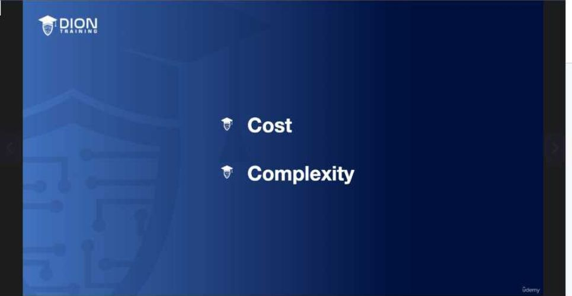

Mặc dù vượt trội về mặt hiệu năng, tại sao sợi quang không thay thế hoàn toàn cáp đồng? Có hai lý do chính:

#### A. Chi phí đầu tư (Cost)
*   **Giá thành cáp:** Sợi quang đắt đỏ hơn đáng kể so với cáp đồng (như ví dụ, tỉ lệ khoảng 3:1 hoặc 4:1 cho cùng một độ dài).
*   **Chi phí thiết bị đi kèm:** Đây mới là "cú sốc" ngân sách. Để hỗ trợ sợi quang, các cổng kết nối trên switch và router cần các bộ thu phát quang (transceivers) phức tạp. Một cổng cáp đồng RJ45 thông thường được tích hợp sẵn trên thiết bị, nhưng cổng quang yêu cầu module quang (SFP/QSFP) rời, mỗi module này có thể tốn từ vài chục đến hàng ngàn đô la tùy tốc độ.

#### B. Tính phức tạp trong thi công và bảo trì (Complexity)

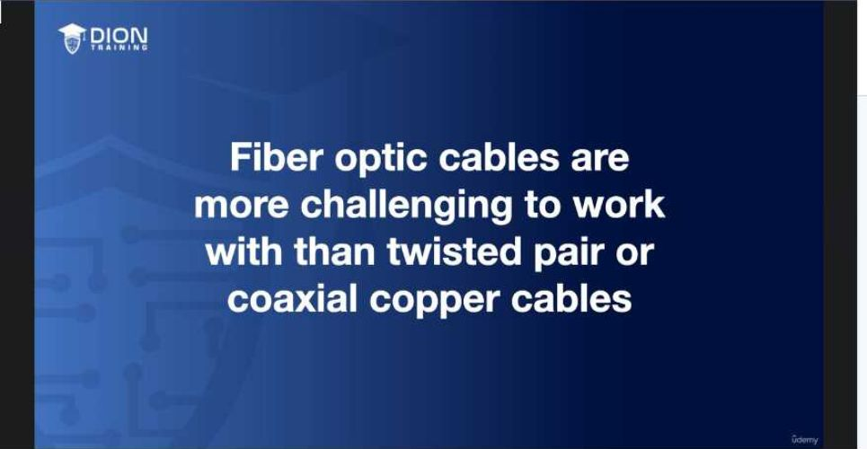

*   **Yêu cầu kỹ thuật:** Cáp đồng (Twisted pair) rất "dễ chịu". Bạn có thể cắt, bấm đầu, và kiểm tra bằng các bộ kit giá rẻ (10-15 USD) chỉ sau vài phút hướng dẫn. Ngược lại, sợi quang yêu cầu độ chính xác cực cao. 
*   **Độ nhạy của thủy tinh:** Sợi quang là những sợi thủy tinh siêu mảnh. Nếu bạn bấm đầu không chuẩn, làm cong quá mức, hoặc để bụi bẩn bám vào bề mặt kết nối, tín hiệu ánh sáng sẽ bị suy hao hoặc phản xạ ngược, gây lỗi mạng ngay lập tức.
*   **Công cụ chuyên dụng:** Việc lắp đặt hoặc sửa chữa cáp quang đòi hỏi máy hàn cáp quang (fusion splicer) – một thiết bị đắt tiền, yêu cầu kỹ năng tay nghề cao và môi trường làm việc sạch sẽ.

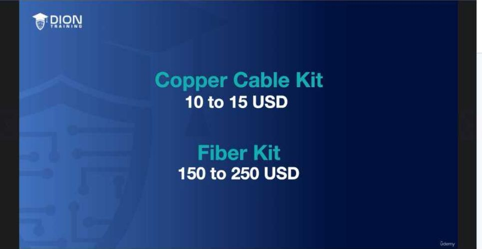

> **💡 Ví dụ nhớ đời:** Cáp đồng giống như việc bạn tự tay làm một chiếc bánh mì kẹp tại nhà: chỉ cần vài dụng cụ bếp cơ bản, nguyên liệu rẻ và mất 10 phút học là xong. Trong khi đó, việc thi công cáp quang giống như việc chế tác một chiếc đồng hồ cơ khí tinh xảo: bạn cần phòng lab sạch, kính hiển vi, máy cắt laser chính xác và phải là thợ lành nghề, chỉ một hạt bụi lọt vào bộ máy cũng khiến nó ngừng chạy.

### 3. Tổng kết chi phí triển khai
Việc thi công hạ tầng cáp quang trong một tòa nhà văn phòng có chi phí cao gấp 5 đến 10 lần so với chạy cáp đồng cho cùng một khoảng cách. Sự chênh lệch này không chỉ nằm ở giá vật tư mà là sự tổng hòa của:
1.  **Chi phí thiết bị đầu cuối:** Đắt đỏ hơn.
2.  **Chi phí nhân công:** Cần kỹ thuật viên trình độ cao, được đào tạo bài bản.
3.  **Chi phí công cụ:** Máy móc đo kiểm và hàn nối chuyên dụng đòi hỏi vốn đầu tư lớn.

Vì vậy, trong các quyết định thiết kế mạng, kỹ sư luôn phải cân bằng giữa nhu cầu tốc độ (ưu thế của cáp quang) và bài toán kinh tế (lợi thế của cáp đồng).

Sau khi đã làm rõ các rào cản về chi phí và độ phức tạp, chúng ta sẽ đi sâu vào cấu trúc kỹ thuật cốt lõi giúp cáp quang trở thành lựa chọn ưu tiên trong hạ tầng mạng doanh nghiệp: **Cáp quang đơn mốt (Single-mode)** và **Cáp quang đa mốt (Multi-mode)**.

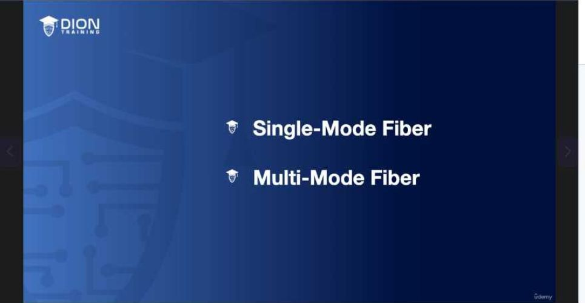

### 1. Single-mode Fiber (SMF - Cáp quang đơn mốt)

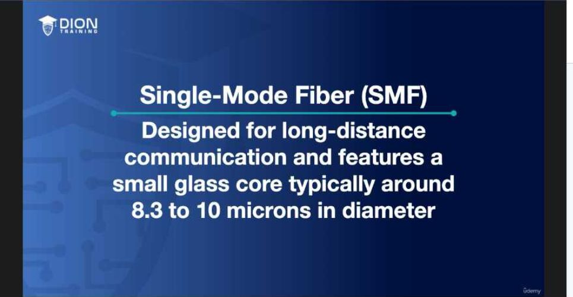

Đặc điểm kỹ thuật quan trọng nhất của SMF là lõi thủy tinh cực nhỏ, chỉ từ 8.3 đến 10 micron. Để bạn hình dung độ tinh vi của nó: một sợi tóc người bình thường có đường kính khoảng 17 - 180 micron. Điều này có nghĩa là lõi cáp quang SMF nhỏ hơn từ 2 đến 20 lần so với sợi tóc của chúng ta.

*   **Cơ chế truyền dẫn:** Do đường kính lõi quá nhỏ, ánh sáng chỉ có thể di chuyển theo một đường thẳng duy nhất (một "mode" duy nhất). Việc này triệt tiêu hiện tượng tán sắc (dispersion) – hiện tượng các tia sáng va đập và tản mát làm méo tín hiệu.
*   **Tại sao lại là "đường dài":** Vì tín hiệu không bị tán sắc, nó có thể duy trì cường độ ổn định trên quãng đường rất dài, lên tới hàng chục hoặc hàng trăm dặm. SMF chính là "xương sống" (backbone) cho các kết nối liên tỉnh hoặc giữa các khu vực địa lý xa cách.

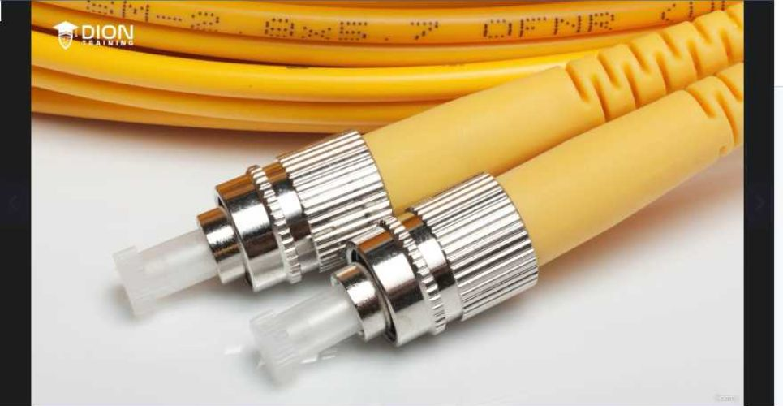

> **💡 Ví dụ nhớ đời:** Hãy tưởng tượng bạn đang bắn một tia laser qua một hành lang hẹp và thẳng tắp. Vì hành lang quá hẹp, tia laser không thể va đập vào tường hay đổi hướng, nó sẽ đi thẳng tắp từ đầu này sang đầu kia của tòa nhà mà không bị suy giảm năng lượng. Đó chính là cách SMF hoạt động – tinh gọn và chuẩn xác cho khoảng cách xa.

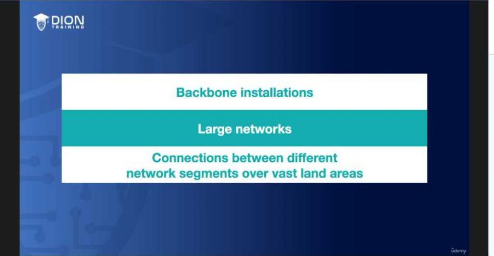

### 2. Multi-mode Fiber (MMF - Cáp quang đa mốt)

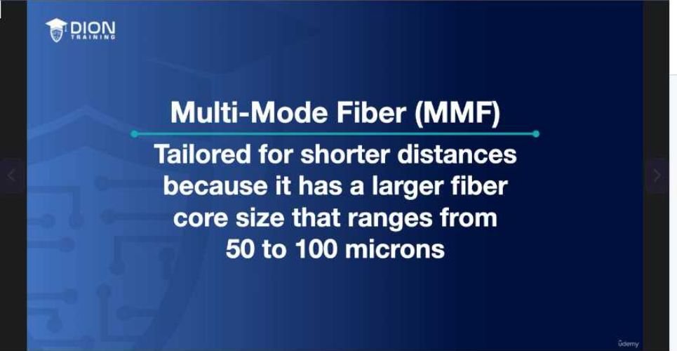

Ngược lại với SMF, MMF được thiết kế với lõi lớn hơn, dao động từ 50 đến 100 micron. Dù "lớn" hơn nhiều so với SMF (gấp khoảng 5 lần), nó vẫn là một sợi thủy tinh cực mảnh.

*   **Cơ chế truyền dẫn:** Với đường kính lõi rộng hơn, ánh sáng không chỉ đi theo một đường thẳng mà có thể phản xạ và đi theo nhiều đường khác nhau (nhiều "mode") bên trong lõi cáp.

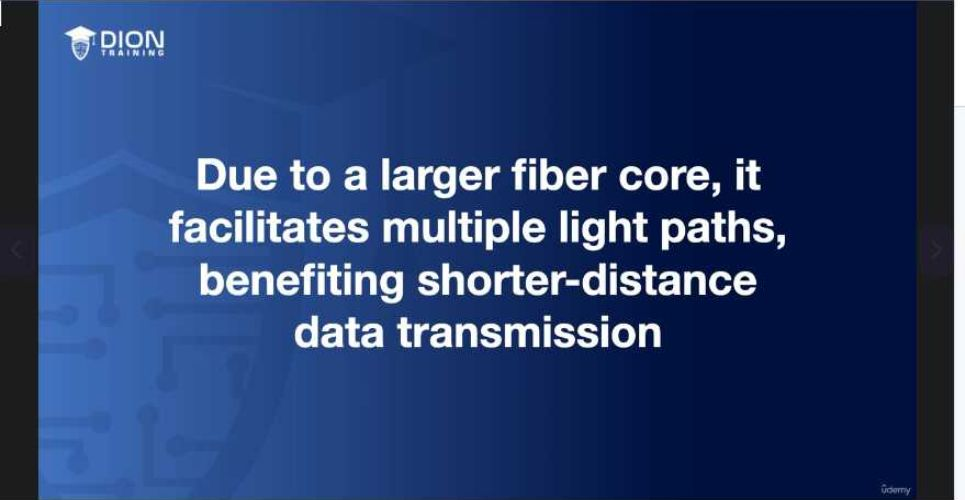

*   **Lợi ích và hạn chế:** Việc cho phép nhiều luồng ánh sáng cùng di chuyển giúp truyền được lượng dữ liệu lớn hơn trong khoảng cách ngắn. Tuy nhiên, cái giá phải trả chính là hiện tượng **tán sắc**. Khi ánh sáng đi theo nhiều con đường khác nhau, chúng sẽ đến đích ở những thời điểm hơi khác nhau, làm tín hiệu bị nhòe đi. Vì lý do này, MMF chỉ phù hợp cho các khoảng cách ngắn trong phạm vi nội bộ tòa nhà hoặc trung tâm dữ liệu.

> **💡 Ví dụ nhớ đời:** Hãy hình dung SMF là một đường đua xe công thức 1 chỉ dành cho một chiếc xe duy nhất đi thẳng, trong khi MMF là một con đường rộng cho phép nhiều xe chạy song song. Ở cự ly ngắn, nhiều xe chạy cùng lúc (nhiều dữ liệu) là rất tốt, nhưng nếu chạy đường dài, việc các xe đâm va vào nhau hoặc lạc hướng (tán sắc) sẽ khiến hệ thống không còn giữ được sự đồng bộ.

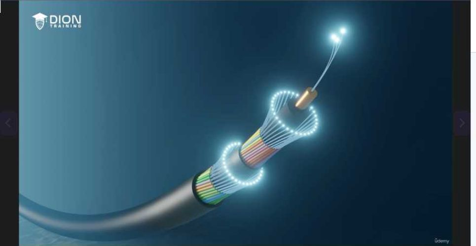

### Tóm lược sự khác biệt cốt lõi:
*   **SMF:** Lõi siêu nhỏ (8-10µm), truyền được xa (hàng chục/trăm km), dùng làm "xương sống" mạng (backbone).
*   **MMF:** Lõi lớn (50-100µm), truyền khoảng cách ngắn, dùng phổ biến trong kết nối thiết bị nội bộ do chi phí thiết bị quang đầu cuối rẻ hơn SMF.

Đoạn transcript đang bỏ ngỏ ở việc "tán sắc tín hiệu" trong MMF. Đây là vấn đề kỹ thuật quan trọng nhất cần lưu ý khi thiết kế mạng: khi lõi cáp càng lớn, khoảng cách truyền dẫn càng xa, thì hiện tượng tán sắc càng làm suy giảm chất lượng dữ liệu, buộc chúng ta phải giới hạn chiều dài của cáp MMF trong các hệ thống mạng thực tế.

Việc sử dụng lõi lớn hơn trong cáp quang đa mode (multi-mode fiber - MMF) dẫn đến hiện tượng tán xạ ánh sáng nhiều hơn. Hệ quả trực tiếp là khoảng cách truyền tải dữ liệu bị giới hạn đáng kể so với cáp đơn mode (single-mode fiber - SMF). Khi ánh sáng truyền theo nhiều đường (modes) khác nhau trong cùng một lõi, các xung tín hiệu sẽ bị nhòe dần theo thời gian và khoảng cách, khiến máy thu khó có thể phân biệt được các bit dữ liệu ở tốc độ cao.

Lý do then chốt khiến MMF phổ biến trong các doanh nghiệp không nằm ở hiệu năng tuyệt đối, mà nằm ở **tối ưu hóa chi phí**. Vì lõi MMF lớn (50-100 micron), các thiết bị phát quang (như đèn LED hoặc VCSEL - Vertical-Cavity Surface-Emitting Laser) dùng để "bơm" ánh sáng vào cáp không đòi hỏi độ chính xác cực kỳ khắt khe như thiết bị dùng cho SMF. Việc sản xuất các thành phần này rẻ hơn nhiều, giúp hạ tổng chi phí đầu tư cho hệ thống mạng.

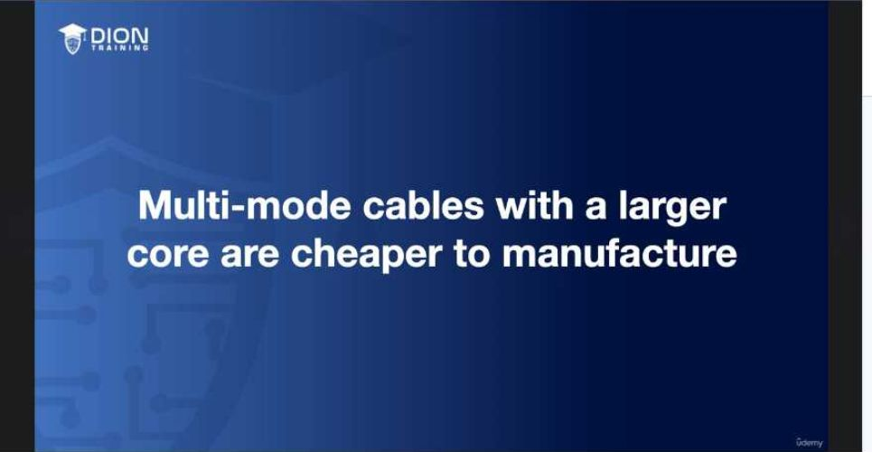

> **💡 Ví dụ nhớ đời:** Hãy tưởng tượng SMF giống như một đường ống nước siêu nhỏ, nơi bạn phải dùng một tia laser cực mảnh để bắn thẳng vào tâm ống. Để làm được điều đó, bạn cần một khẩu súng ngắm cực kỳ đắt tiền và tinh vi. Trong khi đó, MMF giống như một đường ống thoát nước lớn; bạn có thể dùng một chiếc vòi phun nước thông thường (đèn LED) để bơm nước vào. Dù nước (ánh sáng) bắn tung tóe (tán xạ) và không thẳng hàng, nó vẫn đi được vào trong ống. Bạn không cần thiết bị ngắm bắn đắt đỏ, đó chính là lý do MMF rẻ hơn.

Trong kiến trúc mạng thực tế, MMF thường được triển khai trong phạm vi nội bộ (LAN) như bên trong tòa nhà, khuôn viên trường học, các khu công nghệ hoặc giữa các hàng tủ rack trong trung tâm dữ liệu. Đây là nơi khoảng cách vật lý không quá lớn, nhưng nhu cầu băng thông cao đòi hỏi thay thế các loại cáp đồng truyền thống.

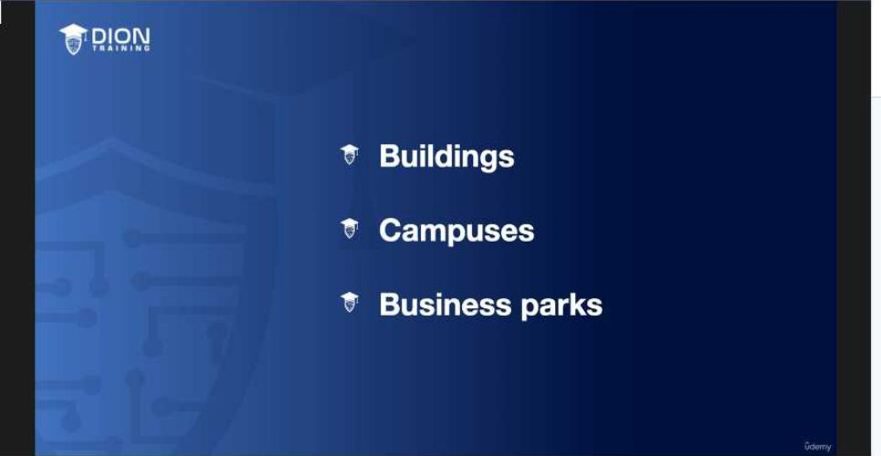

Khi đề cập đến "khoảng cách ngắn" đối với cáp quang, tiêu chuẩn kỹ thuật thường quy định là dưới **2.000 mét (2 km)**. Dù con số 2 km này lớn hơn nhiều so với giới hạn 100 mét của cáp đồng (Ethernet), nó vẫn là "sân nhà" so với SMF – vốn có thể vươn xa tới hàng trăm dặm. Về mặt vận hành, bạn có thể coi MMF như một bản nâng cấp hiệu suất cao cho các kết nối patch cord (dây nhảy) đồng. Thay vì dùng cáp đồng để nối switch với switch, switch với server, MMF là lựa chọn thay thế để:

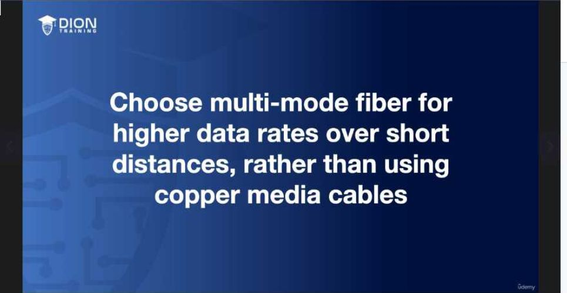

1. Đạt tốc độ truyền tải cao hơn.
2. Miễn nhiễm hoàn toàn với nhiễu điện từ (EMI) – thứ thường xuyên gây lỗi trên cáp đồng nếu đi gần các thiết bị điện công nghiệp.

Về mặt nhận diện thực địa, vì lõi sợi quang (core) quá nhỏ so với mắt thường, các nhà sản xuất đã sử dụng **quy ước màu sắc (Color Coding)** trên lớp vỏ ngoài (jacket) để kỹ thuật viên phân loại:

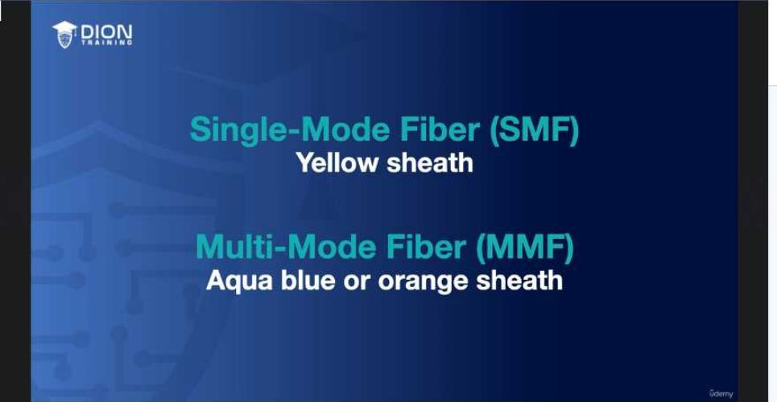

*   **Màu vàng (Yellow):** Luôn là SMF (được tối ưu cho đường dài).
*   **Màu xanh Aqua (Aqua blue) hoặc Cam (Orange):** Luôn là MMF (được tối ưu cho khoảng cách ngắn).

Quy ước này là "luật bất thành văn" trong ngành viễn thông. Nếu không có mã màu này, việc phân biệt giữa SMF và MMF gần như là bất khả thi ngay cả khi sử dụng kính lúp thông thường, vì cấu trúc vật lý bên ngoài của sợi quang không thể hiện được sự khác biệt về kích thước lõi ở cấp độ micron (nhỏ hơn cả sợi tóc người). Việc nắm vững mã màu này là kỹ năng sinh tồn cơ bản giúp kỹ thuật viên tránh được các sai sót nghiêm trọng như dùng sai loại dây cho module quang (transceiver), vốn có thể dẫn đến việc kết nối không ổn định hoặc mất tín hiệu hoàn toàn.

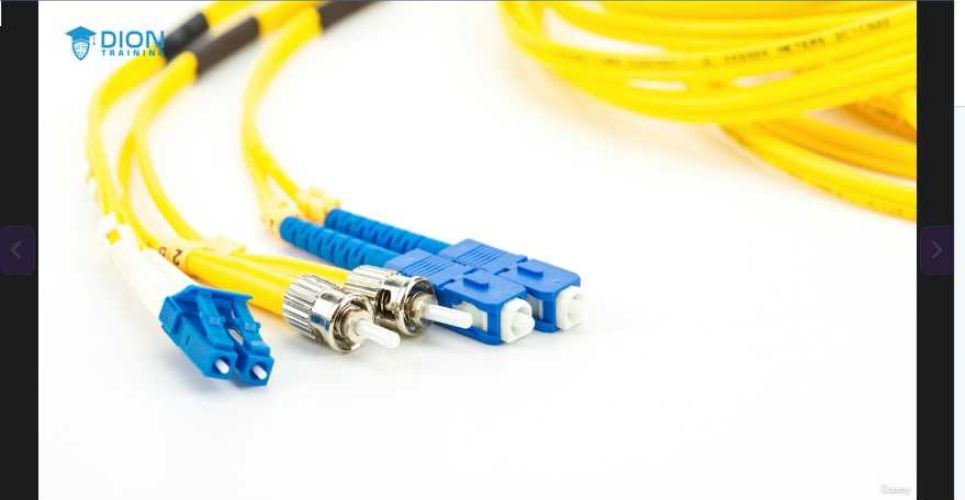

Dưới đây là phân tích chi tiết các nội dung cốt lõi của đoạn transcript:

### Cơ chế vật lý: Tại sao Single-mode có hiệu suất cao hơn?
Điểm khác biệt then chốt nằm ở **lõi sợi quang (fiber core)**. Trong khi Multi-mode có lõi lớn, Single-mode (SMF) sở hữu lõi cực kỳ nhỏ. Sự khác biệt về kích thước này không chỉ là số liệu kỹ thuật mà là yếu tố quyết định hành vi của ánh sáng khi truyền tải:

*   **Đường đi đơn nhất (Singular path):** Do lõi của SMF quá nhỏ, nó chỉ cho phép một chế độ ánh sáng duy nhất đi qua. Hãy tưởng tượng bạn đang chạy trong một hành lang cực hẹp, bạn bắt buộc phải chạy thẳng và không thể lạng lách.
*   **Triệt tiêu sự tán xạ (Diffusion):** Khi ánh sáng đi theo một đường thẳng duy nhất, nó không bị va chạm hay phản xạ vào thành ống nhiều lần. Chính điều này giúp tín hiệu không bị "tán xạ" (diffusion) – hiện tượng khiến xung ánh sáng bị mờ đi và biến dạng. Khi tín hiệu không bị biến dạng, nó có thể duy trì cường độ ổn định trên quãng đường cực dài (hàng trăm km) và hỗ trợ băng thông cao hơn hẳn so với MMF.

> **💡 Ví dụ nhớ đời:** Hãy tưởng tượng Single-mode giống như một tia laser được chiếu qua một ống hút nhỏ – tia sáng đi thẳng tắp từ đầu này sang đầu kia. Còn Multi-mode giống như việc bạn cố gắng đẩy hàng chục quả bóng bàn vào một cái ống nước to; các quả bóng sẽ đập liên tục vào thành ống, va chạm lẫn nhau, tạo ra sự hỗn loạn khiến chúng mất thời gian và sức lực để thoát ra ngoài.

### Ưu tiên thiết kế: Tại sao Multi-mode (MMF) luôn là lựa chọn đầu tiên?
Dù Single-mode có hiệu suất vượt trội, các kỹ sư mạng vẫn luôn ưu tiên MMF nếu điều kiện khoảng cách cho phép. Sự ưu tiên này dựa trên hai yếu tố thực dụng:

1.  **Dễ triển khai (Ease of implementation):** Với lõi lớn hơn, việc căn chỉnh các điểm nối (connector/splicing) của MMF ít đòi hỏi độ chính xác tuyệt đối như SMF. Một sai lệch nhỏ trong việc căn chỉnh lõi SMF có thể khiến tín hiệu bị mất hoàn toàn, trong khi MMF có "dung sai" lớn hơn, giúp việc thi công trở nên nhanh chóng và ít lỗi hơn.
2.  **Hiệu quả chi phí (Cost-effectiveness):** Chi phí không chỉ nằm ở giá sợi cáp mà còn ở thiết bị phát quang (transceivers). Thiết bị hỗ trợ SMF cần nguồn sáng laser chính xác và đắt đỏ hơn để tập trung ánh sáng vào cái lõi siêu nhỏ kia. Trong môi trường nội bộ, sử dụng MMF giúp tiết kiệm ngân sách đáng kể mà không làm ảnh hưởng đến hiệu năng thực tế.

### Ứng dụng trong môi trường đặc thù
Đoạn trích nhấn mạnh MMF là "vua" trong môi trường hạ tầng nội bộ (Office building, Data center). Đặc biệt, việc sử dụng MMF để thay thế cáp đồng (Copper patch cables) mang lại những giá trị chiến lược:

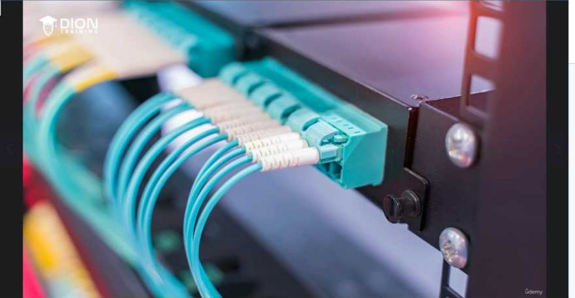

*   **Miễn nhiễm với nhiễu điện từ (EMI):** Trong các trung tâm dữ liệu hoặc các môi trường sản xuất có máy móc hạng nặng, cáp đồng dễ bị ảnh hưởng bởi nhiễu sóng điện từ, làm sụt giảm tốc độ hoặc gây mất gói tin. Vì sợi quang truyền tín hiệu bằng ánh sáng, nó hoàn toàn không bị ảnh hưởng bởi môi trường nhiễu điện từ.
*   **Tiêu chuẩn bảo mật:** Trong các môi trường đòi hỏi bảo mật cao, cáp đồng có thể phát ra bức xạ điện từ mà kẻ gian có thể dùng thiết bị để thu thập (sniffing). Sợi quang không phát ra bức xạ như vậy, khiến nó trở thành lựa chọn an toàn hơn rất nhiều cho việc truyền tải dữ liệu nhạy cảm.

### Tổng kết tư duy chọn lựa
Việc quyết định sử dụng loại cáp nào được đúc kết lại qua một bộ lọc đơn giản:

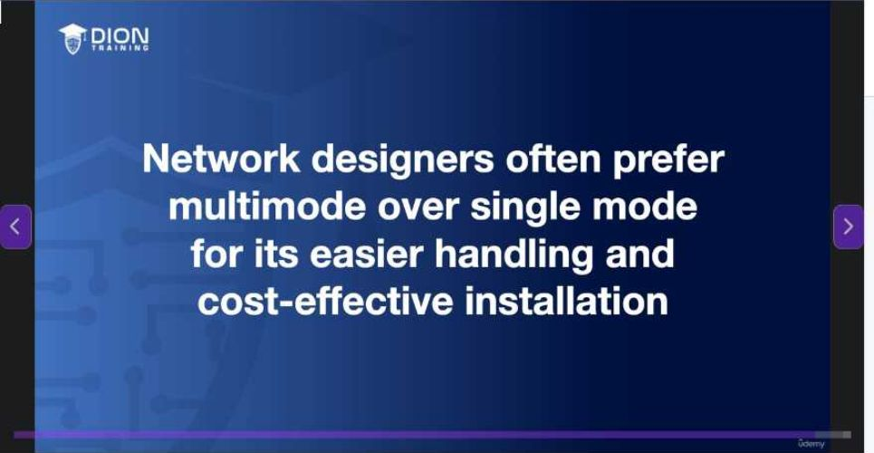

*   **Khoảng cách < 2km:** Luôn ưu tiên MMF vì tiết kiệm, dễ lắp đặt và đủ mạnh cho nhu cầu nội bộ.
*   **Khoảng cách > 2km hoặc môi trường đặc biệt:** Chuyển hướng sang SMF để đảm bảo tín hiệu không bị tán xạ và duy trì băng thông lớn trên khoảng cách xa.

Sự phân chia này giúp các kỹ sư tối ưu hóa được cả bài toán kinh tế lẫn bài toán kỹ thuật trong suốt vòng đời của hệ thống mạng.

---

## 🎯 Bí Kíp Ôn Thi Tốc Độ

### 1. Fiber vs. Copper (So sánh nhanh)
*   **Fiber (Cáp quang):** Truyền bằng **ánh sáng** (LED/Laser).
*   **Copper (Cáp đồng):** Truyền bằng **xung điện**.
*   **Ưu điểm Fiber:**
    *   **Miễn nhiễm EMI:** Không bị nhiễu điện từ.
    *   **Khoảng cách:** Rất xa (hàng trăm dặm).
    *   **Tốc độ:** Cực cao (có thể đạt Petabit/giây).
*   **Nhược điểm Fiber:** **Chi phí cao**, đòi hỏi **kỹ thuật chuyên môn** và công cụ đắt tiền.

### 2. Hai loại cáp quang cốt lõi
| Đặc điểm | Single-Mode (SMF) | Multi-Mode (MMF) |
| :--- | :--- | :--- |
| **Đường truyền** | 1 đường (Single path) | Nhiều đường (Multiple paths) |
| **Kích thước lõi** | Nhỏ (8.3 - 10 microns) | Lớn (50 - 100 microns) |
| **Khoảng cách** | Rất xa (hàng trăm dặm) | Ngắn (< 2 km / 2000m) |
| **Ứng dụng** | Backbone, đường truyền xuyên lục địa | LAN, Data center, kết nối thiết bị |
| **Chi phí** | Đắt hơn | Rẻ hơn (dễ sản xuất) |
| **Màu nhận diện** | **Vàng (Yellow)** | **Aqua/Cam (Orange/Aqua)** |

### 3. Từ khóa "Vàng" cần nhớ
*   **EMI (Electromagnetic Interference):** Fiber hoàn toàn miễn nhiễm; Copper cần bọc chống nhiễu.
*   **Dispersion (Tán sắc):** Nguyên nhân chính gây suy giảm tín hiệu trong cáp quang.
*   **Bottleneck:** Tốc độ mạng hiện nay bị giới hạn bởi **thiết bị (router/switch)**, không phải do cáp.
*   **Kỹ thuật:** Fiber đòi hỏi kỹ năng hàn/bấm chuyên dụng, chi phí lắp đặt gấp **5-10 lần** so với đồng.
*   **Mẹo thi:** Nhìn màu dây -> **Vàng** (Single/Xa), **Cam/Aqua** (Multi/Gần).

---
*Ghi chú: 27 hình ảnh minh họa (.jpg) đã được tải về và lưu tự động vào thư mục con `image/` cùng cấp với file này. Để ảnh hiển thị tự động, hãy đảm bảo bạn sao chép cả thư mục `image/` nếu bạn muốn di chuyển file markdown sang nơi khác!*
