# Fiber Network Connections

### Phân tích chi tiết: Kết nối mạng cáp quang và các loại đầu nối (Phần 1)

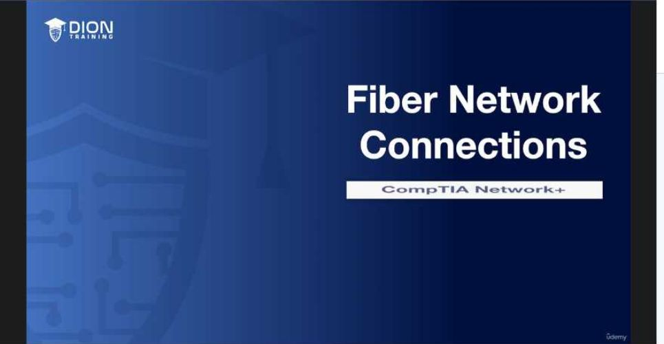

**Khái niệm cơ bản về kết nối mạng cáp quang**
Một kết nối mạng cáp quang (fiber network connection) về bản chất là việc thiết lập một cầu nối truyền dẫn ánh sáng giữa hai thiết bị mạng. Thay vì sử dụng tín hiệu điện trên dây đồng, cáp quang sử dụng các xung ánh sáng để truyền tải dữ liệu. Để kết nối vật lý, chúng ta cần một sợi cáp quang dẫn truyền tín hiệu từ điểm A đến điểm B. Tuy nhiên, thay vì hàn nối trực tiếp (splicing) – một kỹ thuật cố định, khó thay đổi và đòi hỏi trình độ kỹ thuật cao – người ta sử dụng các đầu nối (connectors). Đầu nối giúp việc kết nối và ngắt kết nối trở nên linh hoạt, nhanh chóng và dễ dàng bảo trì trong môi trường hạ tầng mạng thay đổi liên tục.

**Cấu trúc truyền và nhận (Transmit & Receive)**
Trong hầu hết các hệ thống cáp quang, một kết nối đơn lẻ không thể thực hiện đồng thời việc gửi và nhận dữ liệu trên cùng một lõi sợi quang (trừ các công nghệ WDM đặc biệt). Do đó, chúng ta cần hai sợi quang: một cho chiều truyền (Transmit - Tx) và một cho chiều nhận (Receive - Rx). 

Để cấu thành một đường truyền hoàn chỉnh, bạn có hai phương án:
1. **Cáp đơn (Simplex):** Bạn dùng hai sợi cáp riêng biệt, mỗi đầu sợi có một connector. Bạn nối đầu Tx của thiết bị này với đầu Rx của thiết bị kia và ngược lại.

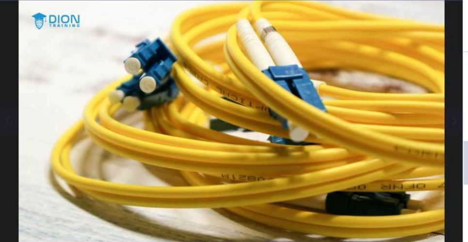

2. **Cáp đôi (Duplex):** Nhiều nhà sản xuất đóng gói hai lõi sợi quang vào chung một lớp vỏ bảo vệ (cable jacket). Khi đó, mỗi đầu cáp sẽ có một cụm hai connector, cho phép bạn cắm trực tiếp vào cổng Tx và Rx của thiết bị một cách gọn gàng và tránh nhầm lẫn.

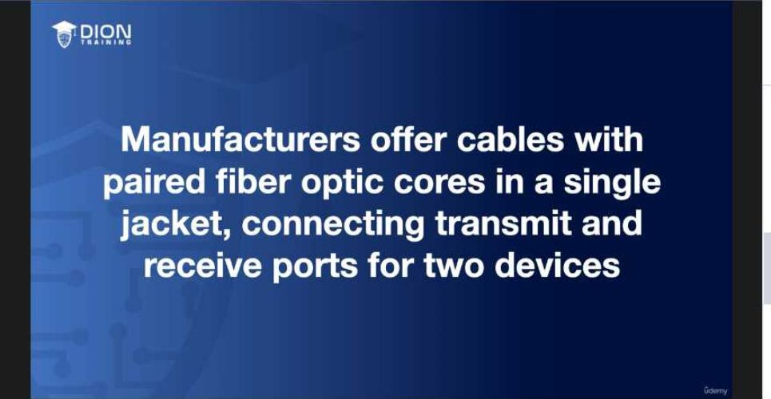

> **💡 Ví dụ nhớ đời:** Hãy tưởng tượng sợi cáp quang giống như một con đường một chiều. Bạn không thể vừa đi vào vừa đi ra trên cùng một làn đường mà không gây ra va chạm (xung đột dữ liệu). Vì vậy, hệ thống cáp quang giống như một đường cao tốc có hai làn riêng biệt: làn đi (Transmit) và làn về (Receive). Nếu bạn cắm nhầm Tx vào Tx, dữ liệu sẽ giống như hai chiếc xe đâm đầu vào nhau – không có luồng thông tin nào được truyền đi cả.

**Sự đa dạng của các loại đầu nối (Connectors)**
Thế giới mạng hiện đại sử dụng nhiều loại đầu nối chuyên dụng như SC, LC, ST, MTRJ và MPO, mỗi loại có thiết kế vật lý riêng biệt phù hợp với các ứng dụng khác nhau về độ bền, kích thước và suy hao tín hiệu.

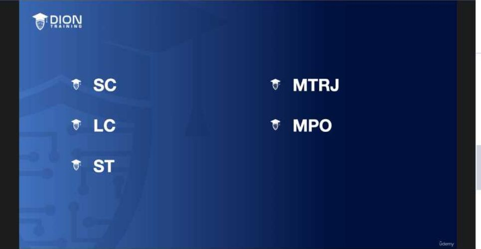

**Phân tích chuyên sâu về đầu nối SC (Subscriber Connector)**
Đầu nối SC là một trong những chuẩn phổ biến và quan trọng nhất trong hạ tầng mạng hiện nay. 

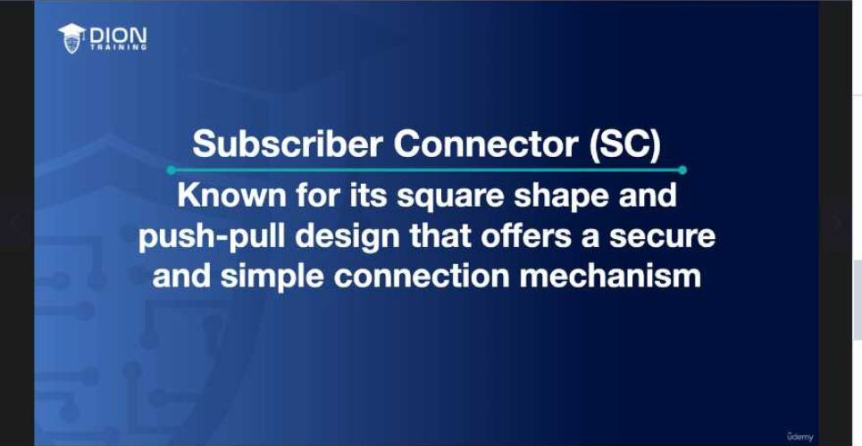

- **Thiết kế hình học:** Đặc điểm nhận dạng là hình dạng hình vuông và cơ chế "push-pull" (đẩy và kéo).
- **Cơ chế vận hành:** Điểm đặc biệt của SC là thiết kế khóa "lẫy" chắc chắn. Bạn chỉ cần cắm thẳng vào cổng (stick) cho đến khi nghe tiếng "tách" (click). Cơ chế này mô phỏng sự tiện lợi của đầu nối RJ-45 trên dây mạng Ethernet (dây đồng), giúp kỹ thuật viên thao tác nhanh mà không cần vặn xoắn phức tạp.

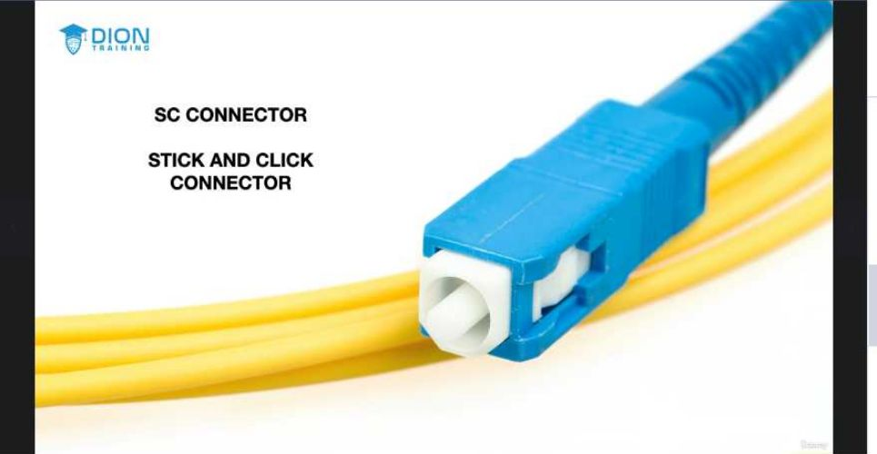

- **Tại sao chọn SC?** 
    - **Độ chính xác cao:** SC được thiết kế để căn chỉnh lõi sợi quang với độ chính xác tuyệt vời, giúp giảm thiểu tối đa hiện tượng tán xạ và suy hao tín hiệu tại điểm kết nối. Điều này khiến nó trở thành "người bạn đồng hành" lý tưởng cho sợi quang đơn mode (single-mode fiber) – loại cáp dùng cho truyền dẫn khoảng cách xa.
    - **Độ bền:** Cấu trúc vỏ cứng cáp giúp nó chịu được nhiều lần cắm/rút mà không bị biến dạng, phù hợp cho các môi trường từ trung tâm dữ liệu cho đến các tủ cáp ngoài trời.

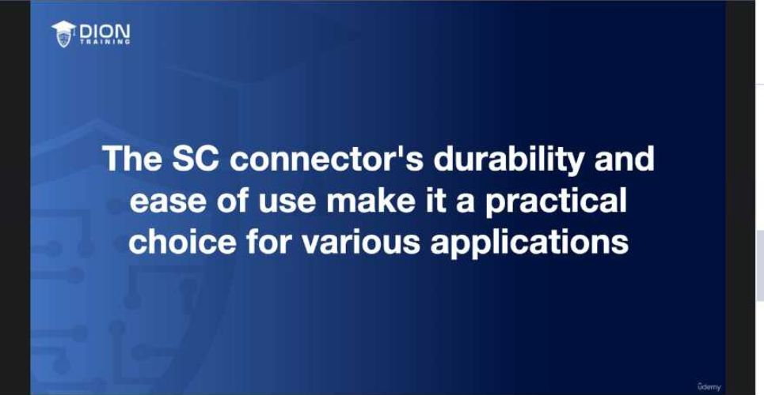

**Ứng dụng thực tế: Fiber to the Home (FTTH)**
Đầu nối SC đóng vai trò chủ chốt trong triển khai FTTH (cáp quang đến tận nhà). Khi nhà cung cấp dịch vụ Internet (ISP) triển khai mạng lưới đến từng hộ gia đình, họ cần một kết nối vừa đảm bảo độ ổn định cao (do chạy đơn mode), vừa phải dễ dàng lắp đặt cho kỹ thuật viên hiện trường. SC đáp ứng hoàn hảo các yêu cầu này: dễ bấm, dễ cắm, tin cậy và đảm bảo tín hiệu Internet không bị gián đoạn do suy hao tại điểm nối.

> **💡 Ví dụ nhớ đời:** Hãy coi đầu nối SC như một chiếc "khóa chốt an toàn" của cửa nhà. Khi bạn đẩy nó vào, chiếc lẫy tự động bật ra và giữ chặt lấy cái chốt cửa (cổng quang). Bạn không cần phải vặn vít hay xoay nắp như các loại đầu nối ST cũ kỹ, chỉ cần nghe thấy tiếng "tách" giòn tan là bạn có thể yên tâm rằng kết nối đã được khóa chặt, dù có rung lắc hay va chạm nhẹ, đường truyền vẫn không hề bị đứt quãng.

Tiếp nối các loại kết nối cơ bản, chúng ta sẽ đi sâu vào các chuẩn kết nối chuyên dụng, tập trung vào khả năng tối ưu hóa không gian và độ bền cơ học trong các môi trường đặc thù.

### 1. Lucent Connector (LC Connector) – "Vị vua" của mật độ kết nối
LC connector (còn được gọi là Lucent Connector hoặc Little Connector) là giải pháp tối ưu cho những nơi "tấc đất tấc vàng" như các trung tâm dữ liệu (data centers). 

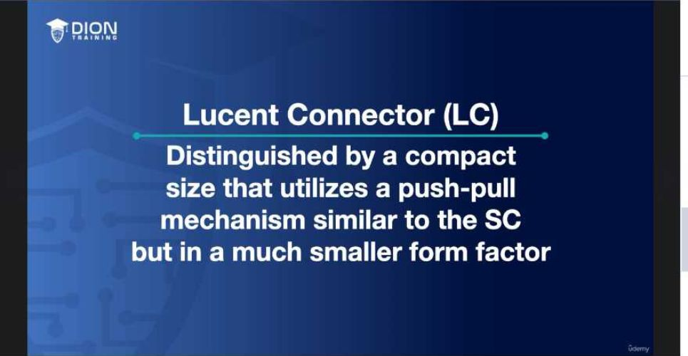

*   **Cơ chế Push-Pull thu nhỏ:** Nếu SC sử dụng cơ chế "stick and click" với kích thước khá lớn, thì LC mô phỏng lại cơ chế push-pull đó trong một hình thái nhỏ gọn hơn nhiều. Điều này cho phép các kỹ sư mạng lắp đặt được nhiều cổng kết nối hơn trên cùng một diện tích bảng điều khiển (patch panel) hoặc trên mặt trước của các bộ chuyển mạch (switches).
*   **Cấu trúc cặp đôi:** LC thường được xuất xưởng dưới dạng một cặp cáp dính liền. Người giảng bài ví von đây là "love connector" vì các đầu nối transmit (truyền) và receive (nhận) luôn được giữ chặt với nhau bằng một kẹp nhựa. Tuy nhiên, tính linh hoạt vẫn được đảm bảo: nếu thiết bị của bạn có cấu hình cổng đặc biệt, bạn hoàn toàn có thể tách rời chúng ra để kết nối độc lập.

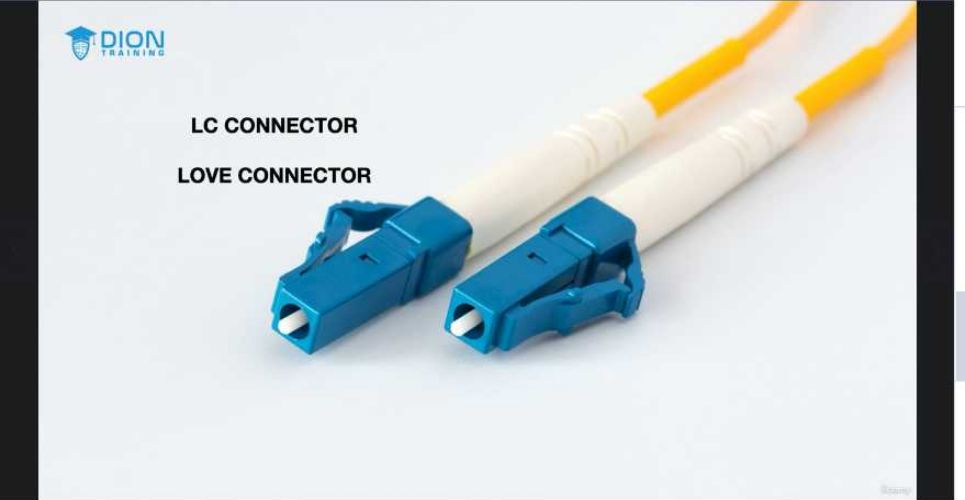

*   **Độ chính xác:** Nhờ thiết kế nhỏ và độ chính xác cực cao trong việc căn chỉnh lõi cáp, LC giúp giảm thiểu đáng kể suy hao tín hiệu (signal loss), vốn là yêu cầu sống còn đối với các ứng dụng tốc độ cao hiện nay.

> **💡 Ví dụ nhớ đời:** Hãy tưởng tượng các đầu nối SC giống như những chiếc ghế bành rộng rãi, thoải mái trong một phòng chờ (phù hợp nơi không gian rộng). Còn các đầu nối LC giống như những chiếc ghế hạng phổ thông trên máy bay: được thiết kế cực kỳ nhỏ gọn, tối ưu hóa chỗ ngồi để bạn có thể nhồi nhét thật nhiều hành khách (cổng mạng) vào cùng một khoang máy bay (switch) mà vẫn đảm bảo tính an toàn và hiệu năng.

### 2. Straight Tip Connector (ST Connector) – "Pháo đài" chống rung lắc

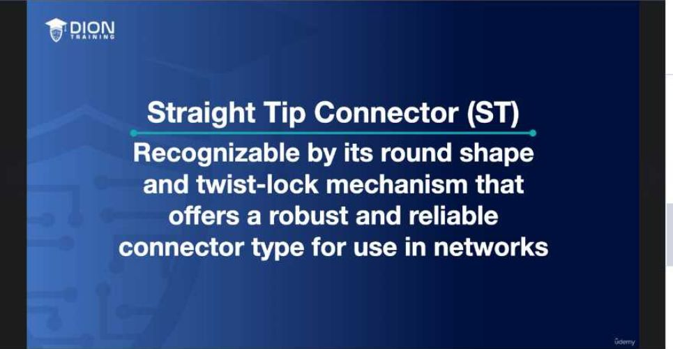

Nếu LC đại diện cho sự tinh tế và mật độ cao, thì ST connector (Straight Tip) lại đại diện cho sự bền bỉ và cơ chế khóa cứng cáp.

*   **Cơ chế Twist-Lock:** Đặc điểm nhận dạng của ST là hình dáng hình trụ tròn và cơ chế "xoay để khóa". Người giảng bài gọi vui đây là "stick and twist" (cắm vào và xoắn). Bạn đẩy đầu cáp vào cổng và xoay nhẹ để các ngàm khóa khớp vào nhau, giữ chặt connector tại chỗ.

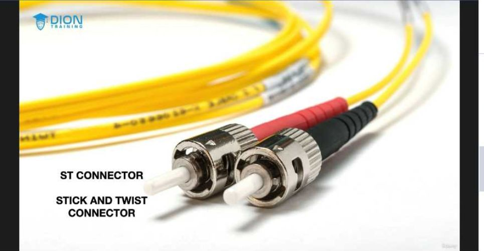

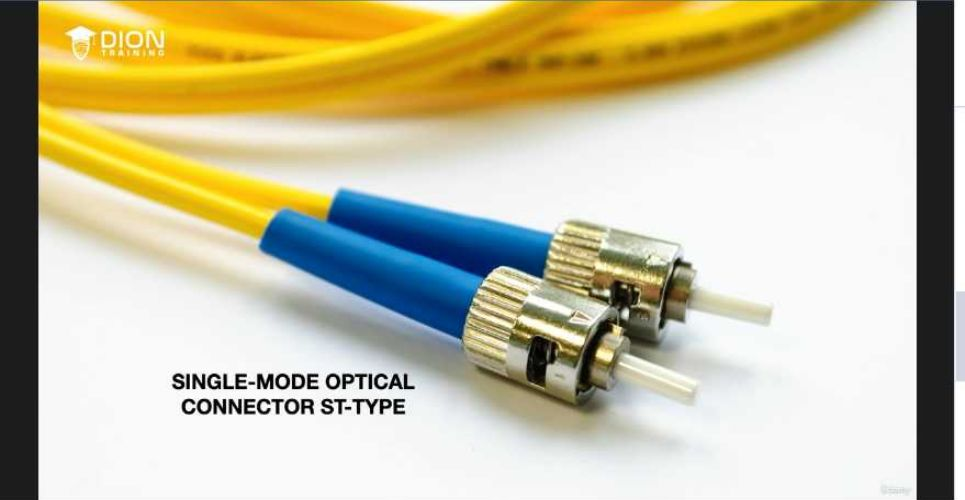

*   **Sự tương đồng với cáp đồng trục:** Cơ chế này hoạt động tương tự như đầu nối BNC (thường thấy trên cáp đồng trục hoặc các thiết bị đo lường), tạo ra một liên kết vật lý rất khó bị lỏng lẻo do tác động bên ngoài.
*   **Ứng dụng thực tế:** Vì độ bền vật lý vượt trội, ST connector là lựa chọn hàng đầu cho các môi trường có độ rung lắc hoặc di chuyển cao. Trong các khuôn viên trường đại học hoặc các khu công nghiệp có các tòa nhà cách nhau vài trăm mét, nơi cáp có thể chịu tác động rung từ máy móc hoặc gió bụi ngoài trời, ST trở thành "vệ sĩ" bảo vệ đường truyền ổn định. 
*   **Lịch sử:** Được phát triển bởi AT&T, ST đã trở thành chuẩn mực cho các loại cáp quang đa mode (multi-mode) trong suốt một thời gian dài trước khi các chuẩn nhỏ gọn hơn như LC lên ngôi.

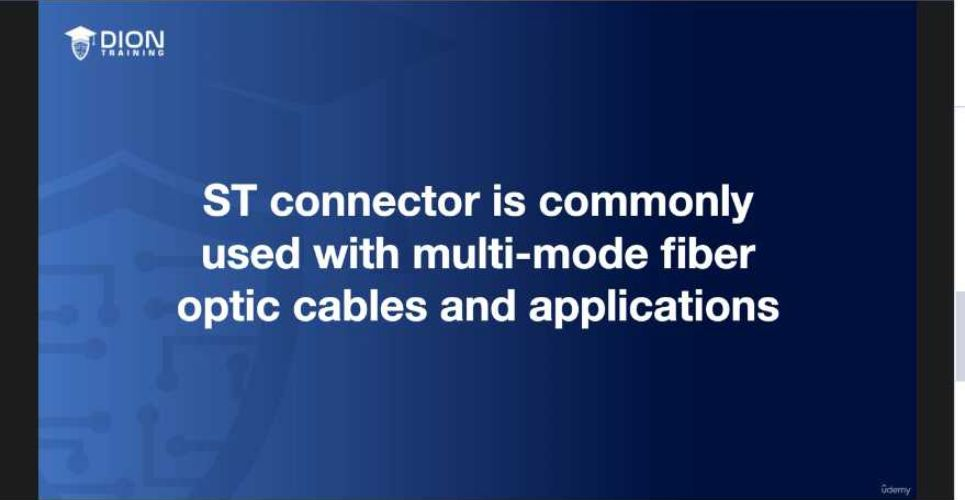

> **💡 Ví dụ nhớ đời:** Bạn hãy hình dung ST connector giống như một chiếc khóa nắp chai nước ngọt. Bạn không thể chỉ ấn mạnh là xong, mà phải ấn và xoay đúng khớp thì nắp mới đóng chặt. Dù có ai đó va chạm hay rung lắc chai nước, nắp vẫn sẽ nằm yên tại vị trí đó, không bao giờ bị bung ra một cách tình cờ. Đó chính là lý do ST connector là lựa chọn số 1 cho những khu vực "không yên tĩnh" về mặt cơ học.

Tiếp nối đặc tính bền bỉ của đầu nối ST (Straight Tip) đã đề cập trước đó, khả năng chịu đựng môi trường khắc nghiệt như gió, mưa, tuyết khiến ST trở thành lựa chọn ưu việt cho các ứng dụng ngoài trời (outdoor). Sự kết hợp giữa quy trình lắp đặt đơn giản và độ tin cậy cao giúp ST duy trì được kết nối mạng ổn định ngay cả khi phải đối mặt với các yếu tố ngoại cảnh gây suy hao tín hiệu.

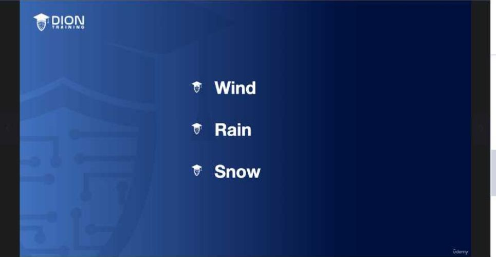

### 1. Đầu nối MTRJ (Mechanical Transfer Register Jack)
Đây là loại đầu nối thứ tư trong danh sách, đánh dấu bước tiến về tối ưu hóa không gian. Điểm đặc biệt nhất của MTRJ là thiết kế hình chữ nhật nhỏ gọn, tích hợp cả hai sợi quang (một truyền, một nhận) vào trong cùng một đầu nối duy nhất (Dual fiber connector).

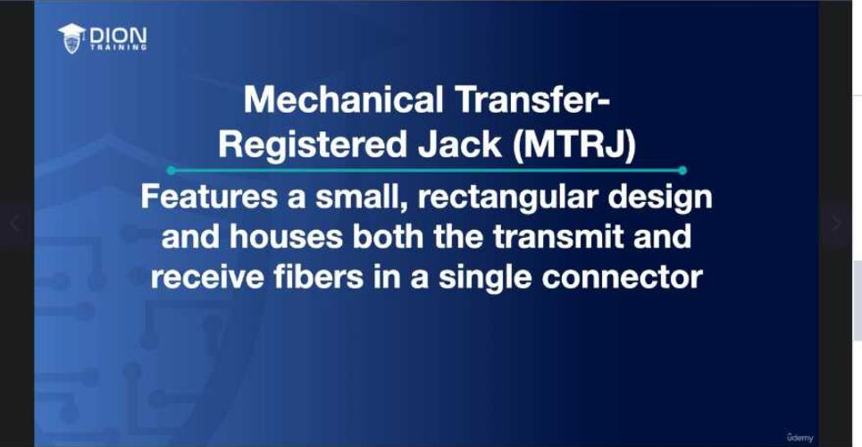

*   **Cơ chế hoạt động:** MTRJ sử dụng cơ chế chốt (latch) tương tự như chuẩn RJ45 của cáp đồng CAT6A. Điều này tạo ra sự quen thuộc cho các kỹ thuật viên mạng khi chuyển đổi từ hệ thống cáp đồng sang cáp quang.
*   **Môi trường ứng dụng:** MTRJ là "cứu cánh" cho những khu vực bị hạn chế về diện tích, chẳng hạn như các tủ mạng (network closet) sử dụng switch sợi quang 24 cổng, nơi việc cắm rút thủ công gặp nhiều khó khăn.
*   **Lợi ích kinh tế:** Việc ép hai sợi quang vào một đầu nối giúp giảm đáng kể mật độ thiết bị, từ đó tiết kiệm diện tích trên bảng điều khiển (patch panel) và tối ưu chi phí triển khai cho các hạ tầng mạng dày đặc.

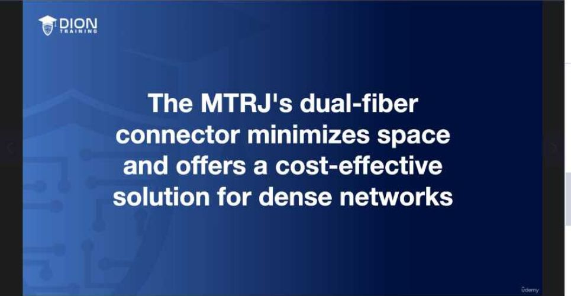

> **💡 Ví dụ nhớ đời:** Hãy tưởng tượng bạn đang đóng gói hành lý cho một chuyến đi dài. Thay vì mang hai chiếc vali riêng biệt cho đồ dùng truyền và nhận tín hiệu, MTRJ giống như một chiếc vali "hai ngăn" thông minh, vừa gọn gàng vừa tiết kiệm không gian, giúp bạn nhét thêm được nhiều đồ hơn vào ngăn chứa vốn dĩ đã chật chội.

### 2. Đầu nối MPO (Multi-fiber Push On)

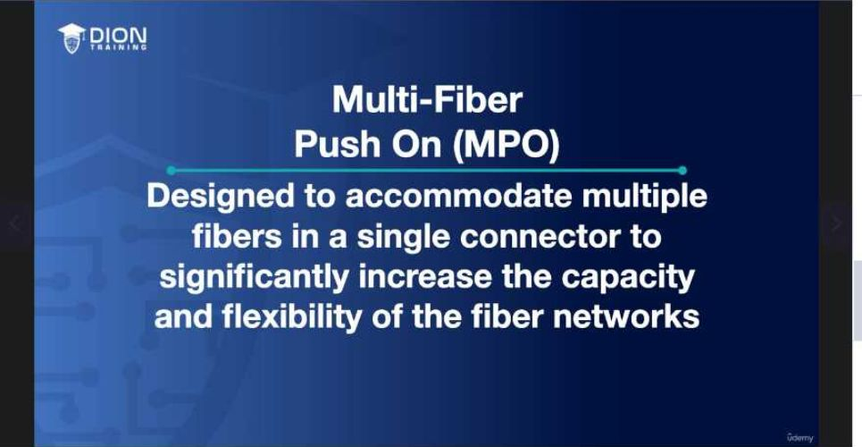

Đây là đầu nối thứ năm và cũng là loại có mật độ cao nhất trong danh sách. Nếu các đầu nối trước đó tập trung vào sự nhỏ gọn, thì MPO tập trung vào khả năng "đột phá về dung lượng".

*   **Khả năng kết nối:** Thay vì chỉ một hoặc hai sợi, MPO được thiết kế để chứa 12 sợi quang hoặc nhiều hơn trong một đầu nối duy nhất. Đây là chìa khóa để xử lý khối lượng dữ liệu khổng lồ.

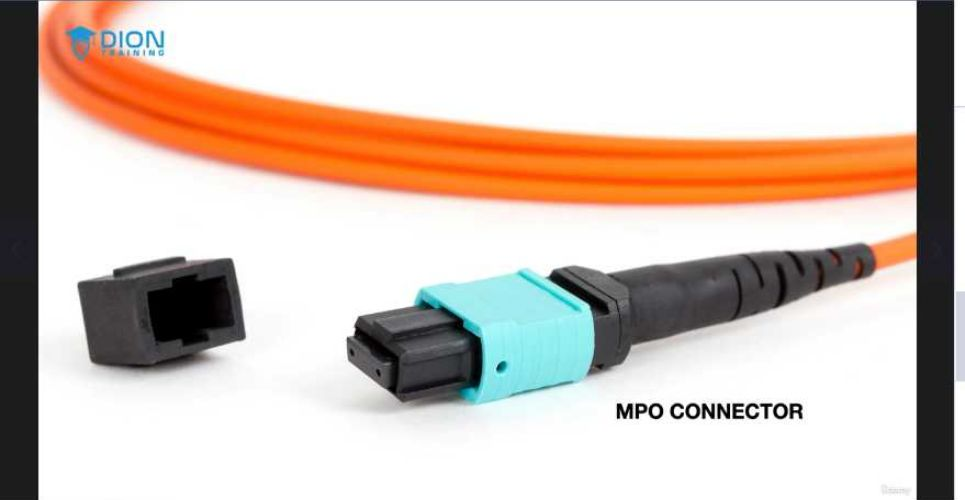

*   **Vai trò trong Trung tâm dữ liệu (Data Center):**
    *   **Backbone Cabling (Cáp trục chính):** MPO đóng vai trò như "tuyến cao tốc" chính giữa các dãy thiết bị. Nhờ khả năng truyền dẫn nhiều sợi đồng thời, MPO giúp giảm đáng kể thời gian lắp đặt so với việc phải bấm từng đầu nối đơn lẻ.
    *   **Kết nối tốc độ cao:** Trong kiến trúc trung tâm dữ liệu hiện đại, MPO là thành phần thiết yếu để kết nối giữa các switch hoặc server hiệu năng cao, nơi mà tốc độ truyền tải và khả năng mở rộng là ưu tiên hàng đầu.
*   **Tính hiệu quả:** MPO tối ưu hóa hạ tầng bằng cách giảm thiểu số lượng cáp cần quản lý, giúp các kỹ sư mạng dễ dàng thực hiện các thay đổi hoặc bảo trì mà không gây rối loạn cấu trúc hệ thống.

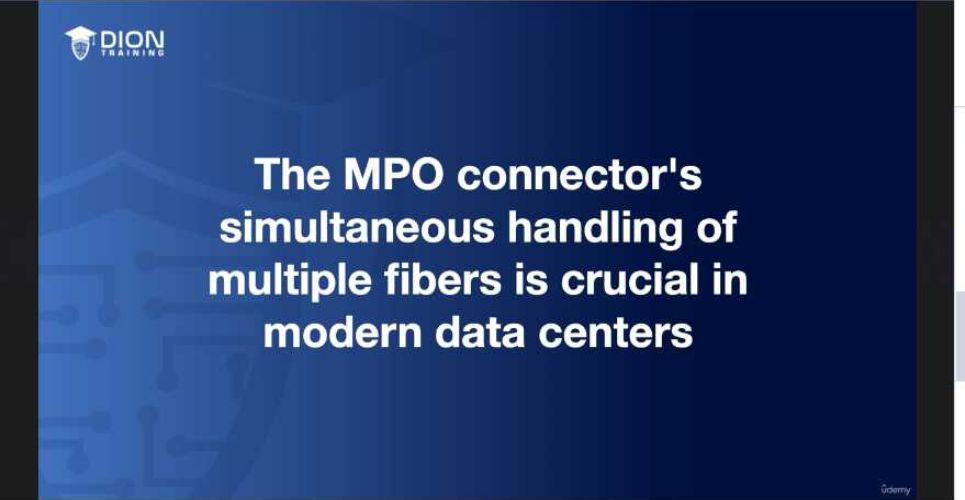

> **💡 Ví dụ nhớ đời:** Nếu các đầu nối đơn lẻ như LC hay ST giống như những chiếc xe máy chở 1-2 người, thì MPO chính là một chiếc xe buýt nhiều tầng. Thay vì phải huy động hàng chục chiếc xe máy chạy cùng lúc trên đường (gây tắc nghẽn và tốn thời gian quản lý), chỉ cần một chiếc xe buýt MPO là có thể vận chuyển khối lượng dữ liệu tương đương với 12 người (12 sợi quang) đi cùng một lúc, vô cùng hiệu quả và tiết kiệm không gian hạ tầng.

Bên cạnh các yếu tố vật lý như kiểu dáng đầu nối, một yếu tố kỹ thuật mang tính quyết định đến chất lượng truyền dẫn quang là **công nghệ đánh bóng (polishing)** mặt tiếp xúc của sợi cáp. Việc đánh bóng này không nhằm mục đích làm đẹp, mà nhằm kiểm soát hiện tượng **phản xạ ngược (back reflection)**.

### 1. Bản chất của phản xạ ngược (Back Reflection)
Trong hệ thống truyền dẫn quang, lý tưởng nhất là toàn bộ ánh sáng từ thiết bị phát sẽ đi thẳng đến thiết bị thu. Tuy nhiên, khi ánh sáng đi qua điểm kết nối, một phần tín hiệu không đi tiếp mà bị dội ngược trở lại nguồn phát (transmitter). Hiện tượng này giống như việc bạn hét vào một bức tường đá và nghe tiếng vang vọng lại – tiếng vang đó chính là "nhiễu" làm suy giảm chất lượng tín hiệu gốc. Để mạng hoạt động ổn định, việc tối thiểu hóa phản xạ ngược là bắt buộc.

> **💡 Ví dụ nhớ đời:** Hãy tưởng tượng bạn đang dùng đèn pin chiếu ánh sáng qua một tấm kính dày. Nếu mặt kính nhẵn bóng và phẳng lì, ánh sáng sẽ đi qua tốt. Nhưng nếu mặt kính bị mờ hoặc có các khe nứt li ti, một phần ánh sáng sẽ bị dội ngược lại vào mắt bạn. Hiện tượng "dội ngược" này chính là kẻ thù làm giảm hiệu suất truyền tải dữ liệu của mạng cáp quang.

### 2. Các cấp độ đánh bóng (Polishing Styles)

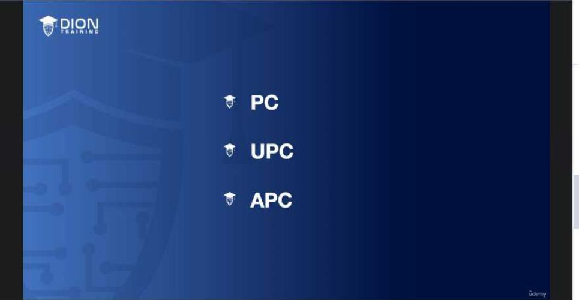

Việc lựa chọn kiểu đánh bóng (PC, UPC, hay APC) là sự đánh đổi giữa hiệu năng, độ phức tạp kỹ thuật và chi phí đầu tư.

#### A. PC (Physical Contact) - Tiếp xúc vật lý
Đây là kiểu đánh bóng cơ bản nhất với mặt tiếp xúc có độ cong nhẹ. Thiết kế này giúp hai sợi quang ép vào nhau tốt hơn so với mặt cắt phẳng hoàn toàn.
*   **Đặc điểm:** Giảm được một phần phản xạ ngược nhưng hiệu quả không cao.

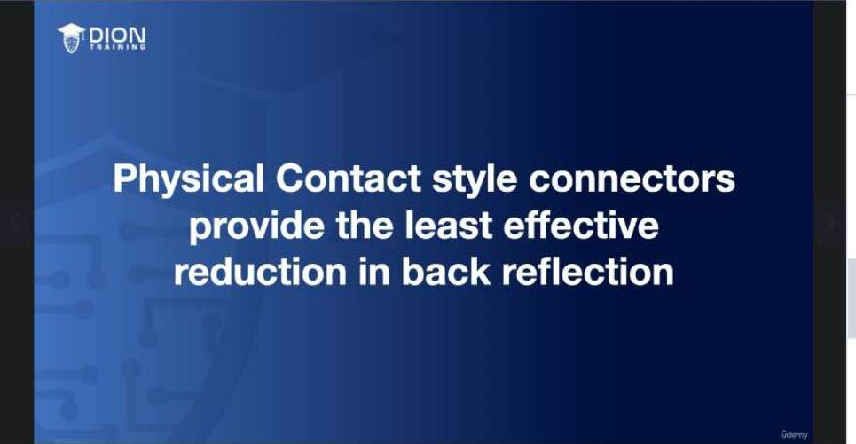

*   **Ứng dụng:** Phù hợp cho các mạng có khoảng cách truyền ngắn hoặc tốc độ truyền tải thấp, nơi mà yêu cầu về độ chính xác tín hiệu không quá khắt khe như điện thoại hoặc mạng nội bộ đơn giản.

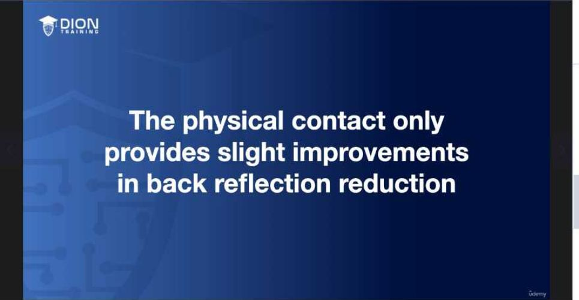

#### B. UPC (Ultra Physical Contact) - Tiếp xúc vật lý siêu cấp
UPC là phiên bản cải tiến của PC. Bằng cách thay đổi độ cong của bề mặt tiếp xúc (giống như một vòm cầu nhỏ), UPC đảm bảo lõi sợi quang (core) căn chỉnh chính xác hơn.
*   **Đặc điểm:** Giảm phản xạ ngược tốt hơn nhiều so với PC. Đây được coi là tiêu chuẩn cân bằng "vàng" giữa chi phí và chất lượng.

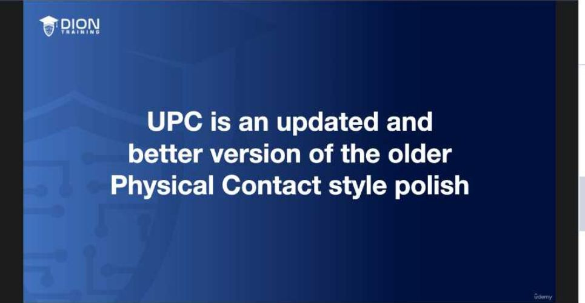

*   **Ứng dụng:** Phổ biến nhất trong các dịch vụ băng thông rộng, truyền dẫn video và dữ liệu nói chung. Nếu bạn không có yêu cầu đặc biệt khắt khe về độ trễ hay khoảng cách, UPC là lựa chọn tiêu chuẩn.

#### C. APC (Angled Physical Contact) - Tiếp xúc vật lý góc chéo
Đây là giải pháp công nghệ cao nhất trong ba loại. Thay vì đánh bóng vuông góc, mặt tiếp xúc được mài vát một góc 8 độ.
*   **Đặc điểm:** Việc tạo góc 8 độ buộc ánh sáng phản xạ bị dội ra khỏi hướng đi của sợi quang (thay vì dội ngược thẳng vào nguồn phát), từ đó đạt được độ phản xạ ngược thấp nhất trong các loại.
*   **Ứng dụng:** Thiết yếu cho các hệ thống đòi hỏi độ tin cậy tuyệt đối và băng thông cực lớn.

> **💡 Ví dụ nhớ đời:** Hãy hình dung bạn đứng dưới một lòng chảo hình tròn (tượng trưng cho bề mặt PC/UPC). Khi bạn ném bóng vào đáy chảo, quả bóng sẽ nảy thẳng ngược lại tay bạn. Nhưng nếu bạn nghiêng bề mặt đó đi một góc (tượng trưng cho APC), quả bóng khi rơi xuống sẽ bị bật sang hướng khác, không bao giờ quay lại vị trí bạn đứng. Góc 8 độ chính là cái "độ nghiêng" thông minh giúp triệt tiêu nhiễu phản xạ.

### 3. Tầm quan trọng của việc lựa chọn đúng loại
Việc cân nhắc kỹ thuật đánh bóng không chỉ dừng lại ở hiệu suất mạng mà còn ảnh hưởng trực tiếp đến chi phí. Việc sử dụng APC ở mọi nơi là không cần thiết nếu chi phí đó không mang lại giá trị gia tăng tương xứng. Ngược lại, việc chọn nhầm loại PC cho một hệ thống truyền dẫn cáp quang đường dài tốc độ cao có thể dẫn đến việc mạng liên tục gặp sự cố mất tín hiệu hoặc lỗi bit do phản xạ ngược. Tùy thuộc vào yêu cầu của dự án (độ dài tuyến cáp, dung lượng dữ liệu, loại hình dịch vụ), người kỹ sư phải tính toán sự phối hợp giữa loại đầu nối (SC, LC, MPO...) và kỹ thuật đánh bóng để đạt được hiệu quả kinh tế - kỹ thuật tối ưu.

Trong các hệ thống cáp quang đường dài (long haul) như mạng lưới cáp quang xuyên đại dương, việc giảm thiểu suy hao tín hiệu là yếu tố sống còn. Tại đây, mặc dù các đầu nối chuẩn APC có chi phí cao hơn so với PC hoặc UPC, nhưng sự đầu tư này hoàn toàn xứng đáng. Tín hiệu quang khi truyền đi quãng đường hàng ngàn kilomet sẽ bị suy giảm liên tục, do đó, khả năng triệt tiêu phản xạ ngược (back reflection) của APC trở thành "lá chắn" bảo vệ chất lượng dữ liệu.

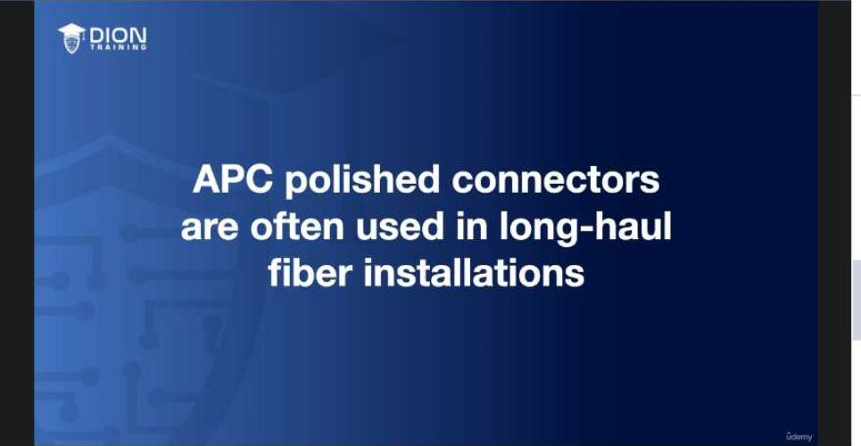

> **💡 Ví dụ nhớ đời:** Hãy hình dung việc gửi tín hiệu ánh sáng qua cáp quang giống như việc bạn đang cố gắng nói chuyện trong một đường ống dài. Nếu đường ống bị phản xạ âm thanh quá nhiều (phản xạ ngược), tiếng vang sẽ khiến người nghe không thể hiểu được nội dung gốc. APC giống như một tấm tiêu âm được đặt góc 8 độ ở cuối ống, đảm bảo rằng mọi âm thanh bạn phát đi đều đi thẳng ra ngoài thay vì dội ngược lại làm nhiễu chính giọng nói của bạn.

Việc hiểu và lựa chọn đúng loại đầu nối là nền tảng của kỹ thuật mạng chuyên nghiệp. Dưới đây là bảng phân tích chi tiết các tiêu chuẩn đầu nối phổ biến:

*   **SC (Subscriber Connector):** Được nhận diện bởi hình dáng vuông vức và cơ chế "đẩy-kéo" (push-pull). Đây là thiết kế tối ưu cho các môi trường đòi hỏi thao tác nhanh nhưng vẫn cần độ ổn định cao. Tính "secure" (bảo mật/chắc chắn) ở đây được hiểu là khả năng bám giữ cơ học tốt, hạn chế việc cáp bị tuột do va chạm vật lý.
*   **LC (Lucent Connector):** Có thể coi đây là "phiên bản thu nhỏ" của SC. Với kích thước compact, nó cho phép mật độ kết nối cao hơn trên cùng một bảng điều khiển (patch panel). Cơ chế vẫn là push-pull, nhưng sự tinh gọn của nó là chìa khóa cho các thiết bị mạng đời mới có không gian cổng kết nối hạn chế.
*   **ST (Straight Tip):** Nổi bật với thiết kế hình tròn và cơ chế "khóa xoay" (twist-lock) giống như jack cắm BNC trong thiết bị truyền hình. Sự chắc chắn này biến ST thành một lựa chọn "nồi đồng cối đá", rất phù hợp cho những môi trường mạng công nghiệp hoặc nơi cần sự kết nối bền bỉ, tránh việc rung lắc làm mất kết nối vật lý.
*   **MTRJ (Mechanical Transfer Register Jack):** Điểm đặc biệt của loại này là kiến trúc "2 trong 1". Thay vì phải dùng hai sợi riêng biệt cho thu và phát, MTRJ gom cả hai vào một đầu nối hình chữ nhật duy nhất. Đây là bước tiến lớn trong việc tiết kiệm không gian và giảm thiểu lỗi cắm nhầm chiều của kỹ thuật viên.
*   **MPO (Multi-fiber Push On):** Đây là "ông trùm" về mật độ. MPO không chỉ chứa một mà là hàng chục sợi quang trong một đầu nối. Khi hệ thống mạng cần băng thông cực lớn (như trong các Data Center hiện đại), việc sử dụng MPO giúp tăng dung lượng mạng một cách đột biến mà không cần phải chạy thêm hàng tá sợi cáp đơn lẻ, từ đó gia tăng tính linh hoạt và khả năng mở rộng (scalability) của hệ thống.

Về mặt công nghệ đánh bóng (polishing), sự tiến hóa của chúng là sự đánh đổi giữa hiệu suất và độ phức tạp:
1.  **PC (Physical Contact):** Chỉ là điểm khởi đầu, cải thiện nhẹ so với cắt phẳng.
2.  **UPC (Ultra Physical Contact):** Đưa bề mặt tiếp xúc thành dạng vòm (dome-like), giúp các lõi sợi quang "chạm" nhau chính xác hơn, giảm nhiễu tốt hơn.
3.  **APC (Angled Physical Contact):** Sử dụng góc nghiêng 8 độ. Đây là "đỉnh cao" hiện tại để chặn đứng hiện tượng phản xạ ngược, giúp tín hiệu đi xa mà không bị "hồi quang" quay lại làm suy yếu transmitter.

Tóm lại, vai trò của một kỹ thuật viên mạng hiện đại không chỉ là cắm cáp, mà là sự hiểu biết sâu sắc về sự kết hợp giữa các kiểu đầu nối (SC, LC, ST, MTRJ, MPO) và các kỹ thuật đánh bóng (PC, UPC, APC). Việc chọn đúng loại chuẩn cho từng mục đích sử dụng—từ mạng văn phòng ngắn hạn đến đường truyền xuyên quốc gia—sẽ quyết định trực tiếp đến hiệu suất, tính hiệu quả và độ bền của toàn bộ hạ tầng mạng mà bạn quản lý.

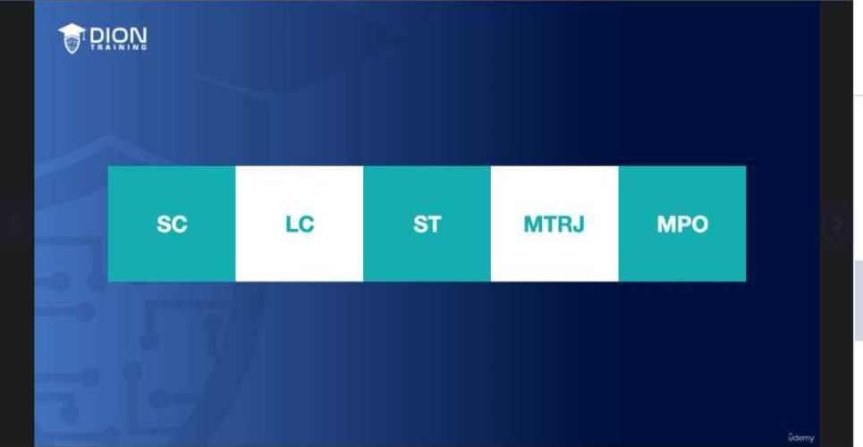

---

## 🎯 Bí Kíp Ôn Thi Tốc Độ

### 1. Các loại Fiber Connectors (Đầu nối)
*   **SC (Subscriber Connector):** "Stick & Click" (hình vuông, đẩy-kéo). Dùng cho **Single-mode**, mạng **FTTH**.
*   **LC (Lucent Connector):** "Love Connector" (nhỏ gọn, đẩy-kéo). Dùng cho **mật độ cao (Data centers)**, tiết kiệm diện tích.
*   **ST (Straight Tip):** "Stick & Twist" (hình tròn, xoay khóa). Dùng cho **Multi-mode**, môi trường nhiều rung động, ngoài trời.
*   **MTRJ (Mechanical Transfer Registered Jack):** Hình chữ nhật, chứa **cả Tx/Rx** trong 1 đầu. Dùng cho LAN trong văn phòng, không gian hẹp.
*   **MPO (Multi-fiber Push On):** Chứa **nhiều sợi (>= 12)** trong 1 đầu. Dùng cho **Backbone**, tốc độ cao, quy mô lớn.

### 2. Các kiểu Polish (Độ đánh bóng - Giảm phản xạ ngược)
*Độ phản xạ ngược (Back reflection) càng thấp = Chất lượng tín hiệu càng cao.*

*   **PC (Physical Contact):** Mặt cắt phẳng, độ giảm phản xạ **thấp nhất**. Dùng cho mạng cơ bản/ngắn.
*   **UPC (Ultra Physical Contact):** Mặt cắt hình vòm (dome), **tốt hơn PC**. Dùng cho viễn thông, truyền hình, dữ liệu thông thường.
*   **APC (Angled Physical Contact):** Mặt cắt vát **8 độ**, **giảm phản xạ tốt nhất**. Dùng cho mạng đường dài (Long-haul), băng thông cực cao.

### 3. Mẹo nhớ nhanh
*   **Cơ chế:** 
    *   Đẩy-kéo: **SC, LC**.
    *   Xoay-khóa: **ST**.
*   **Ứng dụng:**
    *   Mật độ cao/Server: **LC, MTRJ, MPO**.
    *   Độ bền/Ngoài trời: **ST**.
*   **Đánh bóng:** 
    *   Thứ tự hiệu năng: **APC > UPC > PC**.
    *   Góc nghiêng: Chỉ có **APC (8 độ)**.

---
*Ghi chú: 26 hình ảnh minh họa (.jpg) đã được tải về và lưu tự động vào thư mục con `image/` cùng cấp với file này. Để ảnh hiển thị tự động, hãy đảm bảo bạn sao chép cả thư mục `image/` nếu bạn muốn di chuyển file markdown sang nơi khác!*
