# Understanding Network Transceivers

### Phân tích chi tiết: Khái niệm Transceiver và các giao thức mạng (Ethernet & Fiber Channel)

**1. Định nghĩa về Transceiver (Bộ thu phát)**
Thuật ngữ "transceiver" là sự kết hợp ngôn ngữ (portmanteau) giữa hai từ: *transmitter* (bộ phát) và *receiver* (bộ thu). Trong kỹ thuật mạng, đây là thiết bị có khả năng thực hiện đồng thời cả hai quá trình: phát đi tín hiệu dữ liệu và tiếp nhận tín hiệu dữ liệu. Nếu ví hệ thống mạng là một cuộc hội thoại, thì transceiver chính là "cái miệng" để nói và "đôi tai" để nghe. Nếu thiếu đi bộ phận này, một thiết bị mạng sẽ bị "câm" (chỉ gửi được) hoặc bị "điếc" (chỉ nhận được).

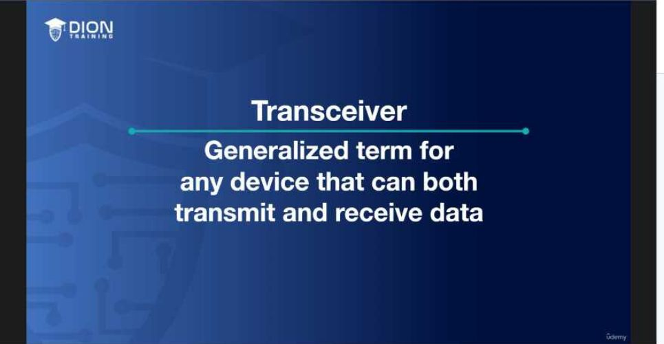

> **💡 Ví dụ nhớ đời:** Hãy tưởng tượng bạn đang sử dụng bộ đàm (walkie-talkie). Khi bạn nhấn nút để nói, bạn đang ở chế độ truyền (transmit). Khi bạn thả tay ra để chờ phản hồi từ người kia, bạn chuyển sang chế độ nhận (receive). Transceiver chuyên nghiệp trong mạng máy tính thực hiện việc này nhanh đến mức nó có thể xử lý cả hai chiều cùng lúc mà không cần phải nhấn nút hay tạm dừng.

**2. Vai trò của Giao thức (Protocol)**
Mỗi transceiver không làm việc một cách ngẫu nhiên. Nó hoạt động dựa trên một "giao thức". Giao thức được hiểu đơn giản là một bộ quy tắc ứng xử, một tiêu chuẩn chung được thỏa thuận trước. Nếu hai thiết bị không nói cùng một "ngôn ngữ" (giao thức), chúng sẽ không thể hiểu được dữ liệu mà bên kia gửi tới. Giao thức đảm bảo rằng dữ liệu được truyền đi một cách nhất quán, có thứ tự và độ tin cậy cao.

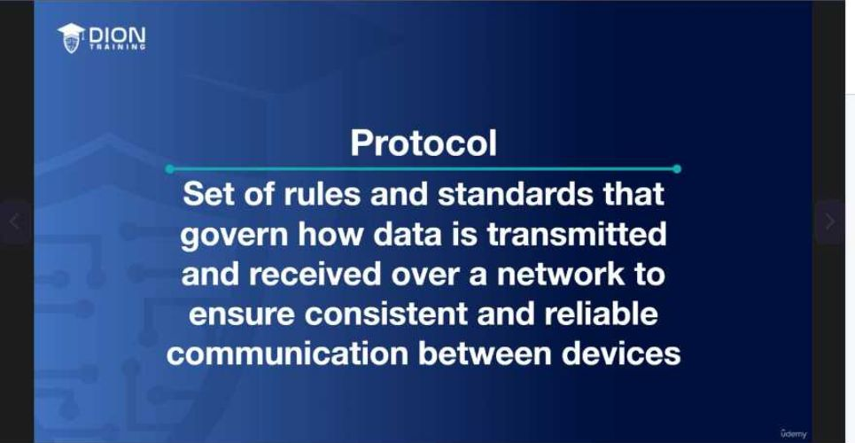

**3. Giao thức Ethernet: Xương sống của mạng nội bộ**

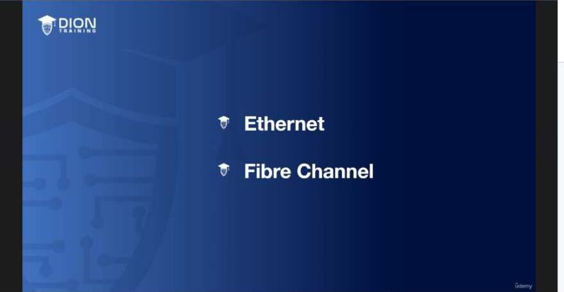

Ethernet không chỉ là một sợi cáp; đó là một hệ sinh thái các công nghệ mạng. Nó giữ vai trò "luật giao thông" cho các mạng LAN (Local Area Network), MAN (Metropolitan Area Network) và cả WAN (Wide Area Network).

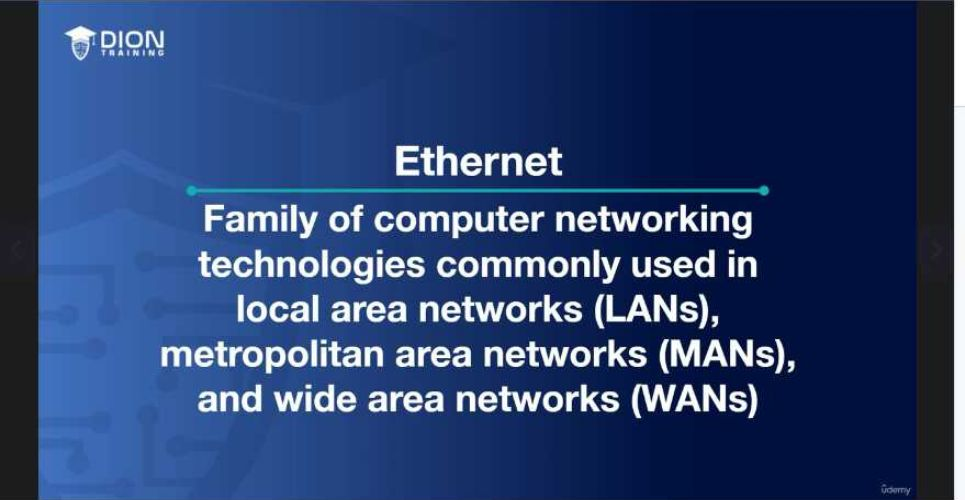

*   **Tính chất của Ethernet:** Nó định nghĩa từ những chi tiết vật lý nhất như cấu tạo đầu nối (connector), loại cáp điện/quang, cho đến các quy tắc trừu tượng như cách đóng gói dữ liệu (data frame).
*   **Tính linh hoạt:** Dù môi trường truyền dẫn là cáp đồng, cáp quang hay sóng vô tuyến (Wi-Fi), Ethernet vẫn cung cấp một tiêu chuẩn giao tiếp thống nhất. Điều này cho phép chúng ta kết nối máy tính, máy in, router của nhiều hãng sản xuất khác nhau mà vẫn đảm bảo chúng "nói chuyện" được với nhau.

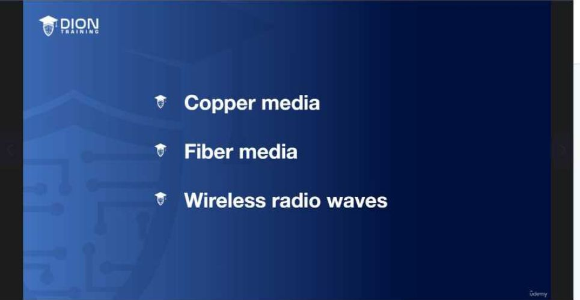

> **💡 Ví dụ nhớ đời:** Hãy coi Ethernet giống như hệ thống ngôn ngữ tiếng Anh trong kinh doanh quốc tế. Dù bạn là người Nhật, Đức hay Việt Nam, chỉ cần cả hai cùng thống nhất sử dụng tiếng Anh (giao thức Ethernet), việc trao đổi thông tin sẽ diễn ra suôn sẻ, không phụ thuộc vào việc bạn viết bằng bút máy hay gõ bằng máy tính.

**4. Giao thức Fiber Channel (FC): "Vận tải cơ" trong lưu trữ dữ liệu**
Nếu Ethernet là phương tiện giao thông công cộng, thì Fiber Channel (FC) giống như một đoàn tàu chở hàng chuyên dụng tốc độ cao, được thiết kế cho các Storage Area Network (SAN).

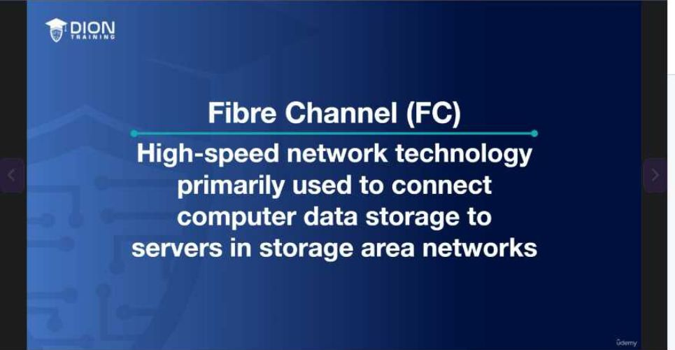

*   **Mục đích chuyên biệt:** FC được tối ưu hóa để kết nối máy chủ (servers) với các hệ thống lưu trữ dữ liệu khổng lồ. Trong môi trường doanh nghiệp, tốc độ xử lý là sống còn, do đó FC được ưu tiên nhờ khả năng truyền dữ liệu hàng gigabit mỗi giây với độ trễ (latency) cực thấp.
*   **Đặc điểm kỹ thuật:** FC cực kỳ chú trọng vào tính toàn vẹn dữ liệu (data integrity). Nó không cho phép dữ liệu bị thất lạc hay sai lệch trong quá trình truyền tải từ server đến nơi lưu trữ.
*   **Đa năng:** Tương tự Ethernet, FC cũng hỗ trợ cả hạ tầng cáp quang (cho khoảng cách xa và tốc độ cao) lẫn cáp đồng (cho khoảng cách ngắn).

**5. Điểm giao thoa giữa các giao thức**
Đoạn transcript khép lại bằng một câu hỏi bỏ ngỏ về việc chuyển đổi giữa dữ liệu Ethernet và dữ liệu Fiber Channel. Đây là một vấn đề kỹ thuật thú vị: Làm thế nào để một thiết bị có thể "dịch" ngôn ngữ của Ethernet sang ngôn ngữ của Fiber Channel? Trong thực tế, điều này đòi hỏi các thiết bị chuyển đổi (như các thiết bị lưu trữ hội tụ hoặc các bộ chuyển đổi giao thức chuyên dụng) để đóng vai trò thông dịch viên, đảm bảo luồng dữ liệu có thể đi từ hạ tầng mạng Ethernet phổ thông vào hệ thống lưu trữ tốc độ cao FC một cách liền mạch mà không làm mất mát thông tin.

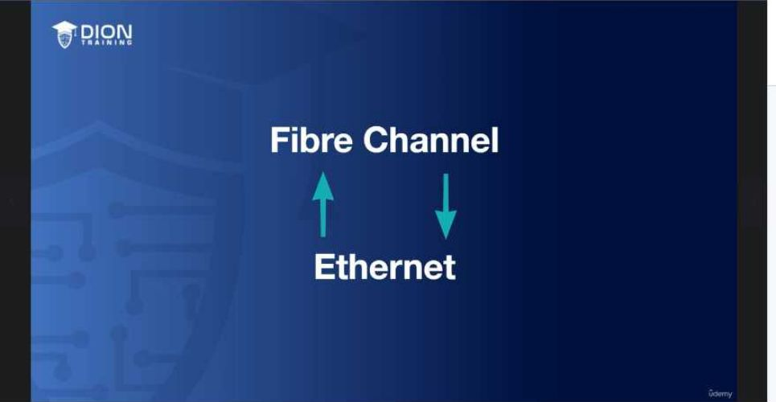

Vai trò cốt lõi của transceiver trong việc chuyển đổi phương tiện (Media Conversion) và giao thức (Protocol Translation) được thể hiện qua các cơ chế sau:

### 1. Chuyển đổi giữa các giao thức khác biệt (Protocol Translation)
Transceiver không chỉ đơn thuần là bộ thu phát tín hiệu; nó còn đóng vai trò là "phiên dịch viên" giữa các ngôn ngữ mạng khác nhau. Khi một mạng Ethernet (thường chạy trên cáp đồng) cần kết nối với mạng Fiber Channel (thường chạy trên cáp quang), transceiver đảm nhận việc đóng gói và chuyển đổi cấu trúc dữ liệu. Nó tiếp nhận tín hiệu điện từ Ethernet, xử lý các khung hình (frames), và tái cấu trúc chúng để tương thích với các tiêu chuẩn của Fiber Channel trước khi truyền đi qua sợi quang. Điều này giúp các cơ sở hạ tầng mạng khác biệt có thể "nói chuyện" được với nhau mà không cần thay thế toàn bộ thiết bị đầu cuối.

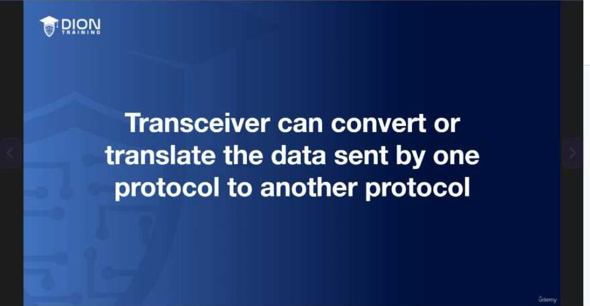

### 2. Chuyển đổi phương tiện truyền dẫn (Media Conversion) cùng giao thức
Đôi khi, bạn không cần thay đổi giao thức (vẫn là Ethernet) nhưng cần thay đổi "chất liệu" truyền dẫn. Đây là lúc transceiver đóng vai trò như một bộ chuyển đổi vật lý (Media Converter).

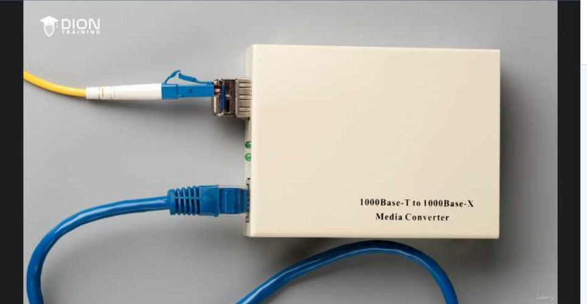

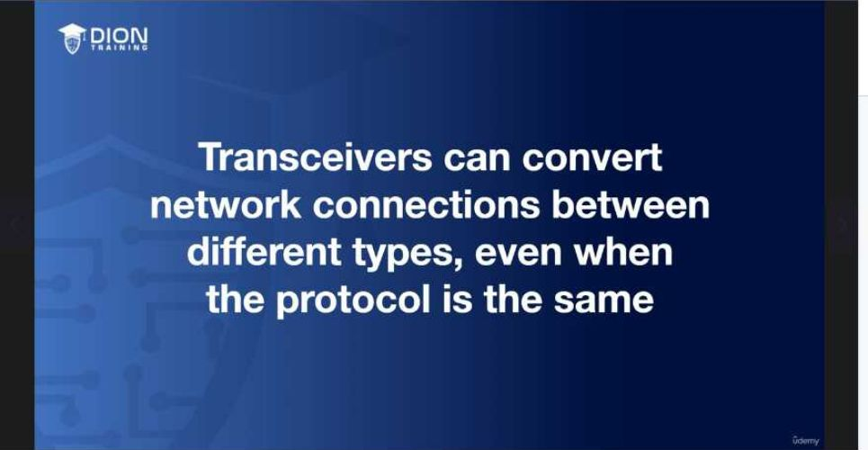

> **💡 Ví dụ nhớ đời:** Hãy tưởng tượng bạn đang gửi thư bằng tiếng Việt (giao thức Ethernet). Bạn viết thư trên giấy (cáp đồng). Nhưng để gửi bức thư đó qua một đại dương (đường truyền quang học), bạn cần đặt nó vào một cái chai thủy tinh (chuyển đổi sang ánh sáng). Transceiver chính là người nhân viên bưu điện: họ lấy bức thư từ tay bạn, nhét vào chai, và ném xuống biển. Khi bức thư đến nơi, một nhân viên bưu điện khác (transceiver thứ hai) sẽ lấy nó ra khỏi chai và đặt lại lên tờ giấy để người nhận đọc được. Dù môi trường vận chuyển thay đổi từ tay người sang chai thủy tinh, nội dung bức thư (Ethernet) vẫn không hề thay đổi.

Việc này cực kỳ quan trọng trong môi trường an ninh cao hoặc môi trường công nghiệp nặng:
*   **Chống nhiễu điện từ (EMI):** Trong môi trường quân sự hoặc nhà máy, các thiết bị điện tử tạo ra nhiễu sóng (EMI) rất mạnh. Cáp đồng rất nhạy cảm với loại nhiễu này, dẫn đến sai lệch dữ liệu. Bằng cách sử dụng transceiver để chuyển đổi tín hiệu sang cáp quang (sử dụng ánh sáng), chúng ta loại bỏ hoàn toàn ảnh hưởng của nhiễu điện từ vì ánh sáng không bị tác động bởi từ trường.
*   **Hạn chế của thiết bị cuối:** Hầu hết các máy tính văn phòng chỉ có sẵn cổng RJ45 (Cat6a). Transceiver cho phép chúng ta duy trì đường trục là sợi quang tốc độ cao, nhưng khi đến tận bàn làm việc của nhân viên, nó chuyển đổi "light signal" (tín hiệu ánh sáng) trở lại thành "electrical signal" (tín hiệu điện) để tương thích với các cổng mạng tích hợp trên bo mạch chủ.

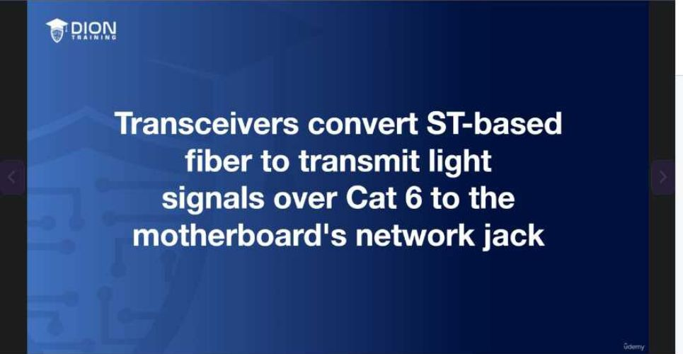

### 3. Giải pháp cho truyền dẫn khoảng cách xa
Một kịch bản thực tế khác là kết nối mạng giữa hai tòa nhà cách xa nhau (ví dụ 30 dặm). Tín hiệu điện trên cáp đồng bị suy hao rất nhanh và không thể truyền đi xa. 

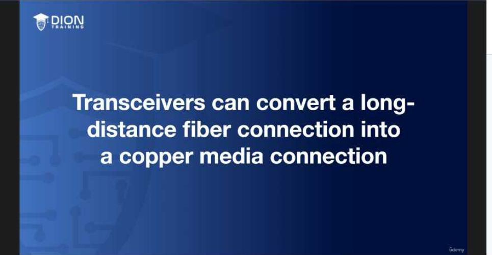

Trong trường hợp này, transceiver là thành phần không thể thiếu để:
1. Chuyển đổi dữ liệu từ thiết bị mạng (switch/router) sang dạng ánh sáng laser có cường độ cao.
2. Đẩy tín hiệu đi xa qua hàng chục kilomet cáp quang.
3. Khi đến đích, một transceiver khác sẽ "bắt" lấy ánh sáng đó và chuyển đổi ngược lại thành tín hiệu điện để router hoặc switch của tòa nhà bên kia có thể hiểu và xử lý ngay lập tức.

Việc sử dụng transceiver trong các trường hợp này không chỉ là sự lựa chọn về thiết bị, mà là sự tính toán kỹ thuật để đảm bảo tính toàn vẹn dữ liệu, tốc độ truyền tải và khả năng thích ứng của hạ tầng mạng trong thực tế.

Trong bối cảnh kết nối giữa hai tòa nhà cách xa nhau (ví dụ 30 dặm), việc sử dụng cáp đồng là bất khả thi do giới hạn vật lý 100 mét của chuẩn Ethernet trên cáp xoắn đôi. Giải pháp bắt buộc ở đây là cáp quang đơn mốt (single-mode fiber), một môi trường truyền dẫn có khả năng duy trì tín hiệu trên khoảng cách rất dài mà không bị suy hao đáng kể.

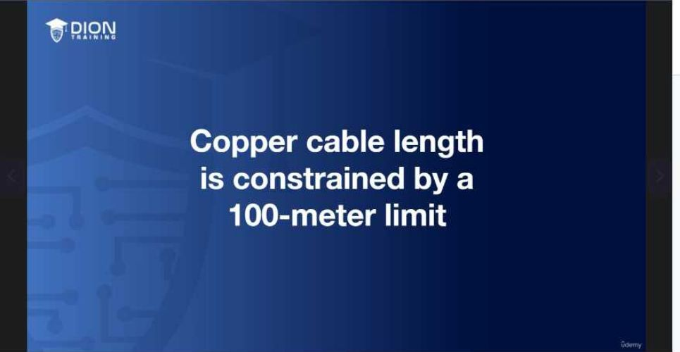

**Mô hình MAN và WAN trong triển khai hạ tầng**
Khi bạn thuê đơn vị thi công đào rãnh, lắp đặt cáp quang băng qua thành phố để kết nối hai địa điểm, hệ thống này được phân loại dựa trên phạm vi địa lý:
* **MAN (Metropolitan Area Network):** Mạng đô thị, kết nối các địa điểm trong cùng một thành phố hoặc khu vực hành chính.

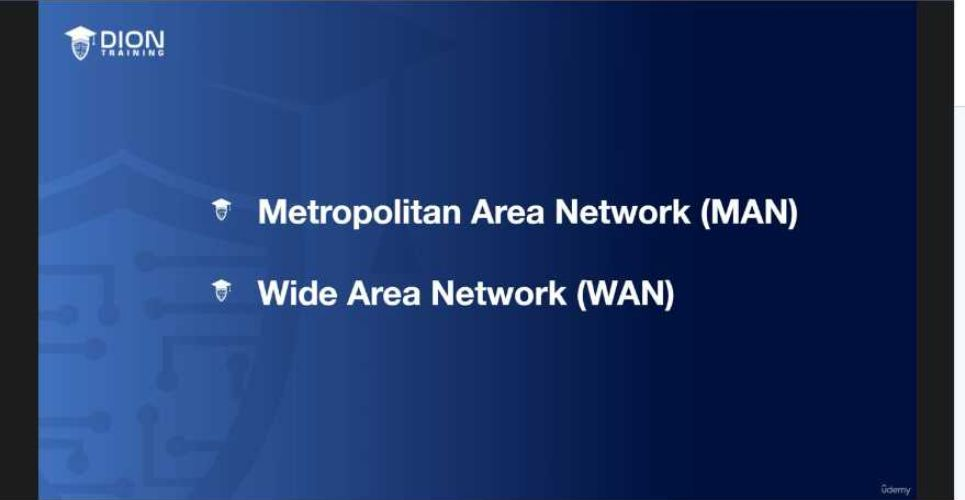

* **WAN (Wide Area Network):** Mạng diện rộng, dùng khi khoảng cách vượt xa hơn, kết nối các vùng địa lý lớn.
Việc chạy cáp "long haul" (đường trục dài) chính là xương sống để thiết lập các loại mạng này, cho phép các tòa nhà xa xôi cùng thuộc một mạng nội bộ doanh nghiệp.

**Thiết bị lớp 1 (Layer 1) và cơ chế chuyển đổi tín hiệu**

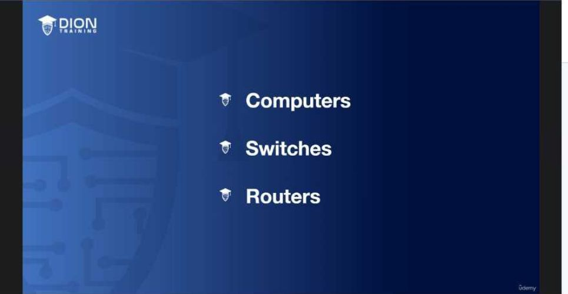

Khi cáp quang tới đích, nó không thể cắm trực tiếp vào các cổng mạng thông thường (RJ45). Tại đây, media converter hoặc transceiver đóng vai trò là "phiên dịch viên" vật lý:
* **Bản chất của Layer 1:** Các thiết bị này được xếp vào tầng 1 (Physical Layer) trong mô hình OSI vì chúng không hề can thiệp vào dữ liệu hay địa chỉ IP/MAC. Chúng chỉ thực hiện một nhiệm vụ duy nhất: "đọc" xung điện/ánh sáng hiện có, tái tạo lại tín hiệu đó ở định dạng môi trường vật lý mới (từ quang sang điện hoặc ngược lại) và đẩy nó đi.

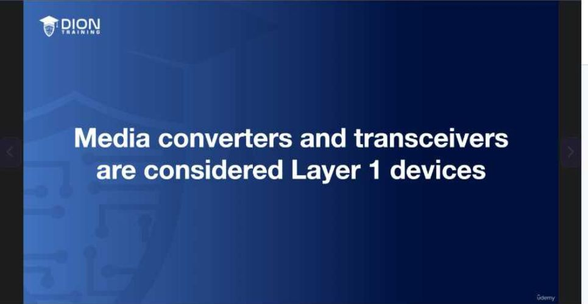

* **Tính đa dạng của chuyển đổi:** Media converter không chỉ giới hạn ở quang-đồng. Nó có khả năng "lai ghép" nhiều loại môi trường khác nhau: Coaxial (cáp đồng trục) sang sợi quang, đồng sang wireless, hoặc thậm chí là các chuẩn kết nối cũ sang mới.

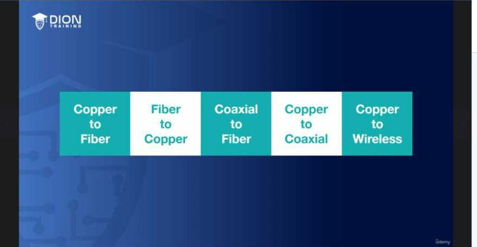

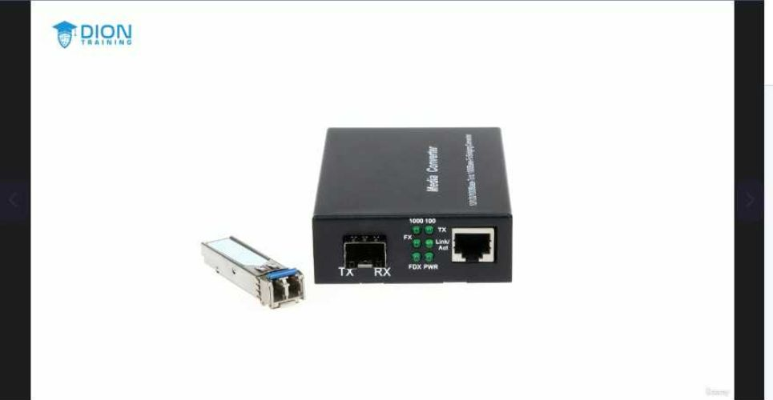

> **💡 Ví dụ nhớ đời:** Hãy tưởng tượng media converter giống như một cái "cầu cảng" chuyển đổi giữa tàu thủy (tín hiệu quang chạy trên biển xa) và xe tải (tín hiệu điện chạy trên đường bộ trong phố). Chiếc cầu cảng không quan tâm hàng hóa bên trong là gì, nó chỉ đơn giản là bốc dỡ hàng từ tàu sang xe để hàng hóa có thể tiếp tục hành trình đến kho bãi (thiết bị cuối).

**Ví dụ thực tế về truyền tải tín hiệu Video qua khoảng cách xa**
Để cụ thể hóa việc sử dụng media converter trong hạ tầng phức tạp, hãy xét việc truyền tín hiệu truyền hình (Video) trong một khu công viên doanh nghiệp rộng lớn:
1. **Điểm phát:** Tín hiệu Video được truyền qua cáp đồng trục (coaxial) dưới dạng tần số vô tuyến (Radio Frequency - RF).
2. **Chuyển đổi 1:** Media converter tại tòa nhà A tiếp nhận tín hiệu RF, "đóng gói" nó vào các xung ánh sáng để truyền qua cáp quang dài nửa dặm.
3. **Chuyển đổi 2:** Media converter tại tòa nhà B nhận ánh sáng, giải mã ngược lại thành tín hiệu RF ban đầu.

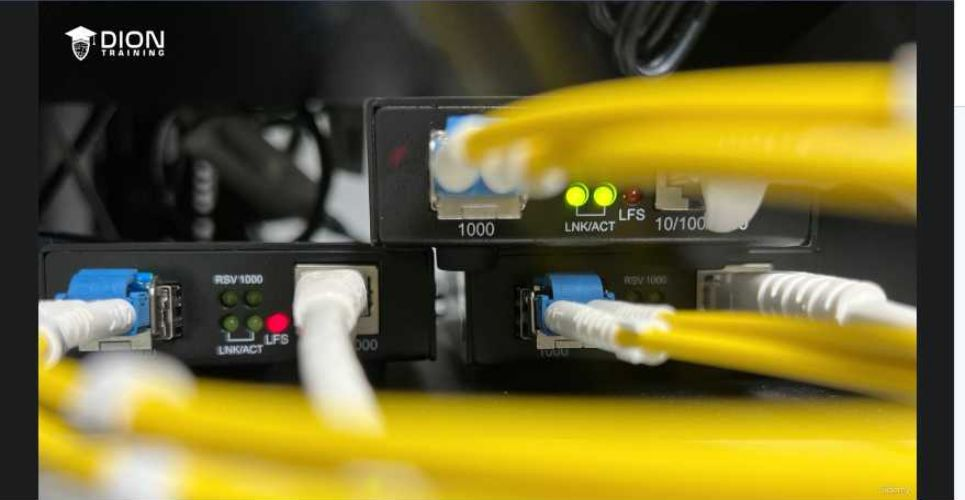

4. **Kết quả:** Tín hiệu sau khi ra khỏi thiết bị thứ hai vẫn giữ nguyên bản chất tần số vô tuyến, cho phép cắm trực tiếp vào cổng ăng-ten của TV và hiển thị hình ảnh mà không cần bất kỳ thiết bị giải mã kỹ thuật số phức tạp nào khác.

Quy trình này chứng minh tính linh hoạt của các thiết bị tầng vật lý: chúng làm cho "khoảng cách" và "loại môi trường" trở nên vô hình đối với thiết bị đầu cuối, cho phép các hạ tầng vốn dĩ không tương thích có thể kết hợp với nhau một cách hoàn hảo. Tiếp theo, chúng ta sẽ khám phá các "form-factors" (hình thái, kích thước vật lý) của các bộ transceiver này, những tiêu chuẩn quan trọng mà kỹ thuật viên cần nắm vững khi thao tác với các thiết bị mạng hiện đại.

Trong các hệ thống mạng lớn, việc quản trị viên phải đối mặt với một "ma trận" các loại đầu cắm (form-factors) khác nhau cho thiết bị thu phát là điều không thể tránh khỏi. Sự đa dạng này xuất phát từ nhu cầu về tốc độ và khả năng truyền tải dữ liệu ngày càng cao.

### Phân loại các chuẩn Transceiver theo form-factor

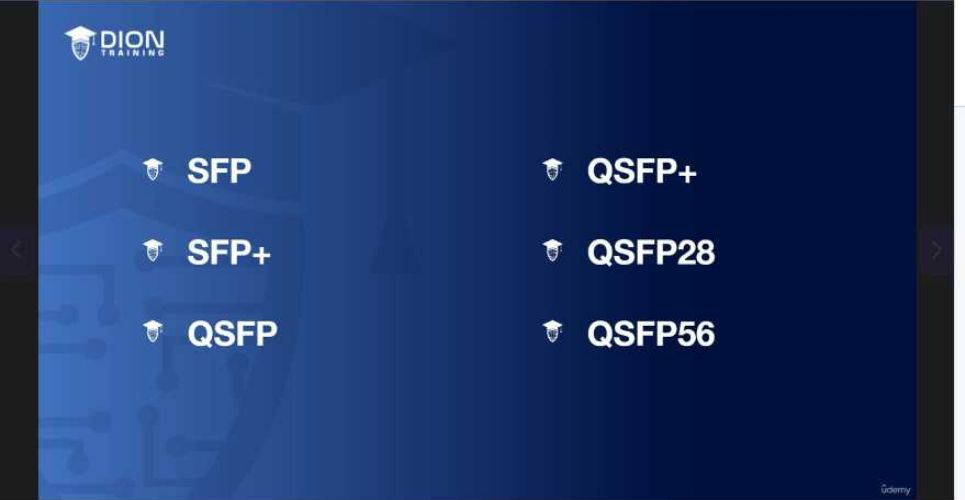

Sự khác biệt chính giữa các loại này không chỉ nằm ở tên gọi, mà là ở băng thông (tốc độ) và thiết kế vật lý để tối ưu hóa hiệu suất truyền dẫn:

1. **SFP (Small Form-factor Pluggable):** Là chuẩn cũ nhất trong danh sách. Đây là tiêu chuẩn nền tảng, một module quang nhỏ gọn, có khả năng "hot-pluggable" (cắm nóng – có thể rút ra hoặc cắm vào thiết bị đang hoạt động mà không cần ngắt điện hay khởi động lại router/switch). Với tốc độ hỗ trợ lên tới 4.25 Gbps, nó đáp ứng các nhu cầu kết nối sợi quang cơ bản.

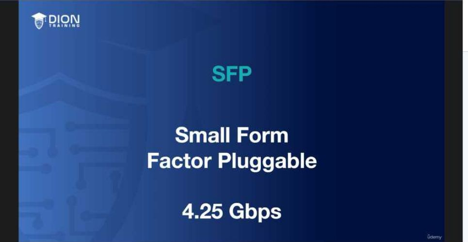

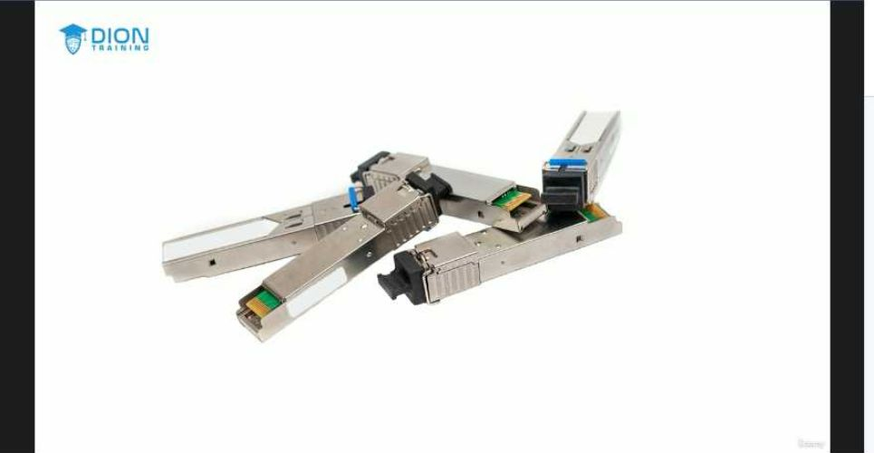

2. **SFP+ (SFP Plus):** Như tên gọi, đây là phiên bản nâng cấp của SFP. Về mặt vật lý, nó giữ nguyên kích thước để đảm bảo tính tương thích, nhưng về hiệu suất, nó cho phép đạt tốc độ lên tới 16 Gbps – nhanh gấp gần 4 lần so với SFP tiêu chuẩn.

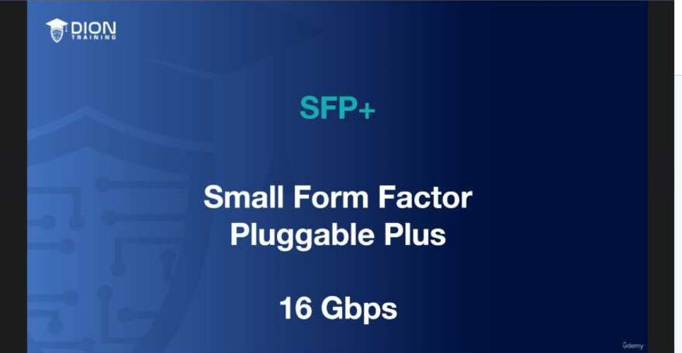

3. **QSFP (Quad Small Form-factor Pluggable):** Từ "Quad" ở đây ám chỉ việc tích hợp 4 kênh (lane) truyền dẫn trong cùng một module, giúp mật độ cổng cao hơn. Dù kích thước vật lý lớn hơn SFP, nhưng QSFP cung cấp khả năng truyền tải nhanh hơn cho các liên kết yêu cầu băng thông rộng.

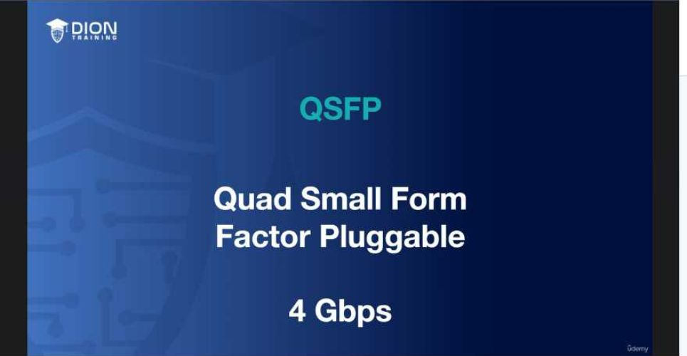

4. **QSFP+ (QSFP Plus):** Tương tự như cách SFP tiến hóa lên SFP+, QSFP+ là phiên bản tốc độ cao của QSFP, đẩy giới hạn truyền tải lên mức 40 Gbps. Đây là bước nhảy vọt cần thiết cho các đường truyền xương sống (backbone) trong mạng doanh nghiệp.

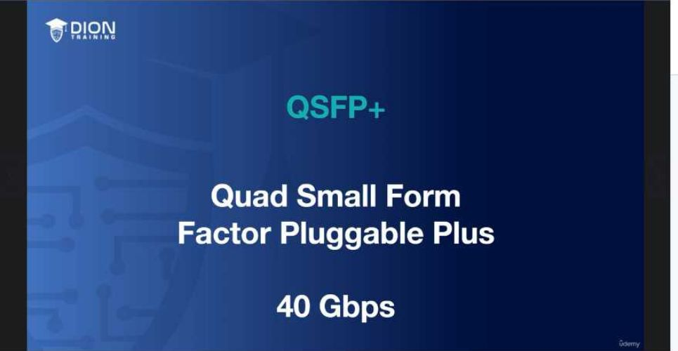

5. **QSFP28 và QSFP56:** Đây là những "gã khổng lồ" về tốc độ trong thế giới transceiver hiện đại.
   - **QSFP28:** Con số 28 ám chỉ mỗi kênh truyền tải đạt 28 Gbps, tổng cộng cho 4 kênh sẽ là khoảng 100 Gbps.

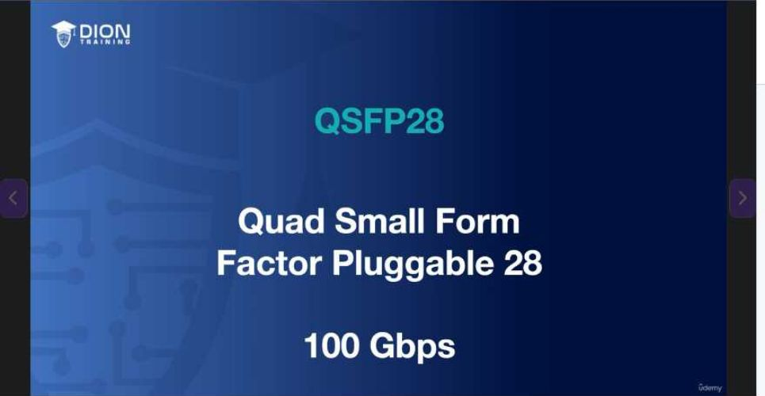

   - **QSFP56:** Tương tự, với công nghệ tiên tiến hơn, nó cho phép đạt tốc độ khủng khiếp lên tới 200 Gbps.

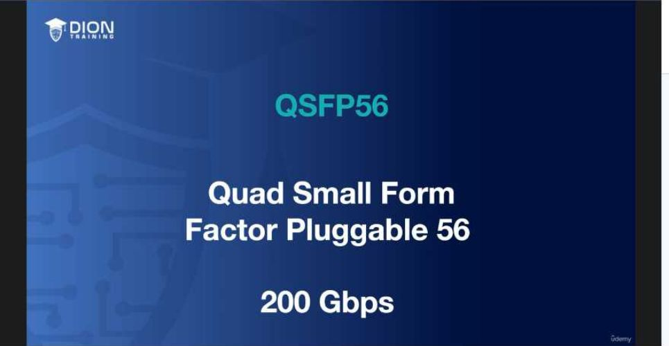

> **💡 Ví dụ nhớ đời:** Hãy tưởng tượng các loại transceiver này giống như các loại cổng sạc điện thoại. Dù tất cả đều dùng để sạc pin (truyền dữ liệu), nhưng bạn có cổng USB cũ (SFP), cổng Type-C đời đầu (SFP+), và những bộ sạc nhanh công suất lớn tích hợp nhiều chân cắm (QSFP, QSFP56). Bạn không thể nhét một đầu cắm quá lớn vào một khe cắm nhỏ hơn, và mỗi loại đều được thiết kế để "tiếp sức" cho những thiết bị có nhu cầu tiêu thụ dữ liệu khác nhau.

### Tại sao cần hiểu các chuẩn này?

Mặc dù trong kỳ thi chứng chỉ, bạn không nhất thiết phải học thuộc lòng con số tốc độ chính xác của từng loại, nhưng bạn cần nắm vững hai nguyên tắc cốt lõi:

*   **Quy luật phân cấp:** Các module dòng QSFP luôn có tốc độ cao hơn dòng SFP. Điều này giúp bạn dễ dàng đưa ra quyết định khi thiết kế mạng: Cần kết nối các server hiệu suất cao hay các switch phân tán? Cần tốc độ "thông thường" hay tốc độ "siêu cao"?

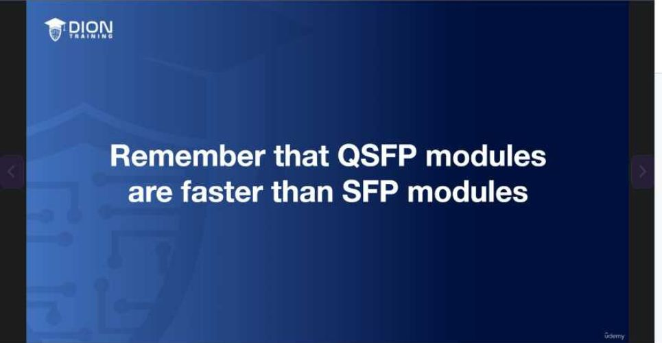

*   **Chức năng chuyển đổi cốt lõi:** Dù là SFP, SFP+, hay QSFP56, bản chất của chúng vẫn là cầu nối vật lý. Chúng nhận các xung ánh sáng (tín hiệu quang) từ sợi cáp quang, sau đó chuyển đổi chúng thành các xung điện (bit 1 và 0) mà các thiết bị mạng chạy bằng đồng (copper) có thể hiểu và xử lý được.

Nếu bạn cần thay đổi định dạng vật lý của tín hiệu mạng để truyền đi khoảng cách xa – nơi mà cáp đồng bị giới hạn bởi định luật vật lý về suy hao tín hiệu – các transceiver này chính là chìa khóa để "phiên dịch" dữ liệu từ môi trường ánh sáng (fiber) sang môi trường điện (copper) và ngược lại một cách liền mạch.

Trong phần cuối cùng này, chúng ta sẽ đi sâu vào hai công năng quan trọng khác của thiết bị thu phát (transceiver) và bộ chuyển đổi phương tiện (media converter) bên cạnh việc thay đổi tốc độ truyền dẫn. Đó là khả năng mở rộng khoảng cách vật lý và khả năng chuyển đổi giao thức (protocol conversion).

### 1. Giải pháp cho giới hạn khoảng cách vật lý
Như chúng ta đã biết, cáp đồng (copper-based network) có giới hạn vật lý rất khắc nghiệt về khoảng cách truyền tín hiệu do hiện tượng suy hao và nhiễu điện từ. Ngược lại, cáp quang sử dụng ánh sáng, cho phép truyền dữ liệu đi xa hơn gấp nhiều lần mà không bị mất mát đáng kể.

Transceiver hoặc media converter đóng vai trò như một "phiên dịch viên" ngôn ngữ vật lý:
*   **Tại điểm gửi:** Nó nhận các xung điện (electrical impulses) từ hạ tầng cáp đồng, "phiên dịch" chúng thành các xung ánh sáng (light-based signals) để truyền đi trên sợi quang.
*   **Tại điểm nhận:** Thiết bị tương tự sẽ làm công việc ngược lại, "dịch" các xung ánh sáng đó trở về dạng xung điện ban đầu để các thiết bị đầu cuối như switch hoặc router sử dụng cổng đồng có thể hiểu và xử lý được.

> **💡 Ví dụ nhớ đời:** Hãy tưởng tượng bạn muốn gửi một bức thư (dữ liệu) qua một con sông rộng (khoảng cách xa). Cáp đồng giống như việc bạn cố gắng ném tờ giấy đó qua sông – nó sẽ rơi xuống nước ngay lập tức nếu khoảng cách quá xa. Transceiver giống như một trạm bưu điện ở bờ bên kia: nó nhận lấy tờ giấy, đóng gói vào một quả tên lửa bắn qua sông, và khi đến nơi, trạm bưu điện bên này lại lấy tờ giấy ra khỏi quả tên lửa để người nhận có thể đọc được bằng mắt thường.

### 2. Chuyển đổi giao thức (Protocol Conversion)
Đây là một tính năng chuyên sâu và cực kỳ hữu ích trong các trung tâm dữ liệu hiện đại. Không phải mọi hệ thống mạng đều "nói" cùng một ngôn ngữ. Bạn có thể gặp trường hợp cần kết nối giữa các môi trường mạng khác nhau hoàn toàn về mặt logic truyền tải:

*   **Từ Ethernet sang Fiber Channel:** Ethernet là giao thức tiêu chuẩn mà các thiết bị mạng phổ biến như PC, switch văn phòng sử dụng. Fiber Channel lại là giao thức chuyên dụng được thiết kế cho mạng lưu trữ (Storage Area Network - SAN) để truyền tải dữ liệu giữa máy chủ và ổ đĩa tốc độ cao.
*   **Sự linh hoạt của Transceiver:** Trong thực tế, các trung tâm dữ liệu thường yêu cầu sự liên thông giữa hai loại hình này. Thay vì phải thay thế toàn bộ hệ thống hoặc mua những bộ chuyển đổi cồng kềnh, các transceiver chuyên dụng cho phép thực hiện việc chuyển đổi giao thức ngay trên chính thiết bị mạng hiện có.

Khi cắm một transceiver hỗ trợ đa giao thức vào cổng của switch, thiết bị đó không chỉ đơn thuần là bộ chuyển đổi môi trường truyền dẫn (điện sang quang), mà nó còn xử lý việc đóng gói dữ liệu (encapsulation). Nó lấy dữ liệu từ một khung Ethernet và "bọc" nó vào định dạng khung của Fiber Channel (hoặc ngược lại), đảm bảo rằng đầu bên kia có thể tiếp nhận thông tin mà không gặp lỗi logic.

**Tóm lại:**

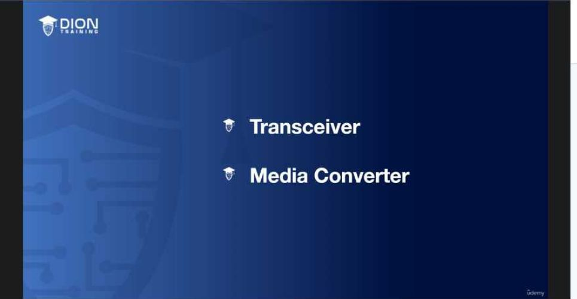

Transceiver không chỉ đơn thuần là các module "cắm và chạy" để tăng tốc độ. Chúng là những công cụ đa năng giúp người quản trị mạng:
1. **Vượt qua giới hạn địa lý:** Kết nối mạng ở khoảng cách xa thông qua cáp quang.
2. **Hợp nhất hạ tầng:** Cho phép các thiết bị cũ/mới, hoặc các công nghệ mạng khác nhau (Ethernet vs Fiber Channel) làm việc cùng nhau một cách đồng nhất, giúp tối ưu hóa chi phí đầu tư và khả năng mở rộng hệ thống mà không cần đập đi xây lại toàn bộ hạ tầng mạng hiện hữu.

---

## 🎯 Bí Kíp Ôn Thi Tốc Độ: Transceiver & Protocol

### 1. Khái niệm cốt lõi
*   **Transceiver**: Thiết bị tích hợp **Transmitter** (truyền) và **Receiver** (nhận).
*   **Chức năng chính**: 
    *   Chuyển đổi tín hiệu (Media Converter): Ví dụ: **Quang sang Đồng** (Fiber to Copper) hoặc ngược lại.
    *   Chuyển đổi giao thức: **Ethernet ↔ Fiber Channel**.
*   **Đặc điểm kỹ thuật**: Là thiết bị **Layer 1** (chỉ chuyển đổi và lặp lại tín hiệu vật lý).

### 2. Giao thức mạng (Protocols)
*   **Ethernet**: Phổ biến nhất (LAN/MAN/WAN). Dùng cho mọi media (đồng, quang, không dây). Định nghĩa chuẩn vật lý và dữ liệu.
*   **Fiber Channel (FC)**: Dùng cho **Storage Area Networks (SAN)**. 
    *   Đặc điểm: **Tốc độ cao, độ trễ thấp**, xử lý dữ liệu lớn.
    *   Ứng dụng: Kết nối server với hệ thống lưu trữ dữ liệu.

### 3. Các Form-factor của Transceiver

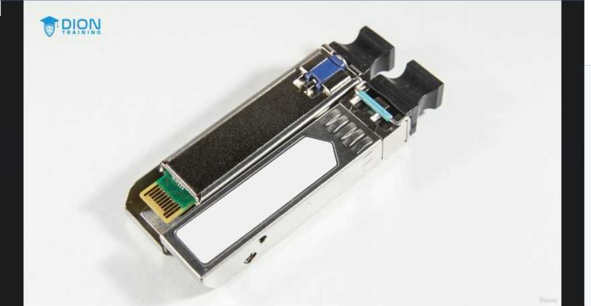

*   **SFP (Small Form-factor Pluggable)**: Chuẩn cũ, nhỏ gọn, hot-swappable (tháo lắp nóng).
*   **SFP+**: Bản nâng cấp của SFP, tốc độ nhanh hơn.
*   **QSFP (Quad SFP)**: Thiết kế dạng "Quad" (gộp 4 kênh), tốc độ vượt trội.
*   **Quy tắc ghi nhớ**:
    *   **QSFP > SFP** về tốc độ.
    *   Hậu tố **"+"** hoặc các con số (**28, 56**) càng lớn → tốc độ truyền tải càng cao.
    *   Tất cả đều là **Hot-pluggable**: Không cần tắt thiết bị (router/switch) khi thay thế.

### 4. Mẹo xử lý câu hỏi thi
*   **Bài toán khoảng cách**: Cần truyền xa (>100m) → dùng **Fiber** + **Transceiver** để chuyển đổi tín hiệu từ thiết bị đầu cuối (đồng).
*   **Bài toán môi trường (nhiễu EMI/Bảo mật)**: Dùng **Fiber** thay vì đồng, kết hợp **Transceiver** để tương thích với cổng RJ45 (Cat6a) trên máy tính.
*   **Bản chất Layer 1**: Nếu câu hỏi hỏi về Layer, nhớ ngay **Transceiver = Physical Layer (Lớp 1)**.
*   **Nhớ nhanh**: Transceiver = "Bộ dịch thuật" cho tín hiệu (đổi phương tiện hoặc đổi tiếng nói giao thức).

---
*Ghi chú: 30 hình ảnh minh họa (.jpg) đã được tải về và lưu tự động vào thư mục con `image/` cùng cấp với file này. Để ảnh hiển thị tự động, hãy đảm bảo bạn sao chép cả thư mục `image/` nếu bạn muốn di chuyển file markdown sang nơi khác!*
