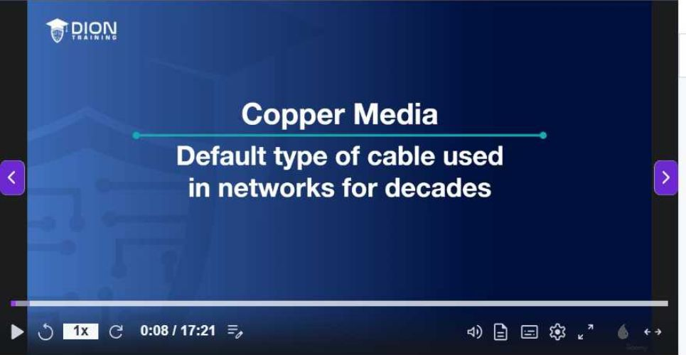
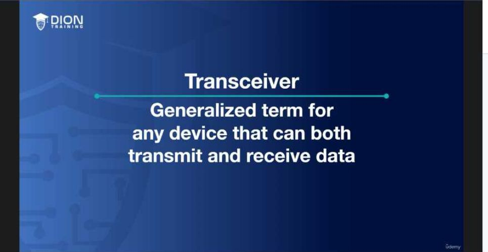

# 🌐 04.Media_and_Connectors: Cáp Mạng Đồng, Cáp Quang & Mô-đun Transceivers - Chuyên Sâu CompTIA Network+ Cho DevOps

> 💡 **Bản chất 1 câu**: Cáp đồng UTP/STP Cat5e/Cat6/Cat6a, chuẩn bấm T568B, khoảng cách 100m, cáp quang Single-Mode (Laser, 10-80km) vs Multi-Mo...  
> 🎯 **Trọng tâm thực chiến DevOps**: Nắm vững lý thuyết chuyên sâu, sơ đồ kiến trúc, bộ lệnh CLI chẩn đoán thực tế và bộ câu hỏi phỏng vấn tuyển dụng.

---

## 1. 🧠 Hình Hình Dung Nhanh (Intuitive Mindset)

Cáp đồng UTP/STP Cat5e/Cat6/Cat6a, chuẩn bấm T568B, khoảng cách 100m, cáp quang Single-Mode (Laser, 10-80km) vs Multi-Mode (LED, <550m), đầu LC/SC và mô-đun SFP+ 10G / QSFP+ 40G.




---

## 2. 📚 Lý Thuyết Chuyên Sâu & Bản Chất Hệ Thống (Under The Hood Architecture)

### 2.1 So Sánh Các Chuẩn Cáp Đồng Ethernet (OBJ 1.5)
| Chuẩn Cáp | Tốc độ tối đa | Băng thông | Khoảng cách 10Gbps | Ứng dụng phổ biến |
| :--- | :--- | :--- | :--- | :--- |
| **Cat 5e** | 1 Gbps | 100 MHz | N/A | Văn phòng truyền thống |
| **Cat 6** | 10 Gbps | 250 MHz | **Tối đa 55 mét** | Mạng văn phòng tiêu chuẩn |
| **Cat 6a** | **10 Gbps** | 500 MHz | **Tối đa 100 mét** | Đi dây Datacenter Racks |

- **Giới hạn khoảng cách cáp đồng**: Tối đa **100 mét** (90m cáp âm tường + 10m patch cord).

---

### 2.2 Cáp Quang Single-Mode (SMF) vs Multi-Mode (MMF)
- **Single-Mode (SMF - Vỏ Vàng)**: Core nhỏ 9um, nguồn phát Laser (1310/1550nm), truyền xa **10km - 80km**. Dùng cho kết nối WAN / ISP.
- **Multi-Mode (MMF - Vỏ Aqua)**: Core lớn 50/62.5um, nguồn phát LED (850nm), truyền ngắn **< 550m**. Dùng nối giữa các Switch trong Datacenter.
- **Transceivers**: **SFP** (1G), **SFP+** (10G), **SFP28** (25G), **QSFP+** (40G), **QSFP28** (100G).


---

## 3. ⚡ Bảng Tra Cứu Câu Lệnh & Khái Niệm Thực Hành (Reference Table)

| Công cụ / Khái niệm | Loại / Protocol | Ý nghĩa chi tiết | Ứng dụng thực tế |
| :--- | :--- | :--- | :--- |
| **`Cat6a`** | `10Gbps @ 100m` | Cáp đồng bọc giáp chống nhiễu tiêu chuẩn Datacenter | `Đi dây Server Racks` |
| **`SMF`** | `Single-Mode` | Cáp quang lõi nhỏ đi xa 10-80km màu vàng | `Đường truyền cáp quang ISP WAN` |
| **`MMF`** | `Multi-Mode` | Cáp quang lõi lớn đi ngắn <550m màu xanh Aqua | `Nối các Switch trong Datacenter` |
| **`SFP+`** | `10Gbps Transceiver` | Mô-đun quang cắm nóng cắm vào card mạng 10G | `Card quang Server 10G` |


---

## 4. 🛠 Thao Tác Thực Chiến & Kịch Bản DevOps

### 🛠 Các lệnh thực hành gõ là ăn ngay:
```bash
ethtool eth0 # Kiểm tra speed 1000Mbps hay 10Gbps
sudo ethtool -m eth1 # Xem thông số quang SFP+ module
```

### 🚀 Kịch bản xử lý sự cố thực tế khi đi làm:
Sự cố Card mạng Server chỉ nhận 100Mbps thay vì 1Gbps do cáp UTP bị gãy 1 trong 8 sợi đứt ngầm.

---

## 5. 🚀 Bộ Câu Hỏi Phỏng Vấn DevOps & Network Thực Tế (Interview Q&A)

> **Q: Giới hạn chiều dài tối đa của đoạn cáp đồng Ethernet UTP là bao nhiêu?**  
> **A**: Tối đa **100 mét**.

> **Q: Cáp quang Single-Mode (SMF) khác Multi-Mode (MMF) ở điểm nào quan trọng nhất?**  
> **A**: SMF sử dụng nguồn phát Laser lõi nhỏ 9um cho phép truyền xa từ 10km đến 80km. MMF sử dụng nguồn LED lõi 50um truyền ngắn < 550m trong Datacenter.


---

## 6. 📝 Cheat Sheet Ghi Nhớ Nhanh (Summary)

- [x] Cat6a: 10Gbps @ 100m
- [x] SMF (Vàng): Laser, đi xa >10km
- [x] MMF (Aqua): LED, đi ngắn <550m
- [x] SFP+: Transceiver 10Gbps

