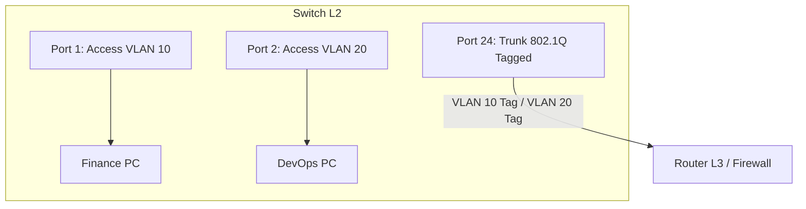

# 🌐 Chuyển Mạch Ethernet & Phân Chia Mạng Ảo VLAN (802.1Q) - Chuyên Sâu Mạng Máy Tính Cho DevOps

> 💡 **Bản chất 1 câu**: Phân tích cấu trúc Ethernet Frame, bảng MAC Address Table, phân chia mạng ảo VLANs, Tagging 802.1Q, Trunking và Inter-VLAN Routing.  
> 🎯 **Trọng tâm thực chiến DevOps**: Hiểu rõ Ethernet Frame, VLAN 802.1Q Tagging (4 bytes Tag), Access Port vs Trunk Port, Native VLAN và Router-on-a-Stick.

---

## 1. 🧠 Hình Hình Dung Nhanh (Intuitive Mindset)

VLAN như các bức tường ngăn phòng trong một tòa nhà: Dù các máy tính cắm chung vào 1 Switch vật lý, VLAN 10 (Kế toán) và VLAN 20 (DevOps) hoàn toàn không nhìn thấy nhau, cách ly bảo mật tuyệt đối.

---

## 2. 📚 Lý Thuyết Chuyên Sâu & Bản Chất Mạng (Under The Hood Architecture)

### 2.1 Bản Chất Phân Chia Mạng Ảo VLAN & Trunking 802.1Q



1. **VLAN (Virtual Local Area Network)**:
   - Nhóm các cổng trên Switch thành các dải Broadcast Domain riêng biệt về mặt logic.
   - Tăng cường bảo mật và giảm lưu lượng Broadcast rác.
2. **Access Port vs Trunk Port**:
   - **Access Port**: Chỉ thuộc về **1 VLAN duy nhất**. Nối tới thiết bị cuối (PC, Server, Printer). Gói tin đi ra khỏi Access Port là **Untagged** (bóc nhãn VLAN).
   - **Trunk Port**: Ghi nhận và cho phép traffic của **NHIỀU VLAN** đi qua trên cùng 1 sợi cáp. Nối giữa Switch-to-Switch hoặc Switch-to-Router.
3. **Chuẩn Đóng Gói VLAN Tagging IEEE 802.1Q**:
   - Chèn thêm **4 bytes nhãn 802.1Q** vào giữa Ethernet Header (chứa 12-bit VLAN ID từ 1 đến 4094).
4. **Native VLAN**:
   - VLAN duy nhất được phép đi qua đường Trunk mà KHÔNG CẦN DÁN NHÃN (Untagged). Mặc định là VLAN 1 (Nên đổi Native VLAN để chống tấn công VLAN Hopping).


---

## 3. ⚡ Bảng Tra Cứu Câu Lệnh & Khái Niệm Thực Hành (Reference Table)

| Công cụ / Lệnh / Khái niệm | Tham số / Flag / Protocol | Giải thích ý nghĩa chi tiết | Ứng dụng thực tế trong DevOps / Network |
| :--- | :--- | :--- | :--- |
| **`VLAN 802.1Q`** | `Layer 2` | Chèn 4-byte Tag chứa VLAN ID (1-4094) vào Frame | `Phân chia mạng ảo cách ly bảo mật` |
| **`Access Port`** | `Switchport` | Cổng Switch nối thiết bị cuối cho 1 VLAN | `Cắm máy tính nhân viên` |
| **`Trunk Port`** | `Switchport` | Cổng Switch truyền luồng traffic của nhiều VLAN | `Kết nối Switch sang Switch / Router` |
| **`Native VLAN`** | `Trunk Option` | VLAN không dán nhãn đi qua đường Trunk | `Mặc định VLAN 1` |


---

## 4. 🛠 Thao Tác Thực Chiến & Kịch Bản DevOps (Real-World Scenarios)

### 🛠 Các lệnh thực hành gõ là ăn ngay:
```bash
# Cấu hình VLAN 10 và VLAN 20 trên Linux Server bằng ip link:
sudo ip link add link eth0 name eth0.10 type vlan id 10
sudo ip link add link eth0 name eth0.20 type vlan id 20
sudo ip addr add 10.0.10.1/24 dev eth0.10
sudo ip addr add 10.0.20.1/24 dev eth0.20
sudo ip link set dev eth0.10 up
sudo ip link set dev eth0.20 up
```

### 🚀 Kịch bản xử lý sự cố thực tế khi đi làm:
Sự cố 2 máy chủ nằm ở 2 VLAN khác nhau không giao tiếp được với nhau:
# Nguyên nhân: VLAN phân tách L2 Broadcast Domain. BẮT BUỘC phải có Router L3 hoặc Switch L3 thực hiện Inter-VLAN Routing mới thông nhau được.

---

## 5. 🚀 Bộ Câu Hỏi Phỏng Vấn DevOps & Network Thực Tế (Interview Q&A)

> **Q: Sự khác biệt cốt lõi giữa Access Port và Trunk Port trên Switch là gì?**  
> **A**: Access Port chỉ gán cho 1 VLAN duy nhất nối tới thiết bị cuối. Trunk Port cho phép traffic của nhiều VLAN gắn thẻ 802.1Q đi qua giữa các thiết bị mạng.

> **Q: Độ dài đoạn Tag 802.1Q chèn vào Ethernet Frame là bao nhiêu bytes?**  
> **A**: Độ dài **4 bytes** (chứa VLAN ID từ 1 đến 4094).


---

## 6. 📝 Cheat Sheet & Ghi Nhớ Nhanh (Summary)

- [x] VLAN: Chia nhỏ Broadcast Domain
- [x] 802.1Q Tag: 4 bytes chứa VLAN ID
- [x] Access Port: 1 VLAN (Untagged)
- [x] Trunk Port: Nhiều VLAN (Tagged)
- [x] Inter-VLAN Routing: Phải qua Router L3/Switch L3

