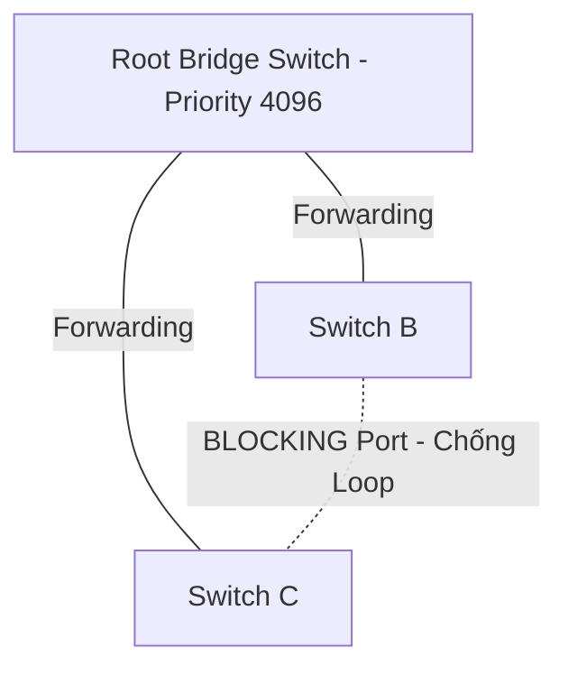

# 🌐 Chống Vòng Lặp STP (Spanning Tree Protocol) & MTU Jumbo Frames - Chuyên Sâu Mạng Máy Tính Cho DevOps

> 💡 **Bản chất 1 câu**: Cơ chế chống vòng lặp mạng L2 với Spanning Tree Protocol (STP 802.1D, RSTP 802.1w) và tối ưu băng thông với MTU Jumbo Frames 9000 bytes.  
> 🎯 **Trọng tâm thực chiến DevOps**: Nắm vững Root Bridge election, STP States (Blocking, Listening, Learning, Forwarding), RSTP 802.1w, MTU 1500 vs Jumbo Frames 9000 bytes.

---

## 1. 🧠 Hình Hình Dung Nhanh (Intuitive Mindset)

STP như cảnh sát giao thông tại ngã tư: Khi thấy 2 con đường nối vòng tròn giữa các Switch (dễ gây kẹt xe vô tận Broadcast Storm), cảnh sát tạm thời dựng rào chắn 1 con đường (Blocking). Khi con đường chính bị sập, cảnh sát dỡ rào cho xe đi tiếp.

---

## 2. 📚 Lý Thuyết Chuyên Sâu & Bản Chất Mạng (Under The Hood Architecture)

### 2.1 Cơ Chế Chống Vòng Lặp Spanning Tree Protocol (STP)



1. **Vấn Đề Vòng Lặp Layer 2 (L2 Loop / Broadcast Storm)**:
   - Do Ethernet Frame KHÔNG CÓ trường TTL (Time to Live) như IP Packet, nếu đấu nối dây dự phòng tạo thành vòng lặp giữa các Switch, gói tin Broadcast sẽ chạy vòng tròn mãi mãi -> Đánh sập toàn bộ mạng LAN trong vài giây!
2. **Nguyên Lý Hoạt Động Của STP (IEEE 802.1D / RSTP 802.1w)**:
   - Bầu chọn **Root Bridge** (Switch có Bridge ID = `Priority + MAC` nhỏ nhất).
   - Khóa các cổng dự phòng ở trạng thái **Blocking State** để ngắt vòng lặp.
   - Khi đường chính hỏng, RSTP tự động chuyển cổng khóa sang **Forwarding State** trong vài giây.
3. **Tối Ưu Dung Lượng Gói Tin MTU & Jumbo Frames**:
   - **MTU Standard (Mặc định)**: **1500 bytes**.
   - **Jumbo Frames**: Mở rộng MTU lên **9000 bytes**.
   - **Ứng dụng**: Giảm tải CPU và tăng tốc độ truyền dữ liệu trong mạng lưu trữ SAN, iSCSI, NFS và Datacenter Interconnect.


---

## 3. ⚡ Bảng Tra Cứu Câu Lệnh & Khái Niệm Thực Hành (Reference Table)

| Công cụ / Lệnh / Khái niệm | Tham số / Flag / Protocol | Giải thích ý nghĩa chi tiết | Ứng dụng thực tế trong DevOps / Network |
| :--- | :--- | :--- | :--- |
| **`STP (802.1D)`** | `Layer 2 Protocol` | Giao thức tự động phát hiện và khóa cổng ngắt vòng lặp L2 | `Bảo vệ mạng LAN không bị bão hòa` |
| **`RSTP (802.1w)`** | `Rapid STP` | Phiên bản STP cải tiến chuyển trạng thái cực nhanh (1-2s) | `Chuẩn chống loop hiện đại` |
| **`MTU`** | `Maximum Transmission Unit` | Kích thước gói tin lớn nhất được truyền qua cạc mạng | `Mặc định 1500 bytes` |
| **`Jumbo Frames`** | `MTU 9000` | Gói tin kích thước lớn 9000 bytes cho đĩa SAN/iSCSI | `Tối ưu I/O mạng lưu trữ SAN/NFS` |


---

## 4. 🛠 Thao Tác Thực Chiến & Kịch Bản DevOps (Real-World Scenarios)

### 🛠 Các lệnh thực hành gõ là ăn ngay:
```bash
# Đặt MTU 9000 (Jumbo Frames) cho card mạng kết nối SAN Storage:
sudo ip link set dev eth1 mtu 9000

# Test ping kiểm tra Jumbo Frames không bị phân đoạn (Don't Fragment):
ping -M do -s 8972 10.0.0.50
```

### 🚀 Kịch bản xử lý sự cố thực tế khi đi làm:
Sự cố mạng LAN bị treo cứng 100% CPU do vô tình cắm 2 đầu dây mạng vào cùng 1 Switch chưa bật STP:
# Xử lý: Rút dây mạng bị loop và bật Spanning Tree Protocol trên Switch.

---

## 5. 🚀 Bộ Câu Hỏi Phỏng Vấn DevOps & Network Thực Tế (Interview Q&A)

> **Q: Tại sao vòng lặp Layer 2 (L2 Loop) lại nguy hiểm hơn vòng lặp Layer 3 (L3 Loop)?**  
> **A**: Vì Ethernet Frame ở Layer 2 KHÔNG CÓ trường TTL, gói tin Broadcast sẽ chạy lặp vô tận gây nên thảm họa Broadcast Storm đánh sập mạng. IP Packet ở Layer 3 có trường TTL tự giảm về 0 và tự hủy.

> **Q: Kích thước MTU mặc định và MTU Jumbo Frames lần lượt là bao nhiêu bytes?**  
> **A**: MTU mặc định là **1500 bytes**, Jumbo Frames mở rộng lên **9000 bytes**.


---

## 6. 📝 Cheat Sheet & Ghi Nhớ Nhanh (Summary)

- [x] STP / RSTP: Tự động khóa cổng ngăn L2 Broadcast Storm
- [x] Root Bridge: Switch có Bridge ID nhỏ nhất
- [x] MTU mặc định: 1500 bytes
- [x] Jumbo Frames: MTU 9000 bytes cho SAN Storage

