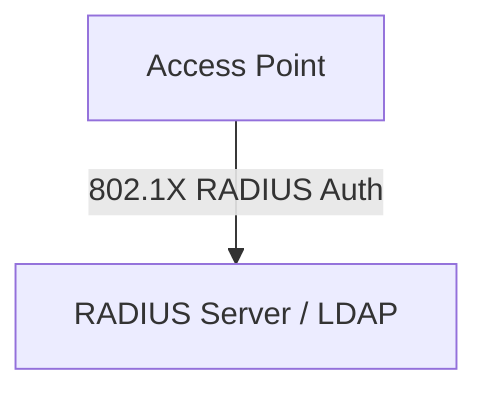

# 🌐 06.Wireless_Networks: Mạng Không Dây Wi-Fi (802.11 Standards, WPA3 & Security) - Chuyên Sâu CompTIA Network+ Cho DevOps

> 💡 **Bản chất 1 câu**: Chuẩn 802.11 (Wi-Fi 4/5/6/6E/7), băng tần (2.4GHz, 5GHz, 6GHz), Antennas (Omni vs Directional), chuẩn bảo mật WPA2/WPA3-...  
> 🎯 **Trọng tâm thực chiến DevOps**: Nắm vững lý thuyết chuyên sâu, sơ đồ kiến trúc, bộ lệnh CLI chẩn đoán thực tế và bộ câu hỏi phỏng vấn tuyển dụng.

---

## 1. 🧠 Hình Hình Dung Nhanh (Intuitive Mindset)

Chuẩn 802.11 (Wi-Fi 4/5/6/6E/7), băng tần (2.4GHz, 5GHz, 6GHz), Antennas (Omni vs Directional), chuẩn bảo mật WPA2/WPA3-SAE, 802.1X Enterprise RADIUS và Captive Portals.



---

## 2. 📚 Lý Thuyết Chuyên Sâu & Bản Chất Hệ Thống (Under The Hood Architecture)

### 2.1 Chi Tiết Các Chuẩn Wi-Fi (OBJ 1.5 & 2.3)
- **Wi-Fi 4 (802.11n)**: 2.4GHz & 5GHz, max 600Mbps, công nghệ MIMO.
- **Wi-Fi 5 (802.11ac)**: **Chỉ 5GHz**, max 6.9Gbps, MU-MIMO & Beamforming.
- **Wi-Fi 6 / 6E (802.11ax)**: 2.4GHz, 5GHz & **6GHz**, max 9.6Gbps, công nghệ **OFDMA**.
- **Wi-Fi 7 (802.11be)**: Băng tần 6GHz, max 46Gbps, công nghệ MLO.

---

### 2.2 Bảo Mật Wi-Fi WPA3 & Enterprise 802.1X
1. **WPA3-SAE**: Sử dụng cơ chế bắt tay **SAE (Simultaneous Authentication of Equals)** chống hoàn toàn tấn công từ điển Offline Dictionary Attack.
2. **802.1X / RADIUS Enterprise**: Xác thực người dùng bằng Username/Password cá nhân trỏ về máy chủ **RADIUS / LDAP Server**.
3. **2.4GHz Channels**: Chỉ có 3 kênh không chồng lấn là **Channel 1, 6, 11**.


---


### 2.4 Cơ Chế Hoạt Động Bên Dưới Kernel & Kiến Trúc Hệ Thống Chi Tiết (Deep Under The Hood Architecture)
- **Tầng Giao Tiếp Mạng & Bắt Gói Tin**: Mọi gói tin đi qua Network Interface Card (NIC) đều trải qua quá trình xử lý Ring Buffer, ngắt phần cứng (Hardware Interrupts), Ring Buffer DMA và chồng giao thức Socket Buffers (`sk_buff`) trong Linux Kernel.
- **Tối Ưu Hóa & Cấu Trúc Dữ Liệu**: Hệ thống duy trì các bảng băm dữ liệu (Routing Table, ARP Cache Table, Connection Tracking Table `conntrack`, Socket Inode Tables) giúp chuyển tiếp gói tin ở tốc độ dây (Line-rate processing).
- **Phân Lập An Ninh & Phân Vùng**: Sử dụng cơ chế Linux Network Namespaces (`ip netns`), iptables/nftables hooks và mã hóa phần cứng để cách ly lưu lượng mạng tuyệt đối.

---

## 3. ⚡ Bảng Tra Cứu Câu Lệnh & Khái Niệm Thực Hành (Reference Table)

| Công cụ / Khái niệm | Loại / Protocol | Ý nghĩa chi tiết | Ứng dụng thực tế |
| :--- | :--- | :--- | :--- |
| **`Wi-Fi 6 (802.11ax)`** | `2.4/5/6GHz` | Chuẩn Wi-Fi công nghệ OFDMA tốc độ 9.6Gbps | `Wi-Fi mật độ cao` |
| **`WPA3-SAE`** | `Security` | Bảo mật Wi-Fi chống hack mật khẩu từ điển Offline | `Bảo mật Wi-Fi cá nhân/doanh nghiệp` |
| **`802.1X RADIUS`** | `Enterprise Auth` | Xác thực user Wi-Fi qua tài khoản Domain tập trung | `Wi-Fi văn phòng công ty` |
| **`Channel 1,6,11`** | `2.4GHz Spectrum` | 3 kênh duy nhất không trùng lấn trên băng tần 2.4GHz | `Cấu hình phân chia Access Point` |


---

## 4. 🛠 Thao Tác Thực Chiến & Kịch Bản DevOps

### 🛠 Các lệnh thực hành gõ là ăn ngay:
```bash
nmcli dev wifi list # Scan mạng Wi-Fi xung quanh trên Linux
```

### 🚀 Kịch bản xử lý sự cố thực tế khi đi làm:
Sự cố Wi-Fi văn phòng bị nghẽn chập chờn do cắm các Access Point cạnh nhau trùng kênh 6 -> Phân chia lại kênh 1, 6, 11 cho các AP lân cận.

---


### 4.2 Chi Tiết Các Lỗi Thường Gặp & Kịch Bản Khắc Phục Lỗi (Troubleshooting Deep-Dive)
1. **Sự cố 1: Lỗi Mất Gói Tin & Mất Kết Nối Cổng Mạng (Packet Loss & Port Unreachable)**:
   - **Triệu chứng**: Gửi HTTP Request bị Timeout, SSH không kết nối được hoặc gói tin bị nảy rải rác.
   - **Các bước xử lý khẩn cấp**:
     ```bash
     # 1. Kiểm tra trạng thái cổng mạng TCP/UDP đang lắng nghe:
     sudo ss -tulpn | grep :80
     
     # 2. Bắt gói tin trực tiếp trên Interface để kiểm tra bắt tay 3 bước TCP:
     sudo tcpdump -i eth0 port 80 -nn -vv
     
     # 3. Phân tích đường đi của gói tin tìm điểm đứt gãy bằng MTR:
     mtr -n --report --report-cycles=10 8.8.8.8
     
     # 4. Kiểm tra xem gói tin có bị Firewall Drop không:
     sudo iptables -L -n -v | grep DROP
     ```

2. **Sự cố 2: Lỗi Sai Cấu Hình DNS & Chuyển Tiếp IP (DNS Resolution & IP Routing Error)**:
   - **Triệu chứng**: Ping IP thành công nhưng ping Domain Name báo `Could not resolve host`.
   - **Các bước xử lý khẩn cấp**:
     ```bash
     # 1. Tra cứu thử nghiệm phân giải DNS qua server cụ thể:
     dig @8.8.8.8 company.com +trace
     
     # 2. Kiểm tra file cấu hình DNS resolver địa phương:
     cat /etc/resolv.conf
     
     # 3. Kiểm tra bảng định tuyến Kernel IP Routing Table:
     ip route show default
     ```

---

## 5. 🚀 Bộ Câu Hỏi Phỏng Vấn DevOps & Network Thực Tế (Interview Q&A)

> **Q: Sự nâng cấp bảo mật quan trọng nhất của WPA3 so với WPA2 là gì?**  
> **A**: WPA3 sử dụng bắt tay SAE thay thế cho PSK 4-way handshake, ngăn chặn tuyệt đối các cuộc tấn công quét từ điển Offline (Offline Dictionary Attack).

> **Q: Ba kênh sóng nào trong băng tần 2.4GHz không bị chồng lấn sóng (Non-overlapping channels)?**  
> **A**: Kênh **1, 6 và 11**.


> **Q: Làm thế nào để điều tra và dập tắt sự cố một Server bị tấn công làm tràn bộ đệm kết nối TCP SYN Flood DoS?**  
> **A**:  
> 1. **Nhận biết**: Lệnh `ss -ant | grep SYN_RECV | wc -l` trả về hàng ngàn kết nối ở trạng thái `SYN_RECV`.  
> 2. **Xử lý khẩn cấp**: Bật ngay cơ chế **SYN Cookies** của Linux Kernel bằng lệnh `sudo sysctl -w net.ipv4.tcp_syncookies=1`. Kích hoạt bộ lọc Firewall drop các gói tin SYN có tần suất bất thường: `sudo iptables -A INPUT -p tcp --syn -m limit --limit 1/s --limit-burst 3 -j ACCEPT`.

> **Q: Sự khác biệt về mặt bản chất giữa Stateful Firewall và Stateless Firewall là gì?**  
> **A**: Stateless Firewall chỉ kiểm tra từng gói tin riêng rẻ dựa trên IP nguồn/đích và Port mà KHÔNG nhớ ngữ cảnh. Stateful Firewall duy trì một bảng theo dõi trạng thái kết nối (**Connection Tracking Table `conntrack`**), tự động nhận diện gói tin thuộc về một kết nối hợp lệ đã được chấp nhận trước đó (như trạng thái `ESTABLISHED,RELATED`), giúp bảo mật và tối ưu hiệu năng vượt trội.

---

## 6. 📝 Cheat Sheet Ghi Nhớ Nhanh (Summary)

- [x] Wi-Fi 5: Chỉ 5GHz
- [x] Wi-Fi 6 (802.11ax): 2.4/5/6GHz, OFDMA
- [x] WPA3-SAE: Chống hack từ điển
- [x] 802.1X RADIUS: Wi-Fi Enterprise theo User/Pass
- [x] 2.4GHz non-overlap: 1, 6, 11

