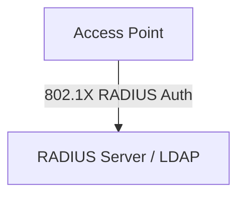

# 🌐 06.Wireless_Networks: Mạng Không Dây Wi-Fi (802.11 Standards, WPA3 & Security) - Chuyên Sâu CompTIA Network+ Cho DevOps

> 💡 **Bản chất 1 câu**: Chuẩn 802.11 (Wi-Fi 4/5/6/6E/7), băng tần (2.4GHz, 5GHz, 6GHz), Antennas (Omni vs Directional), chuẩn bảo mật WPA2/WPA3-...  
> 🎯 **Trọng tâm thực chiến DevOps**: Nắm vững lý thuyết chuyên sâu, sơ đồ kiến trúc, bộ lệnh CLI chẩn đoán thực tế và bộ câu hỏi phỏng vấn tuyển dụng.

---

## 1. 🧠 Hình Hình Dung Nhanh (Intuitive Mindset)

Chuẩn 802.11 (Wi-Fi 4/5/6/6E/7), băng tần (2.4GHz, 5GHz, 6GHz), Antennas (Omni vs Directional), chuẩn bảo mật WPA2/WPA3-SAE, 802.1X Enterprise RADIUS và Captive Portals.



---

## 2. 📚 Lý Thuyết Chuyên Sâu & Bản Chất Hệ Thống (Under The Hood Architecture)

### 2.1 Chi Tiết Các Chuẩn Wi-Fi (OBJ 1.5 & 2.3)
- **Wi-Fi 4 (802.11n)**: 2.4GHz & 5GHz, max 600Mbps, công nghệ MIMO.
- **Wi-Fi 5 (802.11ac)**: **Chỉ 5GHz**, max 6.9Gbps, MU-MIMO & Beamforming.
- **Wi-Fi 6 / 6E (802.11ax)**: 2.4GHz, 5GHz & **6GHz**, max 9.6Gbps, công nghệ **OFDMA**.
- **Wi-Fi 7 (802.11be)**: Băng tần 6GHz, max 46Gbps, công nghệ MLO.

---

### 2.2 Bảo Mật Wi-Fi WPA3 & Enterprise 802.1X
1. **WPA3-SAE**: Sử dụng cơ chế bắt tay **SAE (Simultaneous Authentication of Equals)** chống hoàn toàn tấn công từ điển Offline Dictionary Attack.
2. **802.1X / RADIUS Enterprise**: Xác thực người dùng bằng Username/Password cá nhân trỏ về máy chủ **RADIUS / LDAP Server**.
3. **2.4GHz Channels**: Chỉ có 3 kênh không chồng lấn là **Channel 1, 6, 11**.


---

## 3. ⚡ Bảng Tra Cứu Câu Lệnh & Khái Niệm Thực Hành (Reference Table)

| Công cụ / Khái niệm | Loại / Protocol | Ý nghĩa chi tiết | Ứng dụng thực tế |
| :--- | :--- | :--- | :--- |
| **`Wi-Fi 6 (802.11ax)`** | `2.4/5/6GHz` | Chuẩn Wi-Fi công nghệ OFDMA tốc độ 9.6Gbps | `Wi-Fi mật độ cao` |
| **`WPA3-SAE`** | `Security` | Bảo mật Wi-Fi chống hack mật khẩu từ điển Offline | `Bảo mật Wi-Fi cá nhân/doanh nghiệp` |
| **`802.1X RADIUS`** | `Enterprise Auth` | Xác thực user Wi-Fi qua tài khoản Domain tập trung | `Wi-Fi văn phòng công ty` |
| **`Channel 1,6,11`** | `2.4GHz Spectrum` | 3 kênh duy nhất không trùng lấn trên băng tần 2.4GHz | `Cấu hình phân chia Access Point` |


---

## 4. 🛠 Thao Tác Thực Chiến & Kịch Bản DevOps

### 🛠 Các lệnh thực hành gõ là ăn ngay:
```bash
nmcli dev wifi list # Scan mạng Wi-Fi xung quanh trên Linux
```

### 🚀 Kịch bản xử lý sự cố thực tế khi đi làm:
Sự cố Wi-Fi văn phòng bị nghẽn chập chờn do cắm các Access Point cạnh nhau trùng kênh 6 -> Phân chia lại kênh 1, 6, 11 cho các AP lân cận.

---

## 5. 🚀 Bộ Câu Hỏi Phỏng Vấn DevOps & Network Thực Tế (Interview Q&A)

> **Q: Sự nâng cấp bảo mật quan trọng nhất của WPA3 so với WPA2 là gì?**  
> **A**: WPA3 sử dụng bắt tay SAE thay thế cho PSK 4-way handshake, ngăn chặn tuyệt đối các cuộc tấn công quét từ điển Offline (Offline Dictionary Attack).

> **Q: Ba kênh sóng nào trong băng tần 2.4GHz không bị chồng lấn sóng (Non-overlapping channels)?**  
> **A**: Kênh **1, 6 và 11**.


---

## 6. 📝 Cheat Sheet Ghi Nhớ Nhanh (Summary)

- [x] Wi-Fi 5: Chỉ 5GHz
- [x] Wi-Fi 6 (802.11ax): 2.4/5/6GHz, OFDMA
- [x] WPA3-SAE: Chống hack từ điển
- [x] 802.1X RADIUS: Wi-Fi Enterprise theo User/Pass
- [x] 2.4GHz non-overlap: 1, 6, 11

