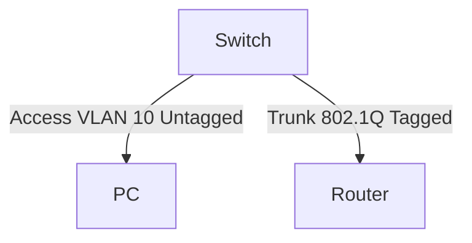

# 🌐 07.Ethernet_Switching: Chuyển Mạch Ethernet, VLANs 802.1Q, STP & Jumbo Frames - Chuyên Sâu CompTIA Network+ Cho DevOps

> 💡 **Bản chất 1 câu**: Ethernet Frame, bảng MAC Address Table (CAM Table), VLANs 802.1Q Tagging (4 bytes), Access vs Trunk Port, Native VLAN, S...  
> 🎯 **Trọng tâm thực chiến DevOps**: Nắm vững lý thuyết chuyên sâu, sơ đồ kiến trúc, bộ lệnh CLI chẩn đoán thực tế và bộ câu hỏi phỏng vấn tuyển dụng.

---

## 1. 🧠 Hình Hình Dung Nhanh (Intuitive Mindset)

Ethernet Frame, bảng MAC Address Table (CAM Table), VLANs 802.1Q Tagging (4 bytes), Access vs Trunk Port, Native VLAN, Spanning Tree Protocol (STP 802.1D/RSTP 802.1w) và MTU Jumbo Frames 9000 bytes.



---

## 2. 📚 Lý Thuyết Chuyên Sâu & Bản Chất Hệ Thống (Under The Hood Architecture)

### 2.1 Bản Chất VLAN & Trunking 802.1Q


 (OBJ 2.2)
- **VLAN**: Phân chia Switch vật lý thành các mạng ảo logic riêng biệt để chia nhỏ Broadcast Domain.
- **Access Port**: Gán cho **1 VLAN duy nhất** nối tới thiết bị cuối (Untagged).
- **Trunk Port**: Truyền dữ liệu của **NHIỀU VLAN** giữa các Switch/Router (Đóng gói **4-byte Tag 802.1Q**).
- **Native VLAN**: VLAN duy nhất đi qua đường Trunk mà KHÔNG DÁN NHÃN (Untagged).

---

### 2.2 Spanning Tree Protocol (STP) & Jumbo Frames
1. **STP (802.1D / RSTP 802.1w)**: Tự động phát hiện và **khóa các cổng dự phòng (Blocking State)** để ngăn ngừa vòng lặp Layer 2 (L2 Loop / Broadcast Storm). Bầu chọn **Root Bridge** dựa vào Bridge ID nhỏ nhất.
2. **Jumbo Frames**: Mở rộng MTU từ 1500 bytes lên **9000 bytes**, tối ưu băng thông và CPU cho mạng lưu trữ SAN, NFS, iSCSI.


---

## 3. ⚡ Bảng Tra Cứu Câu Lệnh & Khái Niệm Thực Hành (Reference Table)

| Công cụ / Khái niệm | Loại / Protocol | Ý nghĩa chi tiết | Ứng dụng thực tế |
| :--- | :--- | :--- | :--- |
| **`VLAN 802.1Q`** | `Layer 2` | Chèn 4-byte Tag chứa 12-bit VLAN ID (1-4094) | `Chia nhỏ mạng nội bộ cách ly` |
| **`Trunk Port`** | `Switchport` | Cổng truyền luồng traffic của nhiều VLAN có gán nhãn 802.1Q | `Nối Switch sang Switch/Router` |
| **`RSTP (802.1w)`** | `Spanning Tree` | Chống vòng lặp L2 Broadcast Storm chuyển trạng thái trong 1-2s | `Bảo vệ mạng LAN` |
| **`Jumbo Frames`** | `MTU 9000` | Gói tin kích thước lớn 9000 bytes cho mạng đĩa SAN/iSCSI | `Tối ưu I/O đĩa SAN Storage` |


---

## 4. 🛠 Thao Tác Thực Chiến & Kịch Bản DevOps

### 🛠 Các lệnh thực hành gõ là ăn ngay:
```bash
sudo ip link add link eth0 name eth0.10 type vlan id 10
sudo ip link set dev eth0 mtu 9000
```

### 🚀 Kịch bản xử lý sự cố thực tế khi đi làm:
Sự cố mạng LAN bị nghẽn 100% CPU do vô tình cắm 2 đầu dây mạng nối vòng tròn giữa 2 Switch chưa bật STP.

---

## 5. 🚀 Bộ Câu Hỏi Phỏng Vấn DevOps & Network Thực Tế (Interview Q&A)

> **Q: Sự khác biệt giữa Access Port và Trunk Port trên Switch là gì?**  
> **A**: Access Port chỉ thuộc về 1 VLAN duy nhất nối tới thiết bị cuối (Untagged). Trunk Port truyền dữ liệu của nhiều VLAN dán nhãn 802.1Q nối giữa các thiết bị mạng.

> **Q: Kích thước MTU mặc định và MTU Jumbo Frames lần lượt là bao nhiêu?**  
> **A**: MTU mặc định là **1500 bytes**, Jumbo Frames mở rộng lên **9000 bytes**.


---

## 6. 📝 Cheat Sheet Ghi Nhớ Nhanh (Summary)

- [x] VLAN 802.1Q: 4 bytes Tag
- [x] Access Port: 1 VLAN (Untagged)
- [x] Trunk Port: Nhiều VLAN (Tagged)
- [x] RSTP: Chống lặp L2 Broadcast Storm
- [x] Jumbo Frames: MTU 9000 bytes

