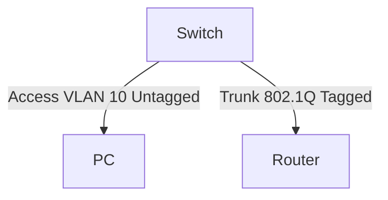
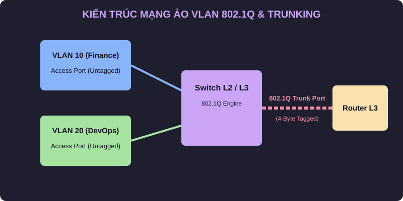

# 🌐 07.Ethernet_Switching: Chuyển Mạch Ethernet, VLANs 802.1Q, STP & Jumbo Frames - Chuyên Sâu CompTIA Network+ Cho DevOps

> 💡 **Bản chất 1 câu**: Ethernet Frame, bảng MAC Address Table (CAM Table), VLANs 802.1Q Tagging (4 bytes), Access vs Trunk Port, Native VLAN, S...  
> 🎯 **Trọng tâm thực chiến DevOps**: Nắm vững lý thuyết chuyên sâu, sơ đồ kiến trúc, bộ lệnh CLI chẩn đoán thực tế và bộ câu hỏi phỏng vấn tuyển dụng.

---

## 1. 🧠 Hình Hình Dung Nhanh (Intuitive Mindset)

Ethernet Frame, bảng MAC Address Table (CAM Table), VLANs 802.1Q Tagging (4 bytes), Access vs Trunk Port, Native VLAN, Spanning Tree Protocol (STP 802.1D/RSTP 802.1w) và MTU Jumbo Frames 9000 bytes.



---

## 2. 📚 Lý Thuyết Chuyên Sâu & Bản Chất Hệ Thống (Under The Hood Architecture)

### 2.1 Bản Chất VLAN & Trunking 802.1Q


 (OBJ 2.2)
- **VLAN**: Phân chia Switch vật lý thành các mạng ảo logic riêng biệt để chia nhỏ Broadcast Domain.
- **Access Port**: Gán cho **1 VLAN duy nhất** nối tới thiết bị cuối (Untagged).
- **Trunk Port**: Truyền dữ liệu của **NHIỀU VLAN** giữa các Switch/Router (Đóng gói **4-byte Tag 802.1Q**).
- **Native VLAN**: VLAN duy nhất đi qua đường Trunk mà KHÔNG DÁN NHÃN (Untagged).

---

### 2.2 Spanning Tree Protocol (STP) & Jumbo Frames
1. **STP (802.1D / RSTP 802.1w)**: Tự động phát hiện và **khóa các cổng dự phòng (Blocking State)** để ngăn ngừa vòng lặp Layer 2 (L2 Loop / Broadcast Storm). Bầu chọn **Root Bridge** dựa vào Bridge ID nhỏ nhất.
2. **Jumbo Frames**: Mở rộng MTU từ 1500 bytes lên **9000 bytes**, tối ưu băng thông và CPU cho mạng lưu trữ SAN, NFS, iSCSI.


---


### 2.4 Cơ Chế Hoạt Động Bên Dưới Kernel & Kiến Trúc Hệ Thống Chi Tiết (Deep Under The Hood Architecture)
- **Tầng Giao Tiếp Mạng & Bắt Gói Tin**: Mọi gói tin đi qua Network Interface Card (NIC) đều trải qua quá trình xử lý Ring Buffer, ngắt phần cứng (Hardware Interrupts), Ring Buffer DMA và chồng giao thức Socket Buffers (`sk_buff`) trong Linux Kernel.
- **Tối Ưu Hóa & Cấu Trúc Dữ Liệu**: Hệ thống duy trì các bảng băm dữ liệu (Routing Table, ARP Cache Table, Connection Tracking Table `conntrack`, Socket Inode Tables) giúp chuyển tiếp gói tin ở tốc độ dây (Line-rate processing).
- **Phân Lập An Ninh & Phân Vùng**: Sử dụng cơ chế Linux Network Namespaces (`ip netns`), iptables/nftables hooks và mã hóa phần cứng để cách ly lưu lượng mạng tuyệt đối.

---

## 3. ⚡ Bảng Tra Cứu Câu Lệnh & Khái Niệm Thực Hành (Reference Table)

| Công cụ / Khái niệm | Loại / Protocol | Ý nghĩa chi tiết | Ứng dụng thực tế |
| :--- | :--- | :--- | :--- |
| **`VLAN 802.1Q`** | `Layer 2` | Chèn 4-byte Tag chứa 12-bit VLAN ID (1-4094) | `Chia nhỏ mạng nội bộ cách ly` |
| **`Trunk Port`** | `Switchport` | Cổng truyền luồng traffic của nhiều VLAN có gán nhãn 802.1Q | `Nối Switch sang Switch/Router` |
| **`RSTP (802.1w)`** | `Spanning Tree` | Chống vòng lặp L2 Broadcast Storm chuyển trạng thái trong 1-2s | `Bảo vệ mạng LAN` |
| **`Jumbo Frames`** | `MTU 9000` | Gói tin kích thước lớn 9000 bytes cho mạng đĩa SAN/iSCSI | `Tối ưu I/O đĩa SAN Storage` |


---

## 4. 🛠 Thao Tác Thực Chiến & Kịch Bản DevOps

### 🛠 Các lệnh thực hành gõ là ăn ngay:
```bash
sudo ip link add link eth0 name eth0.10 type vlan id 10
sudo ip link set dev eth0 mtu 9000
```

### 🚀 Kịch bản xử lý sự cố thực tế khi đi làm:
Sự cố mạng LAN bị nghẽn 100% CPU do vô tình cắm 2 đầu dây mạng nối vòng tròn giữa 2 Switch chưa bật STP.

---


### 4.2 Chi Tiết Các Lỗi Thường Gặp & Kịch Bản Khắc Phục Lỗi (Troubleshooting Deep-Dive)
1. **Sự cố 1: Lỗi Mất Gói Tin & Mất Kết Nối Cổng Mạng (Packet Loss & Port Unreachable)**:
   - **Triệu chứng**: Gửi HTTP Request bị Timeout, SSH không kết nối được hoặc gói tin bị nảy rải rác.
   - **Các bước xử lý khẩn cấp**:
     ```bash
     # 1. Kiểm tra trạng thái cổng mạng TCP/UDP đang lắng nghe:
     sudo ss -tulpn | grep :80
     
     # 2. Bắt gói tin trực tiếp trên Interface để kiểm tra bắt tay 3 bước TCP:
     sudo tcpdump -i eth0 port 80 -nn -vv
     
     # 3. Phân tích đường đi của gói tin tìm điểm đứt gãy bằng MTR:
     mtr -n --report --report-cycles=10 8.8.8.8
     
     # 4. Kiểm tra xem gói tin có bị Firewall Drop không:
     sudo iptables -L -n -v | grep DROP
     ```

2. **Sự cố 2: Lỗi Sai Cấu Hình DNS & Chuyển Tiếp IP (DNS Resolution & IP Routing Error)**:
   - **Triệu chứng**: Ping IP thành công nhưng ping Domain Name báo `Could not resolve host`.
   - **Các bước xử lý khẩn cấp**:
     ```bash
     # 1. Tra cứu thử nghiệm phân giải DNS qua server cụ thể:
     dig @8.8.8.8 company.com +trace
     
     # 2. Kiểm tra file cấu hình DNS resolver địa phương:
     cat /etc/resolv.conf
     
     # 3. Kiểm tra bảng định tuyến Kernel IP Routing Table:
     ip route show default
     ```

---

## 5. 🚀 Bộ Câu Hỏi Phỏng Vấn DevOps & Network Thực Tế (Interview Q&A)

> **Q: Sự khác biệt giữa Access Port và Trunk Port trên Switch là gì?**  
> **A**: Access Port chỉ thuộc về 1 VLAN duy nhất nối tới thiết bị cuối (Untagged). Trunk Port truyền dữ liệu của nhiều VLAN dán nhãn 802.1Q nối giữa các thiết bị mạng.

> **Q: Kích thước MTU mặc định và MTU Jumbo Frames lần lượt là bao nhiêu?**  
> **A**: MTU mặc định là **1500 bytes**, Jumbo Frames mở rộng lên **9000 bytes**.


> **Q: Làm thế nào để điều tra và dập tắt sự cố một Server bị tấn công làm tràn bộ đệm kết nối TCP SYN Flood DoS?**  
> **A**:  
> 1. **Nhận biết**: Lệnh `ss -ant | grep SYN_RECV | wc -l` trả về hàng ngàn kết nối ở trạng thái `SYN_RECV`.  
> 2. **Xử lý khẩn cấp**: Bật ngay cơ chế **SYN Cookies** của Linux Kernel bằng lệnh `sudo sysctl -w net.ipv4.tcp_syncookies=1`. Kích hoạt bộ lọc Firewall drop các gói tin SYN có tần suất bất thường: `sudo iptables -A INPUT -p tcp --syn -m limit --limit 1/s --limit-burst 3 -j ACCEPT`.

> **Q: Sự khác biệt về mặt bản chất giữa Stateful Firewall và Stateless Firewall là gì?**  
> **A**: Stateless Firewall chỉ kiểm tra từng gói tin riêng rẻ dựa trên IP nguồn/đích và Port mà KHÔNG nhớ ngữ cảnh. Stateful Firewall duy trì một bảng theo dõi trạng thái kết nối (**Connection Tracking Table `conntrack`**), tự động nhận diện gói tin thuộc về một kết nối hợp lệ đã được chấp nhận trước đó (như trạng thái `ESTABLISHED,RELATED`), giúp bảo mật và tối ưu hiệu năng vượt trội.

---

## 6. 📝 Cheat Sheet Ghi Nhớ Nhanh (Summary)

- [x] VLAN 802.1Q: 4 bytes Tag
- [x] Access Port: 1 VLAN (Untagged)
- [x] Trunk Port: Nhiều VLAN (Tagged)
- [x] RSTP: Chống lặp L2 Broadcast Storm
- [x] Jumbo Frames: MTU 9000 bytes

