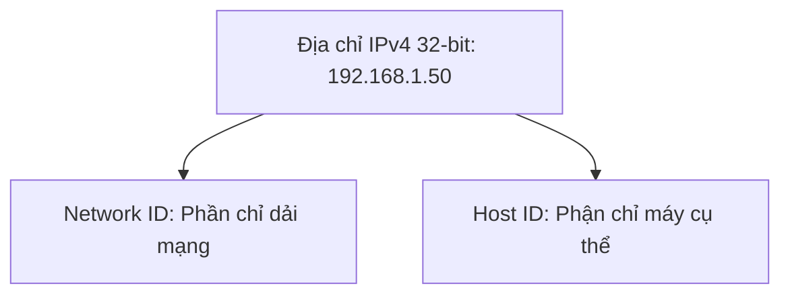

# 🌐 Địa Chỉ IPv4, Phân Lớp & Dải IP Private (RFC 1918) - Chuyên Sâu Mạng Máy Tính Cho DevOps

> 💡 **Bản chất 1 câu**: Phân tích cấu trúc IPv4 32-bit (4 Octets), các lớp địa chỉ A/B/C/D/E, dải địa chỉ IP Private (RFC 1918) vs IP Public, Loopback và APIPA.  
> 🎯 **Trọng tâm thực chiến DevOps**: Nắm vững dải IP Private (10.0.0.0/8, 172.16.0.0/12, 192.168.0.0/16), IP Loopback (127.0.0.1), APIPA (169.254.x.x) và phân biệt Public vs Private IP.

---

## 1. 🧠 Hình Hình Dung Nhanh (Intuitive Mindset)

IP Public như số điện thoại quốc tế có thể gọi từ bất kỳ đâu trên thế giới. IP Private như số máy lẻ nội bộ công ty (101, 102): Muốn gọi ra ngoài thế giới phải qua tổng đài NAT.

---

## 2. 📚 Lý Thuyết Chuyên Sâu & Bản Chất Mạng (Under The Hood Architecture)

### 2.1 Cấu Trúc Địa Chỉ IPv4 & Các Phân Lớp (IPv4 Classes)
Địa chỉ IPv4 gồm **32 bits**, chia thành **4 Octets** (mỗi Octet 8 bits) phân cách bởi dấu chấm.



| Class | Dải IP đầu tiên | Default Subnet Mask | Số lượng Hosts tối đa | Mục đích sử dụng |
| :--- | :--- | :--- | :--- | :--- |
| **Class A** | `1.0.0.0` - `126.255.255.255` | `255.0.0.0` (`/8`) | 16,777,214 hosts | Mạng tập đoàn cực lớn |
| **Class B** | `128.0.0.0` - `191.255.255.255` | `255.255.0.0` (`/16`) | 65,534 hosts | Mạng quy mô trung bình |
| **Class C** | `192.0.0.0` - `223.255.255.255` | `255.255.255.0` (`/24`)| 254 hosts | Mạng nhỏ / Văn phòng |
| **Class D** | `224.0.0.0` - `239.255.255.255` | N/A | Multicast | Dành cho Multicast traffic |
| **Class E** | `240.0.0.0` - `255.255.255.255` | N/A | Experimental | Dành cho nghiên cứu |

---

### 2.2 Các Dải Địa Chỉ IP Đặc Biệt Cần Thuộc
1. **Dải IP Private (RFC 1918 - Dùng trong LAN / AWS VPC)**:
   - **Class A**: `10.0.0.0` đến `10.255.255.255` (`10.0.0.0/8`).
   - **Class B**: `172.16.0.0` đến `172.31.255.255` (`172.16.0.0/12`).
   - **Class C**: `192.168.0.0` đến `192.168.255.255` (`192.168.0.0/16`).
2. **Loopback Address**: `127.0.0.1` (`127.0.0.0/8`) - Trỏ ngược về chính card mạng nội bộ máy tính (localhost).
3. **APIPA (Automatic Private IP Addressing)**: `169.254.0.0/16` - Tự động gán khi máy không nhận được IP từ DHCP Server.


---

## 3. ⚡ Bảng Tra Cứu Câu Lệnh & Khái Niệm Thực Hành (Reference Table)

| Công cụ / Lệnh / Khái niệm | Tham số / Flag / Protocol | Giải thích ý nghĩa chi tiết | Ứng dụng thực tế trong DevOps / Network |
| :--- | :--- | :--- | :--- |
| **`RFC 1918`** | `Standard` | Chuẩn định nghĩa các dải IP Private không thể định tuyến trên Internet | `Cấu hình IP LAN / AWS VPC` |
| **`127.0.0.1`** | `Loopback` | Địa chỉ localhost kiểm tra IP stack nội bộ máy | `Test ứng dụng web local` |
| **`169.254.x.x`** | `APIPA` | IP tự động gán khi lỗi kết nối tới DHCP Server | `Cảnh báo lỗi ngắt mạng DHCP` |
| **`0.0.0.0/0`** | `Default Route` | Đại diện cho tất cả các địa chỉ IP trên Internet | `Tuyến đường mặc định ra Internet` |


---

## 4. 🛠 Thao Tác Thực Chiến & Kịch Bản DevOps (Real-World Scenarios)

### 🛠 Các lệnh thực hành gõ là ăn ngay:
```bash
# Xem địa chỉ IP của tất cả các interface trên Linux:
ip -4 addr show
```

### 🚀 Kịch bản xử lý sự cố thực tế khi đi làm:
Sự cố máy tính nhân viên nhận địa chỉ IP dạng 169.254.45.10:
# Chẩn đoán: Đây là IP APIPA -> Máy tính hoàn toàn không nhận được gói tin từ DHCP Server (kiểm tra dây cáp hoặc dịch vụ DHCP).

---

## 5. 🚀 Bộ Câu Hỏi Phỏng Vấn DevOps & Network Thực Tế (Interview Q&A)

> **Q: Liệt kê 3 dải địa chỉ IP Private theo chuẩn RFC 1918?**  
> **A**: 10.0.0.0/8 (Class A), 172.16.0.0/12 (Class B), 192.168.0.0/16 (Class C).

> **Q: Địa chỉ IP APIPA (169.254.x.x) xuất hiện khi nào?**  
> **A**: Xuất hiện khi máy tính được cấu hình nhận IP tự động qua DHCP nhưng không thể kết nối hoặc nhận được phản hồi từ DHCP Server.


---

## 6. 📝 Cheat Sheet & Ghi Nhớ Nhanh (Summary)

- [x] IPv4: 32-bit (4 octets)
- [x] IP Private Class A: 10.0.0.0/8
- [x] IP Private Class B: 172.16.0.0/12
- [x] IP Private Class C: 192.168.0.0/16
- [x] Loopback: 127.0.0.1
- [x] APIPA: 169.254.x.x (lỗi DHCP)

