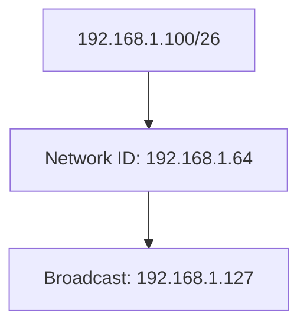

# 🌐 08.IP_Addressing_and_Subnetting: Bậc Thầy Địa Chỉ IP, Subnetting & CIDR (IPv4 & IPv6) - Chuyên Sâu CompTIA Network+ Cho DevOps

> 💡 **Bản chất 1 câu**: Cấu trúc IPv4 32-bit, Phân lớp A/B/C, dải IP Private (RFC 1918), Loopback, APIPA, Toán Subnetting $2^H-2$, cờ CIDR (`/24...  
> 🎯 **Trọng tâm thực chiến DevOps**: Nắm vững lý thuyết chuyên sâu, sơ đồ kiến trúc, bộ lệnh CLI chẩn đoán thực tế và bộ câu hỏi phỏng vấn tuyển dụng.

---

## 1. 🧠 Hình Hình Dung Nhanh (Intuitive Mindset)

Cấu trúc IPv4 32-bit, Phân lớp A/B/C, dải IP Private (RFC 1918), Loopback, APIPA, Toán Subnetting $2^H-2$, cờ CIDR (`/24`, `/26`, `/28`, `/30`), IPv6 128-bit (Global Unicast, Link-Local fe80::, SLAAC) và Dual-Stack.



---

## 2. 📚 Lý Thuyết Chuyên Sâu & Bản Chất Hệ Thống (Under The Hood Architecture)

### 2.1 Địa Chỉ IPv4 & Dải IP Private RFC 1918 (OBJ 1.5 & 1.7)
- **Class A Private**: `10.0.0.0/8` (`10.0.0.0` - `10.255.255.255`).
- **Class B Private**: `172.16.0.0/12` (`172.16.0.0` - `172.31.255.255`).
- **Class C Private**: `192.168.0.0/16` (`192.168.0.0` - `192.168.255.255`).
- **Loopback**: `127.0.0.1`. **APIPA**: `169.254.0.0/16` (Lỗi không nhận được DHCP).

---

### 2.2 Công Thức & Bảng Subnetting CIDR
- **Số Usable IPs**: $2^H - 2$ ($H = 32 - 	ext{CIDR}$).
- **`/24`**: Subnet Mask `255.255.255.0` -> **254 Usable IPs**.
- **`/26`**: Subnet Mask `255.255.255.192` -> **62 Usable IPs**.
- **`/28`**: Subnet Mask `255.255.255.240` -> **14 Usable IPs**.
- **`/30`**: Subnet Mask `255.255.255.252` -> **2 Usable IPs** (Nối 2 Routers P2P).

---

### 2.3 Địa Chỉ IPv6 (128-bit)
- **Global Unicast**: `2000::/3` (IP Public định tuyến Internet).
- **Link-Local**: `fe80::/10` (IP nội bộ tự động có trên mọi card mạng).
- **SLAAC**: Tự động tạo địa chỉ IPv6 từ Router Advertisement mà không cần DHCP Server.


---

## 3. ⚡ Bảng Tra Cứu Câu Lệnh & Khái Niệm Thực Hành (Reference Table)

| Công cụ / Khái niệm | Loại / Protocol | Ý nghĩa chi tiết | Ứng dụng thực tế |
| :--- | :--- | :--- | :--- |
| **`RFC 1918`** | `Private IP` | Dải IP Private không định tuyến Internet | `Cấu hình IP LAN / AWS VPC` |
| **`ipcalc`** | `Subnet Tool` | Tính toán chi tiết dải Subnetting CIDR | `ipcalc 10.0.1.0/26` |
| **`fe80::/10`** | `Link-Local` | Địa chỉ IPv6 nội bộ tự động có trên cạc mạng | `Giao tiếp LAN IPv6` |
| **`SLAAC`** | `IPv6 Autoconfig` | Tự động cấp IP IPv6 từ Router Advertisement | `Cấp IP tự động không cần DHCP` |


---

## 4. 🛠 Thao Tác Thực Chiến & Kịch Bản DevOps

### 🛠 Các lệnh thực hành gõ là ăn ngay:
```bash
ipcalc 192.168.1.100/26
ip -6 addr show
```

### 🚀 Kịch bản xử lý sự cố thực tế khi đi làm:
Sự cố máy tính nhân viên nhận địa chỉ IP APIPA 169.254.12.50 do dây mạng bị rút không nối tới DHCP Server.

---

## 5. 🚀 Bộ Câu Hỏi Phỏng Vấn DevOps & Network Thực Tế (Interview Q&A)

> **Q: Công thức tính số lượng địa chỉ IP sử dụng được (Usable IPs) trong một Subnet là gì?**  
> **A**: Công thức là $2^H - 2$ (trong đó $H = 32 - 	ext{CIDR}$, trừ 2 địa chỉ cho Network ID và Broadcast ID).

> **Q: Địa chỉ IPv6 Link-Local bắt đầu bằng các ký tự Hex nào?**  
> **A**: Bắt đầu bằng **`fe80::/10`**.


---

## 6. 📝 Cheat Sheet Ghi Nhớ Nhanh (Summary)

- [x] RFC 1918: 10.0.0.0/8, 172.16.0.0/12, 192.168.0.0/16
- [x] Usable IPs = $2^{(32-	ext{CIDR})} - 2$
- [x] /24: 254 IPs, /30: 2 IPs
- [x] fe80::/10: Link-Local IPv6
- [x] APIPA: 169.254.x.x (lỗi DHCP)

