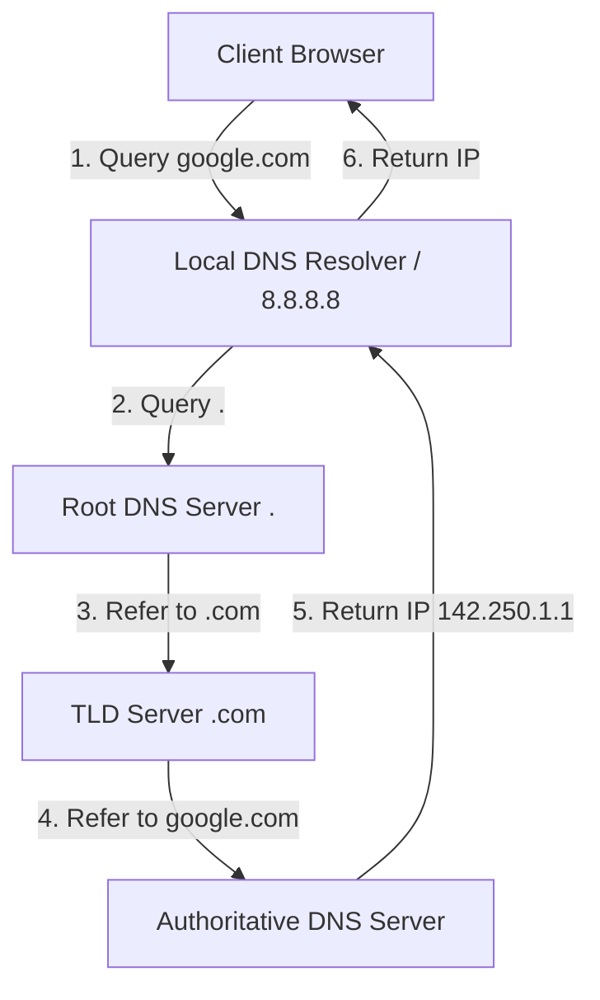

# 🌐 Các Dịch Vụ Mạng Cốt Lõi: DNS, DHCP, NTP & QoS - Chuyên Sâu Mạng Máy Tính Cho DevOps

> 💡 **Bản chất 1 câu**: Phân tích chuyên sâu kiến trúc dịch vụ mạng: DNS Resolution Hierarchy & Record Types, DHCP DORA Handshake, NTP time sync và QoS Traffic Shaping.  
> 🎯 **Trọng tâm thực chiến DevOps**: Nắm vững các bản ghi DNS (A, AAAA, CNAME, MX, TXT, PTR, NS, SOA, DNSSEC), quy trình DHCP DORA, đồng bộ giờ NTP và xếp ưu tiên QoS (DiffServ/CoS).

---

## 1. 🧠 Hình Hình Dung Nhanh (Intuitive Mindset)

DNS như thư viện chuyển đổi ngôn ngữ: Người dùng gõ tên dễ nhớ `google.com`, DNS phân cấp từ Root (.) -> TLD (.com) -> Authoritative Server để tìm ra địa chỉ IP `142.250.1.1`.

---

## 2. 📚 Lý Thuyết Chuyên Sâu & Bản Chất Mạng (Under The Hood Architecture)

### 2.1 Kiến Trúc Phân Giải Tên Miền DNS (DNS Hierarchy & Resolution)



1. **Các Loại Bản Ghi DNS Cốt Lõi (DNS Records)**:
   - **A**: Map Domain -> IPv4.
   - **AAAA**: Map Domain -> IPv6.
   - **CNAME**: Map Alias Domain -> Target Domain.
   - **MX**: Chỉ định Mail Server nhận mail.
   - **TXT**: Chứa văn bản (Dùng cấu hình SPF, DKIM, DMARC, SSL Verification).
   - **PTR**: Reverse DNS (Map IP -> Domain).
   - **NS**: Chỉ định Name Server quản lý Zone.
   - **SOA**: Khai báo thông số quản lý Zone (Serial, Refresh, Retry).

---

### 2.2 Đồng Bộ Thời Gian NTP & Chất Lượng Dịch Vụ QoS
- **NTP (Network Time Protocol - UDP Port 123)**: Đồng bộ giờ hệ thống chính xác milisecond. Lệch giờ gây hỏng authentication JWT Token, TLS cert và đồng bộ DB!
- **QoS (Quality of Service)**:
  - Phân loại và ưu tiên gói tin quan trọng (như VoIP, Video Call) trước gói tin không nhạy cảm thời gian (như Tải file, Email).
  - Khái niệm **DiffServ (DSCP)** gõ nhãn ưu tiên tại Layer 3 Header; **CoS (802.1p)** gõ nhãn ưu tiên tại Layer 2 Header.


---

## 3. ⚡ Bảng Tra Cứu Câu Lệnh & Khái Niệm Thực Hành (Reference Table)

| Công cụ / Lệnh / Khái niệm | Tham số / Flag / Protocol | Giải thích ý nghĩa chi tiết | Ứng dụng thực tế trong DevOps / Network |
| :--- | :--- | :--- | :--- |
| **`dig`** | `Công cụ tra cứu DNS chuyên sâu` | +short, A, MX, TXT, PTR | `dig google.com A +short` |
| **`chrony / ntp`** | `Dịch vụ đồng bộ thời gian NTP` | chronyc sources | `chronyc sources` |
| **`DHCP DORA`** | `Protocol Flow` | Discover -> Offer -> Request -> Acknowledge | `Cấp IP tự động` |
| **`QoS DSCP`** | `Layer 3 QoS` | Dán nhãn độ ưu tiên gói tin trong IP Header | `Ưu tiên luồng thoại VoIP` |


---

## 4. 🛠 Thao Tác Thực Chiến & Kịch Bản DevOps (Real-World Scenarios)

### 🛠 Các lệnh thực hành gõ là ăn ngay:
```bash
# Tra cứu bản ghi TXT xác thực SPF/DKIM của Google bằng dig:
dig google.com TXT

# Kiểm tra trạng thái đồng bộ giờ NTP:
chronyc tracking
```

### 🚀 Kịch bản xử lý sự cố thực tế khi đi làm:
Sự cố Kubernetes Cluster gặp lỗi lặp DNS resolution timeout do coredns bị quá tải:
# Fix: Cấu hình Local DNS Caching NodeLocal DNSCache trong Kubernetes Cluster.

---

## 5. 🚀 Bộ Câu Hỏi Phỏng Vấn DevOps & Network Thực Tế (Interview Q&A)

> **Q: Quy trình 4 bước cấp phát IP tự động của DHCP Server viết tắt là gì?**  
> **A**: Viết tắt là **DORA** (Discover, Offer, Request, Acknowledge).

> **Q: Bản ghi DNS nào được dùng để xác thực quyền gửi email (SPF, DKIM) hoặc xác minh sở hữu tên miền cho SSL?**  
> **A**: Bản ghi **TXT Record**.


---

## 6. 📝 Cheat Sheet & Ghi Nhớ Nhanh (Summary)

- [x] DNS Hierarchy: Root (.) -> TLD (.com) -> Authoritative
- [x] A: IPv4, AAAA: IPv6, CNAME: Biệt hiệu, MX: Mail, TXT: Auth
- [x] NTP (Port 123): Đồng bộ thời gian
- [x] QoS: Ưu tiên gói tin VoIP/Video

