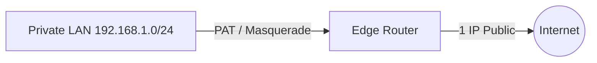

# 🌐 09.Routing_and_Protocols: Định Tuyến Router, Routing Table, OSPF, BGP & NAT - Chuyên Sâu CompTIA Network+ Cho DevOps

> 💡 **Bản chất 1 câu**: Cấu trúc bảng định tuyến Routing Table, Administrative Distance (AD), OSPF (Link-State AD 110), BGP (Path-Vector AD 20),...  
> 🎯 **Trọng tâm thực chiến DevOps**: Nắm vững lý thuyết chuyên sâu, sơ đồ kiến trúc, bộ lệnh CLI chẩn đoán thực tế và bộ câu hỏi phỏng vấn tuyển dụng.

---

## 1. 🧠 Hình Hình Dung Nhanh (Intuitive Mindset)

Cấu trúc bảng định tuyến Routing Table, Administrative Distance (AD), OSPF (Link-State AD 110), BGP (Path-Vector AD 20), EIGRP, SNAT, DNAT, PAT / Masquerade, Router Redundancy (VRRP/HSRP) và GRE Tunnels.



---

## 2. 📚 Lý Thuyết Chuyên Sâu & Bản Chất Hệ Thống (Under The Hood Architecture)

### 2.1 Bảng Administrative Distance (AD) Độ Ưu Tiên
Router chọn đường đi từ nguồn có **AD NHỎ NHẤT**:
- **Directly Connected**: **0**
- **Static Route**: **1**
- **eBGP**: **20**
- **EIGRP**: **90**
- **OSPF**: **110**
- **RIP**: **120**

---

### 2.2 OSPF vs BGP & Cơ Chế NAT / PAT (OBJ 2.1)
1. **OSPF (Open Shortest Path First - AD 110)**: Giao thức Link-State dùng thuật toán Dijkstra tìm đường ngắn nhất theo Bandwidth. Dùng cho nội bộ LAN / Datacenter.
2. **BGP (Border Gateway Protocol - AD 20)**: Giao thức Path-Vector định tuyến giữa các nhà mạng ISP trên toàn bộ **Internet Toàn Cầu**.
3. **PAT (Port Address Translation / Masquerade)**: Gom hàng ngàn IP Private ra ngoài qua **DUY NHẤT 1 IP Public** bằng cách phân biệt theo các số Port nguồn ngẫu nhiên!


---


### 2.4 Cơ Chế Hoạt Động Bên Dưới Kernel & Kiến Trúc Hệ Thống Chi Tiết (Deep Under The Hood Architecture)
- **Tầng Giao Tiếp Mạng & Bắt Gói Tin**: Mọi gói tin đi qua Network Interface Card (NIC) đều trải qua quá trình xử lý Ring Buffer, ngắt phần cứng (Hardware Interrupts), Ring Buffer DMA và chồng giao thức Socket Buffers (`sk_buff`) trong Linux Kernel.
- **Tối Ưu Hóa & Cấu Trúc Dữ Liệu**: Hệ thống duy trì các bảng băm dữ liệu (Routing Table, ARP Cache Table, Connection Tracking Table `conntrack`, Socket Inode Tables) giúp chuyển tiếp gói tin ở tốc độ dây (Line-rate processing).
- **Phân Lập An Ninh & Phân Vùng**: Sử dụng cơ chế Linux Network Namespaces (`ip netns`), iptables/nftables hooks và mã hóa phần cứng để cách ly lưu lượng mạng tuyệt đối.

---

## 3. ⚡ Bảng Tra Cứu Câu Lệnh & Khái Niệm Thực Hành (Reference Table)

| Công cụ / Khái niệm | Loại / Protocol | Ý nghĩa chi tiết | Ứng dụng thực tế |
| :--- | :--- | :--- | :--- |
| **`ip route`** | `Routing Table` | Xem và thao tác bảng định tuyến Routing Table | `ip route show / add` |
| **`OSPF`** | `Link-State AD 110` | Giao thức định tuyến nội bộ LAN/Datacenter | `Định tuyến nội bộ Datacenter` |
| **`BGP`** | `Path-Vector AD 20` | Giao thức định tuyến Internet toàn cầu giữa các ISP | `Định tuyến ISP / AWS DirectConnect` |
| **`PAT / Masquerade`** | `NAT Type` | Gom nhiều IP Private ra Internet qua 1 IP Public | `Router WiFi / VPC NAT Gateway` |


---

## 4. 🛠 Thao Tác Thực Chiến & Kịch Bản DevOps

### 🛠 Các lệnh thực hành gõ là ăn ngay:
```bash
ip route show
sudo ip route add 10.200.0.0/16 via 192.168.1.254
```

### 🚀 Kịch bản xử lý sự cố thực tế khi đi làm:
Sự cố vỡ tuyến đường Routing Loop khiến gói tin chạy lặp vô tận giữa 2 Router -> Kiểm tra bằng traceroute.

---


### 4.2 Chi Tiết Các Lỗi Thường Gặp & Kịch Bản Khắc Phục Lỗi (Troubleshooting Deep-Dive)
1. **Sự cố 1: Lỗi Mất Gói Tin & Mất Kết Nối Cổng Mạng (Packet Loss & Port Unreachable)**:
   - **Triệu chứng**: Gửi HTTP Request bị Timeout, SSH không kết nối được hoặc gói tin bị nảy rải rác.
   - **Các bước xử lý khẩn cấp**:
     ```bash
     # 1. Kiểm tra trạng thái cổng mạng TCP/UDP đang lắng nghe:
     sudo ss -tulpn | grep :80
     
     # 2. Bắt gói tin trực tiếp trên Interface để kiểm tra bắt tay 3 bước TCP:
     sudo tcpdump -i eth0 port 80 -nn -vv
     
     # 3. Phân tích đường đi của gói tin tìm điểm đứt gãy bằng MTR:
     mtr -n --report --report-cycles=10 8.8.8.8
     
     # 4. Kiểm tra xem gói tin có bị Firewall Drop không:
     sudo iptables -L -n -v | grep DROP
     ```

2. **Sự cố 2: Lỗi Sai Cấu Hình DNS & Chuyển Tiếp IP (DNS Resolution & IP Routing Error)**:
   - **Triệu chứng**: Ping IP thành công nhưng ping Domain Name báo `Could not resolve host`.
   - **Các bước xử lý khẩn cấp**:
     ```bash
     # 1. Tra cứu thử nghiệm phân giải DNS qua server cụ thể:
     dig @8.8.8.8 company.com +trace
     
     # 2. Kiểm tra file cấu hình DNS resolver địa phương:
     cat /etc/resolv.conf
     
     # 3. Kiểm tra bảng định tuyến Kernel IP Routing Table:
     ip route show default
     ```

---

## 5. 🚀 Bộ Câu Hỏi Phỏng Vấn DevOps & Network Thực Tế (Interview Q&A)

> **Q: Số Administrative Distance (AD) của Static Route và OSPF lần lượt là bao nhiêu?**  
> **A**: Static Route có AD = **1**, OSPF có AD = **110** (AD nhỏ hơn được ưu tiên hơn).

> **Q: Cơ chế PAT (Port Address Translation / Masquerade) hoạt động như thế nào?**  
> **A**: PAT gom hàng ngàn địa chỉ IP Private truy cập Internet đồng thời qua duy nhất một địa chỉ IP Public nhờ phân biệt qua các số Port nguồn ngẫu nhiên.


> **Q: Làm thế nào để điều tra và dập tắt sự cố một Server bị tấn công làm tràn bộ đệm kết nối TCP SYN Flood DoS?**  
> **A**:  
> 1. **Nhận biết**: Lệnh `ss -ant | grep SYN_RECV | wc -l` trả về hàng ngàn kết nối ở trạng thái `SYN_RECV`.  
> 2. **Xử lý khẩn cấp**: Bật ngay cơ chế **SYN Cookies** của Linux Kernel bằng lệnh `sudo sysctl -w net.ipv4.tcp_syncookies=1`. Kích hoạt bộ lọc Firewall drop các gói tin SYN có tần suất bất thường: `sudo iptables -A INPUT -p tcp --syn -m limit --limit 1/s --limit-burst 3 -j ACCEPT`.

> **Q: Sự khác biệt về mặt bản chất giữa Stateful Firewall và Stateless Firewall là gì?**  
> **A**: Stateless Firewall chỉ kiểm tra từng gói tin riêng rẻ dựa trên IP nguồn/đích và Port mà KHÔNG nhớ ngữ cảnh. Stateful Firewall duy trì một bảng theo dõi trạng thái kết nối (**Connection Tracking Table `conntrack`**), tự động nhận diện gói tin thuộc về một kết nối hợp lệ đã được chấp nhận trước đó (như trạng thái `ESTABLISHED,RELATED`), giúp bảo mật và tối ưu hiệu năng vượt trội.

---

## 6. 📝 Cheat Sheet Ghi Nhớ Nhanh (Summary)

- [x] AD nhỏ = Ưu tiên (Connected 0, Static 1, BGP 20, OSPF 110)
- [x] OSPF: Link-State cho nội bộ LAN
- [x] BGP: Path-Vector cho Internet ISP
- [x] PAT: Gom LAN ra 1 IP Public

