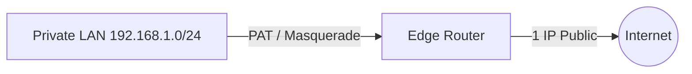

# 🌐 09.Routing_and_Protocols: Định Tuyến Router, Routing Table, OSPF, BGP & NAT - Chuyên Sâu CompTIA Network+ Cho DevOps

> 💡 **Bản chất 1 câu**: Cấu trúc bảng định tuyến Routing Table, Administrative Distance (AD), OSPF (Link-State AD 110), BGP (Path-Vector AD 20),...  
> 🎯 **Trọng tâm thực chiến DevOps**: Nắm vững lý thuyết chuyên sâu, sơ đồ kiến trúc, bộ lệnh CLI chẩn đoán thực tế và bộ câu hỏi phỏng vấn tuyển dụng.

---

## 1. 🧠 Hình Hình Dung Nhanh (Intuitive Mindset)

Cấu trúc bảng định tuyến Routing Table, Administrative Distance (AD), OSPF (Link-State AD 110), BGP (Path-Vector AD 20), EIGRP, SNAT, DNAT, PAT / Masquerade, Router Redundancy (VRRP/HSRP) và GRE Tunnels.



---

## 2. 📚 Lý Thuyết Chuyên Sâu & Bản Chất Hệ Thống (Under The Hood Architecture)

### 2.1 Bảng Administrative Distance (AD) Độ Ưu Tiên
Router chọn đường đi từ nguồn có **AD NHỎ NHẤT**:
- **Directly Connected**: **0**
- **Static Route**: **1**
- **eBGP**: **20**
- **EIGRP**: **90**
- **OSPF**: **110**
- **RIP**: **120**

---

### 2.2 OSPF vs BGP & Cơ Chế NAT / PAT (OBJ 2.1)
1. **OSPF (Open Shortest Path First - AD 110)**: Giao thức Link-State dùng thuật toán Dijkstra tìm đường ngắn nhất theo Bandwidth. Dùng cho nội bộ LAN / Datacenter.
2. **BGP (Border Gateway Protocol - AD 20)**: Giao thức Path-Vector định tuyến giữa các nhà mạng ISP trên toàn bộ **Internet Toàn Cầu**.
3. **PAT (Port Address Translation / Masquerade)**: Gom hàng ngàn IP Private ra ngoài qua **DUY NHẤT 1 IP Public** bằng cách phân biệt theo các số Port nguồn ngẫu nhiên!


---

## 3. ⚡ Bảng Tra Cứu Câu Lệnh & Khái Niệm Thực Hành (Reference Table)

| Công cụ / Khái niệm | Loại / Protocol | Ý nghĩa chi tiết | Ứng dụng thực tế |
| :--- | :--- | :--- | :--- |
| **`ip route`** | `Routing Table` | Xem và thao tác bảng định tuyến Routing Table | `ip route show / add` |
| **`OSPF`** | `Link-State AD 110` | Giao thức định tuyến nội bộ LAN/Datacenter | `Định tuyến nội bộ Datacenter` |
| **`BGP`** | `Path-Vector AD 20` | Giao thức định tuyến Internet toàn cầu giữa các ISP | `Định tuyến ISP / AWS DirectConnect` |
| **`PAT / Masquerade`** | `NAT Type` | Gom nhiều IP Private ra Internet qua 1 IP Public | `Router WiFi / VPC NAT Gateway` |


---

## 4. 🛠 Thao Tác Thực Chiến & Kịch Bản DevOps

### 🛠 Các lệnh thực hành gõ là ăn ngay:
```bash
ip route show
sudo ip route add 10.200.0.0/16 via 192.168.1.254
```

### 🚀 Kịch bản xử lý sự cố thực tế khi đi làm:
Sự cố vỡ tuyến đường Routing Loop khiến gói tin chạy lặp vô tận giữa 2 Router -> Kiểm tra bằng traceroute.

---

## 5. 🚀 Bộ Câu Hỏi Phỏng Vấn DevOps & Network Thực Tế (Interview Q&A)

> **Q: Số Administrative Distance (AD) của Static Route và OSPF lần lượt là bao nhiêu?**  
> **A**: Static Route có AD = **1**, OSPF có AD = **110** (AD nhỏ hơn được ưu tiên hơn).

> **Q: Cơ chế PAT (Port Address Translation / Masquerade) hoạt động như thế nào?**  
> **A**: PAT gom hàng ngàn địa chỉ IP Private truy cập Internet đồng thời qua duy nhất một địa chỉ IP Public nhờ phân biệt qua các số Port nguồn ngẫu nhiên.


---

## 6. 📝 Cheat Sheet Ghi Nhớ Nhanh (Summary)

- [x] AD nhỏ = Ưu tiên (Connected 0, Static 1, BGP 20, OSPF 110)
- [x] OSPF: Link-State cho nội bộ LAN
- [x] BGP: Path-Vector cho Internet ISP
- [x] PAT: Gom LAN ra 1 IP Public

