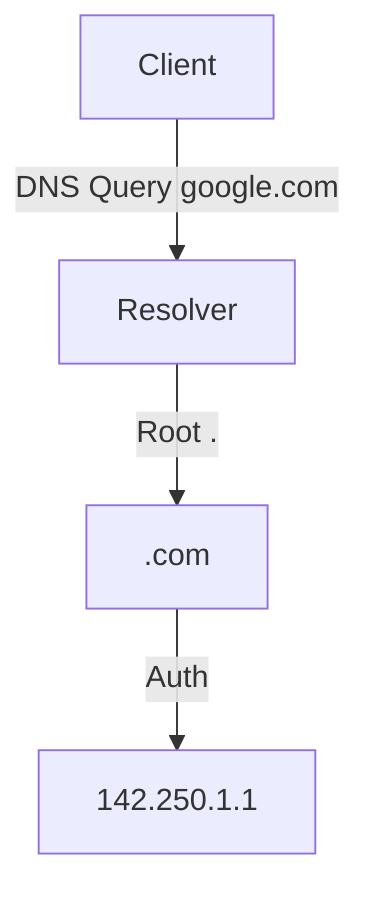
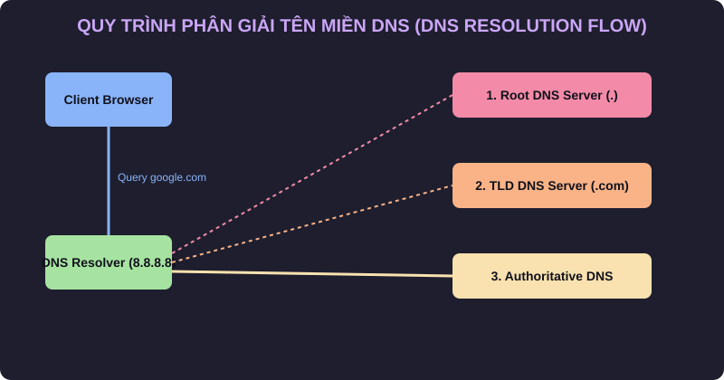

# 🌐 10.Network_Services: Các Dịch Vụ Mạng Cốt Lõi: DNS, DHCP, NTP & QoS - Chuyên Sâu CompTIA Network+ Cho DevOps

> 💡 **Bản chất 1 câu**: Hệ thống phân giải tên miền DNS Hierarchy (Root->TLD->Auth), bản ghi DNS (A, AAAA, CNAME, MX, TXT, PTR, NS, SOA, DNSSEC)...  
> 🎯 **Trọng tâm thực chiến DevOps**: Nắm vững lý thuyết chuyên sâu, sơ đồ kiến trúc, bộ lệnh CLI chẩn đoán thực tế và bộ câu hỏi phỏng vấn tuyển dụng.

---

## 1. 🧠 Hình Hình Dung Nhanh (Intuitive Mindset)

Hệ thống phân giải tên miền DNS Hierarchy (Root->TLD->Auth), bản ghi DNS (A, AAAA, CNAME, MX, TXT, PTR, NS, SOA, DNSSEC), DHCP DORA Handshake, NTP time sync (Port 123) và QoS Traffic Shaping (DSCP/CoS).



---

## 2. 📚 Lý Thuyết Chuyên Sâu & Bản Chất Hệ Thống (Under The Hood Architecture)

### 2.1 Bản Ghi DNS Record Types Cốt Lõi


 (OBJ 3.4)
- **A**: Trỏ Domain -> IPv4.
- **AAAA**: Trỏ Domain -> IPv6.
- **CNAME**: Trỏ Biệt hiệu Domain -> Domain gốc.
- **MX**: Trỏ tới Mail Server nhận mail.
- **TXT**: Chứa văn bản xác thực (SPF, DKIM, DMARC, SSL Ownership).
- **PTR**: Reverse DNS (Trỏ IP -> Domain).

---

### 2.2 DHCP DORA & NTP / QoS
1. **DHCP DORA Flow**: **Discover** (Client broadcast tìm DHCP) -> **Offer** (Server mời IP) -> **Request** (Client xin nhận IP) -> **Acknowledge** (Server chốt cấp IP).
2. **NTP (UDP 123)**: Đồng bộ giờ chính xác milisecond. Lệch giờ gây hỏng TLS cert, JWT Token và DB replication!
3. **QoS**: Phân loại và ưu tiên luồng thoại VoIP/Video Call trước dữ liệu download (DiffServ DSCP ở L3 Header).


---


### 2.4 Cơ Chế Hoạt Động Bên Dưới Kernel & Kiến Trúc Hệ Thống Chi Tiết (Deep Under The Hood Architecture)
- **Tầng Giao Tiếp Mạng & Bắt Gói Tin**: Mọi gói tin đi qua Network Interface Card (NIC) đều trải qua quá trình xử lý Ring Buffer, ngắt phần cứng (Hardware Interrupts), Ring Buffer DMA và chồng giao thức Socket Buffers (`sk_buff`) trong Linux Kernel.
- **Tối Ưu Hóa & Cấu Trúc Dữ Liệu**: Hệ thống duy trì các bảng băm dữ liệu (Routing Table, ARP Cache Table, Connection Tracking Table `conntrack`, Socket Inode Tables) giúp chuyển tiếp gói tin ở tốc độ dây (Line-rate processing).
- **Phân Lập An Ninh & Phân Vùng**: Sử dụng cơ chế Linux Network Namespaces (`ip netns`), iptables/nftables hooks và mã hóa phần cứng để cách ly lưu lượng mạng tuyệt đối.

---

## 3. ⚡ Bảng Tra Cứu Câu Lệnh & Khái Niệm Thực Hành (Reference Table)

| Công cụ / Khái niệm | Loại / Protocol | Ý nghĩa chi tiết | Ứng dụng thực tế |
| :--- | :--- | :--- | :--- |
| **`dig`** | `DNS Tool` | Tra cứu bản ghi DNS chi tiết chuyên sâu | `dig google.com TXT +short` |
| **`DHCP DORA`** | `Protocol Flow` | Discover -> Offer -> Request -> Acknowledge | `Cấp IP tự động` |
| **`NTP (UDP 123)`** | `Time Sync` | Đồng bộ giờ hệ thống chính xác milisecond | `chronyc tracking` |
| **`QoS DSCP`** | `Quality of Service` | Dán nhãn ưu tiên gói tin nhạy cảm thời gian (VoIP) | `Ưu tiên luồng thoại VoIP` |


---

## 4. 🛠 Thao Tác Thực Chiến & Kịch Bản DevOps

### 🛠 Các lệnh thực hành gõ là ăn ngay:
```bash
dig google.com TXT
chronyc tracking
```

### 🚀 Kịch bản xử lý sự cố thực tế khi đi làm:
Sự cố hệ thống Kubernetes / Microservices bị từ chối xác thực JWT Token do giờ hệ thống giữa 2 server lệch nhau 5 phút (Sửa bằng chrony NTP).

---


### 4.2 Chi Tiết Các Lỗi Thường Gặp & Kịch Bản Khắc Phục Lỗi (Troubleshooting Deep-Dive)
1. **Sự cố 1: Lỗi Mất Gói Tin & Mất Kết Nối Cổng Mạng (Packet Loss & Port Unreachable)**:
   - **Triệu chứng**: Gửi HTTP Request bị Timeout, SSH không kết nối được hoặc gói tin bị nảy rải rác.
   - **Các bước xử lý khẩn cấp**:
     ```bash
     # 1. Kiểm tra trạng thái cổng mạng TCP/UDP đang lắng nghe:
     sudo ss -tulpn | grep :80
     
     # 2. Bắt gói tin trực tiếp trên Interface để kiểm tra bắt tay 3 bước TCP:
     sudo tcpdump -i eth0 port 80 -nn -vv
     
     # 3. Phân tích đường đi của gói tin tìm điểm đứt gãy bằng MTR:
     mtr -n --report --report-cycles=10 8.8.8.8
     
     # 4. Kiểm tra xem gói tin có bị Firewall Drop không:
     sudo iptables -L -n -v | grep DROP
     ```

2. **Sự cố 2: Lỗi Sai Cấu Hình DNS & Chuyển Tiếp IP (DNS Resolution & IP Routing Error)**:
   - **Triệu chứng**: Ping IP thành công nhưng ping Domain Name báo `Could not resolve host`.
   - **Các bước xử lý khẩn cấp**:
     ```bash
     # 1. Tra cứu thử nghiệm phân giải DNS qua server cụ thể:
     dig @8.8.8.8 company.com +trace
     
     # 2. Kiểm tra file cấu hình DNS resolver địa phương:
     cat /etc/resolv.conf
     
     # 3. Kiểm tra bảng định tuyến Kernel IP Routing Table:
     ip route show default
     ```

---

## 5. 🚀 Bộ Câu Hỏi Phỏng Vấn DevOps & Network Thực Tế (Interview Q&A)

> **Q: Quy trình 4 bước cấp IP tự động của DHCP Server viết tắt là gì?**  
> **A**: Viết tắt là **DORA** (Discover, Offer, Request, Acknowledge).

> **Q: Bản ghi DNS nào được dùng để xác thực quyền gửi email (SPF, DKIM) hoặc xác minh sở hữu tên miền?**  
> **A**: Bản ghi **TXT Record**.


> **Q: Làm thế nào để điều tra và dập tắt sự cố một Server bị tấn công làm tràn bộ đệm kết nối TCP SYN Flood DoS?**  
> **A**:  
> 1. **Nhận biết**: Lệnh `ss -ant | grep SYN_RECV | wc -l` trả về hàng ngàn kết nối ở trạng thái `SYN_RECV`.  
> 2. **Xử lý khẩn cấp**: Bật ngay cơ chế **SYN Cookies** của Linux Kernel bằng lệnh `sudo sysctl -w net.ipv4.tcp_syncookies=1`. Kích hoạt bộ lọc Firewall drop các gói tin SYN có tần suất bất thường: `sudo iptables -A INPUT -p tcp --syn -m limit --limit 1/s --limit-burst 3 -j ACCEPT`.

> **Q: Sự khác biệt về mặt bản chất giữa Stateful Firewall và Stateless Firewall là gì?**  
> **A**: Stateless Firewall chỉ kiểm tra từng gói tin riêng rẻ dựa trên IP nguồn/đích và Port mà KHÔNG nhớ ngữ cảnh. Stateful Firewall duy trì một bảng theo dõi trạng thái kết nối (**Connection Tracking Table `conntrack`**), tự động nhận diện gói tin thuộc về một kết nối hợp lệ đã được chấp nhận trước đó (như trạng thái `ESTABLISHED,RELATED`), giúp bảo mật và tối ưu hiệu năng vượt trội.

---

## 6. 📝 Cheat Sheet Ghi Nhớ Nhanh (Summary)

- [x] A: IPv4, AAAA: IPv6, CNAME: Alias, MX: Mail, TXT: Auth
- [x] DHCP DORA: Discover-Offer-Request-ACK
- [x] NTP (Port 123): Đồng bộ thời gian
- [x] QoS: Ưu tiên gói tin VoIP

