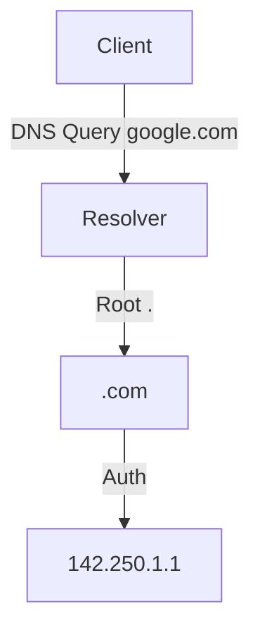

# 🌐 10.Network_Services: Các Dịch Vụ Mạng Cốt Lõi: DNS, DHCP, NTP & QoS - Chuyên Sâu CompTIA Network+ Cho DevOps

> 💡 **Bản chất 1 câu**: Hệ thống phân giải tên miền DNS Hierarchy (Root->TLD->Auth), bản ghi DNS (A, AAAA, CNAME, MX, TXT, PTR, NS, SOA, DNSSEC)...  
> 🎯 **Trọng tâm thực chiến DevOps**: Nắm vững lý thuyết chuyên sâu, sơ đồ kiến trúc, bộ lệnh CLI chẩn đoán thực tế và bộ câu hỏi phỏng vấn tuyển dụng.

---

## 1. 🧠 Hình Hình Dung Nhanh (Intuitive Mindset)

Hệ thống phân giải tên miền DNS Hierarchy (Root->TLD->Auth), bản ghi DNS (A, AAAA, CNAME, MX, TXT, PTR, NS, SOA, DNSSEC), DHCP DORA Handshake, NTP time sync (Port 123) và QoS Traffic Shaping (DSCP/CoS).



---

## 2. 📚 Lý Thuyết Chuyên Sâu & Bản Chất Hệ Thống (Under The Hood Architecture)

### 2.1 Bản Ghi DNS Record Types Cốt Lõi (OBJ 3.4)
- **A**: Trỏ Domain -> IPv4.
- **AAAA**: Trỏ Domain -> IPv6.
- **CNAME**: Trỏ Biệt hiệu Domain -> Domain gốc.
- **MX**: Trỏ tới Mail Server nhận mail.
- **TXT**: Chứa văn bản xác thực (SPF, DKIM, DMARC, SSL Ownership).
- **PTR**: Reverse DNS (Trỏ IP -> Domain).

---

### 2.2 DHCP DORA & NTP / QoS
1. **DHCP DORA Flow**: **Discover** (Client broadcast tìm DHCP) -> **Offer** (Server mời IP) -> **Request** (Client xin nhận IP) -> **Acknowledge** (Server chốt cấp IP).
2. **NTP (UDP 123)**: Đồng bộ giờ chính xác milisecond. Lệch giờ gây hỏng TLS cert, JWT Token và DB replication!
3. **QoS**: Phân loại và ưu tiên luồng thoại VoIP/Video Call trước dữ liệu download (DiffServ DSCP ở L3 Header).


---

## 3. ⚡ Bảng Tra Cứu Câu Lệnh & Khái Niệm Thực Hành (Reference Table)

| Công cụ / Khái niệm | Loại / Protocol | Ý nghĩa chi tiết | Ứng dụng thực tế |
| :--- | :--- | :--- | :--- |
| **`dig`** | `DNS Tool` | Tra cứu bản ghi DNS chi tiết chuyên sâu | `dig google.com TXT +short` |
| **`DHCP DORA`** | `Protocol Flow` | Discover -> Offer -> Request -> Acknowledge | `Cấp IP tự động` |
| **`NTP (UDP 123)`** | `Time Sync` | Đồng bộ giờ hệ thống chính xác milisecond | `chronyc tracking` |
| **`QoS DSCP`** | `Quality of Service` | Dán nhãn ưu tiên gói tin nhạy cảm thời gian (VoIP) | `Ưu tiên luồng thoại VoIP` |


---

## 4. 🛠 Thao Tác Thực Chiến & Kịch Bản DevOps

### 🛠 Các lệnh thực hành gõ là ăn ngay:
```bash
dig google.com TXT
chronyc tracking
```

### 🚀 Kịch bản xử lý sự cố thực tế khi đi làm:
Sự cố hệ thống Kubernetes / Microservices bị từ chối xác thực JWT Token do giờ hệ thống giữa 2 server lệch nhau 5 phút (Sửa bằng chrony NTP).

---

## 5. 🚀 Bộ Câu Hỏi Phỏng Vấn DevOps & Network Thực Tế (Interview Q&A)

> **Q: Quy trình 4 bước cấp IP tự động của DHCP Server viết tắt là gì?**  
> **A**: Viết tắt là **DORA** (Discover, Offer, Request, Acknowledge).

> **Q: Bản ghi DNS nào được dùng để xác thực quyền gửi email (SPF, DKIM) hoặc xác minh sở hữu tên miền?**  
> **A**: Bản ghi **TXT Record**.


---

## 6. 📝 Cheat Sheet Ghi Nhớ Nhanh (Summary)

- [x] A: IPv4, AAAA: IPv6, CNAME: Alias, MX: Mail, TXT: Auth
- [x] DHCP DORA: Discover-Offer-Request-ACK
- [x] NTP (Port 123): Đồng bộ thời gian
- [x] QoS: Ưu tiên gói tin VoIP

