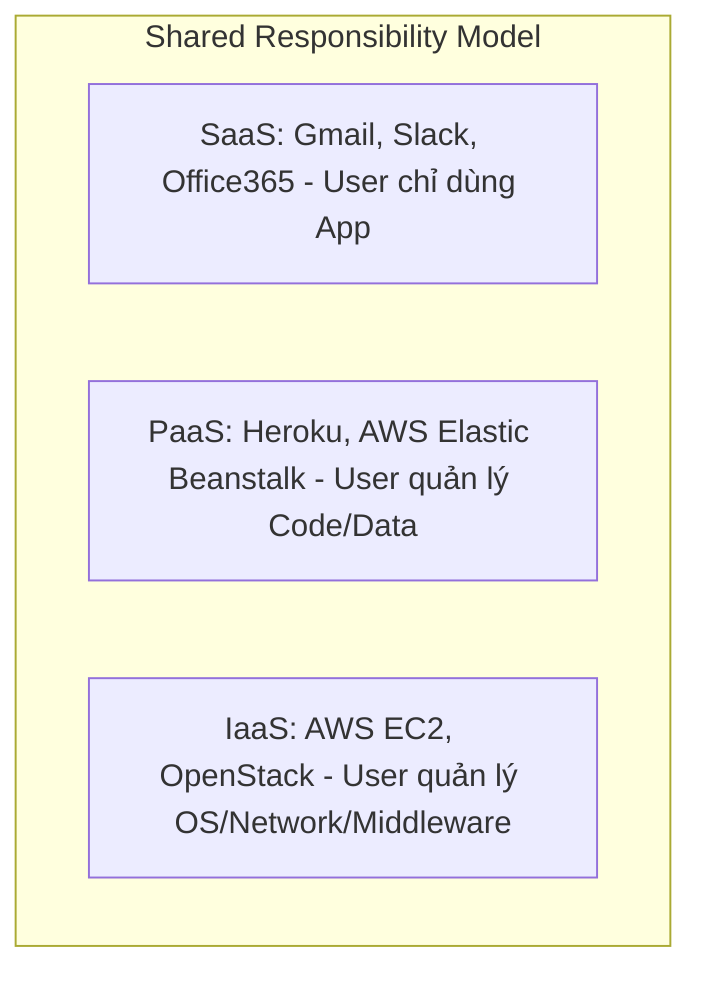

# 🌐 Kiến Trúc Đám Mây Cloud, SDN, VXLAN & SASE - Chuyên Sâu Mạng Máy Tính Cho DevOps

> 💡 **Bản chất 1 câu**: Chuyên sâu hạ tầng đám mây: Cloud Service Models (IaaS, PaaS, SaaS), Software-Defined Networking (SDN), VXLAN Overlay network, SASE và SSE.  
> 🎯 **Trọng tâm thực chiến DevOps**: Nắm vững IaaS vs PaaS vs SaaS, SDN Control Plane vs Data Plane, VXLAN UDP Port 4789 (mở rộng VLAN từ 4094 lên 16 triệu VNI) và SASE.

---

## 1. 🧠 Hình Hình Dung Nhanh (Intuitive Mindset)

VXLAN như container đường biển chở ô tô: Cả một mạng ảo Layer 2 (Ethernet Frame) được đóng gói chui gọn vào bên trong một gói tin Layer 3 UDP (Port 4789) để bay qua toàn bộ hạ tầng mạng Internet toàn cầu.

---

## 2. 📚 Lý Thuyết Chuyên Sâu & Bản Chất Mạng (Under The Hood Architecture)

### 2.1 Mô Hình Dịch Vụ Đám Mây (Cloud Service Models)



---

### 2.2 Kiến Trúc Mạng Điều Khiển Bằng Phần Mềm (SDN & VXLAN)
1. **Software-Defined Networking (SDN)**:
   - Tách rời bộ não điều khiển (**Control Plane**) ra khỏi thiết bị phần cứng chuyển tiếp dữ liệu (**Data Plane**).
   - Bộ điều khiển trung tâm (SDN Controller) quản lý toàn bộ Topology và tự động đẩy cấu hình xuống hàng ngàn Switch/Router qua API (OpenFlow/NETCONF).
2. **VXLAN (Virtual Extensible LAN - UDP Port 4789)**:
   - Giải quyết giới hạn 4094 VLANs của chuẩn 802.1Q.
   - VXLAN đóng gói (Encapsulate) Ethernet Frame L2 bên trong gói tin **UDP Port 4789 (L3 Overlay Network)**.
   - Sử dụng **VNI (VXLAN Network Identifier) 24-bit**, cho phép tạo tới **16 triệu mạng ảo L2** chạy chồng lên mạng L3 hạ tầng (Underlay)!
3. **SASE (Secure Access Service Edge)**:
   - Hợp nhất công nghệ mạng SD-WAN và bảo mật Cloud (CASB, Zero Trust, FWaaS) thành một dịch vụ quản lý tập trung trên Cloud.


---

## 3. ⚡ Bảng Tra Cứu Câu Lệnh & Khái Niệm Thực Hành (Reference Table)

| Công cụ / Lệnh / Khái niệm | Tham số / Flag / Protocol | Giải thích ý nghĩa chi tiết | Ứng dụng thực tế trong DevOps / Network |
| :--- | :--- | :--- | :--- |
| **`IaaS`** | `Infrastructure as Service` | Cấp phát Máy chủ ảo, Đĩa cứng, Network (AWS EC2) | `Hạ tầng nền tảng cho DevOps` |
| **`PaaS`** | `Platform as Service` | Cấp phát môi trường chạy ứng dụng (Heroku, App Runner) | `Đội Dev chỉ việc push code` |
| **`SDN`** | `Software-Defined Net` | Tách rời Control Plane và Data Plane quản lý qua API | `Quản lý mạng tự động hóa Cloud` |
| **`VXLAN`** | `Overlay Protocol` | Đóng gói L2 vào UDP Port 4789 tạo 16 triệu VNI mạng ảo | `Mạng overlay trong Kubernetes Flannel/Cilium` |


---

## 4. 🛠 Thao Tác Thực Chiến & Kịch Bản DevOps (Real-World Scenarios)

### 🛠 Các lệnh thực hành gõ là ăn ngay:
```bash
# Kiểm tra interface VXLAN overlay trong Kubernetes CNI (Flannel/Cilium):
ip -d link show flannel.1
```

### 🚀 Kịch bản xử lý sự cố thực tế khi đi làm:
Xây dựng hạ tầng Cloud Multi-tenant cho 100,000 khách hàng doanh nghiệp độc lập:
# Sử dụng VXLAN Overlay Network (VNI) để cung cấp dải mạng L2 riêng biệt cho từng khách hàng mà không lo chạm giới hạn 4094 VLAN.

---

## 5. 🚀 Bộ Câu Hỏi Phỏng Vấn DevOps & Network Thực Tế (Interview Q&A)

> **Q: SDN (Software-Defined Networking) thực hiện tách rời 2 mặt phẳng (Planes) nào của thiết bị mạng?**  
> **A**: SDN tách rời **Control Plane** (Mặt phẳng điều khiển/bộ não) và **Data Plane** (Mặt phẳng chuyển tiếp dữ liệu).

> **Q: VXLAN sử dụng UDP Port nào và hỗ trợ tối đa bao nhiêu dải mạng ảo (VNI)?**  
> **A**: VXLAN sử dụng **UDP Port 4789** và hỗ trợ tối đa **16 triệu dải mạng ảo VNI** (24-bit).


---

## 6. 📝 Cheat Sheet & Ghi Nhớ Nhanh (Summary)

- [x] IaaS: Thuê VM/Network (EC2)
- [x] PaaS: Thuê môi trường chạy code
- [x] SaaS: Thuê ứng dụng dùng ngay
- [x] SDN: Tách Control Plane & Data Plane
- [x] VXLAN: Đóng gói L2 vào UDP 4789 (16 triệu VNI)
- [x] SASE: Hợp nhất SD-WAN & Cloud Security

