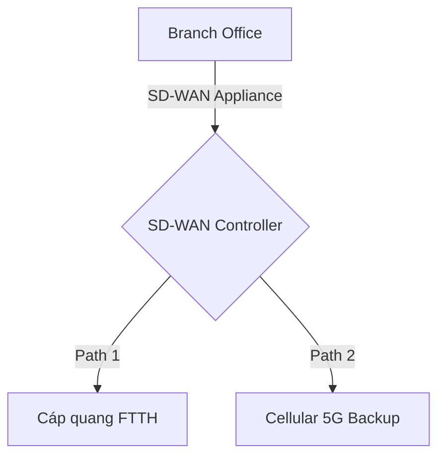

# 🌐 11.Wide_Area_Networks: Các Công Nghệ Mạng Diện Rộng WAN (MPLS, 5G, SD-WAN) - Chuyên Sâu CompTIA Network+ Cho DevOps

> 💡 **Bản chất 1 câu**: Đường truyền WAN: Fiber FTTH, DOCSIS Cable, DSL, Satellite Starlink, Cellular 5G, Leased Lines, MPLS (Layer 2.5 Label Sw...  
> 🎯 **Trọng tâm thực chiến DevOps**: Nắm vững lý thuyết chuyên sâu, sơ đồ kiến trúc, bộ lệnh CLI chẩn đoán thực tế và bộ câu hỏi phỏng vấn tuyển dụng.

---

## 1. 🧠 Hình Hình Dung Nhanh (Intuitive Mindset)

Đường truyền WAN: Fiber FTTH, DOCSIS Cable, DSL, Satellite Starlink, Cellular 5G, Leased Lines, MPLS (Layer 2.5 Label Switching) và SD-WAN.



---

## 2. 📚 Lý Thuyết Chuyên Sâu & Bản Chất Hệ Thống (Under The Hood Architecture)

### 2.1 Các Công Nghệ WAN (OBJ 1.5)
1. **MPLS (Multi-Protocol Label Switching)**: Hoạt động ở tầng **Layer 2.5**. Chuyển tiếp gói tin cực nhanh dựa vào **MPLS Label** mà không cần đọc bảng IP Routing Table. Cam kết chất lượng SLA cao cho doanh nghiệp.
2. **SD-WAN (Software-Defined WAN)**: Tự động đo lường độ trễ (Latency) và rớt gói (Packet Loss) trên nhiều đường truyền (FTTH, 5G, Starlink) để điều phối traffic ứng dụng thông minh bằng phần mềm.
3. **Cellular 5G & Starlink**: Kết nối WAN không dây tốc độ Gbps làm kênh dự phòng Failover khẩn cấp.


---


### 2.4 Cơ Chế Hoạt Động Bên Dưới Kernel & Kiến Trúc Hệ Thống Chi Tiết (Deep Under The Hood Architecture)
- **Tầng Giao Tiếp Mạng & Bắt Gói Tin**: Mọi gói tin đi qua Network Interface Card (NIC) đều trải qua quá trình xử lý Ring Buffer, ngắt phần cứng (Hardware Interrupts), Ring Buffer DMA và chồng giao thức Socket Buffers (`sk_buff`) trong Linux Kernel.
- **Tối Ưu Hóa & Cấu Trúc Dữ Liệu**: Hệ thống duy trì các bảng băm dữ liệu (Routing Table, ARP Cache Table, Connection Tracking Table `conntrack`, Socket Inode Tables) giúp chuyển tiếp gói tin ở tốc độ dây (Line-rate processing).
- **Phân Lập An Ninh & Phân Vùng**: Sử dụng cơ chế Linux Network Namespaces (`ip netns`), iptables/nftables hooks và mã hóa phần cứng để cách ly lưu lượng mạng tuyệt đối.

---

## 3. ⚡ Bảng Tra Cứu Câu Lệnh & Khái Niệm Thực Hành (Reference Table)

| Công cụ / Khái niệm | Loại / Protocol | Ý nghĩa chi tiết | Ứng dụng thực tế |
| :--- | :--- | :--- | :--- |
| **`MPLS`** | `Layer 2.5 WAN` | Chuyển mạch nhãn Label Switching tốc độ cao có SLA | `Kết nối các chi nhánh ngân hàng` |
| **`SD-WAN`** | `Software-Defined` | Điều phối traffic WAN thông minh qua phần mềm | `Tối ưu chi phí WAN doanh nghiệp` |
| **`5G / LTE`** | `Cellular WAN` | Mạng không dây di động tốc độ cao | `Backup kết nối WAN khẩn cấp` |
| **`mtr`** | `WAN Diagnostic` | Đo độ trễ latency và rớt gói packet loss trên WAN | `mtr --report 8.8.8.8` |


---

## 4. 🛠 Thao Tác Thực Chiến & Kịch Bản DevOps

### 🛠 Các lệnh thực hành gõ là ăn ngay:
```bash
mtr --report --report-cycles 10 8.8.8.8
```

### 🚀 Kịch bản xử lý sự cố thực tế khi đi làm:
Thiết lập kênh WAN dự phòng cho ngân hàng: Đường chính MPLS + Đường dự phòng SD-WAN chạy 5G (Tự động failover trong 1s khi đứt cáp quang).

---


### 4.2 Chi Tiết Các Lỗi Thường Gặp & Kịch Bản Khắc Phục Lỗi (Troubleshooting Deep-Dive)
1. **Sự cố 1: Lỗi Mất Gói Tin & Mất Kết Nối Cổng Mạng (Packet Loss & Port Unreachable)**:
   - **Triệu chứng**: Gửi HTTP Request bị Timeout, SSH không kết nối được hoặc gói tin bị nảy rải rác.
   - **Các bước xử lý khẩn cấp**:
     ```bash
     # 1. Kiểm tra trạng thái cổng mạng TCP/UDP đang lắng nghe:
     sudo ss -tulpn | grep :80
     
     # 2. Bắt gói tin trực tiếp trên Interface để kiểm tra bắt tay 3 bước TCP:
     sudo tcpdump -i eth0 port 80 -nn -vv
     
     # 3. Phân tích đường đi của gói tin tìm điểm đứt gãy bằng MTR:
     mtr -n --report --report-cycles=10 8.8.8.8
     
     # 4. Kiểm tra xem gói tin có bị Firewall Drop không:
     sudo iptables -L -n -v | grep DROP
     ```

2. **Sự cố 2: Lỗi Sai Cấu Hình DNS & Chuyển Tiếp IP (DNS Resolution & IP Routing Error)**:
   - **Triệu chứng**: Ping IP thành công nhưng ping Domain Name báo `Could not resolve host`.
   - **Các bước xử lý khẩn cấp**:
     ```bash
     # 1. Tra cứu thử nghiệm phân giải DNS qua server cụ thể:
     dig @8.8.8.8 company.com +trace
     
     # 2. Kiểm tra file cấu hình DNS resolver địa phương:
     cat /etc/resolv.conf
     
     # 3. Kiểm tra bảng định tuyến Kernel IP Routing Table:
     ip route show default
     ```

---

## 5. 🚀 Bộ Câu Hỏi Phỏng Vấn DevOps & Network Thực Tế (Interview Q&A)

> **Q: MPLS hoạt động ở tầng nào trong mô hình OSI và dựa vào đâu để chuyển tiếp gói tin?**  
> **A**: MPLS hoạt động ở tầng **Layer 2.5**, chuyển tiếp gói tin dựa vào **MPLS Label** chèn giữa L2 và L3 Header.

> **Q: Lợi ích lớn nhất của SD-WAN là gì?**  
> **A**: SD-WAN giúp tự động điều phối traffic thông minh qua nhiều đường truyền băng rộng giá rẻ (FTTH, 5G, Satellite) mà vẫn đảm bảo hiệu năng và tính sẵn sàng cao.


> **Q: Làm thế nào để điều tra và dập tắt sự cố một Server bị tấn công làm tràn bộ đệm kết nối TCP SYN Flood DoS?**  
> **A**:  
> 1. **Nhận biết**: Lệnh `ss -ant | grep SYN_RECV | wc -l` trả về hàng ngàn kết nối ở trạng thái `SYN_RECV`.  
> 2. **Xử lý khẩn cấp**: Bật ngay cơ chế **SYN Cookies** của Linux Kernel bằng lệnh `sudo sysctl -w net.ipv4.tcp_syncookies=1`. Kích hoạt bộ lọc Firewall drop các gói tin SYN có tần suất bất thường: `sudo iptables -A INPUT -p tcp --syn -m limit --limit 1/s --limit-burst 3 -j ACCEPT`.

> **Q: Sự khác biệt về mặt bản chất giữa Stateful Firewall và Stateless Firewall là gì?**  
> **A**: Stateless Firewall chỉ kiểm tra từng gói tin riêng rẻ dựa trên IP nguồn/đích và Port mà KHÔNG nhớ ngữ cảnh. Stateful Firewall duy trì một bảng theo dõi trạng thái kết nối (**Connection Tracking Table `conntrack`**), tự động nhận diện gói tin thuộc về một kết nối hợp lệ đã được chấp nhận trước đó (như trạng thái `ESTABLISHED,RELATED`), giúp bảo mật và tối ưu hiệu năng vượt trội.

---

## 6. 📝 Cheat Sheet Ghi Nhớ Nhanh (Summary)

- [x] MPLS: Layer 2.5 Label Switching
- [x] SD-WAN: Điều khiển WAN bằng phần mềm thông minh
- [x] 5G / Starlink: Kết nối WAN dự phòng khẩn cấp

