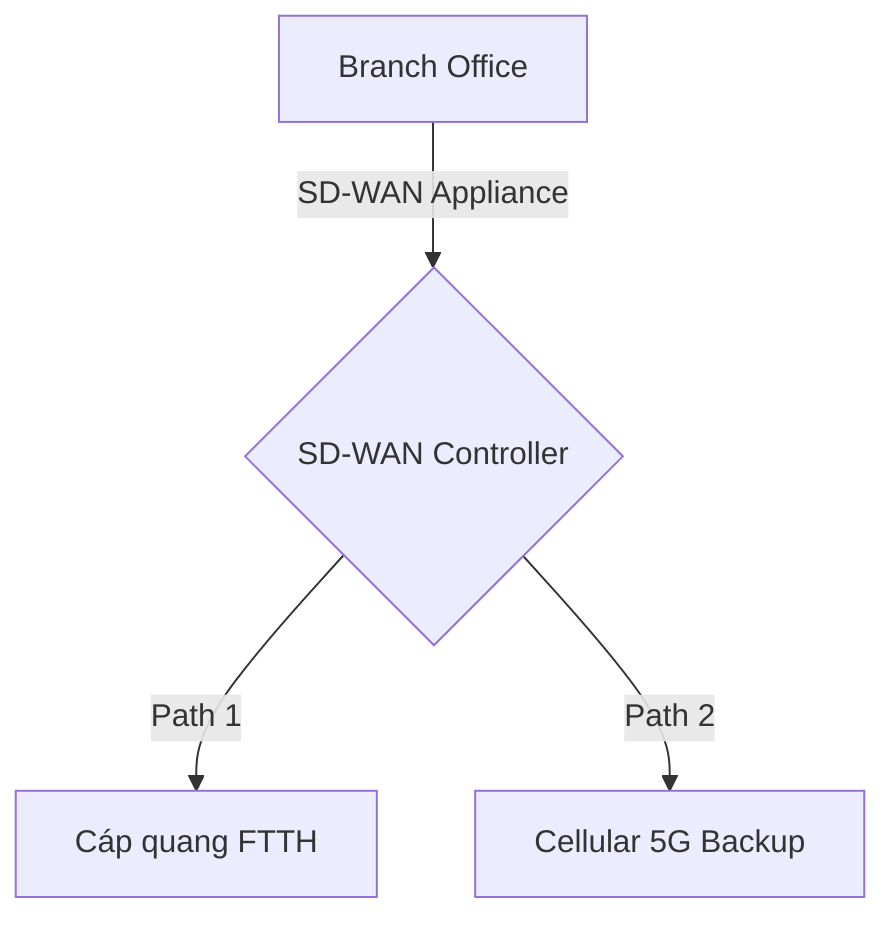

# 🌐 11.Wide_Area_Networks: Các Công Nghệ Mạng Diện Rộng WAN (MPLS, 5G, SD-WAN) - Chuyên Sâu CompTIA Network+ Cho DevOps

> 💡 **Bản chất 1 câu**: Đường truyền WAN: Fiber FTTH, DOCSIS Cable, DSL, Satellite Starlink, Cellular 5G, Leased Lines, MPLS (Layer 2.5 Label Sw...  
> 🎯 **Trọng tâm thực chiến DevOps**: Nắm vững lý thuyết chuyên sâu, sơ đồ kiến trúc, bộ lệnh CLI chẩn đoán thực tế và bộ câu hỏi phỏng vấn tuyển dụng.

---

## 1. 🧠 Hình Hình Dung Nhanh (Intuitive Mindset)

Đường truyền WAN: Fiber FTTH, DOCSIS Cable, DSL, Satellite Starlink, Cellular 5G, Leased Lines, MPLS (Layer 2.5 Label Switching) và SD-WAN.



---

## 2. 📚 Lý Thuyết Chuyên Sâu & Bản Chất Hệ Thống (Under The Hood Architecture)

### 2.1 Các Công Nghệ WAN (OBJ 1.5)
1. **MPLS (Multi-Protocol Label Switching)**: Hoạt động ở tầng **Layer 2.5**. Chuyển tiếp gói tin cực nhanh dựa vào **MPLS Label** mà không cần đọc bảng IP Routing Table. Cam kết chất lượng SLA cao cho doanh nghiệp.
2. **SD-WAN (Software-Defined WAN)**: Tự động đo lường độ trễ (Latency) và rớt gói (Packet Loss) trên nhiều đường truyền (FTTH, 5G, Starlink) để điều phối traffic ứng dụng thông minh bằng phần mềm.
3. **Cellular 5G & Starlink**: Kết nối WAN không dây tốc độ Gbps làm kênh dự phòng Failover khẩn cấp.


---

## 3. ⚡ Bảng Tra Cứu Câu Lệnh & Khái Niệm Thực Hành (Reference Table)

| Công cụ / Khái niệm | Loại / Protocol | Ý nghĩa chi tiết | Ứng dụng thực tế |
| :--- | :--- | :--- | :--- |
| **`MPLS`** | `Layer 2.5 WAN` | Chuyển mạch nhãn Label Switching tốc độ cao có SLA | `Kết nối các chi nhánh ngân hàng` |
| **`SD-WAN`** | `Software-Defined` | Điều phối traffic WAN thông minh qua phần mềm | `Tối ưu chi phí WAN doanh nghiệp` |
| **`5G / LTE`** | `Cellular WAN` | Mạng không dây di động tốc độ cao | `Backup kết nối WAN khẩn cấp` |
| **`mtr`** | `WAN Diagnostic` | Đo độ trễ latency và rớt gói packet loss trên WAN | `mtr --report 8.8.8.8` |


---

## 4. 🛠 Thao Tác Thực Chiến & Kịch Bản DevOps

### 🛠 Các lệnh thực hành gõ là ăn ngay:
```bash
mtr --report --report-cycles 10 8.8.8.8
```

### 🚀 Kịch bản xử lý sự cố thực tế khi đi làm:
Thiết lập kênh WAN dự phòng cho ngân hàng: Đường chính MPLS + Đường dự phòng SD-WAN chạy 5G (Tự động failover trong 1s khi đứt cáp quang).

---

## 5. 🚀 Bộ Câu Hỏi Phỏng Vấn DevOps & Network Thực Tế (Interview Q&A)

> **Q: MPLS hoạt động ở tầng nào trong mô hình OSI và dựa vào đâu để chuyển tiếp gói tin?**  
> **A**: MPLS hoạt động ở tầng **Layer 2.5**, chuyển tiếp gói tin dựa vào **MPLS Label** chèn giữa L2 và L3 Header.

> **Q: Lợi ích lớn nhất của SD-WAN là gì?**  
> **A**: SD-WAN giúp tự động điều phối traffic thông minh qua nhiều đường truyền băng rộng giá rẻ (FTTH, 5G, Satellite) mà vẫn đảm bảo hiệu năng và tính sẵn sàng cao.


---

## 6. 📝 Cheat Sheet Ghi Nhớ Nhanh (Summary)

- [x] MPLS: Layer 2.5 Label Switching
- [x] SD-WAN: Điều khiển WAN bằng phần mềm thông minh
- [x] 5G / Starlink: Kết nối WAN dự phòng khẩn cấp

