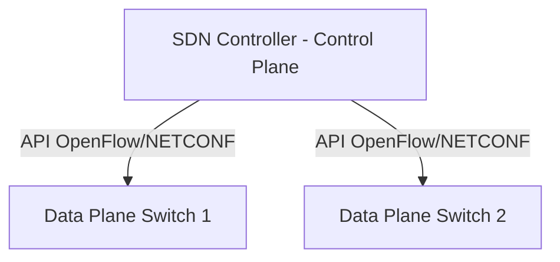

# 🌐 12.Cloud_and_Datacenter: Kiến Trúc Đám Mây Cloud, SDN, VXLAN & SASE - Chuyên Sâu CompTIA Network+ Cho DevOps

> 💡 **Bản chất 1 câu**: Mô hình Cloud (IaaS, PaaS, SaaS, Public, Private, Hybrid), Software-Defined Networking (SDN Control vs Data Plane), SD-W...  
> 🎯 **Trọng tâm thực chiến DevOps**: Nắm vững lý thuyết chuyên sâu, sơ đồ kiến trúc, bộ lệnh CLI chẩn đoán thực tế và bộ câu hỏi phỏng vấn tuyển dụng.

---

## 1. 🧠 Hình Hình Dung Nhanh (Intuitive Mindset)

Mô hình Cloud (IaaS, PaaS, SaaS, Public, Private, Hybrid), Software-Defined Networking (SDN Control vs Data Plane), SD-WAN, VXLAN Overlay Network (UDP Port 4789, 16 triệu VNI) và SASE.



---

## 2. 📚 Lý Thuyết Chuyên Sâu & Bản Chất Hệ Thống (Under The Hood Architecture)

### 2.1 Mô Hình Cloud & SDN / VXLAN (OBJ 1.3 & 1.8)
1. **Cloud Service Models**:
   - **IaaS**: Thuê VM, Storage, Network (AWS EC2, OpenStack).
   - **PaaS**: Thuê môi trường chạy code (Heroku, App Runner).
   - **SaaS**: Thuê ứng dụng dùng ngay (Gmail, Office365, Slack).
2. **SDN (Software-Defined Networking)**: Tách rời bộ não điều khiển (**Control Plane**) ra khỏi thiết bị phần cứng chuyển tiếp dữ liệu (**Data Plane**), quản lý tập trung qua API.
3. **VXLAN (Virtual Extensible LAN - UDP Port 4789)**:
   - Đóng gói Ethernet Frame L2 bên trong gói tin **UDP Port 4789 (L3 Overlay Network)**.
   - Dùng **VNI 24-bit**, cho phép tạo tới **16 triệu dải mạng ảo L2** chồng lên hạ tầng L3! (Được dùng làm CNI Overlay trong Kubernetes Flannel/Cilium).


---


### 2.4 Cơ Chế Hoạt Động Bên Dưới Kernel & Kiến Trúc Hệ Thống Chi Tiết (Deep Under The Hood Architecture)
- **Tầng Giao Tiếp Mạng & Bắt Gói Tin**: Mọi gói tin đi qua Network Interface Card (NIC) đều trải qua quá trình xử lý Ring Buffer, ngắt phần cứng (Hardware Interrupts), Ring Buffer DMA và chồng giao thức Socket Buffers (`sk_buff`) trong Linux Kernel.
- **Tối Ưu Hóa & Cấu Trúc Dữ Liệu**: Hệ thống duy trì các bảng băm dữ liệu (Routing Table, ARP Cache Table, Connection Tracking Table `conntrack`, Socket Inode Tables) giúp chuyển tiếp gói tin ở tốc độ dây (Line-rate processing).
- **Phân Lập An Ninh & Phân Vùng**: Sử dụng cơ chế Linux Network Namespaces (`ip netns`), iptables/nftables hooks và mã hóa phần cứng để cách ly lưu lượng mạng tuyệt đối.

---

## 3. ⚡ Bảng Tra Cứu Câu Lệnh & Khái Niệm Thực Hành (Reference Table)

| Công cụ / Khái niệm | Loại / Protocol | Ý nghĩa chi tiết | Ứng dụng thực tế |
| :--- | :--- | :--- | :--- |
| **`IaaS`** | `Cloud Model` | Cấp phát Máy chủ ảo, Đĩa cứng, Network | `AWS EC2 / OpenStack` |
| **`SDN`** | `Software-Defined` | Tách Control Plane và Data Plane quản lý qua API | `Tự động hóa mạng Cloud` |
| **`VXLAN`** | `Overlay Protocol` | Đóng gói L2 vào UDP 4789 tạo 16 triệu VNI mạng ảo | `Mạng overlay Kubernetes Flannel/Cilium` |
| **`SASE`** | `Security Edge` | Hợp nhất SD-WAN và Cloud Security (Zero Trust, CASB) | `Bảo mật kết nối Cloud tập trung` |


---

## 4. 🛠 Thao Tác Thực Chiến & Kịch Bản DevOps

### 🛠 Các lệnh thực hành gõ là ăn ngay:
```bash
ip -d link show flannel.1 # Check VXLAN interface trong Kubernetes
```

### 🚀 Kịch bản xử lý sự cố thực tế khi đi làm:
Xây dựng hạ tầng Cloud Multi-tenant cho 50,000 doanh nghiệp độc lập bằng mạng VXLAN Overlay (VNI).

---


### 4.2 Chi Tiết Các Lỗi Thường Gặp & Kịch Bản Khắc Phục Lỗi (Troubleshooting Deep-Dive)
1. **Sự cố 1: Lỗi Mất Gói Tin & Mất Kết Nối Cổng Mạng (Packet Loss & Port Unreachable)**:
   - **Triệu chứng**: Gửi HTTP Request bị Timeout, SSH không kết nối được hoặc gói tin bị nảy rải rác.
   - **Các bước xử lý khẩn cấp**:
     ```bash
     # 1. Kiểm tra trạng thái cổng mạng TCP/UDP đang lắng nghe:
     sudo ss -tulpn | grep :80
     
     # 2. Bắt gói tin trực tiếp trên Interface để kiểm tra bắt tay 3 bước TCP:
     sudo tcpdump -i eth0 port 80 -nn -vv
     
     # 3. Phân tích đường đi của gói tin tìm điểm đứt gãy bằng MTR:
     mtr -n --report --report-cycles=10 8.8.8.8
     
     # 4. Kiểm tra xem gói tin có bị Firewall Drop không:
     sudo iptables -L -n -v | grep DROP
     ```

2. **Sự cố 2: Lỗi Sai Cấu Hình DNS & Chuyển Tiếp IP (DNS Resolution & IP Routing Error)**:
   - **Triệu chứng**: Ping IP thành công nhưng ping Domain Name báo `Could not resolve host`.
   - **Các bước xử lý khẩn cấp**:
     ```bash
     # 1. Tra cứu thử nghiệm phân giải DNS qua server cụ thể:
     dig @8.8.8.8 company.com +trace
     
     # 2. Kiểm tra file cấu hình DNS resolver địa phương:
     cat /etc/resolv.conf
     
     # 3. Kiểm tra bảng định tuyến Kernel IP Routing Table:
     ip route show default
     ```

---

## 5. 🚀 Bộ Câu Hỏi Phỏng Vấn DevOps & Network Thực Tế (Interview Q&A)

> **Q: SDN tách rời 2 mặt phẳng (Planes) nào của thiết bị mạng?**  
> **A**: SDN tách rời **Control Plane** (Mặt phẳng điều khiển) và **Data Plane** (Mặt phẳng chuyển tiếp dữ liệu).

> **Q: VXLAN sử dụng UDP Port nào và hỗ trợ tối đa bao nhiêu dải mạng ảo VNI?**  
> **A**: VXLAN sử dụng **UDP Port 4789** và hỗ trợ tới **16 triệu dải mạng ảo VNI**.


> **Q: Làm thế nào để điều tra và dập tắt sự cố một Server bị tấn công làm tràn bộ đệm kết nối TCP SYN Flood DoS?**  
> **A**:  
> 1. **Nhận biết**: Lệnh `ss -ant | grep SYN_RECV | wc -l` trả về hàng ngàn kết nối ở trạng thái `SYN_RECV`.  
> 2. **Xử lý khẩn cấp**: Bật ngay cơ chế **SYN Cookies** của Linux Kernel bằng lệnh `sudo sysctl -w net.ipv4.tcp_syncookies=1`. Kích hoạt bộ lọc Firewall drop các gói tin SYN có tần suất bất thường: `sudo iptables -A INPUT -p tcp --syn -m limit --limit 1/s --limit-burst 3 -j ACCEPT`.

> **Q: Sự khác biệt về mặt bản chất giữa Stateful Firewall và Stateless Firewall là gì?**  
> **A**: Stateless Firewall chỉ kiểm tra từng gói tin riêng rẻ dựa trên IP nguồn/đích và Port mà KHÔNG nhớ ngữ cảnh. Stateful Firewall duy trì một bảng theo dõi trạng thái kết nối (**Connection Tracking Table `conntrack`**), tự động nhận diện gói tin thuộc về một kết nối hợp lệ đã được chấp nhận trước đó (như trạng thái `ESTABLISHED,RELATED`), giúp bảo mật và tối ưu hiệu năng vượt trội.

---

## 6. 📝 Cheat Sheet Ghi Nhớ Nhanh (Summary)

- [x] IaaS: EC2 VM
- [x] PaaS: App Runner
- [x] SaaS: Gmail
- [x] SDN: Tách Control & Data Plane
- [x] VXLAN: UDP 4789 (16 triệu VNI mạng ảo)

