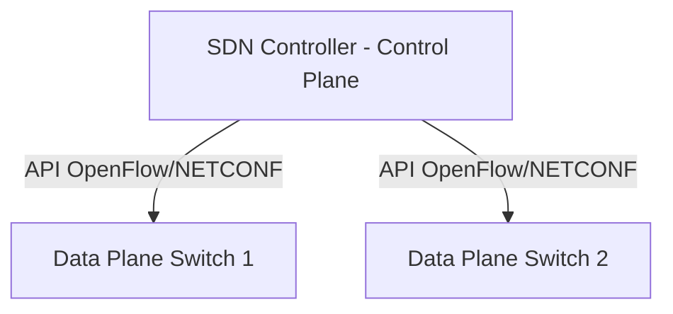

# 🌐 12.Cloud_and_Datacenter: Kiến Trúc Đám Mây Cloud, SDN, VXLAN & SASE - Chuyên Sâu CompTIA Network+ Cho DevOps

> 💡 **Bản chất 1 câu**: Mô hình Cloud (IaaS, PaaS, SaaS, Public, Private, Hybrid), Software-Defined Networking (SDN Control vs Data Plane), SD-W...  
> 🎯 **Trọng tâm thực chiến DevOps**: Nắm vững lý thuyết chuyên sâu, sơ đồ kiến trúc, bộ lệnh CLI chẩn đoán thực tế và bộ câu hỏi phỏng vấn tuyển dụng.

---

## 1. 🧠 Hình Hình Dung Nhanh (Intuitive Mindset)

Mô hình Cloud (IaaS, PaaS, SaaS, Public, Private, Hybrid), Software-Defined Networking (SDN Control vs Data Plane), SD-WAN, VXLAN Overlay Network (UDP Port 4789, 16 triệu VNI) và SASE.



---

## 2. 📚 Lý Thuyết Chuyên Sâu & Bản Chất Hệ Thống (Under The Hood Architecture)

### 2.1 Mô Hình Cloud & SDN / VXLAN (OBJ 1.3 & 1.8)
1. **Cloud Service Models**:
   - **IaaS**: Thuê VM, Storage, Network (AWS EC2, OpenStack).
   - **PaaS**: Thuê môi trường chạy code (Heroku, App Runner).
   - **SaaS**: Thuê ứng dụng dùng ngay (Gmail, Office365, Slack).
2. **SDN (Software-Defined Networking)**: Tách rời bộ não điều khiển (**Control Plane**) ra khỏi thiết bị phần cứng chuyển tiếp dữ liệu (**Data Plane**), quản lý tập trung qua API.
3. **VXLAN (Virtual Extensible LAN - UDP Port 4789)**:
   - Đóng gói Ethernet Frame L2 bên trong gói tin **UDP Port 4789 (L3 Overlay Network)**.
   - Dùng **VNI 24-bit**, cho phép tạo tới **16 triệu dải mạng ảo L2** chồng lên hạ tầng L3! (Được dùng làm CNI Overlay trong Kubernetes Flannel/Cilium).


---

## 3. ⚡ Bảng Tra Cứu Câu Lệnh & Khái Niệm Thực Hành (Reference Table)

| Công cụ / Khái niệm | Loại / Protocol | Ý nghĩa chi tiết | Ứng dụng thực tế |
| :--- | :--- | :--- | :--- |
| **`IaaS`** | `Cloud Model` | Cấp phát Máy chủ ảo, Đĩa cứng, Network | `AWS EC2 / OpenStack` |
| **`SDN`** | `Software-Defined` | Tách Control Plane và Data Plane quản lý qua API | `Tự động hóa mạng Cloud` |
| **`VXLAN`** | `Overlay Protocol` | Đóng gói L2 vào UDP 4789 tạo 16 triệu VNI mạng ảo | `Mạng overlay Kubernetes Flannel/Cilium` |
| **`SASE`** | `Security Edge` | Hợp nhất SD-WAN và Cloud Security (Zero Trust, CASB) | `Bảo mật kết nối Cloud tập trung` |


---

## 4. 🛠 Thao Tác Thực Chiến & Kịch Bản DevOps

### 🛠 Các lệnh thực hành gõ là ăn ngay:
```bash
ip -d link show flannel.1 # Check VXLAN interface trong Kubernetes
```

### 🚀 Kịch bản xử lý sự cố thực tế khi đi làm:
Xây dựng hạ tầng Cloud Multi-tenant cho 50,000 doanh nghiệp độc lập bằng mạng VXLAN Overlay (VNI).

---

## 5. 🚀 Bộ Câu Hỏi Phỏng Vấn DevOps & Network Thực Tế (Interview Q&A)

> **Q: SDN tách rời 2 mặt phẳng (Planes) nào của thiết bị mạng?**  
> **A**: SDN tách rời **Control Plane** (Mặt phẳng điều khiển) và **Data Plane** (Mặt phẳng chuyển tiếp dữ liệu).

> **Q: VXLAN sử dụng UDP Port nào và hỗ trợ tối đa bao nhiêu dải mạng ảo VNI?**  
> **A**: VXLAN sử dụng **UDP Port 4789** và hỗ trợ tới **16 triệu dải mạng ảo VNI**.


---

## 6. 📝 Cheat Sheet Ghi Nhớ Nhanh (Summary)

- [x] IaaS: EC2 VM
- [x] PaaS: App Runner
- [x] SaaS: Gmail
- [x] SDN: Tách Control & Data Plane
- [x] VXLAN: UDP 4789 (16 triệu VNI mạng ảo)

