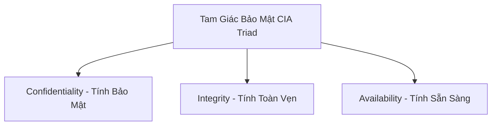

# 🌐 Bảo Mật Mạng Căn Bản & Thiết Lập Device Hardening - Chuyên Sâu Mạng Máy Tính Cho DevOps

> 💡 **Bản chất 1 câu**: Mô hình tam giác bảo mật CIA (Confidentiality, Integrity, Availability), Quản lý Rủi ro (Risk Management), Device Hardening và Honeypots.  
> 🎯 **Trọng tâm thực chiến DevOps**: Nắm vững CIA Triad, Threat vs Vulnerability vs Risk, Hardening thiết bị mạng (disable unused services, change default creds, SSH instead of Telnet) và Honeypots.

---

## 1. 🧠 Hình Hình Dung Nhanh (Intuitive Mindset)

Bảo mật mạng như bảo vệ một ngân hàng: CIA là mục tiêu (Bảo mật két sắt - C, Không để tiền giả - I, Mở cửa đúng giờ - A). Hardening là thay ổ khóa mặc định, tắt cửa phụ không dùng và đặt bẫy Honeypot dụ trộm.

---

## 2. 📚 Lý Thuyết Chuyên Sâu & Bản Chất Mạng (Under The Hood Architecture)

### 2.1 Tam Giác Bảo Mật Cốt Lõi CIA Triad



1. **Confidentiality (Tính Bảo Mật)**: Đảm bảo dữ liệu chỉ được truy cập bởi người được phép (Mã hóa SSL/TLS, SSH, AES).
2. **Integrity (Tính Toàn Vẹn)**: Đảm bảo dữ liệu không bị sửa đổi hay thay thế trái phép trên đường truyền (Mã hash SHA-256, Digital Signature, Checksum).
3. **Availability (Tính Sẵn Sàng)**: Đảm bảo hệ thống luôn sẵn sàng phục vụ khi cần (Redundancy, High Availability, Load Balancer, Anti-DDoS).

---

### 2.2 Quy Trình Thiết Lập Device Hardening Máy Chủ & Thiết Bị Mạng
1. **Đổi Mật Khẩu & Mặc Định**: Đổi ngay lập tức Username/Password mặc định (`admin/admin`).
2. **Tắt Dịch Vụ Nguy Hiểm & Không Sử Dụng**: Tắt Telnet (Port 23), FTP (Port 21), HTTP (Port 80) -> Chuyển sang SSH (22), SFTP, HTTPS (443).
3. **Vô Hiệu Hóa Cổng Mạng Không Dùng**: `shutdown` các cổng Switch không sử dụng để tránh bị cắm lén thiết bị độc hại.
4. **Honeypot & Active Defense**:
   - **Honeypot**: Máy chủ/Dịch vụ bẫy giả mạo cố tình để lộ lỗ hổng để dụ kẻ tấn công (Hacker) mắc bẫy, giúp đội Security nghiên cứu hành vi và phương thức tấn công của Hacker.


---

## 3. ⚡ Bảng Tra Cứu Câu Lệnh & Khái Niệm Thực Hành (Reference Table)

| Công cụ / Lệnh / Khái niệm | Tham số / Flag / Protocol | Giải thích ý nghĩa chi tiết | Ứng dụng thực tế trong DevOps / Network |
| :--- | :--- | :--- | :--- |
| **`CIA Triad`** | `Security Principle` | Confidentiality - Integrity - Availability | `Nguyên tắc thiết kế bảo mật` |
| **`Device Hardening`** | `Best Practice` | Gia cố vô hiệu hóa dịch vụ dư thừa và đổi pass mặc định | `Hardening Linux Server / Router` |
| **`Honeypot`** | `Deception Tech` | Máy chủ bẫy giả mạo để dụ và nghiên cứu Hacker | `Bẫy giám sát an ninh mạng` |
| **`SHA-256`** | `Hashing` | Thuật toán băm kiểm tra tính toàn vẹn Integrity | `Xác minh file download không bị chèn mã độc` |


---

## 4. 🛠 Thao Tác Thực Chiến & Kịch Bản DevOps (Real-World Scenarios)

### 🛠 Các lệnh thực hành gõ là ăn ngay:
```bash
# Hardening Linux Server cấp tốc:
# 1. Tắt dịch vụ Telnet và rsh rác:
sudo systemctl stop telnet.socket 2>/dev/null || true
sudo systemctl disable telnet.socket 2>/dev/null || true

# 2. Kiểm tra các Port công cộng đang lắng nghe để tắt bớt:
sudo ss -tulpn
```

### 🚀 Kịch bản xử lý sự cố thực tế khi đi làm:
Audit an ninh mạng định kỳ phát hiện thiết bị bị quên chưa Hardening:
# Sử dụng Nmap quét kiểm tra các thiết bị còn mở Port Telnet 23 nguy hiểm:
nmap -p 23 10.0.0.0/24

---

## 5. 🚀 Bộ Câu Hỏi Phỏng Vấn DevOps & Network Thực Tế (Interview Q&A)

> **Q: Ba trụ cột của Tam Giác Bảo Mật CIA Triad là gì?**  
> **A**: Confidentiality (Tính Bảo Mật), Integrity (Tính Toàn Vẹn), và Availability (Tính Sẵn Sàng).

> **Q: Honeypot trong bảo mật mạng đóng vai trò gì?**  
> **A**: Là hệ thống bẫy giả mạo được cố tình thiết lập để dẫn dụ kẻ tấn công, giúp phát hiện sớm xâm nhập và phân tích phương thức tấn công của Hacker.


---

## 6. 📝 Cheat Sheet & Ghi Nhớ Nhanh (Summary)

- [x] CIA: Confidentiality - Integrity - Availability
- [x] Hardening: Đổi pass mặc định & Tắt dịch vụ dư thừa
- [x] Dùng SSH (22) thay Telnet (23)
- [x] Honeypot: Máy chủ bẫy dụ Hacker

