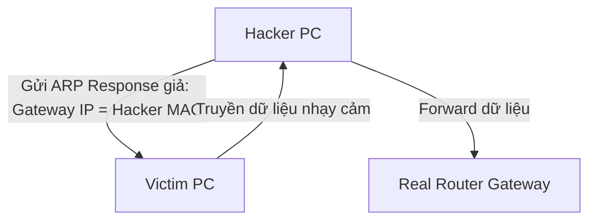

# 🌐 Các Loại Tấn Công Mạng & Biện Pháp Phòng Thủ (Network Attacks) - Chuyên Sâu Mạng Máy Tính Cho DevOps

> 💡 **Bản chất 1 câu**: Phân tích chuyên sâu các hình thức tấn công mạng phổ biến: DoS/DDoS, MAC Flooding, ARP Poisoning, VLAN Hopping, DNS Poisoning, Man-in-the-Middle (MitM) và Social Engineering.  
> 🎯 **Trọng tâm thực chiến DevOps**: Hiểu rõ cơ chế DoS/DDoS (SYN Flood, NTP Amplification), MAC Flooding (đánh sập CAM Table), ARP Spoofing, VLAN Hopping (Double Tagging), MitM và biện pháp phòng thủ (Port Security, Dynamic ARP Inspection DAI, DHCP Snooping).

---

## 1. 🧠 Hình Hình Dung Nhanh (Intuitive Mindset)

Tấn công ARP Spoofing như kẻ lừa đảo đứng ở ngã tư: Kẻ gian liên tục hét lên 'Tôi là Router Gateway đây, hãy gửi hết thư cho tôi!'. Mọi máy tính trong LAN bị lừa gửi dữ liệu qua máy Hacker trước khi ra ngoài.

---

## 2. 📚 Lý Thuyết Chuyên Sâu & Bản Chất Mạng (Under The Hood Architecture)

### 2.1 Các Cuộc Tấn Công Layer 2 & Tầng Mạng Phổ Biến



1. **ARP Spoofing / Poisoning (Tấn công Layer 2)**:
   - Hacker gửi các gói ARP Reply giả mạo thông báo địa chỉ IP Gateway sở hữu địa chỉ MAC của Hacker.
   - Hậu quả: Dẫn tới tấn công **Man-in-the-Middle (MitM)**, đọc trộm toàn bộ dữ liệu LAN.
   - **Phòng thủ**: Bật **Dynamic ARP Inspection (DAI)** trên Switch.
2. **MAC Flooding Attack**:
   - Hacker phát hàng triệu Ethernet Frame chứa địa chỉ MAC nguồn giả mạo làm bão hòa bảng CAM Table của Switch.
   - Hậu quả: Switch biến thành Hub (chuyển sang chế độ Fail-open), phát tất cả gói tin ra mọi cổng cho Hacker nghe lén.
   - **Phòng thủ**: Bật **Port Security** trên Switch (giới hạn số địa chỉ MAC trên 1 port).
3. **DHCP Spoofing / Rogue DHCP Server**:
   - Hacker bật DHCP Server giả mạo cấp IP và DNS độc hại cho nạn nhân.
   - **Phòng thủ**: Bật **DHCP Snooping** trên Switch (chỉ tin tưởng cổng DHCP Trusted Server).
4. **DoS / DDoS (Denial of Service)**:
   - Tấn công làm kiệt quệ tài nguyên (SYN Flood, UDP Amplification, HTTP Flood).


---

## 3. ⚡ Bảng Tra Cứu Câu Lệnh & Khái Niệm Thực Hành (Reference Table)

| Công cụ / Lệnh / Khái niệm | Tham số / Flag / Protocol | Giải thích ý nghĩa chi tiết | Ứng dụng thực tế trong DevOps / Network |
| :--- | :--- | :--- | :--- |
| **`ARP Spoofing`** | `L2 Attack` | Giả mạo bản tin ARP để mạo danh Gateway nghe lén | `Dùng Dynamic ARP Inspection (DAI) phòng thủ` |
| **`MAC Flooding`** | `L2 Attack` | Bão hòa bảng CAM Table ép Switch biến thành Hub | `Dùng Port Security phòng thủ` |
| **`DHCP Snooping`** | `Switch Defense` | Chỉ cho phép cấp IP từ cổng DHCP Server hợp lệ | `Chống máy chủ DHCP giả mạo` |
| **`DDoS`** | `L3-L7 Attack` | Tấn công từ chối dịch vụ phân tán làm sập Server | `Dùng Cloudflare / AWS Shield Anti-DDoS` |


---

## 4. 🛠 Thao Tác Thực Chiến & Kịch Bản DevOps (Real-World Scenarios)

### 🛠 Các lệnh thực hành gõ là ăn ngay:
```bash
# Kiểm tra xem bảng ARP Cache của máy tính có bị ARP Spoofing (trùng MAC) hay không:
ip neighbor show
```

### 🚀 Kịch bản xử lý sự cố thực tế khi đi làm:
Triển khai tính năng bảo mật Port Security trên Switch Cisco chống MAC Flooding:
# interface GigabitEthernet0/1
# switchport mode access
# switchport port-security
# switchport port-security maximum 2
# switchport port-security violation shutdown

---

## 5. 🚀 Bộ Câu Hỏi Phỏng Vấn DevOps & Network Thực Tế (Interview Q&A)

> **Q: Tính năng bảo mật nào trên Switch giúp ngăn chặn hiệu quả cuộc tấn công MAC Flooding Attack?**  
> **A**: Tính năng **Port Security** (giới hạn số lượng địa chỉ MAC được phép xuất hiện trên 1 cổng Switch).

> **Q: Tính năng DHCP Snooping trên Switch dùng để làm gì?**  
> **A**: Dùng để ngăn chặn các máy chủ DHCP giả mạo (Rogue DHCP Server) bằng cách chỉ cho phép các gói tin DHCP Offer/ACK đi ra từ các cổng được đánh dấu Trusted.


---

## 6. 📝 Cheat Sheet & Ghi Nhớ Nhanh (Summary)

- [x] ARP Spoofing: Giả mạo IP/MAC nghe lén (Phòng thủ: DAI)
- [x] MAC Flooding: Tràn bảng CAM (Phòng thủ: Port Security)
- [x] DHCP Spoofing: DHCP giả mạo (Phòng thủ: DHCP Snooping)
- [x] DDoS: Đánh sập tài nguyên hệ thống

