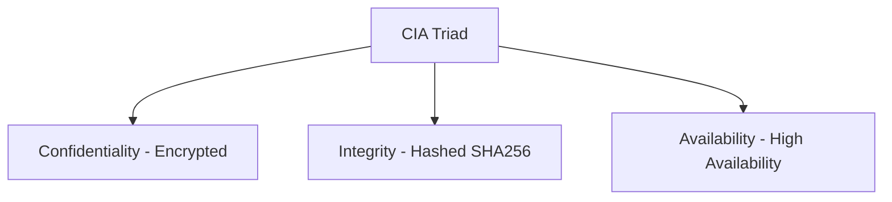

# 🌐 13.Network_Security_Fundamentals: Bảo Mật Mạng Căn Bản & Thiết Lập Device Hardening - Chuyên Sâu CompTIA Network+ Cho DevOps

> 💡 **Bản chất 1 câu**: Mô hình tam giác bảo mật CIA (Confidentiality, Integrity, Availability), Quản lý Rủi ro (Threat/Vulnerability/Risk), Dev...  
> 🎯 **Trọng tâm thực chiến DevOps**: Nắm vững lý thuyết chuyên sâu, sơ đồ kiến trúc, bộ lệnh CLI chẩn đoán thực tế và bộ câu hỏi phỏng vấn tuyển dụng.

---

## 1. 🧠 Hình Hình Dung Nhanh (Intuitive Mindset)

Mô hình tam giác bảo mật CIA (Confidentiality, Integrity, Availability), Quản lý Rủi ro (Threat/Vulnerability/Risk), Device Hardening và Honeypots.



---

## 2. 📚 Lý Thuyết Chuyên Sâu & Bản Chất Hệ Thống (Under The Hood Architecture)

### 2.1 Tam Giác Bảo Mật CIA & Device Hardening (OBJ 4.1 & 4.3)
1. **Confidentiality (Tính Bảo Mật)**: Đảm bảo dữ liệu chỉ được truy cập bởi người có quyền (Mã hóa SSL/TLS, SSH, AES).
2. **Integrity (Tính Toàn Vẹn)**: Đảm bảo dữ liệu không bị sửa đổi trái phép trên đường truyền (Mã hash SHA-256, Checksum).
3. **Availability (Tính Sẵn Sàng)**: Đảm bảo hệ thống luôn sẵn sàng phục vụ (Redundancy, Load Balancer, Anti-DDoS).
4. **Device Hardening**:
   - Đổi ngay Username/Password mặc định (`admin/admin`).
   - Tắt Telnet (23), FTP (21) -> Chuyển sang SSH (22), SFTP.
   - `shutdown` các cổng Switch không sử dụng.
5. **Honeypot**: Hệ thống bẫy giả mạo để dụ kẻ tấn công (Hacker) vào phân tích hành vi.


---

## 3. ⚡ Bảng Tra Cứu Câu Lệnh & Khái Niệm Thực Hành (Reference Table)

| Công cụ / Khái niệm | Loại / Protocol | Ý nghĩa chi tiết | Ứng dụng thực tế |
| :--- | :--- | :--- | :--- |
| **`CIA Triad`** | `Security Standard` | Confidentiality - Integrity - Availability | `Nguyên tắc thiết kế bảo mật` |
| **`Hardening`** | `Best Practice` | Gia cố vô hiệu hóa dịch vụ rác và đổi pass mặc định | `Hardening Server / Switch` |
| **`Honeypot`** | `Deception Tech` | Máy chủ bẫy giả mạo để dụ và nghiên cứu Hacker | `Bẫy giám sát an ninh` |
| **`SHA-256`** | `Hashing` | Thuật toán băm kiểm tra tính toàn vẹn Integrity | `Xác minh file download không bị chèn mã độc` |


---

## 4. 🛠 Thao Tác Thực Chiến & Kịch Bản DevOps

### 🛠 Các lệnh thực hành gõ là ăn ngay:
```bash
sudo systemctl stop telnet.socket
sudo ss -tulpn
```

### 🚀 Kịch bản xử lý sự cố thực tế khi đi làm:
Audit an ninh phát hiện Router cty còn mở Port Telnet 23 nguy hiểm chưa Hardening -> Tắt Telnet và bật SSH v2.

---

## 5. 🚀 Bộ Câu Hỏi Phỏng Vấn DevOps & Network Thực Tế (Interview Q&A)

> **Q: Ba trụ cột của Tam Giác Bảo Mật CIA Triad là gì?**  
> **A**: Confidentiality (Tính Bảo Mật), Integrity (Tính Toàn Vẹn), và Availability (Tính Sẵn Sàng).

> **Q: Honeypot trong bảo mật mạng đóng vai trò gì?**  
> **A**: Là hệ thống bẫy giả mạo được cố tình thiết lập để dẫn dụ kẻ tấn công, giúp phát hiện sớm xâm nhập và nghiên cứu phương thức tấn công của Hacker.


---

## 6. 📝 Cheat Sheet Ghi Nhớ Nhanh (Summary)

- [x] CIA: Confidentiality - Integrity - Availability
- [x] Hardening: Đổi pass mặc định & Tắt Telnet/FTP
- [x] SSH (22) thay Telnet (23)
- [x] Honeypot: Máy chủ bẫy dụ Hacker

