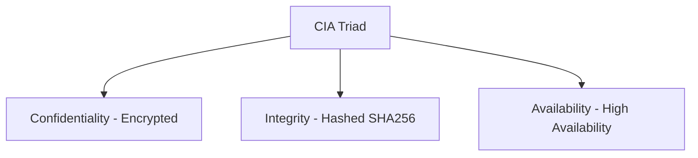

# 🌐 13.Network_Security_Fundamentals: Bảo Mật Mạng Căn Bản & Thiết Lập Device Hardening - Chuyên Sâu CompTIA Network+ Cho DevOps

> 💡 **Bản chất 1 câu**: Mô hình tam giác bảo mật CIA (Confidentiality, Integrity, Availability), Quản lý Rủi ro (Threat/Vulnerability/Risk), Dev...  
> 🎯 **Trọng tâm thực chiến DevOps**: Nắm vững lý thuyết chuyên sâu, sơ đồ kiến trúc, bộ lệnh CLI chẩn đoán thực tế và bộ câu hỏi phỏng vấn tuyển dụng.

---

## 1. 🧠 Hình Hình Dung Nhanh (Intuitive Mindset)

Mô hình tam giác bảo mật CIA (Confidentiality, Integrity, Availability), Quản lý Rủi ro (Threat/Vulnerability/Risk), Device Hardening và Honeypots.



---

## 2. 📚 Lý Thuyết Chuyên Sâu & Bản Chất Hệ Thống (Under The Hood Architecture)

### 2.1 Tam Giác Bảo Mật CIA & Device Hardening (OBJ 4.1 & 4.3)
1. **Confidentiality (Tính Bảo Mật)**: Đảm bảo dữ liệu chỉ được truy cập bởi người có quyền (Mã hóa SSL/TLS, SSH, AES).
2. **Integrity (Tính Toàn Vẹn)**: Đảm bảo dữ liệu không bị sửa đổi trái phép trên đường truyền (Mã hash SHA-256, Checksum).
3. **Availability (Tính Sẵn Sàng)**: Đảm bảo hệ thống luôn sẵn sàng phục vụ (Redundancy, Load Balancer, Anti-DDoS).
4. **Device Hardening**:
   - Đổi ngay Username/Password mặc định (`admin/admin`).
   - Tắt Telnet (23), FTP (21) -> Chuyển sang SSH (22), SFTP.
   - `shutdown` các cổng Switch không sử dụng.
5. **Honeypot**: Hệ thống bẫy giả mạo để dụ kẻ tấn công (Hacker) vào phân tích hành vi.


---


### 2.4 Cơ Chế Hoạt Động Bên Dưới Kernel & Kiến Trúc Hệ Thống Chi Tiết (Deep Under The Hood Architecture)
- **Tầng Giao Tiếp Mạng & Bắt Gói Tin**: Mọi gói tin đi qua Network Interface Card (NIC) đều trải qua quá trình xử lý Ring Buffer, ngắt phần cứng (Hardware Interrupts), Ring Buffer DMA và chồng giao thức Socket Buffers (`sk_buff`) trong Linux Kernel.
- **Tối Ưu Hóa & Cấu Trúc Dữ Liệu**: Hệ thống duy trì các bảng băm dữ liệu (Routing Table, ARP Cache Table, Connection Tracking Table `conntrack`, Socket Inode Tables) giúp chuyển tiếp gói tin ở tốc độ dây (Line-rate processing).
- **Phân Lập An Ninh & Phân Vùng**: Sử dụng cơ chế Linux Network Namespaces (`ip netns`), iptables/nftables hooks và mã hóa phần cứng để cách ly lưu lượng mạng tuyệt đối.

---

## 3. ⚡ Bảng Tra Cứu Câu Lệnh & Khái Niệm Thực Hành (Reference Table)

| Công cụ / Khái niệm | Loại / Protocol | Ý nghĩa chi tiết | Ứng dụng thực tế |
| :--- | :--- | :--- | :--- |
| **`CIA Triad`** | `Security Standard` | Confidentiality - Integrity - Availability | `Nguyên tắc thiết kế bảo mật` |
| **`Hardening`** | `Best Practice` | Gia cố vô hiệu hóa dịch vụ rác và đổi pass mặc định | `Hardening Server / Switch` |
| **`Honeypot`** | `Deception Tech` | Máy chủ bẫy giả mạo để dụ và nghiên cứu Hacker | `Bẫy giám sát an ninh` |
| **`SHA-256`** | `Hashing` | Thuật toán băm kiểm tra tính toàn vẹn Integrity | `Xác minh file download không bị chèn mã độc` |


---

## 4. 🛠 Thao Tác Thực Chiến & Kịch Bản DevOps

### 🛠 Các lệnh thực hành gõ là ăn ngay:
```bash
sudo systemctl stop telnet.socket
sudo ss -tulpn
```

### 🚀 Kịch bản xử lý sự cố thực tế khi đi làm:
Audit an ninh phát hiện Router cty còn mở Port Telnet 23 nguy hiểm chưa Hardening -> Tắt Telnet và bật SSH v2.

---


### 4.2 Chi Tiết Các Lỗi Thường Gặp & Kịch Bản Khắc Phục Lỗi (Troubleshooting Deep-Dive)
1. **Sự cố 1: Lỗi Mất Gói Tin & Mất Kết Nối Cổng Mạng (Packet Loss & Port Unreachable)**:
   - **Triệu chứng**: Gửi HTTP Request bị Timeout, SSH không kết nối được hoặc gói tin bị nảy rải rác.
   - **Các bước xử lý khẩn cấp**:
     ```bash
     # 1. Kiểm tra trạng thái cổng mạng TCP/UDP đang lắng nghe:
     sudo ss -tulpn | grep :80
     
     # 2. Bắt gói tin trực tiếp trên Interface để kiểm tra bắt tay 3 bước TCP:
     sudo tcpdump -i eth0 port 80 -nn -vv
     
     # 3. Phân tích đường đi của gói tin tìm điểm đứt gãy bằng MTR:
     mtr -n --report --report-cycles=10 8.8.8.8
     
     # 4. Kiểm tra xem gói tin có bị Firewall Drop không:
     sudo iptables -L -n -v | grep DROP
     ```

2. **Sự cố 2: Lỗi Sai Cấu Hình DNS & Chuyển Tiếp IP (DNS Resolution & IP Routing Error)**:
   - **Triệu chứng**: Ping IP thành công nhưng ping Domain Name báo `Could not resolve host`.
   - **Các bước xử lý khẩn cấp**:
     ```bash
     # 1. Tra cứu thử nghiệm phân giải DNS qua server cụ thể:
     dig @8.8.8.8 company.com +trace
     
     # 2. Kiểm tra file cấu hình DNS resolver địa phương:
     cat /etc/resolv.conf
     
     # 3. Kiểm tra bảng định tuyến Kernel IP Routing Table:
     ip route show default
     ```

---

## 5. 🚀 Bộ Câu Hỏi Phỏng Vấn DevOps & Network Thực Tế (Interview Q&A)

> **Q: Ba trụ cột của Tam Giác Bảo Mật CIA Triad là gì?**  
> **A**: Confidentiality (Tính Bảo Mật), Integrity (Tính Toàn Vẹn), và Availability (Tính Sẵn Sàng).

> **Q: Honeypot trong bảo mật mạng đóng vai trò gì?**  
> **A**: Là hệ thống bẫy giả mạo được cố tình thiết lập để dẫn dụ kẻ tấn công, giúp phát hiện sớm xâm nhập và nghiên cứu phương thức tấn công của Hacker.


> **Q: Làm thế nào để điều tra và dập tắt sự cố một Server bị tấn công làm tràn bộ đệm kết nối TCP SYN Flood DoS?**  
> **A**:  
> 1. **Nhận biết**: Lệnh `ss -ant | grep SYN_RECV | wc -l` trả về hàng ngàn kết nối ở trạng thái `SYN_RECV`.  
> 2. **Xử lý khẩn cấp**: Bật ngay cơ chế **SYN Cookies** của Linux Kernel bằng lệnh `sudo sysctl -w net.ipv4.tcp_syncookies=1`. Kích hoạt bộ lọc Firewall drop các gói tin SYN có tần suất bất thường: `sudo iptables -A INPUT -p tcp --syn -m limit --limit 1/s --limit-burst 3 -j ACCEPT`.

> **Q: Sự khác biệt về mặt bản chất giữa Stateful Firewall và Stateless Firewall là gì?**  
> **A**: Stateless Firewall chỉ kiểm tra từng gói tin riêng rẻ dựa trên IP nguồn/đích và Port mà KHÔNG nhớ ngữ cảnh. Stateful Firewall duy trì một bảng theo dõi trạng thái kết nối (**Connection Tracking Table `conntrack`**), tự động nhận diện gói tin thuộc về một kết nối hợp lệ đã được chấp nhận trước đó (như trạng thái `ESTABLISHED,RELATED`), giúp bảo mật và tối ưu hiệu năng vượt trội.

---

## 6. 📝 Cheat Sheet Ghi Nhớ Nhanh (Summary)

- [x] CIA: Confidentiality - Integrity - Availability
- [x] Hardening: Đổi pass mặc định & Tắt Telnet/FTP
- [x] SSH (22) thay Telnet (23)
- [x] Honeypot: Máy chủ bẫy dụ Hacker

