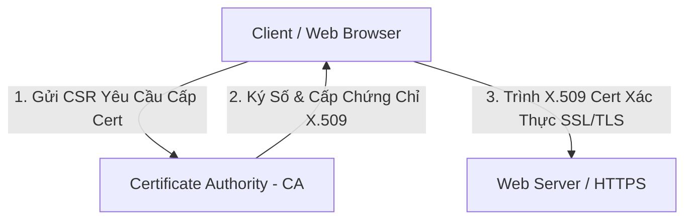

# 🌐 Bảo Mật Logic, Mã Hóa & Hạ Tầng Khóa Công Khai PKI - Chuyên Sâu Mạng Máy Tính Cho DevOps

> 💡 **Bản chất 1 câu**: Kiến trúc Identity & Access Management (IAM), Multifactor Authentication (MFA), AAA Protocols (RADIUS, TACACS+), Mã hóa Bất đối xứng, IPsec và PKI.  
> 🎯 **Trọng tâm thực chiến DevOps**: Phân biệt AAA (Authentication, Authorization, Accounting), Mã hóa Đối xứng (AES) vs Bất đối xứng (RSA/ECC), IPsec (AH vs ESP, IKEv1/v2) và PKI (CA, CSR, X.509).

---

## 1. 🧠 Hình Hình Dung Nhanh (Intuitive Mindset)

PKI như hệ thống cấp Căn Cước Công Dân quốc gia: Cơ quan chứng thực CA (nhà nước) kiểm tra hồ sơ (CSR) và cấp Chứng chỉ số X.509 (CCCD). Khi bạn trình chứng chỉ cho bất kỳ ai, họ tin tưởng ngay vì có con dấu mã hóa của CA.

---

## 2. 📚 Lý Thuyết Chuyên Sâu & Bản Chất Mạng (Under The Hood Architecture)

### 2.1 Kiến Trúc Mã Hóa & Hạ Tầng Khóa Công Khai PKI



1. **Mô Hình AAA (Authentication, Authorization, Accounting)**:
   - **Authentication**: Bạn là ai? (Username/Password, MFA).
   - **Authorization**: Bạn được làm gì? (Phân quyền Role/Permission).
   - **Accounting**: Bạn đã làm những gì? (Ghi log audit lịch sử thao tác).
   - Giao thức triển khai: **RADIUS** (Mạng/Wi-Fi) và **TACACS+** (Quản trị thiết bị mạng Cisco).
2. **So Sánh Mã Hóa Đối Xứng vs Bất Đối Xứng**:
   - **Mã hóa Đối xứng (Symmetric Encryption - AES, ChaCha20)**: Dùng **CÙNG 1 KHÓA** để mã hóa và giải mã. Tốc độ cực nhanh, dùng mã hóa dữ liệu lớn.
   - **Mã hóa Bất đối xứng (Asymmetric Encryption - RSA, ECC, ED25519)**: Dùng **CẶP KHÓA** (Public Key để khóa, Private Key để mở). Dùng xác thực và trao đổi khóa bí mật.
3. **Bộ Giao Thức Bảo Mật IPsec (Internet Protocol Security - Layer 3)**:
   - **AH (Authentication Header)**: Đảm bảo tính toàn vẹn và xác thực nguồn gốc (KHÔNG mã hóa dữ liệu).
   - **ESP (Encapsulating Security Payload)**: Đảm bảo tính bảo mật (MÃ HÓA DỮ LIỆU) + Xác thực.
   - **IKE (Internet Key Exchange - UDP Port 500/4500)**: Giao thức thương lượng thiết lập kênh VPN IPsec.


---

## 3. ⚡ Bảng Tra Cứu Câu Lệnh & Khái Niệm Thực Hành (Reference Table)

| Công cụ / Lệnh / Khái niệm | Tham số / Flag / Protocol | Giải thích ý nghĩa chi tiết | Ứng dụng thực tế trong DevOps / Network |
| :--- | :--- | :--- | :--- |
| **`AAA Protocols`** | `RADIUS / TACACS+` | Authentication - Authorization - Accounting | `Xác thực user Wi-Fi / Router` |
| **`AES-256`** | `Symmetric Encryption` | Thuật toán mã hóa đối xứng siêu tốc chuẩn quân đội | `Mã hóa đĩa cứng / TLS Data payload` |
| **`RSA / ECC`** | `Asymmetric Encryption` | Mã hóa bất đối xứng cặp Public/Private Key | `Chữ ký số, HTTPS Handshake, SSH Key` |
| **`IPsec ESP`** | `Layer 3 Security` | Giao thức mã hóa toàn bộ dữ liệu IP Packet cho VPN | `Site-to-Site VPN giữa 2 chi nhánh` |
| **`X.509 Certificate`** | `PKI Standard` | Chứng chỉ số chứa Public Key và con dấu ký số của CA | `HTTPS SSL/TLS Certificate` |


---

## 4. 🛠 Thao Tác Thực Chiến & Kịch Bản DevOps (Real-World Scenarios)

### 🛠 Các lệnh thực hành gõ là ăn ngay:
```bash
# Tạo cặp khóa RSA 4096-bit và Yêu cầu cấp chứng chỉ CSR bằng OpenSSL:
openssl req -new -newkey rsa:4096 -nodes -keyout app.key -out app.csr
```

### 🚀 Kịch bản xử lý sự cố thực tế khi đi làm:
Cấu hình HTTPS SSL/TLS cho Web Server bằng Let's Encrypt CA miễn phí:
sudo apt install -y certbot python3-certbot-nginx
sudo certbot --nginx -d app.company.com

---

## 5. 🚀 Bộ Câu Hỏi Phỏng Vấn DevOps & Network Thực Tế (Interview Q&A)

> **Q: Sự khác biệt cốt lõi giữa giao thức IPsec AH và IPsec ESP là gì?**  
> **A**: IPsec AH chỉ cung cấp tính toàn vẹn và xác thực nguồn gốc (KHÔNG mã hóa dữ liệu). IPsec ESP cung cấp cả MÃ HÓA DỮ LIỆU bảo mật lẫn xác thực.

> **Q: Ba thành phần của mô hình AAA trong quản trị mạng đại diện cho các từ nào?**  
> **A**: Authentication (Xác thực danh tính), Authorization (Cấp quyền thao tác), và Accounting (Ghi nhật ký audit).


---

## 6. 📝 Cheat Sheet & Ghi Nhớ Nhanh (Summary)

- [x] AAA: Authentication - Authorization - Accounting
- [x] Mã hóa đối xứng (AES): Cùng 1 khóa, nhanh
- [x] Mã hóa bất đối xứng (RSA/ECC): Public/Private Key
- [x] IPsec ESP: Mã hóa IP packet cho VPN
- [x] X.509: Định dạng chứng chỉ số PKI

