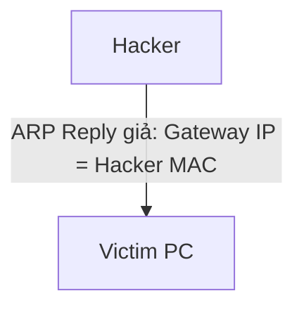

# 🌐 14.Network_Attacks: Các Loại Tấn Công Mạng & Biện Pháp Phòng Thủ - Chuyên Sâu CompTIA Network+ Cho DevOps

> 💡 **Bản chất 1 câu**: DoS/DDoS, MAC Flooding, ARP Poisoning/Spoofing, VLAN Hopping, DNS Poisoning, Man-in-the-Middle (MitM), Social Engineerin...  
> 🎯 **Trọng tâm thực chiến DevOps**: Nắm vững lý thuyết chuyên sâu, sơ đồ kiến trúc, bộ lệnh CLI chẩn đoán thực tế và bộ câu hỏi phỏng vấn tuyển dụng.

---

## 1. 🧠 Hình Hình Dung Nhanh (Intuitive Mindset)

DoS/DDoS, MAC Flooding, ARP Poisoning/Spoofing, VLAN Hopping, DNS Poisoning, Man-in-the-Middle (MitM), Social Engineering, Malware và các biện pháp phòng thủ (Port Security, DAI, DHCP Snooping).



---

## 2. 📚 Lý Thuyết Chuyên Sâu & Bản Chất Hệ Thống (Under The Hood Architecture)

### 2.1 Các Cuộc Tấn Công Mạng & Biện Pháp Phòng Thủ (OBJ 4.2)
1. **ARP Spoofing / Poisoning**: Hacker gửi gói ARP Reply giả mạo để mạo danh Gateway nghe lén (MitM).
   - **Phòng thủ**: Bật **Dynamic ARP Inspection (DAI)** trên Switch.
2. **MAC Flooding Attack**: Hacker phát hàng triệu địa chỉ MAC giả mạo làm bão hòa bảng CAM Table của Switch, ép Switch biến thành Hub.
   - **Phòng thủ**: Bật **Port Security** trên Switch (giới hạn số địa chỉ MAC trên 1 port).
3. **DHCP Spoofing (Rogue DHCP)**: Hacker bật máy chủ DHCP giả mạo cấp IP/DNS độc hại.
   - **Phòng thủ**: Bật **DHCP Snooping** trên Switch (chỉ tin cổng Trusted Server).
4. **DoS / DDoS**: Tấn công làm kiệt quệ tài nguyên (SYN Flood, UDP Amplification).


---

## 3. ⚡ Bảng Tra Cứu Câu Lệnh & Khái Niệm Thực Hành (Reference Table)

| Công cụ / Khái niệm | Loại / Protocol | Ý nghĩa chi tiết | Ứng dụng thực tế |
| :--- | :--- | :--- | :--- |
| **`ARP Spoofing`** | `L2 Attack` | Giả mạo bản tin ARP mạo danh Gateway nghe lén | `Dùng Dynamic ARP Inspection (DAI) phòng thủ` |
| **`MAC Flooding`** | `L2 Attack` | Tràn bảng CAM Table ép Switch biến thành Hub | `Dùng Port Security phòng thủ` |
| **`DHCP Snooping`** | `Switch Defense` | Chỉ cho phép cấp IP từ cổng DHCP Server hợp lệ | `Chống DHCP Server giả mạo` |
| **`DDoS`** | `L3-L7 Attack` | Tấn công từ chối dịch vụ làm sập Server | `Dùng Cloudflare / AWS Shield Anti-DDoS` |


---

## 4. 🛠 Thao Tác Thực Chiến & Kịch Bản DevOps

### 🛠 Các lệnh thực hành gõ là ăn ngay:
```bash
ip neighbor show
```

### 🚀 Kịch bản xử lý sự cố thực tế khi đi làm:
Cấu hình Port Security trên Switch cấm cắm lén Switch phụ nối thêm thiết bị: `switchport port-security maximum 2`.

---

## 5. 🚀 Bộ Câu Hỏi Phỏng Vấn DevOps & Network Thực Tế (Interview Q&A)

> **Q: Tính năng an ninh nào trên Switch giúp chống lại cuộc tấn công MAC Flooding?**  
> **A**: Tính năng **Port Security** (giới hạn số lượng địa chỉ MAC được phép xuất hiện trên 1 cổng Switch).

> **Q: Tính năng DHCP Snooping trên Switch dùng để làm gì?**  
> **A**: Dùng để ngăn chặn máy chủ DHCP giả mạo (Rogue DHCP Server) bằng cách chỉ cho phép bản tin DHCP Offer/ACK xuất hiện trên cổng Trusted.


---

## 6. 📝 Cheat Sheet Ghi Nhớ Nhanh (Summary)

- [x] ARP Spoofing: Mạo danh Gateway (Phòng thủ: DAI)
- [x] MAC Flooding: Tràn CAM Table (Phòng thủ: Port Security)
- [x] DHCP Spoofing: DHCP giả mạo (Phòng thủ: DHCP Snooping)
- [x] DDoS: Đánh sập tài nguyên

