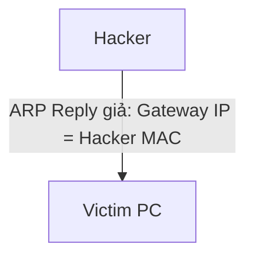

# 🌐 14.Network_Attacks: Các Loại Tấn Công Mạng & Biện Pháp Phòng Thủ - Chuyên Sâu CompTIA Network+ Cho DevOps

> 💡 **Bản chất 1 câu**: DoS/DDoS, MAC Flooding, ARP Poisoning/Spoofing, VLAN Hopping, DNS Poisoning, Man-in-the-Middle (MitM), Social Engineerin...  
> 🎯 **Trọng tâm thực chiến DevOps**: Nắm vững lý thuyết chuyên sâu, sơ đồ kiến trúc, bộ lệnh CLI chẩn đoán thực tế và bộ câu hỏi phỏng vấn tuyển dụng.

---

## 1. 🧠 Hình Hình Dung Nhanh (Intuitive Mindset)

DoS/DDoS, MAC Flooding, ARP Poisoning/Spoofing, VLAN Hopping, DNS Poisoning, Man-in-the-Middle (MitM), Social Engineering, Malware và các biện pháp phòng thủ (Port Security, DAI, DHCP Snooping).



---

## 2. 📚 Lý Thuyết Chuyên Sâu & Bản Chất Hệ Thống (Under The Hood Architecture)

### 2.1 Các Cuộc Tấn Công Mạng & Biện Pháp Phòng Thủ (OBJ 4.2)
1. **ARP Spoofing / Poisoning**: Hacker gửi gói ARP Reply giả mạo để mạo danh Gateway nghe lén (MitM).
   - **Phòng thủ**: Bật **Dynamic ARP Inspection (DAI)** trên Switch.
2. **MAC Flooding Attack**: Hacker phát hàng triệu địa chỉ MAC giả mạo làm bão hòa bảng CAM Table của Switch, ép Switch biến thành Hub.
   - **Phòng thủ**: Bật **Port Security** trên Switch (giới hạn số địa chỉ MAC trên 1 port).
3. **DHCP Spoofing (Rogue DHCP)**: Hacker bật máy chủ DHCP giả mạo cấp IP/DNS độc hại.
   - **Phòng thủ**: Bật **DHCP Snooping** trên Switch (chỉ tin cổng Trusted Server).
4. **DoS / DDoS**: Tấn công làm kiệt quệ tài nguyên (SYN Flood, UDP Amplification).


---


### 2.4 Cơ Chế Hoạt Động Bên Dưới Kernel & Kiến Trúc Hệ Thống Chi Tiết (Deep Under The Hood Architecture)
- **Tầng Giao Tiếp Mạng & Bắt Gói Tin**: Mọi gói tin đi qua Network Interface Card (NIC) đều trải qua quá trình xử lý Ring Buffer, ngắt phần cứng (Hardware Interrupts), Ring Buffer DMA và chồng giao thức Socket Buffers (`sk_buff`) trong Linux Kernel.
- **Tối Ưu Hóa & Cấu Trúc Dữ Liệu**: Hệ thống duy trì các bảng băm dữ liệu (Routing Table, ARP Cache Table, Connection Tracking Table `conntrack`, Socket Inode Tables) giúp chuyển tiếp gói tin ở tốc độ dây (Line-rate processing).
- **Phân Lập An Ninh & Phân Vùng**: Sử dụng cơ chế Linux Network Namespaces (`ip netns`), iptables/nftables hooks và mã hóa phần cứng để cách ly lưu lượng mạng tuyệt đối.

---

## 3. ⚡ Bảng Tra Cứu Câu Lệnh & Khái Niệm Thực Hành (Reference Table)

| Công cụ / Khái niệm | Loại / Protocol | Ý nghĩa chi tiết | Ứng dụng thực tế |
| :--- | :--- | :--- | :--- |
| **`ARP Spoofing`** | `L2 Attack` | Giả mạo bản tin ARP mạo danh Gateway nghe lén | `Dùng Dynamic ARP Inspection (DAI) phòng thủ` |
| **`MAC Flooding`** | `L2 Attack` | Tràn bảng CAM Table ép Switch biến thành Hub | `Dùng Port Security phòng thủ` |
| **`DHCP Snooping`** | `Switch Defense` | Chỉ cho phép cấp IP từ cổng DHCP Server hợp lệ | `Chống DHCP Server giả mạo` |
| **`DDoS`** | `L3-L7 Attack` | Tấn công từ chối dịch vụ làm sập Server | `Dùng Cloudflare / AWS Shield Anti-DDoS` |


---

## 4. 🛠 Thao Tác Thực Chiến & Kịch Bản DevOps

### 🛠 Các lệnh thực hành gõ là ăn ngay:
```bash
ip neighbor show
```

### 🚀 Kịch bản xử lý sự cố thực tế khi đi làm:
Cấu hình Port Security trên Switch cấm cắm lén Switch phụ nối thêm thiết bị: `switchport port-security maximum 2`.

---


### 4.2 Chi Tiết Các Lỗi Thường Gặp & Kịch Bản Khắc Phục Lỗi (Troubleshooting Deep-Dive)
1. **Sự cố 1: Lỗi Mất Gói Tin & Mất Kết Nối Cổng Mạng (Packet Loss & Port Unreachable)**:
   - **Triệu chứng**: Gửi HTTP Request bị Timeout, SSH không kết nối được hoặc gói tin bị nảy rải rác.
   - **Các bước xử lý khẩn cấp**:
     ```bash
     # 1. Kiểm tra trạng thái cổng mạng TCP/UDP đang lắng nghe:
     sudo ss -tulpn | grep :80
     
     # 2. Bắt gói tin trực tiếp trên Interface để kiểm tra bắt tay 3 bước TCP:
     sudo tcpdump -i eth0 port 80 -nn -vv
     
     # 3. Phân tích đường đi của gói tin tìm điểm đứt gãy bằng MTR:
     mtr -n --report --report-cycles=10 8.8.8.8
     
     # 4. Kiểm tra xem gói tin có bị Firewall Drop không:
     sudo iptables -L -n -v | grep DROP
     ```

2. **Sự cố 2: Lỗi Sai Cấu Hình DNS & Chuyển Tiếp IP (DNS Resolution & IP Routing Error)**:
   - **Triệu chứng**: Ping IP thành công nhưng ping Domain Name báo `Could not resolve host`.
   - **Các bước xử lý khẩn cấp**:
     ```bash
     # 1. Tra cứu thử nghiệm phân giải DNS qua server cụ thể:
     dig @8.8.8.8 company.com +trace
     
     # 2. Kiểm tra file cấu hình DNS resolver địa phương:
     cat /etc/resolv.conf
     
     # 3. Kiểm tra bảng định tuyến Kernel IP Routing Table:
     ip route show default
     ```

---

## 5. 🚀 Bộ Câu Hỏi Phỏng Vấn DevOps & Network Thực Tế (Interview Q&A)

> **Q: Tính năng an ninh nào trên Switch giúp chống lại cuộc tấn công MAC Flooding?**  
> **A**: Tính năng **Port Security** (giới hạn số lượng địa chỉ MAC được phép xuất hiện trên 1 cổng Switch).

> **Q: Tính năng DHCP Snooping trên Switch dùng để làm gì?**  
> **A**: Dùng để ngăn chặn máy chủ DHCP giả mạo (Rogue DHCP Server) bằng cách chỉ cho phép bản tin DHCP Offer/ACK xuất hiện trên cổng Trusted.


> **Q: Làm thế nào để điều tra và dập tắt sự cố một Server bị tấn công làm tràn bộ đệm kết nối TCP SYN Flood DoS?**  
> **A**:  
> 1. **Nhận biết**: Lệnh `ss -ant | grep SYN_RECV | wc -l` trả về hàng ngàn kết nối ở trạng thái `SYN_RECV`.  
> 2. **Xử lý khẩn cấp**: Bật ngay cơ chế **SYN Cookies** của Linux Kernel bằng lệnh `sudo sysctl -w net.ipv4.tcp_syncookies=1`. Kích hoạt bộ lọc Firewall drop các gói tin SYN có tần suất bất thường: `sudo iptables -A INPUT -p tcp --syn -m limit --limit 1/s --limit-burst 3 -j ACCEPT`.

> **Q: Sự khác biệt về mặt bản chất giữa Stateful Firewall và Stateless Firewall là gì?**  
> **A**: Stateless Firewall chỉ kiểm tra từng gói tin riêng rẻ dựa trên IP nguồn/đích và Port mà KHÔNG nhớ ngữ cảnh. Stateful Firewall duy trì một bảng theo dõi trạng thái kết nối (**Connection Tracking Table `conntrack`**), tự động nhận diện gói tin thuộc về một kết nối hợp lệ đã được chấp nhận trước đó (như trạng thái `ESTABLISHED,RELATED`), giúp bảo mật và tối ưu hiệu năng vượt trội.

---

## 6. 📝 Cheat Sheet Ghi Nhớ Nhanh (Summary)

- [x] ARP Spoofing: Mạo danh Gateway (Phòng thủ: DAI)
- [x] MAC Flooding: Tràn CAM Table (Phòng thủ: Port Security)
- [x] DHCP Spoofing: DHCP giả mạo (Phòng thủ: DHCP Snooping)
- [x] DDoS: Đánh sập tài nguyên

