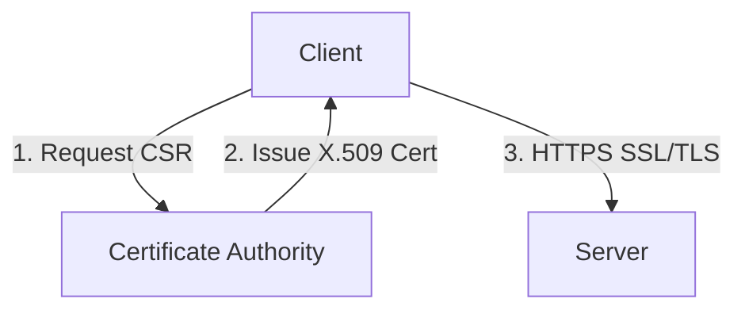

# 🌐 15.Logical_Security_and_PKI: Bảo Mật Logic, IAM, AAA, Mã Hóa & Hạ Tầng PKI - Chuyên Sâu CompTIA Network+ Cho DevOps

> 💡 **Bản chất 1 câu**: IAM, MFA, AAA Protocols (RADIUS, TACACS+), Mã hóa Đối xứng (AES) vs Bất đối xứng (RSA/ECC), IPsec (AH vs ESP, IKEv1/v2) ...  
> 🎯 **Trọng tâm thực chiến DevOps**: Nắm vững lý thuyết chuyên sâu, sơ đồ kiến trúc, bộ lệnh CLI chẩn đoán thực tế và bộ câu hỏi phỏng vấn tuyển dụng.

---

## 1. 🧠 Hình Hình Dung Nhanh (Intuitive Mindset)

IAM, MFA, AAA Protocols (RADIUS, TACACS+), Mã hóa Đối xứng (AES) vs Bất đối xứng (RSA/ECC), IPsec (AH vs ESP, IKEv1/v2) và PKI X.509 Digital Certificates.



---

## 2. 📚 Lý Thuyết Chuyên Sâu & Bản Chất Hệ Thống (Under The Hood Architecture)

### 2.1 AAA, Mã Hóa & Hạ Tầng PKI (OBJ 4.1)
1. **Mô Hình AAA**: **Authentication** (Bạn là ai?) - **Authorization** (Bạn được làm gì?) - **Accounting** (Bạn đã làm gì?). Triển khai qua **RADIUS** (Wi-Fi) và **TACACS+** (Router/Switch Cisco).
2. **Mã Hóa Đối Xứng vs Bất Đối Xứng**:
   - **Mã hóa Đối xứng (AES-256)**: Dùng **CÙNG 1 KHÓA** để mã hóa và giải mã. Tốc độ cực nhanh.
   - **Mã hóa Bất đối xứng (RSA/ECC)**: Dùng **CẶP KHÓA** (Public Key / Private Key). Dùng xác thực và chữ ký số.
3. **IPsec VPN (Layer 3)**:
   - **AH (Authentication Header)**: Xác thực nguồn gốc (KHÔNG mã hóa).
   - **ESP (Encapsulating Security Payload)**: **MÃ HÓA DỮ LIỆU** + Xác thực.
4. **PKI & X.509 Certificate**: Máy chủ chứng thực **CA** ký số cấp chứng chỉ X.509 để xác thực SSL/TLS HTTPS.


---

## 3. ⚡ Bảng Tra Cứu Câu Lệnh & Khái Niệm Thực Hành (Reference Table)

| Công cụ / Khái niệm | Loại / Protocol | Ý nghĩa chi tiết | Ứng dụng thực tế |
| :--- | :--- | :--- | :--- |
| **`AAA`** | `RADIUS / TACACS+` | Authentication - Authorization - Accounting | `Xác thực user Wi-Fi / Router` |
| **`AES-256`** | `Symmetric` | Mã hóa đối xứng siêu tốc chuẩn quân đội | `Mã hóa đĩa cứng / TLS Payload` |
| **`RSA / ECC`** | `Asymmetric` | Mã hóa bất đối xứng cặp Public/Private Key | `Chữ ký số, HTTPS Handshake, SSH Key` |
| **`IPsec ESP`** | `Layer 3 Security` | Mã hóa toàn bộ dữ liệu IP Packet cho VPN | `Site-to-Site VPN giữa 2 chi nhánh` |
| **`X.509`** | `PKI Cert Standard` | Chứng chỉ số chứa Public Key và con dấu ký của CA | `HTTPS SSL/TLS Certificate` |


---

## 4. 🛠 Thao Tác Thực Chiến & Kịch Bản DevOps

### 🛠 Các lệnh thực hành gõ là ăn ngay:
```bash
openssl req -new -newkey rsa:4096 -nodes -keyout app.key -out app.csr
sudo certbot --nginx -d app.company.com
```

### 🚀 Kịch bản xử lý sự cố thực tế khi đi làm:
Sự cố kênh VPN Site-to-Site giữa 2 chi nhánh bị đứt do cấu hình lệch Phase 1/Phase 2 IKE proposal.

---

## 5. 🚀 Bộ Câu Hỏi Phỏng Vấn DevOps & Network Thực Tế (Interview Q&A)

> **Q: Sự khác biệt cốt lõi giữa IPsec AH và IPsec ESP là gì?**  
> **A**: IPsec AH chỉ xác thực nguồn gốc (KHÔNG mã hóa dữ liệu). IPsec ESP vừa **MÃ HÓA DỮ LIỆU** bảo mật vừa xác thực nguồn gốc.

> **Q: Ba thành phần của mô hình AAA đại diện cho các từ nào?**  
> **A**: Authentication (Xác thực danh tính), Authorization (Cấp quyền thao tác), và Accounting (Ghi nhật ký audit).


---

## 6. 📝 Cheat Sheet Ghi Nhớ Nhanh (Summary)

- [x] AAA: Authentication - Authorization - Accounting
- [x] Mã hóa đối xứng (AES): Cùng 1 khóa, nhanh
- [x] Mã hóa bất đối xứng (RSA/ECC): Public/Private Key
- [x] IPsec ESP: Mã hóa IP packet cho VPN
- [x] X.509: Chứng chỉ số SSL/TLS

